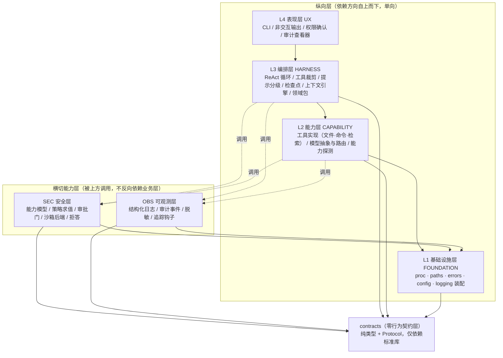

# 0015. 分层模型、复用组件清单与自研边界

- **状态**：**已接受（2026-09-18）**
  —— 项目所有者 `Le0n3rd` 于 2026-09-18 审阅 AI 给出的 D1~D10 建议后**批准**；
  其中 **D2 附加用途限定**（pydantic **仅用于两处**：信任边界校验 + 工具参数 JSON Schema 生成）、
  **D3 由 `httpx` 改选 `urllib3` 2.x**。逐条批准明细见 §8.1。
  按项目规则"**引入依赖需事先确认**"，各组件仍须**通过 §7.4 的可安装性与类型兼容验证后**
  方可写入 `pyproject.toml` 的 `dependencies`；**D7（构建后端）暂缓**，待 V-a 核验。
- **日期**：2026-09-18
- **决策者**：`Le0n3rd`（2026-09-18 批准）／AI 代理（整理与论证）
- **相关**：[ADR-0003 §5.1](0003-select-base-project.md)（5 个自研模块，本 ADR 落到具体层）、
  [ADR-0004](0004-python-toolchain-baseline.md)（工具链）、
  [ADR-0005](0005-single-primary-language.md)（Python 单一主语言）、
  [ADR-0006](0006-sandbox-execution-degradation.md) / [ADR-0007](0007-sandbox-capability-matrix.md)（沙箱分层与机制类别）、
  [ADR-0010](0010-dynamic-hardware-adaptation.md) / [ADR-0011](0011-tier-composition-revision.md)（三档）、
  [ADR-0014](0014-benchmark-automation.md)（测量纪律与数据分支）、
  [SRS §7](../requirements/srs.md)、[`design/README.md`](../design/README.md)、
  [`engineering/doc-consistency-report.md`](../engineering/doc-consistency-report.md)（A-1、B3、B4）、
  [提案 0003](../proposals/0003-lowspec-coding-agent.md)
- **取代范围**：**`ADR-0003` §6~§8 为历史残留，自本文起不再作为任何工作的前置条件**（见 §5.5）。

---

## 1. 背景与问题

2026-09-18 的全库一致性核查给出了两条关键结论
（[`doc-consistency-report.md`](../engineering/doc-consistency-report.md) §B3、§B4）：

> 当前仓库是"**一流的工程地基 + 一个完整可跑的基准评测子系统**"，**不是产品主体**。
> 产品六层里有五层**只有零散零件、没有骨架**，且缺"威胁模型 + 模块划分 ADR"这两个设计前置件。

具体事实（读代码得出，非推测）：

| 事实 | 证据 |
| --- | --- |
| `src/agent_sec_perf/` 下**唯一有实现的子系统是 `bench/`** | 12 个模块 + 4 个夹具；`tests/unit/` 9 个测试模块 |
| **`pyproject.toml` 的运行期依赖为空** | `dependencies = []`（`pyproject.toml:27`） |
| 可直接复用的产品地基只有 3 处 | `bench/proc.py`（唯一子进程封装）、`bench/paths.py`（路径白名单）、`bench/errors.py`（异常层次） |
| 状态矛盾已修，但**根因未除** | A-2 已统一表述为"方向已定、**复用组件清单未产出**"，因此 §9 的"base project 选型冻结"**无法判定完成** |

由此产生三个必须在动工前回答的问题——它们构成本文的主体：

1. **产品怎么分层？** 层次边界在哪、谁可以依赖谁、边界处用什么接口？
2. **每层用什么开源组件？** 选组件 = **新增依赖**，是项目规则里必须事先确认的"真决策"。
3. **我们自己写什么、不写什么？** 这是防范围失控（SRS 风险 `R-2`）的关键，
   "不写什么"必须显式列出，否则边界会持续扩张。

> 本文**只做架构决策，不写产品级设计细节**（数据结构与算法级的说明在
> `docs/design/architecture.md` 展开，属后续交付物）。本文给出的接口是**契约级**的
> ——类型、错误语义、并发假设、资源生命周期——足以让实现工程师照着开工。

---

## 2. 决策驱动因素

| 编号 | 因素 | 说明 | 类型 |
| --- | --- | --- | --- |
| D-1 | **无 GPU、无 KVM、无付费依赖** | CPU-only；本地模型为 4B/8B 级，经 llama.cpp 的 `llama-server` 提供 | 硬约束 |
| D-2 | **Python ≥ 3.12 且单一主语言** | ADR-0005；不引入 Go / TypeScript | 硬约束 |
| D-3 | **`mypy --strict` 必须通过** | ADR-0004；选型时"有无 `py.typed`"是**硬性考量点** | 硬约束 |
| D-4 | **安全基线优先级最高** | 不可信内容一律视为数据；默认拒绝；fail-secure；子进程必须经统一封装；路径白名单 | 硬约束 |
| D-5 | **单人 + 2~3 个月，首要目标是"能完成"** | 组件必须减少工作量；自研范围必须可枚举 | 硬约束 |
| D-6 | **低资源与可移植** | 8 GiB 内存可跑；面向桌面与移动端共同约束设计（无 x86 专有依赖） | 硬约束 |
| D-7 | **新增依赖需先确认** | `pyproject.toml` 只允许标准库 + 已声明依赖；新增依赖需说明用途/替代/体积/许可证/安全影响 | 硬约束 |
| D-8 | **可验证性** | 分层与安全约定必须能落成**机器检查**，否则迟早被绕过（devlog 0013 §6 的教训） | 硬约束 |
| D-9 | 差异化能力在 Python AI 生态 | 上下文工程、护栏、评估、检索 | 偏好 |
| D-10 | 现有参照物足够 | `bench/runner.py`（llama-server 生命周期 + `chat()`）、`bench/proc.py`、`bench/store.py` | 参考 |

---

## 3. 候选方案（分层与横切的组织方式）

问题不是"要不要分层"，而是"**安全层与可观测层是纵向层还是横切能力层**"。

### 方案 A：四层纵向 + 两个横切能力层 + 一个零行为契约层（**采纳**）

- 简述：纵向 `UX → HARNESS → CAPABILITY → FOUNDATION`；
  `security/` 与 `observability/` 作为**横切能力层**（被上方调用，绝不反向依赖业务层）；
  另设 `contracts/` 只放类型与 `Protocol`，谁都可以依赖它、它不依赖任何人。
- 优点：安全层的位置与其真实形态一致（**在每个特权操作点上被调用**，而非某一段流水线）；
  依赖方向可以用一条 DAG 严格表达并可机器检查；契约层消除"安全层需要知道工具调用形状、
  工具层需要调用安全层"的**循环依赖**。
- 缺点：多一个"只放类型"的目录，边界感需要靠纪律维持；实现者要理解"横切"的含义。

### 方案 B：六层纵向平铺（安全层、可观测层各成一个纵向层）

- 简述：`UX / HARNESS / MODEL / TOOL / SEC / OBS` 依次排列。
- 优点：层次直观，每层对应一个 SRS 分组，便于讲解。
- 缺点：**安全层的纵向位置无解**——放在 `TOOL` 之下则看不到 `HARNESS` 的行为（无法拦截），
  放在 `UX` 之上则无法被 `TOOL` 复用（工具执行本身就是特权操作）。
  可观测层同理（审计是安全的记录面，必须能被每个层写入）。
  结果是不得不添加大量"反向引用"例外，**依赖方向失去约束力**。

### 方案 C：不成层，按功能模块平铺

- 简述：`model/`、`tools/`、`harness/`、`policy/`… 全平铺，靠命名约定。
- 优点：起步最快，无层次设计成本。
- 缺点：与现状（B4：五层只有零散零件）无法区分；无法回答"谁能依赖谁"，
  最终必然退化为 `harness` 直接 `import subprocess`、`cli` 直接读密钥。
  **与 D-4、D-8 直接冲突。**

---

## 4. 权衡对比

| 评估维度 | 权重 | A（纵向 + 横切 + 契约） | B（六层平铺） | C（不成层） |
| --- | --- | --- | --- | --- |
| 依赖方向可表达 | 5 | **5** | 2（需大量例外） | 1 |
| 安全层落位与其真实形态一致 | 5 | **5** | 2 | 2 |
| 可实现性（单人可落地） | 4 | 4 | 4 | **5** |
| 可机器检查（D-8） | 4 | **5** | 3 | 1 |
| 与 SRS §7 分组的可映射性 | 3 | 4 | **5** | 3 |
| 起步成本（越低越高分） | 2 | 3 | 3 | **5** |
| **加权合计** | | **112** | 76 | 60 |

> A 相对 B 的差距集中在"安全层的纵向位置无解"这一条。这不是审美问题：
> 若安全层拿不到特权操作点的调用权，`REQ-SEC-01`（工具调用默认拒绝）与
> `REQ-SEC-06`（全链路审计）就**没有实现载体**，安全主线会退回纸面。

---

## 5. 决策

**决定采用：方案 A —— 四层纵向 + 两个横切能力层 + 一个零行为契约层。**

理由：

1. **安全与可观测的真实形态是横切的**：`REQ-SEC-01` 要求"工具调用默认拒绝"，
   `REQ-SEC-06` 要求"每次调用与决策可回放"——两者都不是某一段流水线，
   而是**在每个特权操作点上被调用**。横切定义与它们的实现方式一致。
2. **依赖方向必须能被机器检查**（D-8）：单一 DAG + 明确禁止表可以写成测试，
   而同层平铺只能靠人工记性（2026-09-16 已因"约定只写在文档里"丢过一次内容）。
3. **契约层是消除循环依赖的最小手段**：安全层需要知道 `ToolCall` 的形状，
   工具层需要调用安全层求权限；把"形状"下沉到 `contracts/`（纯类型、零行为、零第三方依赖）
   即可让两边都只依赖契约，而不互相依赖。

### 5.1 分层模型

#### 5.1.1 层次与依赖方向



**依赖方向硬规则**（可直接翻译成测试，见 §7.1）：

| 规则 | 内容 |
| --- | --- |
| R1 | 纵向层**只能向下依赖**（`cli` → `harness` → `model`/`tools` → `foundation`），**禁止向上**。 |
| R2 | `security/` 与 `observability/` **不得** `import` `harness/`、`tools/`、`model/`、`cli/`。 |
| R3 | `contracts/` **不得**依赖任何第三方包，也**不得**依赖本项目任何其他模块。 |
| R4 | 全项目**唯一**子进程入口是 `foundation/proc.py`；**唯一**路径校验入口是 `foundation/paths.py`。 |
| R5 | 领域包（Domain Pack）**只加载声明式配置**（TOML/JSON），**禁止加载其中的 Python 代码**（见 §5.3 模块 5）。 |

#### 5.1.2 层次边界与边界处接口形态

| 边界 | 上游 → 下游 | 接口形态 | 错误语义 | 并发假设 | 资源生命周期 |
| --- | --- | --- | --- | --- | --- |
| UX ↔ HARNESS | `cli` → `harness.Session` | `Session.run(task: str) -> AsyncIterator[SessionEvent]`（事件流；非交互模式序列化为 JSON） | 业务失败以 `SessionEvent(kind="error")` 表达，**不抛异常到 CLI**；只有 `ConfigError` 会冒泡 | **单会话单线程**；事件流串行产出 | `with Session(...) as s:`；退出时按序：工具 → 模型客户端 → llama-server 进程 → flush 审计 |
| HARNESS ↔ CAPABILITY | `harness` → `tools.ToolRegistry` / `model.ModelClient` | `ToolRegistry.resolve(name) -> Tool`；`Tool.invoke(args, ctx) -> ToolResult`；`ModelClient.chat(messages, tools, ...) -> ModelResponse` | `ToolResult.ok=False` 表达工具级失败（可回喂）；`ModelUnavailableError` 触发路由降级；`ModelProtocolError` 触发一次重试后回喂 | `ModelClient` **非线程安全**；一个会话一个实例（llama-server 默认 `-np 1`） | `close()` 幂等；进程型后端由 `ExitStack` 托管 |
| HARNESS/CAPABILITY ↔ SEC | 任意特权操作前 → `security.PolicyEngine.decide()` | `decide(PolicyRequest) -> PolicyDecision` | **fail-secure**：`decide()` 内部任何异常都**不得**逃逸为 allow；返回 `allow=False, requires_confirmation=True` | 无状态、纯函数式；可多线程调用 | 无 |
| HARNESS/CAPABILITY ↔ OBS | 任意位置 → `observability.AuditSink.emit()` | `emit(AuditEvent) -> None` | 审计写入失败**必须**冒泡（"可回放"是 `REQ-SEC-06` 的验收标准，静默丢事件等于验收失败） | 无状态；实现内部串行化写入 | 进程退出前必须 `flush()` |
| CAPABILITY ↔ FOUNDATION | `model`/`tools` → `proc.run/spawn`、`paths.resolve_within` | `proc.run(argv, cwd, timeout_s, isolation) -> CommandResult`；`paths.resolve_within(candidate, roots, what) -> Path` | `IsolationError`（隔离失败**不得**回退）、`ProtocolError`（超时/无法启动）、`PathNotAllowedError`（越界） | 阻塞式；`spawn` 返回的进程句柄不跨线程共享 | 一次性工作目录由调用方负责创建与清理 |

> **契约的类型形状**（节选，完整定义在 `docs/design/interfaces/`，属后续交付物）：

```python
# contracts/tools.py —— 形状示意，非最终代码
@dataclass(frozen=True)
class ToolCallRequest:
    call_id: str
    name: str
    arguments_json: str  # 原始 JSON 文本：**不可信，尚未解析**


@dataclass(frozen=True)
class ToolResult:
    ok: bool
    content: str
    error: str | None = None
    truncated: bool = False
    audit_id: str | None = None


class Tool(Protocol):
    @property
    def spec(self) -> ToolSpec: ...
    def invoke(self, args: Mapping[str, object], *, ctx: ExecutionContext) -> ToolResult: ...
```

**关键约定**：`Tool.invoke` 收到的 `args` 是**已校验的结构化参数**
（由 HARNESS 在信任边界处按 `ToolSpec.parameters_schema` 校验）；
`invoke` **不得**再解析原始 JSON 字符串——否则校验会被绕过，
违反"不可信内容一律视为数据"（D-4）。

#### 5.1.3 与 SRS §7 需求分组的映射

SRS §7 的 9 个分组**不是 9 个层**，而是 9 组需求。映射关系如下（这是本 ADR 与 SRS 的对接面）：

| SRS §7 分组 | 条目数 | 落在哪层 | 承载模块 |
| --- | --- | --- | --- |
| `MODEL` | 6 | L2 能力层 | `model/`（本地 `llama-server` 客户端 + 云端 OpenAI 兼容客户端 + 路由 + 能力探测） |
| `HARNESS` | 8 | L3 编排层 | `harness/`（循环 / 提示 / 工具裁剪 / 检查点 / 错误分级 / 领域包） |
| `SEC` | 9 | **横切 SEC** | `security/`（能力模型 / 策略 / 审批 / 沙箱 / 拒答）+ `observability/`（审计） |
| `PERF` | 8 | L3 编排层 + L1 基础设施 + `bench/` | `harness/context/`（上下文效率）、`foundation/`（硬件探测）、`bench/`（`REQ-PERF-04`/`07`/`08`） |
| `TOOL` | 3 | L2 能力层 | `tools/`（内置工具 + MCP 接入（Should）+ 描述校验） |
| `UX` | 6 | L4 表现层 | `cli/`（Typer 应用、交互 / 非交互、权限确认、中文优先） |
| `OBS` | 2 | **横切 OBS** | `observability/`（结构化日志、审计查询；追踪为 Could 且可选） |
| `PLAT` | 3 | L1 基础设施 + 全仓 | `foundation/`（平台差异收敛）、CI 多平台构建 |
| `OPS` | 4 | 工程地基（已有） | `Makefile` / `.cnb.yml` / `tests/` / `docs/` |

> 该表同时关闭了 A-6 的一半问题：`REQ-` 前缀集合是
> `MODEL / HARNESS / SEC / PERF / TOOL / UX / OBS / PLAT / OPS`，**没有 `KERNEL`**
> （`docs/requirements/README.md` 里的 `KERNEL` 示例是残留，由记录员另行修正）。

### 5.2 复用组件清单

> **核验纪律**：下表"核验状态"列中，标 **✅ 已核验** 的条目于 2026-09-18 逐个访问了
> 对应 PyPI 项目页（或项目官方许可证页）并抄录版本、许可证与依赖字段；
> 未核验的一律标 **【待核验】** 并给出验证方式，**不写印象中的数字**。
> 逐行均已由所有者于 2026-09-18 拍板（§8.1）；但**依赖仍需通过 §7.4 验证后**方可写入
> `pyproject.toml`——**已批准 ≠ 已可安装**，未核验的许可证与体积不得写进结论性表述。
> **行标识约定**：本节表内的行标识（如 `A1` / `B1` / `HTTP-1`）**仅用于表内引用**，
> 与 §8.1 的决策编号 `D1~D10` **不同名、不同义**——引用时必须写明是
> "§5.2.x 的行" 还是 "§8.1 的决策"，不得只写 `D1`。

#### 5.2.1 CLI 框架与终端渲染

| # | 拟选 | 用途 | 备选方案 | 选择理由 | 许可证 | 体积 / 传递依赖 | 维护活跃度 | 核验状态 |
| --- | --- | --- | --- | --- | --- | --- | --- | --- |
| A1 | **Typer** `0.27.2` | 产品 CLI 入口：子命令、参数校验、帮助、`--output-format json` 非交互模式 | ① `argparse`（标准库，`bench/rounds.py` 现状）② `click` | 类型提示驱动，与 `mypy --strict` 天然配合；子命令与参数校验代码量最小；满足 `REQ-UX-01` | MIT | 传递依赖：`rich`、`shellingham`、`annotated-doc`、`colorama`（仅 Windows）；**0.26.0 起不再依赖 `click` 包**（改为内嵌 vendored Click 源码） | 0.27.2 发布于 2026-08-28；2026 年 5 月起持续发版 | ✅ 已核验（[PyPI typer](https://pypi.org/project/typer/)） |
| A2 | **Rich** `15.0.0` | 终端渲染：表格、进度、语法高亮、错误展示 | ① 自研 ANSI 转义 ② `colorama` | 已是 Typer 的传递依赖，独立引入**零新增成本**；输出可关闭（`TYPER_USE_RICH=0`）以适配哑终端 | MIT | README 提及使用 `pygments` 做语法高亮；**PyPI 页面未列出完整依赖字段 ⇒ 传递依赖集合【待核验】**（**2026-09-19 已核验，结果见 §8.2.1**） | 15.0.0 发布于 2026-04-12 | 版本与许可证 ✅ 已核验（[PyPI rich](https://pypi.org/project/rich/)）；**依赖集合 ✅ 已核验（`V-c`，2026-09-19）**：`markdown-it-py>=2.2.0`、`pygments<3.0.0,>=2.13.0` |
| A3 | ~~Textual~~ | TUI（`REQ-UX-05`，Should） | — | **本期不引入**，推迟到 CLI 稳定后（见 §5.2.6） | — | — | 8.2.8 发布于 2026-06-30 | ✅ 已核验（[PyPI textual](https://pypi.org/project/textual/)），记录备查 |

#### 5.2.2 数据模型与校验

| # | 拟选 | 用途 | 备选方案 | 选择理由 | 许可证 | 体积 / 传递依赖 | 维护活跃度 | 核验状态 |
| --- | --- | --- | --- | --- | --- | --- | --- | --- |
| B1 | **pydantic** `2.13.5`（**D2 已通过，但限定用途**） | **仅两处用途（D2 限定）**：① **信任边界校验**——工具参数（按 `ToolSpec.parameters_schema`）与模型输出（tool call 参数）解析后的严格校验；② **工具参数 JSON Schema 生成**（`parameters_schema` 由模型类生成）。**配置解析不用它**（仍用 `tomllib`，§5.2.3）；**内部数据结构不用它**（仍用 `dataclasses`） | ① `dataclasses` + 手写校验（**回退路径，D2 明确保留**；**现状**：`bench/store.py` 的 `validate_round` 即此模式，已跑通） ② `attrs` | 安全主线（D-4）的核心是"不可信输入必须校验"；pydantic 的严格模式 + 完备类型标注 + 自带 **JSON Schema**（可直接作为 `ToolSpec.parameters_schema` 暴露给 tool calling）能显著减少自研校验代码与出错面。**用途限定后其影响面收敛在两个明确的信任边界点上** | MIT | 传递依赖包含 **`pydantic-core`（Rust 编译扩展）**，平台 wheel；**精确依赖集合未在 PyPI 页面显示 ⇒ 【待核验】**（V-b；**2026-09-19 已核验，结果见 §8.2.1**） | 2.13.5 发布于 2026-08-28；有 `2.14.0b2` 预发布 | 版本与许可证 ✅ 已核验（[PyPI pydantic](https://pypi.org/project/pydantic/)）；**依赖集合 ✅ 已核验（`V-b`，2026-09-19）**：`annotated-types`、`pydantic-core==2.46.5`、`typing-extensions`、`typing-inspection`；**aarch64 / win_amd64 官方 wheel 均存在**（cp312：1.86 MB / 1.95 MB）；**Termux 仍无官方 wheel**（`V-j` 的已知风险不变） |

> **D2 的用途限定（2026-09-18 所有者批准）**：pydantic **只用于两处**——
> **信任边界校验**与**工具参数 JSON Schema 生成**；**配置解析仍用 `tomllib`**、
> **内部数据结构仍用 `dataclasses`**。采纳后 **V-b（精确依赖/体积）与 V-j（aarch64/Termux 可安装性）
> 作为验证项保留**（§8.2），**回退路径（手写校验）保留不变**。
>
> **B1 的负面后果（必须承认）**：`pydantic-core` 是**编译扩展**，
> 会给"低资源 + 可移植 + 未来移动端"（D-6）带来三处成本：安装体积增大、
> 平台矩阵变宽、Termux/Android 上**已知没有官方预编译 wheel**（实查依据见 §8.2 V-j）。
> 缓解：移动端本期**不是交付项**（SRS §6.3、Q-2），风险后置；
> 若届时不可安装，回退路径是**手写校验**（`bench/store.py` 已验证该模式可行），
> 并新增 ADR 记录降级。

#### 5.2.3 配置解析

| # | 拟选 | 用途 | 备选方案 | 选择理由 | 许可证 | 体积 / 传递依赖 | 维护活跃度 | 核验状态 |
| --- | --- | --- | --- | --- | --- | --- | --- | --- |
| C1 | **`tomllib`**（标准库） | 读取 `~/.lowspec/config.toml` 与项目级 `.lowspec.toml` | ① `PyYAML` ② `configparser`（INI） ③ `pydantic-settings` | 标准库（Python 3.11+ 内置），**零依赖、零信任面**；格式与 `pyproject.toml` 一致，减少认知负担 | PSF-2.0（随 CPython） | 无 | 随 CPython 发布 | ✅ 标准库 |
| C2 | **platformdirs** `4.11.9` | 解析跨平台用户目录（配置 / 缓存 / 数据），避免手写 XDG 与 Windows 路径分支 | ① 手写 `os.environ` + XDG 规则 ② `appdirs`（已不活跃） | 零运行期依赖、typed、跨平台（Windows/Linux/macOS）覆盖 `REQ-PLAT-01`；手写规则是 `REQ-PLAT-01` 上最容易出错的地方 | MIT | **无运行期依赖** | 4.11.9 发布于 2026-09-16，2026 年 7 月起高频发版 | ✅ 已核验（[PyPI platformdirs](https://pypi.org/project/platformdirs/)） |

#### 5.2.4 HTTP 客户端（云端模型）

| # | 拟选 | 用途 | 备选方案 | 选择理由 | 许可证 | 体积 / 传递依赖 | 维护活跃度 | 核验状态 |
| --- | --- | --- | --- | --- | --- | --- | --- | --- |
| HTTP-1 | **`urllib3` 2.x**（**D3 已选**；**精确版本 ✅ `2.8.0`**，2026-09-19 核验） | 云端模型（OpenAI 兼容端点）的同步请求；统一超时、连接池、响应体上限。本地 `llama-server` 走回环 HTTP，可与云端共用同一薄客户端（实现 `REQ-MODEL-03` 统一抽象） | ① 标准库 `http.client`（`bench/runner.py` 现状，仅回环、无 TLS/重定向/流式便利） ② **`httpx`（本轮由拟选改为备选，理由见 HTTP-2 行）** ③ `requests`（同步单一，无类型标注；**其稳定线"同样停滞"【待核验】**） | 2.x 线**活跃**（`2.7.0` 变更日志，页面标注 2026-05-07）；**纯 Python、无编译扩展**——相对 `httpx`/`pydantic-core` 的**可移植性优势**（D-6）；**代理默认值更保守**：urllib3 的代理是**显式**的（需自己构造 `ProxyManager`），而 `httpx`/`requests` **默认读取 `HTTP(S)_PROXY` 环境变量**（需显式 `trust_env=False` 关闭）——对"出站默认拒绝 + 白名单放行"（D-4）的默认值取向更合适 ✅ **已实测（`V-n`，2026-09-19）** | **MIT ✅ 已核验（`V-m`，2026-09-19）** | **纯 Python、无编译扩展**已确认；**无必装运行期依赖**（`brotli` / `h2` / `pysocks` / `zstd` 均为 extra）✅ | 最新版 **`2.8.0`**（撰写时记的 `2.7.0` **已过期**）✅ | **✅ 已核验（`V-m`，2026-09-19）**（[PyPI urllib3](https://pypi.org/project/urllib3/)） |
| HTTP-2 | ~~`httpx`~~ `0.28.1` | 云端模型客户端（**本轮改为备选、不选**） | ① `urllib3` 2.x（**已选**，见 HTTP-1 行） ② 标准库 `http.client` | **D3 改选 `urllib3`，理由**：① 最新稳定版 `0.28.1` 发布于 **2024-12-06**，稳定线已约 **21 个月**未更新；② **1.0 破坏性变更在即**（`0.28.0` 已移除 `proxies`/`app`、弃用 `verify` 字符串与 `cert`）；③ **默认读取 `HTTP(S)_PROXY` 环境变量**（需 `trust_env=False` 关闭），与"出站默认拒绝 + 白名单放行"不符 | BSD-3-Clause | `httpcore`、`h11`、`certifi`、`idna`、`sniffio` | ⚠️ 稳定线停滞（`0.28.1`，2024-12-06）；`1.0.dev1`（2025-07-02）→ `1.0.dev6`（2026-08-31），中间静默约 11 个月。**该预发布线仅出自 `packagetrack.dev` 单一来源，且抓取 GitHub Releases 页时未见 1.0 预发布（动态加载部分失败、仅第 1 页）⇒ 需以 PyPI 官方页二次确认** | 版本与许可证 ✅ 已核验（[PyPI httpx](https://pypi.org/project/httpx/)）；1.0 预发布线与维护状态【待核验】（V-e：**随 D3 改选而关闭**，保留为改选依据） |
| HTTP-3 | ~~`openai` SDK~~ `3.14.1` | 云端模型客户端 | — | **本期不引入**：本地 `llama-server` 已是 OpenAI 兼容端点，自研薄客户端可同时覆盖本地与云端，避免为云端引入重量级 SDK 与版本耦合（详见 §5.2.6） | Apache-2.0 | 文档提到 `pydantic`、`websockets`，以及一个名为 `httpx2` 的默认 HTTP 客户端；**精确依赖集合未核验 ⇒ 【待核验】**（**2026-09-19 已核验，结果见 §8.2.1**） | 3.14.1 发布于 2026-09-15 | 版本与许可证 ✅ 已核验（[PyPI openai](https://pypi.org/project/openai/)）；**依赖集合 ✅ 已核验（`V-h`，2026-09-19）**：`anyio`、**`httpx2<3,>=2.7.0`**、`jiter`、`pydantic`、`sniffio`、`typing-extensions`（3.16.0） |

#### 5.2.5 结构化日志、代码检索、测试、打包

| # | 拟选 | 用途 | 备选方案 | 选择理由 | 许可证 | 体积 / 传递依赖 | 维护活跃度 | 核验状态 |
| --- | --- | --- | --- | --- | --- | --- | --- | --- |
| E1 | **structlog** `26.1.0` | 结构化日志与**脱敏管线**（`REQ-OBS-01`、`REQ-SEC-07` 的"敏感信息不入日志"） | ① 标准库 `logging` + 自研 JSON formatter ② `loguru` | **零运行期依赖**、typed；processor 管线天然适配"先脱敏、再输出"的顺序，而"脱敏"正是安全需求；可与 stdlib `logging` 共存（`bench/rounds.py` 的现有配置无需改写） | `MIT OR Apache-2.0`（双许可） | **无运行期依赖** | 26.1.0 发布于 2026-06-06；上一版 25.5.0（2025-10-27） | ✅ 已核验（[PyPI structlog](https://pypi.org/project/structlog/)、[structlog.org/license](https://www.structlog.org/en/stable/license.html)） |
| F1 | **tree-sitter** `0.26.0` + 语法包 | 仓库索引与 repo map（上下文效率引擎的符号层，`REQ-PERF-02`/`03`） | ① 标准库 `ast`（**仅 Python**，零依赖） ② 正则 + `rg` 子进程 | 增量解析、多语言、**预编译 wheel 无需编译**、主包零依赖；SRS §9 已将它列为关键依赖 | MIT（主包） | 主包**无库依赖**；语言语法为**独立包**（如 `tree-sitter-python`），需另行安装 ⇒ **语法包版本与许可证【待核验】**（**2026-09-19 已核验，结果见 §8.2.1**） | 0.26.0 发布于 2026-06-30 | 主包 ✅ 已核验（[PyPI tree-sitter](https://pypi.org/project/tree-sitter/)）；**语法包 ✅ 已核验（`V-d`，2026-09-19）**：`tree-sitter-python` **0.25.0 / MIT**，`cp310-abi3` wheel 覆盖 aarch64 与 win_amd64；**与主包 0.26.0 运行期实测兼容** |
| G1 | **pytest** / **pytest-cov** `7.1.0` / **pytest-xdist** | 测试与覆盖率（`REQ-OPS-02`） | `unittest`；`tox`；`nox` | **已在 `pyproject.toml` 的 `dev` 依赖中**，无需新增；`pytest-cov` 传递 `coverage` 与 `pluggy` | pytest MIT / pytest-cov MIT / pytest-xdist 【待核验】✅（**2026-09-19 已核验为 MIT，见 §8.2.1**） | `pytest-cov` → `coverage>=7.10.6`、`pluggy>=1.2.0` | pytest-cov 7.1.0 发布于 2026-03-21 | pytest-cov ✅ 已核验（[PyPI pytest-cov](https://pypi.org/project/pytest-cov/)）；**pytest-xdist ✅ 已核验（`V-f`，2026-09-19）**：3.8.0 / **MIT**，依赖 `execnet>=2.1`、`pytest>=7.0.0` |
| G2 | ~~`hypothesis`~~ | 属性测试（安全校验的不变量，如"路径规范化后必落在白名单内"） | 手写参数化用例 | **备选，非本期必须**；先用手写参数化用例覆盖，待安全测试层建立后评估 | **MPL-2.0 ✅ 已核验（`V-g`，2026-09-19）**（**不是"疑为"**） | `sortedcontainers<3,>=2.1.0`、`exceptiongroup`（py<3.11）✅ | 6.168.0 ✅ | **✅ 已核验（`V-g`，2026-09-19）**；许可证判断见 §8.2.1 |
| H1 | **uv**（现有） + **hatchling**（构建后端） | PEP 517 构建 + `uv tool install` / `pipx` 分发（`REQ-UX-03` 一条命令安装、`REQ-OPS-04` 可复现构建） | ① `setuptools` ② `uv_build` ③ `poetry` | `uv` 已是项目工具链（ADR-0004，**非新增**）；构建后端需选一个：`hatchling` 为纯 Python、无运行期依赖 | **MIT ✅ 已核验（`V-a`，2026-09-19）**（原记"通常为 MIT"，现为确证） | 纯 Python（`py3-none-any`）；依赖 `packaging` / `pathspec` / `pluggy` / `tomlkit` / `trove-classifiers` ✅ | 1.32.3 ✅ | **✅ 已核验（`V-a`，2026-09-19）** ⇒ **`D7` 的核验阻塞解除**（是否采用待所有者拍板） |
| H2 | **commitizen**（现有） | 提交规范与版本号（已由 ADR-0004 引入） | 手工维护 CHANGELOG | 已在 dev 依赖 | MIT 【待核验】✅（**2026-09-19 已核验：commitizen 4.18.1 / MIT**） | 已在 | — | 已在 `pyproject.toml` |

#### 5.2.6 明确不引入（本期）与理由

| 组件 | 为什么不引入 | 何时重新评估 |
| --- | --- | --- |
| `openai` SDK | 本地与云端都走 **OpenAI 兼容协议**；自研薄客户端（基于 `urllib3` 2.x）可一次覆盖两类，避免云端与本地两条路径的语义分叉（`REQ-MODEL-03` 的验收标准就是"同一上层代码可无差别调用"）。SDK 会带来自己的 `pydantic` / `websockets` 依赖与版本锁定 | 当出现"多家 provider 差异显著、重试与流式语义复杂"的实证时 |
| `httpx` | **本轮由拟选改为不选（D3）**：① 最新稳定版 `0.28.1` 停留在 **2024-12-06**（稳定线约 21 个月未更新）；② **1.0 破坏性变更在即**（`0.28.0` 已移除 `proxies`/`app`、弃用 `verify` 字符串与 `cert`）；③ **默认读取 `HTTP(S)_PROXY` 环境变量**（需显式 `trust_env=False` 关闭），与"出站默认拒绝 + 白名单放行"（D-4）的默认值取向不符。统一 HTTP 客户端改用 `urllib3` 2.x（§5.2.4 行 HTTP-1） | 当 `urllib3` 无法满足需求（如必须异步 HTTP、或需要 `httpx` 的特定特性）时，或 `httpx` 1.0 正式稳定后 |
| `llama-cpp-python` | 以**源码编译（CMake）**为主，会把推理内核绑进 Python 进程；与 ADR-0014 的测量纪律（固定 `llama-server` 版本、进程级隔离、每次重复重启）冲突（SRS 的 `V-6` 未决项正与此相关） | 若出现"必须进程内推理"的硬需求（本期无） |
| `Textual`（TUI） | `REQ-UX-05` 是 **Should**；CLI 未稳定前做 TUI 会重复返工 | CLI 稳定且 Should 项开始排期时 |
| `MCP Python SDK` | `REQ-TOOL-02` 是 **Should**；MCP 引入**外部工具来源**，属新的信任边界，必须先有策略引擎与审计（即"安全层先于工具扩张"） | 安全层骨架落地且有对抗性测试之后 |
| `LLM Guard` / `garak` / `promptfoo` | `REQ-SEC-04`/`09` 的输出侧防护与对抗回归，**都要建立在威胁模型之上**；威胁模型当前 0 条，先建模型再选工具 | 威胁模型初稿完成、注入语料集成型后 |
| `Langfuse` / OpenTelemetry | `REQ-OBS-02` 是 **Could**，且是"开关式可选" | 结构化日志与审计查看器可用之后 |
| `casbin` | 自研能力/权限模型的规模远小于通用策略引擎；引入会带来策略语言与调试成本，且**"能力边界感知"的策略语义是本项目的自研增量本身** | 策略数量增长到"声明式 DSL 明显优于代码"时 |
| **任何 LLM/agent 编排框架**（LangChain / LlamaIndex / LangGraph / Semantic Kernel） | **核心论点就是"Harness 必须与模型能力协同设计"**（SRS §4.1）。引入框架会把自研增量降级为"配置框架"，同时把"工具裁剪 / 提示分级"的控制权交给框架的抽象 | **本期不评估**。这正是项目差异化的所在 |
| 向量数据库 / embedding 模型 | 4B + 8 GiB 环境下，符号级（tree-sitter）+ 词法检索足以支撑 repo map；向量方案的内存与延迟代价与 `REQ-PERF-01` 冲突 | 有实测数据表明符号检索不足时 |

### 5.3 自研边界

把 [ADR-0003 §5.1](0003-select-base-project.md) 的 **5 个自研模块**落到具体层。
每一项都写清"**我们写什么 / 不写什么 / 与复用组件的接缝在哪**"。

> 自研模块清单**以 `ADR-0003` §5.1 的 5 项为准**；
> [提案 0003](../proposals/0003-lowspec-coding-agent.md) §5.3 的 4 项是**更早的版本**（历史论证），
> 不作为依据——依据见 §5.5 第 5 条。

| # | 模块（ADR-0003 §5.1） | 落在哪层 | 我们写什么 | 我们**不**写什么 | 与复用组件的接缝 |
| --- | --- | --- | --- | --- | --- |
| 1 | 本地 + 云端统一模型层与能力探测 | L2 能力层 `model/` | `ModelClient` Protocol 的两个实现（`LocalLlamaClient` / `CloudOpenAICompatClient`）；路由与降级；能力探针任务集与档位判定；GGUF 发现、sha256 校验、按内存预算推荐量化档 | 推理内核与量化算法（llama.cpp）；模型下载协议与缓存（HF Hub HTTP / 用户手动放置）；分词器实现 | 本地：`foundation.proc.spawn` 启 `llama-server`（复用 `bench/runner.py` 的启动与 `chat()` 思路）；云端：`urllib3` 2.x 直连 OpenAI 兼容端点（D3；`httpx` 已改为备选，见 §5.2.4 行 HTTP-2） |
| 2 | **能力自适应 Harness**（核心论点） | L3 编排层 `harness/` | ReAct 循环；**工具裁剪**（按能力档位动态选择暴露的工具集）；**提示分级**（弱档位用更结构化的提示）；会话状态与检查点；错误分级（瞬时重试 / 回喂自恢复 / 上报）；领域包加载器 | 通用 agent 编排框架；提示词模板市场；LLM SDK 封装 | 经 `contracts.Tool` 取工具；经 `security.PolicyEngine` 求权限；经 `observability.AuditSink` 记审计；经 `model.ModelClient` 调模型 |
| 3 | **能力边界感知的安全层**（安全主线） | 横切 `security/` + `observability/` | 能力/权限模型（default-deny）；策略求值；风险分级与审批门（本次 / 总是 / 拒绝）；沙箱后端抽象与**逐维度探针**（`isolation_matrix()`，依据 ADR-0007）；能力边界拒答判定；审计事件模型与可回放查询 | 沙箱内核（复用 `setrlimit` / 平台容器能力）；加密与 TLS（标准库）；认证与账号体系（SRS Won't）；通用策略引擎（casbin） | 执行**唯一**经 `foundation.proc`（现有 `bench/proc.py` 的隔离与 rlimit 语义）；路径**唯一**经 `foundation.paths`；拒答的策略来源是领域包的安全策略（声明式） |
| 4 | 上下文效率引擎 | L3 编排层 `harness/context/` | repo map 构造；相关性检索；上下文压缩与观察屏蔽；工具描述懒加载；token 预算管理 | 向量库 / embedding 模型（本期不做）；通用检索框架；分词器 | `tree-sitter` 提供语法树（解析），**索引与检索策略是我们写的**；token 计数用近似估算 + 服务的 usage 回执 |
| 5 | 领域包（Domain Pack）机制 | L3 编排层 + 数据目录 | pack 目录规范与 schema；加载器与校验；切换与激活；包内声明的提示片段 / 工具白名单 / 安全策略 / 输出规范 | 插件市场；**动态加载 pack 内的 Python 代码**（安全基线禁止动态导入不可信来源的模块）；包内脚本执行 | 只加载**声明式**配置（TOML/JSON），用 §5.2.2 的校验组件在边界处校验；工具集仍来自 `tools/` 的注册表，pack 只能**选择**而**不能新增**代码 |

#### 5.3.1 明确不自研（防范围失控，`R-2`）

| 不自研的东西 | 由谁承担 | 理由 |
| --- | --- | --- |
| 推理内核、量化、GGUF 解析与 mmap | llama.cpp（`llama-server` 子进程） | 已有成熟实现；自研等于重开一个项目 |
| 模型下载与缓存协议 | HF Hub HTTP API 或用户手动放置 | 不是差异化能力 |
| 子进程隔离的"内核" | OS：`setrlimit` + 可选平台容器（ADR-0007） | 命名空间/容器是内核能力，不是我们能造的 |
| 加密、TLS、证书校验、随机数 | Python 标准库 | 安全基线禁止自研密码学 |
| 通用沙箱工具（bwrap/firejail/nsjail） | 作为**可选后端**消费，不自研也不硬依赖 | ADR-0006 已证伪其在当前环境的可用性 |
| 代码解析器与语法定义 | tree-sitter + 官方语法包 | 写语法是另一个项目 |
| 向量检索、embedding、重排序 | 本期不做 | 与低资源目标冲突 |
| IDE 插件、GUI 富客户端、代码编辑器 | SRS `Won't` | 硬边界 |
| 模型训练 / 微调 | SRS `Won't` | 硬边界 |
| 通用 agent 框架 | 不引入、不自研 | 我们的增量就是 Harness；框架化会稀释论点 |
| 追踪后端（存储与 UI） | 可选接入 OpenTelemetry / Langfuse（Could） | 不是差异化能力 |
| 测试框架、覆盖率、提交规范工具 | pytest / coverage / commitizen | 已在工程地基中 |
| 密钥管理设施 | 环境变量注入（现有约定） | 无服务、无凭据存储 |

### 5.4 目录结构建议

项目规则要求"**新增目录必须先在 ADR 中说明理由**"，因此每个新目录都附一句话理由。

#### 5.4.1 `src/agent_sec_perf/`

```text
src/agent_sec_perf/
├── __init__.py
├── py.typed                       # 已有
├── contracts/                     # 新：零行为契约层（纯类型 + Protocol，仅依赖标准库）
│   ├── model.py                   #   ModelClient / ChatMessage / ModelResponse / CapabilityTier
│   ├── tools.py                   #   ToolSpec / ToolCallRequest / ToolResult / Tool（Protocol）
│   ├── policy.py                  #   Capability / RiskLevel / PolicyRequest / PolicyDecision
│   ├── audit.py                   #   AuditEvent / AuditSink
│   └── sandbox.py                 #   SandboxRequest / SandboxResult / IsolationMatrix
├── foundation/                    # 新：基础设施层（错误、路径、进程、配置、日志装配）
│   ├── errors.py                  #   由 bench/errors.py 提升
│   ├── paths.py                   #   由 bench/paths.py 提升
│   ├── proc.py                    #   由 bench/proc.py 提升 —— 全项目唯一子进程入口
│   ├── config.py                  #   新：tomllib 读取 + 校验（~/.lowspec/config.toml、项目级）
│   └── logging.py                 #   新：structlog 装配 + 脱敏处理器
├── security/                      # 新：横切安全层
│   ├── capabilities.py            #   能力与权限模型（default-deny）
│   ├── policy.py                  #   策略求值 + 审批门
│   ├── sandbox/                   #   SandboxBackend 抽象 + 逐维度探针（ADR-0006/0007）
│   └── refusal.py                 #   能力边界拒答判定
├── observability/                 # 新：横切可观测层
│   ├── audit.py                   #   审计事件落盘与查询（AuditSink 实现）
│   └── tracing.py                 #   可选追踪钩子（REQ-OBS-02，Could）
├── model/                         # 新：推理后端（L2）
│   ├── client.py                  #   ModelClient 的两个实现
│   ├── router.py                  #   本地/云端路由与降级（REQ-MODEL-05）
│   ├── probe.py                   #   能力探测（REQ-MODEL-06）
│   └── assets.py                  #   GGUF 发现 / 校验 / 预算推荐（REQ-MODEL-01/02）
├── tools/                         # 新：工具实现（L2）
│   ├── registry.py                #   工具注册表与 spec 暴露
│   ├── files.py                   #   文件读写 / 列目录
│   ├── shell.py                   #   命令执行（经 foundation.proc）
│   └── search.py                  #   代码与文本检索
├── harness/                       # 新：编排层（L3）
│   ├── session.py                 #   Session：一轮任务的生命周期与事件流
│   ├── loop.py                    #   ReAct 循环（REQ-HARNESS-01/02）
│   ├── prompts.py                 #   提示分级（REQ-HARNESS-04）
│   ├── trimming.py                #   工具裁剪（REQ-HARNESS-03）
│   ├── checkpoint.py              #   会话状态与检查点（REQ-HARNESS-05）
│   ├── errors.py                  #   分级错误处理（REQ-HARNESS-06）
│   ├── context/                   #   上下文效率引擎（自研模块 4）
│   └── domain_pack.py             #   领域包加载（REQ-HARNESS-08，自研模块 5）
├── cli/                           # 新：表现层（L4）
│   ├── app.py                     #   Typer 应用与子命令
│   ├── render.py                  #   Rich 渲染与非交互 JSON 输出
│   └── approval.py                #   权限确认交互（REQ-UX-02）
└── bench/                         # 保留：基准评测子系统（改从 foundation 导入）
    ├── ...（12 模块不变）
    └── tasks/                     # 夹具（.txt，不变）
```

**每个新目录的理由（一句话）**：

| 目录 | 理由 |
| --- | --- |
| `contracts/` | 打破"安全层需要工具形状、工具层需要安全层"的**循环依赖**；零行为、零第三方依赖，可被任何人依赖 |
| `foundation/` | 承载**跨层共享的基础设施**（唯一子进程入口、路径白名单、错误层次、配置与日志装配）；把现有 `bench/` 中已被验证的三件地基**提升**为产品级共享件，避免"产品复制一份 bench 的实现" |
| `security/` | 安全主线的载体；横切层需要独立目录才能施加"不得反向依赖业务层"的机器约束（R2） |
| `observability/` | 审计是 `REQ-SEC-06` 的验收对象，又是 `REQ-OBS-01` 的功能；独立成层才能被所有层调用而不造成反向依赖 |
| `model/` | `REQ-MODEL-01~06` 六个条目的载体，且是"本地/云端统一抽象"这一差异化能力的落点 |
| `tools/` | `REQ-TOOL-01~03` 的载体；工具是信任边界的**执行侧**，与策略分离便于对抗性测试 |
| `harness/` | 核心论点（能力自适应 Harness）的载体；`REQ-HARNESS-01~08` 与 `REQ-PERF-02/03` 的落点 |
| `cli/` | `REQ-UX-01~04` 的载体；把 Typer/Rich 的细节限制在一层内（其他层不得直接依赖终端） |

> **关于 `bench/` 的归位**：`bench/` **保持独立**，不并入产品层。
> 理由：它是"评测子系统"而非"产品功能"——`bench/data` 分支、`PROTOCOL_VERSION` 与
> 可比时间序列（ADR-0014）要求它的演进节奏与产品解耦。
> 与产品的关系只有一条：**共享 `foundation/`**。

> **提升 `bench/{proc,paths,errors}.py` 的代价（必须承认）**：这是一次
> **跨模块重构**——移动 3 个文件、更新约 8 处 import、同步
> `tests/unit/test_bench_encapsulation.py` 的白名单。
> 该测试按**文件名** `proc.py` 判定封装层，因此移动后仍可通过；
> 但若将来把探测逻辑放进别处，白名单需要同步更新——**必须显式做，不得静默放宽**。

#### 5.4.2 `tests/` 四层落位

四层目录（`unit` / `integration` / `security` / `benchmark`）在 `testing-strategy.md` 中已是
**目标态**，但 A-9 指出实际**只有 `unit/`**，且 `make test-security` 因无用例而出现"无用例可跑"的
静默失败（`rc=0` 但零覆盖，见 devlog 0013 §4）。本 ADR 明确 B 阶段要落哪几层：

| 层 | B 阶段是否落 | 内容 |
| --- | --- | --- |
| `tests/unit/` | **落** | Harness 循环的纯逻辑（用 fake `ModelClient`）、策略求值、工具裁剪、上下文压缩 |
| `tests/security/` | **落（必须）** | 至少 3 条攻击者视角用例，见 §7.2。**这是 A-9 的直接修复**：安全层若无对抗性用例，`REQ-SEC-09` 与"安全是主线"都是空话 |
| `tests/integration/` | **落 1 条** | 端到端：启动 `llama-server` → 一次"读文件 → 调模型 → 执行工具 → 回喂"的闭环（可标记 `slow`，默认不跑） |
| `tests/benchmark/` | **不新增** | 性能基准已由 `bench/` 轮次与 `bench/data` 分支承担（ADR-0014），不重复建设 |

### 5.5 历史残留声明（对应一致性报告 A-1；含本 ADR 自查新增的登记）

> **本节不改写 `ADR-0003` 的任何正文**（ADR 只增不改，历史文本是证据）。
> 本节的作用是**在新的登记处**明确宣告：`ADR-0003` 的一部分内容不再有效。

**声明**：

1. **`ADR-0003` §6（后果）、§7（验证方式）、§8（后续行动）为历史残留。**
   它们的写作时间（2026-09-14）早于 §0 与 §5.1 的定位修正，
   文本仍属于"**fork AIOS、重写内核**"时期，与本 ADR 及 `ADR-0003` §0/§5.1 的最终定位
   （"组装成熟开源组件 + 5 个自研模块"）**矛盾**。**自本文起，§6~§8 不再作为任何工作的依据。**
2. **其中写着的"核验门槛（决策转正条件）"（§7 第 1 条 / §8 第 2 条）作废**：
   - 该核验（"完成对 `agiresearch/AIOS` 源码与活跃度的核验"）**从未执行过**
     （[`doc-consistency-report.md`](../engineering/doc-consistency-report.md) §C.3 与 A-1 均确认）；
   - 它针对的是一个**已被放弃的候选方案**（"fork AIOS 重写内核"，
     在 `ADR-0003` §5.2 中已被标记为"已作废"）；
   - **它不是任何后续工作的前置条件**。ADR-0003 已于 2026-09-14 标记为「已接受」，
     "决策转正"这一说法对它不再适用。
3. **仍然有效的部分**：`ADR-0003` §0（定位修正说明）、**§5.1（决策结论：5 个自研模块）**、
   §5.2（已作废候选的历史记录，作为论证过程保留）；§1~§4 的候选调研保留为历史论证。
4. **不再需要的动作**：`ADR-0003` §8 的 5 条待办中，"完成 AIOS 源码核验""核验通过后改状态为已接受"
   两条作废；"同步更新 README 项目代号"由记录员另行处理。
5. **自研模块清单以 `ADR-0003` §5.1 的 5 项为准**（本文 §5.3 即按此落地）。
   [`提案 0003`](../proposals/0003-lowspec-coding-agent.md) §5.3 列的是 **4 项**
   （低配友好模型管理器 / 上下文引擎 / 安全执行层 / 低配评估集），是**更早的版本**，
   保留作为历史论证。**两者不一致时，以 `ADR-0003` §5.1 与 SRS §11 为准。**

   | 版本 | 位置 | 模块数 | 状态 |
   | --- | --- | --- | --- |
   | **现行** | `ADR-0003` §5.1（与 SRS §11 一致） | **5** | 本文 §5.3 按此落地 |
   | 历史 | [提案 0003](../proposals/0003-lowspec-coding-agent.md) §5.3 | 4 | 保留为论证过程，**不作依据** |

   > **登记理由**：这是"**同一事实两份表述**"的典型漂移源——`ADR-0003` 与 SRS 说 5 项、
   > 提案说 4 项，每次读提案都要重新判断一次。登记成本一行；不登记则持续误导。
   > 本条**不在** `doc-consistency-report.md` 的问题表中（该报告未做"自研模块数"的横向核对），
   > 属本 ADR 撰写时的**自查新增登记**。

> 与 A-1 的对应关系：A-1 的"建议处置"是"**新增 ADR 登记『复用组件与自研边界』，
> 并声明 §6~§8 为历史残留**"。本文即该 ADR。

---

## 6. 后果

### 正面

- **产品有了可实现的骨架**：六层（模型 / Harness / 安全 / 工具 / UX / 可观测）与
  `contracts` / `foundation` 共 8 个模块的边界、依赖方向、接口形态全部落定，
  `pyproject.toml` 的运行期依赖可以据此填装。
- **`CODEBUDDY.md` §9 的两项待办可判定**："base project 选型冻结"有了可核对的清单（§5.2 + §5.3），
  "目录结构与模块划分 ADR"即本文 §5.4。
- **安全层获得了实现载体**：`REQ-SEC-01~09` 从"无载体"变为有明确归属与接口。
- **依赖方向可机器检查**：§7.1 的检查项把"架构共识"变成测试，对抗"约定只写在文档里"的失败模式
  （devlog 0013 §6 的教训）。
- **明确不自研清单（§5.3.1）把范围钉死**，直接对抗 `R-2` 范围膨胀。

### 负面（必须承认）

| 负面 | 说明 |
| --- | --- |
| **依赖写入仍受 §7.4 验证阻塞** | D1~D10 已于 2026-09-18 批准，但组件仍须通过**可安装性与类型兼容验证**才能写入 `pyproject.toml`；且 **D7 暂缓**（待 V-a）⇒ `dependencies` 目前仍**部分未定**，B 阶段（CLI + agent 循环骨架）在首个组件验证通过前无法真正落依赖 |
| **一次跨模块重构** | `bench/{proc,paths,errors}.py` → `foundation/` 会触及现有 8 处 import 与 1 个 AST 测试；虽然风险低，但属"改动既有文件"，须单独一个 `refactor` 提交 |
| **`pydantic` 引入编译扩展** | 与"低资源 / 可移植 / 移动端"（D-6）存在张力；Termux 上可能需源码构建（见 §5.2.2 的缓解） |
| **HTTP 客户端的选型依据仍含未核验项** | `httpx` 因稳定线约 21 个月未更新（`0.28.1`，2024-12-06）、1.0 破坏性变更在即而**未被选**（D3）；改选的 `urllib3` 2.x 的**许可证、精确版本、运行期依赖集合、代理与环境变量行为仍【待核验】**（§8.2 V-m/V-n）⇒ D3 的结论在核验完成前属**"证据不完整"状态**，不是"已证优"。**（2026-09-19 更新：该负面已消除——四项全部核验通过，见 §8.2.1；D3 不再处于"证据不完整"状态）** |
| **横切层的纪律靠人维持** | R2（横切层不得反向依赖业务层）只有写成测试才可靠；在测试写好之前，架构会退化 |
| **未引入 MCP / LLM Guard / 追踪** | 若干 Should / Could 条目（`REQ-TOOL-02`、`REQ-OBS-02`）本期无载体，需要在后续 ADR 中补 |
| **组件清单里仍有多项【待核验】** | 例如 `rich` 的传递依赖、`tree-sitter-python` 语法包、`hatchling`、`hypothesis`、`pytest-xdist`，以及 **D3 改选后的 `urllib3`（许可证 / 版本 / 依赖集合 / 代理与环境变量行为）**；hint：§8.2 的"待核验事实"清单。未经核验的许可证与依赖体积不得写进 `pyproject.toml` 的注释与文档。**（2026-09-19 更新：该负面已消除——清单内全部【待核验】项已完成核验，见 §8.2.1；`D7` 的核验阻塞由此解除）** |

### 风险与缓解

| 风险 | 影响 | 缓解措施 |
| --- | --- | --- |
| 选型后返工（某组件不可用/不兼容） | 高 | 组件清单**全部先经"可安装性验证"**（§7.4）再写入 `pyproject.toml`；任何未通过验证的组件触发重评并新增 ADR |
| `mypy --strict` 与所选组件冲突 | 中 | D-3 已把"有 `py.typed`"列为硬性考量；§7.4 要求对每个拟选组件跑一次 `mypy --strict` 冒烟 |
| 依赖膨胀（传递依赖失控） | 中 | §5.2.6 明确不引入清单；引入前用 `uv tree` 记录传递依赖数量与体积，超出预期即重评 |
| 分层被绕过（如 `cli` 直接 `import subprocess`） | 高 | §7.1 的机器检查；检查本身纳入 CI（`make check`） |
| 领域包成为代码加载器（安全事件） | 高 | R5 硬规则 + §7.2(c) 的对抗性用例：pack 内的 `.py` **必须不被导入** |
| 4B 模型能力不足导致 Harness 设计失效（`R-1`） | 高 | 与 ADR-0010/0011 的档位机制绑定；能力探测（`REQ-MODEL-06`）先行，Harness 按档位配置化（这正是核心论点） |

---

## 7. 验证方式

### 7.1 分层不变性（机器检查，新增 `tests/unit/test_architecture_layers.py`）

| # | 断言 | 对应规则 |
| --- | --- | --- |
| V1 | `contracts/` 下**不出现**任何第三方 import（只允许标准库与本包内 import） | R3 |
| V2 | 除 `foundation/proc.py` 外，`src/` 下无 `subprocess` 字样；全仓无 `shell=True` | R4 |
| V3 | `security/`、`observability/` **不 import** `harness` / `tools` / `model` / `cli` | R2 |
| V4 | `foundation/` **不 import** 上述任何业务包（只允许 `contracts` 与标准库） | R1 |
| V5 | `src/` 下无 `print(`（AST 判定，沿用现有 `test_bench_encapsulation.py` 的实现） | D-4 |
| V6 | `devlog` 与本文声明的"提升"完成后，`bench/` 不再有 `proc.py` / `paths.py` / `errors.py` 的**独立实现** | R4 |

> V2/V5 已存在于 `tests/unit/test_bench_encapsulation.py`；本 ADR 要求把
> `ENCAPSULATION_MODULE` 的判定从"文件名 `proc.py`"升级为"**位于 `foundation/` 下的 `proc.py`**"，
> 以防其它目录出现同名文件即可绕过。

### 7.2 安全断言（`tests/security/`，可执行对抗性用例）

安全断言**不得由实现者自证**（`CODEBUDDY.md` §10.2 规则 4）。最低三条：

| # | 用例 | 攻击场景 → 期望行为 | 验收标准 |
| --- | --- | --- | --- |
| S1 | `test_unauthorized_tool_call_is_denied_and_audited` | 模型请求一个未被授权的工具（例如 `WRITE_FILE` 能力缺失时） | 调用被拒绝**且**审计中留下可回放记录；`REQ-SEC-01`/`06` |
| S2 | `test_path_traversal_is_rejected_and_audited` | 工具参数包含 `../../etc/passwd`、符号链接指向白名单外 | 路径解析抛 `PathNotAllowedError` / 返回拒绝；**不得**回退为放行；`REQ-SEC-05` |
| S3 | `test_domain_pack_python_code_is_never_imported` | 领域包目录内放置一个 `.py` 文件（含副作用） | 加载器**不导入**该文件；只接受声明式配置；加载失败即拒绝（fail-secure）；R5 |

### 7.3 接口可实现的判据

- `docs/design/interfaces/` 中每个契约有：类型定义、错误语义、并发假设、资源生命周期
  （`design/README.md` 的设计要求 1）；
- 实现工程师可以**只读契约**写出 fake/stub 并跑通单测——无需读实现。
  这是"接口是否无歧义"的实操判据。

### 7.4 依赖可安装性与类型兼容

| # | 检查 | 命令/方式 | 通过判据 |
| --- | --- | --- | --- |
| V7 | 可安装性 | 在干净环境 `uv add <组件>` 后 `uv tree` | 无解析冲突；传递依赖数量与体积被记录 |
| V8 | 类型兼容 | 对每个拟选组件写一个最小使用样例，跑 `mypy --strict` | 无 `# type: ignore` 需求 |
| V9 | 平台 wheel | `pip download --only-binary=:all:` 指定 linux aarch64 / win_amd64 | 存在 wheel，或明确记录"需源码构建" |
| V10 | 门禁全绿 | `make check` | format-check / lint / typecheck / test / security 全绿 |

### 7.5 复核时间点

- **B 阶段结束**（CLI + agent 循环最小骨架跑通、`REQ-HARNESS-01` 与 `REQ-UX-01` 有最小载体）：
  检查 R1~R5 是否在实现中保持；若某条规则已不适用，**新增 ADR 记录修订**，不修改本文。
- **30 天后**（与 ADR-0013 §7 的观察项同期）：检查"不引入框架"的决策是否产生了难以承受的自研成本；
  若是，触发重评。
- **首个领域包落地后**：复核 S3 的对抗用例是否仍能拦住"包内代码加载"。

---

## 8. 所有者确认清单与核验状态

> 按"**真决策**（需所有者拍板）"与"**待核验事实**（AI 去查证，不需要所有者判断）"分开列。
> **§8.1 的 D1~D10 已由所有者于 2026-09-18 批准**（明细见下）。
> 已批准**不等于**可直接写依赖：各组件仍须通过 §7.4 的可安装性与类型兼容验证后，
> 才可写入 `pyproject.toml` 的 `dependencies`；**D7 暂缓**（待 V-a），因此
> `dependencies` 目前仍为**部分未定**。

### 8.1 真决策（已由所有者逐条确认，2026-09-18）

| # | 决策 | **决定（2026-09-18 所有者批准）** | 备注 |
| --- | --- | --- | --- |
| **D1** | 是否引入 Typer + Rich 作为产品 CLI | **通过**（Typer + Rich） | `REQ-UX-01` Must；备选 `argparse` 会显著增加子命令与参数校验代码量 |
| **D2** | 是否引入 pydantic v2 | **通过，但限定用途**：**仅用于两处**——**信任边界校验**与**工具参数 JSON Schema 生成**；**配置解析仍用 `tomllib`**、**内部数据结构仍用 `dataclasses`** | 引入编译扩展（`pydantic-core`）与平台矩阵成本；**V-b（精确依赖/体积）与 V-j（aarch64/Termux 可安装性）作为验证项保留**；**回退路径（手写校验，`bench/store.py` 已验证）保留**（见 §5.2.2） |
| **D3** | 统一 HTTP 客户端选型（云端模型 + 本地回环） | **改选 `urllib3` 2.x，不选 `httpx`** | `httpx` 移入"本期不引入/备选"并写明理由：稳定线约 21 个月未更新（`0.28.1`，2024-12-06）、1.0 破坏性变更在即、**默认读取 `HTTP(S)_PROXY` 环境变量**（见 §5.2.4、§5.2.6）。**`urllib3` 的许可证/依赖/代理行为**已核验（`V-m`/`V-n`，2026-09-19，见 §8.2.1） |
| **D4** | 是否引入 structlog 作为结构化日志与脱敏管线 | **通过** | 零依赖、typed、与现有 stdlib `logging` 共存 |
| **D5** | 是否引入 tree-sitter（+ Python 语法包）作为仓库索引的解析层 | **通过** | SRS §9 已列为关键依赖；备选标准库 `ast`（仅 Python） |
| **D6** | 是否引入 platformdirs | **通过** | 零依赖，消除手写 XDG/Windows 路径分支；覆盖 `REQ-PLAT-01` |
| **D7** | 构建后端选哪个（hatchling / setuptools / uv_build） | **已决（2026-09-19，所有者批准）：采用 `hatchling`** —— `V-a` 核验通过（MIT / 纯 Python / 依赖全为成熟纯 Python 包，见 §8.2.1），已写入 `pyproject.toml` 的 `[build-system]`。**否决另两个候选**：`setuptools` 需更多显式配置、历史上更易出现"文件包含/排除"歧义；`uv_build` 绑定 uv 单一构建器，与其他 PEP 517 工具链的互操作性**未核验**（未核验 ⇒ 不采用） | 原阻塞 `REQ-UX-03`（一条命令安装）与 `REQ-OPS-04`（可复现构建）**随之解除**：`uv build` 实测产出 `py3-none-any` wheel（含 `py.typed` 与 `bench/tasks/*.txt` 夹具，共 35 个文件） |
| **D8** | 是否同意目录结构照 §5.4 落地（新增 `contracts/ foundation/ security/ observability/ model/ tools/ harness/ cli/` 8 个目录） | **通过**（按 §5.4 落 8 个目录） | **已启动**（见 §9）；新增目录按规则须由 ADR 说明理由，本文即该 ADR |
| **D9** | 是否同意把 `bench/{proc,paths,errors}.py` 提升为 `foundation/`（一次跨模块重构 + AST 测试白名单同步） | **通过** | **已启动**（见 §9）；单独一个 `refactor` 提交，不改行为；同步 import 与 AST 测试白名单 |
| **D10** | 是否同意 §5.2.6 的"本期不引入"清单（含"不引入任何 agent 编排框架"） | **通过** | 含"**不引入任何 agent 编排框架**"（LangChain / LlamaIndex / LangGraph / Semantic Kernel）；框架化会稀释核心论点 |

### 8.2 待核验事实（我负责查证，给出出处后补入本文）

> **本表已于 2026-09-19 全部核验完毕——结果见 §8.2.1（新增小节）。**
> 下表**按"只增不改"保留提问时的原文**：其中的 **【待核验】** 是**当时的状态**，
> **判定一律以 §8.2.1 为准**（各行对应单元格亦已就地补注结果指针）。
> 唯一的既有限制是 `V-j` 的 Termux 一项（仍按"目标设备阶段验证"处理）。

| # | 待核验 | 影响 | 验证方式 |
| --- | --- | --- | --- |
| V-a | `hatchling` 的许可证、版本与运行期依赖 | 决定 D7；若许可证不合规则需换 setuptools | 访问 PyPI `hatchling` 项目页抄录 `License` / `Requires` / 最新版本 |
| V-b | `pydantic` 的精确传递依赖集合（`pydantic-core` 版本、`typing-extensions`、`annotated-types`、`typing-inspection`）与 wheel 体积 | D2 的体积判断；Termux 可安装性 | 读 `pydantic-2.13.5-py3-none-any.whl` 的 `METADATA` 的 `Requires-Dist` |
| V-c | `Rich` 的传递依赖（`pygments` / `markdown-it-py`）与体积 | A2 的体积评估 | 读 `rich-15.0.0-py3-none-any.whl` 的 `METADATA` |
| V-d | `tree-sitter-python` 语法包的版本、许可证、是否有预编译 wheel | F1 的可用性 | 访问 PyPI `tree-sitter-python` 项目页 |
| V-e | `httpx` 的维护状态（是否已进入维护模式；1.0 的路线） | **随 D3 改选而关闭**——`httpx` 不再是拟选组件；其稳定线停滞（`0.28.1`，2024-12-06）与 1.0 破坏性变更已作为 D3 改选 `urllib3` 的**依据**记录于 §5.2.4 行 HTTP-2 | ——（保留为历史条目，不再需要核验） |
| V-f | `pytest-xdist` 的许可证与版本 | G1 的许可证完备性 | 访问 PyPI `pytest-xdist` 项目页 |
| V-g | `hypothesis` 的许可证（疑为 MPL-2.0，需确认是否与项目兼容） | G2 是否纳入备选 | 访问 PyPI `hypothesis` 项目页，抄录 `License` |
| V-h | `openai` SDK 3.x 的传递依赖（文档提到 `httpx2`） | §5.2.4 行 HTTP-3（`openai`）路径的可行性 | 读 `openai-3.14.1` wheel 的 `METADATA` |
| V-i | `Typer` 0.26.0 起内嵌 Click 源码后的许可证声明是否仍为 MIT、以及 vendored 代码的许可证归属 | A1 的许可证合规 | 读 `typer-0.27.2` sdist 内的 `LICENSE` 与 vendored 目录的许可证文件 |
| V-j | 上述组件在 **linux aarch64** 与 **Termux/Android** 上的可安装性 | D-6 可移植性 | **已知风险 + 缓解路径**（由"待核验"改写）：`pydantic-core` **无官方 Android/Termux wheel**——实查依据是社区在自行维护 Android/Termux 预编译（如社区项目 `android-pydantic-core` 与第三方 Termux wheel 索引）⇒ 官方 wheel 不覆盖该平台。**缓解**：① 移动端**非本期交付项**（SRS §6.3、Q-2）；② 回退到**手写校验**（`bench/store.py` 已验证）；③ 若必须采用社区 wheel，须在 ADR 记录**来源与摘要**（`SECURITY.md` 供应链要求）。其余组件在 **linux aarch64** 上的可安装性仍**待核验**（`pip download --only-binary=:all: --platform manylinux2014_aarch64`；Termux 无标准方法，标注为"目标设备阶段验证"）。**⇒ 2026-09-19 已核验（结果见 §8.2.1）：编译类组件均有 aarch64 官方 wheel，其余全部 `py3-none-any`；Termux 结论不变** |
| V-k | `structlog` 在 `mypy --strict` 下的实际体验（官方声明 typed，但泛型 `BoundLogger` 在严格模式下可能有摩擦） | E1 可用性 | 写一个最小样例（结构化日志 + 脱敏 processor）跑 `mypy --strict` |
| V-l | `pydantic` 在 `mypy --strict` 下的实际体验（`BaseModel` 与严格模式） | D2 可用性 | 同上的最小样例法 |
| V-m | `urllib3` 2.x 的**许可证、最新版本与运行期依赖集合**（D3 改选后的新增核验项） | D3 的许可证合规与体积判断；未核验前 §5.2.4 行 HTTP-1 的结论属"证据不完整" | 访问 PyPI `urllib3` 项目页抄录 `License` / 最新版本 / `Requires-Dist`，并读 wheel `METADATA`。**注：`2.7.0` 变更日志日期（2026-05-07）与 `urllib3-lts`（2026-02-22）目前均为单一来源，需以 PyPI 官方页二次确认** |
| V-n | `urllib3` 的**代理与环境变量行为**（是否默认读取 `HTTP(S)_PROXY`；如何显式指定代理） | D3 改选理由第 ③ 条（"代理默认值更保守"）**未逐行核对源码 ⇒ 【待核验】**（**2026-09-19 已实测：默认不读，见 §8.2.1**） | 读 `urllib3` 官方文档与源码中 `ProxyManager` / `proxy_from_url` / 环境变量处理的相关章节，确认"默认不读环境变量、需显式配置"这一断言 |
| V-o | `urllib3` 在**三个关键写法**上的实际评估：**出站超时、响应体大小上限、SSE 流式** | D3 的可用性——安全基线要求"出站超时 + 限制响应体大小"，且云端模型可能需要 SSE 流式 | 写最小样例逐项验证：① 连接/读取超时；② 读取时限制响应体字节数（`preload_content=False` + 分块读取 + 计数）；③ 流式逐行解析 SSE |

> **纪律**：上表的任何一项**在核验完成前不得写进** `docs/` 的结论性表述或 `pyproject.toml` 的注释，
> 只能以 **【待核验】** 形式出现（`docs-and-adr` 规则要求）。

#### 8.2.1 核验结果（2026-09-19 回填，**只补事实、不改结论**）

> 证据、命令与原始输出摘要见 [`docs/research/2026-09-19-dependency-verification.md`](../research/2026-09-19-dependency-verification.md)。
> **核验环境**：开发容器（linux x86_64 / Python 3.12.14）+ 隔离 venv `/tmp/depcheck`（仓库之外，
> **未改动** `pyproject.toml` / `uv.lock`）。**14 项全部有结论**（V-e 已随 D3 关闭，不计）。

| # | 核验结果（2026-09-19） | 对决策的影响 |
| --- | --- | --- |
| V-a | `hatchling` **1.32.3 / MIT**；纯 Python；依赖 `packaging`·`pathspec`·`pluggy`·`tomlkit`·`trove-classifiers`（`tomli` 仅 py<3.11） | **`D7` 的阻塞解除**（是否采用仍待所有者拍板） |
| V-b | `pydantic` 传递依赖 = `annotated-types>=0.6.0`、**`pydantic-core==2.46.5`**、`typing-extensions>=4.14.1`、`typing-inspection>=0.4.2`；`pydantic-core` 为编译扩展（cp312 aarch64 **1.86 MB** / win_amd64 **1.95 MB**） | 支撑 D2 的"用途限定"评估；体积影响已量化 |
| V-c | `Rich` 传递依赖 = `markdown-it-py>=2.2.0`、`pygments<3.0.0,>=2.13.0`（**原只记 `pygments`，实际多一个 `markdown-it-py`（含 `mdurl`）**） | A2 的体积评估基准更正 |
| V-d | `tree-sitter-python` **0.25.0 / MIT**；`cp310-abi3` wheel 覆盖 aarch64、win_amd64、win_arm64；与主包 `tree-sitter` **0.26.0 运行期实测兼容** | F1 可用性成立 |
| V-f | `pytest-xdist` **3.8.0 / MIT**；依赖 `execnet>=2.1`、`pytest>=7.0.0` | G1 许可证完备性成立 |
| V-g | `hypothesis` **6.168.0 / MPL-2.0**（**不是"疑为"**） | 见下方判断 |
| V-h | `openai` 3.16.0 依赖含 **`httpx2<3,>=2.7.0`**、`jiter`、`anyio`、`sniffio`、`pydantic` | **加强** §5.2.6 的"本期不引入"结论 |
| V-i | `Typer` 0.27.2 wheel 的 `METADATA` = `License-Expression: MIT`；确含 vendored `typer/_click/`，且 **wheel 内随附 `typer/_click/LICENSE.txt`（Pallets BSD-3-Clause）** | A1 许可证合规成立（前提：保留该文件，wheel 已保留） |
| V-j | **aarch64**：编译类组件 `pydantic-core`·`tree-sitter`·`tree-sitter-python` **均有官方 wheel**；其余组件**全部 `py3-none-any`**。**Termux/Android 仍无官方 wheel**（原风险结论不变） | D-6 可移植性：aarch64 成立；移动端仍按"目标设备阶段验证" |
| V-k | `structlog` 在 `mypy --strict` 下**无摩擦**（自定义脱敏 processor 的 typed 签名通过） | E1 可用性成立（**原顾虑未出现**） |
| V-l | `pydantic` 在 `mypy --strict` 下**无 `# type: ignore`**；`ConfigDict(strict=True, extra="forbid")` 与 `model_json_schema()` 实测可用 | D2 可用性成立 |
| V-m | `urllib3` **MIT / 2.8.0**（**原记 2.7.0，已过期**）/ `py3-none-any`；**无必装运行期依赖**（`brotli`·`h2`·`pysocks`·`zstd` 全为 extra） | D3 的"体积与可移植性"依据成立 |
| V-n | **实测：`urllib3` 默认不读 `HTTP(S)_PROXY`**（在环境变量指向必然失败的代理时，直连本机服务仍返回 200；`PoolManager().proxy is None`） | **D3 改选理由第 ③ 条成立**（原为断言，现为实测） |
| V-o | 出站超时 ✅（**注意：以 `MaxRetryError` 抛出，根因 `ReadTimeoutError`**；且 `Retry.DEFAULT = Retry(total=3)` ⇒ **默认重试 3 次，安全实现应显式关闭**）；响应体上限 ✅（`preload_content=False` + 分块计数）；SSE ✅（**chunk 边界 ≠ 事件边界，必须自带行缓冲**） | D3 可用性成立，并**新增两条实现约束**（见证据笔记 §4 第 6 条） |

三条随之更新的判断（**不改变任何决策结论**）：

1. **`D7` 的核验阻塞已解除**：`hatchling` 为 MIT、纯 Python、依赖均为成熟纯 Python 包。
   **是否采用 `hatchling` 仍属决策级变更，待所有者拍板**——本节只登记"事实已齐"。
2. **`hypothesis` 为 MPL-2.0**（文件级 copyleft）：本项目**仅在测试期使用、不随产物分发**，
   与该许可证兼容；但它**仍未纳入**（`G2` 原为"备选、非本期必须"）⇒ 若纳入，须另行登记许可证。
3. **"已核验"的边界必须写清**：`V-j` 只核到"**官方 wheel 存在**"，**未在 aarch64 真机安装**；
   Termux 无官方 wheel。⇒ 任何表述**不得超出**"wheel 存在 + 本平台（x86_64）实装通过"。

> 另有两处**事实更正**（属清单笔误，不影响选型）：
> `urllib3` 最新版 2.7.0 → **2.8.0**；`platformdirs` 4.11.9 → **4.11.10**（§5.2.3 行 C2 的"已核验"状态仍成立）。

---

## 9. 后续行动

- [x] **所有者确认 §8.1 的 D1~D10**（2026-09-18 完成；**D7 暂缓待 V-a**，其余通过）
- [x] 完成 §8.2 的 V-a ~ V-o 核验，把结果补入本文对应表格（**不修改结论，只补事实**；V-e 随 D3 改选而关闭）
      ——**2026-09-19 完成**（14 项全部有结论；结果表见新增的 **§8.2.1**，证据见
      [`docs/research/2026-09-19-dependency-verification.md`](../research/2026-09-19-dependency-verification.md)；
      §5.2 各行的【待核验】已同步回填）。**`D7` 的核验阻塞由此解除，但采用与否仍待所有者拍板。**
      ⚠️ **仍未完成的部分**：`V-j` 只核到"官方 wheel 存在"，**未在 aarch64 真机安装**；Termux 无官方 wheel
- [ ] **【已启动】** 按 §5.4.1 建立目录骨架（`contracts/` 优先，因为它是接口先行原则的载体）——由实现工程师在 `src/` 进行
- [ ] **【已启动】** 把 `bench/{proc,paths,errors}.py` 提升为 `foundation/`，同步 import 与 AST 测试白名单（单独 `refactor` 提交）——由实现工程师进行
- [ ] 实现 `tests/unit/test_architecture_layers.py`（§7.1 的 V1~V6）
- [ ] 建立 `tests/security/` 并落 §7.2 的 S1~S3
- [ ] 编写 `docs/design/architecture.md` 与 `docs/design/interfaces/*.md`（契约级细节）
- [ ] 威胁模型初稿（`docs/design/threat-model/`，当前 **0 条**）——**前置交付物**，与安全层实现同步
- [x] 按 §7.4 完成选定组件的可安装性与类型兼容验证后，**经批准**才修改 `pyproject.toml` 的 `dependencies`
      ——**2026-09-19 完成**：§7.4 的 `V7`（`uv tree` 已记录）/`V8`（`mypy --strict` 无 `# type: ignore`）/
      `V9`（aarch64 与 win_amd64 wheel 存在）/`V10`（`make check` 全绿）均通过；
      `dependencies` 已填装 **8 个**组件（`typer` / `rich` / `pydantic` / `platformdirs` / `urllib3` /
      `structlog` / `tree-sitter` / `tree-sitter-python`），精确版本由 `uv.lock` 锁定。
      **D2 的用途限定**（pydantic 仅两处）与**不引入清单**（§5.2.6）已同步写进 `pyproject.toml` 的注释。
      ⚠️ **`D7`（构建后端）仍未决** ⇒ `[build-system]` 不动、项目仍不打包安装（`pytest` 走 `pythonpath=["src"]`）
- [x] 在 `docs/adr/README.md` 索引中登记本文（状态：**已接受（2026-09-18）**）

---

## 修订记录

> 本 ADR 接受后**正文结论不再原地修改**（ADR 只增不改）；决策级变更另开新 ADR 并声明取代关系，
> 事实补充与行标识一类的编排性修订在此登记。

- **2026-09-18**：状态由「提议中」转为「**已接受**」——所有者 `Le0n3rd` 批准 §8.1 的 D1~D10。
- **2026-09-18**：接受时的**实质变更**——**D3 由 `httpx` 改选 `urllib3` 2.x**（`httpx` 移入备选/本期不引入）；
  理由与核验项见 §5.2.4（行 `HTTP-1` / `HTTP-2`）、§5.2.6、§8.2 V-m / V-n / V-o。
- **2026-09-18**：§5.2.4 表内行标识由 `D1/D2/D3` 改为 **`HTTP-1/HTTP-2/HTTP-3`**，
  与 §8.1 的决策编号 `D1~D10` 区分（消除同名异义；约定见 §5.2 表头）。
- **2026-09-18**：**事实补充——"现状盘点"类表述的时效说明（只补事实，不改任何结论）**。
  D8/D9 已落地：`bench/{proc,paths,errors}.py` 经 `git mv` **提升**为 `foundation/`
  （提交 `617f564`）；8 个目录骨架与 `contracts/` 最小契约已建立（`33cf6b8`）；
  §7.1 的 V1~V6 已落成 `tests/unit/test_architecture_layers.py`（`bf1eda0`）。
  因此 **§1 表中**以下两句是**撰写时的事实快照**，现状已变（**结论不变**）：

  - "`src/agent_sec_perf/` 下**唯一有实现的子系统是 `bench/`**" ⇒ 现状：`foundation/`
    亦已有实现（3 个被提升模块），且 `bench/` 不再保留 `proc.py` / `paths.py` / `errors.py`
    的独立实现（由 §7.1 V6 的机器检查强制）；
  - "可直接复用的产品地基只有 3 处 `bench/proc.py` / `bench/paths.py` / `bench/errors.py`"
    ⇒ 现状：这三者已是 `foundation/` 的模块，§5.4.1 的"提升"已完成。

  §5.4.1 目录树中"由 `bench/xxx.py` 提升"的注释**保留原样**——它们是**来源标注**（说明模块来历），
  仍然准确，不属于失效引用。另登记一条事实：**`docs/design/interfaces/` 已建立**，
  为 §5.1.2 表引用但未定义的 12 个类型定死字段（`ChatMessage` / `ModelResponse` /
  `CapabilityTier` / `Capability` / `RiskLevel` / `PolicyRequest` / `AuditEvent` /
  `SandboxRequest` / `SandboxResult` / `IsolationMatrix` / `ToolSpec` / `ExecutionContext`），
  即 §9 的"编写 `docs/design/interfaces/*.md`"一项**已开始**（§9 该行原文不改；
  `architecture.md` 仍未编写）。
  **分层模型、依赖方向 R1~R5、组件选型、目录结构与全部决策一律不变。**
- **2026-09-18**：**事实补充——契约新增一个类型**：`contracts/model.py` 增加 **`HardwareTier`**
  （成员 `S` / `M` / `L`）。依据：`ADR-0011 §5.1` 已定义该三档、`SRS §6.3` 同表，
  且 **`REQ-PERF-06` 明确要求"会话启动时探测一次并映射到固定 3 档（`S/M/L`）预设配置"**
  ⇒ 契约缺该类型时，实现者**无法表达一个已批准的需求**（属"实现**已有**决策"，非新决策；
  2026-09-18 经领导批准）。字段级定义见
  [`design/interfaces/model.md`](../design/interfaces/model.md) §2.3.2 与 §5 清单第 8 条。
  **§5.1 的分层、§5.4.1 的目录结构与依赖方向 R1~R5 均不变。**
- **2026-09-18**：**边界澄清（回应 §7.2）**：`ADR-0014 §2.9.1` 的 **`E4`**（`# nosec` 后的
  id 集合**恰好等于**预期集合）是**自我标注的结构性检查**——它扫描**源码注释结构**、
  **与被测行为无关**，已落 `tests/unit/test_bench_encapsulation.py`（`aedbcc8`）；
  **它不是安全「行为」断言**。
  ⇒ **§7.2 的 `S1`~`S3`（对抗性行为断言）仍是未完成项**；
  **在 `S1`~`S3` 落地之前，安全行为覆盖不得视为已具备。**
- **2026-09-19**：**事实补充——§8.2 的 `V-a ~ V-o` 核验完成（14 项）**。新增 **§8.2.1「核验结果」**
  汇总表；§5.2 各行的【待核验】单元格同步回填（`A2` `B1` `HTTP-1` `HTTP-3` `F1` `G1` `G2` `H1`）；
  §9 对应行动项标记完成。证据与可复现命令见
  [`docs/research/2026-09-19-dependency-verification.md`](../research/2026-09-19-dependency-verification.md)。
  **结论一律不变**；受影响的只是事实与阻塞状态：

  - **`D7` 的核验阻塞解除**（`hatchling` = MIT / 纯 Python / 依赖全为成熟纯 Python 包）
    ——**采用与否仍需所有者拍板**（属决策级变更，本文不代拍）；
  - **三处数字更正**：`urllib3` 最新版 `2.7.0` → **`2.8.0`**；`platformdirs` `4.11.9` → **`4.11.10`**；
    `Rich` 传递依赖补 **`markdown-it-py`**（原只记 `pygments`）。`pydantic-core` 由 pydantic **钉在 `2.46.5`**；
  - **两条断言由"待核验"变为"已实测"**：`urllib3` **默认不读** `HTTP(S)_PROXY`（支撑 D3 改选理由 ③）；
    `structlog` / `pydantic` / `typer` / `urllib3` / `tree-sitter` 在 `mypy --strict` 下**均无需 `# type: ignore`**；
  - **新增两条实现约束（登记备查）**：`urllib3` 的 `Retry.DEFAULT = Retry(total=3)`
    ⇒ 出站客户端**应显式关闭默认重试**；SSE 的 **chunk 边界 ≠ 事件边界** ⇒ 解析**必须自带行缓冲**；
  - **边界（不得放大）**：`V-j` 只证明"官方 wheel 存在"，**未在 aarch64 真机安装**；
    Termux 仍无官方 wheel，按"目标设备阶段验证"处理。
- **2026-09-19**：**规则落地——运行期依赖已填装（`§9` 对应行动项完成）**。经 §7.4 的
  `V7`~`V10` 全部通过后，`pyproject.toml` 的 `dependencies` 填入 **8 个**已批准且已核验的组件
  （`typer` / `rich` / `pydantic` / `platformdirs` / `urllib3` / `structlog` / `tree-sitter` /
  `tree-sitter-python`），精确版本由 `uv.lock` 锁定；`uv tree` 显示解析 76 个包；
  `make check` 全绿（149 passed、`pip-audit` 无已知漏洞）。
  **不引入清单（§5.2.6）与 D2 的用途限定已写成 `pyproject.toml` 内的注释**，避免后来者顺手加回。
  **`D7`（构建后端）仍未决** ⇒ `[build-system]` 保持不动，项目仍不打包安装。
  本节**不改任何结论**：它只是把"已批准的选型"落到依赖声明上。
  配套落点：`sdlc.md` §3.1 的 `G2`/`G3` 状态同步为已完成（M0 出口准则）。
- **2026-09-19**：**`D7` 由「暂缓」转为「已决」**——所有者批准采用 **`hatchling`**（`V-a` 已核验：MIT / 纯 Python）。
  已写入 `pyproject.toml` 的 `[build-system]`（`requires = ["hatchling>=1.32"]`，
  `build-backend = "hatchling.build"`，并显式声明 `packages = ["src/agent_sec_perf"]` 以避免名称推断）。
  `uv build` 实测通过（wheel `py3-none-any`，含 `py.typed` 与 `bench/tasks/*.txt`）⇒
  `REQ-UX-03` 与 `REQ-OPS-04` 的阻塞解除。
  **本节不改任何其它结论**；§8.1 的 `D7` 单元格已就地标注最终决定（唯一被改的决策格，
  属"该 ADR 自身待决项的收口"，**不构成新决策、故不另开 ADR**）。
- **2026-09-19**：**事实补充——`docs/design/architecture.md` 已编写（成稿）**，即 §9 的
  "编写 `docs/design/architecture.md` 与 `docs/design/interfaces/*.md`"一项**已完成**
  （§9 该行原文不改）。该文件把本文 §5.1 的分层、§5.1.2 的边界接口、§5.1.3 的需求映射、
  §5.2/§5.3/§5.3.1 的组件与自研边界、§7.1 的 `R1`~`R5`（与 `tests/unit/test_architecture_layers.py`
  的九条断言逐条对应）、§7.4 的选型验证结论、§7.5 的复核时间点展开为可实现的设计，
  并新增一张 **「模块 × 当前状态（已实现 / 未开工）× 依据」** 表（逐行以仓库文件与提交为依据，
  如实区分 `harness/`、`cli/` 等**未开工**模块），以及三处**登记**：
  ① 硬件探测（`REQ-PERF-05/06`）在 `foundation/` **无落点**（§5.4.1 目录树未列）；
  ② **`D2` 的两处用途当前无载体**——`src/` 尚无 `pydantic` 的 import，
  内置工具的 `parameters_schema` 为**手写 dict**，而 §5.2.2 的落法是"由模型类生成"；
  ③ 本地回环客户端用标准库 `http.client`（`urllib3` 的指定用途是**云端**，判读为不冲突）。
  **分层模型、依赖方向 `R1`~`R5`、组件选型、目录结构与全部决策一律不变**；
  上述三处登记**只记录事实**，处置见 `architecture.md` §11。
