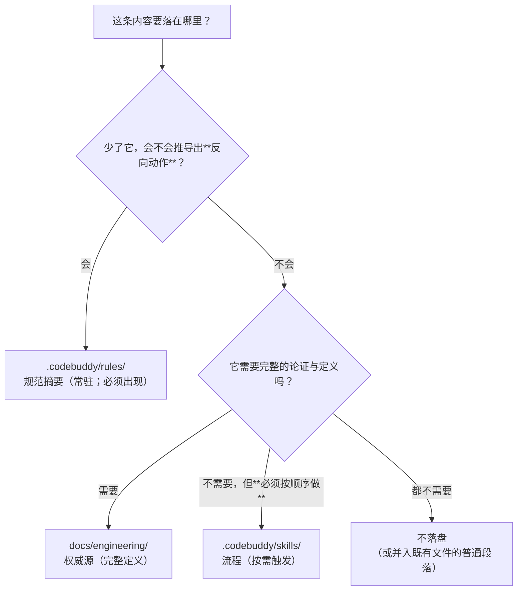

# 0017. 建立项目级 Agent Skills 目录（`.codebuddy/skills/`）与其产出域归属

- **状态**：**已接受**（2026-09-18；项目所有者拍板**采纳方案 B**——建立 `.codebuddy/skills/`、
  只放流程型 Skill、产出域归首席架构师；协作机制另开 [ADR-0018](0018-agent-team-collaboration-mechanism.md)）
- **日期**：2026-09-18
- **决策者**：`Le0n3rd`（批准）／AI 代理（整理与论证）
- **相关**：[ADR-0001](0001-record-architecture-decisions.md)（ADR 制度）、
  [ADR-0009](0009-learning-notes.md)（学习笔记：另一处"持续进行"的载体，与本决策的分工同理）、
  [ADR-0013](0013-branch-model-for-solo-dev.md) §9.4（**引文漂移**的教训：引用优先写章节名）、
  [ADR-0016](0016-cnb-platform-integration-and-remote-write-authorization.md)（CNB 接入；与本决策互补）、
  [`CODEBUDDY.md`](../../CODEBUDDY.md) §7/§10、[`AGENTS.md`](../../AGENTS.md) §7/§10、
  `.codebuddy/rules/project-conventions/RULE.mdc`（**新目录必须先在 ADR 中说明理由**）、
  `.codebuddy/rules/docs-and-adr/RULE.mdc`（文档与 ADR 写法）、
  [`docs/engineering/agent-teams.md`](../engineering/agent-teams.md)（协作机制：技能 1 的权威源）、
  [`docs/engineering/git-workflow.md`](../engineering/git-workflow.md) §2「摘要与完整文档的分工」（**分工判据的出处**）、
  [`docs/devlog/0013`](../devlog/0013-2026-09-18-一致性核查与地基修复.md) §6、
  [`docs/devlog/0014`](../devlog/0014-2026-09-18-威胁模型与安全修复.md) §7
- **上游来源（访问日期 2026-09-18）**：
  [Skills · CNB 文档](https://docs.cnb.cool/zh/develops/skills.html)
- **边界声明**：本文**只**决定 `.codebuddy/skills/` 的建立理由、定位、边界与产出域归属。
  **不**决定协作机制本身（那是另一份 ADR 的范围，见 §5.6）。

---

## 1. 背景与问题

### 1.1 触发：一个尚未建立的目录

项目规则明确要求 **"新目录的建立必须先在 ADR 中说明理由"**
（`.codebuddy/rules/project-conventions/RULE.mdc`「目录约定」）。
当前 `.codebuddy/skills/` **不存在**，而它已被上游机制支持并有明确的候选用途（§1.2）。

### 1.2 需求：把"每次都要记得按顺序做"的流程沉淀下来

本项目已经积累了相当数量的**流程纪律**，其共同特征是：
**它们不是"知识"，而是"顺序"**——知道了却没按顺序做，等于没做。例如：

| 来源 | 内容（举例） | 后果（已实测） |
| --- | --- | --- |
| `agent-teams.md` §8.12 | 组队前先跑一条无害命令预检 `auto run` | 不预检 ⇒ 成员调度与回报通道同时不可靠 |
| `agent-teams.md` §6 | 提交一律 `git commit -o`、核对与提交分两条命令且核对要**阻断** | 不做 ⇒ 跨域混入（`6fa010a` 事故） |
| `agent-teams.md` §8.3/§8.6 | 认 `回报：` 终止声明且须核该提交含本域改动 | 不核 ⇒ 空提交骗过对账（`809cc7a`） |
| `agent-teams.md` §6 | 变异探针"改-测-还原"同一条命令 | 不做 ⇒ 全队门禁变红且无法定位 |
| `docs/devlog/README.md` | 每笔提交后在**当前篇**追加记录；活待办 = 最新篇 §7 | 不做 ⇒ 跨会话失忆 |
| `.cnb.yml` 头部 + `benchmark-automation.md` §3 | 阶段脚本由 dash 执行、**禁 `set -o pipefail`** | 不做 ⇒ 流水线第一行退出码 2 |

这些条目**都已成文**，但分散在 4~6 个长文档里（`agent-teams.md` 已达 736 行）。
上游 Skills 机制提供的正是"**按需触发**"：`description` 常驻（约一句），
`SKILL.md` 在触发时才加载 ⇒ 把"每次都要记得"变成"**到了这一步就会被提示**"。

### 1.3 真正的风险：第 4 个载体可能变成第 4 个漂移源

`.codebuddy/` 下已有三个载体；再加一个就是第四个：

```text
.codebuddy/
├── rules/     常驻规范摘要（始终生效）
├── agents/    角色定义与产出域（派活时加载）
├── teams/     运行产物（已 gitignore）
└── skills/    ← 拟新建：按需触发的流程
```

本项目对"同一事实两份表述"有**多起实测事故**：

| 事故 | 现象 | 出处 |
| --- | --- | --- |
| A-3 | `CONTRIBUTING.md` 要求 squash，`ADR-0013` 要求 merge commit，**两者相反** | `devlog 0013` §3 |
| A-14 | `bench/*` 两条长驻分支未进 ADR-0013 分支表 ⇒ 按表执行会**推出相反动作**（合回、删除） | `ADR-0013` §9.1 |
| A-16 | 5 处文档写 `security` 是合法 `type`，而门禁**实测拒绝** | `devlog 0014` §5 |
| `devlog 0013` §6 第四条 | 同一作者**同一次会话**产出两份互相矛盾的文字（判据成形晚于第一份产出） | `devlog 0013` §6 |

⇒ **本 ADR 的核心价值不是"要不要建目录"，而是"建了之后它凭什么不会变成第 4 个漂移源"。**

### 1.4 一个必须一并回答的历史缺口

`.codebuddy/agents/` **当年建立时没有写 ADR**；`docs/devlog/0014` §7 优先级 C 与
`docs/devlog/0013` §7 优先级 F 至今挂着"**协作机制 ADR 仍待首席架构师产出**"。

⇒ 本 ADR 必须回答：**这个缺口是否在本 ADR 内覆盖？** 结论见 §5.6（**不覆盖，另行开 ADR**，
本 ADR 只做"追溯登记"）。

---

## 2. 决策驱动因素

| 编号 | 因素 | 说明 | 类型 |
| --- | --- | --- | --- |
| S-1 | **单一真源（不许第 4 份副本）** | `docs/engineering/` 是权威源；`.codebuddy/rules/` 是**允许省略**的常驻摘要；Skill **不得**成为第三份规范文本 | 硬约束 |
| S-2 | **常驻上下文成本** | 每个 Skill 的 `description` 常驻（约 100 词）⇒ 每新增一个都是一次**永久税**（`CODEBUDDY.md` §10.3 的成本纪律同理） | 硬约束 |
| S-3 | **可检查性** | 能写成机器检查的不要只写在文档里（`devlog 0012` §6 第二条、`devlog 0014` §6 第五条） | 硬约束 |
| S-4 | **产出域独占** | 新载体必须有归属，否则两条并发写纪律（`CODEBUDDY.md` §10.2 规则 8）覆盖不到它 | 硬约束 |
| S-5 | **不得用"写文档"掩盖阻塞** | `S1`/`S3` 的被测对象在仓库中不存在，活待办已判为**阻塞**（`devlog 0014` §7、威胁模型 §5.1） | 硬约束 |
| S-6 | **变更最小化** | 优先编辑既有文件；新载体只放"确实需要按需触发"的东西 | 偏好 |
| S-7 | **新目录须先有 ADR** | 项目既有规则；本 ADR 即为满足此条 | 硬约束 |
| S-8 | **删除条件必须预先写定** | 载体只增不减 ⇒ 最终变成噪音。ADR-0013 §7 的"未验证项长期挂着＝漂移源"是同一道理的实例 | 偏好 |

> **一条对"引经据典"的补充约束**：Skill 里的引用**优先写章节名而非裸编号**。
> 依据：`ADR-0013` §9.4 记录了"引文漂移"事故——`git-workflow.md` 改版后章节号变了，
> 引用 `§3.3` 的段落指向了别处。章节名比编号稳定。

---

## 3. 候选方案

### 方案 A：不建立 `.codebuddy/skills/`，把流程写进 `docs/engineering/`

- 简述：继续只维护 `docs/engineering/*.md`，靠"开工先读"覆盖流程。
- 优点：**不新增载体** ⇒ 零漂移面、零常驻成本；与"变更最小化"一致。
- 缺点：**放弃的正是 Skills 的机制价值**——`docs/engineering/` 不在任何自动加载路径上，
  而"读不读"取决于记账性；文件已在增长（`agent-teams.md` 736 行、`git-workflow.md` 311 行），
  每次全读的 token 成本与触发时机都不受控。⇒ **它不解决 §1.2 的问题**，只是维持现状。

### 方案 B：建立 `.codebuddy/skills/`，**只放流程型 Skill，一律指向权威源**（**推荐**）

- 简述：Skill 只写"**按什么顺序做什么、在什么条件下停下**"；
  规范内容**一个字都不复制**，每条规则以**指针**指向权威源（`docs/engineering/*`、
  `CODEBUDDY.md`、`ADR-*`、`.cnb.yml` 等）。
- 优点：① 拿到"按需触发"的机制收益；② **不制造第 4 份规范文本** ⇒ 漂移面不增加
  （唯一可能漂移的是**指针**，而指针可被机器检查，见 §7）；③ 与既有"常驻摘要 + 完整文档"的分工口径**同构**。
- 缺点：① 多一个目录需要维护；② 指针会随真源改版失效（有先例，见 §2 末）；
  ③ `description` 常驻 ⇒ 有上下文税；④ "Skill 是否真的被加载"不可由 CI 断言（§7）。

### 方案 C：建立，并把**规范内容**也写进 Skill（例如分支矩阵、门禁口径、type 列表）

- 简述：让 Skill 自足，代理触发后不必再翻文档。
- 优点：单次触发即可拿到完整信息，体验最好。
- 缺点：**直接制造第 4 份真源**，且是**最危险的一种**——它会在"触发时"被加载，
  读者很难分辨"这是规范还是提示"。`git-workflow.md` §2 已把这条判据写死：
  摘要**允许省略**，但**省略后按摘要默认规则推导的动作必须仍然正确**；
  而 Skill 连"摘要 + 权威源指针"的双层结构都不具备，一旦与真源分叉就是**A-16 的同类事故**
  （文档与门禁相反，且长期无人发现）。

### 方案 D：推迟建立，待产品骨架（`src/` 的 8 个目录）落地后再做

- 简述：承认需求存在，但优先级排在产品骨架之后。
- 优点：不占用当前阶段的时间；避免在"被测对象还不存在"时写流程。
- 缺点：① 本 ADR 要沉淀的流程（§1.2）**全部属于"当前正在反复执行"的协作与工程流程**，
  与产品骨架的进度**无关**——推迟它并不会让这些坑变少；
  ② "以后再做"在本项目已有先例且结局不佳（威胁模型 0 条被四处引用、
  `docs/design/` 只有 README、`tests/` 三层空壳）；
  ③ 还会继续保留"每次靠记性"的状态，而成本已经在 `agent-teams.md` §6/§8 用**事故**支付过了。

---

## 4. 权衡对比

评分 1~5（越高越好）。

| 评估维度 | 权重 | A 不建立 | **B 流程型（推荐）** | C 连规范一起写 | D 推迟 |
| --- | --- | --- | --- | --- | --- |
| 单一真源（不制造第 4 副本） | 5 | **5 → 25** | **5 → 25** | 1 → 5 | **5 → 25** |
| 按需加载带来的上下文成本收益 | 4 | 2 → 8 | **5 → 20** | 4 → 16 | 2 → 8 |
| 可检查性（结构能否机器断言） | 3 | 3 → 9 | **4 → 12** | 4 → 12 | 2 → 6 |
| 落地成本（越低越高分） | 2 | **5 → 10** | 3 → 6 | 3 → 6 | **5 → 10** |
| 对既有载体的分工清晰度 | 4 | 3 → 12 | **5 → 20** | 2 → 8 | 3 → 12 |
| 与既有规则的一致性（新目录须先有 ADR 等） | 3 | **5 → 15** | **5 → 15** | 2 → 6 | 4 → 12 |
| **加权合计** | **21** | 79 | **98** | 53 | 73 |

三点读法：

1. **B 胜出的机制不是"多加文档"，而是"把顺序从长文里搬到触发点上"，且不复制任何规范。**
2. **C 是本方案要防的那种失败**：它在"可检查性"上分不低（结构一样能查），
   但"单一真源"与"分工清晰度"崩塌 ⇒ 总分最低。
3. **A 与 D 的差别只在"是否承认需求"**：A 是"不需要"，D 是"现在不做"。
   两者都不是错误选择，但 A 需要否认 §1.2 的实测成本，D 需要在活待办里挂一个长期项
   ——而本项目对"长期挂着的未完成项"已有明确态度（它们是漂移源）。

---

## 5. 决策

**决定采用：方案 B —— 建立 `.codebuddy/skills/`，只放流程型 Skill，一律指向权威源。**

理由（三条）：

1. **它拿到机制收益但不增加真源**。唯一可能的漂移是"指针失效"，而指针可以被**机器检查**
   （§7 的"引用的 `docs/` 路径必须存在"）——这与"再写一份规范文本、靠人比对"有本质区别。
2. **它把已用事故支付过成本的纪律放到触发点上**（§1.2 的六条），
   而这些纪律当前的载体是**读不完的长文 + 记性**。
3. **它有明确的边界与退出条件**（§5.5 的成本门槛、§7 的删除条件），
   不像"再写一份文档"那样只增不减。

### 5.1 `.codebuddy/skills/` 的定位（一句话，可直接引用）

> **`.codebuddy/skills/` 存放"按需触发的流程"：只写"按什么顺序做什么、在什么条件下停下"，
> 不重复任何规范内容；每一条规则都以指针指向权威源（`docs/engineering/*`、`CODEBUDDY.md`、
> `ADR-*`、`.cnb.yml` 等）。**

**三条硬性写作要求**（写进每个 Skill 的头部，作为可评审的形态）：

| # | 要求 | 理由 |
| --- | --- | --- |
| W1 | **不复述规范**。出现"必须/禁止 + 具体条款"时，一律改为"见 `<权威源> §<章节名>`" | 防止第 4 份真源（S-1） |
| W2 | **引用写章节名，不写裸编号**；并声明"**若指针失效，以真源为准并就地修本 Skill**" | `ADR-0013` §9.4 的引文漂移教训 |
| W3 | **每一步都要有"停下条件"**（什么情况下不许继续、要找谁裁决） | 流程的价值在"何时停"，不在"何时走" |

### 5.2 四个载体的边界与分工

| 载体 | 内容类型 | 何时进入上下文 | 是否真源 | 写入者（产出域） |
| --- | --- | --- | --- | --- |
| `.codebuddy/rules/` | **规范摘要**（常驻、始终生效） | 每次会话自动加载 | **否**（真源 = `docs/engineering/`）；须遵守"省略后推导的动作仍须正确"的判据 | 架构师（`docs/engineering/` 同源） |
| `.codebuddy/agents/` | **角色**与产出域 | 派活 / 定义加载时 | **是**（角色定义本身） | 架构师 + 领导 |
| `docs/engineering/` | **完整定义**（权威源） | 需要时读取（常由 Skill 的指针带入） | **是** | 架构师 |
| `.codebuddy/skills/`（拟建） | **流程**（按需触发） | `description` 常驻；`SKILL.md` 触发时加载；`scripts/`、`references/` 按需 | **否**（真源 = 上表三者与 ADR） | 见 §5.4 |

**归入判定（一条口径，避免以后每加一个文件都重新讨论）**：



> 左分支的判据**逐字来自** [`git-workflow.md`](../engineering/git-workflow.md) §2：
> "省略后，按摘要里的默认规则推导出的动作**仍然正确**——才允许省略；
> 若省略会推导出**相反的错误动作**，则该内容**必须**出现在摘要里。"
> 本 ADR 只是把同一判据推广到"四个载体"的选择上。

### 5.3 四个拟定 Skill 的清单与分工

> 每个 Skill 都要写清 **① 触发条件（description 的要点）② 权威源 ③ 不写什么**。
> "不写什么"是硬性字段：没有它，Skill 会持续膨胀成规范副本。

#### 5.3.1 `agent-team-protocol`

| 项 | 内容 |
| --- | --- |
| 正名 | **团队协作流程**（组队 → 派活 → 提交 → 回报 → 关闭） |
| 触发条件 | 需要开团队 / 派活 / 关闭团队时；出现 `Subagent "X" not found` 时；成员回报异常时；对账"成员做完了没有"时 |
| 流程要点（只写顺序） | ① **组队前预检** `auto run`（跑一条无害命令，出现 `Permission request timed out` 即**禁止开工**）；② 派活提示必须写**产出白名单 + 禁止事项 + `max_turns`**；③ 提交一律 `git commit -o -m … -- <显式路径>`，**核对与提交两条独立命令且核对要阻断**；④ 完成判定只认**仓库里的 `回报：` 终止声明**，且须核该提交**含本域改动**（`--stat` 非空）；⑤ 消息只是加速器，**"未确认 ≠ 失败、禁止据此重派"**；⑥ 关闭团队**前**先对账成员工作区并摘录可复现证据，**摘录完成才 `team_delete`** |
| 权威源 | [`docs/engineering/agent-teams.md`](../engineering/agent-teams.md)（§3 / §6 / §8 各小节）、[`CODEBUDDY.md`](../../CODEBUDDY.md) §10 |
| **不写什么** | 角色定义与产出域表（属 `.codebuddy/agents/` 与 `CODEBUDDY.md` §10.1）、实测数据（属 `agent-teams.md` §8.1/§8.11）、模型档位与成本纪律（属 §10.3） |

#### 5.3.2 `repo-ci-conventions`

> **2026-09-18 改名（接受前的最后一版修订）**：本小节原定名为 `cnb-pipeline`。
> 核验官方 Skill 清单时发现 `cnb/skills/cnb-skill` 仓库内**已有一个同名 Skill `cnb-pipeline`**
> ⇒ 为免"同名两处"，项目内 Skill **改名为 `repo-ci-conventions`**。
> 改名只涉及**名称与分工表述**，本小节的**流程要点与权威源不变**。

| 项 | 内容 |
| --- | --- |
| 正名 | **本仓库 CI 流水线约定**（改 `.cnb.yml` 或新写 stage 时） |
| 触发条件 | 增删/修改 `.cnb.yml` 的 event、stage、`endStages`、`runner`、`docker` 时；流水线出现诡异失败时 |
| 流程要点（只写顺序） | ① 阶段脚本由镜像的 `/bin/sh`（Debian 12 的 dash）执行 ⇒ **禁 `set -o pipefail`**，一律 `set -eu`；② 镜像**钉到发行版**（`python:3.12-bookworm`），**禁浮动标签**；③ 流水线里的 `make setup` / `make check` **必须带 `LOCAL_HOOKS=0`**；④ `build.by` **必须列全构建期输入**（漏了直接构建报错）；⑤ `cpus` ⇒ 内存 = **× 2 GiB**（8 核 = 16 GiB，**不得降到 4 核**：L 档常驻 8.70 GiB 会 OOM）；⑥ 基准必须用 `lock` **串行**（并发测量会让吞吐失去可比性）；⑦ `endStages` 的发布**不得吞错**（`\|\| echo` 会把"没数据"伪装成"绿"）；⑧ 不用管道接 `head`（SIGPIPE 141） |
| 权威源 | `.cnb.yml` 头部注释与其内联注释、[`docs/engineering/benchmark-automation.md`](../engineering/benchmark-automation.md) §3/§7、[`ADR-0014`](0014-benchmark-automation.md) §2.1/§2.9、[`docs/devlog/0012`](../devlog/0012-2026-09-16-基准自动化数据流水线.md) §3/§5 |
| **不写什么** | ⚠️ **本 Skill 不管"怎么调平台 API"**——那是官方 `cnb-pipeline` 的职责（见下"分工"）；也不复述基准**测量口径**（属 `benchmark-protocol`）与数据发布脚本的实现（属 `scripts/bench/publish.sh`） |
| 机器检查 | `tests/unit/test_cnb_config.py`（本 Skill 只提示"改完要跑它"） |

**与官方 `cnb-pipeline` 的分工（必须写明，否则会重复）**：

| 维度 | 官方 `cnb-pipeline`（属 `cnb/skills/cnb-skill` 仓库；[ADR-0016](0016-cnb-platform-integration-and-remote-write-authorization.md) 接入） | 项目内 `repo-ci-conventions`（本 ADR） |
| --- | --- | --- |
| 管什么 | **CNB 平台通用的 `.cnb.yml` 语法**与**构建失败诊断** | **本仓库的具体约定与历史坑** |
| 来源 | `cnb.cool` 官方组织，镜像内全局安装，钉 commit | 本仓库 `.codebuddy/skills/`，随仓库走 |
| 变更节奏 | 跟随上游 | 跟随本仓库的流水线演进 |
| 交叉引用 | （上游无法引用本项目） | 在 `repo-ci-conventions` 文首写一行"需要调用平台 API 时，用 `cnb` 命令；其用法见官方 `cnb-pipeline`" |

> **补充（2026-09-18 回填）**：官方 Skill 中另有 `cnb-api` / `cnb-code-review` / `cnb-pr-analysis` / `cnb-docs`
> 分别覆盖 API、代码评审、PR 分析、文档等能力——它们与项目内四个 Skill **同样不得互相复述**；
> 项目内 `repo-ci-conventions` 文首的指向行只指向**与它同名语义最近**的官方 `cnb-pipeline`。

> **判据**：两者的交集**必须为空**。若某条内容同时像"API 用法"和"仓库约定"，
> 归**前者**（API 用法）——因为仓库约定应能被本地文件（`.cnb.yml`、`Makefile`、测试）证明，
> 而 API 用法只能来自上游。

#### 5.3.3 `devlog-protocol`

| 项 | 内容 |
| --- | --- |
| 正名 | **开发日志与活待办流程** |
| 触发条件 | 每笔提交后；开工/重拾语境时；一个议题讲完准备收篇时；需要知道"下一步做什么"时 |
| 流程要点（只写顺序） | ① 每笔提交后在**当前（最新）篇**追加一条记录（**含提交哈希、变更内容、验证方式**）；② **活待办 = 最新一篇的 §7**（不另建 todo/backlog）；③ 完成一项 ⇒ 从当前篇 §7 **删除**并在 §3 记内容总结（§3 **禁止**写成打勾清单）；④ **议题讲完即收篇**，未完成项**抄进新篇 §7**，旧篇成为封闭记录；⑤ 重拾语境走 README 的**四步**；⑥ 日志**当时写**，禁止事后大规模补写；⑦ 哈希引用只能引用**产生它的那笔提交之前**的提交，日志自身的哈希由下次回填 |
| 权威源 | [`docs/devlog/README.md`](../devlog/README.md)、[`CODEBUDDY.md`](../../CODEBUDDY.md) §8（沟通与记录）/§9（当前待办） |
| **不写什么** | 日志的**模板正文**（属 README）、具体待办清单（属最新篇 §7）、协作机制（属 `agent-teams.md`） |

#### 5.3.4 `benchmark-protocol`

| 项 | 内容 |
| --- | --- |
| 正名 | **基准跑取与发布的可比性流程** |
| 触发条件 | 要跑一轮基准、要看历史数据、要发布数据、要改测量口径（协议/任务集/启动参数）时 |
| 流程要点（只写顺序） | ① 跑之前确认**同签名**（协议版本、ctx、threads、max_tokens、tiers **与 CPU 型号**）——**跨环境/跨签名不得直接比较**；② 必须**显式 `-np 1`** 并把该参数写进结果（默认 4 槽位共享 KV 会改变计时口径）；③ 报告必须给**重复次数与极差**，**单次采样不足以判定超阈**；④ **加载耗时跨会话不可比**（容器内无法规范化存储状态）⇒ 只作同会话指标；⑤ 对照必须**同会话内**做；⑥ 任何会改变测量口径的改动**必须提 `PROTOCOL_VERSION`** 并记 devlog；⑦ 发布用 `make bench-publish`（**合并**而非替换，且不得吞错） |
| 权威源 | [`docs/engineering/benchmark-automation.md`](../engineering/benchmark-automation.md)（§4/§5/§7）、[`docs/engineering/post-build-checklist.md`](../engineering/post-build-checklist.md) §6.4（同会话对照与极差判据）、[`ADR-0014`](0014-benchmark-automation.md)、[`docs/notes/evaluation-pitfalls.md`](../notes/evaluation-pitfalls.md) |
| **不写什么** | 具体基准数字（属 `bench/data` 分支）、发布脚本实现、CI 触发配置（属 `cnb-pipeline`） |

#### 5.3.5 官方 `cnb-skill` 仓库的 Skill 清单与安装方式（2026-09-18 回填）

> 本小节**只补事实**，不改变本节前四小节的结论（ADR「只增不改」）。

**事实 1 · 官方 Skill 共 11 个**（来源：`cnb/skills/cnb-skill` 仓库 `skills/` 目录列表，
访问日期 2026-09-18；抓取时该页显示的最新提交为 `8399c383`）：

| # | Skill | # | Skill |
| --- | --- | --- | --- |
| 1 | `cnb-api` | 7 | `cnb-pr-analysis` |
| 2 | `cnb-code-commit` | 8 | `cnb-repo-knowledge-base` |
| 3 | `cnb-code-review` | 9 | `cnb-tapd-resource-fetcher` |
| 4 | `cnb-docs` | 10 | `cnb-text-path-converter` |
| 5 | `cnb-npc-search` | 11 | `cnb-upload-attachment` |
| 6 | `cnb-pipeline` | | |

**事实 2 · 领导裁决只装 5 个**：

| 项 | 内容 |
| --- | --- |
| **装（5）** | `cnb-api` · `cnb-docs` · `cnb-code-review` · `cnb-pr-analysis` · `cnb-pipeline` |
| **不装（6）** | `cnb-code-commit` · `cnb-npc-search` · `cnb-repo-knowledge-base` · `cnb-tapd-resource-fetcher` · `cnb-text-path-converter` · `cnb-upload-attachment` |

排除理由：

1. `cnb-code-commit` **与项目既有门禁重叠**（PR 模板、Conventional Commits 门禁）
   ⇒ 会构成"**两处口径**"，按本文 §5.2 的归入判定与 §5.3.2 的分工判据，**归本仓库既有门禁**，不引入第三方口径；
2. 其余 5 个（`cnb-npc-search`、`cnb-repo-knowledge-base`、`cnb-tapd-resource-fetcher`、
   `cnb-text-path-converter`、`cnb-upload-attachment`）本项目当前**用不上**；
3. **成本理由（S-2 的直接应用）**：官方 Skill 的 `description` 是**常驻上下文**，
   11 个全部安装 ≈ 常驻量翻倍 ⇒ 11 → 5 是**可量化的成本削减**，不是审美偏好。

**事实 3 · 安装路径（实现事实，来源为本次落地的实测记录）**：

| 项 | 事实 |
| --- | --- |
| `skills add` 是否支持钉 commit / ref | **不支持** ⇒ 官方安装路径由 [ADR-0016](0016-cnb-platform-integration-and-remote-write-authorization.md) §5.4 的 **L2 降级为 L3** |
| L3 的做法 | `git clone` → `git checkout <SHA>` → 落到 `~/.agents/skills/<name>/`，并在 `~/.codebuddy/skills/<name>` 建**符号链接** |
| 可钉 commit | `bcd25870ed100db43c257c3c5feca6c776645914` |
| 「HEAD 会漂」是否已实测 | **是**：上述 SHA 取自本次落地时的 HEAD，而本文写作时抓取同一页面已显示 `8399c383` ⇒ **必须按取到时 SHA 钉死** |
| `cnb --version` 是否存在 | **存在**，返回 `1.15.36` |
| `skills` 的版本 | 钉 **1.5.0**；1.6 / 1.7 要求 node ≥ 22.20，而镜像为 node **20.20.2** |

> **与 ADR-0016 的关系（不得分叉）**：本节事实对应 ADR-0016 §10 的 U1 / U2 / U3 / U6（原为**【待核验】**）。
> 本次改动**不含 ADR-0016**（不在产出白名单）⇒ 上述事实是否回填 ADR-0016、
> 以及"钉 commit 与所装目录内容一致"是否需要复核，**留待 ADR-0016 的域主处理**。
> 在回填之前，ADR-0016 §10 的【待核验】标记**仍然有效**，本节事实**不得**被表述为"ADR-0016 已核验"。

### 5.4 产出域归属

**建议：`.codebuddy/skills/` 归首席架构师**（与 `docs/engineering/`、`.codebuddy/rules/` 同源：
都是"流程与规范的载体"），并附**四条边界**：

| # | 边界 | 理由 |
| --- | --- | --- |
| 1 | Skill 的**权威源条款**仍属该真源的域主 | Skill 只做指针；改真源仍要走真源的域（例：`devlog-protocol` 的真源在 `docs/devlog/README.md`，改动归记录员域/领导） |
| 2 | Skill **不含规范内容** ⇒ 写入 Skill 不构成对其它域的实质改写 | 这是"归属架构师"能成立的前提（S-1） |
| 3 | 其它角色可**只读引用**并提出改动建议；对 Skill 的**实际写入一律串行** | `CODEBUDDY.md` §10.2 规则 8：同一文件同一时刻只有一个写入者 |
| 4 | 交付前须附**指针有效性**的核查（§7 `V2`） | 指针失效是 Skill 唯一的漂移形态 |

**不采纳的备选归属：声明为"跨域例外、由领导核对"。**
理由：`docs/engineering/doc-consistency-report.md` 的"跨域例外"针对的是**单个文件**
（一致性报告，跨域阅读需求强、域归属弱）；而这里是一个**会持续增长的目录**，
例外会随文件数外溢。明确归属的成本只有一行（本 ADR），收益是并发写纪律能被机械套用。

### 5.5 成本控制：为什么是 4 个，以及第 5 个为什么主动推迟

**门槛（每新增一个 Skill 都要过）**：

> 该流程是否**会被反复执行**，且**漏做会产生可观测的损失**（事故、门禁红、返工）？——
> 两者都成立才建 Skill；只满足一条 ⇒ 留在既有文档里。

**为什么是 4 个**：`.codebuddy/` 的三类载体里，**"会被反复执行且漏做有代价"的流程恰好收敛为四组**：
团队协作、CI 约定、日志与活待办、基准可比性。它们的 `description` 合计约 400 词常驻——
这是**可接受的永久上下文税**（对照：`agent-teams.md` 单文件 736 行，
只在需要时按指针读取，不常驻）。

**第 5 个（安全对抗评审 Skill）为什么主动推迟**：

- 它要沉淀的是"**对抗性评审该查什么**"，因此必然要指向被测对象（`PolicyEngine` 的策略求值、
  `AuditSink` 的审计落盘、`domain_pack` 的加载器）；
- 而这些对象**在仓库中不存在**：`devlog 0014` §7 已把 `S1`/`S3` 由"待推进"**改为"阻塞"**，
  威胁模型 §5.1 明确写着"验证者**拒绝造测**（正确）"；
- ⇒ 此时写它只能产出**与被测对象对不上的检查**（例如要求"审查策略求值的 fail-secure 分支"
  而 `security/policy.py` 不存在）——这正是"**写着但不生效**"的教科书形态，
  也是本项目反复吃亏的模式（A-11/A-15）。
- **重启条件（写死）**：`security/policy.py`、`observability/audit.py`、`harness/domain_pack.py`
  三者中**至少两个落地且 `tests/security/` 有对应用例**之后，再评估第 5 个。

**明确不建立的候选（防范围膨胀，与"明确不自研清单"同风格）**：

| 候选 | 为什么不建 |
| --- | --- |
| 把 `docs/engineering/*` 全量搬成 Skill | 方案 C，已否；会制造第 4 份真源 |
| "ADR 写作 Skill" | `docs/adr/0000-template.md` 与 `.codebuddy/rules/docs-and-adr/RULE.mdc` 已覆盖 ⇒ 重复 |
| "Make 目标速查 Skill" | `make help` + `Makefile` 已是唯一入口 ⇒ 重复，且会随目标增删漂移 |
| "学习笔记 Skill" | `docs/notes/README.md` + `ADR-0009` 已覆盖；它不是"顺序"而是"写作要求" ⇒ 属规范 |

### 5.6 `.codebuddy/agents/` 的历史缺口如何处置（**明确回答**）

**结论：本 ADR 不覆盖协作机制，只做追溯登记；协作机制另开 ADR。**

理由三条：

1. **接受范围会含混**。若把"目录建立的合法性"与"一整套协作机制"塞进同一份 ADR，
   读者无法判断哪一部分被批准了——本项目刚在 `ADR-0003` §6~§8 上吃过这个亏
   （同一文件里指向两个不同的项目，需由 `ADR-0015` §5.5 登记为历史残留）。
2. **驱动因素与候选方案不同**。目录建立的理由是"载体分工"（本文 §1.3/§5.2）；
   协作机制的驱动因素是"单人 + AI 角色的成本与可观测性"（`devlog 0013` §2.1/§2.4）。
3. **它已有事实上的权威源**：[`docs/engineering/agent-teams.md`](../engineering/agent-teams.md)
   （完整机制 + 实测证据）与 `CODEBUDDY.md` §10（常驻结论），
   缺的是**决策记录**而不是机制描述 ⇒ 那是一件**独立、可独立评审**的工作。

**追溯登记（本文只登记事实，不追溯补写）**：

| 项 | 记录 |
| --- | --- |
| 事实 | `.codebuddy/agents/` 建立于 2026-09-18（[`devlog 0013`](../devlog/0013-2026-09-18-一致性核查与地基修复.md) §3，提交 `e8e0885`），**当时未写 ADR** |
| 影响 | 与 `.codebuddy/rules/project-conventions/RULE.mdc`「新目录的建立必须先在 ADR 中说明理由」不符 |
| 处置 | **不追溯补写 ADR**（该目录已建立、其内容已在 `CODEBUDDY.md` §10 与 `agent-teams.md` 中成文）；改为在**协作机制 ADR** 中一并说明 |
| 未核实 | 建立当时 `CODEBUDDY.md` §7 的"文档与决策留痕"表**是否已含**"协作机制变更"一行——`c327ca6` 才补入该行，但这是**后来的事实**，不能反推当时是否已有 ⇒ **【待核验】**（验证方式：`git log -p -- CODEBUDDY.md` 查该行的引入提交时间） |

**建议的后续动作**：另开 **ADR-0018「Agent 团队的协作机制」**，覆盖
主 Agent 恒为团队领导、五角色统一 `agentic`（`manual` 不可被派活）、
设计→实现以**文件为唯一载体**、成本纪律（并行是乘法开销）与**回报通道的三条机制**。
其权威源即 `agent-teams.md`，因此该 ADR 的正文可以很短（决策 + 指针 + 负面 + 验证）。

### 5.7 与 ADR-0016 的关系（互补，不得分叉）

| 维度 | [ADR-0016](0016-cnb-platform-integration-and-remote-write-authorization.md) | 本 ADR（0017） |
| --- | --- | --- |
| 决策对象 | CNB 官方 Skills 与 `cnb-cli` **是否进镜像**、远端写入授权**如何分级** | **项目内** `.codebuddy/skills/` 是否建立、边界与产出域 |
| 交集 | **只有一个**：项目内 `repo-ci-conventions` 与官方 `cnb-pipeline` 的分工（§5.3.2 的表） | 同左 |
| 分叉风险 | 若两文各写一份"分工"，就会出现两份口径 | ⇒ **分工表只在本文写**；ADR-0016 只留一行指向本文 |

---

## 6. 后果

### 正面

- **流程从"长文 + 记性"搬到触发点上**：§1.2 的六条纪律各自有了按需触发的入口。
- **真源数量不变**：Skill 不含规范 ⇒ 唯一新增的漂移面是**指针**，而指针可被机器检查（§7 `V2`）。
- **分工判据被固化成一张判定图**（§5.2），以后每加一个文件不必重新讨论"放哪里"。
- **成本与退出条件被预先写死**（§5.5 的门槛、§7 的删除条件），
  对抗"载体只增不减"这一本项目反复出现的模式。

### 负面（必须承认）

| # | 负面 | 说明 |
| --- | --- | --- |
| 1 | **`description` 是永久上下文税** | 4 个约 400 词常驻；**每加一个都是税**。门槛（§5.5）一旦松动，就会退回"什么都写成 Skill" |
| 2 | **"Skill 真的被加载"不可由 CI 断言** | NPC 的加载发生在仓库之外；CI 只能断言**结构合法**。⇒ 与 `SECURITY.md` `S-8` 有张力，必须如实写成"人工核对"，**不得**声称"已由检查保障" |
| 3 | **指针会漂移** | 章节名/路径随真源改版失效，已有先例（`ADR-0013` §9.4 的引文漂移）。缓解只是"可被机器检查 + 以真源为准"，**不等于不漂移** |
| 4 | **架构师成为瓶颈** | 产出域归架构师，而流程的实际需求方可能是记录员/验证者。缓解：Skill 只做指针 ⇒ 他人可提建议；若确成瓶颈，触发重评（新增 ADR） |
| 5 | **第 4 个载体扩大了反向搜索面** | 规则变更时"要搜的地方"多了一处；`project-conventions` 的联动更新表需相应补一行（见 §8 待办） |
| 6 | **`agent-teams.md` 的缺口**未被本文关闭 | 协作机制 ADR 仍待产出（§5.6）；本文只是**不让它被悄悄略过** |

### 风险与缓解

| 风险 | 影响 | 缓解措施 |
| --- | --- | --- |
| Skill 逐渐膨胀成规范副本（滑向方案 C） | 第 4 份真源出现，且在最危险的位置（触发时加载） | W1 硬性要求（§5.1）+ §7 `V3` 的"不出现规范条款"抽查 + 评审时把"不写什么"当必填项 |
| `description` 写得含糊 ⇒ 该触发时不触发 | 机制失效，退回"靠记性" | 每个 Skill 必须列"触发条件"（§5.3 表的第二行）；`description` 由架构师在落地时逐条写 |
| 指针失效而无人发现 | 代理读到错误指引 | §7 `V2`：断言 Skill 中出现的每个 `docs/` 路径**必须存在**（机器检查）；W2 要求写章节名并声明"以真源为准" |
| Skill 与规则冲突时行为不明 | 又一处"两处写反" | §7 `V4`：先做一次**加载优先级实测**（写一个与 rules 冲突的最小 Skill，观察哪一条生效），结果回填本文 |
| 产出域归属造成等待 | 流程改动被架构师排队拖慢 | 阈值触发重评（§6 负面 4）；必要时把"纯机械增删"授权给记录员（需新增 ADR） |

---

## 7. 验证方式

| # | 验证项 | 怎么验 | 通过判据 |
| --- | --- | --- | --- |
| V1 | **结构合法**（建议落 `tests/unit/test_skills_layout.py`） | 断言：每个子目录含 `SKILL.md`；frontmatter 含 `name` 与 `description`；`name` 与目录名一致；`description` 非空且不超过约定上限；目录集合 ⊆ 白名单（当前 4 个） | 断言通过；**变异探针**：删掉某个 `description`、把 `name` 改成与目录名不符 ⇒ 断言必须**报红**（证明非恒过） |
| V2 | **指针有效**（机器检查，优先级高于 V3） | 从各 `SKILL.md` 中提取所有 `docs/…`、`src/…`、`.cnb.yml` 之类的仓库内路径，逐个断言**存在** | 全部存在；**变异探针**：把某个指针改成一个不存在的路径 ⇒ 报红 |
| V3 | **不含规范条款**（抽查，非全自动） | 人工/半自动：在 Skill 文本中搜索规范类关键词（如提交 type 列表、分支矩阵、"必须/禁止 + 具体条款"） | 命中数 = 0；命中即改写为指针 |
| V4 | **加载优先级**（一次性实测，结果回填本文 §10） | 写一个**最小 Skill**（内容与某条 `rules` 相反），在会话内触发，观察哪一条生效 | 得到明确结论；**在此之前不得假设**"Skill 覆盖 rules"或反之 |
| V5 | **触发可用**（人工，不可 CI 断言） | 用各 Skill 的 `description` 关键词在会话内触发一次，记录是否被加载 | 4 个都能触发；不能触发的 Skill 需改 `description` |
| V6 | **删除条件可执行** | 每月或每次规则变更时核对：某 Skill 是否连续 **2 个月**未被触发、其权威源是否已被合并/废弃、其流程是否已被机器检查取代 | 命中任一 ⇒ 删除该 Skill（或降级为一行指针），并记 devlog |

**删除条件（写死，避免只增不减）**：

1. 连续 **2 个月**未被触发 ⇒ 其靶子流程已不再反复执行（或已由机器检查取代）⇒ **删除**；
2. 权威源被合并 / 废弃 ⇒ **删除或改写指针**（以真源为准）；
3. 该流程已被**机器检查**强制 ⇒ **优先保留机器检查**，Skill 可删除或降级为一行说明——
   理由：本项目一贯立场是"能写成测试的不要只写在文档里"（`devlog 0012` §6 第二条）。

**复核时间点**：落地后 **30 天**（与 `ADR-0013` §7、`ADR-0015` §7.5、`ADR-0016` §7 的观察项同期）；
此后每次规则变更时顺带核对 `V2`（指针有效）。

---

## 8. 后续行动

- [ ] **所有者拍板本 ADR**（提议中 → 已接受 / 已否决）
- [ ] 若采纳：建立 `.codebuddy/skills/` 与 4 个 Skill（**由架构师执行**），
      每个 Skill 必含"触发条件 / 流程要点 / 权威源 / 不写什么"四段
- [ ] 若采纳：落 `tests/unit/test_skills_layout.py`（§7 `V1`/`V2`），并做**变异探针**证明非恒过
- [ ] 若采纳：联动更新下列位置（项目规则「规则变更的联动更新」）：
      - `CODEBUDDY.md` §10.1 的角色/产出域表 → 新增一行 `.codebuddy/skills/`（架构师）
      - `AGENTS.md` §10.1 → 与上逐字同步
      - `.codebuddy/agents/architect.md` → 产出域补 `.codebuddy/skills/`
      - `.codebuddy/rules/project-conventions/RULE.mdc`「目录约定」表 → 新增该行
      - `.codebuddy/rules/project-conventions/RULE.mdc`「规则变更的联动更新」表 →
        "协作机制"一行之外补"**流程型 Skill 变更 → `.codebuddy/skills/` + 对应权威源**"
- [ ] 若采纳：执行 §7 `V4`（加载优先级实测）并把结论回填本文 §10
- [ ] **另开 ADR-0018「Agent 团队的协作机制」**（§5.6；权威源 = `agent-teams.md`）
- [ ] 在 `docs/adr/README.md` 索引登记本 ADR（状态：提议中）
- [ ] 在 `docs/devlog/` 当前篇记一条（含提交哈希、变更内容、验证方式）——**记录员/领导域**

---

## 9. 回退

| 动作 | 影响 |
| --- | --- |
| 删除 `.codebuddy/skills/` 目录 | **无残留**：Skill 不含规范内容 ⇒ 删除不会丢任何真源（这正是方案 B 的必然结果） |
| 从 `CODEBUDDY.md` / `AGENTS.md` §10.1 与 `architect.md` 移除该产出域 | 无影响（除归属声明本身） |
| 从 `.codebuddy/rules/project-conventions/` 的目录表移除该行 | 无影响 |

⇒ 回退成本 ≈ 一次提交，**不需要**任何数据迁移。这是选择"流程型 Skill（只做指针）"
而非"规范型 Skill"的一个额外收益。

---

## 10. 未验证项（不得当作事实引用）

| # | 待核验 | 影响 | 验证方式 |
| --- | --- | --- | --- |
| U1 | Skills 的 frontmatter **可选字段**（`allowed-tools` / `disable`）在本 IDE 下的语义与生效范围 | 是否能用它们收窄 Skill 能干的事（安全相关） | 写最小 Skill 逐字段实测；查 IDE/CLI 的 Skills 文档 |
| U2 | "**三级渐进披露**"（元数据常驻 → `SKILL.md` 触发加载 → `scripts/`、`references/` 按需）的实际加载边界 | 影响"哪些内容会被常驻"这一成本判断 | 在 `SKILL.md` 与 `references/` 各放一个特征串，观察何时进入上下文 |
| U3 | `description` 的**长度上限与截断行为** | 影响 description 的写法 | 写入超长 description，观察是否被截断/报错 |
| U4 | `.codebuddy/skills/` 是否被 **IDE 与 CLI 两种宿主都加载** | 影响"成员（子会话）能否用到 Skill" | 分别在 IDE 会话与 `codebuddy` CLI 会话中触发同一 Skill |
| U5 | **加载优先级**：Skill / `rules` / `agents` 三者冲突时谁生效 | **最关键**：它决定"两处写反"是否会互相覆盖 | §7 `V4` 的实测 |
| U6 | `.codebuddy/agents/` 建立当时，`CODEBUDDY.md` §7 是否已含"协作机制变更"一行 | §5.6 追溯登记的准确性 | `git log -p -- CODEBUDDY.md`，定位该行的引入提交与其时间 |

> 纪律（沿用 `ADR-0015` §8.2）：上表任何一项在核验完成前不得写成结论性表述。

---

## 11. 修订记录

> 本 ADR 已于 2026-09-18 **被接受**；此后正文结论不再原地修改（ADR 只增不改）。
> 下列第 2~4 条属**接受前的最后一版修订**（补事实与编排性改名），一并登记以免被误读为"接受后改写"。

- **2026-09-18**：初稿。状态**提议中**。依据：`.codebuddy/` 现状（`agents/`、`rules/`、`teams/`）、
  `CODEBUDDY.md`/`AGENTS.md` §7/§10、`project-conventions` 与 `docs-and-adr` 规则、
  `agent-teams.md`（§3/§6/§8）、`git-workflow.md` §2、`benchmark-automation.md` §4~§7、
  `post-build-checklist.md` §6.4、`devlog 0012` §3/§5、`devlog 0013` §3/§6/§7、`devlog 0014` §7、
  `tests/unit/test_cnb_config.py` 的存在与其检查项。
  **本 ADR 不创建任何目录或文件**；`.codebuddy/skills/` 当前仍不存在。
- **2026-09-18**：**状态 提议中 → 已接受**（所有者拍板采纳方案 B）。
- **2026-09-18**：**编排性改名（接受前）**：§5.3.2 项目内 Skill 由 `cnb-pipeline` 改名为
  **`repo-ci-conventions`**，并重写与官方 `cnb-pipeline` 的分工表（§5.3.2）与 §5.7 的对应单元格。
  原因：官方 `cnb/skills/cnb-skill` 仓库内已有同名 Skill `cnb-pipeline` ⇒ 同名会造成"两处口径"。
  **流程要点与权威源不变**。
- **2026-09-18**：**回填事实（接受前）**：新增 §5.3.5「官方 `cnb-skill` 仓库的 Skill 清单与安装方式」——
  官方 Skill 共 **11 个**（列全名）、领导裁决**只装 5 个**（排除 6 个，含与项目门禁重叠的 `cnb-code-commit`）、
  以及安装路径的实现事实（`skills add` 不支持钉 commit ⇒ 降级 **L3**；可钉 commit
  `bcd25870ed100db43c257c3c5feca6c776645914`；`cnb --version` = `1.15.36`；`skills` 钉 `1.5.0`）。
  **只补事实，未改结论**；ADR-0016 §10 的对应【待核验】项**仍未回填**（见该小节末注）。
- **2026-09-18**：**§10 的 U6 结案（不改 §10 正文）**：以
  `git log -S '协作机制变更' -- CODEBUDDY.md` 得引入提交 `c327ca6`（2026-09-18 08:02:05），
  **晚于** `.codebuddy/agents/` 的建立提交 `e8e0885`（2026-09-18 04:19:33）
  ⇒ **建立当时 `CODEBUDDY.md` §7 不含该行**。同批核验：「新目录的建立必须先在 ADR 中说明理由」
  由 `7609bb9`（2026-09-14 21:01:27）引入，**早于** `e8e0885` ⇒ 该规则**当时已在生效**。
  结论与处置见 [ADR-0018](0018-agent-team-collaboration-mechanism.md) §5.2「追溯登记」。
- **2026-09-18**：**落地（本文的 §8 后续行动未全部执行，不得据本文认为已完成）**：
  `.codebuddy/skills/` 与 4 个 `SKILL.md` 已建立（`agent-team-protocol`、`repo-ci-conventions`、
  `devlog-protocol`、`benchmark-protocol`）；`.codebuddy/rules/project-conventions/RULE.mdc`
  的「目录约定」与「依赖管理」已同步。**§7 的 V1~V6（含 `tests/unit/test_skills_layout.py`）
  与 §8 的其余联动项（`CODEBUDDY.md`/`AGENTS.md` §10.1、`.codebuddy/agents/*`）本次未执行**。
