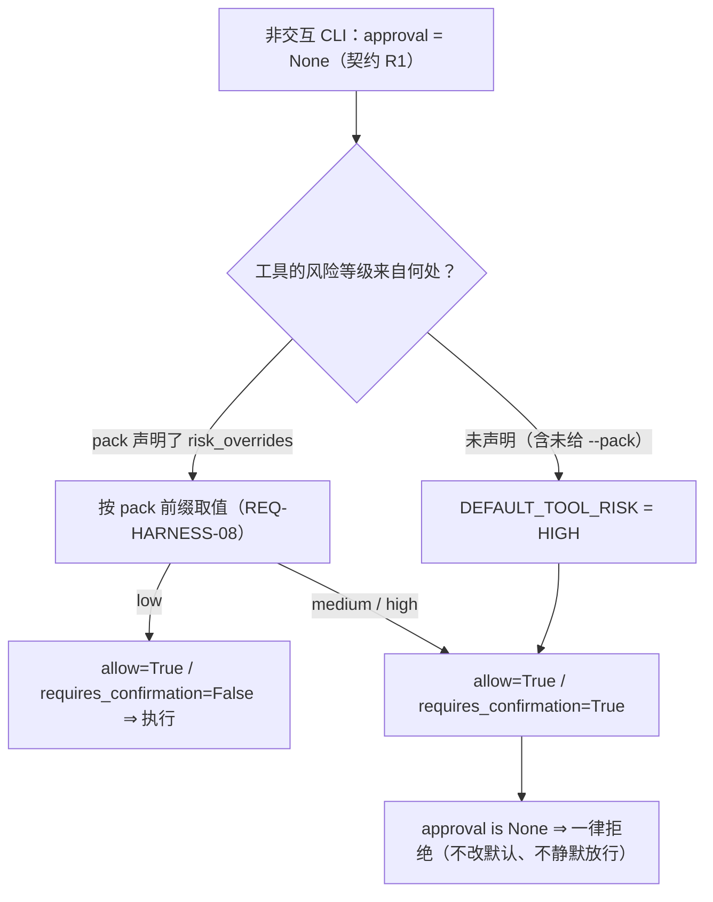

# 0021. 示例领域包目录（`examples/packs/`）与「首个可用版本」（`0.1.0`）的判据

- **状态**：**提议中**（待所有者批准；本批由实现工程师在同批**落地** `examples/packs/` 的目录与只读示例包 —— 提交 `42f36a3`）
- **日期**：2026-09-20
- **决策者**：Le0n3rd（授权代理提出候选与论证；**批准与否由领导/所有者拍板**）
- **相关**：
  - 上游决策 [`ADR-0015`](0015-layering-and-reuse-boundary.md) §5.1.1 的 `R5`（领域包只加载声明式配置）、
    §5.4.1/§5.4.2（目录树与测试分层）、§5.2（组件清单，本文**不新增依赖**）；
  - 领域包 schema 与装配契约 [`interfaces/harness.md`](../design/interfaces/harness.md) §4（`P1`~`P4`、`pack.toml` 字段、
    失败模式）、§5.1 第 9 行（`pack` 参数）与 §5.1「装配顺序」；
  - 版本与发布口径 [`ADR-0019`](0019-release-and-version-policy.md)；
  - 可用性缺口的登记 [`docs/devlog/0019`](../devlog/0019-2026-09-19-M1交付物与安全断言推进.md) §2 第 2 行与 §5；
  - 代码事实：`src/agent_sec_perf/security/policy.py`（`DEFAULT_TOOL_RISK`）、
    `src/agent_sec_perf/harness/domain_pack.py`（`load_pack`）、
    `src/agent_sec_perf/cli/app.py`（`--pack`、非交互 `approval=None`）、
    `pyproject.toml`（`[tool.hatch.build.targets.wheel]`、`[tool.lowspec.releases]`）。

---

## 1. 背景与问题

### 1.1 问题一：非交互形态下「一个工具都执行不了」（**可用性缺口，不是安全缺陷**）

现象（逐行可核，非推测）：

| # | 事实 | 位置 |
| --- | --- | --- |
| F1 | 未声明风险等级的工具取 `DEFAULT_TOOL_RISK = RiskLevel.HIGH` | `security/policy.py` 的 `DEFAULT_TOOL_RISK` 与 `PolicyEngine.default_risk` |
| F2 | 风险等级为 `HIGH` ⇒ `allow=True` **且** `requires_confirmation=True`（"须人工确认"四格） | `security/policy.py::_evaluate` 的 `1c` 段 |
| F3 | 非交互 CLI **显式传 `approval=None`**（需确认的调用一律拒绝，契约 §2.5.5 的 `R1`） | `cli/app.py::_build_approval`；`interfaces/harness.md` §5.1 第 7 行 |
| F4 | 未给 `--pack` 时 `pack=None`、`tool_risk={}` ⇒ **每个**工具的风险都是 `HIGH` | `cli/app.py::_assemble` 第 3/4 步 |

⇒ 合并结论：**不配领域包 + 非交互 ⇒ 每一次工具调用都落在"须人工确认、而无确认通路"⇒ 一律拒绝 ⇒ 零工具可执行。**



**为什么它是可用性缺口而不是安全缺陷**：`HIGH` + `R1`（无确认通路即拒绝）是**刻意的 fail-secure**
——把"未知风险"解释成"低风险"才是 fail-open。真正的缺口是：产品**缺少一条正规的、可复制的**
"如何让只读工具在非交互形态下可用"的通路。登记出处：`docs/devlog/0019` §2 第 2 行、§5。

> ⚠️ **措辞纪律（本 ADR 同样遵守）**：该缺口的登记与提案**必须**写成"可用性问题"，
> **不得**写成"安全缺陷"——否则会被误读成"应当下调默认风险等级"。

### 1.2 问题二：领域包是**产品正规通路**，但仓库里没有一份可用的示例包

领域包（`REQ-HARNESS-08`）机制已完整落地：加载器（`harness/domain_pack.py`）、契约
（`interfaces/harness.md` §4）、装配点（`cli/app.py` 的 `--pack`）三者齐备。缺的是 **1.1 的
最短可用路径**：没有示例包时，用户只能自己"猜一份 `pack.toml`"，而 `load_pack` 的
fail-secure 取向（未知键 / 未知段一律拒绝、`roots` 必填无默认）会让"猜"的成本很高
——**正规通路实际上不可发现、不可复制**。

同时，`0.1.0`「首个可用版本」的判据（见 §5.2）要求"端到端可跑 + 调用工具 + 审计可回放"
⇒ 它**需要**一份可直接指向的只读包，否则该判据在非交互形态下无法被演示或自动化。

**因此需要一处新的仓库位置来安放示例领域包**，而"新目录的建立必须先在 ADR 中说明理由"
（项目约定）是本 ADR 的存在理由。

---

## 2. 决策驱动因素

| # | 因素 | 说明 | 类型 |
| --- | --- | --- | --- |
| 因素-1 | **不得改安全默认** | `HIGH` + `R1` 是刻意的 fail-secure；下调 `DEFAULT_TOOL_RISK`、或给"只读工具"加一层引擎内的单独分级，都属**改安全默认**（影响所有场景、需独立 ADR 与全量复核） | 硬约束 |
| 因素-2 | **领域包只声明、不带代码**（`R5`） | 领域包是**外部输入**；示例包同样按不可信输入对待，`load_pack` 的路径白名单 / 未知键拒绝 / `.py` 拒绝**一个都不能少** | 硬约束 |
| 因素-3 | **声明式数据会被程序读盘** | `load_pack` 读 `<dir>/pack.toml` ⇒ 示例包**不能**只当作文档（文档不承担"被程序读取"的角色） | 硬约束 |
| 因素-4 | **不参与导入、不属于 `src/` 分层** | `src/agent_sec_perf/` 是生产代码与分层检查对象；示例数据进包会让"示例"与"内置"的界线消失 | 硬约束 |
| 因素-5 | **目录结构变更须先有 ADR** | 项目约定（`CODEBUDDY.md` §7 / `docs/design/README.md`） | 硬约束 |
| 因素-6 | **单人 + 时间预算** | 越少机制越好：示例包**不得**引入新的加载器、注册表或旁路 | 硬约束 |
| 因素-7 | **版本号只表达里程碑** | `0.1.0` 只能取 `pyproject.toml` 的 `[tool.lowspec.releases]` 台账值，判据以台账**原文**为准 | 硬约束 |
| 因素-8 | **可被自动化引用** | 示例包应有一个**稳定路径**，使端到端用例可直接指向它（而不是"测试里内联一份 TOML"） | 偏好 |

---

## 3. 候选方案：示例领域包**放在哪里**

### 方案 A：仓库根 `examples/packs/<name>/pack.toml`（**采纳**）

- 简述：新增顶层目录 `examples/`，其下 `packs/` 按包分目录；每个包目录**只有** `pack.toml`
  （声明式），由 `--pack examples/packs/<name>` 直接指向。
- 优点：① 声明式数据有**独立、稳定**的位置；② 不参与导入、不属分层、不进包；
  ③ 与 `docs/`（文档域）分离——数据与文档**各归其位**；④ 可被自动化用例直接引用（因素-8）。
- 缺点：① 新增顶层目录（本 ADR 即其理由）；② **当前构建配置不把它打进 wheel**（见 §6 负面后果 1，
  **待验证**）。

### 方案 B：`docs/example-packs/`

- 简述：复用 `docs/` 树，把示例包作为"文档 + 数据"混合体放进去。
- 优点：不新增顶层目录。
- 缺点：① `docs/` 是**文档域**（其产出域归记录员 / 总设计师 / 架构师），把"被程序读盘的数据"
  混进文档目录，会让同一目录承载两类**生命周期不同**的工件——文档会被一致性流程反复修订，
  数据文件的稳定性与可 diff 性随之受牵连；② `docs/` 下不存在"程序读取的数据源"这一角色，
  会制造"文档即数据源"的默会约定（本项目已反复记录的失效模式）。

### 方案 C：打进包内 `src/agent_sec_perf/harness/packs/`（package data）

- 简述：作为 `harness/` 的包资源随 wheel 分发。
- 优点：随 wheel 分发；与加载器同包。
- 缺点：① **把"不可信外部输入"与"随代码分发的资源"混同**（因素-2/4）；② `src/` 是生产代码域，
  且会被分层 / 叶子检查扫描（`tests/unit/test_architecture_layers.py` 的 `ALLOWED_DEPENDENCIES`、
  `tests/unit/test_harness_internals.py` 的 `LEAF_UNITS`/`LANDED_LEAF_FILES`），需同步测试与登记；
  ③ 一旦成为包资源，"示例"与"内置"的界线消失，容易被读成"产品自带领域包"（语义漂移）。

### 方案 D：不落仓库；仅在文档里给一段 `pack.toml` 供用户复制

- 简述：零新增目录，文档给示例文本。
- 优点：零构建影响、零新增目录。
- 缺点：① **正规通路仍不可执行**：用户需自建目录并理解 `load_pack(roots=...)` 的路径白名单语义
  （最可能的失败形态是包建在允许根之外 ⇒ 直接 `PathNotAllowedError`，反而制造困惑）；
  ② 示例包**无稳定路径** ⇒ 端到端用例无法直接引用（因素-8 落空），"复制即用"不可自动化。

---

## 4. 权衡对比

权重 1~5（越大越重要）；评分 1~5（越大越好）。

| 评估维度 | 权重 | A `examples/packs/` | B `docs/example-packs/` | C 包内 `harness/packs/` | D 只给文档文本 |
| --- | --- | --- | --- | --- | --- |
| 闭合可用性缺口（可复制、可指向、可执行） | 5 | **5** | 3 | 4 | 2 |
| 与"领域包 = 不可信声明式数据"的定位一致 | 4 | **5** | 3 | 1 | 4 |
| 不污染 `src/` 分层与包内容 | 5 | **5** | 4 | 2 | 5 |
| 不新增机制 / 维护面最小 | 4 | 4 | 4 | 3 | **5** |
| 稳定路径、可被自动化引用 | 3 | **5** | 3 | 4 | 1 |
| 构建与分发影响面小 | 3 | 3 | 4 | **5** | **5** |
| **加权合计** | | **110** | 84 | 73 | 89 |

> **决定性的一行是"闭合可用性缺口"**：本 ADR 的存在理由就是"让正规通路可执行"，
> D 在这一格最低（它把成本转嫁给用户）；C 在"定位一致 / 不污染 `src/`"两格塌陷
> ——而这两格关乎**安全语义**（示例包必须被当作不可信输入）。
> B 的失分集中在"数据与文档同域"，那是**长期可维护性**问题，非工程质量偏好。

**被否决的方案与理由（记录，防止重复讨论）**：

| 候选 | 结论 |
| --- | --- |
| B `docs/example-packs/` | **否决**：`docs/` 是文档域，把"被程序读盘的数据"混入会制造"文档即数据源"的默会约定，并让数据文件受文档修订流程牵连 |
| C 包内 `harness/packs/` | **否决**：把不可信外部输入混同为随代码分发的资源；需同步 `src/` 的分层/叶子检查与测试；"示例 vs 内置"界线消失 |
| D 只给文档文本 | **否决**：正规通路仍不可执行、无稳定路径、不可自动化；把 `roots` 白名单语义的成本转嫁给用户 |

---

## 5. 决策

**决定采用：方案 A —— 仓库根 `examples/packs/<name>/`（声明式示例领域包）。**

理由（三条）：

1. **它把可用性缺口用"产品正规通路"闭合，而不是用"下调安全默认"**：示例包通过领域包的
   `security.risk_overrides` **声明自己允许的只读工具**的风险等级——这是 `REQ-HARNESS-08`
   的既定用途（带包前缀的键优先），**只对本包、只对本包 `allowlist` 内的工具生效**，
   与"改全局 `DEFAULT_TOOL_RISK`"是两件事（后者本文明令禁止，见 §5.1）。
2. **它与"领域包 = 不可信声明式数据"的定位一致**：数据与文档分离、不参与导入、不进包、
   不属分层；`load_pack` 的全部 fail-secure 校验对它**一个都不省**。
3. **它给出一个稳定路径**，使 `0.1.0` 的端到端判据可被演示与自动化引用，而不必在测试里内联 TOML。

### 5.1 边界与"不做什么"（硬约束，**不得外推**）

| # | 硬约束 | 判据 / 落点 |
| --- | --- | --- |
| B-1 | **不改变任何安全默认** | `DEFAULT_TOOL_RISK` 保持 `RiskLevel.HIGH`；**不新增**"只读工具单独分级"规则；**不改** `PolicyEngine`（四格与分支顺序 `1a/1b/1c` 不动） |
| B-2 | 示例包**只声明只读工具** | `tools.allowlist ⊆ {read_file, list_dir}`、`security.capabilities ⊆ {read_file}`（`ListDirTool` 的能力也是 `READ_FILE`，见 `tools/files.py`）；示例包**不得**声明 `write_file` / `run_command` / 网络出站 |
| B-3 | 只读工具的**可执行性由 pack 声明**，不是由全局默认 | 示例包用 `[security.risk_overrides]` 把其只读工具声明为 `low`。⚠️ **这是 pack 的个案声明**（只对本包生效），**不等于**引擎层的"只读即低风险"规则（B-1 已禁） |
| B-4 | `examples/` **不得**被 `src/` 下任何模块 `import` | 它是**数据**不是代码；与 `R1`~`R5` 的依赖方向同向（`src/` 不得依赖仓库顶层数据目录）。⚠️ 该不变性当前**无机器检查** ⇒ 拟落一条检查，见 §7 第 4 条 |
| B-5 | 示例包按**不可信输入**对待，**无旁路** | 照样经 `resolve_within`（路径白名单）、未知键/未知段拒绝、`.py`/`.pyc`/`__pycache__` 拒绝；**不得**为 `examples/` 下的包加"受信任"分支 |
| B-6 | `examples/` 内**不放代码** | 只放 `pack.toml`（及可选的说明/数据文件）；`load_pack` 本就会拒绝 Python 内容（`R5`） |
| B-7 | **不新增依赖、不改 CI、不改门禁强度** | 本文不引入任何第三方包；构建配置与门禁不在本轮改动范围 |

> ⚠️ **本 ADR 的两条"不得放大"的声明**：
> ① **它不宣称"非交互 CLI 的工具都能执行了"**——只读包只闭合**只读**工具这一档；
> 写 / 执行类工具的可用性仍取决于**用户配置授予 + 交互确认**（或在获批后另案讨论）。
> ② **它不构成任何威胁的缓解**：`T-04`（提示注入）/ `T-12`（领域包加载代码）等条目的状态
> **不因示例包落地而改变**（示例包片段仍只以 `USER` 角色进入上下文；加载器校验不变）。

### 5.2 `0.1.0`「首个可用版本」的判据（**取台账原文**）与它的两条限定

`pyproject.toml` 的 `[tool.lowspec.releases]` 台账**原文**：

```toml
[[tool.lowspec.releases.milestones]]
version = "0.1.0"
name = "首个可用版本"
criteria = "端到端可跑：能完成一次完整 agent 会话（简单 CLI 交互 + 调用工具 + 审计可回放）"
```

（当前 `[project].version = "0.0.1"`；`0.1.0` 是台账中**尚未到达**的下一个里程碑。
落定方式：`make release VERSION=0.1.0`，且只能落在台账列出的值上——`ADR-0019`。）

**限定一：`0.1.0` ≠ `M1` 完成。** 两者是**两套判据、不同判定对象**：

| 判据 | 对象 | 权威源 |
| --- | --- | --- |
| `0.1.0` | **一次端到端会话可跑通**（含工具调用与审计可回放） | `pyproject.toml` 台账原文（本 ADR §5.2） |
| `M1` | **需求规格 + 架构设计 + 威胁模型 + 模块接口 + 测试计划**成稿 | `docs/engineering/sdlc.md` §3 与（拟新增）§3.2 |

⇒ 达成 `0.1.0` **不得**被读作"`M1` 已完成"，反之亦然。

**限定二：`0.1.0` ≠ "安全已到位"。** 版本判据只要求"审计可回放"这**一条能力**存在；
威胁模型当前为 **已缓解并验证 1 / 部分缓解 10 / 未缓解 2**（`threat-model/README.md` §4.1，
**唯一真源**），"已缓解并验证"仅 `T-02` 一条。⇒ **发布 `0.1.0` 不改变任何威胁条目状态，
也不得据此声称安全到位。**

---

## 6. 后果

### 正面

- **可用性缺口以正规通路闭合**：用户可 `--pack examples/packs/<name>` 直接跑一次只读会话。
- **领域包机制可发现、可复制、可被自动化引用**：示例包有稳定路径，`0.1.0` 的端到端判据可被演示。
- **零安全默认改动**：审查面不变，`PolicyEngine` 与 `DEFAULT_TOOL_RISK` 一行不动。

### 负面（必须填写）

| # | 负面 | 说明 |
| --- | --- | --- |
| 1 | **新增顶层目录，且当前不随 wheel 分发** | 构建配置 `[tool.hatch.build.targets.wheel] packages = ["src/agent_sec_perf"]` **不含** `examples/` ⇒ 只装了 wheel 的用户**看不到**示例包（只有克隆仓库的用户能看到）。⚠️ 该结论为**读配置得出、待实测**（见 §7 第 5 条）；若需随 wheel 分发，须改构建配置（**属 `F` 类**，本文不代改） |
| 2 | **示例包是一个额外的数据面，会与实际 schema 漂移** | 若无人维护，"示例"会在 `pack.toml` 字段/校验变化后失效，而失效是**运行期**才暴露的 ⇒ 需一条机器检查。**已由实现侧落地**：`tests/unit/test_example_packs.py`（`42f36a3`：真加载两份包 + 只读边界断言 + 合成降级包的反向断言），对应 §7 第 1 条 |
| 3 | **它只覆盖只读工具** | 写 / 执行类工具的可用性缺口**不受影响**；本 ADR **不宣称**已解决全部可用性问题 |
| 4 | **`examples/` 的"非导入"不变性暂无机器检查** | `B-4` 目前靠约定；`src/` 若有人 import `examples/`，现有分层检查不一定拦得住（它检查的是层与层之间）⇒ §7 第 4 条 |

### 风险与缓解

| 风险 | 影响 | 缓解措施 |
| --- | --- | --- |
| 示例包与实际 schema 漂移 | 中 | §7 第 1 条的机器检查（用 **真实** `load_pack` 逐个加载 `examples/packs/*`，断言成功且只声明只读）——**待落地**（属 `tests/` 域） |
| 后人把 `examples/` 读成"受信任的内置包" | 中 | `B-5` 写死"按不可信输入对待、无旁路"；本行文字在 `architecture.md` §11 与 `docs/adr/README.md` 索引中同样写明 |
| 只读示例包被读成"产品的默认安全策略" | 中 | `B-1` 明令 `DEFAULT_TOOL_RISK` 不变；`B-3` 限定 `risk_overrides` 只对该包生效 |
| "示例包解决了可用性问题"被放大成"安全已到位" | 中 | §5.1 的两条"不得放大"声明；§5.2 限定二；`architecture.md` §0 第 2 条的既有口径 |

---

## 7. 验证方式

| # | 判据（**可执行**） | 落点 |
| --- | --- | --- |
| 1 | **示例包可被真实加载器加载**：对 `examples/packs/<name>` 调 `load_pack(..., roots=(<examples/packs>), known_tools=<4 个内置工具名>)` ⇒ 成功；且 `tool_allowlist ⊆ {read_file, list_dir}`、`capabilities_allowlist ⊆ {Capability.READ_FILE}` | **已落地**：`tests/unit/test_example_packs.py`（`42f36a3`；含**反向断言**——合成一份"把 `run_command` 降级进包"的配置必须被判红，证明该边界检查**非恒过**） |
| 2 | **端到端可用（`0.1.0` 判据）**：非交互跑一次只读任务 ⇒ 至少**执行一次工具**并落一条可回放的 `TOOL_CALL` 审计（`query_by_id` 可还原） | **实跑证据归验证角色**（`docs/devlog/` / `docs/research/`）；本 ADR **不宣称已跑通** |
| 3 | **零安全默认改动**：`security/policy.py` 的 `DEFAULT_TOOL_RISK` 仍为 `RiskLevel.HIGH`；本轮 `git diff` 触及 `src/agent_sec_perf/security/` 为空 | 提交对账（`git diff A..B -- src/agent_sec_perf/security`） |
| 4 | **`examples/` 不被 `src/` import**：全仓搜索 `import examples` / `from examples`，在 `src/` 下**零命中**；**建议**落成 `tests/unit/test_architecture_layers.py` 的一条断言（"`src/` 不得 import 仓库顶层数据目录"）——**待落地** | 机器检查（**待落地**） |
| 5 | **wheel 分发口径（待验证）**：`uv build` 后 `unzip -l dist/*.whl \| grep -c "examples/"` **预期为 `0`**（依据：构建配置只含 `src/agent_sec_perf`）。若实测非 `0`，则 §6 负面后果 1 需更正 | 本地命令（**待实测**） |
| 6 | **复核时点**：`0.1.0` 发布时、或 `examples/` 首次因 `pack.toml` schema 变更而失效时，复核第 1/2/5 条 | 本文 §7 与 `docs/engineering/sdlc.md` §3.2 |

---

## 8. 后续行动

> **实现侧 / 验证侧动作**（`src/`、`tests/`、`examples/` 不是架构师的文件域；此处只给清单）。

- [ ] **动作 1**：本 ADR 获批后把「状态」改为「已接受」并在
  [`docs/adr/README.md`](README.md) 索引登记（**正文不改**）。
- [ ] **动作 2**（实现侧）：创建 `examples/packs/<name>/pack.toml`（只读；用
  `[security.risk_overrides]` 把其只读工具声明为 `low`）；**不得**放 Python 内容。
- [x] **动作 3（第一半）**（实现侧）：§7 第 1 条**已落地** —— `tests/unit/test_example_packs.py`（`42f36a3`）。
- [ ] **动作 3（第二半）**（验证侧）：§7 第 4 条的"`src/` 不得 import `examples/`"检查**仍未落地**。
- [ ] **动作 4**（验证侧）：按 §7 第 2 条给出**实跑证据**（否则 `0.1.0` 的端到端判据不成立）。
- [ ] **动作 5**：`0.1.0` 的落定走 `make release VERSION=0.1.0`（`ADR-0019`），判据以台账原文为准。

---

## 9. 修订记录

| 日期 | 修订 | 依据 |
| --- | --- | --- |
| 2026-09-20 | **初版（提议中）**：给出"示例领域包放哪里"的 4 个候选（`examples/packs/` / `docs/example-packs/` / 包内 `harness/packs/` / 只给文档文本）与加权对比（**110 / 84 / 73 / 89**），**推荐仓库根 `examples/packs/`**；写死"不做什么"的 7 条硬约束（不改安全默认、只声明只读工具、不 import、无旁路、不放代码、不新增依赖）；登记 `0.1.0` 的台账判据原文与**两条限定**（≠ `M1` 完成、≠ 安全已到位）；登记 6 条可执行验证判据与 4 项负面后果 | 读源码核实（`security/policy.py` 的 `DEFAULT_TOOL_RISK` / `PolicyEngine` 四格、`cli/app.py` 的 `--pack` 与非交互 `approval=None`、`harness/domain_pack.py` 的 `load_pack`、`tools/files.py` 的能力声明）；契约 [`interfaces/harness.md`](../design/interfaces/harness.md) §4/§5.1；`ADR-0015` §5.1.1 `R5` / §5.4；`ADR-0019`；`pyproject.toml`（台账原文与构建配置）；缺口登记 `docs/devlog/0019` §2 第 2 行 / §5 |
| 2026-09-20 | **同日事实校正（仍属初版）**：§6 负面后果 2 与 §7 第 1 条由"尚未落地"改为**已落地**——依据 `tests/unit/test_example_packs.py` 与 `examples/packs/{coding-readonly,tech-manual-qna}/pack.toml`（**读文件核实**：两包只声明 `read_file` / `list_dir` 且仅将其声明为 `low`、能力只含 `read_file`）。§7 第 4 条（`src/` 不得 import `examples/`）**仍待落地**，未一并放宽 | 提交 `42f36a3`；`examples/packs/*/pack.toml`、`examples/README.md`、`tests/unit/test_example_packs.py`（读源码核实） |
| 2026-09-20 | **交叉引用登记（只追加；不改正文、不改结论）**：① 本 ADR 仍为**提议中**、**待所有者批准**；获批后按 §8 动作 1 把「状态」改为「已接受」并同步 `docs/adr/README.md` 索引，**正文不改**（ADR 只增不改）。② `docs/engineering/sdlc.md` 新增的 **§3.2「`M1` 出口准则」同为草案、待所有者批准**；**`0.1.0` 与 `M1` 是两套判据**（判定对象不同、互不替代），口径见本文 §5.2（台账原文 + 两条限定）与 §5.2 的对照表 | 本文 §5.2 / §8 动作 1；`docs/engineering/sdlc.md` §3.2（2026-09-20 新增，提交 `effc843`） |
