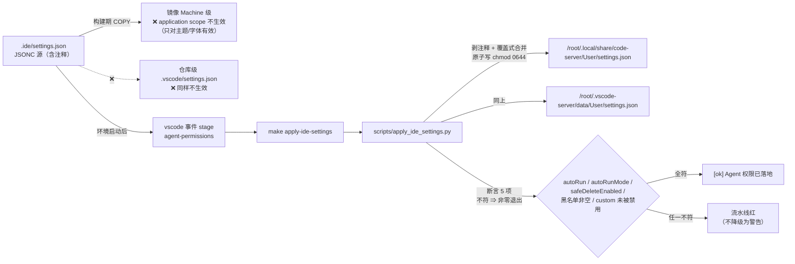

# 0032. Agent 命令闸门放宽为「默认全自动 + 少数不可逆操作弹确认」，并以启动期 stage 保证设置真正落地

- **状态**：**已接受**（2026-09-25；项目所有者批准，授权类别 **F**——放宽 Agent 命令闸门）
- **日期**：2026-09-25
- **决策者**：`Le0n3rd`（批准）／AI 代理（整理与论证）
- **相关（本仓库）**：
  [ADR-0016](0016-cnb-platform-integration-and-remote-write-authorization.md)（**远端写入 A~F 分级**——
  本决策把其中的 B/D/E 类红线**下沉为命令行提醒**，见 §2 的 `S-3`）、
  [ADR-0018](0018-agent-team-collaboration-mechanism.md)（**成员 `enabledAutoRun: true`**——
  本决策是同一取向在**主 Agent 命令闸门**上的延续）、
  [ADR-0025](0025-benchmark-automation-moves-to-dev-bucket.md)（`services: [vscode]` 的分桶判据——
  本决策新增的 `vscode` 事件 stage 与它同源）、
  [`git-workflow.md`](../engineering/git-workflow.md) §4（**可回退性判据**；本决策的黑名单条目按它取材）、
  [`agent-command-gate.md`](../engineering/agent-command-gate.md)（**本决策的工程机制详解**，
  含生效路径图、复跑命令与故障判据）、
  [`threat-model/untrusted-input-and-agentic.md`](../design/threat-model/untrusted-input-and-agentic.md)
  的 **`T-15`**（本决策引入的新威胁面与残余风险，**状态 = 部分缓解**）
- **相关（同平台参考实现）**：`compute-matrix` 的 `apply-workspace-settings` 步骤与其
  `docs/platform-facts.md` §10.2/§10.4（**⚠️ 该仓库不在本组织可见列表中，本轮无法直接读取**——
  见 §10 的 `U1`；本文对它的引用一律来自本次任务下达的口径与本仓库 `.cnb.yml` 的既有注释，
  **不声称已逐字核对原文**）
- **上游来源（访问日期 2026-09-25）**：本机扩展产物
  `~/.local/share/code-server/extensions/tencent-cloud.coding-copilot-4.12.38765564-universal/package.json`
  与其 `out/extension/index.js`（**本文所有关于扩展行为的论断均以这两处为证据**，见 §7 的 `V1`/`V2`）
- **边界声明**：本文**只**决定（a）主 Agent 命令闸门的默认行为与保留确认的范围、
  （b）通过什么机制让它在本环境**真正生效**。**不**决定远端写入授权分级本身（那是 ADR-0016）、
  **不**决定团队成员的 `enabledAutoRun`（那是 ADR-0018）、**不**改任何威胁条目的既有结论
  （新威胁另立 `T-15`，见 §6）。

---

## 1. 背景与问题

### 1.1 触发：闸门强度与使用场景不匹配

所有者 2026-09-25 下达 **F 类**授权：**放宽 Agent 命令执行闸门**。理由（使用场景，非本文推断）：
本项目的日常操作大量是**只读且可回退**的（`git status`、`grep`、`make check`、跑单测、读日志），
在"每一类命令都逐次弹确认"的默认档下，这些操作把交互切成碎片；而**真正不可逆的操作**
（强推、改写历史、`rm -rf /`、删库）恰恰**不是**靠"逐次点确认"能防住的——它们发生时，
点击者往往并不知道自己在点掉什么。

⇒ 目标形态：**默认全自动；对少数不可逆操作保留确认。** 这与 [ADR-0018](0018-agent-team-collaboration-mechanism.md)
把五份成员定义改为 `enabledAutoRun: true` 是**同一取向**（效率优先、把范围约束写进纪律），
只是这次的对象是**主 Agent 的命令执行**而非成员。

### 1.2 真正的难点不是"配什么"，而是"配了不生效"

**这是本 ADR 存在的根本理由**——第一版实现（把 `codingcopilot.*` 写进仓库里的设置文件）
**看起来完全正确，运行时却照样弹确认**。根因有三层，全部**已自证**（证据见 §7 的 `V1`）：

| # | 事实 | 证据（可复现） |
| --- | --- | --- |
| **F-1** | `codingcopilot.autoRun` / `safeDeleteEnabled` / `safeDeleteBulkThreshold` / `customBlacklistCommands` / `disabledSecurityCategories` / `autoAcceptWebSearch` 六键的 **`scope = application`** | 读扩展 `package.json` 的 `contributes.configuration.properties`：上述六键均声明 `"scope": "application"`（`autoRunMode` **未声明**，见 §5.3 的 `N-2`） |
| **F-2** | `scope = application` 的含义是**只能写在 User 级**：仓库级 `.vscode/settings.json` 与镜像里 Machine 级的那份**都不生效** | VS Code 配置作用域语义（`application` > `machine` > `window` > `resource`）；`.ide/Dockerfile` 的 COPY 落在 Machine 级 ⇒ 对 window/machine 级设置（主题、字体、缩进）有效，**对这六键无效** |
| **F-3** | **平台会在环境启动时用自己的一份覆盖 `User/settings.json`** | ⇒ **构建期** COPY 进 User 级的键**会被抹掉**。这就是"配置看起来是对的、运行时照样弹确认"的**直接根因** |

⇒ 推论：**`.ide/settings.json` 单独存在不会自动生效。** 唯一的可靠时机是
**环境启动之后**、由平台的事件钩子把设置**合并**进**运行中的** User 文件。

### 1.3 一个必须先钉住的不变式

上面三条合起来得出一个**结构性要求**（本决策的核心，写进 §5）：

> **任何"仓库里声明了 Agent 权限配置"的状态，都必须同时存在一个"环境启动后把它写进 User 设置
> 并断言"的机制。二者**成对存在**，缺一即静默失效。**

"静默失效"是本项目反复记录的头号失败模式（配置写了、文档也说了，**但运行时不生效且看不出区别**）——
与 `security-scan-gate-config.md` 全篇（"配置写了但没生效"家族）同源。

---

## 2. 决策驱动因素

| 编号 | 因素 | 说明 | 类型 |
| --- | --- | --- | --- |
| **S-1** | **效率** | 日常操作（只读 / 可回退）不应被逐次审批切断；这是所有者下达 F 类授权的直接动因（§1.1） | 偏好（本次决策的**主目标**） |
| **S-2** | **不可逆操作必须仍被拦一次** | 放宽 ≠ 全放开。**删库 / 强推 / 改写历史 / 格式化磁盘**这类操作一旦发生**无法回退**，必须保留"人再看一眼"的机会 | 硬约束 |
| **S-3** | **黑名单必须取材于既有红线，不得另立一套** | 本项目的红线判据**已经存在**：[`git-workflow.md`](../engineering/git-workflow.md) §4 的 **A~F 分级**与 `SECURITY.md`。黑名单**只能是它的投影**，不得成为第二个真源 | 硬约束 |
| **S-4** | **配置不生效必须变红，不得静默** | §1.2 的教训：一个"看着对但不生效"的配置比没有配置更坏（它会让人以为已受保护） | 硬约束 |
| **S-5** | **不得声称它是安全边界** | 黑名单是**文本匹配**，可被改写绕过（`r''m`、变量展开、`python -c "shutil.rmtree('/')"`）。它是**提醒层**，真正的判据仍是 S-3 的纪律与威胁模型 | 硬约束 |
| **S-6** | **改动范围最小化** | 复用平台既有机制（`vscode` 事件的 `stages`），**不新增平台能力、不改平台侧设置** | 偏好 |
| **S-7** | **零新增依赖** | 合并脚本只用标准库（`json` / `os` / `pathlib` / `tempfile` / `argparse`）——因为它要在**环境启动期**跑，此时 `make setup` 未必跑过、`uv` 环境未必就绪 | 硬约束 |
| **S-8** | **关掉内置类别是**有代价**的，必须如实登记** | 内置 12 类里含 `injection`。关掉它 ⇒ 下载即执行（`curl … \| sh`）**不再被拦**（§4 方案 C 的讨论、§6 的残留风险） | 硬约束 |

---

## 3. 候选方案

### 方案 A：把 `codingcopilot.*` 写进**镜像**里的 Machine 级设置（`.ide/Dockerfile` 的 COPY）

- 简述：沿用旧做法——`.ide/settings.json` 由 Dockerfile COPY 进镜像的 Machine 级目录。
- 优点：**零新增脚本、零新增流水线**；与主题/字体等既有设置同一路径。
- 缺点：**根本不可行**——这六键是 `scope = application`（`F-1`）⇒ Machine 级**不生效**；
  即使作用域对了，平台启动时还会覆盖（`F-3`）⇒ **改了这一层，行为一点不变，且看不出区别**。
- **结论：否决（事实性不可行，非取舍）。**

### 方案 B：把键写进**仓库级** `.vscode/settings.json`

- 简述：随仓库走，开发者打开就用。
- 优点：版本管理自然、无需环境机制。
- 缺点：同 A——`scope = application` 明确**不受**仓库级设置影响（`F-1`）；
  且它**只在 code-server 打开工作区时**生效，对 Remote-SSH 客户端并不保证。
- **结论：否决（事实性不可行）。**

### 方案 C：**保留** 12 个内置安全类别，只加自定义黑名单（不关任何类别）

- 简述：内置类别是"文本启发式"，保留它们等于多一层拦截；只在其上叠加自定义黑名单。
- 优点：**不放弃任何拦截**，安全侧最保守；无需论证"关掉 injection 的代价"。
- 缺点：① 内置类别的**误报源多**（典型：`(curl|wget).*\|(sh|bash|python)` 命中即判 `injection` 高危，
  而"下载安装"是**本项目的日常合法操作**）⇒ 闸门会**频繁打断正常工作**，
  与 `S-1`（效率）直接冲突；② 内置类别的规则是**黑盒**（随扩展版本变化），
  "到底拦了什么"不可评审；③ 全关之后"**拦截范围 = 明确列出的 33 条**"，**可评审、可回归**；
  ④ 参考实现（`compute-matrix`）实测其**主要误报源**正是 `curl|sh` 一类。
- **结论：不采纳**（但**其代价已在 §6 逐条登记**，且**回退只需删一行**，见 §5.4）。

### 方案 D：**关闭内置类别 + 33 条自定义黑名单 + 启动期 stage 落地**（**推荐**）

- 简述：三件事一起做——(1) `autoRun` 全自动、清空内置类别（只留 `custom`）；
  (2) 用 33 条正则承接**不可逆操作**与**本项目 B/D/E 类红线**；
  (3) 新增 `.cnb.yml` 的 `vscode` 事件首段 stage，在**环境启动后**把 `.ide/settings.json`
  合并进**运行中的** User 设置并**断言**。
- 优点：① 满足 `S-1`（日常零摩擦）与 `S-2`（不可逆仍拦一次）两项目标；
  ② 拦截范围**显式、可评审、可回归**（33 条可被单测逐条匹配验证）；
  ③ `S-4` 由**断言 + 非零退出**保证（配置不生效 ⇒ 流水线红，不是静默）；
  ④ 设置文件与落地机制**成对存在**，且该不变式**已被单测钉住**（§7 `V3`）。
- 缺点：① 关掉 `injection` 有**已知代价**（S-8）；② 黑名单是**提醒层**（S-5）；
  ③ 引入两个新的漂移面：**设置文件 ↔ 断言列表**、**设置文件 ↔ stage**（两者的对策见 §5.5 与 §7）；
  ④ 双容器模式下会"永远绿、永远不生效"（§5.6 的 `N-4`）。

### 方案 E：只在**档位**上放宽（保留内置类别，但把它们的处置从"ask"改成"自动放行已白名单的"）

- 简述：不动黑名单集合，只调整 autoRun 的放行条件。
- 优点：理论上面更小。
- 缺点：**扩展不提供这个粒度**——`autoRun` 是"放行所有未被 SafetyRule 命中的命令"，
  没有"放行白名单子集"的开关（据 §7 `V2` 的
  `resolvePermissionDecision` 读取：只有 hook 决策 → SafetyRule → autoRun/PermissionRule 的**固定顺序**，
  没有"内置类别按条目放行"这一档）⇒ 该方案**在现版本扩展上不可表达**。
- **结论：否决（当前版本不可表达；若将来扩展提供粒度，应重新评估）。**

---

## 4. 权衡对比

评分 1~5（越高越好）。权重反映本项目的优先级：**安全/不静默 > 效率 > 落地成本**。

| 评估维度 | 权重 | A 镜像 COPY | B 仓库级 | C 保留内置类别 | **D 关类别+黑名单+stage（推荐）** | E 只调档位 |
| --- | --- | --- | --- | --- | --- | --- |
| **能否真的生效**（硬性，否则一文不值） | 5 | 1 → 5 | 1 → 5 | 5 → 25 | **5 → 25** | 1 → 5 |
| 满足 `S-1` 效率 | 4 | — | — | 2 → 8 | **5 → 20** | 4 → 16 |
| 满足 `S-2` 不可逆仍拦 | 4 | — | — | 5 → 20 | **4 → 16** | 2 → 8 |
| 拦截范围**可评审 / 可回归** | 4 | — | — | 2 → 8 | **5 → 20** | 3 → 12 |
| 配置不生效会**变红**（`S-4`） | 4 | 1 → 4 | 1 → 4 | 3 → 12 | **5 → 20** | 1 → 4 |
| 落地成本（越低越高分） | 2 | 5 → 10 | 5 → 10 | 4 → 8 | 3 → 6 | 4 → 8 |
| 对既有红线的**单一真源**（`S-3`） | 3 | — | — | 3 → 9 | **4 → 12** | 3 → 9 |
| **加权合计** | **26** | 19 | 19 | 90 | **119** | 62 |

三点读法：

1. **A / B 不是"差一点"，是"完全没作用"**——它们在"能否真的生效"这一格就是 1 分。
   本文把它们列为候选，是为了**避免将来有人再试一遍**（这正是 ADR"防止重复讨论"的用途）。
2. **C 与 D 的差别只在两处**：效率（C 的误报会持续打断工作）与可评审性（D 的拦截范围是显式列表）。
   代价是 D 关掉了 `injection` ⇒ 下载即执行不再被拦。**这是本决策唯一一处真正的取舍**，
   已作为 `S-8` 登记，并写进 §6 的负面后果与 `T-15`。
3. **E 低于 A/B 之外的所有方案，因为它根本不可表达**——它假设扩展有"按条目放行"的粒度，
   而 `V2` 的读取证明它没有。**保留它在此，是为了让"以后想调档位"的人先看到"没有这个开关"。**

---

## 5. 决策

**决定采用：方案 D** —— 默认全自动 + 33 条黑名单提醒 + 启动期 stage 落地并断言。

理由（三条）：

1. **它同时满足本次授权的两个目标**：`autoRun` 全自动解决 `S-1`；
   保留的 33 条黑名单覆盖**全部不可逆操作**与**本项目 B/D/E 类红线**，解决 `S-2`。
2. **它把"配了不生效"这个真正的坑堵死**（§1.2）：设置文件与启动期 stage **成对存在**，
   并由**断言 + 非零退出**保证落地（`S-4`）；
   该不变式不是写在文档里，而是**已被单测钉住**（§7 `V3` 的
   `test_vscode_event_applies_settings_at_environment_start`）。
3. **它的拦截范围可评审、可回归**：33 条以正则形式**显式列出**，
   且单测断言"每条都是合法正则"与"5 条不可逆基线必被覆盖"（§7 `V4`）。

### 5.1 落地内容（三项，一一对应"文件 → 机制 → 证据"）

| # | 内容 | 载体 | 证据 |
| --- | --- | --- | --- |
| 1 | `codingcopilot.autoRun=true`、`autoRunMode="runEverything"`、`autoAcceptWebSearch=true`；`disabledSecurityCategories` = 12 类（**只留 `custom`**）；`customBlacklistCommands` = **33 条正则**；`safeDeleteEnabled=true` + `safeDeleteBulkThreshold=200` | `.ide/settings.json` | §7 `V4`（33 条均为合法正则 + 5 条基线被覆盖）；条数与类别数由 `apply_ide_settings.load_json_object` 实测（**33 / 12**） |
| 2 | 启动期 stage `agent-permissions`（`set -eu` + `make apply-ide-settings`），位于 `.cnb.yml` 的 `vscode` 事件**首个** stage | `.cnb.yml` | §7 `V3`（单测断言 `make apply-ide-settings` 与 `- name: agent-permissions` 都在 `vscode` 事件块内） |
| 3 | 合并脚本：JSONC → 严格 JSON → **覆盖式合并**（保留平台键、剔除 `//` 注释键）→ **原子写 + `chmod 0644`** → **断言**（不符即非零退出） | `scripts/apply_ide_settings.py`（+ `Makefile` 的 `apply-ide-settings` 目标） | §7 `V5`（单测 **17 条**，含 4 条"改坏必红"的参数化变异用例） |

### 5.2 黑名单的取材口径（`S-3` 的落地，防"第二个真源"）

33 条**不是**新发明，而是既有红线的**投影**：

| 分组 | 条数 | 取材于 | 举例 |
| --- | --- | --- | --- |
| A · 文件系统 / 磁盘（不可逆） | 10 | 通用不可逆操作 | `rm -rf /`、`--no-preserve-root`、`dd of=/dev/`、`mkfs*`、`fdisk`/`parted` |
| B · 数据库（「删库」） | 4 | 同 A；`safeDeleteBulkThreshold` 是同一红线的**另一道**（见 `N-3`） | `DROP DATABASE`、`dropdb`、`FLUSHALL` |
| C · 宿主 | 2 | 会把环境本身弄没 | `shutdown` / `reboot` / `poweroff`、fork bomb `:(){ ` |
| D · Git / 仓库 | 15 | **[ADR-0016](0016-cnb-platform-integration-and-remote-write-authorization.md) 的 B / D / E 类红线** + 多会话纪律 | 强推、`--delete`、`push … :branch`、`reset --hard`、改写历史的 `rebase`/`filter-*`/`reflog expire`、`clean -fdx`、`restore .`、`stash`、`push main`（**B**）、`push bench/data`（**E**）、`--no-verify` |
| E · 混淆执行 | 1 | `injection` 类别关闭后的**最小补位** | `base64 -d … \| ` |

> **两处刻意的取舍，必须连读**：
> - **`curl … | sh` 故意不拦**。它是参考实现实测到的**最大误报源**（安装惯用法），
>   拦它会持续打断正常安装；⇒ 登记为**已知风险**（`S-8`、§6、`T-15`），**不声称已覆盖**。
> - **`git rebase` 用负向先行断言排掉 `--abort/--continue/--skip/--quit`**：
>   这四个是**中止 / 收尾**，**不改写历史**，不应触发确认。
>   ⚠️ 这是"正则里带条件"的一处**脆弱点**，见 §10 的 `U3`。

### 5.3 生效机制：为什么必须是"启动后合并 + 断言"

**读图要点（三条，均为刻意设计）**：

1. **两条虚线是"看起来对、实则无效"的两条路**（方案 A / B）——画在图上是为了让后来者一眼看到"此路不通"。
2. **断言项是"缺一即不算落地"的清单**，不是"越多越好"：
   `autoRun` / `autoRunMode` / `safeDeleteEnabled` **精确等于**期望值；
   `customBlacklistCommands` **非空**；`disabledSecurityCategories` **不含 `custom`**。
3. **最后一条最容易漏、后果最隐蔽**：一旦 `custom` 被放进禁用列表，
   上面 33 条黑名单会**静默失效**——所以它被单独断言（`N-1`）。

### 5.4 回退（两条，成本都极小）

| 想放弃什么 | 动作 | 残留影响 |
| --- | --- | --- |
| 只想恢复**防注入**拦截 | 从 `disabledSecurityCategories` **删掉 `"injection"` 一行** | 无（其余 11 类仍关、黑名单不变） |
| 想**整体回退**本决策 | 从 `.cnb.yml` 的 `vscode` 事件**删掉 `agent-permissions` stage**（可一并删设置文件里的 `codingcopilot.*` 段） | 恢复到扩展默认档；⚠️ **删 stage 前请先看 §7 `V3`**——单测会因此变红，这正是设计意图 |

### 5.5 与既有决策的关系（互补，**不得分叉**）

| 维度 | [ADR-0016](0016-cnb-platform-integration-and-remote-write-authorization.md)（远端写入分级） | [ADR-0018](0018-agent-team-collaboration-mechanism.md)（团队协作） | **本 ADR（0032）** |
| --- | --- | --- | --- |
| 决策对象 | **谁**可以写远端、写哪里、何时批准 | **成员**能不能自动执行工具 | **主 Agent** 的命令闸门默认档位、以及它如何生效 |
| 与黑名单的关系 | **A~F 是判据真源**；黑名单只是它的**命令行投影**（§5.2 的 D 组） | 无交集（成员不弹审批，**本决策管的是主 Agent**） | **不改 A~F 的定义**，也不改分级集合 |
| 分叉风险 | 若黑名单被当成"红线清单"的第二真源 ⇒ 两处口径 | — | ⇒ **判据一律以 `git-workflow.md` §4 为准**；黑名单**不得**被表述为"完整红线"（§6 的 `N-5`） |

### 5.6 已知限制（**如实登记，不得含糊**）

| 编号 | 限制 | 说明 |
| --- | --- | --- |
| **N-1** | **`custom` 类别被禁用 ⇒ 黑名单静默失效** | 这是"最容易犯、后果最隐蔽"的一种改坏 ⇒ 已由断言单独覆盖（§5.3 第 3 点） |
| **N-2** | `codingcopilot.autoRunMode` **在扩展 `package.json` 中未声明** | 扩展内部读的是 `chat.autoRunMode`；写上**无害**且与参考实现一致，断言它是**为将来版本变化留的探针**，**不是**"它当前生效"的证明 |
| **N-3** | **`safeDelete` 与"禁用的类别"是两件事** | 关掉 `fileDelete` 类别**不影响**回收站机制（回收站是独立机制）⇒ 防删库红线**不因关类别而消失** |
| **N-4** | **双容器模式下会"永远绿、永远不生效"** | stages 与 code-server 不在同一容器 ⇒ 脚本**写成功但写进错误的容器**，且**从容器内部无法检测**（本镜像自带 code-server ⇒ 目录存在性判据失效）。结构性解法 = **单容器镜像**（本仓库 `.ide/Dockerfile` 自装 code-server，**已满足**）。见 `T-15` 与 `agent-command-gate.md` 的故障判据 |
| **N-5** | **黑名单是提醒层，不是安全边界** | 改写命令即可绕过（`r''m`、变量展开、`python -c "shutil.rmtree('/')"`）。**真正的判据**是 `SECURITY.md` 与 `git-workflow.md` §4 的纪律 |
| **N-6** | **`chatModeSettings` 属面板会话态** | 需**面板 / 页面重载**才重新初始化 ⇒ 改完设置后**当前面板可能仍按旧档行为**，不要据此判"没生效" |
| **N-7** | **关掉 `injection` 后 `curl \| sh` 不再被拦** | 已知且**刻意**的取舍（§5.2）⇒ 恢复方式见 §5.4。此项**不得**被表述为"已缓解" |

---

## 6. 后果

### 正面

- **日常操作零摩擦**：只读 / 可回退的命令不再逐次弹确认（`S-1`）。
- **不可逆操作仍被拦一次**：33 条覆盖通用不可逆操作与本项目 B/D/E 类红线（`S-2`）。
- **"配了不生效"这一整类失败模式被堵死**：设置文件与启动期 stage **成对存在**且被单测钉住；
  落地状态由**断言 + 非零退出**保证（`S-4`）。
- **拦截范围从黑盒变白盒**：从 12 个随扩展版本漂移的内置类别，变成**仓库里可评审、可回归的 33 条**。
- **回退成本 ≈ 一行 / 一个 stage**（§5.4），不需要任何数据迁移。

### 负面（必须承认）

| # | 负面 | 说明 |
| --- | --- | --- |
| 1 | **关掉 12 个内置类别是一次真实的安全能力下降** | 其中 `injection` 最要紧：下载即执行（`curl … \| sh`）**不再被拦**。这不是"看起来差不多"，而是**少了一道（虽然误报很多的）拦截**⇒ 已作为 `S-8` 与 `T-15` 如实登记 |
| 2 | **黑名单是提醒层，且可被绕过** | 文本匹配对改写形式无效（`N-5`）。**不得**读成"不可逆操作已被阻断" |
| 3 | **引入了两个新的漂移面** | ① **设置文件 ↔ 断言列表**（断言写死 `autoRun=true` 等，改设置文件不同步改断言 ⇒ 单测红）；② **设置文件 ↔ stage**（删 stage ⇒ 设置静默失效）。两者**都有机器检查**，但检查本身需要维护 |
| 4 | **加了"没有对应开关"的隐含假设** | 本决策依赖扩展**内部行为**（判定顺序 `SafetyRule` 先于 `PermissionRule`、黑名单大小写敏感、按 `\|`/`&&`/`;` 切分命令）。这些**随扩展版本变化**且**不由我们控制** ⇒ 见 §7 `V2` 与 §10 的 `U3` |
| 5 | **`N-4` 的双容器风险无法自检** | 当前靠"单容器镜像"这一**结构前提**规避，而非靠检测。若将来镜像形态变化，这一层会**静默失效** |
| 6 | **它使"哪些命令会被拦"变成一份需要长期维护的清单** | 33 条只增不减的倾向是真实风险 ⇒ 删除条件与复核点写死在 §7 |

### 风险与缓解

| 风险 | 影响 | 缓解措施 |
| --- | --- | --- |
| 设置文件被改坏（黑名单写空 / `custom` 被禁用） | 闸门静默失效，且运行时看不出区别 | 脚本**断言**（§5.3 第 2/3 点）+ 单测的 4 条"改坏必红"变异用例（§7 `V5`） |
| 启动期 stage 被删 / 改名 | 整个决策**静默失效**（退回扩展默认档） | 单测 `test_vscode_event_applies_settings_at_environment_start`（§7 `V3`）——**删 stage 即门禁红** |
| 扩展升级改变判定顺序或配置名 | 黑名单命中不再弹确认（或反过来处处弹） | §7 `V2` 的**读取式核查**（读 `package.json` 与 `resolvePermissionDecision`）；当前结论见 §7；**升级后须复跑** |
| 黑名单被误当作"完整红线清单" | 形成第二真源，与 `git-workflow.md` §4 分叉 | §5.5 的分工表 + §5.2 的取材口径 + 设置文件内的注释（**不得**表述为完整清单） |
| 双容器模式（`N-4`） | 永远绿、永远不生效 | 结构性解法 = 单容器镜像（**已满足**）；判据与排查见 `agent-command-gate.md` |
| 黑名单条目长期只增不减 | 误报累积、维护成本上升 | §7 `V6` 的**复核点与删除条件** |

---

## 7. 验证方式

> **口径**：本节的每条都必须**可复现**（命令或读取路径）。**没有验证方式的缓解视为未实现**
> （`SECURITY.md` §4 同源口径）。当前状态一并标注（✅ 已跑 / ⚠️ 待复核）。

| # | 验证项 | 怎么验 | 通过判据 | 状态 |
| --- | --- | --- | --- | --- |
| **V1** | **`scope = application` 自证** | 读 `~/.local/share/code-server/extensions/tencent-cloud.coding-copilot-4.12.38765564-universal/package.json` 的 `contributes.configuration.properties`，核对六键的 `scope` | 六键均为 `"scope": "application"`（`autoRunMode` 未声明，属 `N-2`） | ✅ 已跑（2026-09-25）：`autoRun`/`safeDeleteEnabled`/`safeDeleteBulkThreshold`/`customBlacklistCommands`/`disabledSecurityCategories`/`autoAcceptWebSearch` **均 `application`**；`autoRunMode` **NOT DECLARED** |
| **V2** | **判定顺序**（黑名单命中不被 autoRun 吃掉） | 读扩展产物 `out/extension/index.js` 的 `resolvePermissionDecision` | `checkSafetyRules` **先于** permission 规则求值；命中且 `requiresApproval` ⇒ `ruleType=="deny"` 时 deny，否则 **`allowed=True` + `needUserConfirm=True`**（`source="safety_rule_ask"`）⇒ 即"**弹确认而非直接拒绝**" | ✅ 已跑（2026-09-25）：函数体首句为 `if("deny"===ir?.decision)`，随后进入 `const ir=ar.checkSafetyRules(rn); if(ir.requiresApproval)…`，**在** `tn.checkPermissionRules(rn)` **之前** |
| **V3** | **设置文件与 stage 成对存在** | `uv run pytest tests/unit/test_apply_ide_settings.py -q`（其中 `test_vscode_event_applies_settings_at_environment_start` / `test_makefile_exposes_the_apply_target`） | 断言 `.cnb.yml` 的 `vscode` 事件块内含 `make apply-ide-settings` 与 `- name: agent-permissions`；`Makefile` 含 `apply-ide-settings:` 与 `scripts/apply_ide_settings.py` | ✅ 已落地（`ec8791d`）；**变异探针**：删/改该 stage ⇒ 该用例必红 |
| **V4** | **仓库里的设置能过全部断言** | 同上单测的 `test_repo_settings_file_satisfies_every_guard` / `test_repo_blacklist_patterns_are_valid_regex` / `test_repo_blacklist_covers_the_irreversible_baseline` | ① 五项断言全过；② 33 条**逐条** `re.compile` 不抛错；③ 5 条不可逆基线（`rm -rf /`、`git push --force`、`git reset --hard`、`mkfs.ext4`、`dd … of=/dev/`）**每条**至少被一条正则命中 | ✅ 已落地（条数实测 **33**） |
| **V5** | **断言非恒过**（fail-secure） | 单测的 4 条参数化用例（`autoRun=False` / `safeDeleteEnabled=False` / 黑名单 `[]` / 禁用 `custom`） | 每种改坏都**必须**被 `guard_failures` 报出；`main()` 端到端写文件并返回 0；`--target` 指向不存在目录时**自动建目录**且落盘 `0o644` | ✅ 已落地（`ec8791d`；实测 `pytest` 收集 **17 条** = 14 个用例函数，其中 1 个参数化 ×4） |
| **V6** | **落地状态可断言**（启动期） | 环境内跑 `make apply-ide-settings` | 退出码 **0** 且打印 `[ok] Agent 权限已落地（autoRun / autoRunMode / safeDeleteEnabled / 黑名单 / 类别 均核对通过）` | ⚠️ **待复核**：需在**真实环境启动后**核对（本次任务不在其范围）；**复核时点见下** |
| **V7** | **黑名单确实生效**（行为） | 在会话内触发一次黑名单命中命令（例如 `git push --force`），观察是否弹确认 | **弹确认**（`source="safety_rule_ask"`），**不是**直接拒绝、**也**不是静默执行 | ⚠️ **未执行**（属人工核对，**不可由 CI 断言**——它发生在功能面板而非仓库内） |
| **V8** | **双容器风险的结构前提仍成立** | 核对 `.ide/Dockerfile` 是否**自装 code-server**（单容器） | 镜像自带 code-server ⇒ `N-4` 的结构前提成立 | ✅ 已满足（本仓库 `.ide/Dockerfile`）；**镜像形态变化时须重核** |

**复核时间点（写死，避免"只增不减"）**：

1. **每次扩展版本升级后**：复跑 `V1` / `V2`（读 `package.json` 与 `resolvePermissionDecision`）——
   这两条结论**绑在版本号 `4.12.38765564`** 上，升级即失效。
2. **下一次真实环境启动后**：跑 `V6`（`make apply-ide-settings`）与 `V7`（人工触发一次黑名单命中）。
3. **每季度或每次红线条目变更时**：核对 `V4` 第 ③ 条（5 条不可逆基线仍被覆盖）
   与 `V8`（镜像仍是单容器）。

**删除条件**：

- 某条黑名单**连续两个季度未命中任何真实操作，且其对应的红线条目已从
  `git-workflow.md` §4 / `SECURITY.md` 中删除** ⇒ 删该条；
- 若扩展将来提供"按条目放行内置类别"的粒度 ⇒ 重新评估方案 C / E（本文档即为防重复讨论的记录）；
- 若 `.cnb.yml` 的 `vscode` 事件被整体移除（例如改用别的启动机制） ⇒
  `agent-permissions` stage 必须**迁移**而非删除，`V3` 的断言随之更新。

---

## 8. 后续行动

- [x] 所有者批准（**F 类**，2026-09-25）
- [x] 落地三项内容（`.ide/settings.json`、`.cnb.yml` 的 `agent-permissions` stage、
      `scripts/apply_ide_settings.py` + `Makefile` 目标）——提交 `ec8791d`
- [x] 落单测 `tests/unit/test_apply_ide_settings.py`（**17 条** = 14 个用例函数，含"成对存在"不变式）
- [ ] **本 ADR 的配套文档**：`docs/engineering/agent-command-gate.md`（生效路径图 / 复跑命令 /
      常见故障 / 成对存在约束）——**同批产出**
- [ ] **威胁模型**：新增 `T-15`「Agent 命令闸门放宽为提醒层」（状态 = **部分缓解**），
      并在 `T-05` / `T-11` 的相关条目补一句联动——**同批产出**
- [ ] **环境启动后**复跑 `V6` / `V7`（见 §7 复核时间点第 2 条）——**记录员/领导域**
- [ ] 在 `docs/adr/README.md` 索引登记本 ADR（状态：已接受）——**同批产出**
- [ ] 在 `docs/devlog/` 当前篇记一条（含提交哈希、变更内容、验证方式）——**记录员域**

---

## 9. 回退

| 动作 | 影响 |
| --- | --- |
| 从 `disabledSecurityCategories` 删掉 `"injection"` | 恢复防注入拦截；其余不变 |
| 从 `.cnb.yml` 删掉 `agent-permissions` stage | 退回扩展默认档；**单测会红**（`V3`，属预期——请连同设置文件一起回退） |
| 删除 `scripts/apply_ide_settings.py` 与 `Makefile` 目标 | 与上一条同源；须同时删单测 |
| 全部回退 | 无数据迁移、无残留（设置只在运行时 User 文件里，环境释放即消失） |

---

## 10. 未验证项（不得当作事实引用）

| # | 待核验 | 影响 | 验证方式 |
| --- | --- | --- | --- |
| **U1** | `compute-matrix` 的 `apply-workspace-settings` 与 `docs/platform-facts.md` §10.2/§10.4 的**原文** | 本文对参考实现的引用**转自任务下达口径与 `.cnb.yml` 既有注释**，**未逐字核对** | 该仓库不在本组织可见列表（2026-09-25 实测 `404` / `403 errcode 10024`，见 `docs/research/2026-09-25-quota-measurement-and-cost-model.md` §7）⇒ **需所有者提供**；在此之前本节引用**不得**被表述为"已核对" |
| **U2** | `codingcopilot.autoRunMode` 的**实际语义与生效范围**（`package.json` 未声明，扩展内部读 `chat.autoRunMode`） | 决定断言它是否有意义 | 写最小会话对照：分别置 `runEverything` 与别的值，观察是否改变行为（在**面板重载后**做，见 `N-6`） |
| **U3** | 黑名单正则的**规避面与误报面**是否已穷尽 | 直接决定 `T-15` 的状态能否升级 | ① 构造改写变体（`r''m`、变量展开、`python -c "shutil.rmtree('/')"`、`sh -c` 包裹）逐条验证**是否能绕过**；② 对日常命令集（`make check`、`git status`、`uv run …`）验证**零误报**。**在没有这两组结果之前，`T-15` 不得离开「部分缓解」** |
| **U4** | 平台覆盖 `User/settings.json` 的**时机与范围** | 决定启动期 stage 是否**总是**晚于覆盖 | 在环境启动后立即读 `User/settings.json` 与 stage 日志的时序（`beforeEnd` 阶段会打印配置，见 `2026-09-25-cnb-platform-behavior-facts.md` §3.3） |
| **U5** | **双容器模式下能否有任何可检测信号**（`N-4`） | 决定该风险能否从"结构前提"变成"机器检查" | 起一个双容器形态的环境，观察 stages 所在容器的 `code-server` 进程与目标路径是否可分 |

> 纪律（沿用 `ADR-0015` §8.2 / `ADR-0017` §10）：上表任何一项在核验完成前不得写成结论性表述。

---

## 11. 修订记录

- **2026-09-25**：初稿并**同批落地**。状态**已接受**（所有者批准，F 类：放宽 Agent 命令闸门；
  实现提交 `ec8791d`）。依据：本机扩展产物
  `tencent-cloud.coding-copilot-4.12.38765564-universal` 的 `package.json`（`V1`）与
  `out/extension/index.js` 的 `resolvePermissionDecision`（`V2`）、
  `.ide/settings.json`、`.cnb.yml` 的 `vscode` 事件、`scripts/apply_ide_settings.py`、
  `Makefile` 的 `apply-ide-settings`、`tests/unit/test_apply_ide_settings.py`（**17 条**）；
  参考实现口径来自 `compute-matrix`（**未逐字核对**，见 `U1`）。
  **本 ADR 不修改任何既有 ADR 的结论**；与 ADR-0016 / 0018 的关系见 §5.5。
- **2026-09-25（修订 · 环境重建后实测）**：**更正 §6 第 4 条的一处事实**——命令链切分口径为
  `\|\|`、`&&`、`&`、`;`、换行，**不含单 `\|`**（出处：扩展产物 `splitCommandChain`；
  实机探针 `sn=cnb-174-1k3c5dnng`：`echo aGVsbG8= | base64 -d | cat` 命中并弹确认）。
  本文正文按"只增不改"保留原文，**该处以本条为准**；机制侧的完整更正与故障判据见
  [`agent-command-gate.md`](../engineering/agent-command-gate.md) §5 `D7` 与 §8。
  同批实测另确认：`V6` / `V7` **已闭环**——stage `agent-permissions` 为 success 且打印
  `[ok] Agent 权限已落地…`；运行中会话的日志出现 `Loaded 33 custom blacklist commands`、
  `Loaded 12 disabled security categories`（不含 `custom`）、`isAutoExecuteTerminal: true`；
  两次命中探针均判 `source=safety_rule_ask, allowed=true, needConfirm=true` 且经 `user_confirmed`
  ⇒ §7「复核时间点」第 2 条已完成。
- **2026-09-25（修订 · 设置源拆分与黑名单补漏）**：**设置源拆分为两份**，并**补 5 条窄口径黑名单**。
  - **拆分（§7 的"是否移除 COPY"由此结案，结论 = 不移除、改为拆分）**：`codingcopilot.*` 从
    `.ide/settings.json`（**在 `build.by` 里** ⇒ 改它即触发整机重建）移入新文件
    `.ide/agent-preferences.json`（**不进 `build.by`**、**不被 COPY**）。脚本改为**按序合并两源**；
    新增两条机器可判定的不变式（"运行期偏好不得成为构建输入" / "守卫键只出现在运行期那份"），
    由 `tests/unit/test_apply_ide_settings.py`（17 → **22 条**）钉住。
    ⇒ 收益 = "调黑名单不再重建镜像"（此前每次约 20 min，平台下发 `--no-cache`）**且**保留镜像级兜底；
    本 ADR §5.6 的 `N-7`、§6 的负面后果**均不受影响**（拆分只动"配置放哪、何时重建"，不动拦截范围）。
  - **补漏（只收紧、不放宽）**：`truncate`/`shred` 写块设备、`rm -rf /var/lib/<DB>`（「删库」的文件层路径）、
    `git push --mirror`、`git checkout .`、`git stash -u/-a`。**刻意不做**两件：① **不放宽** `git rebase`
    （文本层无法区分"已推送 / 未推送"）；② 不为非根级 `rm -rf` 加通则（会误伤 `rm -rf /usr/local/…`
    一类日常清理）。"把红线文本当数据"导致的误触发**接受**，规避手段写入 `agent-command-gate.md` 的 `D9`。
  - ⚠️ **本文正文里的"33 条"/分组表为历史快照，逐字保留**；**当前条数与最新口径**以
    [`agent-command-gate.md`](../engineering/agent-command-gate.md) §8（第三批）与
    `.ide/agent-preferences.json` 的注释为准。
