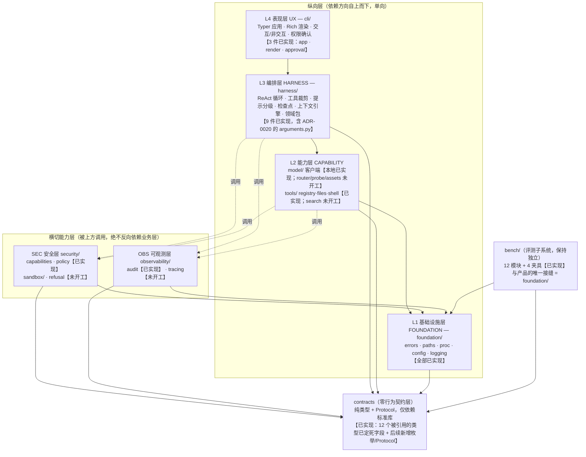
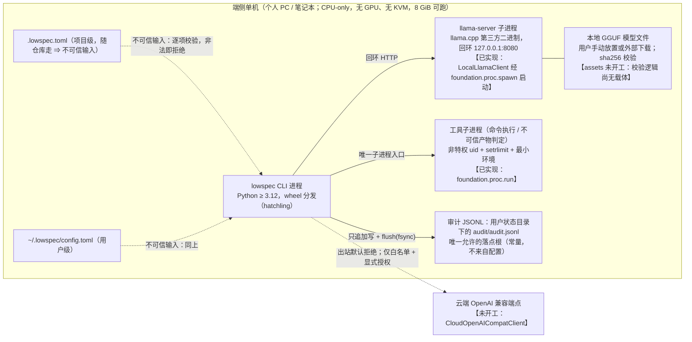
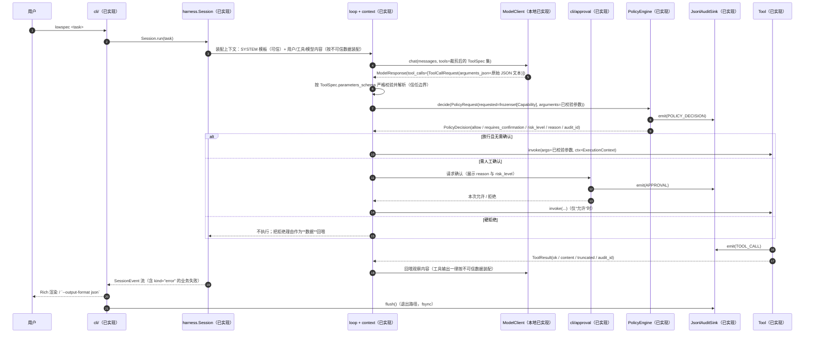
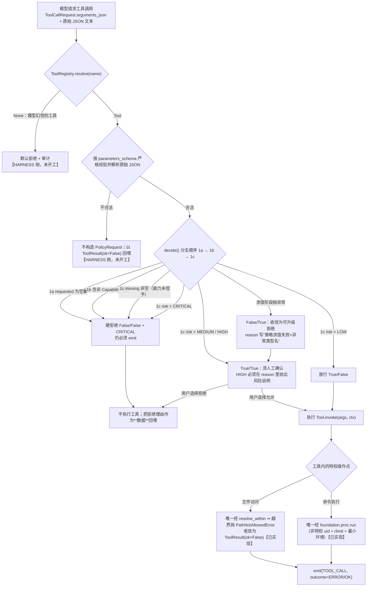

# 总体架构（分层 · 组件 · 数据流 · 部署形态）

- **状态**：成稿（2026-09-19）。本文件是 **`Phase 1`（要求与设计）出口件之一**——`sdlc.md` §3
  的 "架构设计成稿"；`sdlc.md` §3.1 已明确把它列为 **`M0` 出口之外**的交付物。
- **本文件的定位**：回答 "**系统长什么样、谁依赖谁、一次调用怎么走、不写什么**"，
  并**如实标注每一处是"规划"还是"已实现"**。
- **权威源与读取优先级**（三者冲突时的取舍顺序，**不是**可以自行改内容的授权）：

  | 内容 | 权威源 | 本文件的关系 |
  | --- | --- | --- |
  | 分层模型、依赖方向 `R1`~`R5`、目录结构、组件选型、被否决方案 | [`ADR-0015`](../adr/0015-layering-and-reuse-boundary.md) | **本文件不重新决策**，只做展开与实现对照 |
  | 边界处**签名与语义**（`chat` / `decide` / `emit` / `invoke`） | `ADR-0015` §5.1.2 | 本文件 §2.4 复述并指向契约 |
  | 每个类型的**字段名 / 字段类型 / 语义 / 不变式** | [`interfaces/`](interfaces/README.md) | **字段级一律以 `interfaces/` 为准** |
  | 威胁、缓解、残余风险、验证方式 | [`threat-model/`](threat-model/README.md) | 本文件只做**模块 ↔ 威胁**的落位索引，不重复论证 |
  | 需求条目与验收标准 | [`docs/requirements/srs.md`](../requirements/srs.md) | 本文件只给 §7 分组 ↔ 模块的映射（同 `ADR-0015` §5.1.3） |
  | 代码现状 | `src/agent_sec_perf/`（**唯一事实来源**） | 本文件 §4 的实现状态表逐行以文件与提交为依据 |

> **本文件不改任何决策，也不修任何既有文件的正文。** 若发现 ADR / 契约 / 实现三者矛盾：
> **停下上报**（见 §11 的登记与 `ADR-0015` §7.3 的"接口是否无歧义"判据），
> 由领导裁决，不在本文内"顺手修好"。

---

## 0. 先读这一段：三条必须写明的边界

**1. 本文件中的"已实现"以仓库文件与提交为准，不以下游文档的宣称或计划为准。**
`M0`（框架就绪）已于 2026-09-19 达成，但 `M0` 的判据只回答"**能不能开始写内核**"
（`sdlc.md` §3.1），**不回答"框架是否已完整"**。当前真实状态：

- **已实现**：`contracts/`（6 模块）、`foundation/`（5 件）、`security/{capabilities,policy}`、
  `observability/audit`、`model/client`（**仅本地回环**）、`tools/{registry,files,shell}`、
  **`harness/`（9 件）**、**`cli/`（3 件）**、`bench/`；
- **未开工**：`security/sandbox/`、`security/refusal.py`、`model/{router,probe,assets}.py`、
  `tools/search.py`、`observability/tracing.py`。

逐项依据见 **§4 实现状态表**。**不得**把 §5/§6 中"规划"的路径读成"已经在跑"——`harness/` 与
`cli/` 均已实现、各段也**单独有测试**；端到端闭环（`0.1.0` 的判据）**已有可跑路径**
（`tests/integration/test_end_to_end.py`，`fba8c4c`：真模型路径、标 `slow`、默认不跑），
**实跑结果以 `docs/devlog/` 的记录为准**（本文不代其宣称"已跑通"）。

**2. 本文件不得被读成"安全已到位"。** 威胁模型当前是
**已缓解并验证 0 条 / 部分缓解 8 条 / 未缓解 5 条**（`threat-model/README.md` §4.1），
口径是"**待办清单式的威胁模型**"。`ADR-0015` §7.2 的 `S1`（未授权工具调用被拒**且**审计可回放）
与 `S3`（领域包内 `.py` **永不**被导入）**仍未落地**，`S2` 只落了"拒绝"半。
凡本文提到某缓解，都必须回到威胁模型条目看它的**状态列**。

**3. "分层"与"横切"的区分不是排版偏好。** 安全与可观测的**真实形态是横切的**
——`REQ-SEC-01`（工具调用默认拒绝）与 `REQ-SEC-06`（每次调用与决策可回放）都不是某一段流水线，
而是**在每个特权操作点上被调用**。若安全层拿不到特权操作点的调用权，这两条需求就没有实现载体
（`ADR-0015` §4）。

---

## 1. 架构总览

### 1.1 分层与依赖方向（规划态；各节点的实现状态标在节点内）



**读图要点**：

- **实线**是"分层依赖"，**虚线**是"横切调用"；两者都必须是单向的，由机器检查强制（§2.2）。
- `contracts/` 是**零行为**层（只有类型、`Protocol`、常量），**谁都可以依赖它、它不依赖任何人**；
  它的存在是为了打破"安全层需要知道 `ToolCall` 的形状、工具层需要调用安全层"这一**循环依赖**。
- `bench/` **不在产品分层内**：它是评测子系统，演进节奏与产品解耦（`bench/data` 分支、
  `PROTOCOL_VERSION`、可比时间序列，见 `ADR-0014`），与产品的唯一接缝是**共享 `foundation/`**。

### 1.2 部署形态（端侧单机，无服务）



**部署形态的四条硬约束**（与 `SECURITY.md` 一致）：

| # | 约束 | 落点 |
| --- | --- | --- |
| 1 | **单机、无服务、无账号体系**：没有守护进程 / 服务端 / 数据库 / 多租户 | SRS `Won't`（无 Web UI、无账号）；`ADR-0015` §5.2.6 不引入追踪后端 |
| 2 | **无凭据存储**：凭据只经**环境变量**注入，契约**不含**凭据字段 | `interfaces/README.md` C8；`security/policy.md` §1 |
| 3 | **网络出站默认拒绝**：`NETWORK_OUTBOUND` 默认不授予；`ExecutionContext.network_allowed` 默认 `False`；`SandboxRequest.network_allowed` 默认 `False`；**本地模型客户端强制回环** | `interfaces/tools.md` §2.4、`interfaces/sandbox.md` §2.5、`model/client.py::LOOPBACK_HOSTS` |
| 4 | **无 GPU / 无 KVM**：内存档位用 `RLIMIT_AS`（cgroup 在本平台静默失效） | `ADR-0007` §3.1、`ADR-0015` D-1/D-6、`foundation/proc.py` |

**运维面（出错怎么定位）**：审计 JSONL（`REQ-SEC-06` 的可回放载体）+ `structlog` 结构化日志
（脱敏管线）+ 进程退出码 + **无持久会话状态**（崩溃后不残留半写缓冲：每次追加即关闭文件句柄）。
**回滚面**：产品端无数据库迁移、无服务端状态；回滚 = 换 wheel 版本 + 保留审计文件（只追加）。

---

## 2. 分层、依赖方向与边界接口

### 2.1 `R1`~`R5` 的含义（逐条对应 `ADR-0015` §5.1.1）

| 规则 | 内容 | 为什么需要它 |
| --- | --- | --- |
| **`R1`** | 纵向层**只能向下依赖**（`cli` → `harness` → `model`/`tools` → `foundation`），**禁止向上** | 向上依赖会让"上层改一处、下层跟着动"，分层失去意义；`foundation/` 一旦能 import `tools/`，"唯一子进程入口"就会被绕过 |
| **`R2`** | `security/` 与 `observability/` **不得** `import` `harness/`、`tools/`、`model/`、`cli/` | 横切层若反向依赖业务层，就变成"业务层的一部分"，无法被所有层调用；且安全判定的**输入面**会被业务层污染 |
| **`R3`** | `contracts/` **不得**依赖任何第三方包，也**不得**依赖本项目任何其他模块 | 契约是"所有层都能读的形状"；一旦它依赖第三方（或因放异常而依赖 `foundation/`），契约的版本耦合与信任面就扩散到全仓 |
| **`R4`** | 全项目**唯一**子进程入口是 `foundation/proc.py`；**唯一**路径校验入口是 `foundation/paths.py` | 子进程与路径是两个"失败代价不对称"的点：绕过一处就等于存在**第二条未被审计**的特权通道 |
| **`R5`** | 领域包（Domain Pack）**只加载声明式配置**（TOML/JSON），**禁止加载其中的 Python 代码** | 领域包是外部输入（可能随仓库走）；动态导入等于"把不可信仓库变成任意代码执行" |

### 2.2 机器检查（"约定只写在文档里"是本项目已复现过的失败模式）

`ADR-0015` §7.1 把分层落成 `tests/unit/test_architecture_layers.py` 的机器检查。**逐条对应如下**
（断言名取自该文件，可 `pytest tests/unit/test_architecture_layers.py -v` 复跑）：

| 检查 | 断言（照实现写） | 对应规则 |
| --- | --- | --- |
| `test_contracts_depend_only_on_stdlib_and_itself` | `contracts/` 下**不出现**任何第三方 import，也不导入本项目其它层 | `R3`（`V1`） |
| `test_layers_only_depend_on_allowed_layers` | 每层的 import 目标必须落在 §2.3 的白名单内 | `R1`/`R2` |
| `test_cross_cutting_layers_do_not_import_business_layers` | `security/`、`observability/` 不 import `harness`/`tools`/`model`/`cli` | `R2`（`V3`） |
| `test_foundation_does_not_import_business_layers` | `foundation/` 只允许 `contracts` 与标准库 | `R1`（`V4`） |
| `test_subprocess_is_used_only_in_foundation_proc` | `subprocess` 字样只允许出现在 `foundation/proc.py`（判定基于**相对路径**，不是文件名——防同名文件绕过） | `R4`（`V2`） |
| `test_no_shell_execution_anywhere_in_source` | 全仓无 `shell=True` | `R4` |
| `test_path_validation_is_defined_only_in_foundation_paths` | `resolve_within` 只定义在 `foundation/paths.py` | `R4` |
| `test_source_has_no_print_calls` | `src/` 下无 `print(`（AST 判定，避免误伤字符串） | `D-4`（`V5`） |
| `test_bench_has_no_independent_foundation_modules` | `bench/` 不再保留 `proc.py`/`paths.py`/`errors.py` 的独立实现 | `R4`（`V6`） |

`R5` **当前没有行为级机器检查**：静态守卫只覆盖"`src/` 无动态执行原语"
（`tests/security/test_no_dynamic_code_in_src.py`），而"领域包里的 `.py` 不被导入"这一**行为**断言
（`S3`）需要 `harness/domain_pack` 作为被测对象——**它尚未存在**，验证者据 `SECURITY.md` §4 的
口径**拒绝造测**（`threat-model/README.md` §5.1）。

### 2.3 谁可以依赖谁（逐层白名单，**以机器检查为准**）

下表取自 `tests/unit/test_architecture_layers.py` 的 `ALLOWED_DEPENDENCIES`（**这是当前机器检查的
实际判据**；未列出的目标一律视为违规）：

| 层 | 允许依赖的兄弟层 | 说明 |
| --- | --- | --- |
| `contracts` | **（无）** | 契约层零依赖；自身与标准库总是允许 |
| `foundation` | `contracts` | 不得 import 任何业务包 |
| `security` | `contracts`、`foundation` | 横切层：不得反向依赖业务层（`R2`） |
| `observability` | `contracts`、`foundation` | 同上 |
| `model` | `contracts`、`foundation`、`security`、`observability` | L2：在特权操作点可调用横切层 |
| `tools` | `contracts`、`foundation`、`security`、`observability` | 同上 |
| `harness` | `contracts`、`foundation`、`model`、`tools`、`security`、`observability` | L3：向下依赖 L2 与 L1，并调用横切层 |
| `cli` | `contracts`、`foundation`、`model`、`tools`、`harness`、`security`、`observability` | L4：Typer/Rich 的细节**限制在本层内**（其它层不得直接依赖终端） |
| `bench` | `contracts`、`foundation` | **不在产品分层内**：与产品的唯一接缝是 `foundation/` |

> **白名单是"允许"而不是"必须"**：例如 `cli` 允许 import `model`，但正常装配路径是
> `cli → harness.Session → model`。白名单放宽的部分（如 `model`/`tools` 允许依赖横切层）
> 存在的理由是：**特权操作点分散在 L2 L3 各级**，横切层必须能在这些点上被调用。

### 2.4 边界处的接口形态（签名 / 错误语义 / 并发 / 生命周期）

复述 `ADR-0015` §5.1.2（**字段级定义一律以 [`interfaces/`](interfaces/README.md) 为准**）：

| 边界 | 接口形态 | 错误语义 | 并发假设 | 资源生命周期 |
| --- | --- | --- | --- | --- |
| `cli` ↔ `harness` | `Session.run(task: str) -> Iterator[SessionEvent]`（**同步迭代器**；`ADR-0015` §5.1.2 原文的 `AsyncIterator` 已由 [`interfaces/harness.md`](interfaces/harness.md) §2.9 裁决更正，理由见该节） | 业务失败以 `SessionEvent(kind="error")` 表达，**不抛异常到 CLI**；逃逸的只有三类：`ConfigError`、**审计写入失败必须冒泡**（`interfaces/audit.md` §2.4，不得被收敛成 `error` 事件）、以及编程缺陷（`interfaces/harness.md` §2.9） | 单会话单线程；事件流串行产出 | `with Session(...) as s:`；退出按序：工具 → 模型客户端 → `llama-server` 进程 → `flush` 审计 |
| `harness` ↔ L2 | `ToolRegistry.resolve(name) -> Tool \| None`、`Tool.invoke(args, *, ctx) -> ToolResult`、`ModelClient.chat(messages, *, tools, ...) -> ModelResponse` | `ToolResult.ok=False` 表达**工具级失败**（可回喂）；`ModelUnavailableError` ⇒ 路由降级；`ModelProtocolError` ⇒ 重试一次后回喂 | `ModelClient` **非线程安全**，一个会话一个实例 | `close()` **幂等**；进程型后端由 `ExitStack` 托管 |
| L3/L2 ↔ SEC | `PolicyEngine.decide(PolicyRequest) -> PolicyDecision` | **fail-secure**：求值阶段任何异常都**不得**逃逸为 allow；审计 `emit()` 失败**必须冒泡** | 无状态、纯函数式，可多线程调用 | 无 |
| 任意位置 ↔ OBS | `AuditSink.emit(AuditEvent) -> None` / `flush()` | **写入失败必须冒泡**（静默丢事件 = `REQ-SEC-06` 验收失败） | 实现内部串行化写入 | 进程退出前**必须** `flush()` |
| L2 ↔ FOUNDATION | `proc.run(argv, *, cwd, timeout_s, isolation)`、`spawn(...)`、`paths.resolve_within(candidate, roots, *, what)` | `IsolationError`（隔离失败**不得**回退）、`ProtocolError`（超时/无法启动）、`PathNotAllowedError`（越界） | 阻塞式；进程句柄不跨线程共享 | 一次性工作目录由调用方创建与清理 |

**两处"处置相反"的规定必须分清**（本项目最易实现错的地方）：

- **策略求值失败 ⇒ 收敛为拒绝**（`allow=False`），**不得**抛给调用方；
- **审计写入失败 ⇒ 原样冒泡**，**不得**被上面的收敛逻辑吞掉。

两者表象都是"没执行"，但一个是**正常的默认拒绝**、一个是**系统坏了**。混为一谈 =
把一次审计基础设施故障伪装成一次普通拒绝（`interfaces/policy.md` §2.5）。

### 2.5 三类"接口先行"产物与它们的顺序

| 产物 | 位置 | 状态 |
| --- | --- | --- |
| 决策（分层 / 依赖方向 / 目录 / 选型） | `ADR-0015` | 已接受（2026-09-18）；`D7` 于 2026-09-19 收口 |
| 字段级契约（12 个类型的字段 / 语义 / 不变式） | [`interfaces/`](interfaces/README.md)（**6 份**，新增 `harness.md`） | 已建立；含 **9 项**未决项（`U1`~`U9`；`U5`~`U8` 已裁决，`U9` 逐项状态见其行） |
| 契约的**唯一实现** | `src/agent_sec_perf/contracts/` | 已实现（`33cf6b8` 建骨架；后续按各文件"改动清单"补齐） |

**变更顺序（不可颠倒）**：先改 `interfaces/`（说明动机与影响面）→ 再改 `contracts/` →
同步单测。若变更触及**决策**（分层 / 依赖方向 / 选型），按 ADR 规则**新增 ADR**（ADR 只增不改）。

---

## 3. 组件与选型（与 `ADR-0015` §5.2 / §5.3 逐条一致）

### 3.1 每个模块用了什么（组件 / 自研）

| 模块 | 组件（`ADR-0015` §5.2 的行） | 自研部分（`§5.3` 的自研模块） | 落地文件（现状） |
| --- | --- | --- | --- |
| `cli/` | **Typer** `0.27.2`（`A1`）+ **Rich** `15.0.0`（`A2`） | 交互 / 非交互（JSON）双形态、权限确认交互、中文优先 | **已实现**（3 件：`app` / `render` / `approval`；`4baa9e8` / `b4a7213` / `663c266`） |
| `harness/` | `tree-sitter` + `tree-sitter-python`（`F1`，用于上下文引擎的符号层） | **自研模块 2**：能力自适应 Harness（循环 / 工具裁剪 / 提示分级 / 检查点 / 错误分级）<br/>**自研模块 4**：上下文效率引擎<br/>**自研模块 5**：领域包机制 | **已实现**（**9 件**：`session` / `loop` / `prompts` / `trimming` / `checkpoint` / `errors` / `context/` / `domain_pack` / `arguments`） |
| `security/` | **无第三方组件**（策略引擎刻意不自研通用引擎，也不引入 `casbin`） | **自研模块 3（前半）**：能力 / 权限模型（default-deny）、策略求值、审批门、沙箱后端抽象与逐维度探针、能力边界拒答 | `capabilities.py`、`policy.py` **已实现**；`sandbox/`、`refusal.py` **未开工** |
| `observability/` | **structlog** `26.1.0`（`E1`，日志与脱敏管线） | **自研模块 3（后半）**：审计事件模型与可回放查询 | `audit.py` **已实现**（`JsonlAuditSink`）；`tracing.py` **未开工** |
| `model/` | **`urllib3` 2.x**（`HTTP-1`，云端）+ 标准库 `http.client`（**本地回环**，见 §11 登记 `G-3`） | **自研模块 1**：本地 + 云端统一模型层与能力探测（客户端 / 路由降级 / 探针 / GGUF 发现与校验） | `client.py`（`LocalLlamaClient` + 回环传输）**已实现**；`router` / `probe` / `assets` **未开工** |
| `tools/` | 无第三方组件（JSON Schema 目前为手写 dict，见 §11 登记 `G-2`） | `REQ-TOOL-01~03`：注册表、文件、命令（检索未开工）；摘要校验防 rug-pull | `registry.py` / `files.py` / `shell.py` **已实现**；`search.py` **未开工** |
| `foundation/` | **`tomllib`**（`C1`，标准库）+ **platformdirs** `4.11.9`（`C2`） | 无（基础设施层，不做差异化） | `errors` / `paths` / `proc`（由 `bench/` **提升**，`617f564`）+ `config` / `logging`（`33a0b87`）**全部已实现** |
| `contracts/` | **无**（`R3` 硬规则） | 零行为契约层 | 5 个模块**已实现** |
| `bench/` | **pytest / pytest-cov / pytest-xdist / commitizen**（`G1`/`H2`，工程地基） | 评测子系统（不属于产品分层） | 12 模块 + 4 夹具**已实现** |
| 构建与分发 | **uv** + **hatchling** `1.32.3`（`H1`；`D7` 于 2026-09-19 拍板） | 无 | `pyproject.toml` 的 `[build-system]`（`46aeda9`）；`uv build` 实测通过 |
| 数据模型与校验 | **pydantic** `2.13.5`（`B1`，`D2` **限定两处用途**） | 无 | **未落用**：`src/` 中尚无 `pydantic` 的 import（见 §11 登记 `G-2`） |

**`pydantic` 的用途限定（`D2`，所有者 2026-09-18 批准）**：**只用于两处**——
① **信任边界校验**（工具参数按 `ToolSpec.parameters_schema`、模型输出 tool call 参数的严格校验）；
② **工具参数 JSON Schema 生成**（`parameters_schema` 由模型类生成）。
**配置解析仍用 `tomllib`**、**内部数据结构仍用 `dataclasses`**；回退路径（手写校验，
`bench/store.py` 已验证）保留。

### 3.2 「不写什么」——明确不自研清单（防范围失控，`ADR-0015` §5.3.1）

**本项目要求显式列出"不写什么"，否则边界会持续扩张。** 逐条如下（完整理由见该节）：

| 不自研的东西 | 由谁承担 |
| --- | --- |
| 推理内核、量化、GGUF 解析与 mmap | llama.cpp（`llama-server` 子进程） |
| 模型下载与缓存协议 | HF Hub HTTP API 或用户手动放置 |
| 子进程隔离的"内核" | OS：`setrlimit` + 可选平台容器（`ADR-0007`） |
| 加密、TLS、证书校验、随机数 | Python 标准库（**安全基线禁止自研密码学**） |
| 通用沙箱工具（bwrap / firejail / nsjail） | 作为**可选后端**消费，不自研也不硬依赖（`ADR-0006` 已证伪其在本环境的可用性） |
| 代码解析器与语法定义 | tree-sitter + 官方语法包 |
| 向量检索、embedding、重排序 | **本期不做**（与低资源目标冲突） |
| IDE 插件、GUI 富客户端、代码编辑器 | SRS `Won't` |
| 模型训练 / 微调 | SRS `Won't` |
| 通用 agent 框架 | **不引入、不自研**（我们的增量就是 Harness；框架化会稀释论点） |
| 追踪后端（存储与 UI） | 可选接入 OpenTelemetry / Langfuse（Could） |
| 测试框架、覆盖率、提交规范工具 | pytest / coverage / commitizen |
| 密钥管理设施 | 环境变量注入（无服务、无凭据存储） |

### 3.3 本期明确不引入（`ADR-0015` §5.2.6，防止"顺手加回来"）

| 组件 | 为什么不引入（一句话） |
| --- | --- |
| `openai` SDK | 本地与云端都走 OpenAI 兼容协议；自研薄客户端一次覆盖两类，避免语义分叉（`REQ-MODEL-03`） |
| `httpx` | 稳定线停滞约 21 个月、1.0 破坏性变更在即、**默认读取 `HTTP(S)_PROXY`**（与"出站默认拒绝"取向不符）⇒ `D3` 改选 `urllib3` |
| `llama-cpp-python` | 源码编译为主、把推理内核绑进 Python 进程，与 `ADR-0014` 的测量纪律冲突 |
| `Textual`（TUI） | `REQ-UX-05` 是 Should；CLI 未稳定前做 TUI 会重复返工 |
| `MCP Python SDK` | `REQ-TOOL-02` 是 Should；MCP 引入**外部工具来源**（新信任边界），必须"安全层先于工具扩张" |
| `LLM Guard` / `garak` / `promptfoo` | 输出侧防护要建立在威胁模型之上；先建模型再选工具 |
| `Langfuse` / OpenTelemetry | `REQ-OBS-02` 是 Could 且为开关式可选 |
| `casbin` | **"能力边界感知"的策略语义正是本项目的自研增量本身** |
| **任何 LLM/agent 编排框架**（LangChain / LlamaIndex / LangGraph / Semantic Kernel） | 核心论点就是"Harness 必须与模型能力协同设计"；引入框架会把控制权交给框架的抽象。**本期不评估** |
| 向量数据库 / embedding 模型 | 4B + 8 GiB 环境下符号级 + 词法检索足以支撑 repo map |

### 3.4 被否决的**分层方案**与理由（防止重复讨论，`ADR-0015` §3/§4）

| 方案 | 内容 | 结论 |
| --- | --- | --- |
| **A（采纳）** | 四层纵向 + 两个横切能力层 + 一个零行为契约层 | **加权 112**：依赖方向可用一条 DAG 严格表达并可机器检查；安全层落位与其真实形态一致；契约层消除循环依赖 |
| **B（否决）** | 六层纵向平铺（`UX / HARNESS / MODEL / TOOL / SEC / OBS`） | **加权 76**：**安全层的纵向位置无解**——放 `TOOL` 之下看不到 `HARNESS` 的行为（无法拦截），放 `UX` 之上无法被 `TOOL` 复用（工具执行本身就是特权操作）。结果是不得不加大量"反向引用"例外，**依赖方向失去约束力**。可观测层同理 |
| **C（否决）** | 不成层，按功能模块平铺，靠命名约定 | **加权 60**：与现状（"五层只有零散零件"）无法区分；无法回答"谁能依赖谁"；最终退化为 `harness` 直接 `import subprocess`、`cli` 直接读密钥 ⇒ **与 `D-4`（安全基线）、`D-8`（可验证性）直接冲突** |

**接口层面的被否决方案**（记录理由，防止重复讨论；原文见各契约文件）：

| 缺口 | 被否决的候选 | 理由（摘要） |
| --- | --- | --- |
| 空 `requested` 与单值 `AuditEvent.capability` 的冲突 | 给 `Capability` 加占位成员 `NONE`；只靠上游构造前强制；把 `capability` 改成集合；非法成员走"求值失败"路径；忽略非法成员用合法子集继续求值 | 理由逐条见 [`interfaces/policy.md`](interfaces/policy.md) §2.5 的 `R2`~`R6`。**采纳 `R1`**：不改 schema、不扩权限模型面积 ⇒ 无需 ADR |
| 审计落点白名单 | 用整个应用状态目录作根；由配置文件给出根；由调用方给任意根且无安全默认 | 见 [`interfaces/audit.md`](interfaces/audit.md) §2.5：**根集合为常量** `ALLOWED_AUDIT_ROOTS`，配置不得影响它 |
| `ToolRegistry.resolve` 的未找到语义 | 抛 `KeyError` / 返回 `Tool` | 见 [`interfaces/tools.md`](interfaces/tools.md) §2.6：模型**幻觉出不存在的工具是预期的不可信输入**，用返回值表达才能让"未知工具 ⇒ 拒绝 + 审计"成为显式可测路径 |

---

## 4. 模块 × 当前状态 × 依据（**规划 vs 已实现**，逐行可核）

> 口径：**"已实现" = 仓库中存在非骨架实现且有对应单测/机器检查**；
> **"未开工" = 只有空 `__init__.py` 骨架或文件不存在**。
> 依据列给出**提交哈希或文件名**；行号不在本表（会漂移），符号名与路径不会。

### 4.1 契约层与基础设施层

| 模块 | 规划（`ADR-0015` §5.4.1） | 当前状态 | 依据 |
| --- | --- | --- | --- |
| `contracts/`（**6 模块**） | `model` / `tools` / `policy` / `audit` / `sandbox` / `harness` | **已实现**（零行为：类型 + `Protocol`） | `33cf6b8`（建骨架）；`contracts/*.py`；`tests/unit/test_contracts.py`；`contracts/harness.py`（由 `harness.md` §7 落地，测试同 `tests/unit/test_harness_*.py`） |
| `foundation/errors.py` | 由 `bench/errors.py` 提升 | **已实现** | `617f564`；`tests/unit/test_foundation_errors.py` |
| `foundation/paths.py` | 由 `bench/paths.py` 提升 | **已实现** | `617f564`；`tests/security/test_path_traversal_rejected.py`（18 例） |
| `foundation/proc.py` | 由 `bench/proc.py` 提升（唯一子进程入口） | **已实现** | `617f564`；`tests/unit/test_foundation_proc.py` |
| `foundation/config.py` | 新（`tomllib` + 严格校验） | **已实现**（含 `ALLOWED_AUDIT_ROOTS` 常量） | `33a0b87`（`G4`）；`tests/unit/test_foundation_config.py` |
| `foundation/logging.py` | 新（structlog 装配 + 脱敏处理器） | **已实现** | `33a0b87`（`G4`）；`tests/unit/test_foundation_logging.py` |

### 4.2 安全层、可观测层、能力层

| 模块 | 规划 | 当前状态 | 依据 |
| --- | --- | --- | --- |
| `security/capabilities.py` | 能力 / 权限模型（default-deny） | **已实现** | `f7f7628`（`G5`）；`tests/unit/test_security_capabilities.py` |
| `security/policy.py` | 策略求值 + 审批门 | **已实现**（`decide()` 的四格、分支顺序 `1a/1b/1c`、`emit` 冒泡） | `f7f7628`（`G5`）；`tests/unit/test_security_policy.py`（29 KB）；`tests/security/test_policy_{empty_and_multi,invalid_members,eval_failure}.py` |
| `security/sandbox/` | `SandboxBackend` 抽象 + 逐维度探针 | **未开工** | 目录不存在（`sdlc.md` §3.1 明确"不属于 M0 出口"）；契约已定死字段（`interfaces/sandbox.md`） |
| `security/refusal.py` | 能力边界拒答判定 | **未开工** | 文件不存在；消费方为 `interfaces/sandbox.md` §2.4 的"未满足维度" |
| `observability/audit.py` | 审计落盘与查询（`AuditSink` 实现） | **已实现**（JSONL 追加 + 落点白名单 + `fsync`） | `e78c221`（`G6`）；`tests/unit/test_observability_audit.py`；`tests/security/test_audit_landing_whitelist.py` |
| `observability/tracing.py` | 可选追踪钩子（`REQ-OBS-02`，Could） | **未开工** | 文件不存在 |
| `model/client.py` | `ModelClient` 的两个实现 | **部分实现**：`LocalLlamaClient` + `LoopbackHttpTransport`（强制回环、超时、1 MiB 响应上限、显式最小环境）| `e38e512`（`G7`）；`tests/unit/test_model_client.py`（20.6 KB） |
| `model/{router,probe,assets}.py` | 路由与降级 / 能力探测 / GGUF 资产 | **未开工** | 文件不存在（`REQ-MODEL-05/06`、`REQ-MODEL-01/02` 无载体） |
| `tools/registry.py` | 工具注册表与 spec 暴露 | **已实现**（摘要校验、输出上限、参数校验辅助、审计辅助） | `f90e051`（`G8`）；`tests/unit/test_tools_registry.py` |
| `tools/files.py` | 文件读写 / 列目录 | **已实现**（`ReadFileTool` / `WriteFileTool` / `ListDirTool`） | `f90e051`（`G8`）；`tests/unit/test_tools_files.py` |
| `tools/shell.py` | 命令执行（经 `foundation.proc`） | **已实现**（`ShellCommandTool`） | `f90e051`（`G8`）；`tests/unit/test_tools_shell.py` |
| `tools/search.py` | 代码与文本检索 | **未开工** | 文件不存在 |

### 4.3 编排层、表现层与评测子系统

| 模块 | 规划 | 当前状态 | 依据 |
| --- | --- | --- | --- |
| `harness/`（9 件） | `session` / `loop` / `prompts` / `trimming` / `checkpoint` / `errors` / `context/` / `domain_pack` / `arguments` | **已实现**（**9 件均落地**；第 9 件 `arguments.py` 由 `ADR-0020` 定案，该 ADR 已于 2026-09-19 获批准） | 源码：`src/agent_sec_perf/harness/{errors,prompts,trimming,context/__init__,checkpoint,domain_pack,loop,session}.py`（128~846 行）；单测：`tests/unit/test_harness_{errors,prompts,trimming,context,checkpoint,domain_pack,loop,session,internals}.py`（4029 行）；提交：`fe82cce` / `83835af` / `68ce680` / `cb3157e` / `cbef66f` / `14a7831` / `a9f73ee` / `19ade9a` / `5cd45f1` / `0fc11cc`。⚠️ **"已实现" ≠ "已跑通端到端"**：装配点 `cli/` 已实现（§0 第 1 条），端到端用例见 `tests/integration/`（真模型、标 `slow`、默认不跑） |
| `cli/`（3 件） | `app` / `render` / `approval` | **已实现** | `src/agent_sec_perf/cli/{app,render,approval}.py`；`tests/unit/test_cli_{app,render,approval}.py`；提交 `4baa9e8` / `b4a7213` / `663c266` |
| `bench/`（12 模块 + 4 夹具） | 评测子系统，保持独立 | **已实现** | `src/agent_sec_perf/bench/`；`tests/unit/test_bench_*.py`（7 个模块） |

### 4.4 设计件与测试分层

| 产物 | 规划 | 当前状态 | 依据 |
| --- | --- | --- | --- |
| `docs/design/architecture.md` | 总体架构 | **本文（成稿）** | 本文件；`ADR-0015` §9 的对应行动项 |
| `docs/design/interfaces/`（**6 份**） | 字段级契约 | **已建立**（`model` / `tools` / `policy` / `audit` / `sandbox` / `harness`） | `interfaces/README.md` §3 的索引 |
| `docs/design/threat-model/`（4 份） | 威胁模型 | **已建立（初稿）**：13 条，**0 已缓解并验证 / 8 部分缓解 / 5 未缓解** | `threat-model/README.md` §4.1 |
| `docs/design/modules/` | 各模块详细设计 | **未建立** | 目录不存在；本次不新建（新建目录需先有 ADR） |
| `docs/design/security-model.md` | 权限 / 能力模型设计 | **未建立**（其内容目前散落于 `interfaces/policy.md` 与 `interfaces/sandbox.md`） | `docs/design/README.md` 的计划结构 |
| `docs/design/diagrams/` | 独立图源文件 | **未建立**（**本次图一律内联**在本文中，理由：可 diff、可评审、可版本管理，且不新建目录） | `docs/design/README.md` 设计要求 2 |
| `tests/unit/` | 单测 | **已建立**（22 个模块） | `tests/unit/` |
| `tests/security/` | 对抗性用例（含 `corpus/`） | **已建立**（11 个模块 + `corpus/`，`corpus/` 目前**只有路径穿越语料，无注入语料**） | `tests/security/`；`threat-model/README.md` §0 |
| `tests/integration/` | 端到端 1 条（可标记 `slow`） | **未建立** | 目录不存在（`ADR-0015` §5.4.2 列为 B 阶段要落） |
| `tests/benchmark/` | — | **不新增**（性能基准由 `bench/` 轮次与 `bench/data` 分支承担） | `ADR-0015` §5.4.2 |

---

## 5. 数据流（关键路径：数据结构 + 算法，不是方块图）

> **本节的可信度声明**：§5.1 的各段**均有实现**，但**它们之间的串接（`Session` 装配）尚不存在**；
> §5.2 的时序图是**规划态**，其中标注了每一段的实现状态。读本节时请把"规划"与"已实现"分开看。

### 5.1 装配阶段（会话建立之前，各段**已实现**，串接点**未实现**）

| 步 | 动作 | 实现处 | 失败时的行为 |
| --- | --- | --- | --- |
| 1 | 读 `~/.lowspec/config.toml`（用户级）与 `<cwd>/.lowspec.toml`（项目级），逐文件校验后按键合并 | `foundation/config.py::load_config` | 任一**已存在**的文件非法（类型/长度/范围/**未知段或未知键**）⇒ `ConfigError`，**不得**回退默认值继续跑 |
| 2 | 审计落点：`audit.directory` 经 `resolve_within(..., ALLOWED_AUDIT_ROOTS)` 解析为**已 resolve 的绝对路径** | `foundation/config.py::_as_absolute_directory` | 越界 ⇒ `ConfigError`（配置期语义）；**不得**回退默认目录 |
| 3 | 授予集合：`policy.granted_capabilities`（名字形状已在配置期校验）→ `parse_capabilities()` → `CapabilitySet` | `security/capabilities.py` | 未知名 ⇒ `UnknownCapabilityError`（**不跳过**——跳过会让 `write_files` 这类拼写错误变成**静默降权**） |
| 4 | 审计 sink：`JsonlAuditSink(directory)` | `observability/audit.py` | 构造期**再校验一次**白名单（覆盖绕过配置的调用方）⇒ `PathNotAllowedError`；**先校验、后 `mkdir`**；目录无法创建 ⇒ `OSError`（构造期暴露） |
| 5 | 策略引擎：`PolicyEngine(granted=CapabilitySet(...), sink=<sink>, tool_risk={...})` | `security/policy.py` | 风险等级非法 ⇒ 构造期 `TypeError`（不等到第一次判定才退化） |
| 6 | 工具注册表：`ToolRegistry([...])` | `tools/registry.py` | 重名 / 外部来源摘要缺失或不一致 ⇒ `ToolRegistrationError`（**启动即失败**，**不是**静默剔掉该工具） |
| 7 | 本地模型客户端：`LocalLlamaClient` 经 `foundation.proc.spawn` 起 `llama-server`，显式传 `env=proc.minimal_env(...)`，`/health` 轮询就绪 | `model/client.py` | 起不来 / 未就绪 ⇒ `ModelUnavailableError`（调用方**路由降级**；路由未开工） |

**装配阶段的默认值取向（`interfaces/README.md` C6）**：`CapabilitySet()` 默认**空集**（什么都没授予）、
`AuditConfig` 的落点默认为白名单内唯一根、`roots=None` 表示"用安全默认"**不是**"不校验"、
`network_allowed` 默认 `False`。**default-deny 不能靠调用方记得传参。**

> **装配点归属**：上表 5~7 的串接由 `cli/` 的装配代码完成（`cli/app.py`，`4baa9e8`）。
> 由此产生一条已知的待办：**装配点必须把包括 `PathNotAllowedError` 在内的 `BenchError`
> 转成"中文错误提示 + 非零退出码"，不得转为"回退默认落点"**（`interfaces/audit.md` §2.5）。

### 5.2 一次任务：用户 → CLI → Harness → `decide()` → 工具 / 模型 → 审计（**规划态**）



> **事件流的形态（2026-09-19 同步）**：`Session.run(task)` 返回**同步** `Iterator[SessionEvent]`
> （不是 `AsyncIterator`）——全流程串行，无并发任务可等待，理由与替代方案的否决记录见
> [`interfaces/harness.md`](interfaces/harness.md) §2.9。上图第 6 步（"需人工确认"）的**回传通路**
> 也由该契约 §2.5 定死：`harness` 在构造期注入 `ApprovalGate`（实现归 `cli/approval.py`，
> `R1` 禁止 `harness` 依赖 `cli`），确认请求由 `POLICY_DECISION` 事件承载，
> **未提供通路 / 无 TTY / 通路故障 ⇒ 一律不放行**。

**路径上的四类数据结构及其算法**：

| 数据结构 | 形状 | 作用与算法 |
| --- | --- | --- |
| `ChatMessage` | `frozen dataclass`：`role`（`StrEnum`）+ `content` + `tool_calls` + `tool_call_id` | **信任判定发生在装配处，不在类型上**（刻意**不设** `trusted: bool`，避免两处真相）：`SYSTEM` 可信，`USER`/`TOOL`/`ASSISTANT` **一律不可信**，只能作为**数据**进入上下文 |
| `ToolCallRequest.arguments_json` | **`str`：原始 JSON 文本，尚未解析** | 把信任边界**钉在 HARNESS 侧**：解析与校验**只能**发生在那里；`Tool.invoke` 拿到的 `args` 已是**已校验的结构化参数**，工具**不得**再解析原始 JSON（否则校验可被绕过） |
| `PolicyRequest.requested` | `frozenset[Capability]` | `missing = requested - granted`（集合差，`O(|requested|)`）；`missing` 非空即拒绝。**`requested` 必须非空、且每个元素必须是 `Capability` 实例**（裸 `str` 即使取值合法也**不合规**——`StrEnum` 与 `str` 的 `==`/`hash` 相等，按名字判缺失会得出"无缺失 ⇒ 已授权" ⇒ **default-deny 被绕过**，2026-09-19 实测） |
| `AuditEvent` | `frozen dataclass`：10 个字段（`event_id`/`kind`/`timestamp`/`session_id`/`outcome`/`call_id`/`tool_name`/`capability`/`risk_level`/`detail`） | 落盘形态是**一行 JSON**（JSONL）：`json.dumps(payload, ensure_ascii=False, sort_keys=True)` + `"a"` 追加写；**只追加、行即事件**（崩溃最多影响正在写的那一行）；`flush()` = `fsync`（强持久化点）；`threading.Lock` 串行化读写 |

**`decide()` 内部的算法（顺序本身是契约的一部分）**：

```text
1. 求值（用 try/except 收敛为拒绝决策）
   1a. requested 为空集              ⇒ 硬拒绝（理由：未声明所需能力）
   1b. 存在非 Capability 成员        ⇒ 硬拒绝（理由：含非法能力成员）
   1c. missing / risk_level          ⇒ 常规求值（四格）
2. 计算 risk_level（带领域包前缀的声明 > 工具级声明 > 保守默认 HIGH）
3. 生成 audit_id（uuid4().hex）
4. 构造 AuditEvent(kind=POLICY_DECISION, event_id=audit_id, outcome=...)
5. sink.emit(event)                  ← **不包 try/except**：审计失败必须冒泡
6. 返回 PolicyDecision(..., audit_id=audit_id)
```

**`capability`（单值字段）与 `requested`（集合字段）的一致规则**：`missing` 非空 ⇒ 取 `missing` 中
**能力名字典序最小**者（"缺什么"比"要什么"更该被看到）；否则取 `requested` 中字典序最小者。
排序键是 `min(..., key=str)`，**不得**改用枚举声明顺序或集合迭代顺序——那会让同一输入在不同版本
给出不同审计内容，历史事件无法比对（"确定性"本身是"可回放"的前提）。完整集合进 `detail["requested"]`。

### 5.3 被拒绝的路径（`default-deny`）与"拒绝不等于失败"



**被拒绝路径上的三条硬规定**：

| # | 规定 | 为什么 |
| --- | --- | --- |
| 1 | **拒绝是返回值，不是异常**（`PolicyDecision.allow=False`） | 这样"拒绝"是**可判定、可断言、可回放**的；异常只保留给**审计失败**（必须冒泡） |
| 2 | **空集与非法成员取"硬拒绝"（`False/False`）而非"可升级拒绝"（`False/True`）** | `False/True` 的语义是"可经人工确认后继续"，而"所需能力未知 / 不可解析"意味着审批门**没有任何东西可以对照**——一旦允许人工放行，人工确认就从"风险确认"退化为**绕过 default-deny 的通道** |
| 3 | **审计失败必须冒泡，且该操作不得被视为已执行** | `emit()` 抛异常时若被吞掉，一次**审计基础设施故障**会被伪装成一次**普通的策略拒绝**——两者表象都是"没执行"，性质完全不同 |

**"拒绝"的四种来源在审计里必须可区分**（否则"没有能力信息"与"请求非法"同形）：
`detail["requested"] == []` 有三种来源——**确为空集**（既无 `error` 也无 `invalid`）、
**请求不可解析**（含 `detail["error"]`）、**含非 `Capability` 成员**（含 `detail["invalid"]`）。

### 5.4 模型调用与子进程路径（出站与执行的两个收口点）

| 路径 | 实现现状 | 收口点与约束 |
| --- | --- | --- |
| 本地模型 | **已实现**：`LocalLlamaClient` → `LoopbackHttpTransport`（标准库 `http.client`） | **只连回环**（`127.0.0.1` / `::1` / `localhost`，其余在构造期拒绝）；`timeout_s` **必须为正**（`None` 不得被当作"无限等待"）；响应体按 `max_response_bytes` 分块计数，超限 ⇒ `ModelProtocolError`；`tools=None` 时**完全省略** `tools` 字段（"不暴露工具"在线上协议里也是"没有这个字段"） |
| 云端模型 | **未开工**（`CloudOpenAICompatClient`） | 计划经 `urllib3` 2.x（`D3`）；两条**实测得到的实现约束**必须遵守：① `Retry.DEFAULT = Retry(total=3)` ⇒ **应显式关闭默认重试**；② SSE 的 **chunk 边界 ≠ 事件边界** ⇒ 解析**必须自带行缓冲**（`ADR-0015` §8.2.1） |
| 命令执行 / 不可信产物 | **已实现**：`ShellCommandTool` → `foundation.proc.run` | 不经 shell、参数以列表传入；执行前施加非特权 uid + `setrlimit`（`RLIMIT_CPU/AS/FSIZE/NOFILE`）；环境用 `minimal_env()`（**不继承** `os.environ`，凭据不进子进程）；`IsolationError` **不得**回退为普通执行 |
| 常驻 `llama-server` | **已实现**：`foundation.proc.spawn` | `spawn(env=None)` ⇒ `minimal_env(cwd)`（默认拒绝）；需要继承父环境者必须**显式**传 `env=`（当前**无**此类调用者）。**残余风险**：`run(isolation="root")` **仍继承**父环境且**无机器检查**禁止 CI 使用（`T-08` 残余风险 3） |

**网络出站现状的诚实结论**：`T-10`（网络出站默认拒绝失效）当前是 **未缓解**——
执行机制（云端客户端 + 出站白名单 + 用例）**尚未实现**。目前能成立的只有"本地客户端强制回环"
与"策略层的 `NETWORK_OUTBOUND` 默认不授予"两条**设计态**约束。

---

## 6. 并发假设与资源生命周期（汇总，便于实现者一次看全）

| 组件 | 并发假设 | 资源生命周期 | 现状 |
| --- | --- | --- | --- |
| `Session`（`harness/`） | **单会话单线程**；事件流串行产出 | `with Session(...)`；退出按序：工具 → 模型客户端 → `llama-server` → `flush` 审计。⚠️ 本轮**可观察的只有两步**：`model.close()` → `sink.flush()`（"工具"一步无载体，见 `interfaces/harness.md` §2.9） | 已实现（**9 件**，见 §4.3） |
| `ModelClient` | **非线程安全**；一个会话一个实例（`llama-server` 默认 `-np 1`） | `close()` **幂等**；连接**每次请求新建、用完即关**（不持有跨调用的可变态） | 本地已实现 |
| `PolicyEngine` | **无状态、纯函数式**，可多线程调用 | 无（无句柄、无 `close`）；`tool_risk` 构造后为**只读视图** | 已实现 |
| `CapabilitySet` | 不可变（`frozen` + `frozenset`），可安全共享 | 无 | 已实现 |
| `AuditSink`（JSONL） | 实现内部用一把锁串行化；可被多线程调用 | 不持有长期文件句柄（每次追加即关闭）；进程退出前**必须** `flush()`（`fsync`）；`flush` 幂等 | 已实现 |
| `ToolRegistry` | 只读视图；注册发生在启动阶段，会话期间不变（**无锁假设**） | 无生命周期 | 已实现 |
| `Tool` | 由 `Session` 串行调用 | 一次性工作目录由**调用方**创建与清理 | 已实现（4 个内置工具） |
| `foundation.proc` | 阻塞式；`spawn` 返回的进程句柄**不跨线程共享** | `BackgroundProcess.terminate()`：先 `SIGTERM`，超时再 `SIGKILL`（不留僵尸） | 已实现 |

---

## 7. 模块 ↔ 威胁 ↔ 需求 的落位

### 7.1 与 SRS §7 分组的映射（同 `ADR-0015` §5.1.3）

SRS §7 的 9 个分组**不是 9 个层**，而是 9 组需求：

| SRS §7 分组 | 条目数 | 落在哪层 | 承载模块 |
| --- | --- | --- | --- |
| `MODEL` | 6 | L2 | `model/`（本地客户端已实现；云端 / 路由 / 探针 / 资产未开工） |
| `HARNESS` | 9 | L3 | `harness/`（9 件**已实现**，见 §4.3） |
| `SEC` | 9 | **横切 SEC** | `security/`（capabilities / policy 已实现；sandbox / refusal 未开工）+ `observability/`（audit 已实现） |
| `PERF` | 8 | L3 + L1 + `bench/` | `harness/context/`（**已实现**；检索/压缩算法不在本轮，见 `interfaces/harness.md` §1）、`foundation/`（硬件探测**无落点**，见 §11 `G-1`）、`bench/`（已实现） |
| `TOOL` | 3 | L2 | `tools/`（registry / files / shell 已实现；search 未开工） |
| `UX` | 6 | L4 | `cli/`（**3 件已实现**，见 §4.3） |
| `OBS` | 2 | **横切 OBS** | `observability/`（audit 已实现；tracing 未开工） |
| `PLAT` | 3 | L1 + 全仓 | `foundation/`（已实现）+ CI 多平台构建 |
| `OPS` | 4 | 工程地基 | `Makefile` / `.cnb.yml` / `tests/` / `docs/`（已具备） |

### 7.2 威胁落位（**只做索引，不重复论证**；状态以威胁模型为准）

| 威胁 | 落到哪个模块 / 文件 | 当前状态（2026-09-19） |
| --- | --- | --- |
| `T-01` 子进程执行与逃逸 | `foundation/proc.py`、`tools/shell.py`、`security/sandbox/`（未开工） | 部分缓解 |
| `T-02` 路径穿越 | `foundation/paths.py`、`tools/registry.resolve_tool_path`、`observability/audit.py`（落点白名单） | 部分缓解（`S2` **拒绝**半已落地；"且留审计"半未落地） |
| `T-03` 指令-数据混淆 | `harness/`（未开工）、`contracts/model.py`（信任规则） | **未缓解** |
| `T-04` 提示注入与上下文污染 | `harness/{context,prompts}`（未开工）、`tests/security/corpus/`（无注入语料） | **未缓解** |
| `T-05` 子代理输出是不可信输入 | 流程纪律（`CODEBUDDY.md` §10.4） | 部分缓解 |
| `T-06` 安全豁免被静默放宽 | `tests/unit/test_bench_encapsulation.py` | 部分缓解（只扫 `src/`） |
| `T-07` 共享 git 索引跨域混入 | 流程纪律（`git commit -o`） | 部分缓解（靠人执行） |
| `T-08` 凭据暴露（`CNB_TOKEN`） | `foundation/proc.minimal_env`、`bench/runner.py` | 部分缓解（`run(isolation="root")` 仍继承） |
| `T-09` 供应链投毒 | `tools/registry.description_digest`、`uv.lock`、`foundation/assets`（未开工） | 部分缓解 |
| `T-10` 网络出站默认拒绝失效 | `model/client.py`（回环）、`model/router.py`（未开工） | **未缓解** |
| `T-11` 越权工具调用与工具滥用 | `security/policy.py`、`tools/registry.py`、`harness/`（未开工） | **未缓解**（`S1` 未落地） |
| `T-12` 领域包加载代码 | `harness/domain_pack`（未开工） | **未缓解**（静态守卫已落地，行为断言 `S3` 未落地） |
| `T-13` 隔离机制静默失效 | `security/sandbox/`（未开工）、`foundation/proc.py` | 部分缓解 |

> **状态分布合计：已缓解并验证 0 / 部分缓解 8 / 未缓解 5。**
> **任何模块的"已实现"都不等于对应威胁的"已缓解并验证"**——按 `threat-model/README.md` §4.1 的定义，
> 升级的唯一途径是**出现可执行的行为级证据**。本文件不改变任何威胁条目的状态。

---

## 8. 设计的"可实现性"判据（能被照着写代码吗）

`ADR-0015` §7.3 给出的实操判据：**实现工程师可以只读契约写出 fake/stub 并跑通单测，无需读实现。**
当前可核对的证据：

| 判据 | 证据 |
| --- | --- |
| 每个契约有**类型定义 / 错误语义 / 并发假设 / 资源生命周期** | `interfaces/` 的 5 份文件各含这四类内容；§2.4 的表是汇总 |
| 契约的**唯一实现**存在且与契约一致 | `src/agent_sec_perf/contracts/`（`test_contracts.py` 断言"成员集合恰好相等"一类） |
| 关键路径的**数据结构与算法**可照着写 | 本文 §5.2/§5.3；`interfaces/policy.md` §2.5 的"实现顺序"与 `V1`~`V10` 判据 |
| 安全断言**有可执行验证方式** | `interfaces/policy.md` §2.5 `V1`~`V10`、`interfaces/audit.md` §2.5 `W1`~`W8`、`ADR-0015` §7.2 `S1`~`S3`（**落地状态见 §7.2**） |
| 依赖方向**可机器检查** | §2.2 的九条断言 |
| **接口无歧义的另一次实测** | 本轮实现侧报出的三处契约缺口（空集 / 非法成员 / 审计落点）**均由契约侧裁决并落成判据**，而未由实现者自行取舍 ⇒ 说明"接口先行 + 遇缺口停下来问"这条流程在跑 |

---

## 9. 复核时间点（沿用 `ADR-0015` §7.5）

| 时点 | 复核什么 |
| --- | --- |
| `B 阶段结束`（CLI + 循环最小骨架跑通、`REQ-HARNESS-01` 与 `REQ-UX-01` 有最小载体） | `R1`~`R5` 是否在实现中保持；某条规则不再适用时**新增 ADR**记录修订，**不修改 `ADR-0015` 正文** |
| `30 天后`（与 `ADR-0013` §7 的观察项同期） | "不引入任何 agent 编排框架"的决策是否产生了难以承受的自研成本；若是则触发重评 |
| `首个领域包落地后` | `S3` 的对抗用例是否仍能拦住"包内代码加载"（`R5`） |
| `harden 阶段`（Phase 3） | 本文 §7.2 的威胁落位表与 `interfaces/` 的未决项是否已收敛 |

---

## 10. 维护规则

1. **本文与实现保持一致**（`docs/design/README.md` 设计要求 4）：实现偏离设计时**同步更新本文**，
   属 DoD 的一部分；本文改的是"现状与对照"，**不改任何决策**。
2. **决策变更走 ADR**（只增不改）：分层、依赖方向、选型、目录结构的变化 ⇒ **新增 ADR**，
   在文内声明取代关系，并在本文的"权威源"表里补一行。
3. **契约变更先改 `interfaces/`**，再改 `contracts/`，再同步单测（§2.5 的顺序不可颠倒）。
4. **状态表（§4）随实现推进就地更新**：每次把某模块从"未开工"变为"已实现"时，
   必须同时补上**依据（提交哈希）**——没有依据的"已实现"一律按未实现处理。
5. **图一律用 Mermaid 内联**（可 diff、可评审）；**新增目录必须先有 ADR**，
   因此 `diagrams/` / `modules/` / `security-model.md` 本次**不做**。
6. **不得**在本文写"安全已到位"一类结论（§0 第 2 条）。

---

## 11. 缺口与待确认项（**登记，不在本文内代决**）

> 本节把"设计 ↔ 实现"之间**已知的**差异、缺口与未决项集中列出。
> **凡属决策或策略的，一律不在本文内拍板**——但它们必须可见，否则会以"看起来已完成"的形态存活。

| # | 事项 | 类别 | 现状与依据 | 解除方式（可以是验证方式） |
| --- | --- | --- | --- | --- |
| `G-1` | **硬件探测（`REQ-PERF-05/06`）在 `foundation/` 无落点** | **设计缺口** | `ADR-0015` §5.1.3 把 `PERF` 分组的硬件探测归到 `foundation/`，但 §5.4.1 的目录树**未列出**对应模块名（现有 5 件为 `errors`/`paths`/`proc`/`config`/`logging`）；`contracts/model.py` 已定义 `HardwareTier`（`S`/`M`/`L`）但**生产方与消费方（`model/assets.py`）均未开工** | 实现 `REQ-PERF-05/06` 时确定模块名与落点；**若新增目录/文件**按规则**先补 ADR 或修订登记**。验证方式：`S/M/L` 三段记录（探测值 → 决策 → 生效配置）的用例 |
| `G-2` | **`D2`（pydantic 的两处用途）无载体，且 `parameters_schema` 是手写 dict** | **设计 ↔ 实现口径差异** | 撰写时的事实（**不变**）：`src/` 中无 `pydantic` 的 import（唯一第三方运行期 import 是 `foundation/logging.py` 的 `structlog`）；内置工具的 `parameters_schema` 由**手写 dict** 给出（`tools/files.py`、`tools/shell.py`），而 `ADR-0015` §5.2.2 的落法是"由 pydantic 模型类生成" | **已处置（2026-09-19，待批准）**：新增 [`ADR-0020`](../adr/0020-argument-validator-implementation.md) —— ① 信任边界校验改用**手写 JSON-Schema 子集校验器**（`harness/arguments.py`）；② `parameters_schema` **保留手写 dict**；两者合起来登记为"**`D2` 两处用途均不落地**"（`ADR-0015` 正文不改，只追加修订记录指针）。⚠️ **`ADR-0020` 提议中** ⇒ 获批前本行**不得**按已关闭处理；`pyproject.toml` 的 `pydantic` 去留属 **`F` 类**，见该 ADR §8 动作 6 |
| `G-3` | **本地回环客户端用标准库 `http.client`，未走 `urllib3`** | **实现选择（待登记）** | `model/client.py` 的 `LoopbackHttpTransport` 用 `http.client`（理由写在模块 docstring：只连本机已知端口，避开 `urllib` 的 scheme 注入面 `B310`）；`ADR-0015` §5.2.4 行 `HTTP-1` 写的是"本地 `llama-server` 走回环 HTTP，**可**与云端共用同一薄客户端" | 判读为**不冲突**（`urllib3` 的指定用途是**云端**；"可"非强制）。**验证方式**：云端客户端落地时确认是否复用同一 `HttpTransport` Protocol；若两条路径分叉出两套超时/上限语义，则须回到 `interfaces/model.md` 明确口径 |
| `G-4` | 契约未决项 `U1`~`U4` | **契约未决** | `U1`：`CapabilityTier` 成员与档数【待定】（`SRS Q-3` 开放问题，`REQ-MODEL-06` 落地时定，变更走 ADR）；`U2`：`description_digest` 规范化口径（与 MCP 同期定）；`U3`：**"本次 / 总是 / 拒绝"的持久授权表示**（审批门设计时定）；`U4`：审计 `detail` 脱敏规则（`observability/` 设计时定） | 见 `interfaces/README.md` §6 各行 |
| `G-5` | 审计落点的两项**策略待确认项** `A1` / `A2` | **需所有者拍板** | `A1`：是否允许 `ALLOWED_AUDIT_ROOTS` 含额外根（CI 挂载卷 / 演示归档）；`A2`：是否移除 `audit.directory` 键（只留 `filename`）。**未拍板前按最保守取值实现**（单一根 + 保留键） | 见 `interfaces/audit.md` §5。**注意**：无论哪一项，`P1`~`P7` 与 `W1`~`W8` **不随之变化** |
| `G-6` | `tests/integration/` 未建立；端到端闭环无用例 | **测试缺口** | `ADR-0015` §5.4.2 要求 B 阶段落 1 条端到端（启动 `llama-server` → 读文件 → 调模型 → 执行工具 → 回喂），可标记 `slow` | 实现 `harness/` 后落地；`sdlc.md` §6 已把"集成"列入工件清单 |
| `G-7` | `S1` / `S3` / `S2` 的"审计"半仍未落地 | **安全覆盖缺口** | 被测实现（`harness/`、审批门、`domain_pack` 加载器）不存在 ⇒ 验证者**拒绝造测**（正确处置，口径见 `SECURITY.md` §4） | 相关实现落地后由验证工程师落 `tests/security/`；**落地前不得视为已覆盖** |
| `G-8` | 契约层无法强制的两条前置条件 | **已登记的部分缓解** | `PolicyRequest.requested` 的"非空"与"元素必须是 `Capability` 实例"在**类型层面表达不了**（`frozenset` 表达不了非空；`contracts/` 零行为不能加 `__post_init__`） | 兜底由 `PolicyEngine` 的防御分支负责（**已实现**：`1a`/`1b`）；上游由 `harness/` 构造点保证（**未开工**）。按威胁模型口径记为**部分缓解** |

---

## 12. 修订记录

| 日期 | 修订 | 依据 |
| --- | --- | --- |
| 2026-09-19 | **初稿（成稿）**：分层与依赖方向（`R1`~`R5` + 机器检查九条断言 + 逐层白名单）、组件与自研边界（含"不写什么"与不引入清单）、被否决方案、`模块 × 状态 × 依据` 表、关键路径的数据结构与算法（含 `default-deny` 拒绝路径）、并发与资源生命周期、部署形态、威胁与需求落位、缺口登记 | `ADR-0015`（§5.1/§5.1.2/§5.1.3/§5.2/§5.3/§5.3.1/§5.4/§7.1~§7.5/§8.2.1/§9）、`interfaces/`（5 份）、`threat-model/README.md`、`sdlc.md` §3/§3.1、`SECURITY.md`、`src/agent_sec_perf/`（读代码得出的实现状态）、`tests/unit/test_architecture_layers.py` |
| 2026-09-19 | **表述同步（`async` → 同步）**：§2.4 表首行 `AsyncIterator[SessionEvent]` → **同步 `Iterator[SessionEvent]`**，并补全该行的错误语义（"逃逸的三类"含**审计写入失败必须冒泡**）；§5.2 在时序图后补"事件流的形态"说明（同步迭代器 + 审批回传通路的落点）。**不改任何决策**：§2.3 的依赖白名单、`R1`~`R5`、§4 的实现状态表、§7 的威胁落位一律不变 | `ADR-0015` §5.1.2 同一格已规定"单会话单线程；事件流**串行**产出"，`AsyncIterator` 与之自相矛盾且 `src/` 下**无任何 `async def`** ⇒ 由 [`interfaces/harness.md`](interfaces/harness.md) §2.9 裁决为同步（含被否决方案）；`ADR-0015` 已以「修订记录」登记同一更正。获批记录：领导于 2026-09-19 批准两处待同步并扩展本轮产出白名单至本文件 |
| 2026-09-19 | **现状同步（`harness/` 已实现）+ `G-2` 处置登记**：① 状态刷新——§0 第 1 条、§0 第 2 段、§1.1 的 `HARNESS` 节点、§4.1 的 `contracts/` 行、§4.3 的 `harness/` 行、§4.4 的 `interfaces/` 行、§5.2 时序图的两个参与者、§6 的 `Session` 行、§7.1 的 `HARNESS` / `PERF` 行：`harness/` 由"未开工"更正为**已实现（8 件）**（依据：源码 128~846 行 × 8、9 个单测模块共 4029 行、提交哈希见 §4.3）；`contracts/` 由 5 → **6 模块**；`interfaces/` 由 5 → **6 份**；未决项由 `U1`~`U7` → **`U1`~`U9`**。⇒ **`cli/` 成为唯一整层未开工的层**，§0 第 2 段随之改写为"端到端闭环尚未跑通一次"。⚠️ **"已实现" ≠ "已跑通"**。② **`G-2` 处置**：新增 [`ADR-0020`](../adr/0020-argument-validator-implementation.md)（校验器选型 + `D2` 两处用途不落地的登记），本行只登记指针，**获批前不按已关闭处理**。**不改任何决策**：§2.1 的 `R1`~`R5`、§2.3 的依赖白名单、§3 的组件选型、§5 的算法与路径一律不变 | 读源码与提交核实（`src/agent_sec_perf/harness/*`、`tests/unit/test_harness_*.py`、`git log --oneline`）；[`interfaces/harness.md`](interfaces/harness.md) §3.4 / §7.2 / §8 的第八版；[`ADR-0020`](../adr/0020-argument-validator-implementation.md) |
| 2026-09-19 | **现状同步（`cli/` 已实现）**：§0 第 1 条的"已实现 / 未开工"两个清单、§0 第 2 段（端到端由"尚未跑通一次"改为"已有可跑路径，实跑结果以 `docs/devlog/` 为准"）、§1.1 的 `UX` 节点、§3.1 的 `cli/` 行、§4.3 的 `harness/` 行注记与 `cli/` 行、§5.1 的"装配点归属"、§5.2 时序图的两个参与者、§7.1 的 `UX` 行：`cli/` 由"未开工 / 尚不存在"更正为**已实现（3 件）**（依据：`src/agent_sec_perf/cli/{app,render,approval}.py`、`tests/unit/test_cli_*.py`、提交 `4baa9e8` / `b4a7213` / `663c266`）；端到端用例 `tests/integration/test_end_to_end.py`（`fba8c4c`）**已建立**（真模型、标 `slow`、默认不跑）。**不改任何决策**：§2.1 的 `R1`~`R5`、§2.3 的依赖白名单、§3 的组件选型、§5 的算法与路径、§7.2 的威胁落位与状态一律不变（**"已实现" ≠ "已缓解"**）。 | 读源码与提交核实（`git log --oneline -- src/agent_sec_perf/cli tests/integration`；`ls src/agent_sec_perf/cli tests/integration`）；领导 2026-09-19 明确授权本项同步 |
