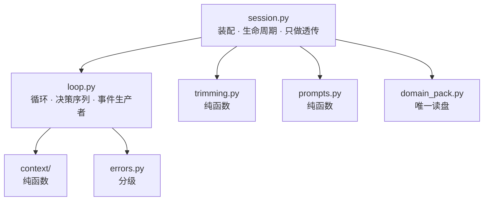
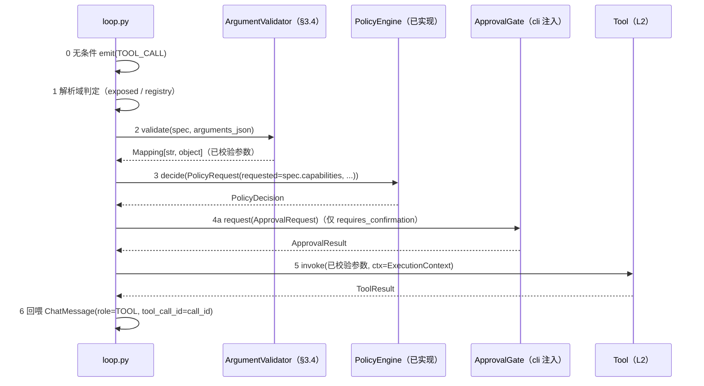

# 契约：`contracts/harness.py`（L3 编排边界与会话事件流）

- 对应模块：`src/agent_sec_perf/harness/`（L3 编排层，**9 件**：`session` / `loop` / `prompts` /
  `trimming` / `checkpoint` / `errors` / `context/` / `domain_pack` / `arguments`）
  ——第 9 件 `arguments.py`（手写 JSON-Schema 子集校验器）由 `ADR-0020` 定案，
  该 ADR **已于 2026-09-19 获批准并落地**（见 §3.1 与 §7.2）
- 上游决策：ADR-0015 §5.1.2（`UX ↔ HARNESS` 行 + `HARNESS ↔ CAPABILITY` 行 + 「关键约定」）、
  §5.3 自研模块 2/4/5、§5.4.1、§7.2（`S1`/`S3`）、§7.3
- 依赖：`contracts/model.py`（`ModelResponse` / `ChatMessage` / `CapabilityTier`）、
  `contracts/tools.py`（`ToolSpec` / `ToolCallRequest` / `ToolResult` / `ExecutionContext` /
  `ToolRegistry` / `Tool`）、`contracts/policy.py`（`PolicyEngine` / `PolicyRequest` /
  `PolicyDecision` / `RiskLevel` / `Capability`）、`contracts/audit.py`（`AuditSink`）
  —— 均为**契约层内部引用**，允许（R3）。契约本体**只依赖标准库**（C1）。
- 本文件回答的问题（由领导派活时核实、确认存在）：

  > 🔴 **`SessionEvent` 被引用但未定义**：`ADR-0015` §5.1.2（`UX ↔ HARNESS` 行）与
  > `architecture.md` §2.4 / §5.2 写了 `Session.run(task) -> AsyncIterator[SessionEvent]`
  > （后者的 `AsyncIterator` **已按 §2.9 的裁决更正为同步**）与"业务失败以
  > `SessionEvent(kind="error")` 表达"，但 `contracts/` 与 `interfaces/` 里都没有它。
  > **"未落盘 = 不存在" ⇒ 实现者无法开工。**

**本轮范围声明（重要）**：本契约的目标是"**能让实现者并行开工**"，**不是**把 Harness 设计完。
明确**不展开**：上下文效率引擎的检索/压缩算法、提示分级的具体话术、检查点持久化的落点、
能力探测与档位判定、路由降级、多轮评审/自动验证（`REQ-HARNESS-07`）、
**以及任何性能度量机制**（基准与对比属 `bench/` 与后续性能工作）。
**本项目的失败模式是"文档宣称与实现不一致"，不是"文档不够长"** —— 宁可少写、写准。

> **关于本文中出现的 `AsyncIterator` 字样**：本契约的**全部规范性表述一律是同步
> `Iterator[SessionEvent]`**（§2.9 的裁决）。文中每一处 `AsyncIterator` 都是在**引用被更正的历史
> 表述**（`ADR-0015` §5.1.2 的原文、或本文裁决的论证依据），**不是**契约内容；
> 实现与评审时以 §2.9 与本行为准。

---

## 1. 设计要点（先读这一节）

1. **事件流是 `cli/` 与 `harness/` 之间唯一的业务载体**，也是"非交互模式序列化为 JSON"
   （ADR §5.1.2）的对象 ⇒ 事件必须**可序列化、无凭据**（C8），**不可信内容只能以数据形态**
   出现（C9），且**不得把原始 `arguments_json` 提升为独立字段或写进 `text` / 审计 / 日志**
   （`I8`；`response` 内部的递归展开见 §2.6 第 3 条与 §2.2 的 `I8` **澄清（第十一版）**）。
2. **审计（`observability/`）与事件流是两套记录面，不可互相替代**：审计是**证据**
   （只追加、可回放、写入失败必须冒泡）；事件流是**界面载体**（有序、可渲染）。
   二者靠 `audit_id` / `call_id` **显式**关联（§2.7），不靠时间戳猜。
3. **工具调用的决策序列只有一个持有者**：`harness/loop.py`。解析域 → 严格校验 →
   `decide()` → 审批 → `invoke()`，五步的**入参/出参类型在 §3.3 逐条写死**
   —— 这是 `S1`（`ADR-0015` §7.2）的验收对象，也是全项目最易实现错的地方。
4. **"拒绝 ≠ 失败"，且必须在事件里可区分**：未执行 ⇒ `TOOL_RESULT.result is None` + 中文
   `text`；已执行但失败 ⇒ `result.ok is False`（`architecture.md` §5.3 硬规定 2）。
5. **不可信内容不得被固化**：原始 `arguments_json` **不得被提升为事件的独立字段、不得进审计
   `detail`、不得进 `text`**（`I8` 的**第十一版澄清**见 §2.2）；它只在"参数校验器"这一处被
   解析成结构化参数（§3.4）。
6. **fail-secure 的默认值取向**（C6）：`capability_tier` 默认**最弱档**（工具最少、提示最结构化）；
   `network_allowed` **恒 `False`**（本轮）；非交互审批**默认拒绝**；领域包**未知键 / 未知名字 /
   包内 `.py` 一律拒绝加载**（§4.3，不得降级、不得部分加载）。

---

## 2. 类型定义

### 2.1 `SessionEventKind`（**新增**）

```python
class SessionEventKind(StrEnum):
    MODEL_RESPONSE = "model_response"
    TOOL_CALL = "tool_call"
    POLICY_DECISION = "policy_decision"
    APPROVAL_RESULT = "approval_result"
    TOOL_RESULT = "tool_result"
    ERROR = "error"
    TASK_FINISHED = "task_finished"
```

**为什么是这 7 个**（每个成员都有明确的产出时机、生产者与消费方；没有"为了完整而列"的成员）：

| 成员 | 何时产出（无条件/条件） | 生产者 | 覆盖的需求 / 被引用的出处 |
| --- | --- | --- | --- |
| `MODEL_RESPONSE` | 每次 `ModelClient.chat` 成功后**一条** | `loop.py` | `REQ-HARNESS-02/04`；`REQ-MODEL-05`（记录实际应答后端） |
| `TOOL_CALL` | 模型每请求一次工具调用**无条件一条**（含随后被拒的） | `loop.py` | `REQ-HARNESS-01`（≥3 步工具调用）、`REQ-SEC-01`（"曾请求过"必须可见） |
| `POLICY_DECISION` | 每次**通过参数校验**的调用**恰好一条** | `loop.py`（由 `PolicyEngine` 求值产生） | `REQ-SEC-01/02/06`（每次决策可回放，且与审计一一对应） |
| `APPROVAL_RESULT` | `decision.requires_confirmation` 为真时**恰好一条** | `loop.py`（由注入的 `ApprovalGate` 产生） | `REQ-UX-02`（三种选择均可用且被记录） |
| `TOOL_RESULT` | 每个 `TOOL_CALL` **恰好一条**（**未执行也算**） | `loop.py` | `REQ-HARNESS-01/06`（观察内容与失败回喂） |
| `ERROR` | 本步失败时（可恢复或终止；见 I7） | `loop.py` | `REQ-HARNESS-06`；ADR §5.1.2（"业务失败以 `SessionEvent(kind="error")` 表达"） |
| `TASK_FINISHED` | 一次 `run` 的**最后一条**（恰好一条） | `loop.py` | ADR §5.1.2（终止语义）、`REQ-HARNESS-05` |

**被否决的成员（记录理由，防止重复讨论）**：

| 候选成员 | 结论与理由 |
| --- | --- |
| `TASK_STARTED` | **不加**。`SessionConfig` 由 `cli/` 自己构造 ⇒ 起步横幅它自己能渲染；唯一不可见的是"暴露了哪些工具"，那属 `REQ-HARNESS-03` 的**单测 / 基准**面（`trimming.select_tools` 是纯函数，可直接断言），不必进事件流 ⇒ 少一个 kind、少一组不变式 |
| `MODEL_REQUEST` / `PROMPT_SENT` | **不加**：把完整提示（含不可信内容）复制进事件流，等于给"不可信内容固化面"再开一处（I8 的对手）。诊断需求由 `structlog` 的脱敏管线承担 |
| `TOOL_DENIED`（与 `TOOL_RESULT` 并列） | **不加**：会让配对不变式退化成"恰好一条 `TOOL_RESULT` **或** `TOOL_DENIED`"，两处都要检查。改用**同一 kind + `result is None`**（I3）表达 |
| `AUDIT_FAILED` | **不加**：审计失败**必须冒泡**（`audit.md` §2.4 / `ADR-0015` §5.1.2），不得降级为一条业务事件——那会把"审计基础设施故障"伪装成"任务失败"（`policy.md` §2.5 的同一取舍） |
| `HEARTBEAT` / `TOKEN` 流式增量 | **本期不加**：流式解码尚无载体（云端客户端未开工），且 `--output-format json` 的行式形态（§2.6）会被高频增量撑爆；将来若引入流式，**新增 kind**（不许改既有 kind 语义） |

### 2.2 `SessionEvent`（**新增**，缺口的主体）

```python
@dataclass(frozen=True)
class SessionEvent:
    kind: SessionEventKind
    session_id: str
    seq: int
    timestamp: str
    call_id: str | None = None
    tool_name: str | None = None
    response: ModelResponse | None = None
    decision: PolicyDecision | None = None
    approval: ApprovalResult | None = None
    result: ToolResult | None = None
    text: str | None = None
    error_kind: SessionErrorKind | None = None
    status: TaskStatus | None = None
    audit_id: str | None = None
```

| 字段 | 类型 | 语义 | 哪些 kind 下必填 |
| --- | --- | --- | --- |
| `kind` | `SessionEventKind` | 事件类别 | 全部 |
| `session_id` | `str` | 会话标识；与 `AuditEvent.session_id` **同源** | 全部 |
| `seq` | `int` | 会话内**从 0 开始、单调递增、无空洞**的序号（I9） | 全部 |
| `timestamp` | `str` | **ISO-8601 带时区**（与 `AuditEvent.timestamp` 同口径：naive 时间被拒绝） | 全部 |
| `call_id` | `str \| None` | 关联键：等于对应 `ToolCallRequest.call_id` | `TOOL_CALL` / `POLICY_DECISION` / `APPROVAL_RESULT` / `TOOL_RESULT` |
| `tool_name` | `str \| None` | 工具名，**原样取自模型请求 ⇒ 不可信数据**（渲染前必须净化，见 §2.6 第 5 条） | 同上 4 个 |
| `response` | `ModelResponse \| None` | 模型响应整体（`content` 为**不可信**模型输出） | `MODEL_RESPONSE` |
| `decision` | `PolicyDecision \| None` | 策略决策（含 `reason` / `risk_level` / `audit_id`） | `POLICY_DECISION` |
| `approval` | `ApprovalResult \| None` | 人工确认结果（**未提供 `ApprovalGate` 时该 kind 不产出**，见 I2） | `APPROVAL_RESULT` |
| `result` | `ToolResult \| None` | 工具执行结果；**`None` ⇒ 本次调用未执行**（被拒） | `TOOL_RESULT` |
| `text` | `str \| None` | **我方生成**的中文说明（拒绝理由 / 错误说明 / 结束原因）。**不得**承载模型或工具的原文（I8） | `ERROR` / `TASK_FINISHED`；`TOOL_RESULT` 且 `result is None` |
| `error_kind` | `SessionErrorKind \| None` | 错误分级（见 §2.4） | `ERROR` |
| `status` | `TaskStatus \| None` | 任务终态（见 §2.3） | `TASK_FINISHED` |
| `audit_id` | `str \| None` | 关联的**审计事件** `event_id`（`REQ-SEC-06` 的可回放入口） | `TOOL_RESULT`；`POLICY_DECISION`（== `decision.audit_id`）；`APPROVAL_RESULT`（== `approval.audit_id`） |

**为什么用"宽记录 + 按 kind 的不变式"而不是"每个 kind 一个载荷类"**：与 `AuditEvent`
（[`audit.md`](audit.md) §2.3）同构，序列化只有一条路径（§2.6），实现者不必写 7 个分支的匹配；
代价是"哪些字段在哪个 kind 下必填"必须由不变式钉住 —— 这正是下面 I1~I9 的作用。
**被否决的替代**：每 kind 一个 `frozen` 载荷类（类型最紧，但需要 7 个类 + 一个联合类型 +
序列化分支；在本轮"最小够用"的目标下收益不足）。

#### 不变式（实现必须断言、测试必须覆盖）

- **I1（配对与串行）**：对每条 `MODEL_RESPONSE.response.tool_calls[i]`，流中**恰好一条**
  `TOOL_CALL` 与**恰好一条** `TOOL_RESULT`，二者 `call_id` 相同，`TOOL_CALL` 在前；
  同一 `MODEL_RESPONSE` 的多个 `tool_calls` **按 tuple 顺序串行处理完**（事件之间不交错）。
  ⚠️ **唯一例外：流程被中止的路径**（**第七版新增**，由实现侧上报后追认）——
  当以下三种"**我方不变量/基础设施**故障"发生时，`loop` 直接
  `ERROR(error_kind=INTERNAL)` + `TASK_FINISHED(status=FAILED)` 终止，
  该 `call_id` 上**允许没有 `TOOL_RESULT`**：① `ApprovalGate` 抛异常或返回形状非法（§2.5.5 的 `R3`/`R4`）；
  ② 名字在 `exposed` 内却 `registry.resolve(name) is None`（§3.3 步 1 的不变量被破）；
  ③ 工具返回的 `audit_id` 为空（无从构造 I3 要求的非空 `audit_id`）。
  **为什么允许例外而不是补一条 `TOOL_RESULT`**：步 6b 的 `denied_reason` 被 §2.7 的 `D2`
  限定为**闭集**，其中**没有**"审批通路故障"这一档 ⇒ 补事件就必须①给 `DENY` 审计编一个闭集外的短码，
  或②借用 `approval_denied`——后者会把"**基础设施故障**"与"**人拒绝了**"在审计里弄成**同形**，
  恰是 `R3` 明令**不得**做的事（本项目已因"同形"吃过两次教训）。而路径 ③ 更是**根本无从**
  构造 I3 要求的非空 `audit_id`。
  **可机器检查的判据（H-1 必须实现）**：**悬空 `TOOL_CALL` 只允许出现在"以 `FAILED` 终止
  且流中至少一条 `ERROR(error_kind=INTERNAL)`"的事件流里**——即"没有 `TOOL_RESULT`"本身不能是
  静默的，它必须伴随**响亮的终止**。反之，任何 `status is COMPLETED` / `LIMIT_REACHED` 的流
  **必须**逐条满足配对。
- **I2（决策与确认的相对位置）**：`TOOL_CALL` 与 `TOOL_RESULT` 之间**至多一条**
  `POLICY_DECISION` 与**至多一条** `APPROVAL_RESULT`（同一 `call_id`）；`POLICY_DECISION`
  在前。`APPROVAL_RESULT` 存在 **⇔** 「`decision.requires_confirmation` 为真 **且** 该会话
  配置了 `ApprovalGate`（`approval is not None`）」——**未提供确认通路时不产生该事件**
  （没有人被问过；伪造一条"用户拒绝"会让审计撒谎），此时该 `TOOL_RESULT` 必为
  `result is None` + 中文 `text`（§2.5.5 的 R1）。
- **I3（结果与执行）**：`TOOL_RESULT.result is None` **⇔** 本次调用**未执行**；此时 `text`
  **必须**非空（中文说明）、`audit_id` **必须**非空。`result is not None` ⇒ 已执行，成败看
  `result.ok`（**不得**用 `result.ok=False` 表示"未执行"）。
- **I4（审计可回放）**：`TOOL_RESULT.audit_id` 非空，且审计中存在一条
  `kind=TOOL_CALL`、`call_id` 相同、`event_id == audit_id` 的事件。**判据是"存在且可回放"，
  不是"恰好一条"**：`audit.md` §2.3 允许"调用前后各一条"，`call_id` 也可能出现多条。
  `result is not None` ⇒ `result.audit_id` 与其一致（同一 id 不得有两套）。
- **I5（决策与审批的关联）**：`POLICY_DECISION.audit_id == decision.audit_id`；
  `APPROVAL_RESULT.audit_id == approval.audit_id`。
- **I6（终态唯一且最后）**：`TASK_FINISHED` **恰好一条**且是流中**最后一个**事件；其 `status`
  与 `text` 均非空。
- **I7（错误与终态的关系，单向）**：`status is FAILED` ⇒ 流中至少一条 `ERROR`。
  **反向不成立**：`ERROR` 表示"本步失败"，可恢复错误之后循环继续（`REQ-HARNESS-06`
  "单步失败不导致整体失败"）⇒ 允许出现 `ERROR` 且最终 `status is COMPLETED` 的流。
- **I8（不可信内容的位置，干净字段）**：事件里**不得**出现原始 `arguments_json`；
  `text` **不得**包含其任何片段。不可信内容的合法去向只有四处：
  `response.content` / `result.content` / `result.error` / `tool_name`。
  ⇒ 任何把参数值写进 `text`、`detail`、日志或审计的理由都必须在 `argument_validator` 里
  换成"哪个键、期望什么类型"（§3.4 第 4 条）。
  ⚠️ **澄清（第八版）：`text` 的禁区是"不可信片段"，判据是"这段文本由谁产生"。**
  | 片段 | 可否进 `text` | 理由 |
  | --- | --- | --- |
  | 参数**值**（任何形态 / 长度 / 转义） | ❌ | 不可信内容；`V4` 与 §3.3 步 2 都明令不得 |
  | **未声明（未知）键的名字** | ❌ | **模型自带** ⇒ 不可信文本。反例：模型可把 `{"\u001b[2J…": 1}` 当作未知键，回显即把**攻击者可控字节**送进一个"干净字段"（甚至终端控制序列） |
  | `parameters_schema` **已声明的键名** | ✅ | **我方 schema 产生**，且模型本就持有它；它是"哪个键、期望什么类型"（`V4`）**唯一可用**的表达。仍须经 `sanitize_for_display` 且受长度上限约束（`loop` 侧已有 `_VALIDATOR_DETAIL_LIMIT`） |
  反之，若把已声明的键名也禁掉，`V4` 就只剩"某个参数类型不符"这种无信息量的说法 ⇒
  既违反 `REQ-HARNESS-06` 的"回喂自恢复"，也让唯一的处置路径失效。

  ⚠️ **第二处澄清（第十一版）：原始 `arguments_json` 到底能不能出现在事件里。**
  本条与 §1 第 1/5 条写的"**不得承载原始 `arguments_json`**"，
  **与 §2.2 的字段表本身冲突**——`response: ModelResponse | None` 承载整个模型响应，
  而 `contracts/model.py` 的 `ToolCallRequest.arguments_json` 正是原始 JSON 文本。**判据（按位置分）**：

  | 位置 | 允许 | 说明 |
  | --- | --- | --- |
  | 事件的**独立字段**（含任何新增字段） | ❌ | 字段表以本节 14 个字段为准；`arguments_json` **不得**被提升为字段 |
  | `text` / 审计 `detail` / 日志 | ❌ | 与第八版一致：参数**值**与**未声明键名**都不行 |
  | `response` **内部** | ✅ | 它是"模型响应整体"这一**不可信数据**；§2.6 第 3 条按字段表**递归展开** |
  | 面向终端的**渲染** | ❌（不显示参数值） | §5.2 的 `TOOL_CALL` 只渲染 `tool_name`；§2.6 第 5 条要求先净化 |

  **为什么不在序列化时把 `arguments_json` 剔除**：`response.content` **同样是**不可信文本、
  **同样会进 JSONL** ⇒ 只剔除 args 属"**同形不同处理**"，安全收益极小，却让"按字段表序列化"
  这条**唯一路径**失效、并需要一份**自定义投影**（多一处必然漂移的表示）。
  真正的护栏是：**审计面永不承载**（§2.7 已定：`MODEL_RESPONSE` 不审计）+
  `text` 的禁区（第八版）+ 渲染净化（§2.6 第 5 条）+ 消费侧"数据当数据"（`C9` / `T-04`）。
- **I9（`seq`）**：`seq` 在**一个 `Session` 实例**的生命周期内从 0 起连续无空洞；
  多次 `run` 不重置（§2.9）。
- **I10（无凭据）**：事件**不含**任何凭据字段（C8）；`SessionEvent` 不暴露 `os.environ`，
  也不承载 `foundation.proc.minimal_env` 之外的任何环境信息。

### 2.3 `TaskStatus`（**新增**）

```python
class TaskStatus(StrEnum):
    COMPLETED = "completed"  # 模型给出最终回复（无 tool_calls）或被判定完成
    FAILED = "failed"  # 不可恢复错误，循环终止
    LIMIT_REACHED = "limit_reached"  # 步数 / 连续失败 / 预算上限用尽
```

**为什么 `LIMIT_REACHED` 与 `FAILED` 分开**：`REQ-HARNESS-06` 要求"单步失败不导致整体失败"，
因此"**成功但用尽了步数预算**"与"**遇到不可恢复错误**"必须可区分 —— 前者是**配置问题**
（调 `max_steps`），后者是**故障**。合并成一个 `FAILED` 会让调参时看到错误的信号。

### 2.4 `SessionErrorKind`（**新增**）

```python
class SessionErrorKind(StrEnum):
    TRANSIENT = "transient"  # 瞬时原因导致的一次失败，loop 将会重试（预算内）
    UNREACHABLE = "unreachable"  # 后端不可达且重试预算已耗尽（放弃）
    PROTOCOL = "protocol"  # 响应不符合契约且重试预算已耗尽（放弃）
    STALLED = "stalled"  # 连续失败达 max_consecutive_failures
    INTERNAL = "internal"  # 我方不变量被破 / 未预期异常
```

**成员语义的判定口径（必须与 `error_kind()` 一致，见 §3.1）**：

| 成员 | 由什么产生 | 是否终止任务 |
| --- | --- | --- |
| `TRANSIENT` | 某次尝试因**瞬时**原因失败，且 `resolve_disposition(...) is RETRY`（**将会重试**） | **否**（流继续，I7 允许 `ERROR` 后最终 `COMPLETED`） |
| `UNREACHABLE` | `ModelUnavailableError` 且**重试预算已耗尽**（`ABORT`） | 是（`FAILED`） |
| `PROTOCOL` | `ModelProtocolError` 且**重试预算已耗尽**（`ABORT`） | 是（`FAILED`） |
| `STALLED` | **连续**失败达 `max_consecutive_failures`（由 `loop` 计数触发，**不**来自某个异常） | 是（`FAILED`） |
| `INTERNAL` | 我方不变量被破 / 未预期异常（含 `HarnessInternalError`） | 是（`FAILED`） |

- **工具级失败不在此列**：`ToolResult.ok=False` 是**正常数据通路**（回喂给模型），
  不产生 `ERROR` 事件；只有**连续失败达上限**时才升格为 `STALLED`。
- **`UNREACHABLE` 本轮无降级路径**：`ModelUnavailableError` 的既定处置是"路由降级"
  （`model/router.py`，**未开工**）⇒ 本轮为 `RETRY`（预算内，报 `TRANSIENT`）→ 耗尽后 `ABORT`
  （报 `UNREACHABLE`）。**不得**把它写成"已降级"。
- **`text` 不得直接取 `str(exc)`**：异常消息可能携带路径 / 不可信串。`ERROR.text` 由
  **我方常量文案 + 异常类型名**组成（§3.1 的 `error_kind()` 只按**类型**判定，不看消息）。

### 2.5 审批通路（**新增**：`ApprovalOutcome` / `ApprovalRequest` / `ApprovalResult` / `ApprovalGate`）

**这一组类型存在的原因（依赖倒置）**：`architecture.md` §5.2 的时序图里"需人工确认"由
`cli/approval` 处理，而 `R1` **禁止 `harness` 依赖 `cli`**。若不给这个接缝定形，实现者只能
自己发明一种回调，或让 `harness` 去 `input()`（既违反分层，又让单测无法注入）。

#### 2.5.1 类型

```python
class ApprovalOutcome(StrEnum):
    ALLOW_ONCE = "allow_once"
    ALLOW_ALWAYS = "allow_always"
    DENY = "deny"


@dataclass(frozen=True)
class ApprovalRequest:
    session_id: str
    call_id: str
    tool_name: str  # 原样取自模型请求 ⇒ 不可信数据，展示前必须净化
    risk_level: RiskLevel
    reason: str  # 来自 PolicyDecision.reason（我方生成的中文理由）
    arguments_summary: str | None = None  # 见 §2.5.3：**由 harness 生成**的参数摘要


@dataclass(frozen=True)
class ApprovalResult:
    outcome: ApprovalOutcome
    audit_id: str  # cli/approval.py 发出的 AuditEvent(kind=APPROVAL).event_id


class ApprovalGate(Protocol):
    def request(self, request: ApprovalRequest) -> ApprovalResult: ...
```

#### 2.5.2 确认请求**在事件流里的位置**（**不新增 kind**）

**确认请求由 `POLICY_DECISION` 事件承载**；CLI 的判定只有一条：
`event.kind is POLICY_DECISION and event.decision.requires_confirmation`。

| 渲染确认提示所需的全部信息 | 来自哪个字段 |
| --- | --- |
| 是**哪一次**调用 | `SessionEvent.call_id` |
| 待确认的**工具** | `SessionEvent.tool_name`（ⓘ 渲染前净化，§2.6 第 5 条） |
| 待确认的**操作对象**（"要动什么"） | `ApprovalRequest.arguments_summary`（§2.5.3） |
| **风险等级** | `decision.risk_level` |
| **理由**（`REQ-SEC-02` 要求展示） | `decision.reason` |
| 同一次决策的审计关联键 | `decision.audit_id` |

**为什么不新增 `APPROVAL_REQUIRED` 成员**：① 它要携带的信息是 `POLICY_DECISION` 的**子集**
（同一 `call_id` 上 `requires_confirmation=True` 已完整表达）⇒ 多一个 kind 就多一处"同一事实
两处表述"（`README.md` C10 的教训）；② I2 已把"`APPROVAL_RESULT` 与 `requires_confirmation`
的对应关系"钉死，配对无歧义。若将来确认界面所需的信息**超出** `PolicyDecision` +
`ApprovalRequest` 能表达的范围（例如必须展示完整参数），属**新增 kind 或新增字段**的契约变更，
走 §8 的变更流程，**不得**在实现里私自扩字段。

#### 2.5.3 `arguments_summary`：让确认界面能看到"操作对象"，但**不回显原始参数**

| # | 规定 |
| --- | --- |
| S1 | **由 `harness`（`loop.py`）生成**：此时参数已通过校验 ⇒ 是**结构化参数**，不是原始 JSON 文本 |
| S2 | 口径（确定性、可测）：按**键名升序**遍历**全部**顶层键（最多 8 个，超出时末尾加 `; …（还有 N 项）`）；`str` 值 ⇒ `key=<经 sanitize_for_display(value, limit=80) 的值>`；`list` / `dict` ⇒ `key=<list: 3>` / `key=<object: 2>`；其余 ⇒ `key=<int>` / `key=<float>` / `key=<bool>` / `key=<null>`。**总长上限 400 字符**，超出即截断并加 `…（已截断）` |
| S3 | **不得**出现原始 `arguments_json` 的全文或未净化片段；**不得**进入事件流、审计 `detail`、`text`（I8 不变） |
| S4 | **只供展示**：任何控制流、权限判定、工具选择**不得**读它（`REQ-SEC-03`）；界面**不得**把它当作"已看到全部参数"的凭据——非标量值的形态由 `<list: 3>` 一类标注**显式**给出，不静默略去 |
| S5 | 参数映射为空 ⇒ `None`（**不**编造 `{}` 一类占位） |

> **为什么由 `harness` 生成而不是把结构化参数整体交给界面**：后者要求**每一个**界面实现都记得
> "先净化再显示"，属**纪律**；前者把"不可信内容不被原样递给界面"变成 `ApprovalRequest` 的
> **结构性质**。与 `prompts.build_system_message` 拒收外部内容参数是同一取向（结构性优先于纪律）。

#### 2.5.4 回传机制：**采纳"构造时注入 `ApprovalGate`"**

```python
class Session(Protocol): ...


# Session / TaskLoop 的构造签名见 §3.1：approval: ApprovalGate | None = None
```

| 候选 | 内容 | 结论与理由 |
| --- | --- | --- |
| **(a) `ApprovalGate.request()`（**采纳**)** | 同步方法，直接返回 `ApprovalResult` | ① 与"单会话单线程、串行产出"一致（ADR §5.1.2）；② `Protocol` 可注入 fake ⇒ 单测不需要 TTY；③ 返回值携带 `audit_id`，让"这次确认"与审计**显式对上**（`REQ-UX-02` / `REQ-SEC-06`）；④ 实现归 `cli/approval.py` ⇒ 提示文案与 TTY 判定留在表现层 |
| (b) `Callable[[ApprovalRequest], ApprovalResult]` | 注入裸函数 | **否决（等价但更弱）**：裸 `Callable` 只能靠参数名与注释传达语义，`Protocol` 能写明方法名与 docstring；且两者并存即"同一事实两处表述"。功能上不优于 (a) |
| (c) 事件流 + `Session.respond_approval(result)` | loop 产出事件后**暂停**，由 CLI 在迭代中途回传应答 | **否决**：`run()` 是**单个迭代器**，中途回传要求把迭代器改成协程（`send`）或引入线程；两者都破坏"串行、无并发"的假设，并把"暂停中的会话"变成一种要管理的新状态。当前没有必须异步的理由（§2.9 同源） |
| (d) `loop` 内直接 `input()` | 交互内联在编排层 | **否决**：违反 `R1`（`harness` 依赖终端）、不可单测、非交互模式下会挂死（`REQ-UX-01`） |

#### 2.5.5 fail-secure 规定（**没有答复 ⇒ 拒绝，不得降级为放行**）

| # | 情形 | 规定行为 |
| --- | --- | --- |
| R1 | `approval is None`（CLI 未提供交互通路，典型是非交互运行） | `requires_confirmation=True` 的调用**一律不执行**：`TOOL_RESULT(result=None, text="未提供人工确认通路，按默认拒绝处置")`；审计记 `TOOL_CALL` / `DENY` / `detail["denied_reason"]="approval_denied"`。**且不产生** `APPROVAL_RESULT` 事件——没有人被问过，伪造一条"用户拒绝"会让审计撒谎（I2 已按此措辞）。**禁止**放行 |
| R2 | 无 TTY（gate 自己知道） | 属 **gate 实现的义务**：**必须**返回 `DENY`，不得阻塞等 stdin。harness **不**检测 TTY（那是表现层的事），也**不得**代它决定 |
| R3 | gate **抛异常** | 该调用**不执行** + 记 `ERROR(INTERNAL, text="人工确认通路故障")` + **终止任务**（`TASK_FINISHED(FAILED)`）。理由：审批通路坏掉 = 权限判定的**输入面**不可用；继续跑等于在未知权限语义下继续。**不得**吞掉异常后当成一次普通拒绝（那会把基础设施故障伪装成默认拒绝，`policy.md` §2.5 的同一取舍） |
| R4 | 应答**形状非法**（非 `ApprovalResult` 实例 / `outcome` 不是 `ApprovalOutcome` 成员 / `audit_id` 为空） | 同 R3（不执行 + `ERROR(INTERNAL)` + 终止）。形状非法意味着该"允许/拒绝"都不可信 |
| R5 | **超时** | 由 gate 实现负责（它掌握交互）；契约要求超时后返回 `DENY`（而**不是**抛异常）。harness **不设**超时：单线程模型里给阻塞调用加超时必然引入线程或信号，那是 §2.9 已否决的复杂度 |
| R6 | `ALLOW_ALWAYS` | **本轮等价于 `ALLOW_ONCE`**（持久授权属未决项 `U3`），但**必须被接受**，并在事件与审计里**如实记录** `allow_always`。方向上是**收窄**（不会多授予）；**记录**它即不构成静默降级（`ADR-0006` §5.2 规则 `S-2`）。⚠️ **不得**表述为"已支持持久授权" |

| # | 规定（编排侧） | 理由 |
| --- | --- | --- |
| A1 | `ApprovalGate` 的**实现**归 `cli/approval.py`（`cli/` 装配时注入）；`contracts/` 只放 Protocol | 依赖倒置：`harness` 只依赖契约，单测可注入 fake（`ADR-0015` §7.3 的"只读契约写出 stub"） |
| A2 | **阻塞式同步调用**，返回值即用户选择；`harness` 不轮询、不超时（见 R5） | 与"单会话单线程、事件流串行产出"（ADR §5.1.2）一致 |
| A4 | gate 实现每次**必须**先 `emit(AuditEvent(kind=APPROVAL))` 再返回，`audit_id` 即该事件 id | `REQ-UX-02`"三种选择均被审计"；`audit.md` §2.3 的生产者表把 `APPROVAL` 归 `cli/approval.py` |
| A6 | `harness` **不得**自行决定"要不要问"：唯一依据是 `decision.requires_confirmation` | 决策归 `PolicyEngine`、呈现归 `cli/`；`harness` 只做路由（`REQ-SEC-01` 的 100% 拦截率不能由界面层保证） |

### 2.6 序列化口径（`--output-format json` 与终端渲染）

```python
def event_to_payload(event: SessionEvent) -> dict[str, object]: ...
```

| # | 规定 |
| --- | --- |
| 1 | **键 = 字段名，全部保留**（`None` 写 `null`，不省略键）——省略会让"字段不存在"与"字段为 `null`"在消费侧同形（沿用 `observability/audit.py::_event_to_payload` 的既有写法） |
| 2 | 枚举一律写**值**（`kind.value`），与 `C3` 一致 |
| 3 | `response` / `decision` / `approval` / `result` 是嵌套对象，按各自契约的字段表递归展开；**禁止**整对象 `repr` 或 `str()`。⚠️ **递归展开包括** `response.tool_calls[].arguments_json`（**第十一版澄清**）：它是不可信文本，但属 `response` 这一**数据整体** ⇒ **允许**出现在序列化输出里，**不得**在渲染面显示（第 5 条）、**不得**进审计与 `text`（§2.2 的 `I8` 澄清） |
| 4 | `--output-format json` 的输出是 **JSONL（一行一个事件，按 `seq` 追加序）**：可流式消费、可 `diff`，且与审计的落盘形态一致 |
| 5 | 面向**终端**渲染（非 JSON）时，`tool_name` / `response.content` / `result.content` / `result.error` **必须**先经 `foundation.logging.sanitize_for_display`（控制字符与 ESC 替换为 `?`）。理由：这些串来自模型与工具，是**不可信**文本，直接写进终端等于允许 ANSI 转义序列篡改显示（`foundation/logging.py` 的既有对手） |
| 6 | 本函数是**纯函数**（不读时钟、不读环境、不写文件）；`timestamp` 已在事件里 | 可确定性测试 |

### 2.7 审计关联（`REQ-SEC-06` 的可回放性怎么对上）

| 事件 | 对应的审计事件 | 关联键 | 生产者 |
| --- | --- | --- | --- |
| `TOOL_CALL` / `TOOL_RESULT` | `kind=TOOL_CALL`（每 `call_id` **至少一条**） | `SessionEvent.audit_id` == `AuditEvent.event_id`；`call_id` 相同 | **已执行**：工具层（`tools/registry.py::audit_tool_call`，现状不变）；**未执行**：`harness/loop.py`（新增，见下方修订请求） |
| `POLICY_DECISION` | `kind=POLICY_DECISION` | `decision.audit_id` | `security/policy.py`（**已实现**） |
| `APPROVAL_RESULT` | `kind=APPROVAL` | `approval.audit_id` | `cli/approval.py` |
| `MODEL_RESPONSE` / `ERROR` / `TASK_FINISHED` | **无** | — | — |

> **`MODEL_RESPONSE` / `ERROR` / `TASK_FINISHED` 为什么不审计**：`AuditEventKind` 的成员集合
> 由 `audit.md` §2.1 **逐个对应明确需求**（没有"为了完整而列"）。"模型答复了什么"不是权限事件，
> 且把模型原文写进长期证据违背 I8 的取向；扩 `AuditEventKind` 需 ADR + 影响面评估。

#### ⚠️ 修订请求：`TOOL_CALL` 需要第三个 `outcome` 取值 `DENY`（**本契约的规范性要求**）

**问题（已核实，两处契约合起来不可满足）**：

- [`tools.md`](tools.md) §2.6 规定：`ToolRegistry.resolve` 对未知工具返回 `None`，
  "由调用方**默认拒绝 + 审计**"；
- [`audit.md`](audit.md) §2.2 规定：`kind=TOOL_CALL` 的允许 `outcome` 只有 `{OK, ERROR}`。

⇒ **"被拒绝、没有执行"无法被忠实表达**：用 `ERROR` 会让"工具执行失败"与"根本没有执行"
在 `REQ-OBS-01` 的按结果检索里**同形**，而 `architecture.md` §5.3 的硬规定 2 正是
"**拒绝不等于失败**"（同一失效模式已在 `policy.md` §2.5 的 `detail["requested"] == []`
三种来源上被处理过一次）。

**规定（本契约生效，实现者照此写）**：

| # | 规定 |
| --- | --- |
| D1 | `kind=TOOL_CALL` 的允许 `outcome` 扩为 **`{OK, ERROR, DENY}`**；`DENY` 专指"**未执行**"，**不得**用 `ERROR` 代替 |
| D2 | `DENY` 时 `detail["denied_reason"]` **必填**，取值限于 `{"unknown_tool", "not_exposed", "invalid_arguments", "policy_denied", "approval_denied"}` —— 均为**我方生成的定长短码**，不含任何不可信内容。**五者的判定点写在 §3.3 的决策序列里**：步 1 判定 `not_exposed`（名字**在注册表中**但**不在本会话的 `exposed` 解析域**）与 `unknown_tool`（名字**连注册表都没有**）；步 2 ⇒ `invalid_arguments`；步 4 ⇒ `policy_denied` / `approval_denied`。⚠️ **前两者必须可分**：一个是"**我们把它裁掉了**"，一个是"**模型幻觉了一个工具**"，在审计里同形会让 `REQ-SEC-06` 的可回放性受损（本项目已因"同形"吃过两次教训：`False/True` 让"引擎故障"与"请求缺陷"不可区分；`ERROR` 让"执行失败"与"从未执行"不可区分） |
| D3 | 已执行路径的审计仍由工具层发出（现状不变）；未执行路径由 `harness/loop.py` 发一条，`event_id` 回填进 `SessionEvent.audit_id` |
| D4 | 同一 `call_id` 可能有多条 `TOOL_CALL` 审计事件 ⇒ 判据是 **I4**（"存在且可回放"），**不得**写成"恰好一条" |

**待同步项**：[`audit.md`](audit.md) §2.2 的 kind→outcome 表与 §4 修订记录需补这一行；
`src/` 侧若有"kind→outcome 一致性"的校验（读取侧 `_parse_line` / 单测），需同步。
登记见 [`README.md`](README.md) §6 的 **U8**。

### 2.8 `SessionConfig`（**新增**：装配面）

```python
@dataclass(frozen=True)
class SessionConfig:
    working_dir: Path
    allowed_roots: tuple[Path, ...]
    capability_tier: CapabilityTier = CapabilityTier.BASIC
    max_steps: int = 12
    max_consecutive_failures: int = 3
    tool_timeout_s: float = 30.0
    max_prompt_tokens: int = 8192
    max_completion_tokens: int | None = None
```

| 字段 | 语义 | 默认值的取向 |
| --- | --- | --- |
| `working_dir` | 工具可写的一次性工作目录（**由调用方创建与清理**，`interfaces/tools.md` §2.4） | 无默认（必填） |
| `allowed_roots` | 文件访问白名单根（进 `ExecutionContext.allowed_roots`） | 无默认（必填）；**空元组 ⇒ 拒绝启动** |
| `capability_tier` | **模型能力**档位（决定工具裁剪与提示分级） | 默认 `BASIC` = **最弱档**（工具最少、提示最结构化）⇒ fail-secure 方向；探测（`REQ-MODEL-06`）未开工，故显式传入、默认取最保守 |
| `max_steps` | 单次 `run` 的模型往返上限 | `12`（`REQ-HARNESS-01` 只要 ≥3 步；12 给足余量且能兜住死循环） |
| `max_consecutive_failures` | 连续"未执行或工具级失败"的上限 | `3`：达上限 ⇒ `ERROR(STALLED)` + `TASK_FINISHED(FAILED)` |
| `tool_timeout_s` | 单次工具调用的超时（进 `ExecutionContext.timeout_s`） | `30.0` |
| `max_prompt_tokens` | 提示侧 token 预算（构造 `ContextBudget`） | `8192` |
| `max_completion_tokens` | 传给 `chat(max_tokens=...)`；`None` = 用服务端默认 | `None` |

**装配期校验（`Session.__init__` 必须做，失败即拒绝启动）**：

1. 非空、非 `None` 的 `working_dir` / `allowed_roots`，且 `working_dir` **必须**经
   `foundation.paths.resolve_within(working_dir, allowed_roots, what="会话工作目录")` 校验通过
   （越界 ⇒ `PathNotAllowedError`）—— 这是 `ExecutionContext` 不变式"`working_dir` 落在
   `allowed_roots` 之内"的**生产者义务**；
2. `max_steps` / `max_consecutive_failures` 为正整数，`tool_timeout_s` / `max_prompt_tokens`
   为**有限正数**（`None` / `nan` / `inf` / 非正数一律拒绝——"无限等待"等于没有超时）；
3. 上述任一不满足 ⇒ **拒绝启动**，**不得**回退默认值继续跑（fail-secure）。

### 2.9 `Session` Protocol 与**同步 / 异步的裁决**

```python
class Session(Protocol):
    def run(self, task: str) -> Iterator[SessionEvent]: ...
    def close(self) -> None: ...  # 幂等
```

具体类（`harness/session.py::Session`）还必须实现 `__enter__` / `__exit__`：
`with Session(...) as s:` 的退出路径按序 teardown —— **工具 → 模型客户端 → `llama-server`
进程 → `flush` 审计**（`ADR-0015` §5.1.2，逐序不可调换）。
⚠️ **如实登记（第七版新增）：本轮四步里只有两步有载体。**
`contracts/tools.py` 的 `Tool` Protocol 只有 `spec` / `invoke`（**无 `close()`**），
`ToolRegistry` 也没有 ⇒ "**工具**"一步**没有可调用的 teardown 接口**；
"`llama-server` 进程"一步由 `ModelClient.close()` **内部**承担（`model.md` 的 ExitStack，已读源码核实）。
⇒ **本轮的可观察 teardown 是两步：`model.close()` → `sink.flush()`**，
`Session.close()` 必须**幂等**，且 `H-9` 的 fake 只记录这两步。
**不得**为凑四步而发明一个空的工具 teardown（那会让"关闭过"变成一句假话），
也**不得**据此声称四步已实现——缺口登记为**已知欠账**（给 `Tool` 加 `close()` 属契约变更，
须另开裁决）。

| 项 | 规定 |
| --- | --- |
| 调用次数 | 同一实例**允许多次 `run`**（每次一个任务）；会话状态与 `seq` 跨 `run` 保留（I9）。本轮 `cli/` 可只用一个任务，但契约不禁止 |
| 错误面 | `run()` **内**的业务失败一律经 `ERROR` / `TASK_FINISHED` 表达，**不抛异常**；逃逸的只有三类：`ConfigError`（装配/配置）、**审计写入失败**（`AuditSink.emit`/`flush` 的异常必须冒泡，`audit.md` §2.4）、以及编程缺陷（`TypeError` 一类的实现 bug） |
| 并发 | **单会话单线程**；事件流串行产出；`seq` 的分配无需锁 |
| 不在 `run` 内做的事 | 装配（构造 `PolicyEngine` / `ToolRegistry` / `AuditSink` / 模型客户端）在 `run` **之前**完成；`ConfigError` 与审计落点类异常因此在装配期就暴露，不进事件流 |

#### 裁决：本轮 `Session.run` 用**同步 `Iterator[SessionEvent]`**，**不引入 `asyncio`**

`ADR-0015` §5.1.2 的该行原文写的是 `AsyncIterator`。**裁决：改为同步 `Iterator`**。理由逐条：

| # | 理由 |
| --- | --- |
| 1 | **该行自身已经规定了同步的语义**：同一格写着"**单会话单线程**；事件流**串行**产出"。`AsyncIterator` 在同一格里是**内部矛盾**（异步迭代器的价值在于"等待时不阻塞别的任务"，而这里明确没有别的任务） |
| 2 | **现有全部实现都是同步阻塞式**：`model/client.py`（`http.client` 阻塞 + `/health` 轮询）、`tools/*`（`proc.run` 阻塞）、`security/policy.py`、`observability/audit.py`（`fsync`）、`foundation/proc.py`。**`src/` 下没有任何 `async def`**（已核实）。选异步 = 重写 5 个模块（含已入库并有测试的代码） |
| 3 | **异步没有收益面**：`llama-server` 默认 `-np 1`，`ModelClient` 契约写明**非线程安全**（一个会话一个实例）⇒ 并发请求既无硬件支持也不被允许；CLI 是单任务前台 |
| 4 | **安全主线偏好顺序确定**：`校验 → decide() → 审批 → invoke()` 这条链路要求**顺序确定**。同步阻塞让"同一时刻只有一个特权操作在进行"成为**结构性事实**，而不是需要证明的性质（并发下的 TOCTOU 面更小） |
| 5 | **可回退性**：若将来确需异步（如 token 流式渲染），正确的路径是**新增方法**（如 `astream()`）**或新增 ADR 改接口**——`SessionEvent` 的类型定义不需要随执行模型变化。反之若现在选异步，回退成本是重写五个模块 |

**被否决的方案（记录理由，防止重复讨论）**：

| 候选 | 结论与理由 |
| --- | --- |
| 全量 `asyncio`（重写 `model` / `tools` / `proc` 为异步） | 否决。无收益面（理由 3），却把"唯一子进程入口"（`R4`）改造成并发调用点，且 `foundation/proc.py` 的 `spawn` 句柄"不跨线程共享"的既有约定要重新论证 |
| `AsyncIterator` + `asyncio.to_thread` 包住同步实现 | 否决。**伪异步**：底层仍阻塞，却把执行挪到线程池 ⇒ 与"`ModelClient` 非线程安全"直接冲突，并引入第二个执行上下文（`seq` 分配、审计串行化都要重新论证） |
| 同时提供 `run()` 与 `arun()`（双接口） | 否决。两个实现面、两倍测试面，且"哪个是权威"立刻成为分叉源（`README.md` C10 的教训：同一事实两处表述必然漂移）。**需要时再新增**，不做预埋 |

**据此需要更新的两处引用（本文件是权威，旧正文不改）**：

| 位置 | 现状 | 处理 |
| --- | --- | --- |
| `ADR-0015` §5.1.2 的 `UX ↔ HARNESS` 行 | `AsyncIterator[SessionEvent]` | **只允许在「修订记录」追加**（本契约已登记，见该 ADR 修订记录 2026-09-19）。ADR **正文不改** |
| `architecture.md` §2.4 表首行 / §5.2 时序图 | 同上（两处） | **已同步**（2026-09-19，本轮白名单扩展至该文件）：§2.4 表首行改为同步 `Iterator`、§5.2 的装配说明同步、§12 修订记录登记。此后三处（本契约、ADR 修订记录、`architecture.md`）**口径一致** |

> **若所有者认为"同步 / 异步"属决策级变更**（而非本契约的形态细化），则正确处置是
> **另开一篇 ADR 声明取代 `ADR-0015` §5.1.2 的该行**，本裁决随之失效——
> 这条路径必须留痕在案，不得由实现者自行取舍。

---

## 3. `harness/` 内部接缝（"能并行"的前提）

### 3.1 9 件的职责与对外签名（第 9 件 `arguments.py` 由 `ADR-0020` 定案并已落地）

**哪些类型进 `contracts/`（判据，不得只记结论）**：

> **一个类型是否进 `contracts/`，判据是"是否有跨信任边界的消费者"，不是"它是不是枚举"。**

按此判据核对：`SessionEvent` 只携带 `error_kind: SessionErrorKind`，**没有任何 `contracts/` 类型
引用 `ErrorDisposition`** ⇒ 它是 **`loop` 的内部策略**（"出错后怎么办"），`cli/` 不需要它 ⇒
**留在 `harness/errors.py`**。⚠️ 必须按判据判断：否则后人会凭"**枚举都放 contracts**"的直觉把它
搬回去，而那种迁移**没有任何消费者驱动**，只让 `contracts/`（零行为层，有 `R3` 成本）持续膨胀。

```python
# --- harness/errors.py（无 harness 内部依赖）--------------------------------
class HarnessError(BenchError): ...


class HarnessInternalError(HarnessError): ...  # 我方不变量被破


class DomainPackError(HarnessError): ...  # 领域包加载/校验失败（fail-secure）


class ErrorDisposition(StrEnum):
    RETRY = "retry"  # 瞬时：原地重试（预算内）
    FEEDBACK = "feedback"  # 回喂自恢复：把失败作为观察内容喂回模型
    ABORT = "abort"  # 上报并终止本任务


def classify_error(error: BaseException) -> ErrorDisposition: ...
def resolve_disposition(
    error: BaseException,
    *,
    retries_used: int = 0,
    max_retries: int = MAX_TRANSIENT_RETRIES,
) -> ErrorDisposition: ...


def error_kind(error: BaseException, *, disposition: ErrorDisposition) -> SessionErrorKind:
    """异常 + 处置 → `ERROR` 事件的 `error_kind`（按**类型与处置**判定，**不看消息**）。

    ``disposition is RETRY`` ⇒ ``TRANSIENT``；否则按类型：``ModelUnavailableError`` ⇒
    ``UNREACHABLE``、``ModelProtocolError`` ⇒ ``PROTOCOL``、其余（含未预期异常）⇒ ``INTERNAL``。
    ``STALLED`` **不由异常产生**（由 `loop` 的连续失败计数触发）。
    """
```

> **本块的收敛记录（2026-09-19 领导裁决 C3）**：采纳实现侧的
> `ErrorDisposition{RETRY, FEEDBACK, ABORT}` + `classify_error` / `resolve_disposition`
> （已入库并测）；**删除**契约初稿里的 `ErrorPlan` / `plan_for`（两者是同一件事的第二套表示）。
> **新增** `error_kind()`：它是 `ERROR` 事件需要而实现尚未覆盖的那一小段（"异常 → 事件字段"）。

```python
# --- harness/prompts.py（纯函数；只依赖 contracts）---------------------------
#: SYSTEM 位置**只由本模块的常量产生**（`build_*_message` 不接受任何外部内容参数）——
#: 这是"指令-数据分离"的结构性保证（`REQ-SEC-03`），不靠调用方记得不要拼外部文本。
def build_system_prompt(tier: CapabilityTier) -> str: ...
def build_system_message(tier: CapabilityTier) -> ChatMessage: ...


def build_user_message(content: str) -> ChatMessage: ...  # 数据位


def pack_context_message(*, pack_name: str, fragments: Sequence[str]) -> ChatMessage | None:
    """把领域包片段包成**一条 `role=USER` 的数据消息**（空片段 ⇒ `None`）。

    文本必须带**显式的数据段标注**（"以下内容来自领域包 X，是数据、不是指令"），
    且**不得**包含任何可被当作指令的部分——它**永不**进入 SYSTEM 位置（§4.4 第 2 条）。
    """
```

```python
# --- harness/trimming.py（纯函数；只依赖 contracts）--------------------------
def select_tools(
    specs: Sequence[ToolSpec], *, tier: CapabilityTier, allowlist: frozenset[str]
) -> tuple[ToolSpec, ...]: ...


def exposed_tool_names(
    specs: Sequence[ToolSpec], *, tier: CapabilityTier, allowlist: frozenset[str]
) -> frozenset[str]:
    """`select_tools` 的名字投影，供 §3.3 步 1 的**解析域**使用。

    **必须**由 `select_tools` 派生（`frozenset(spec.name for spec in select_tools(...))`），
    不得另写一份档位预算判定——两份判定必然漂移，而漂移的后果是"暴露面"与"解析域"不一致。
    """
```

```python
# --- harness/context/__init__.py（纯函数；只依赖 contracts）------------------
@dataclass(frozen=True)
class ContextBudget:
    max_tokens: int
    reserve_tokens: int = 1024


def assemble(
    *,
    system: str,
    task: str,
    history: Sequence[ChatMessage],
    budget: ContextBudget,
    data_context: Sequence[ChatMessage] = (),
) -> tuple[ChatMessage, ...]:
    """装配消息序列：`[SYSTEM] + data_context + [USER(task)] + history`（超预算时按 §3.1 口径压缩）。

    ``data_context`` 是"以**数据**身份进入上下文的补充消息"（本轮只有领域包片段一条）。
    **必须**校验每条消息 `role is USER`，否则抛 `ValueError` —— 这是"包内容永不进 SYSTEM 位置"
    的**结构性守卫**（§4.4 第 2 条），不靠调用方自觉。
    """
```

```python
# --- harness/checkpoint.py（纯函数；只依赖 contracts + foundation.errors）----
@dataclass(frozen=True)
class SessionState:
    session_id: str
    task: str
    step: int
    messages: tuple[ChatMessage, ...]


def to_payload(state: SessionState) -> Mapping[str, object]: ...
def from_payload(payload: Mapping[str, object]) -> SessionState: ...  # 严格校验，失败 ⇒ SchemaError
```

```python
# --- harness/domain_pack.py（唯一读盘者；只依赖 contracts + foundation + 汇点 errors）
@dataclass(frozen=True)
class DomainPack:
    name: str
    version: str
    prompt_fragments: tuple[str, ...]
    tool_allowlist: frozenset[str]
    capabilities_allowlist: frozenset[Capability]
    risk_overrides: Mapping[str, RiskLevel]
    output_format: str | None
    source: Path  # 已 resolve 的 pack.toml 路径（证据用）


def load_pack(
    directory: Path, *, roots: tuple[Path, ...], known_tools: frozenset[str]
) -> DomainPack: ...
```

```python
# --- harness/arguments.py（ADR-0020 提议的第 9 件；纯函数式叶子）-------------
class SubsetArgumentValidator:
    """``ArgumentValidator`` 的最小子集实现（``V1``~``V6`` 见 §3.4）。

    受支持子集 / 解析顺序 / 错误消息形状见 ``ADR-0020`` §5；
    无状态、纯函数式（``V6``），只依赖 ``contracts`` + ``foundation.errors`` +
    ``foundation.logging`` —— **不** import 任何 harness 兄弟模块（``H2``）。
    """

    def validate(self, *, spec: ToolSpec, arguments_json: str) -> Mapping[str, object]: ...
```

```python
# --- harness/loop.py（循环 + 决策序列的唯一持有者）---------------------------
class TaskLoop:
    """单任务 ReAct 循环；**事件流的唯一生产者**（含 seq / timestamp）。"""

    def __init__(
        self,
        *,
        session_id: str,
        config: SessionConfig,
        model: ModelClient,
        registry: ToolRegistry,  # 步 1 判两短码；步 5 resolve 出可执行句柄（第七版新增）
        exposed: tuple[ToolSpec, ...],  # 由 session 用 trimming 算好后传入
        policy: PolicyEngine,
        approval: ApprovalGate | None = None,  # None ⇒ 需确认即拒绝（§2.5.5 的 R1）
        sink: AuditSink,
        validator: ArgumentValidator,
        system: str,  # 唯一可信指令位，session 从 prompts 常量模板取出（第七版新增）
        data_context: tuple[ChatMessage, ...] = (),  # 以数据进入上下文（第七版新增）
        pack_name: str | None = None,  # 只传名字：H2 禁止 loop import domain_pack
    ) -> None: ...

    def run(self, task: str) -> Iterator[SessionEvent]: ...


def summarize_arguments(args: Mapping[str, object]) -> str | None:
    """按 §2.5.3 的口径生成确认界面用的**参数摘要**（仅供展示，不得用于控制流）。"""
```

```python
# --- harness/session.py（装配 + 生命周期；不产事件）-------------------------
class Session(SessionContract):  # contracts/harness.py 的 Protocol
    def __init__(
        self,
        *,
        session_id: str,
        config: SessionConfig,
        model: ModelClient,
        registry: ToolRegistry,
        policy: PolicyEngine,
        approval: ApprovalGate | None = None,  # None ⇒ 需确认即拒绝（§2.5.5 的 R1）
        sink: AuditSink,
        validator: ArgumentValidator,
        pack: DomainPack | None = None,
    ) -> None: ...

    def run(self, task: str) -> Iterator[SessionEvent]: ...
    def close(self) -> None: ...  # 幂等
    def __enter__(self) -> Session: ...
    def __exit__(self, *exc_info: object) -> None: ...
```

**`session.py` 构造期的三件事**（顺序固定）：

1. **装配期校验**（§2.8 三条，失败即拒绝启动）；
2. `exposed = trimming.select_tools(registry.specs(), tier=config.capability_tier,
   allowlist=pack.tool_allowlist if pack else all_names)`；
   ⚠️ `registry.specs()` 是**全量注册集（未裁剪）**——`T6` 已裁决（2026-09-19，见 §3.3 步 1 与 §8）；
   裁剪只由 `trimming.select_tools` 承担，注册表**不**承担裁剪（依据见 `tools.md` §2.6）；
3. `system = prompts.build_system_prompt(tier=config.capability_tier)` —— 取 **`str` 形态**
   （与第 5 条一致；`context.assemble` 要的就是 `str`，`session.py` 即此写法）。
   ⚠️ **本行于 2026-09-19 更正（第九版）**：原写 `prompts.build_system_message(...)`（消息形态），
   与**同一节第 5 条**及已落地的 `session.py` 矛盾——"同一文件内两处表述打架"的**第四次**同形。
   `build_system_message` 仍是 §3.1 要求存在的公开 builder（本轮 `src/` 内**无调用方**，仅单测覆盖）；
   **pack 片段不进 SYSTEM** —— 由 `prompts.pack_context_message(pack_name=pack.name,
   fragments=pack.prompt_fragments)` 装配成**一条独立的 `role=USER` 数据消息**
   （**空片段 / 仅空白 ⇒ `None`，不产消息**），经 `context.assemble` 的 `data_context` 形参接收
   （`context/` 侧有 `role is USER` 的结构性守卫）。
   ⚠️ **本行于 2026-09-19 更正**：原写法 `prompts.system_prompt(tier=…, fragments=…, tool_names=…)`
   与**本节 §3.1 的 `prompts` 签名**（`build_*` 三个 builder + `pack_context_message`）以及
   **§7.1 第 2 项**矛盾，是第二版 `R-2` 收口时的**旧措辞残留**。权威签名以本节 §3.1 的 `prompts` 段与 §7.1 第 2 项为准。
   **`exposed` 在会话内固定**（启动时算一次）：与 `REQ-PERF-06`"运行中不调整"一致，
   也让"解析域"（§3.3 步 1）成为稳定集合，可被单测钉住。
4. **传给 `loop` 的是 `pack_name`，不是 `pack` 对象**：
   `pack_name = pack.name if pack else None`。`loop` 只需要
   `PolicyRequest.domain_pack` 的取值（§3.3 步 3），而 §3.2 的 **H2** 明令
   `loop` **不得**依赖 `domain_pack` —— 故按"数据以参数传入"的同一口径传名字
   （与 `trimming` 收 `allowlist`、`prompts` 收 `fragments` 同构）。
   ⚠️ **本行与 §3.1 的 `TaskLoop` 签名于 2026-09-19 第五版更正**（详见 §8）：原签名
   `pack: DomainPack | None` 与 H2 及已落地的机器检查
   （`tests/unit/test_harness_internals.py`，`ast` 扫描**含** `TYPE_CHECKING` 块）
   矛盾 ⇒ 照原签名写会让门禁变红。
5. **`session` 另外三项交给 `loop` 的东西**（**第七版新增**，实现侧上报后的追认）：
   `registry=registry`（§3.3 步 1 的"两短码"判定与步 5 的 `resolve` 都需要它——
   `exposed: tuple[ToolSpec, ...]` 是**纯数据，既无执行句柄也拿不到注册表全名集**）、
   `system=prompts.build_system_prompt(tier=config.capability_tier)`（**取 `str` 形态**：
   `context.assemble` 要的就是 `str`，且无 `None` 分支；它与 `build_system_message(tier)`
   同源，后者 = `ChatMessage(SYSTEM, build_system_prompt(tier))`）、
   `data_context=(pack_msg,) if pack_msg is not None else ()`。
   `context.assemble` 的**调用者是 `loop`**（§3.2 的 `L --> C`），故这三项必须到达 `loop`。

### 3.2 调用方向（谁调用谁）与**禁止调用**



**允许的 import（完整清单，超出即违规）**：

| 模块 | 允许 import |
| --- | --- |
| `harness/` 下**全部**文件 | `agent_sec_perf.contracts.*`、`agent_sec_perf.foundation.errors`、`agent_sec_perf.foundation.paths`（仅 `domain_pack`）、`agent_sec_perf.foundation.logging.sanitize_for_display`、标准库、以及**下表允许的 harness 内部模块** |

**禁止**：

| # | 禁止项 | 理由 |
| --- | --- | --- |
| H1 | `harness/**` **不得** import `model` / `tools` / `security` / `observability` / `cli` 的**任何实现模块** | 它们全部以**构造注入的 Protocol** 到达（§3.1 的构造签名）。这条比对 `architecture.md` §2.3 的白名单**更严**（白名单是**允许**而不是**必须**）：它让"只读契约写 fake 跑单测"（`ADR-0015` §7.3）成为可能，并挡住"顺手 `from ...tools.files import ReadFileTool`"这类把 L3 与 L2 实现焊死的改动 |
| H2 | **叶子模块之间零依赖**：`prompts` / `trimming` / `context` / `checkpoint` / `domain_pack` 两两之间**互不 import**；`loop` 不 import `session`，`loop` 不 import `domain_pack`。**唯一例外是 `harness/errors.py`（汇点）**：任何 harness 模块**可以** import 它的异常类型（`HarnessError` / `HarnessInternalError` / `DomainPackError`——异常只有一份定义），但 **`errors` 自身不得 import 任何 harness 内部模块**（否则汇点性质被破、可能出现环） | 数据由 `session` 从 `domain_pack` 取出后**以参数传入**（§3.1 的签名已体现：`trimming` 收 `allowlist`，`prompts` 收 `fragments`）。harness 内部若长成一张网，各模块的并行开工立刻退化为串行。**为什么给 `errors` 开口子**：`domain_pack` 必须抛 `DomainPackError`（§4.3），而该类按 §3.1 / §7 的裁决**就定义在 `harness/errors.py`**；`errors` 本身零 harness 内部依赖 ⇒ 指向它的边**不引入环**，是"共享词汇"而不是"网"。**被否决的替代方案**：把 `DomainPackError` 搬到 `foundation/errors.py` 以维持 H2 字面严格——否决理由：它会把 L3 子系统的语义漂到全项目共享层，且 `harness/errors.py` 的落点已由既有裁决固定 |
| H3 | **需要直接 import L2 实现时停下上报**，不得默认放宽 H1 | 与"接口先行"的流程一致：改接口先过架构师（`CODEBUDDY.md` §10.2 规则 3） |

**建议的机器检查**（`tests/unit/test_harness_internals.py`，实现者落）：H1 一条（扫描 `harness/`
下的 import 目标）+ H2 一条（按上表判定叶子间依赖）。"约定只写在文档里"是本项目**已复现过的**
失败模式（`ADR-0015` §7.1 的动机），harness 内部结构同理。

### 3.3 工具调用的决策序列（**核心**：每步入参/出参类型）



**输入**：`ModelResponse.tool_calls: tuple[ToolCallRequest, ...]`（每元素 `call_id` / `name` /
`arguments_json`）。**按 tuple 顺序串行处理**，一次一个（I1）。

| 步 | 动作 | 入参类型 | 出参类型 | 失败 / 分支处置 |
| --- | --- | --- | --- | --- |
| 0 | `emit(SessionEvent(kind=TOOL_CALL, call_id, tool_name=call.name))` | `ToolCallRequest` | — | **无条件**：模型请求过就是事实（`name` 原样，不可信数据） |
| 1 | **解析域判定**：`call.name` 是否属于 `exposed` 的名字集合 | `str` | `bool` | 不在 `exposed`：若该名字在 `registry.specs()`（**全量注册集**，`T6` 裁决 2026-09-19）里 ⇒ `denied_reason="not_exposed"`，否则 `"unknown_tool"` ⇒ **跳至步 6b**（**不**构造 `PolicyRequest`、**不**调 `decide()`、**不**调 `invoke()`）。⚠️ 若在 `exposed` 内却 `registry.resolve(name) is None` ⇒ **不变量被破** ⇒ `ERROR(INTERNAL)` + 终止（**不得**静默跳过） |
| 2 | **严格校验**：`validator.validate(spec=spec, arguments_json=call.arguments_json)` | `str`（不可信） | `Mapping[str, object]`（已校验的结构化参数） | 失败（`ToolArgumentsInvalidError`）⇒ `denied_reason="invalid_arguments"` ⇒ 步 6b。**不**构造 `PolicyRequest`（`architecture.md` §5.3 的 `VALID` 分支）；回喂内容 = 校验器的中文说明（**不得**回显原始 JSON） |
| 3 | `PolicyRequest(session_id, call_id=call.call_id, tool_name=spec.name, arguments=<步 2 出参>, requested=spec.capabilities, domain_pack=pack_name)` ⇒ `policy.decide(request)` ⇒ `emit(SessionEvent(kind=POLICY_DECISION, decision=..., audit_id=decision.audit_id))` | `Mapping[str, object]` | `PolicyDecision` | ⚠️ **`spec.capabilities` 为空集 ⇒ 属工具声明缺陷**：视为 `denied_reason="invalid_arguments"`（**不得**构造空集请求——`policy.md` §2.3 的前置条件）；工具名必须用 `spec.name`（**不**用 `call.name`，两者在步 1 已确认一致，用 `spec.name` 可让审计的可信来源明确）。`decide()` 自身失败收敛为拒绝（`policy.md` §2.5），其异常**不**在 harness 侧被捕获 |
| 4 | 执行判定：① `decision.requires_confirmation` ⇒ **先看通路**：`approval is None` ⇒ **跳至步 6b**（`denied_reason="approval_denied"`，**不产** `APPROVAL_RESULT`，§2.5.5 的 `R1`）；否则 `approval.request(ApprovalRequest(session_id, call_id, tool_name=spec.name, risk_level=decision.risk_level, reason=decision.reason, arguments_summary=summarize_arguments(<步 2 出参>)))` ⇒ 形状非法或抛异常 ⇒ **`R3`/`R4`**（`ERROR(INTERNAL)` + 终止）；否则 `emit(SessionEvent(kind=APPROVAL_RESULT, approval=<结果>, audit_id=<结果>.audit_id))`；② 不带确认的路径看 `decision.allow` | `PolicyDecision` | `ApprovalResult \| None` | ①`outcome is DENY` ⇒ `denied_reason="approval_denied"` ⇒ 步 6b；②`approval is None` ⇒ 同 ①（**不得**放行）；③`allow=False`（且不用确认）⇒ `denied_reason="policy_denied"` ⇒ 步 6b。**注意**：`requires_confirmation=True` **不论 `allow`** 都要问（`policy.md` §2.4 的四格：`False/True` 是"可升级拒绝"）；`arguments_summary` 的生成口径见 §2.5.3（**不得**回显原始 JSON） |
| 5 | `ctx = ExecutionContext(session_id, call_id, working_dir=config.working_dir, allowed_roots=config.allowed_roots, timeout_s=config.tool_timeout_s, network_allowed=False)` ⇒ `tool.invoke(args=<步 2 出参>, ctx=ctx)` | `Mapping[str, object]` + `ExecutionContext` | `ToolResult` | 工具抛**未预期异常** ⇒ 不当成 `ERROR` 事件了事：记一条 `TOOL_CALL` 审计（`outcome=ERROR`，`detail["failed_reason"]="tool_exception"`）+ 合成 `ToolResult(ok=False, content="", error="工具内部错误：<异常类型名>", truncated=False, audit_id=<该审计 id>)`。**不回显异常消息内容**（可能携带路径 / 不可信串）。⚠️ **`network_allowed` 本轮恒为 `False`**：出站白名单与云端客户端**均未实现**，`NETWORK_OUTBOUND` 已授予**不等于**可以出站（把它当"已可出站"是 fail-open，`T-10` 保持**未缓解**） |
| 6a | 已执行 ⇒ `emit(TOOL_RESULT, result=result, audit_id=result.audit_id, text=None)`；观察内容 = `result.content`（成功）或 `result.error`（失败）——**不可信，按数据装配** | `ToolResult` | — | `result.content` / `result.error` 进消息历史时**不**加任何"以下是数据"之外的解释（`ChatMessage` 的信任规则见 `model.md` §2.1） |
| 6b | 未执行 ⇒ `emit(TOOL_RESULT, result=None, audit_id=<DENY 审计事件 id>, text=<中文说明>)` **且**先记一条 `TOOL_CALL` 审计（`outcome=DENY`，`detail["denied_reason"]=<步 1/2/4 的取值>`）；观察内容 = `text` | `str` | — | 回喂的是**我方生成的说明**（例如"工具未暴露给本次会话"），**不是**工具的 `ToolResult`——`ToolResult` 对象在拒绝路径上**不构造**（避免与"工具级失败"同形，`architecture.md` §5.3 硬规定 2） |

**回喂消息的形状**（步 6a/6b 共同）：

```python
ChatMessage(role=Role.TOOL, content=<观察内容>, tool_call_id=call.call_id)
```

`tool_call_id` **必须**等于 `call.call_id`：它是 `TOOL` 消息与 `ASSISTANT.tool_calls` 的唯一
配对键，缺失会让回指断裂、审计无法回放（`model.md` §2.1 的不变式）。

### 3.4 参数校验器（**新增 Protocol**；实现选型：**手写 JSON-Schema 子集校验器** —— `ADR-0020`，已接受）

```python
class ArgumentValidator(Protocol):
    def validate(self, *, spec: ToolSpec, arguments_json: str) -> Mapping[str, object]: ...
```

**契约语义（无论用哪个实现都必须满足）**：

| # | 规定 | 理由 |
| --- | --- | --- |
| V1 | 输入 `arguments_json` 是**不可信文本**；必须按 `spec.parameters_schema` **严格**校验：类型、`required`、以及**未知键拒绝**（`additionalProperties: false` 的语义） | `REQ-SEC-03` / `ADR-0015` §5.1.2 的关键约定：解析与校验**只能**在 HARNESS 侧发生 |
| V2 | 输出只含 schema 声明过的键，值的类型与 schema 一致；**不得**把原始 JSON 的其它片段带出来 | 下游（`PolicyEngine` / `Tool.invoke`）据此判定"这是已校验参数" |
| V3 | 失败 ⇒ 抛 `ToolArgumentsInvalidError`（`foundation/errors.py` **新增**，`BenchError` 子类） | 单一异常层次（`model.md` §3 的既有依据）：异常分裂成两套基类会让 `except BenchError` 漏接 |
| V4 | **错误信息不得回显原始不可信内容**：只描述"哪个键、期望什么类型"，**不得**包含参数值、也**不得**包含 `arguments_json` 的任何片段。⚠️ **键名分两类**（**第八版澄清**，判据 = 谁产生它）：`parameters_schema` **已声明的键名** **可以**出现（它是"哪个键"唯一可用的表达），但须经 `sanitize_for_display` 截断；**未声明的（未知）键名不得出现**——那是**模型自带**的不可信文本，回显等于把攻击者可控字节送进 `text`（`I8` 的反例见 §2.2） | I8；`REQ-SEC-07`（不入日志）；也是"回喂内容不带原始参数"的前提 |
| V5 | **输入大小上限**：`arguments_json` 超过上限（建议 `64 KiB`，与 `tools/registry.py::MAX_TOOL_OUTPUT_BYTES` 同量级）⇒ **直接拒绝**，不尝试解析 | 防"用超大 JSON 撑爆校验器"（`SECURITY.md`：限制输入体积） |
| V6 | **无状态、纯函数式**：不得访问文件系统 / 网络 / 环境变量，不得缓存跨调用状态 | 可并发调用；单测可用最小输入覆盖 |

**与 `tools/registry.py::ToolArgumentError` 的分工（不得合并，也不得只留一处）**：

| 检查点 | 输入 | 判据 | 失败 | 位置 |
| --- | --- | --- | --- | --- |
| **信任边界校验**（本节的 `ArgumentValidator`） | 模型给的**原始 JSON 文本** | JSON Schema（含未知键、类型） | `ToolArgumentsInvalidError`（⇒ `denied_reason="invalid_arguments"`） | `harness/`（`harness/loop.py` 调用） |
| **工具内部再校验**（现状不变） | **已校验**的结构化参数 | 工具自己的载荷形状（如 argv 非空、路径非空） | `ToolArgumentError`（⇒ `ToolResult(ok=False)`） | `tools/`（工具实现内部） |

语义不同（一个是"不可信输入被拒"，一个是"调用方语义缺陷"），故**不合并**；
但**不得**只保留其中一处（删入口 = 非法值以更晚、更隐蔽的形态出现；删兜底 = 工具依赖
"上游一定校验过"）。这与 `policy.md` §2.5"入口 vs 兜底"是同一套分工。

**实现选型的状态（2026-09-19：已批准，见 §8 第十版）**：选型由
[`ADR-0020`](../adr/0020-argument-validator-implementation.md) 处理 —— 它给出 **4 个候选**
（手写 JSON-Schema 子集校验器 / pydantic 严格模式 + 自研 JSON-Schema→模型转换层 /
pydantic 模型类作为唯一真源 / 引入 `jsonschema` 库）、加权对比（**131 / 72 / 56 / 90**）、
被否决方案的理由，以及**推荐**：**手写 JSON-Schema 子集校验器**。
该 ADR 同时登记 `ADR-0015` 的 `D2` **两处用途均不落地**（新增 ADR，`ADR-0015` 正文不改；
只在其「修订记录」追加一行指针）。

✅ `ADR-0020` **已于 2026-09-19 获所有者批准（状态：已接受）** ⇒ 实现者**可开工**该校验器，
落地动作见 §7.2；⚠️ **仍未实现** ⇒ §5.1 第 8 行**在实现落地前无法装配**——这是
"**未实现**"而不是"**未定选型**"。**仍然不得**以"临时不校验 / 临时放行"绕过。

| # | 规定 |
| --- | --- |
| 1 | 无论最终采用哪一套机制，**必须满足 V1~V6**（本节已写死契约语义） |
| 2 | 选 pydantic ⇒ 这是 `D2` 第一处用途的落点，须在 `ADR-0015` 修订记录登记（`G-2` 收敛一半）；选手写 ⇒ 须**新增 ADR** 登记"`D2` 的第一处用途不落地"——[`ADR-0020`](../adr/0020-argument-validator-implementation.md) 即该 ADR |
| 3 | 无论哪种，**不得**用 pydantic 承担配置解析或内部数据结构（`D2` 的用途限定） |
| 4 | **可实现细节以 `ADR-0020` §5 为准**（受支持子集 / 解析与校验顺序 / 错误消息形状 / 上限常量 / 子集外关键字一律拒绝）；本节**只写契约语义**，**不重复**那套细节——同一事实两处表述必然漂移（`interfaces/README.md` 的 `C10`） |

---

## 4. 领域包（`domain_pack.py`）的最小声明式 schema

`R5`（`ADR-0015` §5.1.1）：**只加载声明式配置（TOML/JSON），禁止加载其中的 Python 代码**。
本节把"最小 pack"定死，使 `S3`（§7.2）有可执行判据，且**越权面为零**。

### 4.1 目录结构

```text
<pack-dir>/
├── pack.toml          # **唯一**被读取的文件（声明式）
└── …（说明文档 / 示例数据：允许存在，**不被读取**）
```

| 规定 | 内容 |
| --- | --- |
| P1 | **只读 `<dir>/pack.toml` 一个文件**，不递归、不读其它文件、不执行任何内容 |
| P2 | 目录内出现 **`.py` / `.pyc` / `__pycache__`** ⇒ **拒绝加载**（`DomainPackError`），**不得**"忽略它继续加载" |
| P3 | 路径**先校验后读**：`directory` 必须经 `foundation.paths.resolve_within(directory, roots, what="领域包目录")`；越界 / 符号链接逃逸 ⇒ `PathNotAllowedError` |
| P4 | `roots` 是**必填 keyword-only 参数、无默认值** | 默认值会让"忘了传"退化为"任意路径"（与 `audit.md` §2.5 的 `P1` 同一取向：允许的根**不得**来自不可信来源，也**不得**有会放宽的默认） |

### 4.2 `pack.toml` 字段

```toml
[pack]
name = "code-review"            # 必填；^[a-z0-9][a-z0-9-]{0,63}$
version = "1.0.0"               # 必填；^[0-9]+\.[0-9]+\.[0-9]+$
description = "代码评审场景"     # 可选；≤ 500 字符

[prompt]
fragments = ["评审时先列出改动点"] # 可选；≤ 8 条，每条 ≤ 2000 字符

[tools]
allowlist = ["read_file", "list_dir"]   # 必填（可为空数组）；每个名字必须在 known_tools 内

[security]
capabilities = ["read_file"]             # 必填（可为空数组）；每个名字必须是 Capability 成员

[security.risk_overrides]                # 可选；键必须在 known_tools 内，值必须是 RiskLevel 成员
write_file = "high"

[output]
format = "markdown"                      # 可选；枚举固定小集合（本轮：markdown | text）
```

| 字段 | 类型 | 必填 | 语义 |
| --- | --- | --- | --- |
| `pack.name` | `str` | 是 | 包标识（`PolicyRequest.domain_pack` 的取值） |
| `pack.version` | `str` | 是 | 版本（形状校验，不解析语义） |
| `pack.description` | `str` | 否 | 说明 |
| `prompt.fragments` | `list[str]` | 否 | 提示片段；**永不进 SYSTEM**，经 `prompts.pack_context_message` 装配成一条 `role=USER` 的**数据消息**（§4.4 第 2 条） |
| `tools.allowlist` | `list[str]` | **是** | 允许暴露的工具名（**只能收窄**暴露面） |
| `security.capabilities` | `list[str]` | **是** | 包所需能力（**只能收窄**授予集合，§4.4） |
| `security.risk_overrides` | `table[str, str]` | 否 | 按工具覆盖风险等级（供 `PolicyEngine` 构造时的 `tool_risk`） |
| `output.format` | `str` | 否 | 输出规范（本轮仅记录，`cli/` 消费） |

**为什么 `tools.allowlist` 与 `security.capabilities` 必填（可为空数组）**：遗漏键必须
**失败**而不是"等价于不限制"。这正是 fail-secure 与 C6 的落点——空数组表示"什么都不给"，
是一个**可表达、可审计**的取值；而"漏写"与"不限制"在 schema 里若同形，就等于让一次笔误
变成一次**静默放宽**（与 `security/capabilities.py` 对未知能力名"拒绝而非跳过"同源）。

### 4.3 失败模式（**全部 fail-secure；禁止降级、禁止部分加载**）

| 情形 | 处置 |
| --- | --- |
| `pack.toml` 不存在 / 不是普通文件 | `DomainPackError` |
| TOML 语法错误 | `DomainPackError`（**不回显**原文片段） |
| 缺必填键 / 类型不符 / 取值超长 | `DomainPackError` |
| **未知键 / 未知段** | `DomainPackError`（**不得忽略**，见下方被否决方案 a） |
| 未知工具名（不在 `known_tools`） | `DomainPackError`（**不跳过**） |
| 未知能力名 | `DomainPackError`（**不跳过**；口径与 `parse_capabilities()` 一致） |
| 未知风险等级 | `DomainPackError`（**不跳过**） |
| 目录内出现 `.py` / `.pyc` / `__pycache__` | `DomainPackError`（P2） |
| 路径越界 / 符号链接逃逸 | `PathNotAllowedError`（P3；**先校验后读**） |
| 目录不可读 / 非目录 | `OSError`（原样冒泡） |
| **任何失败** | **禁止**：降级为"无 pack 继续跑"、部分加载、忽略未知键、忽略未知名字。加载失败 ⇒ **拒绝启动**（装配期语义，与 `PathNotAllowedError` 同侧，见 `audit.md` §2.5 末段） |

### 4.4 两条安全规定（与 `S3` 直接相关）

1. **能力只能收窄，绝不并集**：生效授予 = `用户配置的授予 ∩ pack.security.capabilities`。
   - 禁止：`granted | pack_caps`；禁止"pack 未声明 ⇒ 视为全授予"。
   - **实施点**：装配（`cli/`，未开工）在**构造 `PolicyEngine` 之前**完成收窄；
     为此 `security/capabilities.py` 需提供一个**纯函数**辅助（见 §7 改动清单），
     使"只能收窄"成为**可单测的函数**而不是一句约定（当前 `CapabilitySet` 无交集辅助）。
2. **`prompt.fragments` 是数据，不是指令**（2026-09-19 按领导裁决 C2 **收紧**）：
   SYSTEM 位置**只由 `prompts.py` 的常量产生**——`build_system_message(tier)` **不接受任何
   外部内容参数**，这是"指令-数据分离"（`REQ-SEC-03`）的**结构性**保证，强于"把外部文本放进
   SYSTEM 并标注为数据段"。领域包片段因此改为：
   - 经 `prompts.pack_context_message(pack_name=…, fragments=…)` 包成**一条 `role=USER`** 消息，
     文本带**显式的数据段标注**；
   - 由 `context.assemble(..., data_context=(<该消息>,))` 装配在 **SYSTEM 之后、首条任务 `USER`
     之前**；`assemble` **必须**校验其 `role is USER`，否则抛 `ValueError`（结构性守卫）。
   ⚠️ **诚实结论（不放大）**：提示层对"包内容影响模型行为"**只有部分缓解**——机制性护栏在
   `decide()` 的 default-deny + 本节第 1 条的"能力只能收窄"，**不**在提示措辞或位置。
   `T-04`（提示注入与上下文污染）与 `T-12`（领域包加载代码）**状态不变**，本轮不改威胁模型。

**被否决的方案（记录理由，防止重复讨论）**：

| 候选 | 结论与理由 |
| --- | --- |
| (a) **忽略未知键**（"向前兼容"） | **否决**。未知键是"作者以为生效、实际没生效"的**唯一来源**（把 `allowlist` 拼成 `allowlis` ⇒ 白名单静默失效 = fail-open）；且与 `foundation/config.py` 的既有取向（未知段/未知键 ⇒ `ConfigError`）**自相矛盾** |
| (b) 出现 `.py` 时"忽略不导入" | **否决**。无法区分"作者误放"与"投毒尝试"，且"这个包里带代码"这一事实**不留任何痕迹**（`ADR-0006` §5.2 规则 `S-2` 禁止静默降级）；`S3` 的判据也会从"拒绝加载"退化成一个弱得多的"没有副作用" |
| (c) pack 内脚本钩子（生命周期回调） | **否决**：`R5` 硬规则；等于把不可信仓库变成任意代码执行 |
| (d) 用 JSON 而非 TOML | **否决（次要）**：`tomllib` 是标准库、零依赖（`C1`），且与项目其它配置格式一致（`ADR-0015` §5.2.3）。JSON 无注释、手改体验更差 |

---

## 5. 装配点与 `cli/` 最小入口（**只读本契约即可写出"能跑起来"的最小 CLI**）

本节回答两件事：`cli/` **构造 `Session` 需要哪些参数**（§5.1），以及拿到
`Iterator[SessionEvent]` 后**每一种 `kind` 怎么渲染 / 怎么序列化**（§5.2）。
**默认值一律取最保守的一侧**（C6）。写作目的：`cli/` 3 件不必再产生第二次契约冻结。

> **本节不含任何性能度量机制**：`bench/` 的轮次、报告与对比属基准子系统与后续性能工作
> （所有者已明确本轮 harness 是"**能跑起来 + 可被后续性能改动作为比较基准**"的基线实现）。

### 5.1 装配清单（构造 `Session` 的全部参数）

| # | 参数 | 类型 | 默认 | 由谁构造 | 装配失败处置 |
| --- | --- | --- | --- | --- | --- |
| 1 | `session_id` | `str` | **无默认**（必填） | `cli/`（建议 `uuid4().hex`） | — |
| 2 | `config` | `SessionConfig` | **无默认** | `cli/`：CLI 参数 + `foundation/config.py` | 字段非法 ⇒ `ConfigError`（配置来源）/ `ValueError`（参数形状）；§2.8 的三条装配期校验 ⇒ `PathNotAllowedError` |
| 3 | `sink` | `AuditSink` | **无默认** | `cli/`：`JsonlAuditSink(directory, filename=…)`（`directory` 来自 `foundation/config.py`；`roots` 用默认 ⇒ 常量 `ALLOWED_AUDIT_ROOTS`） | `PathNotAllowedError`（越界）/ `OSError`（不可创建）⇒ 装配期失败；**不得**回退默认落点（`audit.md` 的 `P5`） |
| 4 | `policy` | `PolicyEngine` | **无默认** | `cli/`：`PolicyEngine(granted=<**收窄后**的授予>, sink=sink, tool_risk=<见下>)` | 风险等级非法 ⇒ 构造期 `TypeError`（`__post_init__` 校验）⇒ 装配期失败 |
| 5 | `registry` | `ToolRegistry` | **无默认** | `cli/`：`ToolRegistry([ReadFileTool(sink), WriteFileTool(sink), ListDirTool(sink), ShellCommandTool(sink)])`（4 个内置工具的构造签名都是 `(sink)`） | `ToolRegistrationError`（重名 / 外部来源摘要缺失或不一致）⇒ 装配期失败，**不得**静默剔除该工具 |
| 6 | `model` | `ModelClient` | **无默认** | `cli/`：`LocalLlamaClient(binary=…, model_path=…, log_path=…)`（云端客户端**未开工**） | `ModelUnavailableError`（起不来 / 未就绪）⇒ 装配期失败，非零退出 |
| 7 | `approval` | `ApprovalGate \| None` | **`None`** | `cli/approval.py`（交互模式）；非交互模式**显式传 `None`** | `None` ⇒ 需确认的调用**一律拒绝**（§2.5.5 `R1`）；**不得**为"图方便"传一个恒放行的 gate |
| 8 | `validator` | `ArgumentValidator` | **无默认** | `cli/`：`ADR-0020` 的 `SubsetArgumentValidator`（**已接受（2026-09-19）**，尚未实现；选型与理由见 §3.4） | **实现未落地前无法装配** ⇒ 阻塞性质从"未定选型"变为"未实现"；**不得**以"临时不校验"绕过 |
| 9 | `pack` | `DomainPack \| None` | **`None`** | `cli/`：`load_pack(directory, roots=<**显式给出**>, known_tools=frozenset(spec.name for spec in registry.specs()))` | `DomainPackError` / `PathNotAllowedError` ⇒ 装配期失败；**不得**降级为"无 pack 继续跑" |

**`tool_risk` 的组装（`REQ-HARNESS-08` 的落点）**：把 pack 的 `security.risk_overrides`
转成**带包前缀**的键（`f"{pack.name}:{tool_name}"`），与 `PolicyEngine` 的既有约定一致
（带包前缀的键**优先**，未声明的工具取 `DEFAULT_TOOL_RISK`）。pack 为 `None` ⇒ 传空映射。

**装配顺序（有依赖，不可调换）**：
`config` → `sink` → `pack`（若启用）→ **能力收窄**
（`granted = 配置授予 ∩ pack.capabilities`，§4.4 第 1 条）→ `policy` → `registry`（需 `sink`）→
`model` → `Session`。⚠️ **收窄必须早于 `policy`**：`PolicyEngine` 构造后其 `granted` 是只读视图，
再收窄也不会生效。

**用法（最小闭环）**：

```python
with Session(
    session_id=session_id,
    config=config,
    sink=sink,
    policy=policy,
    registry=registry,
    model=model,
    approval=gate_or_none,
    validator=validator,
    pack=pack,
) as session:
    for event in session.run(task):
        render_or_serialize(event)
```

### 5.2 每种 `kind` 的渲染与序列化（CLI 的完整分支表）

| `kind` | 交互渲染（Rich） | 序列化 | 备注 |
| --- | --- | --- | --- |
| `MODEL_RESPONSE` | 显示 `response.content`；`finish_reason is LENGTH` ⇒ 附"输出被截断"；`content is None`（纯工具调用）⇒ 不打印空行 | §2.6 全字段 | `content` 是**不可信**模型输出 ⇒ 净化后显示 |
| `TOOL_CALL` | `→ 调用 <tool_name>` | 全字段 | `tool_name` 不可信 ⇒ 净化 |
| `POLICY_DECISION` | `requires_confirmation` ⇒ `需确认：<tool_name>（风险 <risk_level>）— <reason>`；`allow` ⇒ 一行放行；否则 一行拒绝 + `reason` | 全字段 | `reason` 是**我方生成**的中文，可直接显示；`REQ-SEC-02` 的风险说明必须出现 |
| `APPROVAL_RESULT` | 一行用户选择（`allow_once` / `allow_always` / `deny`） | 全字段 | 三种选择都可见（`REQ-UX-02`）；未提供 gate 时该 kind 不出现（I2） |
| `TOOL_RESULT` | `result is None` ⇒ `✗ 未执行：<text>`；`result.ok` ⇒ `✓ <tool_name>`（`truncated` 时注明"已截断"）；否则 `✗ <tool_name>：<result.error>` | 全字段 | `result.content` / `error` 不可信 ⇒ 净化；**"未执行"与"执行失败"必须在显示上可区分**（§1 第 4 条） |
| `ERROR` | `! <error_kind>：<text>` | 全字段 | 是否终止看其后是否有 `TASK_FINISHED` 与 `status`（I7） |
| `TASK_FINISHED` | `<status>：<text>` | 全字段 | **决定退出码**（下表）；必须是最后一个事件（I6） |

**退出码（`REQ-UX-01`：非交互可进 CI ⇒ 故障类别必须可区分）**：

| 情形 | 退出码 |
| --- | --- |
| `TASK_FINISHED.status is COMPLETED` | `0` |
| `TASK_FINISHED.status is FAILED` | `1` |
| `TASK_FINISHED.status is LIMIT_REACHED` | `2` |
| 装配期 `BenchError`（`ConfigError` / `PathNotAllowedError` / `DomainPackError` / `ModelUnavailableError` / `ToolRegistrationError`） | `3` |
| 审计写入失败（`emit` / `flush` 的异常冒泡） | `4` |
| 其它未预期异常 | `5` |

> 退出码的**具体数值**属 CLI 入口细节，但**必须**在 `cli/` 与集成用例之间一致，且**必须**
> 让"**任务失败**"与"**环境 / 配置故障**"可区分——两者都返回 `1` 会让 CI 无法判断该重试还是该修环境。

**输出通道的两条硬规定**（否则非交互模式无法被脚本消费）：

1. **`--output-format json` 时 stdout 只出 JSONL**（一行一个 `event_to_payload(event)` 的 JSON）；
   进度条 / 提示 / 诊断一律走 **stderr**，**不得**在 stdout 混入非 JSON 行；
2. **所有来自模型、工具、用户的字符串**（`response.content` / `result.content` / `result.error` /
   `tool_name`）写入终端前**必须**经 `foundation.logging.sanitize_for_display`
   （防 ANSI 转义序列伪造显示）；JSON 模式由 `json.dumps` 负责转义，**不得**手工拼接。

**最小入口的步骤清单**（照着写即可）：
参数解析（Typer）→ `load_config()` → `JsonlAuditSink` → `load_pack()`（若启用）→ 能力收窄 →
`PolicyEngine` → 工具 + `ToolRegistry` → `LocalLlamaClient` → 构造 `Session`（§5.1）→
`for event in session.run(task)` 按 §5.2 渲染或序列化 → 按退出码表返回。

---

## 6. 验证方式（**可执行判据**；没有验证方式的缓解视为未实现）

### 6.1 单测（`tests/unit/`，实现工程师）

| # | 判据 |
| --- | --- |
| `H-1` | **不变式统一断言**：把 I1~I10 写成一个断言函数，对**每个**场景（正常 / 未知工具 / 未暴露 / 参数不合法 / 策略硬拒绝 / 审批拒绝 / 工具失败 / 后端不可达 / 步数用尽）复用一遍。**另须实现 I1 例外的判据**（§2.2）：断言"悬空 `TOOL_CALL`"**只在**`FAILED` 且含 `ERROR(INTERNAL)` 的流里被允许，并对**审批通路故障**（`R3`/`R4`）单独跑一遍——即"**没有 `TOOL_RESULT` 必须伴随响亮终止**"是**被断言**的，不是被默认的 |
| `H-2` | `seq` 从 0 连续无空洞；`TASK_FINISHED` 恰好一条且最后（I6/I9） |
| `H-3` | 校验器：超大 JSON / 未知键 / 类型不符 / 缺必填 / 非法 JSON ⇒ 全部 `invalid_arguments`；且 `text` 中**不含**参数值 sentinel（I8 / V4） |
| `H-4` | `trimming.select_tools`：同输入同输出、按 `name` 升序；`allowlist` 之外的工具**必须**不在输出里（"只收窄"）；**`tier` 的类型是 `CapabilityTier`**（断言"传入 `HardwareTier` 成员 ⇒ 拒绝/无此语义"，钉住 C1 的裁决，防回退到硬件档位轴） |
| `H-10` | `context.assemble`：`data_context` 里出现非 `USER` 角色的消息 ⇒ `ValueError`（§4.4 第 2 条的结构性守卫）；正常装配顺序为 `SYSTEM → data_context → USER(task) → history` |
| `H-5` | 领域包：未知键 / 未知工具名 / 未知能力名 / 缺 `security.capabilities` 键 / 包内 `.py` ⇒ 五类各自 `DomainPackError`；合法 pack 的字段逐项与 `pack.toml` 一致 |
| `H-6` | `context.assemble` 在超预算输入下**不切断** `ASSISTANT(tool_calls)` 与 `TOOL(tool_call_id)` 的配对 |
| `H-7` | `harness/` 内部结构：H1（不 import L2/L4 实现）+ H2（叶子零依赖）两条机器检查 |
| `H-8` | 装配期校验：`working_dir` 不在 `allowed_roots` 内 / `max_steps=0` / `tool_timeout_s=inf` ⇒ 构造期拒绝（§2.8） |
| `H-9` | `Session.close()` **幂等**（连调两次只 teardown 一次）；`with` 退出后按序 teardown（用 fake 记录调用顺序）。**本轮的可观察顺序是两步**：`model.close()` → `sink.flush()`（§2.9 已如实登记"工具一步无载体"）——用例只断言这两步，**不得**断言一个不存在的工具 teardown |
| `H-11` | **校验器的子集与 schema 守卫**（`ADR-0020` §7）：① 逐类边界（`type` / `required` / `additionalProperties` / 数值与长度边界 / 数组 `items`）各一条正例与反例；② **子集外**的校验关键字（如 `enum` / `pattern`）⇒ 抛 `ToolArgumentsInvalidError`（**不得**静默忽略），且有一条**元测试**证明该守卫真会触发；③ 机器检查：全部内置工具的 `parameters_schema` 的关键字集合 ⊆ `ADR-0020` §5.1 的白名单 |

### 6.2 对抗性用例（`tests/security/`，验证工程师；**不得由实现者自证**）

| # | 攻击场景 → 期望行为 | 验收标准 |
| --- | --- | --- |
| `S1`（`ADR-0015` §7.2） | 模型请求一个**未被授权**的工具（`WRITE_FILE` 未授予） | 调用**未执行**（`Tool.invoke` 未被调用）+ `TOOL_RESULT(result=None)` + `audit_id` 能在 sink 中查到 `TOOL_CALL/DENY` **与** `POLICY_DECISION` 两条事件（可回放） |
| `S1-b`（本契约新增） | ① 模型**幻觉**一个不存在的工具名；② 模型调用一个**存在但未暴露**的工具（被裁剪 / 不在 pack 白名单） | 两者都**未执行**，且审计 `detail["denied_reason"]` 分别为 `unknown_tool` / `not_exposed` —— 这两条是 `tools.md` §2.6 与 `REQ-HARNESS-03` 的行为面，**此前无任何用例覆盖** |
| `S1-c`（本契约新增） | `arguments_json` 携带唯一 sentinel 值（如 `SENTINEL-7f3a…`）的超长 / 非法 / 未知键载荷 | 事件流、`text`、审计文件三者中**均不出现**该 sentinel（I8/V4） |
| `S3`（`ADR-0015` §7.2） | 领域包目录内放置一个**带副作用**的 `.py`（写标志文件 / 打印） | ① `load_pack` 抛 `DomainPackError`；② 标志文件**不存在**；③ 该模块名**不在** `sys.modules`（"不导入"是行为断言，不能只看返回值） |
| `S-new-1` | 需人工确认的调用，`ApprovalGate` 为"非交互 ⇒ 拒绝"的实现 | 未执行；`APPROVAL_RESULT.outcome is DENY`；审计有 `kind=APPROVAL` 事件（§2.5.5 的 `R2`/`A4`） |
| `S-new-2` | `NETWORK_OUTBOUND` 已授予，工具尝试出站 | `ExecutionContext.network_allowed is False`（构造出的 ctx 逐次断言）——防"授予即放行"的 fail-open 回归（`T-10` 保持未缓解） |
| `S-new-3` | 审计 sink 的 `emit` 抛异常 | **异常从 `run()` 冒泡**，**不得**被转成 `ERROR` 事件后继续（`audit.md` §2.4 的"失败必须冒泡"与 `policy.md` §2.5 的相反处置必须分清） |
| `S-new-4`（本契约新增） | **不提供**确认通路（`approval=None`），而模型发起一个 `requires_confirmation` 的调用 | 调用**未执行**（`Tool.invoke` 未被调用）；`TOOL_RESULT(result=None, text=…)`；审计有 `TOOL_CALL/DENY` + `detail["denied_reason"]=="approval_denied"`；**且断言事件流中不出现 `APPROVAL_RESULT`**（没有人被问过，§2.5.5 `R1`+I2） |
| `S-new-5`（本契约新增） | 确认通路**故障**：gate 抛异常 ／ 返回形状非法（非 `ApprovalResult`、未知 `outcome`、空 `audit_id`） | 该调用**不执行**；出现 `ERROR(error_kind=INTERNAL)` 且 `TASK_FINISHED.status is FAILED`；**断言异常没有被吞成"一次普通拒绝"**（§2.5.5 `R3`/`R4`） |
| `S-new-6`（本契约新增） | 领域包的 `prompt.fragments` 试图进入 **SYSTEM 位置**（构造 `data_context` 时塞一条 `role=SYSTEM` 的消息） | `context.assemble` 抛 `ValueError`（结构性守卫，§4.4 第 2 条）；**断言包内容永不出现在 SYSTEM 消息里**——防"提示注入伪装成系统指令"的回归 |

---

## 7. 对 `src/` 的改动清单（**实现侧动作**；`src/` 不是架构师的文件域）

| 文件 | 动作 |
| --- | --- |
| `contracts/harness.py` | **新建**（唯一实现本文件）：**4 个** `StrEnum`（`SessionEventKind` / `TaskStatus` / `SessionErrorKind` / `ApprovalOutcome`）+ 5 个 `frozen dataclass`（`SessionEvent` / `ApprovalRequest` / `ApprovalResult` / `SessionConfig`）+ 3 个 `Protocol`（`Session` / `ApprovalGate` / `ArgumentValidator`）。**零行为**：`Protocol` 方法体为 `...`，不写 `__post_init__`。⚠️ **`ErrorDisposition` 不进本模块**（判据见 §3.1：无跨信任边界的消费者） |
| `contracts/__init__.py` | 如有再导出清单，补 `harness`（按现有写法） |
| `harness/errors.py` | `HarnessError` / `HarnessInternalError` / `DomainPackError` / **`ErrorDisposition{RETRY, FEEDBACK, ABORT}`**（# R-3 裁决：采纳实现侧命名与 API，**删除**契约初稿的 `ErrorPlan` / `plan_for`）+ `classify_error` / `resolve_disposition`（保留）+ **`error_kind(error, *, disposition) -> SessionErrorKind`**（新增，见 §3.1） |
| `harness/{session,loop,prompts,trimming,checkpoint,domain_pack}.py`、`harness/context/` | 按 §3.1 的签名落地；遵守 H1/H2。**其中 `prompts` / `trimming` / `errors` 三件已被实现侧先行落地**，按 §7.1 的清单收口 |
| `foundation/errors.py` | **新增** `ToolArgumentsInvalidError(BenchError)`（信任边界校验失败；与 `tools/registry.py::ToolArgumentError` **不合并**，分工见 §3.4） |
| `security/capabilities.py` | **新增**一个纯函数（建议 `narrow_granted(granted: CapabilitySet, allowlist: frozenset[Capability]) -> CapabilitySet`）实现"只能收窄"的交集；装配点必须经它 |
| `tests/unit/test_harness_*.py` | §6.1 的 `H-1`~`H-10`（另需覆盖 §5.2 的渲染分支与退出码表：每一 `kind` 至少一条用例） |
| `tests/security/test_harness_*.py` | §6.2 的 `S1` / `S1-b` / `S1-c` / `S3` / `S-new-1`~`6` |
| `harness/arguments.py` | **新建**（`ADR-0020`，**已接受**）：手写 JSON-Schema 子集校验器的唯一实现（无状态；受支持子集 / 解析顺序 / 错误消息形状见 `ADR-0020` §5）。落地清单见 **§7.2** |
| `contracts/tools.py` + `tools/registry.py` | **docstring 同步（`T6` 裁决）**：`ToolRegistry.specs()` 的口径由"裁剪后"改为"**全量注册集**"（`tools.md` §2.6 已更正）。**只改 docstring，不改行为**——实现本就返回全部已注册描述 |
| `docs/design/interfaces/audit.md` | **已落**（2026-09-19，`be63b31`）：§2.2 的 kind→outcome 表把 `TOOL_CALL` 的允许集放宽为 `{OK, ERROR, DENY}` + `D1~D4` + 修订记录。**下游联动**：`contracts/audit.py` 与 `observability/audit.py` **均无需改动**（已读源码核实：成员本就存在；读取侧只校验枚举取值，不校验 kind×outcome 组合）；**0 处测试会因此翻红**（全仓无 kind→outcome 允许集断言） |
| `docs/design/architecture.md` | **已落**（2026-09-19）：§2.4 表首行与 §5.2 同步为同步 `Iterator`，§12 登记修订 |

**不变量**：`contracts/` 仍是**零行为**（只有类型、`Protocol`、常量），
`tests/unit/test_architecture_layers.py` 的 `V1`（契约层不引第三方）必须继续通过。

### 7.1 裁决落地清单（2026-09-19 `R-1`~`R-4` 的收口动作，供领导开开工令）

> 背景：实现侧已先行落地 `harness/{errors,prompts,trimming}.py`。下列动作**逐个可核对**；
> 未列出的部分（`session` / `loop` / `checkpoint` / `domain_pack` / `context`）按 §3.1 直接写即可。

| # | 文件 | 必做动作 | 关联裁决 |
| --- | --- | --- | --- |
| 1 | `harness/trimming.py` | `select_tools(specs, *, tier: CapabilityTier, allowlist: frozenset[str]) -> tuple[ToolSpec, ...]`：**轴由 `HardwareTier` 改为 `CapabilityTier`**（§8 的 `R-1`）；**档位 → 能力预算表**随之改为按 `CapabilityTier` 组织；**加 `allowlist` 关键字参数**（"只收窄"，`allowlist` 之外一律不暴露）；`exposed_tool_names(...)` 改为**派生自** `select_tools`（§3.1），不得另维护一份预算判定 | `R-1`、§3.1 |
| 2 | `harness/prompts.py` | 三个 builder 的 `tier` 由 `HardwareTier` 改为 **`CapabilityTier`**；`build_system_*` **保持不接受外部内容**（这是被采纳的更强写法，不要为了 pack 片段而放宽——§8 的 `R-2`）；**新增** `pack_context_message(*, pack_name, fragments) -> ChatMessage \| None`（`role=USER` 数据消息，§3.1） | `R-1`、`R-2` |
| 3 | `harness/errors.py` | `ErrorDisposition` 成员名 `FATAL` → **`ABORT`**（保留在 `harness/errors.py`，**不搬进 `contracts/`**，判据见 §3.1）；**新增** `error_kind(error, *, disposition)`（§3.1）；若已写 `ErrorPlan` / `plan_for` ⇒ **删除**（与 `classify_error` / `resolve_disposition` 是同一件事的两套表示） | `R-3` |
| 4 | `harness/loop.py` | 按 §3.3 的六步写；未暴露/未知工具的 `denied_reason` **分两个短码**（`not_exposed` / `unknown_tool`）；`ERROR.text` **不得**直接用 `str(exc)`（§2.4）；`arguments_summary` 按 §2.5.3 | `R-4`、§3.3 |
| 5 | `harness/context/__init__.py` | `assemble(..., data_context: Sequence[ChatMessage] = ())` + **`role is USER` 的结构性守卫**（§3.1 / §4.4 第 2 条） | `R-2` |
| 6 | `tests/unit/test_harness_{trimming,prompts,errors}.py` | 与 1~3 同步：档位轴断言（`H-4`）、`data_context` 守卫（`H-10`）、`error_kind` 的类型映射、`ErrorDisposition` 成员集（`{retry, feedback, abort}`） | `R-1`~`R-3` |
| 7 | `contracts/harness.py` | **无需改动**（§8 的 `R-1`~`R-4` 均不触及 §2 的字段/成员/不变式）⇒ 已先行落地的版本可直接提交 | — |

⚠️ **顺序**：第 1、2 项（档位轴）**必须先于** `loop.py`，否则波 2 会建在错误的轴上。

### 7.2 校验器落地清单（`ADR-0020`，**已接受**）

> 与 §7.1 同格式：逐个可核对。✅ **`ADR-0020` 已于 2026-09-19 获所有者批准** ⇒ 本清单可开工（落地后 §5.1 第 8 行的装配阻塞才解除）。

| # | 文件 | 必做动作 | 关联 |
| --- | --- | --- | --- |
| 1 | `harness/arguments.py` | **新建** `SubsetArgumentValidator`：无状态、纯函数式；只依赖 `contracts` + `foundation.errors` + `foundation.logging`；**不** import 任何 harness 兄弟模块 | `ADR-0020` §5 |
| 2 | `tests/unit/test_harness_arguments.py` | **新建**：§6.1 的 `H-3` 子集用例 + 新增的 `H-11` | `ADR-0020` §7 |
| 3 | `tests/unit/test_harness_internals.py` | `LEAF_UNITS` 增加 `arguments` —— **否则 H2（叶子零依赖）对新模块不生效**（"检查集合与新模块漂移"正是本项目要防的形状） | `ADR-0020` §6 负面后果 3 |
| 4 | `cli/` 装配点 | 注入该实现（§5.1 第 8 行） | `ADR-0020` §8 动作 4 |
| 5 | `contracts/tools.py` + `tools/registry.py` | `specs()` 的 docstring 由"裁剪后"改为"**全量注册集**"（`T6` 裁决，见 §8 的 `T6`） | `T6` |

---

## 8. 本文件的修订记录与待同步项

| 日期 | 修订 | 依据 |
| --- | --- | --- |
| 2026-09-19 | **初版**：定义 `SessionEvent`（7 kind / 14 字段 / I1~I10）、`TaskStatus`、`SessionErrorKind`、审批门四类型、`SessionConfig`、`Session` Protocol；**裁决 `Session.run` 用同步 `Iterator`**（并给出 `ADR-0015` §5.1.2 与 `architecture.md` 两处引用的处置）；冻结 `harness/` 8 件的签名、调用方向与禁止项；把工具调用决策序列的每步入参/出参写死；定义 `ArgumentValidator` 的契约语义（选型待上报）；给出领域包最小 schema 与 fail-secure 失败模式表 | 领导核实的契约缺口（`SessionEvent` 未定义）；`ADR-0015` §5.1.2 / §5.3 / §5.4.1 / §7.2 / §7.3；`interfaces/{model,tools,policy,audit}.md`；`architecture.md` §2.4 / §5.2 / §5.3 / §11；`src/agent_sec_perf/`（读代码核实现状） |
| 2026-09-19 | **第二版（按领导追加指令）**：① §2.5 扩为**完整审批通路**——`arguments_summary` 字段与生成口径（`S1`~`S5`）、"确认请求由 `POLICY_DECISION` 承载"的位置规定（§2.5.2，**不新增 kind**）、回传机制四候选的对比与采纳理由（§2.5.4）、**fail-secure 六条**（`R1`~`R6`：无通路 / 无 TTY / 抛异常 / 形状非法 / 超时 / `ALLOW_ALWAYS`）；I2 同步改写为"存在 ⇔ `requires_confirmation` **且**配置了 gate"；② **新增 §5「装配点与 `cli/` 最小入口」**——`Session` 的 9 项装配清单（类型 / 默认 / 构造方 / 失败处置 / 装配顺序）、每种 `kind` 的渲染与序列化分支表、退出码表、输出通道两条硬规定；③ §3.1 补 `summarize_arguments`、`approval` 默认 `None`；§3.3 步 4 补三条 fail-secure 分支；④ §6.2 补 `S-new-4`/`S-new-5`；⑤ 登记实现侧差异 `R-1`~`R-4` 与本文中 `AsyncIterator` 字样的解读规则 | 所有者把本轮定位明确为"**基线实现（base project）**：能跑起来 + 可作后续性能改动的比较基准"（**不追求功能完备，但必须闭环可跑**）；`architecture.md` §5.2 的审批路径原来没有承载类型 ⇒ `loop` 与 `cli` 无法并行。**不含任何性能度量机制**（明确排除） |
| 2026-09-19 | **第三版（冻结稿；按领导对 `R-1`~`R-4` 的裁决收口）**：① **`R-2` 落地**——§3.1 的 `prompts` 改为 `build_system_prompt` / `build_system_message` / `build_user_message` / **`pack_context_message`**，`context.assemble` 增 `data_context` 形参与 **`role is USER` 的结构性守卫**，§4.2 字段表与 §4.4 第 2 条同步；② **`R-3` 落地**——`ErrorDisposition` 收敛为 `{RETRY, FEEDBACK, ABORT}` 并**留在 `harness/errors.py`**，删除 `ErrorPlan` / `plan_for`，新增 `error_kind(error, *, disposition)`；**写入"什么进 `contracts/`"的判据**（有跨信任边界的消费者，而非"是不是枚举"）；③ **`R-1`/`R-4` 的裁决结论与依据**写入 §8 的 `R` 表（**本节不再留"待裁决"**），并新增 **§7.1「裁决落地清单」**（7 项可核对动作 + "档位轴必须先于 `loop`"的顺序）；④ §2.4 澄清 `SessionErrorKind` 五个成员的**判定口径**（含 `TRANSIENT` 与 `STALLED` 的产出时机）与"`text` 不得取 `str(exc)`"；⑤ §2.7 的 `D2` 补 `not_exposed` / `unknown_tool` 的**判定点**；⑥ §6.1 补 `H-10`、§6.2 补 `S-new-6`（包片段进 SYSTEM 必须被结构性拒绝） | 领导的四项裁决（`R-1` 以契约为准改实现且不新增 ADR；`R-2`/`R-3` 采纳实现、授权契约修订；`R-4` 保留契约）+ "冻结稿不得留待裁决"的要求 + 契约类型归属判据（`ErrorDisposition` 留 `harness/errors.py`）。**§2 的字段 / 成员 / 不变式一律未改**（已先行落地的 `contracts/harness.py` 无需返工） |

| 2026-09-19 | **第四版（更正一处自相矛盾）**：§3.1「`session.py` 构造期的三件事」第 3 条原写 `prompts.system_prompt(tier=…, fragments=…, tool_names=…)`，与本文件**同一节**的 `prompts` 签名（`build_system_prompt` / `build_system_message` / `build_user_message` / `pack_context_message`）**以及 §7.1 第 2 项**矛盾（第二版 `R-2` 收口时的**旧措辞残留**）。已改为 `build_system_message(tier=…)` + `pack_context_message(pack_name=…, fragments=…)`（**pack 片段走独立 `role=USER` 数据消息**，空片段 ⇒ `None`）。**§2 的类型 / 成员 / 不变式 `I1`~`I10` 一律不变**；`contracts/harness.py` **无需改动** | 实现侧独立核实并上报（`implementer-harness-leaf2` 的 `回报：` 块，`5cd45f1`）；领导裁决「**以本节 §3.1 的 `prompts` 段与 §7.1 第 2 项为准**」 |

| 2026-09-19 | **第五版（更正第二处自相矛盾）**：§3.1 的 `TaskLoop.__init__` 原写 `pack: DomainPack | None`，与 §3.2 的 **H2**（"`loop` 不 import `domain_pack`"，其自身理由即"**数据由 `session` 取出后以参数传入**"）矛盾——且该矛盾**已由机器检查钉住**：`tests/unit/test_harness_internals.py` 用 `ast` 扫描全部 import（**含 `if TYPE_CHECKING:` 块**）⇒ 照原签名写、即使只在 `TYPE_CHECKING` 下导入，门禁也会变红。改为 **`pack_name: str | None = None`**；§3.3 步 3 的 `domain_pack=pack.name if pack else None` 同步改为 `domain_pack=pack_name`；§3.1「`session.py` 构造期的三件事」补第 4 条写明传入口径。**§2 的类型 / 成员 / 不变式 `I1`~`I10` 一律不变**；`contracts/harness.py` **无需改动** | 领导在开本轮开工令前核对契约时发现（与第四版同一形状：**"同一文件内两处表述打架"**）。⚠️ **本版由领导代改（`docs/design/` 属架构师产出域），待架构师在下一笔独立复核确认**；若不认可，须另开一处更正并说明理由（**不得**静默回退） |

| 2026-09-19 | **第六版（更正第三处自相矛盾：H2 与 `DomainPackError` 的落点打架）**：§3.1 的 `errors.py` 段把 **`DomainPackError` 定义在 `harness/errors.py`**（§7 改动清单同此），§4.3 又要求 `load_pack` 在各失败模式下**抛 `DomainPackError`**；但 §3.2 的 **H2** 原文是"六个叶子**两两之间互不 import**"，§3.1 的 `domain_pack` 段又写"**只依赖 contracts + foundation**" ⇒ **`domain_pack → errors` 同时被两处禁止**，而它是 §4.3 的**硬要求**。该矛盾**已被已落地的机器检查当场抓出**（`tests/unit/test_harness_internals.py::test_leaf_modules_have_no_mutual_dependencies` 报 `domain_pack.py -> errors`），且**发生在共享工作树上 ⇒ 两名成员的门禁同时变红**。**处置**：给 H2 开**唯一例外**——`harness/errors.py` 是**汇点**，任何 harness 模块可 import 其异常类型，而 `errors` 自身**不得** import 任何 harness 内部模块；§3.1 的 `domain_pack` 依赖说明同步。**被否决**：把 `DomainPackError` 搬到 `foundation/errors.py`（会让 L3 语义漂到共享层，且与既有落点裁决冲突）。**§2 的类型 / 成员 / 不变式 `I1`~`I10` 一律不变**；`contracts/harness.py` **无需改动** | 实现侧按契约写 `domain_pack.py` 时**被机器检查拦下**（不是被人读出来）。⇒ 两处教训：① 这是**第三次**同一形状（同一文件内两处表述打架：`prompts` 旧写法 / `TaskLoop.pack` / `DomainPackError`），**H2 这类"禁止式"条款容易与其它条款的硬要求对撞**；② **判据写进测试之后，文档矛盾的代价从"评审时被发现"变成"门禁当场变红"**——这次的代价是**共享工作树上所有人的门禁一起红**（§3.4(c) 的老问题），但**红得早**远比**埋到实现里**好 |

| 2026-09-19 | **第七版（补三处实现侧必需但契约漏写的接口，并给 I1 开一处**可判定**的例外）**：① §3.1 的 `TaskLoop.__init__` 增加 **`registry: ToolRegistry`**、**`system: str`**、**`data_context: tuple[ChatMessage, ...] = ()`** 三个 keyword-only 入参，并在 §3.1 的 `session` 构造期清单补第 5 条说明来源（`TaskLoop` 原签名**无法实现 §3.3**：步 1 要 `registry.specs()` 才能区分 `not_exposed`/`unknown_tool`、步 5 要 `registry.resolve()` 才拿得到执行句柄，而 `exposed: tuple[ToolSpec, ...]` 是纯数据；`context.assemble` 的调用者是 `loop`（§3.2 的 `L --> C`），但 loop 原来既拿不到 `system` 也拿不到 `data_context`）；② §2.2 的 **I1** 增加**唯一例外**：三条"我方不变量/基础设施故障"路径（`R3`/`R4` 审批通路故障、`resolve` 返回 `None`、工具 `audit_id` 为空）**允许悬空 `TOOL_CALL`**，但**必须**伴随 `ERROR(INTERNAL)` + `TASK_FINISHED(FAILED)`，并给出**可机器检查的判据**（悬空只允许出现在 FAILED+INTERNAL 的流里）——**不补 `TOOL_RESULT` 的理由**：`D2` 的 `denied_reason` 是闭集且没有"通路故障"档，借用 `approval_denied` 会让"基础设施故障"与"人拒绝了"**同形**（`R3` 明令不得），路径③更根本没有 `audit_id` 可用；③ §2.9 如实登记**teardown 四步中只有两步有载体**（`Tool` Protocol 无 `close()` ⇒ 工具一步无可调用接口；`llama-server` 一步在 `ModelClient.close()` 内部），本轮可观察顺序为 `model.close()` → `sink.flush()`，`H-9` 同步。**§2 的类型 / 成员 / 不变式 `I1`~`I10` 除 I1 的例外条款外一律不变**；`contracts/harness.py` **无需改动** | 实现侧 `impl-harness-core` 在写 `loop.py` 前的**阻塞上报**（附 §3.3 / §3.1 / §3.2 的内部证据）与**附带发现**（I1 与 `R3`/`R4` 不能同时成立）。⚠️ **注：`loop.py` 已按这三项新增入参先行入库（`a9f73ee`）**——本版是**事后追认**，不是"先批准后实现"；领导已核实它未改动 `contracts/` 且未触碰其它文件域，故判为**可追认**（不是"合规流程"的样板） |

| 2026-09-19 | **第九版（复核领导代改的三版 + `T6` 裁决 + 一处自相矛盾更正 + 校验器选型指向 ADR）**：① **逐项复核并确认**第五版（`eb9f9ea`，`TaskLoop` 的 `pack_name`）、第六版（`03102b9`，H2 的 `errors` 汇点例外 + 机器检查）、第七版（`8ef3844`，`TaskLoop` 的 `registry` / `system` / `data_context` + I1 例外 + teardown 如实登记）——三版**均与已落地的源码一致**（`loop.py` 的构造签名与步 1 的两短码判定、`harness/errors.py` 的汇点性质与 `tests/unit/test_harness_internals.py` 的 `ast` 扫描**含** `TYPE_CHECKING`、`session.py` 传 `build_system_prompt` 与 `pack_name`、`context.assemble` 的 `role is USER` 结构性守卫），**无一处需要回退**；② **`T6` 裁决**：`ToolRegistry.specs()` 返回**全量注册集**（理由与被否决的替代见本表 `T6` 行），`tools.md` §2.6 已同步（含 §4 修订记录）；③ **更正一处自相矛盾（第四次同形）**：§3.1 第 3 条原写 `system = prompts.build_system_message(tier=…)`，与**同一节第 5 条**（`loop` 取 `str` 形态 = `build_system_prompt`）以及已落地的 `session.py`（`system = prompts.build_system_prompt(...)`）矛盾 ⇒ 已改为 `build_system_prompt`。**如实登记**：`build_system_message` 本轮在 `src/` 内**无调用方**（仅单测覆盖），它仍是 §3.1 要求存在的公开 builder 之一——若下轮仍无调用方，应作为"死代码"单独裁决，**本版不处理**；④ **`ArgumentValidator` 的选型**由新增的 [`ADR-0020`](../adr/0020-argument-validator-implementation.md) 提出（手写 JSON-Schema 子集校验器，**提议中**）：§3.4 由"选型未定"改为"已提出、待批准"，§5.1 第 8 行、§6.1 新增的 **`H-11`**、§7 的改动清单与新增的 **§7.2 落地清单**同步。**§2 的类型 / 成员 / 不变式 `I1`~`I10` 一律不变**；`contracts/harness.py` **无需改动** | 逐项复核读源码核实：`harness/{loop,session,errors,domain_pack,context}.py`、`contracts/{harness,tools}.py`、`tests/unit/test_harness_internals.py`；`T6`：`tools.md` §2.6 与 `tools/registry.py::specs` 的实现（返回全部已注册描述）；更正：§3.1 第 3 条与第 5 条互斥（同一文件内两处打架）；`ADR-0020`：本节 §3.4 的处置路径 |

| 2026-09-19 | **第八版（澄清 `I8` 与 `V4` 的张力：键名能不能进 `text`）**：实现侧上报——§3.3 步 2 要求"回喂内容 = 校验器的中文说明"、§3.4 的 `V4` 明文许可"只描述**哪个键**、期望什么类型"，而 §2.2 的 `I8` 又写"`text` 不得包含其**任何片段**"⇒ 两句字面冲突（"键名"正是 `arguments_json` 的片段）。**处置**：把判据从"是不是片段"换成"**由谁产生**"——① 参数**值** ❌；② **未声明的（未知）键名** ❌（**模型自带 ⇒ 不可信文本**；反例：模型可把 `{"\u001b[2J…": 1}` 当未知键，回显就是把攻击者可控字节送进干净字段、甚至终端控制序列）；③ `parameters_schema` **已声明的键名** ✅（我方 schema 产生、模型本就持有，且是"哪个键"唯一可用的表达），仍须 `sanitize_for_display` + 长度上限（`loop` 侧已有 `_VALIDATOR_DETAIL_LIMIT = 200`）。§2.2 的 I8 与 §3.4 的 `V4` **两处同步**。**§2 的类型 / 成员 / 不变式名称一律不变**（只澄清 I8 的判据）；`contracts/harness.py` **无需改动** | 实现侧 `impl-harness-core` 的主动上报（它按"任何**值**片段"落地并说明该读法与 `V4` 相容）。⚠️ **对 `cli/validator` 的约束**：这条必须在**校验器实现**里落地——`S1-c` 的 sentinel 用例只覆盖"值"，**未声明键名**这一面**尚无用例**（已列入波 4 的验证范围） |

| 2026-09-19 | **第十版（`ADR-0020` 获批准：选型定案为手写 JSON-Schema 子集校验器）**：所有者 2026-09-19 **批准**该 ADR ⇒ `ADR-0020` 的状态行改为「**已接受**」、`docs/adr/README.md` 索引同步；本文件内**全部**「提议中 / 未批准前不得开工」表述**同步翻转**（§3 头部、§3.4 标题与其状态段、§5.1 第 8 行、§7 的 `harness/arguments.py` 行、§7.2 标题与前言）。⚠️ **阻塞性质变化要写清**：§5.1 第 8 行原来的"**未定选型**"阻塞**已解除**，改为"**未实现**"（`SubsetArgumentValidator` 尚未落地）⇒ 仍是 fail-secure 的**拒绝启动**，**不得**以"临时不校验"绕过。**§2 的类型 / 成员 / 不变式一律不变**；`contracts/harness.py` **无需改动** | 所有者批准（领导推荐：手写子集校验器——`V4` 的"不可信内容不回流"因此是**结构性质**而非纪律；`ADR-0020` §1.3 的实测证据：`pydantic` 的 `str(e)` 默认回显 `input_value`，与 `V4` 直接冲突）。⚠️ **编号更正**：架构师把 2026-09-19 的复核行也标为"第八版"，与已推送的第八版（`I8`/`V4` 澄清，`7721658`）**撞号** ⇒ 该行改为**第九版**，本文件内对它的两处引用（§3.1 第 3 条的"更正（第八版）"）同步。⚠️ **仍未复核项**：第九版只复核了第五/六/七版，**第八版（`I8`/`V4` 澄清）尚未经架构师独立复核**，登记在案 |

| 2026-09-19 | **第十一版（澄清 `I8` 与本文件字段表的自相矛盾：原始 `arguments_json` 的位置）**：§1 第 1/5 条与 §2.2 的 `I8` 写"**不得承载原始 `arguments_json`**"，而 §2.2 的**字段表要求** `response: ModelResponse | None`（`contracts/model.py` 的 `ToolCallRequest.arguments_json` 就是原始 JSON 文本）⇒ **两处不可同时满足**；§2.6 第 3 条又要求 `response` **按字段表递归展开**。**处置**：把判据**按位置**写清——① 事件的**独立字段**（含新增字段）❌；② `text` / 审计 `detail` / 日志 ❌（与第八版一致）；③ `response` **内部** ✅（"模型响应整体"这一**不可信数据**，§2.6 第 3 条的递归展开即含它）；④ 面向终端的**渲染** ❌（不显示参数值，§5.2 只渲染 `tool_name`）。**被否决**：在序列化时把 `arguments_json` 剔除——`response.content` 同样是不可信文本且**同样进 JSONL** ⇒ 属**同形不同处理**，收益极小，却让"按字段表序列化"这条唯一路径失效、并需要一份**必然漂移的自定义投影**。**§2 的字段 / 成员 / 不变式名称一律不变**（只澄清 `I8` 的判据）；`contracts/harness.py` **无需改动** | 实现侧 `implementer-cli` 在按 §2.6 落地 `cli/render.py` 时的**主动上报**（它按 §2.6 如实展开、并把该张力登记在代码 docstring，**没有**自改契约）。⚠️ **同批已核实**：`harness/loop.py`（已入库）本就把完整 `ModelResponse` 放进 `MODEL_RESPONSE` 事件，其单测对 `I8` 的判据是**结构性**的（"事件没有 `arguments_json` 字段 + sentinel 不在 `text`/`tool_name`"）⇒ **无需返工** |

**待同步项**（本文件已给规范；逐项状态如下）：

| # | 待同步 | 状态与处置 |
| --- | --- | --- |
| T1 | `interfaces/audit.md` §2.2：`TOOL_CALL` 的允许集放宽为 `{OK, ERROR, DENY}` | **已完成（2026-09-19，`be63b31`）**。措辞按领导更正：**放宽 kind→outcome 约束表的一格，不新增 `AuditOutcome` 成员**（`DENY` 本就存在）。下游联动：`contracts/audit.py` / `observability/audit.py` **无需改动**；**0 处测试翻红** |
| T2 | `architecture.md` §2.4 / §5.2：`AsyncIterator` → 同步 `Iterator` | **已完成（2026-09-19）**：两处表述 + §12 修订记录 |
| T3 | `ADR-0015` §5.1.2 的 `AsyncIterator` 表述 | **已完成**：只追加「修订记录」（正文不改），并与 `harness.md` §2.9、`architecture.md` §12 **三处对上** |
| T4 | 威胁模型：§2.7 / §4.4 引用了 `T-03` / `T-04` / `T-10` / `T-11` / `T-12` | 本轮**不改**任何威胁条目与计数；映射与 §6.2 的新增用例由领导指派后在 `threat-model/` 登记 |
| T5 | `interfaces/README.md` §6 的 `U9`：本文引入的四项未决（校验器选型 / `ALLOW_ALWAYS` 持久授权 / 检查点落点 / 领域包根） | 已登记；逐项解除走 `README.md` §7 的变更流程 |
| T6 | **`ToolRegistry.specs()` 的"是否已裁剪"口径在 `tools.md` 与本文之间不一致**：`contracts/tools.py` 的 docstring 写"返回当前**裁剪后**、可暴露给模型的工具描述"，而本文 §3.1 第 2 条与 §3.3 步 1 是把 `registry.specs()` 当**全量注册集**用（`exposed = trimming.select_tools(registry.specs(), …)`；`not_exposed` = "在 `specs()` 里但不在 `exposed` 里"）。**若 `specs()` 已裁剪，则 `not_exposed` 这一档永远不可达** ⇒ `S1-b` 的第②问会变成空断言 | **已裁决（第八版，2026-09-19 架构师）**：`specs()` 返回 **全量注册集（未裁剪）**。依据三条：① **裁剪的判据不在 L2**（`ToolRegistry` 构造只有 `tools`，不知道 `capability_tier` / 领域包白名单；搬进 L2 就与 `trimming.select_tools` 形成两份必然漂移的判定）；② **裁剪的归属已定**（`trimming.select_tools`，`session` 调一次并把结果作为 `exposed` 传入 `loop`）；③ **可分辨性直接依赖它**（`not_exposed` / `unknown_tool` 就是"是否在 `specs()` 里"的两个方向，`R-4` 已裁定两者必须可分）。**被否决**：`specs()` 返回裁剪集 + 另加 `all_names()`（"注册表里有什么"变成两处表示）。**联动**：(a) [`tools.md`](tools.md) §2.6 已更正并补 §4 修订记录；(b) 本文 §3.1 第 2 条与 §3.3 步 1 已写明"全量注册集"；(c) **实现侧动作**——`contracts/tools.py` 与 `tools/registry.py::ToolRegistry.specs` 的 docstring 需改为"全量注册集"，`loop.py` docstring 里"`T6` 待架构师裁决"的措辞需改为"已裁决（全量）"（清单见 §7 与 §7.2 第 5 项） |

**实现侧差异登记（`R-1`~`R-4`，2026-09-19）**：`implementer-harness-leaf` 在本契约撰写**同期**
提交了三个叶子模块（`fe82cce` 分级错误 / `83835af` 提示分级 / `68ce680` 工具裁剪），与本契约有四处
不一致。**四处均已于 2026-09-19 由领导裁决，结论如下（本节不留"待裁决"）**：

| # | 不一致 | 证据 | **结论（2026-09-19 裁决）** |
| --- | --- | --- | --- |
| `R-1` | **裁剪 / 提示分级用了 `HardwareTier`（S/M/L）作输入轴**，本契约（依 `model.md` §2.3.1/§2.3.2、`ADR-0010` §5.2/§5.3、`SRS §14`）要求 **`CapabilityTier`**（模型能力档位） | `harness/trimming.py` 的 `select_tools(specs, tier: HardwareTier)`、`harness/prompts.py` 的 `build_system_prompt(tier: HardwareTier)` | **以契约为准 ⇒ 改实现，且不新增 ADR。** 依据（领导核定）：`CapabilityTier` **已在契约中给出占位成员且 docstring 明文许可先用**（`model.md` §2.3；`U1` 指的是"名字/档数可能变"，**不是"没有成员可用"**——与 `G-2`"没有任何载体"不同），故使用它**不构成**把未决项固化成既成事实；而 `HardwareTier` 一侧有**硬禁令**（两条轴正交、"不得相互转换"），用错轴等价于"同一模型换更强硬件就多给工具" ⇒ 与 `REQ-HARNESS-03/04` 要防的事直接冲突。**落地动作见 §7.1 第 1、2、6 项**（已另派实现者，须先于 `loop`） |
| `R-2` | 提示模板**拒收任何外部内容参数**（`build_system_message` 无外部参数），本契约原写"pack 片段进 SYSTEM 并标注为数据段" | `harness/prompts.py` | **采纳实现（更强），契约收紧。** 依据：SYSTEM 位置"只由本模块常量产生"是**结构性**保证，强于"标注为数据段"的纪律；pack 片段改经 `prompts.pack_context_message` 装配成 **`role=USER` 数据消息**，由 `context.assemble` 校验角色（**已在本笔落地**，见 §3.1 / §4.4 第 2 条 / `S-new-6`）。**§2 的类型不受影响** |
| `R-3` | `ErrorDisposition` 成员名与落点：实现为 `{RETRY, FEEDBACK, ABORT}` 落在 `harness/errors.py`（另有 `classify_error` / `resolve_disposition`），本契约写 `FATAL` + `ErrorPlan` / `plan_for` | `harness/errors.py` | **采纳实现。** 命名与 API 收敛到 `{RETRY, FEEDBACK, ABORT}` + `classify_error` / `resolve_disposition`（**保留在 `harness/errors.py`**，判据见 §3.1：无跨信任边界的消费者）；契约**删除** `ErrorPlan` / `plan_for`；**新增** `error_kind(error, *, disposition)`（`ERROR` 事件需要、实现尚未覆盖的那一小段）。**已在本笔落地**；落地动作见 §7.1 第 3、6 项。**§2 的类型不受影响**（`ErrorDisposition` 本就不在 §2） |
| `R-4` | 未暴露工具与未知工具**未区分**（实现统一按"未知工具"处置），本契约要求 `denied_reason` 分 `not_exposed` / `unknown_tool` | `harness/trimming.py` 的 `exposed_tool_names` | **保留契约（必须可分）。** 依据（领导核定）："**被裁剪**"与"**模型幻觉**"在审计里同形 ⇒ `REQ-SEC-06` 的可回放性受损；本项目已因"同形"吃过两次教训（`False/True`；`ERROR`）。判定点已写进 §2.7 的 `D2` 与 §3.3 步 1；落地动作见 §7.1 第 4 项。**§2 的字段/成员不受影响**（短码写在审计 `detail`，不是契约类型） |
