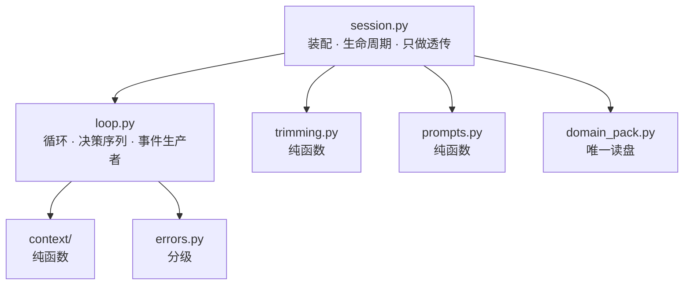
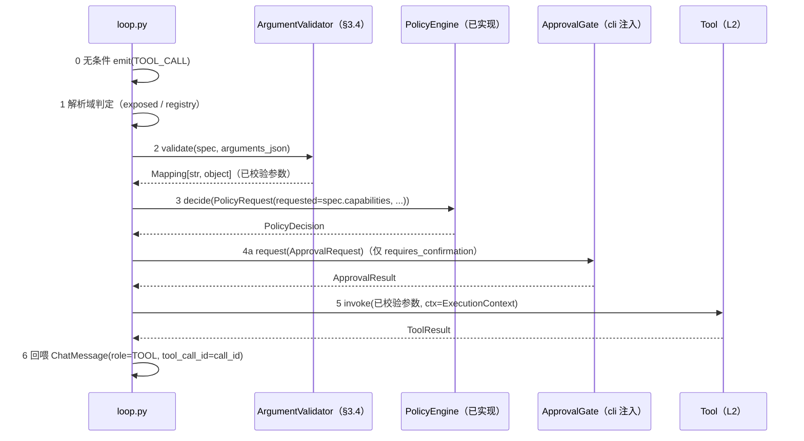

# 契约：`contracts/harness.py`（L3 编排边界与会话事件流）

- 对应模块：`src/agent_sec_perf/harness/`（L3 编排层，8 件：`session` / `loop` / `prompts` /
  `trimming` / `checkpoint` / `errors` / `context/` / `domain_pack`）
- 上游决策：ADR-0015 §5.1.2（`UX ↔ HARNESS` 行 + `HARNESS ↔ CAPABILITY` 行 + 「关键约定」）、
  §5.3 自研模块 2/4/5、§5.4.1、§7.2（`S1`/`S3`）、§7.3
- 依赖：`contracts/model.py`（`ModelResponse` / `ChatMessage` / `CapabilityTier`）、
  `contracts/tools.py`（`ToolSpec` / `ToolCallRequest` / `ToolResult` / `ExecutionContext` /
  `ToolRegistry` / `Tool`）、`contracts/policy.py`（`PolicyEngine` / `PolicyRequest` /
  `PolicyDecision` / `RiskLevel` / `Capability`）、`contracts/audit.py`（`AuditSink`）
  —— 均为**契约层内部引用**，允许（R3）。契约本体**只依赖标准库**（C1）。
- 本文件回答的问题（由领导派活时核实、确认存在）：

  > 🔴 **`SessionEvent` 被引用但未定义**：`ADR-0015` §5.1.2（`UX ↔ HARNESS` 行）与
  > `architecture.md` §2.4 / §5.2 写了 `Session.run(task) -> AsyncIterator[SessionEvent]`
  > 与"业务失败以 `SessionEvent(kind="error")` 表达"，但 `contracts/` 与 `interfaces/`
  > 里都没有它。**"未落盘 = 不存在" ⇒ 实现者无法开工。**

**本轮范围声明（重要）**：本契约的目标是"**能让实现者并行开工**"，**不是**把 Harness 设计完。
明确**不展开**：上下文效率引擎的检索/压缩算法、提示分级的具体话术、检查点持久化的落点、
能力探测与档位判定、路由降级、多轮评审/自动验证（`REQ-HARNESS-07`）。
**本项目的失败模式是"文档宣称与实现不一致"，不是"文档不够长"** —— 宁可少写、写准。

---

## 1. 设计要点（先读这一节）

1. **事件流是 `cli/` 与 `harness/` 之间唯一的业务载体**，也是"非交互模式序列化为 JSON"
   （ADR §5.1.2）的对象 ⇒ 事件必须**可序列化、无凭据**（C8），**不可信内容只能以数据形态**
   出现（C9），且**不得承载原始 `arguments_json`**（I8）。
2. **审计（`observability/`）与事件流是两套记录面，不可互相替代**：审计是**证据**
   （只追加、可回放、写入失败必须冒泡）；事件流是**界面载体**（有序、可渲染）。
   二者靠 `audit_id` / `call_id` **显式**关联（§2.7），不靠时间戳猜。
3. **工具调用的决策序列只有一个持有者**：`harness/loop.py`。解析域 → 严格校验 →
   `decide()` → 审批 → `invoke()`，五步的**入参/出参类型在 §3.3 逐条写死**
   —— 这是 `S1`（`ADR-0015` §7.2）的验收对象，也是全项目最易实现错的地方。
4. **"拒绝 ≠ 失败"，且必须在事件里可区分**：未执行 ⇒ `TOOL_RESULT.result is None` + 中文
   `text`；已执行但失败 ⇒ `result.ok is False`（`architecture.md` §5.3 硬规定 2）。
5. **不可信内容不得被固化**：原始 `arguments_json` **不进事件、不进审计 `detail`、不进
   `text`**（I8）；它只在"参数校验器"这一处被解析成结构化参数（§3.4）。
6. **fail-secure 的默认值取向**（C6）：`capability_tier` 默认**最弱档**（工具最少、提示最结构化）；
   `network_allowed` **恒 `False`**（本轮）；非交互审批**默认拒绝**；领域包**未知键 / 未知名字 /
   包内 `.py` 一律拒绝加载**（§4.3，不得降级、不得部分加载）。

---

## 2. 类型定义

### 2.1 `SessionEventKind`（**新增**）

```python
class SessionEventKind(StrEnum):
    MODEL_RESPONSE = "model_response"
    TOOL_CALL = "tool_call"
    POLICY_DECISION = "policy_decision"
    APPROVAL_RESULT = "approval_result"
    TOOL_RESULT = "tool_result"
    ERROR = "error"
    TASK_FINISHED = "task_finished"
```

**为什么是这 7 个**（每个成员都有明确的产出时机、生产者与消费方；没有"为了完整而列"的成员）：

| 成员 | 何时产出（无条件/条件） | 生产者 | 覆盖的需求 / 被引用的出处 |
| --- | --- | --- | --- |
| `MODEL_RESPONSE` | 每次 `ModelClient.chat` 成功后**一条** | `loop.py` | `REQ-HARNESS-02/04`；`REQ-MODEL-05`（记录实际应答后端） |
| `TOOL_CALL` | 模型每请求一次工具调用**无条件一条**（含随后被拒的） | `loop.py` | `REQ-HARNESS-01`（≥3 步工具调用）、`REQ-SEC-01`（"曾请求过"必须可见） |
| `POLICY_DECISION` | 每次**通过参数校验**的调用**恰好一条** | `loop.py`（由 `PolicyEngine` 求值产生） | `REQ-SEC-01/02/06`（每次决策可回放，且与审计一一对应） |
| `APPROVAL_RESULT` | `decision.requires_confirmation` 为真时**恰好一条** | `loop.py`（由注入的 `ApprovalGate` 产生） | `REQ-UX-02`（三种选择均可用且被记录） |
| `TOOL_RESULT` | 每个 `TOOL_CALL` **恰好一条**（**未执行也算**） | `loop.py` | `REQ-HARNESS-01/06`（观察内容与失败回喂） |
| `ERROR` | 本步失败时（可恢复或终止；见 I7） | `loop.py` | `REQ-HARNESS-06`；ADR §5.1.2（"业务失败以 `SessionEvent(kind="error")` 表达"） |
| `TASK_FINISHED` | 一次 `run` 的**最后一条**（恰好一条） | `loop.py` | ADR §5.1.2（终止语义）、`REQ-HARNESS-05` |

**被否决的成员（记录理由，防止重复讨论）**：

| 候选成员 | 结论与理由 |
| --- | --- |
| `TASK_STARTED` | **不加**。`SessionConfig` 由 `cli/` 自己构造 ⇒ 起步横幅它自己能渲染；唯一不可见的是"暴露了哪些工具"，那属 `REQ-HARNESS-03` 的**单测 / 基准**面（`trimming.select_tools` 是纯函数，可直接断言），不必进事件流 ⇒ 少一个 kind、少一组不变式 |
| `MODEL_REQUEST` / `PROMPT_SENT` | **不加**：把完整提示（含不可信内容）复制进事件流，等于给"不可信内容固化面"再开一处（I8 的对手）。诊断需求由 `structlog` 的脱敏管线承担 |
| `TOOL_DENIED`（与 `TOOL_RESULT` 并列） | **不加**：会让配对不变式退化成"恰好一条 `TOOL_RESULT` **或** `TOOL_DENIED`"，两处都要检查。改用**同一 kind + `result is None`**（I3）表达 |
| `AUDIT_FAILED` | **不加**：审计失败**必须冒泡**（`audit.md` §2.4 / `ADR-0015` §5.1.2），不得降级为一条业务事件——那会把"审计基础设施故障"伪装成"任务失败"（`policy.md` §2.5 的同一取舍） |
| `HEARTBEAT` / `TOKEN` 流式增量 | **本期不加**：流式解码尚无载体（云端客户端未开工），且 `--output-format json` 的行式形态（§2.6）会被高频增量撑爆；将来若引入流式，**新增 kind**（不许改既有 kind 语义） |

### 2.2 `SessionEvent`（**新增**，缺口的主体）

```python
@dataclass(frozen=True)
class SessionEvent:
    kind: SessionEventKind
    session_id: str
    seq: int
    timestamp: str
    call_id: str | None = None
    tool_name: str | None = None
    response: ModelResponse | None = None
    decision: PolicyDecision | None = None
    approval: ApprovalResult | None = None
    result: ToolResult | None = None
    text: str | None = None
    error_kind: SessionErrorKind | None = None
    status: TaskStatus | None = None
    audit_id: str | None = None
```

| 字段 | 类型 | 语义 | 哪些 kind 下必填 |
| --- | --- | --- | --- |
| `kind` | `SessionEventKind` | 事件类别 | 全部 |
| `session_id` | `str` | 会话标识；与 `AuditEvent.session_id` **同源** | 全部 |
| `seq` | `int` | 会话内**从 0 开始、单调递增、无空洞**的序号（I9） | 全部 |
| `timestamp` | `str` | **ISO-8601 带时区**（与 `AuditEvent.timestamp` 同口径：naive 时间被拒绝） | 全部 |
| `call_id` | `str \| None` | 关联键：等于对应 `ToolCallRequest.call_id` | `TOOL_CALL` / `POLICY_DECISION` / `APPROVAL_RESULT` / `TOOL_RESULT` |
| `tool_name` | `str \| None` | 工具名，**原样取自模型请求 ⇒ 不可信数据**（渲染前必须净化，见 §2.6 第 5 条） | 同上 4 个 |
| `response` | `ModelResponse \| None` | 模型响应整体（`content` 为**不可信**模型输出） | `MODEL_RESPONSE` |
| `decision` | `PolicyDecision \| None` | 策略决策（含 `reason` / `risk_level` / `audit_id`） | `POLICY_DECISION` |
| `approval` | `ApprovalResult \| None` | 人工确认结果 | `APPROVAL_RESULT` |
| `result` | `ToolResult \| None` | 工具执行结果；**`None` ⇒ 本次调用未执行**（被拒） | `TOOL_RESULT` |
| `text` | `str \| None` | **我方生成**的中文说明（拒绝理由 / 错误说明 / 结束原因）。**不得**承载模型或工具的原文（I8） | `ERROR` / `TASK_FINISHED`；`TOOL_RESULT` 且 `result is None` |
| `error_kind` | `SessionErrorKind \| None` | 错误分级（见 §2.4） | `ERROR` |
| `status` | `TaskStatus \| None` | 任务终态（见 §2.3） | `TASK_FINISHED` |
| `audit_id` | `str \| None` | 关联的**审计事件** `event_id`（`REQ-SEC-06` 的可回放入口） | `TOOL_RESULT`；`POLICY_DECISION`（== `decision.audit_id`）；`APPROVAL_RESULT`（== `approval.audit_id`） |

**为什么用"宽记录 + 按 kind 的不变式"而不是"每个 kind 一个载荷类"**：与 `AuditEvent`
（[`audit.md`](audit.md) §2.3）同构，序列化只有一条路径（§2.6），实现者不必写 7 个分支的匹配；
代价是"哪些字段在哪个 kind 下必填"必须由不变式钉住 —— 这正是下面 I1~I9 的作用。
**被否决的替代**：每 kind 一个 `frozen` 载荷类（类型最紧，但需要 7 个类 + 一个联合类型 +
序列化分支；在本轮"最小够用"的目标下收益不足）。

#### 不变式（实现必须断言、测试必须覆盖）

- **I1（配对与串行）**：对每条 `MODEL_RESPONSE.response.tool_calls[i]`，流中**恰好一条**
  `TOOL_CALL` 与**恰好一条** `TOOL_RESULT`，二者 `call_id` 相同，`TOOL_CALL` 在前；
  同一 `MODEL_RESPONSE` 的多个 `tool_calls` **按 tuple 顺序串行处理完**（事件之间不交错）。
- **I2（决策与确认的相对位置）**：`TOOL_CALL` 与 `TOOL_RESULT` 之间**至多一条**
  `POLICY_DECISION` 与**至多一条** `APPROVAL_RESULT`（同一 `call_id`）；`POLICY_DECISION`
  在前；`APPROVAL_RESULT` 存在 **⇔** 该 `decision.requires_confirmation` 为真。
- **I3（结果与执行）**：`TOOL_RESULT.result is None` **⇔** 本次调用**未执行**；此时 `text`
  **必须**非空（中文说明）、`audit_id` **必须**非空。`result is not None` ⇒ 已执行，成败看
  `result.ok`（**不得**用 `result.ok=False` 表示"未执行"）。
- **I4（审计可回放）**：`TOOL_RESULT.audit_id` 非空，且审计中存在一条
  `kind=TOOL_CALL`、`call_id` 相同、`event_id == audit_id` 的事件。**判据是"存在且可回放"，
  不是"恰好一条"**：`audit.md` §2.3 允许"调用前后各一条"，`call_id` 也可能出现多条。
  `result is not None` ⇒ `result.audit_id` 与其一致（同一 id 不得有两套）。
- **I5（决策与审批的关联）**：`POLICY_DECISION.audit_id == decision.audit_id`；
  `APPROVAL_RESULT.audit_id == approval.audit_id`。
- **I6（终态唯一且最后）**：`TASK_FINISHED` **恰好一条**且是流中**最后一个**事件；其 `status`
  与 `text` 均非空。
- **I7（错误与终态的关系，单向）**：`status is FAILED` ⇒ 流中至少一条 `ERROR`。
  **反向不成立**：`ERROR` 表示"本步失败"，可恢复错误之后循环继续（`REQ-HARNESS-06`
  "单步失败不导致整体失败"）⇒ 允许出现 `ERROR` 且最终 `status is COMPLETED` 的流。
- **I8（不可信内容的位置，干净字段）**：事件里**不得**出现原始 `arguments_json`；
  `text` **不得**包含其任何片段。不可信内容的合法去向只有四处：
  `response.content` / `result.content` / `result.error` / `tool_name`。
  ⇒ 任何把参数值写进 `text`、`detail`、日志或审计的理由都必须在 `argument_validator` 里
  换成"哪个键、期望什么类型"（§3.4 第 4 条）。
- **I9（`seq`）**：`seq` 在**一个 `Session` 实例**的生命周期内从 0 起连续无空洞；
  多次 `run` 不重置（§2.9）。
- **I10（无凭据）**：事件**不含**任何凭据字段（C8）；`SessionEvent` 不暴露 `os.environ`，
  也不承载 `foundation.proc.minimal_env` 之外的任何环境信息。

### 2.3 `TaskStatus`（**新增**）

```python
class TaskStatus(StrEnum):
    COMPLETED = "completed"  # 模型给出最终回复（无 tool_calls）或被判定完成
    FAILED = "failed"  # 不可恢复错误，循环终止
    LIMIT_REACHED = "limit_reached"  # 步数 / 连续失败 / 预算上限用尽
```

**为什么 `LIMIT_REACHED` 与 `FAILED` 分开**：`REQ-HARNESS-06` 要求"单步失败不导致整体失败"，
因此"**成功但用尽了步数预算**"与"**遇到不可恢复错误**"必须可区分 —— 前者是**配置问题**
（调 `max_steps`），后者是**故障**。合并成一个 `FAILED` 会让调参时看到错误的信号。

### 2.4 `SessionErrorKind`（**新增**）

```python
class SessionErrorKind(StrEnum):
    TRANSIENT = "transient"  # 后端瞬时故障，重试预算耗尽
    UNREACHABLE = "unreachable"  # 后端不可达（ModelUnavailableError）
    PROTOCOL = "protocol"  # 响应不符合契约（ModelProtocolError）
    STALLED = "stalled"  # 连续失败达 max_consecutive_failures
    INTERNAL = "internal"  # 我方不变量被破 / 未预期异常
```

- **工具级失败不在此列**：`ToolResult.ok=False` 是**正常数据通路**（回喂给模型），
  不产生 `ERROR` 事件；只有**连续失败达上限**时才升格为 `STALLED`。
- **`UNREACHABLE` 本轮无降级路径**：`ModelUnavailableError` 的既定处置是"路由降级"
  （`model/router.py`，**未开工**）⇒ 本轮取 `RETRY` 后 `FATAL`。**不得**把它写成"已降级"。

### 2.5 审批门（**新增**：`ApprovalOutcome` / `ApprovalRequest` / `ApprovalResult` / `ApprovalGate`）

**这一组类型存在的原因（依赖倒置）**：`architecture.md` §5.2 的时序图里"需人工确认"由
`cli/approval` 处理，而 `R1` **禁止 `harness` 依赖 `cli`**。若不给这个接缝定形，实现者只能
自己发明一种回调，或让 `harness` 去 `input()`（既违反分层，又让单测无法注入）。

```python
class ApprovalOutcome(StrEnum):
    ALLOW_ONCE = "allow_once"
    ALLOW_ALWAYS = "allow_always"
    DENY = "deny"


@dataclass(frozen=True)
class ApprovalRequest:
    session_id: str
    call_id: str
    tool_name: str  # 原样取自模型请求 ⇒ 不可信数据，展示前必须净化
    risk_level: RiskLevel
    reason: str  # 来自 PolicyDecision.reason（我方生成的中文理由）


@dataclass(frozen=True)
class ApprovalResult:
    outcome: ApprovalOutcome
    audit_id: str  # cli/approval.py 发出的 AuditEvent(kind=APPROVAL).event_id


class ApprovalGate(Protocol):
    def request(self, request: ApprovalRequest) -> ApprovalResult: ...
```

**规定**：

| # | 规定 | 理由 |
| --- | --- | --- |
| A1 | `ApprovalGate` 的**实现**归 `cli/approval.py`（在 `cli/` 装配时注入）；`contracts/` 只放 Protocol | 依赖倒置：`harness` 只依赖契约，单测可注入 fake（`ADR-0015` §7.3 的"只读契约写出 stub"） |
| A2 | **阻塞式同步调用**，返回值即用户选择；`harness` 不轮询、不超时 | 与"单会话单线程、事件流串行产出"（ADR §5.1.2）一致 |
| A3 | **非交互模式（无 TTY）必须返回 `DENY`**，不得阻塞等待 stdin，不得默认放行 | fail-secure 默认值（C6）；`REQ-UX-01` 要求非交互可进 CI ⇒ 一次等待 stdin 会让 CI 挂死 |
| A4 | 每次调用**必须**先 `emit(AuditEvent(kind=APPROVAL))`，再返回其结果（`audit_id` 即该事件 id） | `REQ-UX-02`"三种选择均被审计"；`audit.md` §2.3 的生产者表把 `APPROVAL` 归 `cli/approval.py` |
| A5 | `ALLOW_ALWAYS` **在本轮等价于 `ALLOW_ONCE`**（持久授权未实现，见 `README.md` §6 的 `U3`），但**必须被接受并在事件与审计里如实记录 `allow_always`** | "总是允许"的持久化属 `U3`（未决）。不做持久化而接受该选择，方向上是**收窄**（不会多授予）；**记录**它则不构成静默降级（`ADR-0006` §5.2 规则 `S-2`）。⚠️ **不得**把 `ALLOW_ALWAYS` 当成"本轮已支持持久授权" |
| A6 | `harness` **不得**自行决定"要不要问"：唯一依据是 `decision.requires_confirmation` | 决策归 `PolicyEngine`，呈现归 `cli/`；`harness` 只做路由（`REQ-SEC-01` 的 100% 拦截率不能由界面层保证） |

### 2.6 序列化口径（`--output-format json` 与终端渲染）

```python
def event_to_payload(event: SessionEvent) -> dict[str, object]: ...
```

| # | 规定 |
| --- | --- |
| 1 | **键 = 字段名，全部保留**（`None` 写 `null`，不省略键）——省略会让"字段不存在"与"字段为 `null`"在消费侧同形（沿用 `observability/audit.py::_event_to_payload` 的既有写法） |
| 2 | 枚举一律写**值**（`kind.value`），与 `C3` 一致 |
| 3 | `response` / `decision` / `approval` / `result` 是嵌套对象，按各自契约的字段表递归展开；**禁止**整对象 `repr` 或 `str()` |
| 4 | `--output-format json` 的输出是 **JSONL（一行一个事件，按 `seq` 追加序）**：可流式消费、可 `diff`，且与审计的落盘形态一致 |
| 5 | 面向**终端**渲染（非 JSON）时，`tool_name` / `response.content` / `result.content` / `result.error` **必须**先经 `foundation.logging.sanitize_for_display`（控制字符与 ESC 替换为 `?`）。理由：这些串来自模型与工具，是**不可信**文本，直接写进终端等于允许 ANSI 转义序列篡改显示（`foundation/logging.py` 的既有对手） |
| 6 | 本函数是**纯函数**（不读时钟、不读环境、不写文件）；`timestamp` 已在事件里 | 可确定性测试 |

### 2.7 审计关联（`REQ-SEC-06` 的可回放性怎么对上）

| 事件 | 对应的审计事件 | 关联键 | 生产者 |
| --- | --- | --- | --- |
| `TOOL_CALL` / `TOOL_RESULT` | `kind=TOOL_CALL`（每 `call_id` **至少一条**） | `SessionEvent.audit_id` == `AuditEvent.event_id`；`call_id` 相同 | **已执行**：工具层（`tools/registry.py::audit_tool_call`，现状不变）；**未执行**：`harness/loop.py`（新增，见下方修订请求） |
| `POLICY_DECISION` | `kind=POLICY_DECISION` | `decision.audit_id` | `security/policy.py`（**已实现**） |
| `APPROVAL_RESULT` | `kind=APPROVAL` | `approval.audit_id` | `cli/approval.py` |
| `MODEL_RESPONSE` / `ERROR` / `TASK_FINISHED` | **无** | — | — |

> **`MODEL_RESPONSE` / `ERROR` / `TASK_FINISHED` 为什么不审计**：`AuditEventKind` 的成员集合
> 由 `audit.md` §2.1 **逐个对应明确需求**（没有"为了完整而列"）。"模型答复了什么"不是权限事件，
> 且把模型原文写进长期证据违背 I8 的取向；扩 `AuditEventKind` 需 ADR + 影响面评估。

#### ⚠️ 修订请求：`TOOL_CALL` 需要第三个 `outcome` 取值 `DENY`（**本契约的规范性要求**）

**问题（已核实，两处契约合起来不可满足）**：

- [`tools.md`](tools.md) §2.6 规定：`ToolRegistry.resolve` 对未知工具返回 `None`，
  "由调用方**默认拒绝 + 审计**"；
- [`audit.md`](audit.md) §2.2 规定：`kind=TOOL_CALL` 的允许 `outcome` 只有 `{OK, ERROR}`。

⇒ **"被拒绝、没有执行"无法被忠实表达**：用 `ERROR` 会让"工具执行失败"与"根本没有执行"
在 `REQ-OBS-01` 的按结果检索里**同形**，而 `architecture.md` §5.3 的硬规定 2 正是
"**拒绝不等于失败**"（同一失效模式已在 `policy.md` §2.5 的 `detail["requested"] == []`
三种来源上被处理过一次）。

**规定（本契约生效，实现者照此写）**：

| # | 规定 |
| --- | --- |
| D1 | `kind=TOOL_CALL` 的允许 `outcome` 扩为 **`{OK, ERROR, DENY}`**；`DENY` 专指"**未执行**"，**不得**用 `ERROR` 代替 |
| D2 | `DENY` 时 `detail["denied_reason"]` **必填**，取值限于 `{"unknown_tool", "not_exposed", "invalid_arguments", "policy_denied", "approval_denied"}` —— 均为**我方生成的定长短码**，不含任何不可信内容 |
| D3 | 已执行路径的审计仍由工具层发出（现状不变）；未执行路径由 `harness/loop.py` 发一条，`event_id` 回填进 `SessionEvent.audit_id` |
| D4 | 同一 `call_id` 可能有多条 `TOOL_CALL` 审计事件 ⇒ 判据是 **I4**（"存在且可回放"），**不得**写成"恰好一条" |

**待同步项**：[`audit.md`](audit.md) §2.2 的 kind→outcome 表与 §4 修订记录需补这一行；
`src/` 侧若有"kind→outcome 一致性"的校验（读取侧 `_parse_line` / 单测），需同步。
登记见 [`README.md`](README.md) §6 的 **U8**。

### 2.8 `SessionConfig`（**新增**：装配面）

```python
@dataclass(frozen=True)
class SessionConfig:
    working_dir: Path
    allowed_roots: tuple[Path, ...]
    capability_tier: CapabilityTier = CapabilityTier.BASIC
    max_steps: int = 12
    max_consecutive_failures: int = 3
    tool_timeout_s: float = 30.0
    max_prompt_tokens: int = 8192
    max_completion_tokens: int | None = None
```

| 字段 | 语义 | 默认值的取向 |
| --- | --- | --- |
| `working_dir` | 工具可写的一次性工作目录（**由调用方创建与清理**，`interfaces/tools.md` §2.4） | 无默认（必填） |
| `allowed_roots` | 文件访问白名单根（进 `ExecutionContext.allowed_roots`） | 无默认（必填）；**空元组 ⇒ 拒绝启动** |
| `capability_tier` | **模型能力**档位（决定工具裁剪与提示分级） | 默认 `BASIC` = **最弱档**（工具最少、提示最结构化）⇒ fail-secure 方向；探测（`REQ-MODEL-06`）未开工，故显式传入、默认取最保守 |
| `max_steps` | 单次 `run` 的模型往返上限 | `12`（`REQ-HARNESS-01` 只要 ≥3 步；12 给足余量且能兜住死循环） |
| `max_consecutive_failures` | 连续"未执行或工具级失败"的上限 | `3`：达上限 ⇒ `ERROR(STALLED)` + `TASK_FINISHED(FAILED)` |
| `tool_timeout_s` | 单次工具调用的超时（进 `ExecutionContext.timeout_s`） | `30.0` |
| `max_prompt_tokens` | 提示侧 token 预算（构造 `ContextBudget`） | `8192` |
| `max_completion_tokens` | 传给 `chat(max_tokens=...)`；`None` = 用服务端默认 | `None` |

**装配期校验（`Session.__init__` 必须做，失败即拒绝启动）**：

1. 非空、非 `None` 的 `working_dir` / `allowed_roots`，且 `working_dir` **必须**经
   `foundation.paths.resolve_within(working_dir, allowed_roots, what="会话工作目录")` 校验通过
   （越界 ⇒ `PathNotAllowedError`）—— 这是 `ExecutionContext` 不变式"`working_dir` 落在
   `allowed_roots` 之内"的**生产者义务**；
2. `max_steps` / `max_consecutive_failures` 为正整数，`tool_timeout_s` / `max_prompt_tokens`
   为**有限正数**（`None` / `nan` / `inf` / 非正数一律拒绝——"无限等待"等于没有超时）；
3. 上述任一不满足 ⇒ **拒绝启动**，**不得**回退默认值继续跑（fail-secure）。

### 2.9 `Session` Protocol 与**同步 / 异步的裁决**

```python
class Session(Protocol):
    def run(self, task: str) -> Iterator[SessionEvent]: ...
    def close(self) -> None: ...  # 幂等
```

具体类（`harness/session.py::Session`）还必须实现 `__enter__` / `__exit__`：
`with Session(...) as s:` 的退出路径按序 teardown —— **工具 → 模型客户端 → `llama-server`
进程 → `flush` 审计**（`ADR-0015` §5.1.2，逐序不可调换）。

| 项 | 规定 |
| --- | --- |
| 调用次数 | 同一实例**允许多次 `run`**（每次一个任务）；会话状态与 `seq` 跨 `run` 保留（I9）。本轮 `cli/` 可只用一个任务，但契约不禁止 |
| 错误面 | `run()` **内**的业务失败一律经 `ERROR` / `TASK_FINISHED` 表达，**不抛异常**；逃逸的只有三类：`ConfigError`（装配/配置）、**审计写入失败**（`AuditSink.emit`/`flush` 的异常必须冒泡，`audit.md` §2.4）、以及编程缺陷（`TypeError` 一类的实现 bug） |
| 并发 | **单会话单线程**；事件流串行产出；`seq` 的分配无需锁 |
| 不在 `run` 内做的事 | 装配（构造 `PolicyEngine` / `ToolRegistry` / `AuditSink` / 模型客户端）在 `run` **之前**完成；`ConfigError` 与审计落点类异常因此在装配期就暴露，不进事件流 |

#### 裁决：本轮 `Session.run` 用**同步 `Iterator[SessionEvent]`**，**不引入 `asyncio`**

`ADR-0015` §5.1.2 的该行原文写的是 `AsyncIterator`。**裁决：改为同步 `Iterator`**。理由逐条：

| # | 理由 |
| --- | --- |
| 1 | **该行自身已经规定了同步的语义**：同一格写着"**单会话单线程**；事件流**串行**产出"。`AsyncIterator` 在同一格里是**内部矛盾**（异步迭代器的价值在于"等待时不阻塞别的任务"，而这里明确没有别的任务） |
| 2 | **现有全部实现都是同步阻塞式**：`model/client.py`（`http.client` 阻塞 + `/health` 轮询）、`tools/*`（`proc.run` 阻塞）、`security/policy.py`、`observability/audit.py`（`fsync`）、`foundation/proc.py`。**`src/` 下没有任何 `async def`**（已核实）。选异步 = 重写 5 个模块（含已入库并有测试的代码） |
| 3 | **异步没有收益面**：`llama-server` 默认 `-np 1`，`ModelClient` 契约写明**非线程安全**（一个会话一个实例）⇒ 并发请求既无硬件支持也不被允许；CLI 是单任务前台 |
| 4 | **安全主线偏好顺序确定**：`校验 → decide() → 审批 → invoke()` 这条链路要求**顺序确定**。同步阻塞让"同一时刻只有一个特权操作在进行"成为**结构性事实**，而不是需要证明的性质（并发下的 TOCTOU 面更小） |
| 5 | **可回退性**：若将来确需异步（如 token 流式渲染），正确的路径是**新增方法**（如 `astream()`）**或新增 ADR 改接口**——`SessionEvent` 的类型定义不需要随执行模型变化。反之若现在选异步，回退成本是重写五个模块 |

**被否决的方案（记录理由，防止重复讨论）**：

| 候选 | 结论与理由 |
| --- | --- |
| 全量 `asyncio`（重写 `model` / `tools` / `proc` 为异步） | 否决。无收益面（理由 3），却把"唯一子进程入口"（`R4`）改造成并发调用点，且 `foundation/proc.py` 的 `spawn` 句柄"不跨线程共享"的既有约定要重新论证 |
| `AsyncIterator` + `asyncio.to_thread` 包住同步实现 | 否决。**伪异步**：底层仍阻塞，却把执行挪到线程池 ⇒ 与"`ModelClient` 非线程安全"直接冲突，并引入第二个执行上下文（`seq` 分配、审计串行化都要重新论证） |
| 同时提供 `run()` 与 `arun()`（双接口） | 否决。两个实现面、两倍测试面，且"哪个是权威"立刻成为分叉源（`README.md` C10 的教训：同一事实两处表述必然漂移）。**需要时再新增**，不做预埋 |

**据此需要更新的两处引用（本文件是权威，正文不改）**：

| 位置 | 现状 | 处理 |
| --- | --- | --- |
| `ADR-0015` §5.1.2 的 `UX ↔ HARNESS` 行 | `AsyncIterator[SessionEvent]` | **只允许在「修订记录」追加**一条（本契约已登记，见该 ADR 修订记录 2026-09-19）。ADR 正文**不改** |
| `architecture.md` §2.4 表首行 / §5.2 时序图 | 同上（两处） | **本文档不动**：`architecture.md` 不在本轮产出白名单内 ⇒ 由领导指派（记录员或下一轮架构工作）同步；**同步前该两处与 ADR-0015 的修订记录不一致，以修订记录与本契约为准** |

> **若所有者认为"同步 / 异步"属决策级变更**（而非本契约的形态细化），则正确处置是
> **另开一篇 ADR 声明取代 `ADR-0015` §5.1.2 的该行**，本裁决随之失效——
> 这条路径必须留痕在案，不得由实现者自行取舍。

---

## 3. `harness/` 内部接缝（"能并行"的前提）

### 3.1 8 件的职责与对外签名

```python
# --- harness/errors.py（无 harness 内部依赖）--------------------------------
class HarnessError(BenchError): ...


class HarnessInternalError(HarnessError): ...  # 我方不变量被破


class DomainPackError(HarnessError): ...  # 领域包加载/校验失败（fail-secure）


class ErrorDisposition(StrEnum):
    RETRY = "retry"  # 瞬时：原地重试（预算内）
    FEEDBACK = "feedback"  # 回喂自恢复：把失败作为观察内容喂回模型
    FATAL = "fatal"  # 上报并终止本任务


@dataclass(frozen=True)
class ErrorPlan:
    kind: SessionErrorKind
    disposition: ErrorDisposition
    message: str  # 中文、面向用户；**不得**回显不可信内容
    retry_budget: int  # 本类错误可重试的次数（FATAL ⇒ 0）


def plan_for(exc: BaseException) -> ErrorPlan: ...
```

```python
# --- harness/prompts.py（纯函数；只依赖 contracts）---------------------------
def system_prompt(
    *, tier: CapabilityTier, fragments: Sequence[str], tool_names: Sequence[str]
) -> str: ...
```

```python
# --- harness/trimming.py（纯函数；只依赖 contracts）--------------------------
def select_tools(
    specs: Sequence[ToolSpec], *, tier: CapabilityTier, allowlist: frozenset[str]
) -> tuple[ToolSpec, ...]: ...
```

```python
# --- harness/context/__init__.py（纯函数；只依赖 contracts）------------------
@dataclass(frozen=True)
class ContextBudget:
    max_tokens: int
    reserve_tokens: int = 1024


def assemble(
    *, system: str, task: str, history: Sequence[ChatMessage], budget: ContextBudget
) -> tuple[ChatMessage, ...]: ...
```

```python
# --- harness/checkpoint.py（纯函数；只依赖 contracts + foundation.errors）----
@dataclass(frozen=True)
class SessionState:
    session_id: str
    task: str
    step: int
    messages: tuple[ChatMessage, ...]


def to_payload(state: SessionState) -> Mapping[str, object]: ...
def from_payload(payload: Mapping[str, object]) -> SessionState: ...  # 严格校验，失败 ⇒ SchemaError
```

```python
# --- harness/domain_pack.py（唯一读盘者；只依赖 contracts + foundation）-----
@dataclass(frozen=True)
class DomainPack:
    name: str
    version: str
    prompt_fragments: tuple[str, ...]
    tool_allowlist: frozenset[str]
    capabilities_allowlist: frozenset[Capability]
    risk_overrides: Mapping[str, RiskLevel]
    output_format: str | None
    source: Path  # 已 resolve 的 pack.toml 路径（证据用）


def load_pack(
    directory: Path, *, roots: tuple[Path, ...], known_tools: frozenset[str]
) -> DomainPack: ...
```

```python
# --- harness/loop.py（循环 + 决策序列的唯一持有者）---------------------------
class TaskLoop:
    """单任务 ReAct 循环；**事件流的唯一生产者**（含 seq / timestamp）。"""

    def __init__(
        self,
        *,
        session_id: str,
        config: SessionConfig,
        model: ModelClient,
        exposed: tuple[ToolSpec, ...],  # 由 session 用 trimming 算好后传入
        policy: PolicyEngine,
        approval: ApprovalGate,
        sink: AuditSink,
        validator: ArgumentValidator,
        pack: DomainPack | None,
    ) -> None: ...

    def run(self, task: str) -> Iterator[SessionEvent]: ...
```

```python
# --- harness/session.py（装配 + 生命周期；不产事件）-------------------------
class Session(SessionContract):  # contracts/harness.py 的 Protocol
    def __init__(
        self,
        *,
        session_id: str,
        config: SessionConfig,
        model: ModelClient,
        registry: ToolRegistry,
        policy: PolicyEngine,
        approval: ApprovalGate,
        sink: AuditSink,
        validator: ArgumentValidator,
        pack: DomainPack | None = None,
    ) -> None: ...

    def run(self, task: str) -> Iterator[SessionEvent]: ...
    def close(self) -> None: ...  # 幂等
    def __enter__(self) -> Session: ...
    def __exit__(self, *exc_info: object) -> None: ...
```

**`session.py` 构造期的三件事**（顺序固定）：

1. **装配期校验**（§2.8 三条，失败即拒绝启动）；
2. `exposed = trimming.select_tools(registry.specs(), tier=config.capability_tier,
   allowlist=pack.tool_allowlist if pack else all_names)`；
3. `system = prompts.system_prompt(tier=config.capability_tier,
   fragments=pack.prompt_fragments if pack else (), tool_names=<exposed 的名字，升序>)`。
   **`exposed` 在会话内固定**（启动时算一次）：与 `REQ-PERF-06`"运行中不调整"一致，
   也让"解析域"（§3.3 步 1）成为稳定集合，可被单测钉住。

### 3.2 调用方向（谁调用谁）与**禁止调用**



**允许的 import（完整清单，超出即违规）**：

| 模块 | 允许 import |
| --- | --- |
| `harness/` 下**全部**文件 | `agent_sec_perf.contracts.*`、`agent_sec_perf.foundation.errors`、`agent_sec_perf.foundation.paths`（仅 `domain_pack`）、`agent_sec_perf.foundation.logging.sanitize_for_display`、标准库、以及**下表允许的 harness 内部模块** |

**禁止**：

| # | 禁止项 | 理由 |
| --- | --- | --- |
| H1 | `harness/**` **不得** import `model` / `tools` / `security` / `observability` / `cli` 的**任何实现模块** | 它们全部以**构造注入的 Protocol** 到达（§3.1 的构造签名）。这条比对 `architecture.md` §2.3 的白名单**更严**（白名单是**允许**而不是**必须**）：它让"只读契约写 fake 跑单测"（`ADR-0015` §7.3）成为可能，并挡住"顺手 `from ...tools.files import ReadFileTool`"这类把 L3 与 L2 实现焊死的改动 |
| H2 | **叶子模块之间零依赖**：`prompts` / `trimming` / `context` / `checkpoint` / `domain_pack` / `errors` 两两之间**互不 import**；`loop` 不 import `session`，`loop` 不 import `domain_pack` | 数据由 `session` 从 `domain_pack` 取出后**以参数传入**（§3.1 的签名已体现：`trimming` 收 `allowlist`，`prompts` 收 `fragments`）。harness 内部若长成一张网，8 件模块的并行开工立刻退化为串行 |
| H3 | **需要直接 import L2 实现时停下上报**，不得默认放宽 H1 | 与"接口先行"的流程一致：改接口先过架构师（`CODEBUDDY.md` §10.2 规则 3） |

**建议的机器检查**（`tests/unit/test_harness_internals.py`，实现者落）：H1 一条（扫描 `harness/`
下的 import 目标）+ H2 一条（按上表判定叶子间依赖）。"约定只写在文档里"是本项目**已复现过的**
失败模式（`ADR-0015` §7.1 的动机），harness 内部结构同理。

### 3.3 工具调用的决策序列（**核心**：每步入参/出参类型）



**输入**：`ModelResponse.tool_calls: tuple[ToolCallRequest, ...]`（每元素 `call_id` / `name` /
`arguments_json`）。**按 tuple 顺序串行处理**，一次一个（I1）。

| 步 | 动作 | 入参类型 | 出参类型 | 失败 / 分支处置 |
| --- | --- | --- | --- | --- |
| 0 | `emit(SessionEvent(kind=TOOL_CALL, call_id, tool_name=call.name))` | `ToolCallRequest` | — | **无条件**：模型请求过就是事实（`name` 原样，不可信数据） |
| 1 | **解析域判定**：`call.name` 是否属于 `exposed` 的名字集合 | `str` | `bool` | 不在 `exposed`：若该名字在 `registry.specs()` 里 ⇒ `denied_reason="not_exposed"`，否则 `"unknown_tool"` ⇒ **跳至步 6b**（**不**构造 `PolicyRequest`、**不**调 `decide()`、**不**调 `invoke()`）。⚠️ 若在 `exposed` 内却 `registry.resolve(name) is None` ⇒ **不变量被破** ⇒ `ERROR(INTERNAL)` + 终止（**不得**静默跳过） |
| 2 | **严格校验**：`validator.validate(spec=spec, arguments_json=call.arguments_json)` | `str`（不可信） | `Mapping[str, object]`（已校验的结构化参数） | 失败（`ToolArgumentsInvalidError`）⇒ `denied_reason="invalid_arguments"` ⇒ 步 6b。**不**构造 `PolicyRequest`（`architecture.md` §5.3 的 `VALID` 分支）；回喂内容 = 校验器的中文说明（**不得**回显原始 JSON） |
| 3 | `PolicyRequest(session_id, call_id=call.call_id, tool_name=spec.name, arguments=<步 2 出参>, requested=spec.capabilities, domain_pack=pack.name if pack else None)` ⇒ `policy.decide(request)` ⇒ `emit(SessionEvent(kind=POLICY_DECISION, decision=..., audit_id=decision.audit_id))` | `Mapping[str, object]` | `PolicyDecision` | ⚠️ **`spec.capabilities` 为空集 ⇒ 属工具声明缺陷**：视为 `denied_reason="invalid_arguments"`（**不得**构造空集请求——`policy.md` §2.3 的前置条件）；工具名必须用 `spec.name`（**不**用 `call.name`，两者在步 1 已确认一致，用 `spec.name` 可让审计的可信来源明确）。`decide()` 自身失败收敛为拒绝（`policy.md` §2.5），其异常**不**在 harness 侧被捕获 |
| 4 | 执行判定：① `decision.requires_confirmation` ⇒ `approval.request(ApprovalRequest(session_id, call_id, tool_name=spec.name, risk_level=decision.risk_level, reason=decision.reason))` ⇒ `emit(SessionEvent(kind=APPROVAL_RESULT, approval=..., audit_id=approval.audit_id))`；② 否则看 `decision.allow` | `PolicyDecision` | `ApprovalResult \| None` | ①`outcome is DENY` ⇒ `denied_reason="approval_denied"` ⇒ 步 6b；②`allow=False`（且不用确认）⇒ `denied_reason="policy_denied"` ⇒ 步 6b。**注意**：`requires_confirmation=True` **不论 `allow`** 都要问（`policy.md` §2.4 的四格：`False/True` 是"可升级拒绝"） |
| 5 | `ctx = ExecutionContext(session_id, call_id, working_dir=config.working_dir, allowed_roots=config.allowed_roots, timeout_s=config.tool_timeout_s, network_allowed=False)` ⇒ `tool.invoke(args=<步 2 出参>, ctx=ctx)` | `Mapping[str, object]` + `ExecutionContext` | `ToolResult` | 工具抛**未预期异常** ⇒ 不当成 `ERROR` 事件了事：记一条 `TOOL_CALL` 审计（`outcome=ERROR`，`detail["failed_reason"]="tool_exception"`）+ 合成 `ToolResult(ok=False, content="", error="工具内部错误：<异常类型名>", truncated=False, audit_id=<该审计 id>)`。**不回显异常消息内容**（可能携带路径 / 不可信串）。⚠️ **`network_allowed` 本轮恒为 `False`**：出站白名单与云端客户端**均未实现**，`NETWORK_OUTBOUND` 已授予**不等于**可以出站（把它当"已可出站"是 fail-open，`T-10` 保持**未缓解**） |
| 6a | 已执行 ⇒ `emit(TOOL_RESULT, result=result, audit_id=result.audit_id, text=None)`；观察内容 = `result.content`（成功）或 `result.error`（失败）——**不可信，按数据装配** | `ToolResult` | — | `result.content` / `result.error` 进消息历史时**不**加任何"以下是数据"之外的解释（`ChatMessage` 的信任规则见 `model.md` §2.1） |
| 6b | 未执行 ⇒ `emit(TOOL_RESULT, result=None, audit_id=<DENY 审计事件 id>, text=<中文说明>)` **且**先记一条 `TOOL_CALL` 审计（`outcome=DENY`，`detail["denied_reason"]=<步 1/2/4 的取值>`）；观察内容 = `text` | `str` | — | 回喂的是**我方生成的说明**（例如"工具未暴露给本次会话"），**不是**工具的 `ToolResult`——`ToolResult` 对象在拒绝路径上**不构造**（避免与"工具级失败"同形，`architecture.md` §5.3 硬规定 2） |

**回喂消息的形状**（步 6a/6b 共同）：

```python
ChatMessage(role=Role.TOOL, content=<观察内容>, tool_call_id=call.call_id)
```

`tool_call_id` **必须**等于 `call.call_id`：它是 `TOOL` 消息与 `ASSISTANT.tool_calls` 的唯一
配对键，缺失会让回指断裂、审计无法回放（`model.md` §2.1 的不变式）。

### 3.4 参数校验器（**新增 Protocol**；实现选型**待定，须停下上报**）

```python
class ArgumentValidator(Protocol):
    def validate(self, *, spec: ToolSpec, arguments_json: str) -> Mapping[str, object]: ...
```

**契约语义（无论用哪个实现都必须满足）**：

| # | 规定 | 理由 |
| --- | --- | --- |
| V1 | 输入 `arguments_json` 是**不可信文本**；必须按 `spec.parameters_schema` **严格**校验：类型、`required`、以及**未知键拒绝**（`additionalProperties: false` 的语义） | `REQ-SEC-03` / `ADR-0015` §5.1.2 的关键约定：解析与校验**只能**在 HARNESS 侧发生 |
| V2 | 输出只含 schema 声明过的键，值的类型与 schema 一致；**不得**把原始 JSON 的其它片段带出来 | 下游（`PolicyEngine` / `Tool.invoke`）据此判定"这是已校验参数" |
| V3 | 失败 ⇒ 抛 `ToolArgumentsInvalidError`（`foundation/errors.py` **新增**，`BenchError` 子类） | 单一异常层次（`model.md` §3 的既有依据）：异常分裂成两套基类会让 `except BenchError` 漏接 |
| V4 | **错误信息不得回显原始不可信内容**：只描述"哪个键、期望什么类型"，**不得**包含参数值、也**不得**包含 `arguments_json` 的任何片段；键名经 `sanitize_for_display` 截断 | I8；`REQ-SEC-07`（不入日志）；也是"回喂内容不带原始参数"的前提 |
| V5 | **输入大小上限**：`arguments_json` 超过上限（建议 `64 KiB`，与 `tools/registry.py::MAX_TOOL_OUTPUT_BYTES` 同量级）⇒ **直接拒绝**，不尝试解析 | 防"用超大 JSON 撑爆校验器"（`SECURITY.md`：限制输入体积） |
| V6 | **无状态、纯函数式**：不得访问文件系统 / 网络 / 环境变量，不得缓存跨调用状态 | 可并发调用；单测可用最小输入覆盖 |

**与 `tools/registry.py::ToolArgumentError` 的分工（不得合并，也不得只留一处）**：

| 检查点 | 输入 | 判据 | 失败 | 位置 |
| --- | --- | --- | --- | --- |
| **信任边界校验**（本节的 `ArgumentValidator`） | 模型给的**原始 JSON 文本** | JSON Schema（含未知键、类型） | `ToolArgumentsInvalidError`（⇒ `denied_reason="invalid_arguments"`） | `harness/`（`harness/loop.py` 调用） |
| **工具内部再校验**（现状不变） | **已校验**的结构化参数 | 工具自己的载荷形状（如 argv 非空、路径非空） | `ToolArgumentError`（⇒ `ToolResult(ok=False)`） | `tools/`（工具实现内部） |

语义不同（一个是"不可信输入被拒"，一个是"调用方语义缺陷"），故**不合并**；
但**不得**只保留其中一处（删入口 = 非法值以更晚、更隐蔽的形态出现；删兜底 = 工具依赖
"上游一定校验过"）。这与 `policy.md` §2.5"入口 vs 兜底"是同一套分工。

**实现选型未定（必须停下上报）**：`ADR-0015` §5.2.2 的 `D2` 把 pydantic 的用途限定为
"**信任边界校验** + 工具参数 JSON Schema 生成"，而 `src/` 中**尚无任何 `pydantic` import**
（`architecture.md` §11 的 `G-2` 已登记该差异）。本轮**不代为选型**，只要求：

1. 无论选 **pydantic 严格模式** 还是 **手写校验器**，必须满足 V1~V6；
2. 选定后**停下上报**（`CODEBUDDY.md` §10.2 规则 3）：
   - 选 pydantic ⇒ 这是 `D2` 第一处用途的落点，须在 `ADR-0015` 修订记录登记（`G-2` 收敛一半）；
   - 选手写 ⇒ 须**新增 ADR** 登记"`D2` 的第一处用途不落地"，理由与影响面一起写（ADR 只增不改）；
3. 无论哪种，**不得**用 pydantic 承担配置解析或内部数据结构（`D2` 的用途限定）。

---

## 4. 领域包（`domain_pack.py`）的最小声明式 schema

`R5`（`ADR-0015` §5.1.1）：**只加载声明式配置（TOML/JSON），禁止加载其中的 Python 代码**。
本节把"最小 pack"定死，使 `S3`（§7.2）有可执行判据，且**越权面为零**。

### 4.1 目录结构

```text
<pack-dir>/
├── pack.toml          # **唯一**被读取的文件（声明式）
└── …（说明文档 / 示例数据：允许存在，**不被读取**）
```

| 规定 | 内容 |
| --- | --- |
| P1 | **只读 `<dir>/pack.toml` 一个文件**，不递归、不读其它文件、不执行任何内容 |
| P2 | 目录内出现 **`.py` / `.pyc` / `__pycache__`** ⇒ **拒绝加载**（`DomainPackError`），**不得**"忽略它继续加载" |
| P3 | 路径**先校验后读**：`directory` 必须经 `foundation.paths.resolve_within(directory, roots, what="领域包目录")`；越界 / 符号链接逃逸 ⇒ `PathNotAllowedError` |
| P4 | `roots` 是**必填 keyword-only 参数、无默认值** | 默认值会让"忘了传"退化为"任意路径"（与 `audit.md` §2.5 的 `P1` 同一取向：允许的根**不得**来自不可信来源，也**不得**有会放宽的默认） |

### 4.2 `pack.toml` 字段

```toml
[pack]
name = "code-review"            # 必填；^[a-z0-9][a-z0-9-]{0,63}$
version = "1.0.0"               # 必填；^[0-9]+\.[0-9]+\.[0-9]+$
description = "代码评审场景"     # 可选；≤ 500 字符

[prompt]
fragments = ["评审时先列出改动点"] # 可选；≤ 8 条，每条 ≤ 2000 字符

[tools]
allowlist = ["read_file", "list_dir"]   # 必填（可为空数组）；每个名字必须在 known_tools 内

[security]
capabilities = ["read_file"]             # 必填（可为空数组）；每个名字必须是 Capability 成员

[security.risk_overrides]                # 可选；键必须在 known_tools 内，值必须是 RiskLevel 成员
write_file = "high"

[output]
format = "markdown"                      # 可选；枚举固定小集合（本轮：markdown | text）
```

| 字段 | 类型 | 必填 | 语义 |
| --- | --- | --- | --- |
| `pack.name` | `str` | 是 | 包标识（`PolicyRequest.domain_pack` 的取值） |
| `pack.version` | `str` | 是 | 版本（形状校验，不解析语义） |
| `pack.description` | `str` | 否 | 说明 |
| `prompt.fragments` | `list[str]` | 否 | 提示片段；进 SYSTEM 时**必须**被标注为**数据段**（§4.4） |
| `tools.allowlist` | `list[str]` | **是** | 允许暴露的工具名（**只能收窄**暴露面） |
| `security.capabilities` | `list[str]` | **是** | 包所需能力（**只能收窄**授予集合，§4.4） |
| `security.risk_overrides` | `table[str, str]` | 否 | 按工具覆盖风险等级（供 `PolicyEngine` 构造时的 `tool_risk`） |
| `output.format` | `str` | 否 | 输出规范（本轮仅记录，`cli/` 消费） |

**为什么 `tools.allowlist` 与 `security.capabilities` 必填（可为空数组）**：遗漏键必须
**失败**而不是"等价于不限制"。这正是 fail-secure 与 C6 的落点——空数组表示"什么都不给"，
是一个**可表达、可审计**的取值；而"漏写"与"不限制"在 schema 里若同形，就等于让一次笔误
变成一次**静默放宽**（与 `security/capabilities.py` 对未知能力名"拒绝而非跳过"同源）。

### 4.3 失败模式（**全部 fail-secure；禁止降级、禁止部分加载**）

| 情形 | 处置 |
| --- | --- |
| `pack.toml` 不存在 / 不是普通文件 | `DomainPackError` |
| TOML 语法错误 | `DomainPackError`（**不回显**原文片段） |
| 缺必填键 / 类型不符 / 取值超长 | `DomainPackError` |
| **未知键 / 未知段** | `DomainPackError`（**不得忽略**，见下方被否决方案 a） |
| 未知工具名（不在 `known_tools`） | `DomainPackError`（**不跳过**） |
| 未知能力名 | `DomainPackError`（**不跳过**；口径与 `parse_capabilities()` 一致） |
| 未知风险等级 | `DomainPackError`（**不跳过**） |
| 目录内出现 `.py` / `.pyc` / `__pycache__` | `DomainPackError`（P2） |
| 路径越界 / 符号链接逃逸 | `PathNotAllowedError`（P3；**先校验后读**） |
| 目录不可读 / 非目录 | `OSError`（原样冒泡） |
| **任何失败** | **禁止**：降级为"无 pack 继续跑"、部分加载、忽略未知键、忽略未知名字。加载失败 ⇒ **拒绝启动**（装配期语义，与 `PathNotAllowedError` 同侧，见 `audit.md` §2.5 末段） |

### 4.4 两条安全规定（与 `S3` 直接相关）

1. **能力只能收窄，绝不并集**：生效授予 = `用户配置的授予 ∩ pack.security.capabilities`。
   - 禁止：`granted | pack_caps`；禁止"pack 未声明 ⇒ 视为全授予"。
   - **实施点**：装配（`cli/`，未开工）在**构造 `PolicyEngine` 之前**完成收窄；
     为此 `security/capabilities.py` 需提供一个**纯函数**辅助（见 §6 改动清单），
     使"只能收窄"成为**可单测的函数**而不是一句约定（当前 `CapabilitySet` 无交集辅助）。
2. **`prompt.fragments` 是数据，不是指令**：`prompts.system_prompt` 必须把片段放在
   **显式标注为数据段**的位置，且**不得**让片段替换 / 覆盖我方模板中的安全约束段
   （安全约束段只能来自 `prompts.py` 的常量）。
   ⚠️ **诚实结论**：提示层对"包内容影响模型行为"**只有部分缓解**——机制性护栏在
   `decide()` 的 default-deny + 本节第 1 条的"能力只能收窄"，**不**在提示措辞。
   `T-04`（提示注入与上下文污染）与 `T-12`（领域包加载代码）**状态不变**，本轮不改威胁模型。

**被否决的方案（记录理由，防止重复讨论）**：

| 候选 | 结论与理由 |
| --- | --- |
| (a) **忽略未知键**（"向前兼容"） | **否决**。未知键是"作者以为生效、实际没生效"的**唯一来源**（把 `allowlist` 拼成 `allowlis` ⇒ 白名单静默失效 = fail-open）；且与 `foundation/config.py` 的既有取向（未知段/未知键 ⇒ `ConfigError`）**自相矛盾** |
| (b) 出现 `.py` 时"忽略不导入" | **否决**。无法区分"作者误放"与"投毒尝试"，且"这个包里带代码"这一事实**不留任何痕迹**（`ADR-0006` §5.2 规则 `S-2` 禁止静默降级）；`S3` 的判据也会从"拒绝加载"退化成一个弱得多的"没有副作用" |
| (c) pack 内脚本钩子（生命周期回调） | **否决**：`R5` 硬规则；等于把不可信仓库变成任意代码执行 |
| (d) 用 JSON 而非 TOML | **否决（次要）**：`tomllib` 是标准库、零依赖（`C1`），且与项目其它配置格式一致（`ADR-0015` §5.2.3）。JSON 无注释、手改体验更差 |

---

## 5. 验证方式（**可执行判据**；没有验证方式的缓解视为未实现）

### 5.1 单测（`tests/unit/`，实现工程师）

| # | 判据 |
| --- | --- |
| `H-1` | **不变式统一断言**：把 I1~I10 写成一个断言函数，对**每个**场景（正常 / 未知工具 / 未暴露 / 参数不合法 / 策略硬拒绝 / 审批拒绝 / 工具失败 / 后端不可达 / 步数用尽）复用一遍 |
| `H-2` | `seq` 从 0 连续无空洞；`TASK_FINISHED` 恰好一条且最后（I6/I9） |
| `H-3` | 校验器：超大 JSON / 未知键 / 类型不符 / 缺必填 / 非法 JSON ⇒ 全部 `invalid_arguments`；且 `text` 中**不含**参数值 sentinel（I8 / V4） |
| `H-4` | `trimming.select_tools`：同输入同输出、按 `name` 升序；`allowlist` 之外的工具**必须**不在输出里（"只收窄"） |
| `H-5` | 领域包：未知键 / 未知工具名 / 未知能力名 / 缺 `security.capabilities` 键 / 包内 `.py` ⇒ 五类各自 `DomainPackError`；合法 pack 的字段逐项与 `pack.toml` 一致 |
| `H-6` | `context.assemble` 在超预算输入下**不切断** `ASSISTANT(tool_calls)` 与 `TOOL(tool_call_id)` 的配对 |
| `H-7` | `harness/` 内部结构：H1（不 import L2/L4 实现）+ H2（叶子零依赖）两条机器检查 |
| `H-8` | 装配期校验：`working_dir` 不在 `allowed_roots` 内 / `max_steps=0` / `tool_timeout_s=inf` ⇒ 构造期拒绝（§2.8） |
| `H-9` | `Session.close()` 幂等；`with` 退出后按序 teardown（用 fake 记录调用顺序） |

### 5.2 对抗性用例（`tests/security/`，验证工程师；**不得由实现者自证**）

| # | 攻击场景 → 期望行为 | 验收标准 |
| --- | --- | --- |
| `S1`（`ADR-0015` §7.2） | 模型请求一个**未被授权**的工具（`WRITE_FILE` 未授予） | 调用**未执行**（`Tool.invoke` 未被调用）+ `TOOL_RESULT(result=None)` + `audit_id` 能在 sink 中查到 `TOOL_CALL/DENY` **与** `POLICY_DECISION` 两条事件（可回放） |
| `S1-b`（本契约新增） | ① 模型**幻觉**一个不存在的工具名；② 模型调用一个**存在但未暴露**的工具（被裁剪 / 不在 pack 白名单） | 两者都**未执行**，且审计 `detail["denied_reason"]` 分别为 `unknown_tool` / `not_exposed` —— 这两条是 `tools.md` §2.6 与 `REQ-HARNESS-03` 的行为面，**此前无任何用例覆盖** |
| `S1-c`（本契约新增） | `arguments_json` 携带唯一 sentinel 值（如 `SENTINEL-7f3a…`）的超长 / 非法 / 未知键载荷 | 事件流、`text`、审计文件三者中**均不出现**该 sentinel（I8/V4） |
| `S3`（`ADR-0015` §7.2） | 领域包目录内放置一个**带副作用**的 `.py`（写标志文件 / 打印） | ① `load_pack` 抛 `DomainPackError`；② 标志文件**不存在**；③ 该模块名**不在** `sys.modules`（"不导入"是行为断言，不能只看返回值） |
| `S-new-1` | 需人工确认的调用，`ApprovalGate` 为"非交互 ⇒ 拒绝"的实现 | 未执行；`APPROVAL_RESULT.outcome is DENY`；审计有 `kind=APPROVAL` 事件（A3/A4） |
| `S-new-2` | `NETWORK_OUTBOUND` 已授予，工具尝试出站 | `ExecutionContext.network_allowed is False`（构造出的 ctx 逐次断言）——防"授予即放行"的 fail-open 回归（`T-10` 保持未缓解） |
| `S-new-3` | 审计 sink 的 `emit` 抛异常 | **异常从 `run()` 冒泡**，**不得**被转成 `ERROR` 事件后继续（`audit.md` §2.4 的"失败必须冒泡"与 `policy.md` §2.5 的相反处置必须分清） |

---

## 6. 对 `src/` 的改动清单（**实现侧动作**；`src/` 不是架构师的文件域）

| 文件 | 动作 |
| --- | --- |
| `contracts/harness.py` | **新建**（唯一实现本文件）：7 个 `StrEnum`（`SessionEventKind` / `TaskStatus` / `SessionErrorKind` / `ApprovalOutcome` / `ErrorDisposition`↔见 `harness/errors.py`）+ 6 个 `frozen dataclass`（`SessionEvent` / `ApprovalRequest` / `ApprovalResult` / `SessionConfig`）+ 3 个 `Protocol`（`Session` / `ApprovalGate` / `ArgumentValidator`）。**零行为**：`Protocol` 方法体为 `...`，不写 `__post_init__` |
| `contracts/__init__.py` | 如有再导出清单，补 `harness`（按现有写法） |
| `harness/errors.py` | `HarnessError` / `HarnessInternalError` / `DomainPackError` / `ErrorPlan` / `plan_for`（`ErrorDisposition` 可放这里，也可放契约——**放契约**，它出现在 `ErrorPlan` 的字段类型里） |
| `harness/{session,loop,prompts,trimming,checkpoint,domain_pack}.py`、`harness/context/` | 按 §3.1 的签名落地；遵守 H1/H2 |
| `foundation/errors.py` | **新增** `ToolArgumentsInvalidError(BenchError)`（信任边界校验失败；与 `tools/registry.py::ToolArgumentError` **不合并**，分工见 §3.4） |
| `security/capabilities.py` | **新增**一个纯函数（建议 `narrow_granted(granted: CapabilitySet, allowlist: frozenset[Capability]) -> CapabilitySet`）实现"只能收窄"的交集；装配点必须经它 |
| `tests/unit/test_harness_*.py` | §5.1 的 `H-1`~`H-9` |
| `tests/security/test_harness_*.py` | §5.2 的 `S1` / `S1-b` / `S1-c` / `S3` / `S-new-1`~`3` |
| `docs/design/interfaces/audit.md` | **待同步**（不在本轮白名单）：§2.2 的 kind→outcome 表补 `TOOL_CALL: DENY`，§4 补修订记录行（见 §2.7 的修订请求 / `README.md` §6 `U8`） |
| `docs/design/architecture.md` | **待同步**：§2.4 表首行与 §5.2 时序图的 `AsyncIterator` → 同步 `Iterator`（见 §2.9 末表；不在本轮白名单） |

**不变量**：`contracts/` 仍是**零行为**（只有类型、`Protocol`、常量），
`tests/unit/test_architecture_layers.py` 的 `V1`（契约层不引第三方）必须继续通过。

---

## 7. 本文件的修订记录与待同步项

| 日期 | 修订 | 依据 |
| --- | --- | --- |
| 2026-09-19 | **初版**：定义 `SessionEvent`（7 kind / 14 字段 / I1~I10）、`TaskStatus`、`SessionErrorKind`、审批门四类型、`SessionConfig`、`Session` Protocol；**裁决 `Session.run` 用同步 `Iterator`**（并给出 `ADR-0015` §5.1.2 与 `architecture.md` 两处引用的处置）；冻结 `harness/` 8 件的签名、调用方向与禁止项；把工具调用决策序列的每步入参/出参写死；定义 `ArgumentValidator` 的契约语义（选型待上报）；给出领域包最小 schema 与 fail-secure 失败模式表 | 领导核实的契约缺口（`SessionEvent` 未定义）；`ADR-0015` §5.1.2 / §5.3 / §5.4.1 / §7.2 / §7.3；`interfaces/{model,tools,policy,audit}.md`；`architecture.md` §2.4 / §5.2 / §5.3 / §11；`src/agent_sec_perf/`（读代码核实现状） |

**待同步项**（本文件已给规范，但对应文件不在本轮产出白名单内）：

| # | 待同步 | 处置 |
| --- | --- | --- |
| T1 | `interfaces/audit.md` §2.2：`TOOL_CALL` 增加 `DENY` | `README.md` §6 的 `U8`；由领导指派（一行表 + 一行修订记录） |
| T2 | `architecture.md` §2.4 / §5.2：`AsyncIterator` → 同步 `Iterator` | 同上（不在白名单） |
| T3 | `ADR-0015` §5.1.2 的 `AsyncIterator` 表述 | **已在本轮完成**：仅追加「修订记录」一条（正文不改） |
| T4 | 威胁模型：§2.7 / §4.4 引用了 `T-03` / `T-04` / `T-10` / `T-11` / `T-12` | 本轮**不改**任何威胁条目与计数；映射与新增用例（§5.2）由领导指派后在 `threat-model/` 登记 |
