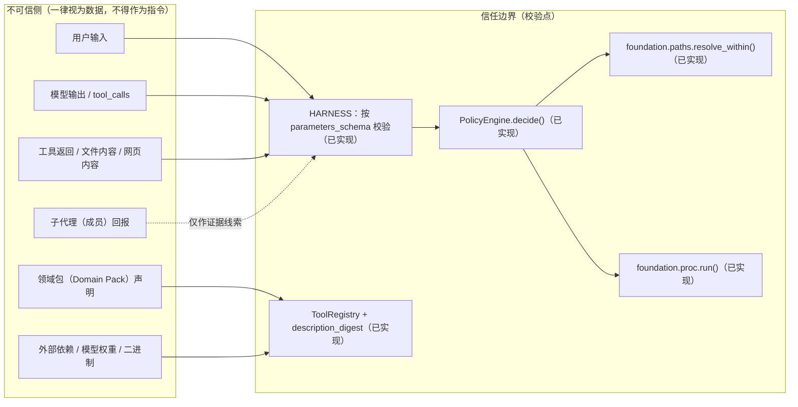

# 威胁模型（Threat Model）

> **状态**：2026-09-18（初稿同日修订）；**2026-09-19 状态更新**（依据 `S1`/`S3` 用例入库）；
> **2026-09-20 状态更新（所有者裁决 `P-2` 与 `Q-3`，见 §8.2）**。
> **13 条威胁条目**——**已缓解并验证 1 条 / 部分缓解 10 条 / 未缓解 2 条**
> （`T-03` 于 2026-09-20 由「未缓解」升「部分缓解」，见 §4.1）；
> **首条「已缓解并验证」= `T-02`（2026-09-20 所有者裁决）**，⚠️ 它是**单条目、单调用面**的结论
> （只覆盖**会话内工具层**的"拒绝 + 且留审计"；配置期 / 装配期调用点按 `Q-1` 属**范围外**）
> ⇒ **不得**读成"安全已到位"：**未缓解仍是 `T-04`/`T-10`**（`T-03` 的三条攻击路径缺口**照旧**）；
> **缺行为层验证 6 条**（**口径已写死于 §5**，并说明历次数字的差异来源；
> 已有行为级用例者：`T-01`/`T-02`/`T-03`/`T-08`/`T-09`/`T-11`/`T-12`——⚠️ **`T-02` 的升级不改变本计数**，
> 理由见 §5 的计数沿革；**★ 旧值 8 的完整沿革保留在 §5 的 2026-09-20 复核段**）；
> `T-01`/`T-02`/`T-06` 另有**结构性**机器检查。
>
> **2026-09-18 复核（`ADR-0016` 联动更新）**：`T-04`/`T-07`/`T-08`/`T-09`/`T-11` 各新增
> **使用面 / 流程级缓解 / 交叉引用**，资产侧增列 `A-11`（平台写权限，含令牌与 CLI）——
> **无条目升降级、无新增编号** ⇒ 计数**当时**复算后不变（逐条依据见 §7）。
>
> **2026-09-19 更新（领导裁决落地，§8 登记）**：`T-11`/`T-12` 由「**未缓解**」升为「**部分缓解**」
> ——依据是三组**已入库**的行为级用例（`test_harness_s1_authorization.py`、
> `test_s1_replayable_audit_link.py`、`test_harness_s3_domain_pack.py`，均 **2026-09-19** 入库）。
> ⇒ 状态分布 **0 / 8 / 5 → 0 / 10 / 3**，§5 缺行为层验证 **10 → 8**。
> ⚠️ **「已缓解并验证」仍为 0**：两条例目升级只到「部分缓解」，各自缺口**已逐条写入条目正文**
> （`T-11` 三条、`T-12` 一条），**不得**因"有行为级用例了"顺手升为 1。
> **【2026-09-20 追加，仅增不改】**上一句是 **2026-09-19 当时**的记载，**保留不改**；
> 2026-09-20 所有者裁决 `P-2`（**升级**）后该值**已变为 1**（`T-02`）——升级依据、
> 三条残余风险与"证明了什么 / 不证明什么"见 §4.1 末段、§8.2 的 `P-2` 与
> [`execution-and-isolation.md`](execution-and-isolation.md#t-02-路径穿越) 的 `T-02` 条目。
>
> **这不是"仓库跑绿了"的结论，而是当前安全覆盖的真实盘点。** 请按这个口径阅读：
> 本目录的作用是**把"还没做的事"写明**，而不是证明"安全已经做到位"。

---

## 0. 先读这一段：三条结论

1. **安全设计是齐的；实现载体已部分到位，但多数缓解仍无可执行的行为级验证。** 需求
   （SRS `REQ-SEC-01~09`）、契约（[`../interfaces/`](../interfaces/README.md)）、
   决策（ADR-0006/0007/0015）都已落定；`security/{capabilities,policy}`、`observability/audit`、
   `tools/{registry,files,shell}`、`harness/`（**9 件**）**均已实现**
   （`f7f7628` / `e78c221` / `f90e051` / `43a177c` 等），但 `security/sandbox/`、
   `security/refusal.py`、`model/{router,probe,assets}.py`、`tools/search.py` 仍**未开工**。
   ⇒ 13 条里 **2 条未缓解**（`T-04`/`T-10`；**计数与 §4.1 一致**，
   依据见 §7 的 2026-09-20 条与 §4.1 末段的适用澄清——`T-03` 于 2026-09-20 升「部分缓解」）；
   未缓解项的成因仍是"缓解无实现载体**或**无可执行验证"，不是"忘了做"。

2. **真正生效的安全机制有两类：结构性机器检查 + 第一组行为层用例。**
   - **结构性**：`tests/unit/test_bench_encapsulation.py`（唯一子进程入口、无 `shell=True`、
     豁免标记集合恰等于预期）与 `tests/unit/test_architecture_layers.py`（分层依赖方向 R1~R5）
     **确实在拦**，且用**变异探针**证明过"不是恒过"。
     ——它们证明"代码长成约定要求的样子"，**不证明"攻击被挡住了"**。
   - **行为层（2026-09-18 新增，`f436b0b`）**：`tests/security/` 的 **13 个 `@pytest.mark.security` 用例**
     ——覆盖 `T-02` 的"拒绝"半（`..` / 绝对路径 / 软链接指向白名单外 / 深层穿越 / 边界正确性 / 变异验证）
     与"唯一路径校验入口"接缝（源码中 `raise PathNotAllowedError` 只应出现在 `foundation/paths.py`）。
     这是本项目**首次**把一条安全断言从"纸面"变成"可执行、可回归"的证据
     （当时 `make test-security` → **13 passed / 85 deselected**；
     **2026-09-18 现状：26 passed**，增量含前缀欺骗用例，见 §7）。

3. **`S1`~`S3` 的落地状态（2026-09-19 更新，取代此前"仅 1 条半"的表述）**：
   ADR-0015 §7.2 的三条里，**`S1` 与 `S3` 已落地**，**`S2` 的"拒绝"半已落地**：
   - `S1`（**T-11**）：`tests/security/test_harness_s1_authorization.py`（**5 例**，跑**真实**
     `Session.run`，含变异 / 对照组）＋ `test_s1_replayable_audit_link.py`（**真实**
     `JsonlAuditSink` + `ReadFileTool` 端到端 `query_by_id`，含 **2 条**变异探针）；
   - `S3`（**T-12**）：`tests/security/test_harness_s3_domain_pack.py`（**4 例**，含变异探针）；
   - `S2`（**T-02**）：**"拒绝"半**已落地（`f436b0b`，**18 例** + 2 接缝用例）。
   **【2026-09-19 更正】**原写「仍未落地的是 `S2` 的"且留审计"半——其判据
   （"拒绝时留下审计记录"）**当前无载体**」——**该表述有误**：**承载点存在**
   （`tools/files.py::_fail` → `tools/registry.py::audit_tool_call` → `JsonlAuditSink.emit`），
   且**工具层**路径穿越被拒的审计留痕已有**两处行为层证据**
   （`test_s1_replayable_audit_link.py::test_denied_tool_call_is_audited_and_replayable`、
   `test_t02_path_traversal_audit.py`，后者含变异探针）。**另一件事**：
   `resolve_within` 的**非工具层**调用点（配置期 / 装配期）拒绝时**不进审计**——
   **该调用面已由 `Q-1`（2026-09-20 所有者裁决）定为「范围外」**（fail-closed、无审计，
   理由见 §8.2 与 [`../interfaces/audit.md`](../interfaces/audit.md) §2.6）；
   `T-02` 据此升「已缓解并验证」（§8.2 的 `P-2`）。
   **防误引（保留并精化）**：`test_audit_landing_whitelist.py` **仍不**构成该半的证据
   （它断言的是**审计落点目录白名单**，属另一攻击面）——**但该半的证据在别处**（见上行两处用例），
   **不得**因"这份文件不是证据"误读为"该半无证据"（本轮错误的形状正是如此）。
   详见 §4/§5 的 `T-02` 行、[`execution-and-isolation.md`](execution-and-isolation.md#t-02-路径穿越)
   的 T-02 条目、§7 的假声明事故登记与 §8.2 的 `P-2`。
   `tests/security/` 目录已建立；其中 `corpus/` 当前**只有路径穿越语料**（`traversal_payloads.txt`），
   **无注入语料**。

> 一句话：**当前是一份"待办清单式的威胁模型"，不是"验收通过的威胁模型"。**

---

## 1. 怎么用这份文档

| 读者 | 怎么读 |
| --- | --- |
| **项目所有者** | 读 §4（条目总览）→ §5（缺验证清单）→ §6（未缓解项清单）。§6 就是需要拍板的待办。 |
| **实现工程师** | 写 `security/` / `tools/` / `harness/` 前，读对应条目（如写沙箱读 `T-01`/`T-13`，写工具读 `T-11`/`T-02`）；**条目里的"现有缓解"写明了必须调用的函数与文件行号**。 |
| **验证工程师** | 直接读 §5 与各条目的「验证方式」栏：那是**可执行的**用例规格；写完用例回来把 `T-XX` 的状态与「对应用例」栏更新。 |

**维护规则（硬性）**：

1. **编号只增不复用、不重排。** `T-XX` 一旦分配即永久绑定该威胁；威胁消失时把状态改为
   「已消解（不再适用）」并写明依据，**不删条目、不改号**（与 ADR 只增不改同源：
   编号被引用的地方比条目本身多）。
2. **状态变更必须有验证证据。** 从「未缓解」升到「已缓解并验证」的唯一途径是
   **出现可执行的用例/机器检查**；没有用例的缓解**一律**记为未缓解（`SECURITY.md` §4 的口径：
   "没有验证方式即视为设计未闭环"）。
3. **新增缓解必须同时写验证方式**；若暂时写不出，就诚实写「缺验证」并进 §5。
4. **本目录只登记威胁、缓解、残余风险、验证**。**决策**在 ADR（分层、选型、档位），
   **字段级契约**在 `docs/design/interfaces/`，**需求**在 SRS。不要在本文重复论证。

**行号口径**：本文引用的代码行号是 **2026-09-18 的快照**，**身份以符号为准**
（与 `ADR-0014 §2.9.1` 同一口径）——行号会随注释增删漂移，`import subprocess`、`run()`、
`spawn()` 这类**符号名不会**。

---

## 2. 方法与范围

**方法**：以 **STRIDE** 为基线（每条标注主导类别），对每个信任边界逐条分析；
再按 [`design/README.md`](../README.md) 要求，把**智能体特有问题**单列：
提示注入（直接/间接）、指令与数据混淆、工具滥用与越权调用、上下文污染与记忆投毒、
供应链投毒、沙箱逃逸与资源耗尽。标注「智能体特有」的条目即来自该清单。

**覆盖范围**（本轮）：可执行路径 + 工程流程 + 供应链，共 13 条。
具体地——`foundation/`（已实现）、`bench/` 数据流水线（已实现）、
`security/`（`capabilities` / `policy` 已实现；`sandbox/` / `refusal` 未开工）、
`tools/`（`registry` / `files` / `shell` 已实现；`search` 未开工）、
`observability/audit`（已实现）、`harness/`（**9 件已实现**）、
`model/`（本地 `client` 已实现；`router` / `probe` / `assets` 未开工）、
协作流程（共享 git 索引、子代理输出）。

**明确未覆盖**（诚实标注，避免"看起来覆盖了"）：

| 未覆盖项 | 为什么 | 何时补 |
| --- | --- | --- |
| Web / UI 前端 | 本期无 Web 界面（SRS `Won't`） | 不适用 |
| 多用户 / 租户隔离 | 单人本地 CLI（SRS `Won't`：无账号体系） | 不适用 |
| 云端 provider 侧的安全 | 不在本项目控制范围 | 不做 |
| 模型权重投毒（训练侧后门） | 权重来自公开预置，**无训练环节**（SRS `Won't`） | 仅做来源+摘要校验（`T-09`） |
| 侧信道（时序/缓存） | 本期无多租户共享场景 | 目标设备阶段重评 |
| aarch64 / Termux 目标设备 | **未实测环境**，多数结论标【待验证】 | 目标设备阶段（`docs/engineering/test-environments.md`） |
| `CapabilityTier` 相关策略差异 | 成员定义仍为【待定】（`SRS Q-3`，`interfaces/README.md` U1） | 档位定案后 |

> 上表是**范围声明**，不是"已知缺口清单"——已知缺口在 §5/§6。

---

## 3. 资产与信任边界

**完整清单见 [`assets.md`](assets.md)**。此处只摘最关键的三个：

- **A-3 执行环境与宿主**：不可信代码在我们自己的进程旁边执行。这是本项目**风险最高**的资产。
- **A-5 凭据**（`CNB_TOKEN`）：CI 运行期短时令牌、限本仓库；`ADR-0014 §2.8` 已登记其残余风险（`T-08`）。
  与之配套的 **`A-11` 平台写权限**（令牌**与其执行者 `cnb-cli`**）见 [`assets.md`](assets.md) §1——
  `A-5` 怕的是**泄露**，`A-11` 怕的是**被使用**（且使用范围可能超出授权）。
- **A-7 安全断言本身**：见 `T-13`——"隔离已生效"这个**结论**也是资产：
  它一旦是假的，整套安全设计就建立在幻觉上（`ADR-0006 §4.1` 的 firejail fail-open 实例）。

**信任边界（B-1~B-8）摘要**——每条边界都对应至少一条威胁：

---

## 4. 条目总览

| 编号 | 威胁 | 主导类别 | 状态 | 对应用例（2026-09-18 现状） |
| --- | --- | --- | --- | --- |
| [`T-01`](execution-and-isolation.md#t-01-子进程执行与逃逸) | 子进程执行与逃逸 | STRIDE-E / 智能体特有 | 部分缓解 | **部分**：`test_rlimit_isolation.py`（超限分配，行为 + 变异探针，`5fddcfa`）；越界写 / 出站 / `IsolationError` 不回退仍**无** |
| [`T-02`](execution-and-isolation.md#t-02-路径穿越) | 路径穿越（`..` / 符号链接 / 白名单逃逸） | STRIDE-E | **已缓解并验证**（2026-09-20 由「部分缓解」升；所有者裁决 `P-2`） | **证据（两半均已落地）**：`S2` **拒绝**半（`f436b0b`，**18 个行为用例**〔含 4 种前缀欺骗 + 3 个边界正确性〕+ 2 个接缝用例）；**审计**半**【2026-09-19 更正：载体已实现 + 已有两处行为层证据】**——载体：`tools/files.py::_fail` → `tools/registry.py::audit_tool_call` → `JsonlAuditSink.emit`；证据：`test_s1_replayable_audit_link.py::test_denied_tool_call_is_audited_and_replayable`（真实 sink 端到端 `query_by_id`）＋ `test_t02_path_traversal_audit.py`（`4a35c61`，含变异探针）；⚠️ **原"审计半无载体"表述有误**（见 `P-2` 与 §7 的假声明事故登记）；**非工具层调用点已定案**：`resolve_within` 的**非工具层**调用点（配置期 / 装配期）按 `Q-1`（2026-09-20 所有者裁决）为「**范围外**」（fail-closed、无审计，见 [`../interfaces/audit.md`](../interfaces/audit.md) §2.6）；**UNC** 作为**登记缺口保留**（跨平台未验，见条目残余风险 4）；**防误引登记（保留并精化）**：`tests/security/test_audit_landing_whitelist.py` **仍不构成**该半的证据（它断言的是**审计落点目录白名单**——不可信 `.lowspec.toml` 的 `[audit] directory` 不得指向任意路径追加写，属**另一攻击面**）——**但该半的证据在别处**（见上行两处用例），**不得**因"这份文件不是证据"误读为"该半无证据"；`test_path_traversal_rejected.py`（`S2` 主体 18 例）的**旧 docstring** 曾写「拒绝被正确审计记录」一半**无法验证**，**那是假声明**，已由 `b79f383` 修正（详见 §7）；**配置面落点白名单（`ALLOWED_AUDIT_ROOTS`，`../interfaces/audit.md` §2.5）**：实现已落地（`foundation/config.py` + `observability/audit.py`），`W1`/`W2`/`W4`~`W8` **用例已落地**（`tests/security/test_audit_landing_whitelist.py`，`91ea9d5`）；**`W3`（根内符号链接指向根外）本轮已补**（`9b37e99`）⇒ **`W1`~`W8` 全部落地**；**UNC（第 5 类）仍缺显式用例但已判不构成独立绕过面**（Linux 下 `//` 折叠） ⚠️ 该文件是**攻击面 6（配置面落点）**的证据，**不是**"且留审计"半的证据 |
| [`T-03`](untrusted-input-and-agentic.md#t-03-不可信输入被当作指令指令-数据混淆) | 不可信输入被当作指令（指令-数据混淆） | STRIDE-T / 智能体特有 | **部分缓解**（2026-09-20 由「未缓解」升；所有者裁决 `Q-3`） | **部分**：`S-new-6`（`test_harness_snew.py`，`@pytest.mark.security`，3 例 + 变异探针）覆盖"领域包片段 → SYSTEM"这一落点；**核心攻击路径 (a)(b)(c) 与注入语料集仍缺**——见条目与 §5〕 |
| [`T-04`](untrusted-input-and-agentic.md#t-04-提示注入直接--间接与上下文污染) | 提示注入（直接 / 间接）与上下文污染 | STRIDE-T / 智能体特有 | **未缓解**（2026-09-20 复核后**维持**：现有多为**降低暴露面**、**决定性缓解机制未建立**，判据见 §4.1 末段适用澄清） | **无**（**注入**语料集仍不存在；`corpus/` 目录现有但只有路径穿越语料）；**输出侧防护为 0**、**持久化变体（检查点完整性）无设计**；**新增**：经 Skill `description` 的**常驻**注入面已登记（`ADR-0016`），其验证**不可由 CI 断言** |
| [`T-05`](untrusted-input-and-agentic.md#t-05-子代理输出是不可信输入) | 子代理输出是不可信输入 | STRIDE-S / 智能体特有 | 部分缓解 | **无** |
| [`T-06`](supply-chain-and-process.md#t-06-安全豁免被静默放宽) | 安全豁免被静默放宽 | 流程完整性 | 部分缓解 | **有**：`test_bench_encapsulation.py::test_exemption_markers_declare_exactly_the_expected_rules`（结构性，非行为） |
| [`T-07`](supply-chain-and-process.md#t-07-共享-git-索引导致跨域混入) | 共享 git 索引导致跨域混入 | 流程完整性 | 部分缓解 | **无**（仅人工纪律）；**新增交叉引用**：A 类事后报告须与 `git log A..B` 区间一致（同源判据） |
| [`T-08`](supply-chain-and-process.md#t-08-基准数据分支的凭据暴露cnb_token) | 基准数据分支的凭据暴露（`CNB_TOKEN`） | STRIDE-I | 部分缓解 | **有**：行为 canary + 静态守卫（`5fddcfa`+`8e047e6`）；**`run(isolation="root")` 继承路径仍无**；**新增**：CLI 作为令牌消费者（**预登记**，无检查；`cnb` 当前不存在） |
| [`T-09`](supply-chain-and-process.md#t-09-供应链投毒依赖--权重--二进制--工具描述) | 供应链投毒（依赖 / 权重 / 二进制 / 工具描述） | STRIDE-T / 智能体特有 | 部分缓解 | **无**〔**2026-09-20 更正**：`description_digest` 实现（`tools/registry.py`）+ 4 条 fail-secure 单测（`test_tools_registry.py`）已存在；**无防护对象**（`MCP` 未接入），见条目与 §5〕；**新增**：`cnb-cli` 包与官方 `cnb-skill` **文本**（同时是依赖与指令来源）——缓解为**预登记、无载体** |
| [`T-10`](execution-and-isolation.md#t-10-网络出站默认拒绝失效) | 网络出站默认拒绝失效 | STRIDE-I | **未缓解** | **无** |
| [`T-11`](untrusted-input-and-agentic.md#t-11-越权工具调用与工具滥用) | 越权工具调用与工具滥用 | STRIDE-E / 智能体特有 | 部分缓解（2026-09-19 由「未缓解」升） | **部分**：`S1` **已落地**（`test_harness_s1_authorization.py` 5 例〔真实 `Session.run`，含变异 / 对照组〕+ `test_s1_replayable_audit_link.py` 真实 sink 端到端 + 2 变异探针）；**缺口见条目**：① `S1` 注入 `FakePolicyEngine`（harness 路径未端到端跑真实引擎）② 「**工具滥用**」半零行为层证据（`test_g8_tool_defense.py` 属 `T-02`/`T-01` 落点，**不是同一落点**）③ 能力层 deny 的真实 sink 端到端**未断言**（仅 `RecordingSink` 假件）；**流程级**：平台特权工具使用面 + A 类事后报告（**人工核对、非自动**） |
| [`T-12`](untrusted-input-and-agentic.md#t-12-领域包加载代码动态导入不可信模块) | 领域包加载代码（动态导入不可信模块） | STRIDE-E | 部分缓解（2026-09-19 由「未缓解」升） | **部分**：`S3` **已落地**（`test_harness_s3_domain_pack.py` 4 例 + 变异探针：`.py`/`.pyc`/`__pycache__` 同拒、副作用不发生、不入 `sys.modules`）；静态守卫 `test_no_dynamic_code_in_src.py`（`5fddcfa`）；**缺口**：`.pth` 导入期执行、`.so`/ctypes 等动态加载向量**未显式断言**，且 `S3` 仅覆盖「领域包」这一载体 |
| [`T-13`](execution-and-isolation.md#t-13-隔离机制静默失效--静默降级fail-open) | 隔离机制静默失效 / 静默降级（fail-open） | 安全断言完整性 | 部分缓解 | **无**（探针矩阵未成测试） |

### 4.1 状态分布

| 状态 | 条数 | 条目 |
| --- | --- | --- |
| 已缓解并验证 | **1** | **T-02**（2026-09-20 由「部分缓解」升，所有者裁决 `P-2`——**本项目首条**） |
| 部分缓解 | **10** | T-01、**T-03**、T-05、T-06、T-07、T-08、T-09、**T-11**、**T-12**、T-13 |
| 未缓解 | **2** | T-04、T-10 |
| **合计** | **13** | |

> **2026-09-18 复核（`ADR-0016` 联动）**：`T-04`/`T-07`/`T-08`/`T-09`/`T-11` 增列的是
> **使用面 / 流程级缓解 / 交叉引用**，**未新增可执行的行为级证据** ⇒ 分布**当时**复算后不变。
> **禁止**因"A 类事后报告已写进规则"把任何条目升为"已缓解并验证"——
> `ADR-0016` §5.1 已明确该规则**不可由 CI 强制**，按本文 §4.1 的定义只能记为**覆盖面不全**。

> **2026-09-19 复核（领导裁决落地 ⇒ 分布 0 / 8 / 5 → 0 / 10 / 3）**：
> `T-11`/`T-12` 各由「未缓解」升为「**部分缓解**」，依据是**已入库的行为级用例**
> （§1 规则 2 的唯一升级途径）：
> - `T-11` ← `tests/security/test_harness_s1_authorization.py`（5 例，真实 `Session.run`，
>   含变异 / 对照组）+ `test_s1_replayable_audit_link.py`（真实 `JsonlAuditSink` 端到端
>   `query_by_id` + 2 条变异探针）；
> - `T-12` ← `tests/security/test_harness_s3_domain_pack.py`（4 例 + 变异探针）。
>
> ⚠️ **两点不得越界**：① **"已缓解并验证"仍为 0**（两条例目的缺口见各自条目，**不得**因
> "有行为级用例了"顺手升为 1）；② 这两条**只**按用例所及范围升级，**未涉及的缺口不因升级而消失**。
> **历史上移的条目一律保留其原有记载**——本节只**追加**本轮依据，不覆写上一轮的口径。

> **为何"已缓解并验证"仍是 0（2026-09-19 重述）**：本轮上移的 `T-11`/`T-12` 都**只到「部分缓解」**，
> 理由是**覆盖面不全**——`T-11` 有三处缺口（harness 路径未端到端跑真实策略引擎；「**工具滥用**」半
> **零行为层证据**；能力层 deny 的真实 sink 端到端**未断言**），`T-12` 的 `S3` **仅覆盖「领域包」
> 这一载体**（`.pth` / `.so` / ctypes 等向量未断言）。
> 按本表定义（缓解已实现**且**有可执行证据证明其**生效**），二者都**不够**升为「已缓解并验证」。
> 同理 `T-02` ——⚠️ **【2026-09-19 更正】**本段原写「其'**且留审计**'半仍**无载体**」，
> **有误**：该半**已有承载点与两处行为层证据**（见 §7 的更正登记）。
> **"不允许因一半被验证就整体升级"这条原则不变**（`T-02` **仍未**升为「已缓解并验证」），
> 但**当前不升级的理由已换**为 §8.2 的提案 **`P-2`** 所列的剩余缺口 (a)~(c)，
> **不再**是"审计半无载体"。
>
> **【2026-09-20 追加，仅增不改】**上面两段是 **2026-09-19 当时**的记载（`T-02` 当时"仍未升级"、
> 升级理由列 (a)~(c)），**保留不改**；`T-02` 的实际状态已随 2026-09-20 的裁决变更（见下段）。
>
> **2026-09-20 复核（所有者裁决 `P-2` ⇒ 分布 `0 / 10 / 3 → 1 / 9 / 3`；本项目首条「已缓解并验证」）**：
> `T-02` 由「部分缓解」升为「**已缓解并验证**」，依据是**已入库的行为级用例**
> （§1 规则 2 的**唯一**升级途径；证据映射原文见 §8.2 的 `P-2`）：
> ① 「**拒绝**」半 —— `test_path_traversal_rejected.py`（**18 例**）+
> `test_path_validation_seam.py`（2 接缝例），含**变异验证**（判据换成字符串前缀式 ⇒
> 4 个前缀欺骗用例**全部翻红**）；② 「**且留审计**」半 ——
> `test_s1_replayable_audit_link.py::test_denied_tool_call_is_audited_and_replayable` 与
> `test_t02_path_traversal_audit.py`（**两处真实 `JsonlAuditSink` 端到端 + 变异探针**）。
> 剩余缺口 (a)~(c) **均判不阻塞**：(a) 攻击面 6 的 `W1`~`W8` 全部落地、UNC 已判**不构成独立绕过面**；
> (b) 配置期 / 装配期按 **`Q-1` 为范围外**；(c) 审计 `outcome` 已由 **`Q-2`** 裁决**维持现口径**。
> ⚠️ **它证明了什么 / 不证明什么**（必须连读，防"1"被读成"安全已到位"）：**证明**的是
> "**会话内工具层的路径穿越被拒、且该拒绝留痕可回放**"这一条缓解**有可执行、可回归、带变异探针的证据**；
> **不证明**整体安全——**未缓解当时仍是 3 条**（`T-03`/`T-04`/`T-10`；⚠️ 该句为 **`P-2` 当时**的记载，
> **保留不改**；`T-03` 随后由 `Q-3` 升「部分缓解」、未缓解降为 2 条，见下段）、**9 条部分缓解**的缺口各照旧，
> 且 `T-02` **自身仍带三条残余风险**（UNC / 盘符跨平台未验、"别处自建路径判定"未覆盖、
> 配置期 / 装配期调用点不进审计），逐条见其条目正文。
>
> **2026-09-20 复核（所有者裁决 `Q-3` ⇒ 分布 `1 / 9 / 3 → 1 / 10 / 2`）**：
> `T-03` 由「未缓解」升为「**部分缓解**」（**唯一**变动项；**「已缓解并验证」保持 1**，
> **不得**顺势升）。
> **依据三条**：① `T-03` 标「未缓解」的**唯一依据**（残余风险 1「承载点不存在 / `harness/` 尚未建立」）
> **已被推翻**（`harness/` 已落地，指令-数据分离**已有实现载体**：`harness/prompts.py::build_system_message`
> 不接受外部内容、`harness/context/__init__.py::assemble` 的结构性角色守卫、`harness/loop.py` 唯一解析点）；
> ② 该条**已有实现载体**，且按 §4.1 定义「部分缓解」= "缓解**已实现或在跑**，但**覆盖面不全**"——
> 正落在「覆盖面不全」这一格；③ 其缓解**已有行为级用例**：`tests/security/test_harness_snew.py` 的
> **`S-new-6`**（**3 例 + 1 条变异探针**，含 `monkeypatch` 变异探针证明非恒过）。
> **缺口不因升级而闭合**（逐条保留）：三条攻击路径 (a) 观察文本（`TOOL` 角色）改变工具选择 / 控制流、
> (b) `arguments` 字符串拼接进命令 / 路径 / 正则、(c) 工具内二次 `json.loads`，**均无专例**；
> **注入语料集仍不存在**；`S-new-6` 只覆盖**一个落点**（领域包片段 → SYSTEM）。逐条见
> [`untrusted-input-and-agentic.md`](untrusted-input-and-agentic.md#t-03-不可信输入被当作指令指令-数据混淆) 的 `T-03` 条目。
> **本条只动 `T-03` 一格**：`T-04`/`T-10` **维持「未缓解」**（理由见下方适用澄清），
> **其它 `T-XX` 状态一律未动**。
>
> **【裁决后状态，2026-09-20 · 所有者】§4.1 的「未缓解」判据适用澄清（**澄清，非改定义**）**：
> 上面「状态定义」表的三档定义**原文保留不动**；本段仅追加**适用解释**，并说明**为什么它不降低判据强度**。
> - **「未缓解」= 该条的「决定性缓解机制」尚未建立（≠ 该条完全没有载体）。**
> - **什么算「决定性」** = 能**阻断**该条攻击路径的机制；**仅"降低暴露面"不算**（降面只是让攻击更费力，
>   不改变"攻击路径仍然畅通"这一事实）。
> - **为什么它不降低判据强度**：若不这样澄清，"**有任意载体即算部分缓解**"会把「未缓解」**稀释**
>   到 1 条甚至 0 条——那正是 §4.1 要防的"档位变成万能挡箭牌"。本澄清**只**回答"该记在「未缓解」
>   还是「部分缓解」"这一格；它**不**放宽"升级须有证据"（§1 规则 2），也**不**允许把"有载体"
>   当成"已验证生效"。
> - **按此判据逐条解释为何 `T-04`/`T-10` 仍维持「未缓解」**：
>   - **`T-04`**：现有缓解**多为「降低暴露面」**（工具裁剪 `harness/trimming.py`、上下文压缩
>     `harness/context/`）——它们让攻击**更费力**，但**不阻断**注入攻击路径；而**输出侧防护为 0**
>     （`ADR-0015 §5.2.6` 只解除了选型阻塞、选型未开始）、**持久化变体（检查点完整性）无设计**
>     ⇒ **决定性机制未建立** ⇒ 维持「未缓解」。
>   - **`T-10`**：`ExecutionContext.network_allowed=False` 只是一个**标志位**
>     （`harness/loop.py:613` **硬编码**），**实际拦截出站的机制不存在**——出站白名单与云端客户端
>     **均未实现**（`../interfaces/harness.md` §5 表内明写"`network_allowed` 本轮恒为 `False`"）。
>     标志位**不阻断**任何出站请求 ⇒ **决定性机制未建立** ⇒ 维持「未缓解」。

**状态定义**（本文全篇统一，避免"部分缓解"变成万能挡箭牌）：

| 状态 | 含义 |
| --- | --- |
| **已缓解并验证** | 缓解已实现，且有**可执行的自动化证据**（用例或机器检查）证明其生效 |
| **部分缓解** | 缓解**已实现或在跑**，但**覆盖面不全**，或缓解本身是**流程纪律**而非机制（机制才会每次都生效） |
| **未缓解** | 缓解只存在于设计 / 契约 / 计划中，**无实现载体**；或实现载体尚未建立 |

> 注意「部分缓解」的两种成因不同：**覆盖面不全**（如 `T-06` 的机器检查只扫 `src/`）
> 与**靠人执行**（如 `T-07` 的 `-o` 纪律）。后者不会自动生效，**不能当作机制**。

---

## 5. 缺验证清单（哪些威胁尚无对应用例）

> 判断口径来自 `SECURITY.md` §4：「缓解措施的验证方式必须是**可执行的**测试
> （安全测试用例或对抗性输入集），否则视为设计未闭环」。

**口径（写死，本文统一）**：**"缺行为层验证" = 该条目当前的验证方式中，尚无可通过
`make check` / `make test-security` 执行的"行为级（对抗性）用例"**；**结构性机器检查不计入**
——它证明"代码长成约定要求的样子"，**不证明"攻击被挡住"**。

**按此定义计数：13 条中 6 条缺行为层验证。**（**2026-09-20 重算**：由 8 降为 6——
`T-03`/`T-09` 移出，依据见本节的 2026-09-20 复核段；**旧值 8 保留**于下方计数沿革）
**已有行为级用例的 7 条**：`T-02`（`S2` **拒绝**半 `f436b0b`；**工具层审计**半
`4a35c61`／`05cb0af`，2026-09-19）、`T-01`（超限分配行为断言 + 变异探针，
`5fddcfa`）、`T-08`（凭据 canary，`5fddcfa`+`8e047e6`）、**`T-11`**（`S1` + 可回放链路，2026-09-19）、
**`T-12`**（`S3`，2026-09-19）、**`T-03`**（`S-new-6`，2026-09-20）、
**`T-09`**（`description_digest` fail-secure 单测，2026-09-20）。
**计数沿革（同一定义，避免"数字变了却不知为何"）**：`f436b0b` 前 = **13**；`f436b0b` 后 = **12**
（`T-02` 移出）；`5fddcfa`/`8e047e6` 后 = **10**（`T-01`、`T-08` 移出）；
**2026-09-19 = 8**（`T-11`、`T-12` 移出，依据 `S1`/`S3` 用例入库；见 §4.1 的 2026-09-19 复核）。
**初稿写的"12 条"用的不是本定义**（它把 `T-06` 当作"已有机器检查"而未计入，但 `T-01` 同样有
结构性检查）⇒ 本定义把口径固定后，数字**可逐次复算**。
**2026-09-18 复核（`ADR-0016` 联动）：口径与计数不变**——本轮为 `T-04`/`T-07`/`T-08`/`T-09`/`T-11`
新增的"验证方式"**全部不是**行为级自动化用例（两条为**人工核对**、三条为**预登记**）
⇒ **没有任何条目移出本清单**。
**2026-09-19 复核（与 §4.1 同一次裁决，三个数字的同一依据）**：**缺行为层验证 10 → 8**、
§4.1 的**部分缓解 8 → 10**、**未缓解 5 → 3** 三者是**同一件事的两面**——
`T-11`/`T-12` 从"无行为级用例"变成"有行为级用例"，故**同时**移出本清单**并**在 §4.1 上移一格。
⚠️ **本清单的计数只认"有无行为级用例"，不认状态档位**：`T-11`/`T-12` 移出**不代表**
其缺口已闭合（缺口见 §4 表与各自条目），二者仍列在 §6 的"覆盖面不全"一族。
**2026-09-20 复核（`T-02` 升为「已缓解并验证」，所有者裁决 `P-2`）：口径不变、计数也不变（仍 8）**——
**理由**：`T-02` **本来就不在本清单内**（它早在 `f436b0b` 就已移出：计数沿革里 `13 → 12` 那次就是它，
见上"已有行为级用例的 5 条"）⇒ **状态升级不产生新的移出项**。
**不得**为"看起来联动了"而改这个数字：**本清单与 §4.1 是两个不同口径**——
前者只问"**有无**行为级用例"，后者问"缓解**是否已实现且有证据证明生效**"，
`T-02` 的变化只发生在后者。清单如下：

**2026-09-20 复核（`T-03` / `T-09` 移出）：按同一口径重算，计数 8 → 6。**
**依据**（本清单只认"有无可通过 `make check` / `make test-security` 执行的**行为级对抗性用例**"）：
- **`T-03` 移出** ← `tests/security/test_harness_snew.py` 的 **`S-new-6`**（`:452-509`，**3 例 + 1 条变异探针**）：
  标 `@pytest.mark.security`、**被 `make test-security` 收集**；输入是**对抗性的**（`data_context` 试图以
  `SYSTEM` 角色进入 / 合法 `USER` 数据的内容**不得**出现在 SYSTEM 位）；**行为级**（跑真实 `assemble`
  装配路径，且含 `test_snew6_rejection_depends_on_guard` 变异探针证明**非恒过**）⇒ 满足本清单口径。
- **`T-09` 移出** ← `tests/unit/test_tools_registry.py`（`:174-197`）：**`make check` 可执行**；
  输入是**对抗性的**（**被篡改的**工具描述 / 外部来源**缺摘要**）；**行为级**（构造 `ToolRegistry`
  ⇒ 触发 `_verify_digest` ⇒ `ToolRegistrationError`，含 `test_digest_mismatch_blocks_the_whole_registration`
  的 **fail-secure** 断言：拒绝启动、**不**静默剔除被篡改的工具）⇒ 满足本清单口径。
  ⚠️ **该用例标 `@pytest.mark.unit`（非 `@pytest.mark.security`）**——本清单的口径是"**可通过
  `make check` / `make test-security` 执行**"，**并不要求**必须是 security 标记；故它**算**行为级对抗性用例。
⇒ "已有行为级用例的 5 条"据此**变为 7 条**（增列 `T-03`/`T-09`，见上）；两条对应的**表格"现状"栏已同步**。
> ⚠️ **移出 ≠ 覆盖**（**必须连读**，防误读为"这两条已获验证"）：
> - **`T-03` 的核心攻击路径仍无用例**——(a) 观察文本（`TOOL` 角色）改变工具选择 / 控制流、
>   (b) `arguments` 字符串拼接进命令 / 路径 / 正则、(c) 工具内二次 `json.loads`，**三条路径逐条仍缺**；
>   `S-new-6` 只覆盖"领域包片段 → SYSTEM"这**一个**落点；**注入语料集仍不存在**（见下 `T-03`/`T-04` 行）。
> - **`T-09` 的四类载体仍无**——权重 / 二进制摘要、Skill / CLI 的版本·commit·摘要锁定**均无载体**；
>   `description_digest` 的**防护对象为零**（`MCP` 未接入 ⇒ 运行期无任何外部来源工具），
>   且缺 `@pytest.mark.security` 的对抗性**端到端**用例。
> - **本清单的计数只认"有无行为级用例"，不认状态档位**（同下 2026-09-19 段的纪律）：`T-03`/`T-09`
>   移出**不改变**二者在 §4.1 的档位（仍 `未缓解` / `部分缓解`，见 §4.1 与各自条目）。
**计数沿革（追加一行，同一定义）**：`f436b0b` 前 = 13；`f436b0b` 后 = 12（`T-02` 移出）；
`5fddcfa`/`8e047e6` 后 = 10（`T-01`、`T-08` 移出）；**2026-09-19 = 8**（`T-11`、`T-12` 移出）；
**2026-09-20 = 6**（`T-03`、`T-09` 移出）——与 `T-11`/`T-12` 那次**同构**：同是"行为级用例入库
⇒ 移出本清单"，只是**不同批次**。
> **一处历史引用说明**：上文 2026-09-20 的 `T-02` 复核段里引用的"已有行为级用例的 5 条"是该段
> **当时**的标题原文；重算后该处已为 **7 条**（本段更新）。历史段落按"**只增不改**"**保留原文**。

| 编号 | 缺失的验证 | 应落到哪 | 现状 |
| --- | --- | --- | --- |
| T-01 | 逃逸尝试（越界写、越界出站、超限分配）必须被拒绝 | `tests/security/` | **超限分配已落地**（行为 + 变异探针，`5fddcfa`）；**越界写 / 越界出站 / `IsolationError` 不回退**仍缺 |
| T-02 | `../../etc/passwd`、符号链接、绝对路径、UNC 的拒绝行为 | `tests/security/`（**S2**） | **拒绝半已落地**（`f436b0b`，**18 用例**〔含 4 种前缀欺骗 + 3 个边界正确性〕+ 接缝 2 用例）；**"且留审计"半（工具层）已落地**——⚠️ **2026-09-19 更正**：原写"仍缺"，**有误**；证据两处：`test_s1_replayable_audit_link.py::test_denied_tool_call_is_audited_and_replayable`、`test_t02_path_traversal_audit.py`（`4a35c61`，含变异探针）；**已定案**：`resolve_within` 的**非工具层**调用点（配置期 / 装配期）按 `Q-1`（2026-09-20 所有者裁决）为「**范围外**」（fail-closed、无审计，见 `../interfaces/audit.md` §2.6）；**UNC（第 5 类）仍为登记缺口**（缺显式用例，已判不构成独立绕过面，Linux `//` 折叠）；⚠️ **防误引（保留并精化）**：`test_audit_landing_whitelist.py` **仍不构成**"且留审计"半的证据（它断言**审计落点目录白名单**，属另一攻击面）——**但该半的证据在别处**；`test_path_traversal_rejected.py` 的**旧 docstring** 曾**自述**该半**无法验证**，**那是假声明**，已由 `b79f383` 修正（详见 §7）；**配置面落点**（`.lowspec.toml` 的 `[audit] directory`）的 `W1`~`W8`（根外目录 / `..` 上跳 / 根内符号链接 / 绕过配置 / **拒绝时不创建目录** / **不回退默认** / 变异探针 / 两层各删一层）：**`W1`~`W8` 全部落地**（`W1`/`W2`/`W4`~`W8` 于 `91ea9d5` 含 W7 变异探针与 W8 两层各自独立；**`W3` 于 `9b37e99` 补：配置期 + 装配期 + 变异探针**） |
| T-03 | 注入语料进入上下文后不得改变控制流 / 权限判定 | `tests/security/` + `tests/security/corpus/` | **已落地（2026-09-20）**：`S-new-6`（`test_harness_snew.py:452-509`，3 例 + 变异探针）覆盖"领域包片段 → SYSTEM"这一落点；**仍缺**：三条攻击路径 (a)(b)(c) 的专例 + **注入**语料集（`corpus/` 已建，仅路径穿越语料） |
| T-04 | 同上（直接注入 / 间接注入分列） | `tests/security/corpus/` | **注入**语料集不存在（同上）；**新增**：经 Skill `description` 的**常驻**注入面（`ADR-0016`）已登记，其验证**不可由 CI 断言**（人工抽查 + 构建期钉 commit） |
| T-05 | 成员回报中的注入指令不得影响权限决策 | `tests/security/` | 不存在（去毒是上游行为，不可回归） |
| T-06 | ① 检查覆盖 `tests/` `docs/` `scripts/` `.cnb.yml`；② `E1`~`E3` 纳入自动断言 | `tests/unit/` + `Makefile` | 覆盖范围仅 `src/`；`E1`~`E3` 靠人工跑 |
| T-07 | 提交必须命中本域白名单路径 | `tests/unit/` 或 pre-commit | 只有人工纪律；**新增**：A 类事后报告的区间核对（`git log A..B`）同为人工 |
| T-08 | 子进程环境**不得**出现 `CNB_TOKEN` 等凭据（canary 断言） | `tests/security/` | **已落地**（行为 canary + 静态守卫 + 单测，`5fddcfa`+`8e047e6`）；**`run(isolation="root")` 继承路径仍缺机器检查**；**新增**：CLI 消费令牌这一形态**无用例**（`cnb` 当前不存在） |
| T-09 | 权重 / 二进制摘要校验；工具描述被篡改时拒绝 | `tests/security/` | **⚠️ 2026-09-20 更正：原写"机制未实现"——对"工具描述被篡改时拒绝"这半**不成立**。**已落地**：`description_digest` 实现（`tools/registry.py:137-171`，启动期 fail-secure）+ **4 条** fail-secure 单测（`tests/unit/test_tools_registry.py:174-197`）；**仍缺**：权重 / 二进制摘要校验（`model/assets.py` 未实现）、Skill / CLI 的版本·commit·摘要锁定（构建期 `V2`~`V4`）**亦无载体**；且 `description_digest` 当前**无防护对象**（`MCP` 未接入） |
| T-10 | 未授权出站必须被拒绝并审计 | `tests/security/` | 执行机制未实现 |
| T-11 | 未授权工具调用被拒**且**留下可回放审计 | `tests/security/`（**S1**） | **`S1` 已落地（2026-09-19）**：`test_harness_s1_authorization.py` **5 例**（真实 `Session.run`：deny 时 `Tool.invoke` 未调用、`TOOL_RESULT.result is None`、审计含 `TOOL_CALL/DENY` + `POLICY_DECISION`、`audit_id` 对应 DENY `event_id`；+ 对照组证明非恒过）+ `test_s1_replayable_audit_link.py`（真实 `JsonlAuditSink` + `ReadFileTool` 端到端 `query_by_id`，**2 条**变异探针）；**剩余缺口**：① harness 路径**未端到端跑真实 `PolicyEngine`**（`S1` 注入 `FakePolicyEngine`）② 「**工具滥用**」半**零行为层证据** ③ 能力层 deny 的**真实** sink 端到端**未断言**（`RecordingSink` 是假件）；另：平台特权工具的使用范围只有**人工核对**（A 类事后报告 + `git log A..B` 区间一致，`ADR-0016` §7 `V7`） |
| T-12 | 领域包内 `.py` **永不**被导入 | `tests/security/`（**S3**） | **`S3` 已落地（2026-09-19）**：`test_harness_s3_domain_pack.py` **4 例** + 变异探针——包内 `.py` 带副作用 ⇒ 抛 `DomainPackError`、**副作用标志文件不存在**、模块**不入 `sys.modules`**；`.pyc` / `__pycache__` 同拒；摘掉 `_reject_python_content` 后原拒绝翻红；**剩余缺口**：`.pth` **导入期执行**、`.so` / ctypes 等**动态加载向量未显式断言**，且 `S3` **仅覆盖「领域包」这一载体**；另**静态守卫已落地**（`src/` 无动态执行原语，`5fddcfa`） |
| T-13 | 探针必须包含"必须失败"的用例（区分性探针） | 探针脚本 / `tests/security/` | 未写 |

### 5.1 与 ADR-0015 §7.2 的 `S1`~`S3` 映射现状

| 用例（ADR-0015 §7.2） | 覆盖本文条目 | 当前状态 |
| --- | --- | --- |
| `S1 test_unauthorized_tool_call_is_denied_and_audited` | **T-11**（并部分覆盖 T-03） | **已落地（2026-09-19，`e9e780c`）**：`test_harness_s1_authorization.py`（5 例）+ `test_s1_replayable_audit_link.py`（端到端可回放 + 2 变异探针）；**缺口**：harness 路径未端到端跑**真实** `PolicyEngine`；「工具滥用」半零行为证据；能力层 deny 未经**真实** sink 端到端断言（见 `T-11` 条目） |
| `S2 test_path_traversal_is_rejected_and_audited` | **T-02** | **拒绝半已落地**（2026-09-18，`f436b0b`）：`test_path_traversal_rejected.py`（**18 用例**）+ `test_path_validation_seam.py`（2 用例）；**"且留审计"半（工具层）已落地**——⚠️ **2026-09-19 更正**：原写"未落地 / 没有承载点"，**有误**；**承载点存在**（`tools/files.py::_fail` → `tools/registry.py::audit_tool_call` → `JsonlAuditSink.emit`），证据两处（`test_s1_replayable_audit_link.py::test_denied_tool_call_is_audited_and_replayable`、`test_t02_path_traversal_audit.py`）；**已定案（`Q-1`，2026-09-20 所有者裁决）**：`resolve_within` 的**非工具层**调用点（配置期 / 装配期）为「**范围外**」（fail-closed、无审计；规范见 `../interfaces/audit.md` §2.6）⇒ **会话内**面已闭合，`T-02` 据此升「**已缓解并验证**」（§8.2 的 `P-2`） |
| `S3 test_domain_pack_python_code_is_never_imported` | **T-12** | **已落地（2026-09-19，`9a5689c`）**：`test_harness_s3_domain_pack.py`（4 例 + 变异探针）；**缺口**：`.pth` / `.so` / ctypes 等向量未显式断言，且**仅覆盖「领域包」这一载体**（见 `T-12` 条目） |

> **谁也未落地的，不假称已覆盖。** 2026-09-19 现状：`S1`、`S3` 已落地，`S2` 的**拒绝**半已落地，
> `S2` 的**"且留审计"半（工具层）亦已落地**（⚠️ **2026-09-19 更正**：原写「唯一仍为未落地的是
> 该半、因**无承载点**」——**有误**；承载点与两处行为层证据均已存在）。**仅剩的**
> `resolve_within` 的**非工具层**调用点（配置期 / 装配期）已由 **`Q-1`（2026-09-20 所有者裁决）
> 定为「范围外」**（fail-closed、无审计；规范见 [`../interfaces/audit.md`](../interfaces/audit.md) §2.6）
> ⇒ **`S1`~`S3` 的会话内面全部落地**，`T-02` 据此升「**已缓解并验证**」（§8.2 的 `P-2`）。
> 状态变更的依据**必须是仓库里可执行的用例**：**验证工程师写用例，架构师据其更新状态**
> （与"安全断言不得由实现者自证"同源）。
> **补记（同日，`5fddcfa`）**：另有 **3 条不属于 `S1`~`S3`** 的守卫用例入库——
> `T-01` 的 `RLIMIT_AS` 行为断言（+ 变异探针）、`T-08` 的凭据 canary 与 `spawn` 静态守卫、
> `T-12` 的"`src/` 无动态执行原语"静态守卫。它们**不改变** `S1`~`S3` 的落地状态。

---

## 6. 未缓解项清单（= 需要所有者的待办）

> 这就是本轮的实质产出：**下列 5 项在实现之前，`SECURITY.md` 声称的安全能力不成立。**
>
> **2026-09-18 复核（`ADR-0016` 联动）**：本轮新增的使用面（平台特权工具 / CLI 令牌消费 /
> Skill 文本）**不改变**下表——它们的缓解**均为预登记、无载体**；
> 其中的流程级缓解（A 类事后报告）按 §4.1 口径属"**覆盖面不全**"，**不构成缓解成立**。
>
> **2026-09-19 更新**：下表**仍为 5 项**（"待办项数"），但第 1/3 项的**实现与解除条件已达成**
> （行内已标注）；同时**未缓解条目由 5 条降为 3 条**（`T-03`/`T-04`/`T-10`，见 §4.1）。
> ⚠️ 两个数字**口径不同、勿混用**：**5 = 待办项数**，**3 = 未缓解条目数**。
>
> **2026-09-20 追加（`Q-1` 裁决，仅增不改）**：第 3 项"为 `T-02` 的**非工具层**调用点定下承载点"
> 这半**按 `Q-1` 为范围外**（配置期 / 装配期拒绝 fail-closed、无审计）⇒ 第 3 项**对 `T-02` 不再是缺口**；
> 该项**其余的 `T-11` / `T-13` 侧缺口不变**。**待办项数仍为 5**（口径见上注；本轮未新增 / 未删除待办项）。

| # | 待办 | 阻塞于 | 解除条件 |
| --- | --- | --- | --- |
| 1 | **`security/` 策略引擎 + 能力模型**（`T-11`/`T-03`） | **解除条件已达成**（`f7f7628` 实现 + `e9e780c` `S1` 用例通过）⇒ 架构侧已于 **2026-09-19** 裁决 `T-11` 升为「部分缓解」（见 §4.1）。⚠️ **本项仍保留**，但其**剩余阻塞只剩 `T-03`**（注入语料集，与第 4 项重叠）——`T-11` 的名义范围「**工具滥用**」半亦仍无行为层证据（见条目） | 落地 `PolicyEngine` 实现 + `S1` 用例通过（**已达成**）；`T-03` 需注入语料集（第 4 项） |
| 2 | **`tools/` 的路径与命令执行侧**（`T-02`/`T-01`） | **实现已落地**（`f90e051`）；**`S2` 审计半（工具层）用例已落地**（`4a35c61`／`05cb0af`，2026-09-19）——⚠️ 原写"用例仍缺"，**有误** | 落地 `tools/files.py`、`shell.py` 且全部经 `paths`/`proc` + `S2` **审计半**通过（**拒绝半已于 `f436b0b` 验证**，**审计半已于 2026-09-19 验证**） |
| 3 | **`observability/` 审计落盘**（`T-11`/`T-02`/`T-13` 的"且留审计"一半） | **实现已落地**（`e78c221`）；**`T-11` 与 `T-02`（工具层）侧的行为级用例已落地**（2026-09-19：`test_s1_replayable_audit_link.py` 真实 sink 端到端）；**仍缺**：`T-02` 的**非工具层**调用点（`resolve_within` 直调，配置期 / 装配期——**由谁 emit** 未决，见 §8.2 的 `Q-1`）与 `T-13` 侧——⚠️ 原写"`T-02` 侧无承载点"，**有误** | `AuditSink` 实现 + `flush()` 语义（**已落地**）；剩余：为 `T-02` 的**非工具层**调用点定下承载点并写用例 |
| 4 | **注入语料集 + 输出侧防护**（`T-03`/`T-04`） | `ADR-0015 §5.2.6` 已明确"工具（LLM Guard / garak）要建立在威胁模型之上" | 本目录建成（**本轮已完成**）⇒ 可进入选型 |
| 5 | **`urllib3` 出站超时 / 响应体上限 / 白名单**（`T-10`） | 依赖未写入 `pyproject.toml`（`ADR-0015 §7.4` 未验证完） | `V-m`/`V-o` 核验通过 + 客户端实现 + 用例 |

另有 **3 项属"已缓解但覆盖不全/靠人执行"**，不建议当作机制依赖：

| # | 项 | 缺口 | 建议 |
| --- | --- | --- | --- |
| 6 | 豁免标记的机器检查（`T-06`） | 只扫 `src/`；`E1`~`E3` 靠人工 | 扩展扫描范围 + 把 `E2`/`E3` 计数纳入 `make check` |
| 7 | 提交的 `-o`（`--only`）纪律（`T-07`） | 无机器检查，靠人 | 见 `T-07`「进一步硬化方向」 |
| 8 | `bench` 凭据隔离（`T-08`） | **`spawn()` 路径已闭环**（`8e047e6`：默认最小环境 + 调用点显式传 `env=`，且有行为 canary 与静态守卫）；**`run(isolation="root")` 仍继承且无机器检查**（欠这一项） | 见 `T-08`：给 `isolation="root"` 加机器检查（CI 不得用） |

---

## 7. 变更记录

- **2026-09-18（初稿）**：建立本目录。13 条条目（`T-01`~`T-13`），
  含 §4 状态分布、§5 缺验证清单、§6 未缓解项清单。依据：`SECURITY.md` §4/§6、
  `docs/design/README.md`、`ADR-0006`/`0007`/`0014`/`0015`、
  `docs/devlog/0013-2026-09-18-一致性核查与地基修复.md`（§4 证据链、§7 待办）、
  `src/agent_sec_perf/foundation/{proc,paths,errors}.py`、`tests/unit/` 现有机器检查。
  本轮新增一条**实测证据**（`T-06`）：`# nosec` 后自由文本确实会**静默豁免**其中出现的
  合法规则号——**原结论已复现**；同时实测出 `bandit` **不自动读取** `pyproject.toml` 的
  `[tool.bandit]`（只在 `-c` 时生效），详见 `T-06`「实测证据」。

- **2026-09-18（状态重评·依据 `f436b0b`）**：`tests/security/` 落地并提交入库（`f436b0b`，3 文件 / +185，
  **13 个 `@pytest.mark.security` 用例**）后，按 §1 规则 2 的判定口径**重评受该证据影响的条目**：
  ① **`T-02` 仍为「部分缓解」**——`S2` 的"**拒绝**"半已有可执行行为证据
  （`test_path_traversal_rejected.py` 11 用例 + 接缝 `test_path_validation_seam.py` 2 用例），
  "**且留审计**"半无载体（`AuditSink` 不存在）⇒ **不因一半被验证而整体升级**；
  ② **状态分布不变**（已缓解并验证 **0** / 部分缓解 **8** / 未缓解 **5**），并新增 §4.1「为何仍是 0」段落；
  ③ §5 的**口径写明并重算**：由（不精确的）"12 条"改为按"缺行为层验证"这一明确口径计数
  （本次 `S2` 拒绝半落地后为 **12 条**，此前实为 13 条）；
  ④ §5.1 中 `S1`/`S3` 的"未落地"理由改为"被测实现不存在 ⇒ 验证者拒绝造测"；
  ⑤ 接缝检查（源码中 `raise PathNotAllowedError` 只应出现在 `foundation/paths.py`）登记为
  `T-02` 残余风险 1（"唯一入口只兑现一半"）的**部分**硬化。
  **未完成（登记在案）**：`T-02` **条目正文**（`execution-and-isolation.md`）的对应同步——
  该文件当时存在**他人未提交改动**，按"同一文件不得被两个成员同时写"
  （`CODEBUDDY.md` §10.2 规则 8）顺延，待协调后补记。

- **2026-09-18（接管 + 收尾）**：
  ① **接管在飞改动**：本任务**前一执行者**（被运行时终止、其成员记录已不在当前名单中）留下的
  未提交改动（`T-01` 的"假断言排除"与 `cwd` 未校验实例、`T-08` 的 `spawn` 默认继承凭据实例与
  三层验证方案），由本成员**逐处复跑核实**后接管提交（`8739531`）。原"验证者 2026-09-18 独立核实"
  的署名**无法核实** ⇒ 统一改为中性表述"**2026-09-18 代码级核实**"（**不给无法核实的主体挂名**）。
  复跑核实的 5 项代码事实：`proc.run` 无路径白名单（`proc.py:121-174`）、`proc.py:235` 默认
  `dict(os.environ)`、`bench/runner.py:122` 为**全仓唯一** `spawn` 调用点且未传 `env`、
  `id -u`=0、`Makefile:136` 与 `protocol.py:37/124/138-139` 的回环约束。
  ② **`T-02` 条目正文已同步**：状态 / 现有缓解 / 残余风险 1 / 验证方式四处，
  与 §4、§5、§5.1 对齐（此前因文件被占用而顺延，见上一条）。
  ③ **`T-08` 补"钉住缺陷的用例"**：验证侧正在落 `xfail(strict=True)` canary（合成哨兵、
  **不使用真实凭据**）；**截至本笔提交该用例未入库**（`tests/` 内 `grep xfail` / `__canary__`
  零命中）⇒ 按"结论只认仓库"如实标注，**不据此升级状态**。

- **2026-09-18（归属取证与更正）**：「接管」笔（`8739531`）的**原作者经团队目录取证确认**为
  **`architect-threat-model`**——其成员历史存于
  `.codebuddy/teams/<team-id>/security-foundation/architect-threat-model.json`，内含
  ① 验证者 **`verifier-security`** 发给它的核实结论（T-01「`proc.run` 根本不做路径白名单 ⇒ 那是
  假断言」与「T-08 凭据 canary 可行」——正是那两处孤儿改动的**内容来源**）；
  ② 一条**未被应答的 `shutdown_request`** + 提醒 ⇒ 它**带着未提交文档改动被运行时强制终止**。
  ⇒ 据此更正（**只增不改**，不改写已入库提交）：
  - **署名落到具体主体**：`proc.run` 假断言与 T-08 canary/rlimit 由 **`verifier-security`** 独立核实；
    `spawn()` 默认继承等代码事实亦经**团队领导**逐行核实。此前「接管」笔中因无法核实而写的
    中性表述"2026-09-18 代码级核实"，在本笔据取证补全主体。
  - **逐字替换记录（保住原作者文字的可回溯性）**：`8739531` 相对原稿的改动为——
    「验证者 2026-09-18 独立核实」→「经 2026-09-18 代码级核实」共 **3 处**、
    「验证者独立核实后修正本条目」→「代码级核实后修正本条目」共 **1 处**；
    另**新增** T-08「钉住缺陷的用例（进行中·未入库）」段、T-08 的 `T-09` 交叉引用，
    并把 `bench/evaluate.py` 行号 `151-162` **修正为** `153-160`。除此之外原稿内容未被改动。
  - **方法教训**（已报团队领导）：`send_message` 报 `Recipient not found` **只说明活信箱里没有该成员**，
    **团队目录仍留存其历史** ⇒ **归属可回溯、不必靠猜**；**终止成员前应先对账其工作区**
    （否则其未提交产出既不被对账、也容易误挂到别人名下）。

- **2026-09-18（状态刷新·依据 `5fddcfa` / `8e047e6`）**：四条安全守卫用例入库（`5fddcfa`）与
  `spawn` 默认语义修复落盘（`8e047e6`）之后，按 §1 规则 2 重评**被实际触及**的条目：
  ① **`T-08`**：`spawn` 的凭据继承**已消除**（默认最小环境 + 调用点显式传 `env=`），
  由**行为 canary** + 静态守卫 + 单测三重验证；**但 `run(isolation="root")` 的继承路径
  无缓解、无机器检查** ⇒ **保持「部分缓解」**（本条缓解集合的**覆盖面不全**，按 §4.1 定义不升级）。
  **（⏳ 独立对抗复核进行中**：见 `T-08` 状态栏的限定；复核结论落盘前，本判定基于当前仓库证据。）
  ② **`T-01`**：`RLIMIT_AS` 的**行为断言 + 变异探针**落地 ⇒ **结清**其【待验证】项
  （仅覆盖 `RLIMIT_AS`；CPU / FSIZE / NOFILE 仍未实测）；状态**仍为「部分缓解」**
  （越界写 / 越界出站 / `IsolationError` 不回退仍缺）。
  ③ **`T-12`**：新增"`src/` 无动态执行原语"**静态守卫** ⇒ 但它**不是行为断言**，`S3` 仍未落地，
  状态**仍为「未缓解」**。
  ④ **状态分布不变**（已缓解并验证 **0** / 部分缓解 **8** / 未缓解 **5**）；
  §5「缺行为层验证」按**写死的口径**由 **12 条 → 10 条**（`T-01`/`T-08` 移出）。
  ⑤ 契约侧另有**一笔独立提交**（`6256c28`：`docs/design/interfaces/sandbox.md` §2.5/§3/§5）
  ——定性为"**实现向既有策略收敛**"，**非契约变更**。

- **2026-09-18（`T-02` 验证方式补强 · 前缀欺骗）**：按 `T-02` 正文原先的"**建议补**一条参数化用例
  覆盖第 4 类前缀欺骗（`/tmp/foo` vs `/tmp/foobar`）"落地——
  `tests/security/test_path_traversal_rejected.py` 新增 **7 例**（4 种兄弟目录名前缀欺骗
  ＋ 3 种"位于根内、文件名与根同前缀"的边界正确性），该文件由 11 例增至 **18 例**；
  本次实测 `make test-security` → **26 passed**。
  **变异验证**：把 `resolve_within` 的判据换成**字符串前缀式**
  （`resolved == root_resolved or str(resolved).startswith(str(root_resolved))`）后，
  4 个前缀欺骗用例**全部 `DID NOT RAISE`（失败）**、3 个边界正确性用例**仍通过**
  ⇒ 断言**精准且非恒过**；恢复后 `git diff src/` 为空、26 例复跑全绿。
  用例内另有前置断言"该输入确实能骗过字符串前缀式判断"，防用例退化为恒过。
  **状态不升级**：`T-02` 仍为「部分缓解」——"**且留审计**"半无载体（`AuditSink` 不存在）、
  第 5 类（Windows / UNC / 盘符）仍缺；状态分布不变（已缓解并验证 **0** / 部分缓解 **8** / 未缓解 **5**）。
  **`S1`/`S3` 仍未落地**，理由同前（被测实现不存在 ⇒ 验证者拒绝造测；见 §5.1）。

- **2026-09-18（`ADR-0016` 联动更新 · 使用面与流程级缓解）**：所有者拍板采纳 `ADR-0016` 方案 B
  （CNB 接入 + 远端写入 A~F 分级）后，按该 ADR §5.7 的联动清单落地**威胁模型侧**的改动
  （**未改任何条目编号、未升降任何状态**）：
  ① **新增资产 `A-11`（平台写权限，含令牌与 CLI）**，并在 §4 的资产×威胁对照表加行
  （被 `T-08`/`T-09`/`T-11` 三条指向）；`A-5` 与 `A-11` 的分工写进 `assets.md` §1 注
  （前者怕**泄露**、后者怕**被使用**）。
  ② **`T-08`**：增"**CLI 作为令牌消费者**"这一**使用面**（攻击路径 5 + 残余风险 4 + 验证方式 1 条），
  并写明它与残余项 3（`run(isolation="root")` 仍继承）**并列、不替代**；**残余项 3 不变**。
  ③ **`T-09`**：增"`cnb-cli` 包与官方 `cnb-skill` **文本**"这一来源与投毒路径（前提 ④、攻击路径 4）、
  `ADR-0016` §5.4 的 `L1`+`L2`+`L4` 缓解（**预登记**）与残余 6（五项前置条件全部【待核验】）。
  ④ **`T-04`**：登记"**经 Skill `description` 的间接注入面**"（攻击路径 5 + 缓解 + 残余 5 + 验证 3 条），
  并明确其**来源面**由 `T-09` 登记（**不重复论证**）。
  ⑤ **`T-11`**：把"**A 类事后报告**"登记为一条**流程级缓解**（含"**报告须与 `git log A..B` 一致**"
  的可核对验证方式），并**如实标注它是流程纪律、非机制**（`ADR-0016` §5.1 的已知边界：
  **CI 看不到"是否事先批准 / 是否事后报告"**）。
  ⑥ **`T-07`**：交叉引用"报告须与 `git log A..B` 区间一致"（与"提交路径 ⊆ 声明白名单"**同源、不替代**）。
  **计数复核**：**无条目升降级、无新增编号** ⇒ 状态分布（已缓解并验证 **0** / 部分缓解 **8** / 未缓解 **5**）
  与"缺行为层验证 **10** 条"**复算后均不变**；本轮新增的"验证方式"**全部不是**行为级自动化用例
  （两条为人工核对、三条为预登记）⇒ 无条目移出 §5 清单。
  **不新增 `T-14` 的判断与理由**（对"第三方 Skill 文本进入常驻上下文"是否需独立编号的明确表态）：
  **不单列编号**。理由两条：⑴ 其**机制**就是间接注入——`T-04` 的定义已含"工具描述藏指令"这一
  同类落点；其**来源**就是供应链——`T-09` 已含"第三方文本进入常驻上下文"；
  单列会造成**同一机制两个编号**。⑵ 计数联动成本真实存在：`SECURITY.md` §4、
  `CODEBUDDY.md`/`AGENTS.md` §9 与 `docs/engineering/definition-of-done.md` 均**硬编码**
  "13 条 `T-01`~`T-13`"，而它们**不在本轮白名单内** ⇒ 新增编号**会当场制造四处过期计数**
  （正是本项目反复记录的失效模式）。
  ⇒ 处置为：`T-04` 登记**机制**、`T-09` 登记**来源**，两处**互相指向、不重复**。
  若领导认为仍需独立编号，**前置条件是同时更新上述四处计数**（须另行派活）。
  **证据（可复现）**：本笔提交时实测 `command -v cnb` **无输出**、`~/.codebuddy/skills/` **不存在**
  ⇒ 所有 Skill / CLI 相关缓解**当前无载体**，故一律记为"**预登记**"，**不得**记为缓解成立。

- **2026-09-19（`T-02` 增补：配置面落点路径）**：实现侧报出**接口决策缺口**——`observability/audit.py`
  的落点来自**项目级 `.lowspec.toml`**（跟着仓库走 ⇒ 按 `SECURITY.md` 口径属不可信输入），而
  `foundation.paths.resolve_within` 的 `roots` 需**调用方**提供，"允许哪些根"属**接口决策**，
  实现者正确地拒绝自行发明。架构侧复核**成立**：现只校验"绝对路径 + 无 NUL" ⇒ 不满足
  `SECURITY.md` 的路径白名单硬性要求，且该键构成**任意路径追加写**原语（可用于污染用户文件 /
  把审计写到取证看不到处 / 制造 DoS）。裁决落于 `../interfaces/audit.md` **§2.5（新增）**：
  根集合为**常量** `ALLOWED_AUDIT_ROOTS`（配置**不得**影响）、配置期（`ConfigError`）与
  装配期（`PathNotAllowedError`）**两层**校验、**先校验后 `mkdir`**、**禁止回退默认目录或
  静默关闭审计**、校验时点在**构造期**、`emit`/`flush` 的冒泡规则**不变**；并给出 `W1`~`W8` 判据。
  本 README 侧**只增**：§4 与 §5 的 `T-02` 行各补一句 + 本条记录。
  **状态与计数复算后不变**（已缓解并验证 **0** / 部分缓解 **8** / 未缓解 **5**；
  §5 缺行为层验证 **10** 条）——本次新增的是**规格与待写用例**，**不是**已落地的行为级证据
  （§1 规则 2：状态升级的唯一途径是可执行用例）。
  **两项策略待确认项**（属所有者拍板面，架构侧未代决，`../interfaces/audit.md` §5）：
  `A1` 是否允许额外根（如 CI 挂载卷，未拍板前按"单一根"实现）、`A2` 是否移除 `audit.directory` 键
  （只留 `filename`，面更小但属配置 schema 的破坏性变更）。

- **2026-09-19（实现状态同步 · **不改任何条目结论与计数**）**：按"文档宣称必须与实现一致"的口径，
  把本文件中已过期的**实现状态描述**同步为当前真实状态（逐处读源码与 `git log` 核实）：
  ① §0 结论 1 与 §2「覆盖范围」原称 `security/` / `observability/` / `tools/` / `harness/`
  "尚无实现 / 已设计未实现" ⇒ 改为如实分列（`harness/` **9 件**、`security/{capabilities,policy}`、
  `observability/audit`、`tools/{registry,files,shell}` 已实现；`sandbox/`、`refusal.py`、
  `model/{router,probe,assets}.py`、`tools/search.py` 未开工）；
  ② §3 的信任边界 mermaid 三个节点（HARNESS 参数校验 / `PolicyEngine.decide()` / `ToolRegistry`）
  由"未实现"改为"已实现"；
  ③ §6「未缓解项清单」第 1/2/3 项的**阻塞于**列由"实现未开始 / 未实现"改为"**实现已落地**"
  （`f7f7628` / `f90e051` / `e78c221`），并在第 1 项注明**该项未关闭**（状态升级须另行判定）。
  ⚠️ **本笔只改"实现状态"这类事实性描述**：**不改**任何 `T-XX` 条目的结论与计数
  （§4.1 的状态分布仍为 **已缓解并验证 0 / 部分缓解 8 / 未缓解 5**），**不**把"机制已实现"
  表述为"威胁已缓解"。**仍成立故保留原样**：§5 的 `T-09` 行"机制未实现"（权重 / 二进制摘要
  校验无载体）与 `T-10` 行"执行机制未实现"（未授权出站的执行机制尚无载体）。
  **本次未改、待领导裁决的相邻过期点**（触及结论面，本笔不代改）：§4 的 `T-11` 行 / §5 的 `T-11` 行 /
  §5.1 的 `S1` 行仍写"`S1` 未落地"，而 `S1` 用例**已入库**
  （`tests/security/test_harness_s1_authorization.py`）⇒ 该条与 §5「缺行为层验证」的计数需一并复核；
  **补记（同日，`daa0d47`）**：`assets.md` 的 `B-3` / `B-5` 已同步为「已实现」
  （`harness/context` `cb3157e`、`harness/domain_pack.py` `14a7831`），§2.1 的边界实现状态汇总
  随之改为「**5 条承载 / 2 条纪律 / 1 条未实现（`B-7`）**」；`B-7`（未授权出站）**仍成立故保留**。
  涉 `T-XX` 结论/计数的两项**只出提案**，见 §8。

- **2026-09-19（`S1`/`S3` 裁决落地 · **本轮唯一改动结论面的一笔**）**：领导就独立验证角色
  （`verifier-independent-s1`——**从用例源码独立推导、不采信提案转述**）的三条裁决作出决定，
  本笔落地威胁模型侧的**全部**联动改动：
  ① **`T-11`：未缓解 → 部分缓解**（**只升到"部分缓解"**，不得再高）。依据 =
  `tests/security/test_harness_s1_authorization.py`（5 例，真实 `Session.run`：deny 时
  `Tool.invoke` 未调用、`TOOL_RESULT.result is None`、审计含 `TOOL_CALL/DENY` +
  `POLICY_DECISION`、`audit_id` 对应 DENY `event_id`；**对照用例证明拒绝非恒过**）
  ＋ `test_s1_replayable_audit_link.py`（**真实** `JsonlAuditSink` + `ReadFileTool` 端到端
  `query_by_id`，含 2 条变异探针）。**三条缺口已逐字写入条目**：
  (a) `S1` 注入 `FakePolicyEngine` ⇒ **harness 路径未端到端跑真实策略引擎**；
  (b) 「**工具滥用**」半（已授权工具超范围使用 / 平台特权工具使用范围）**零行为层证据**
  ——`test_g8_tool_defense.py` 覆盖的是工具层**路径 / shell / 隔离**，属 `T-02`/`T-01` 领域，
  **不是同一落点**；
  (c) 能力层 deny 的**真实** sink 端到端**仅经 `RecordingSink`（假件）**断言。
  ② **`T-12`：未缓解 → 部分缓解**。依据 = `tests/security/test_harness_s3_domain_pack.py`
  （4 例 + 变异探针：包内 `.py` 带副作用 ⇒ 抛 `DomainPackError`、**副作用标志文件不存在**、
  模块**不在 `sys.modules`**；`.pyc` / `__pycache__` 同拒；摘掉 `_reject_python_content` 后
  **原拒绝翻红**）。**缺口**：`.pth` 导入期执行、`.so` / ctypes 等动态加载向量**未显式断言**；
  `S3` **仅覆盖「领域包」这一载体**。
  ③ **`T-02`：维持原状**（验证角色判**依据不足**）。⚠️ 新增**防误引登记**——本轮最有价值的
  **负向**发现：`tests/security/test_audit_landing_whitelist.py` **不构成**其"且留审计"半的证据
  （它断言的是**审计落点目录白名单**：不可信 `.lowspec.toml` 的 `[audit] directory` 不得指向
  任意路径追加写，属**另一攻击面**）；`test_path_traversal_rejected.py`（`S2` 主体 **18 例**）
  **自身 docstring 即写明**「拒绝被正确审计记录」一半**无法验证**（不注入 sink、不断言审计事件）。
  ⇒ 已写入 §4 与 §5 的 `T-02` 行及 `execution-and-isolation.md` 的 `T-02` 条目。
  ④ **数字联动（同一依据、三处一致）**：§4.1 **0 / 8 / 5 → 0 / 10 / 3**；§5 **缺行为层验证
  10 → 8**（"已有行为级用例者"补 `T-11`/`T-12`）；§0 头条与三条结论同步。
  ⚠️ **"已缓解并验证"仍为 0**——**不得**因"有行为级用例了"顺手升为 1。
  **历史数字只追加不覆写**：§4.1 与 §5 均按既有写法**加一段/加一行**写明本轮 `10→8` 与
  `8→10` / `5→3` 的**依据**，旧文原样保留。
  ⑤ **§8 的 `P-1` 标为「已裁决（采纳）」**（附三条结论摘要）；`T-12`/`S3`、`T-02`/审计半
  两条一并登记为「已裁决」（编号见 §8.1）。
  ⑥ **新增待裁决问题 `Q-1`**（**只框定选项、不给结论**，见 §8.2）：
  `T-02` 的「且留审计」半若要闭环，「**`resolve_within` 拒绝时由谁 emit 审计记录**」
  属设计问题——含"`foundation` 是否该知道 `observability`"这条分层约束。
  **证据（可复现）**：本笔引用的一切用例文件均已入库
  （`test_harness_s1_authorization.py` `e9e780c`、`test_s1_replayable_audit_link.py` `05cb0af`、
  `test_harness_s3_domain_pack.py` `9a5689c`、`test_policy_eval_failure.py` `39cb7df`）；
  可用 `git log --format='%h %ad %s' --date=short --diff-filter=A -- tests/security/<file>` 核对。
  **【事实校正 · 与下达口径的一处差异，已按仓库事实修正】**：缺口 (a) 的转述含
  「攻击路径 3『策略求值出错却返回 allow』**未断言**」——**该半在单元层已有证据**：
  `tests/security/test_policy_eval_failure.py`（`39cb7df`，**真实** `PolicyEngine`）注入
  `CapabilitySet.missing` 抛错 ⇒ 断言收敛为 `allow=False` / `requires_confirmation=True` /
  `risk_level=CRITICAL`（`../interfaces/policy.md` §2.5 的 `V4`/`V5`），并单列
  「审计失败必须冒泡」（`emit` 抛错不得被"求值收敛"吞掉）。⇒ 本笔**不写**"攻击路径 3 未断言"，
  改写**更准确**的口径：*该路径在 `PolicyEngine` **单元层已断言**，但**未经 `Session.run`
  端到端断言***（`S1` 注入替身）。**这不改变裁决结果，只修正一句话的落点**。

- **2026-09-19（补记 · 配置面落点用例的落地现状）**：复核 `T-02` 攻击路径 6（配置面落点）时发现
  本文件此前两处写的"`W1`~`W8` **待写**/**用例尚未写**"**已过期**：
  `foundation/config.py` 的 `_as_absolute_directory` 与 `observability/audit.py` 的
  `JsonlAuditSink.__init__` **已入库**（两层校验 + 先校验后 `mkdir`），且
  `tests/security/test_audit_landing_whitelist.py`（`91ea9d5`）已覆盖
  `W1`/`W2`/`W4`~`W8`（含 W7 变异探针、W8 两层各自独立）。
  ⇒ 按"文档宣称必须与实现一致"更正 §4/§5 的 `T-02` 行与 `execution-and-isolation.md` 的
  `T-02` 条目（增补段 / 现有缓解 / 验证方式 / 快照计数口径，共四处）；
  **仍缺 `W3`（根内符号链接指向根外）**，已逐处写明。
  ⚠️ **不因此升降状态、不改任何计数**：`T-02` 仍「部分缓解」，主因是"**且留审计**"半**无承载点**
  （`A-3` 已裁决：该文件属**攻击面 6**，**不是**该半的证据）。
  **口径提醒**：这正是一次"**见证物 ≠ 应当证的命题**"的实例——攻击面 6 的用例**不能**充作
  "拒绝时是否留审计"的证据，两处已互相划界。

- **2026-09-19（更正 · `T-02` 审计半的「无载体」表述失真 + 假声明事故登记）**：
  本笔更正的是一件**声明失真类静默问题**——**不是**"措辞不当"。**声明失真**的判据是：
  读者 / 裁决者会据该声明做出**错误判断**（与"两处说法风格不同"是两回事）。
  ① **被更正的表述**：`README` §0 结论 3 / §4 的 `T-02` 行 / §5 的 `T-02` 行 / §5.1 的 `S2` 行与结语、
  `execution-and-isolation.md` 的 `T-02` 条目，此前一律写「`S2` 的"**且留审计**"半
  **无载体**／**无承载点**／**至今无证据**」。**该表述为假**：
  **承载点存在**（`tools/files.py::_fail` → `tools/registry.py::audit_tool_call` →
  `JsonlAuditSink.emit`；`harness/loop.py` 不重复 emit，只回填 `result.audit_id`），
  且**行为层证据有两处**（`tests/security/test_s1_replayable_audit_link.py::test_denied_tool_call_is_audited_and_replayable`，`05cb0af`；
  `tests/security/test_t02_path_traversal_audit.py`，`4a35c61`，含变异探针）。
  **错因**：把"**`resolve_within` 这个纯函数不持有 sink**"错误地外推成"**该半没有承载点**"
  ——只看到**一条**实现路径，漏掉了**工具层**那条。
  ② **假声明的源头与修正**：`tests/security/test_path_traversal_rejected.py` 的 **docstring 曾写**
  「`AuditSink` 尚未落地、无法验证」（**不属实**：`JsonlAuditSink` 早已在仓库中，`e78c221`）。
  该假声明已由**验证角色**在 **`b79f383`**（`test(security): correct stale T-02 audit-half
  unverifiable claim in docstring`）修正，现指向上述两处用例。**修正来源是验证角色**（非架构侧）
  ——本笔只**登记**，不居功。
  ③ **它实际造成了什么（实质损害，必须写明）**：上一位独立验证角色在评估 `T-02` 时，把
  `test_g8_tool_defense.py` 里"**工具层路径越权被拒**"的用例判为"**非能力层 deny ⇒ 不算该半证据**"
  ——**该判据对 `T-11`（能力授权）成立，但 `T-02` 本身就是工具层路径穿越**
  ⇒ **口径被错误地跨条目套用**，进而领导裁决与架构侧文档把"**审计半无载体**"写进了仓库。
  **知识（写成规则性表述，防止复发）**：**结论必须写明它是在哪个口径下判的**；
  一个"某半无证据"的结论若不说清"在哪个落点、按谁的口径"，就会被**跨条目误套**。
  ④ **与 `A-3` 的关系**：`A-3`（`test_audit_landing_whitelist.py` 不是该半的证据）**结论仍成立**，
  但它的**隐含前提**「该半无证据」被本笔更正 ⇒ 已在 §8.1 与 `T-02` 条目补注
  「**"这份文件不是证据" ≠ "该半没有证据"**」。
  ⑤ **本笔同步**：`W3` 已由 `9b37e99` 补齐（`W1`~`W8` 全部落地）；UNC 判**不构成独立绕过面**
  （Linux 下 `//` 折叠为 `/`，实测 `Path("//server/share").resolve() == Path("/server/share")`）。
  **计数复核后不变**（§4.1 = **0 / 10 / 3**、§5 缺行为层验证 = **8**、"已缓解并验证" = **0**）；
  `T-02` 是否升为「已缓解并验证」**未决**，见 §8.2 的提案 **`P-2`**。

- **2026-09-20（所有者裁决落地 · `P-2` 升级 + `Q-1` 不纳入 · **本项目首次出现「已缓解并验证」**）**：
  所有者于 2026-09-20 就两项作出裁决（裁决原文与后果表见
  `docs/devlog/0019-2026-09-19-M1交付物与安全断言推进.md` §7 顶部"所有者裁决"表），
  本笔落地威胁模型侧的**全部**联动：
  ① **`Q-1`（范围）= 不纳入**：`resolve_within` 的**非工具层**调用点（配置期 `foundation/config.py`、
  装配期 `observability/audit.py`）在拒绝时**不进审计**，口径 = **fail-closed、无审计、理由写明**。
  理由两条：该阶段**会话与 sink 都不存在**；且**审计落点白名单此刻尚未校验**
  ⇒ 此时决定"往哪写审计"会与**攻击面 6（配置面落点白名单）形成循环**——
  **用不可信配置决定审计写到哪**，正是 `../interfaces/audit.md` §2.5 要堵的那件事。
  **后果**：**零 ADR、零新模块**（原候选 (i)/(ii)/(iii) 均不再需要）、**不改 `R1`**（分层不动）；
  该裁决已**写进契约**：`../interfaces/audit.md` **§2.6（新增，"审计覆盖范围"）**。
  ② **`P-2`（升级）= `T-02` 由「部分缓解」升为「已缓解并验证」**（**本项目首次**）——
  依据是 §8.2 `P-2` 的**证据映射原文**（「拒绝」半 **18 例 + 2 接缝例**含变异验证；
  「且留审计」半**两处真实 `JsonlAuditSink` 端到端 + 变异探针**）；剩余缺口 (a)~(c) **均判不阻塞**。
  ③ **数字联动（多处以同一依据更新）**：§4.1 **`0 / 10 / 3` → `1 / 9 / 3`**、§4 的 `T-02` 行、
  §0 结论 3、§5 的 `T-02` 行、§5.1 的 `S2` 行与结语、§6 第 3 项的 `T-02` 半、
  以及条目正文（`execution-and-isolation.md` 的 `T-02`）均已同步。
  ⚠️ **§5「缺行为层验证」计数不变（仍 8）**——`T-02` **本来就不在该清单内**
  （`f436b0b` 时即已移出，见 §5 计数沿革）⇒ **不得**为"看起来联动了"而改这个数字（已加计数沿革说明）。
  ④ **本轮明确未动的东西（登记以防被顺手改）**：**其它 `T-XX` 的状态与计数一律未动**
  （未缓解仍 `T-03`/`T-04`/`T-10`）；**§4.1 与 §5 的全部历史数字原样保留**
  （旧 `0 / 8 / 5`、`0 / 10 / 3`、`10 → 8`、`8` 一律**只追加不覆写**）；
  §1 规则、§4.1 的状态定义、ADR 正文均未改。
  ⑤ **`T-02` 的三条残余风险已写入条目正文**：① **UNC / 盘符跨平台未验**（Linux 下 `//` 折叠为 `/`，
  已判**不构成独立绕过面**）② **"别处自建路径判定"未覆盖**（条目残余风险 1）
  ③ **配置期 / 装配期调用点不进审计**（按 `Q-1` 为**范围外**）；
  并写明"**证明了什么 / 不证明什么**"，防"1"被读成"安全已到位"。
  ⑥ **一处未同步（如实登记；当日已另行补记落地）**：§8.2 的 `Q-2` 正文仍写「现状：未决」，
  而 `docs/devlog/0019` §3.10 记载**团队领导已于 2026-09-19 裁决并关闭**（维持 `outcome=ERROR` +
  `detail.reason="path_not_allowed"`）。本笔**按"只增不改"**在 §8.2 的开头注登记该事实，
  **未改写 `Q-2` 正文**（不在本轮指令范围）。
  **【补记（同日，`Q-2` 裁决后状态那一笔）】**上述"一处未同步"**已闭环**：`Q-2` 正文**原文保留不动**，
  其**末尾已追加【裁决后状态，2026-09-19 · 团队领导】块**（含三条理由），§8.2 开头注的口径随之
  改为"**以正文末尾的裁决块为准**"（原写"以本注为准"）。**本笔与本次补记均未改任何状态与计数**。

- **2026-09-20（所有者裁决 `Q-3` 落地 · `T-03` 升降 + 「未缓解」判据适用澄清）**：所有者就 `Q-3`
  作出裁决（**之一 = 升** / **之二 = 加**），本笔落地威胁模型侧的**全部**联动：
  ① **`T-03`：未缓解 → 部分缓解**。依据三条：**(a)** 该条标「未缓解」的**唯一依据**（残余风险 1
  「承载点不存在 / `harness/` 尚未建立」）**已被推翻**（`harness/` 已落地，指令-数据分离**已有实现载体**）；
  **(b)** 其缓解集合**已有实现载体**（`harness/prompts.py::build_system_message` 不接受外部内容、
  `harness/context/__init__.py::assemble` 的角色守卫、`harness/loop.py` 唯一解析点）；
  **(c)** 其缓解**已有行为级用例**：`tests/security/test_harness_snew.py` 的 **`S-new-6`**
  （**3 例 + 1 条变异探针**，含 `monkeypatch` 变异探针）。
  **数字联动**：§4.1 **`1 / 9 / 3` → `1 / 10 / 2`**（未缓解只剩 `T-04`/`T-10`）、§4 的 `T-03` 行、
  §0 结论 1 的"未缓解 3 条"、§0 头条的状态分布、条目正文（`untrusted-input-and-agentic.md` 的 `T-03`）均已同步。
  ⚠️ **「已缓解并验证」保持 1**（`T-02`）——**不得**顺势升（`T-03` 缺口未闭合）。
  ② **`Q-3` 之二 = 加（适用澄清）**：把「未缓解」判据写清为"该条的**决定性缓解机制**尚未建立
  （≠ 完全没有载体）"，**什么算决定性** = 能**阻断**攻击路径的机制、**仅"降低暴露面"不算**；
  并**逐条解释**为何 `T-04`/`T-10` **维持「未缓解」**（`T-04`：现有缓解多为降面、输出侧防护为 0、
  持久化变体无设计；`T-10`：`network_allowed=False` 只是**标志位**（`harness/loop.py:613` 硬编码）、
  实际拦截出站机制不存在）。**§4.1 的三档定义原文未改**——本澄清作为**适用解释**追加，
  并写明**它不降低判据强度**（否则"有任意载体即算部分缓解"会把「未缓解」稀释到 1 或 0 条）。
  ③ **`T-04` 一处失真的更正**（本轮一并做，属 `Q-3` 对照表已点出的同一问题）：
  其「**现有缓解（设计层，无实现）**」总述**与仓库不符**——本条自行列出的 `harness/context/`
  （观察屏蔽与上下文压缩）**已实现**（`cb3157e`），`harness/trimming.py`（工具裁剪）**亦已实现**（`4ca40b6`）；
  **已就地更正该总述**并逐项标注载体。**更正后 `T-04` 状态维持「未缓解」**——理由：这两项都是
  **「降低暴露面」而非「决定性缓解机制」**（让攻击更费力，**不阻断**注入攻击路径），
  加上输出侧防护为 0、持久化变体无设计 ⇒ 按本澄清**决定性机制未建立**。
  ④ **`Q-3` 标为已裁决**：§8.2 的 `Q-3` 正文末尾追加【裁决后状态，2026-09-20 · 所有者】；
  **原文（判据对照表与假设分布）保留不改**；**"建议 ≠ 结论"那句保留**。
  ⑤ **为什么这不属于"把'机制已实现'写成'威胁已缓解'"（必须写明）**：`T-03` 记的是「**部分缓解**」，
  该档位的**既定定义**就是"缓解**已实现或在跑**，但**覆盖面不全**"——把"有实现载体 + 有行为级用例 +
  覆盖面不全"记为「部分缓解」**正是该档位的用途**，**不**等价于「**已缓解并验证**」
  （后者才要求"有可执行证据证明其**生效**"）；且本轮**明确不升** `T-03` 到「已缓解并验证」，
  **不升** `T-04`/`T-10` 任何一格。**"机制已实现"与"威胁已缓解"是两个档位**，本笔因此不构成该混淆。
  ⑥ **历史数字只追加不覆写**：§7 里旧的 `0 / 8 / 5`、`0 / 10 / 3`、`1 / 9 / 3` 与 §5 的 `8 → 6`
  一律**保留**；本轮**新增变动**为 §4.1 的 `1 / 10 / 2`。
  ⑦ **一处头条自相矛盾的修复**：§0 头条此前**同时**写"缺行为层验证 **8** 条"与其后
  【2026-09-20 追加，仅增不改】注（说已重算为 **6**）⇒ 按"**头条是当前状态摘要**"（与 2026-09-19
  那次**直接覆写**状态分布同一惯例）**把头条的值改为 6** 并**删去那条只为解释"8 vs 6"的注**
  （`8` 的沿革**完整保留在 §5 的 2026-09-20 复核段** ⇒ 不丢信息）。
  ⚠️ **本轮明确未动**：`T-04`/`T-10` 状态、其它 `T-XX` 状态与计数、§5 的 `6`、
  §1 规则、§4.1 的三档定义原文、ADR 正文。

- **2026-09-21（`T-08` 陈旧陈述更正 + 新增提案 `P-3`/`P-4`；**不改任何状态与计数**）**：
  ① **更正（做"更正"不做"抹掉"）**：`supply-chain-and-process.md` 的 `T-08` 状态栏里
  "独立验证者**复核结论尚未落盘**"一语**已过时**（陈述落后于仓库）——按"原文保留 + 追加【2026-09-21 更正】块"
  处置，写明产物**早已落盘**（`tests/security/test_t08_independent_spawn_env.py`，`8da9ad4`；
  `docs/research/2026-09-18-t08-independent-review.md`，`8da9ad4`+`c83bf96`）及其「三态总览（最终）」结论；
  **`T-08` 状态仍为「部分缓解」、不因本更正升降**（复核结论把 `run(isolation="root")` 列为"已确认残余"，
  与"该路径无缓解、无机器检查"**一致**）。**触发** = 独立复核 `docs/research/2026-09-20-threat-evidence-coverage-2.md`
  的 `乙-1`（该报告只转交、不自行改威胁模型）。
  ② **新增两条待裁决提案**（见 §8.2，**只框定选项与代价、不含结论**）：
  `P-3`（**审计写入失败缺"可识别类型"**：`harness/loop.py` 的 `_request_approval` 把 gate 内 `sink.emit`
  失败一并收敛为 `ERROR(INTERNAL)` + `FAILED`，与本契约 §2.4"必须冒泡"在该路径上**不完全一致**）、
  `P-4`（**`denied_reason` 闭集缺"工具声明缺陷"一档** ⇒ "我方 schema 写错"与"模型给的参数不合法"
  在审计里**同形**）。两条**均未落地**；落地属**契约变更 ⇒ 须架构师 + 验证者参与**。
  ③ **本轮一个数字都没动**：§4.1 的 `1 / 10 / 2`、§5 的 `6`、"已缓解并验证" 的 `1`、§1 规则、
  §4.1 的三档定义原文、ADR 正文、所有 `T-XX` 状态一律**未改**。

---

## 8. 裁决登记与待裁决问题（2026-09-19）

> 依据 §1 规则 2「**状态变更必须有验证证据**」。本节分两部分：
> **§8.1 = 已裁决**（含裁决结论摘要与证据映射，**只增不改**）；
> **§8.2 = 待裁决**（**只框定选项与代价，不含结论**）。
> **裁决前的旧文原样保留**——本节对历史提案的处置一律是"**在原文之上追加裁决行**"，
> 不覆写当时写的判断与建议（与 ADR 只增不改同源）。

### 8.1 已裁决（2026-09-19）

| 编号 | 事项 | 裁决 | 落地处 |
| --- | --- | --- | --- |
| **`P-1`** | `S1` 落地是否足以改变 `T-11` 状态与 §5 计数 | **已裁决（采纳）**——见下方三条结论摘要 | §4/§4.1/§5/§5.1、`untrusted-input-and-agentic.md` 的 `T-11` |
| **`A-2`** | `T-12`/`S3` 是否同等支持上移（`P-1` 的"同族项"） | **已裁决（采纳）**——同上规则，`T-12` 由「未缓解」升「**部分缓解**」 | §4/§4.1/§5/§5.1、`untrusted-input-and-agentic.md` 的 `T-12` |
| **`A-3`** | `T-02`/审计半：`test_audit_landing_whitelist.py` 是否构成该半证据 | **已裁决——维持原状（依据不足）**，并**登记防误引**（该文件属**另一攻击面**） | §4/§5 的 `T-02` 行、§0 结论 3、`execution-and-isolation.md` 的 `T-02` |

> **2026-09-20 的裁决登记位置（导航，仅增不改）**：`Q-1`（**不纳入**）与 `P-2`（**升级**）属 **§8.2**
> 的"问题 / 提案"，按"只增不改"**在其原处**追加【裁决后状态】（**不**移入本节的表）；
> `Q-2` 由**团队领导**于 2026-09-19 裁决关闭（**维持 `outcome=ERROR` + `detail.reason`**，
> 见 `docs/devlog/0019` §3.10），其状态记载见 §8.2 的开头注。
>
> **【2026-09-20 追加，仅增不改】**`Q-3`（`T-03`/`T-04` 的档位判据）亦由**所有者**于 **2026-09-20 裁决**：
> **之一 = 升**（`T-03` 升「部分缓解」）、**之二 = 加**（§4.1 的「未缓解」判据适用澄清）；
> 与 `Q-1`/`P-2` 同处 **§8.2**，其【裁决后状态】追加在 **`Q-3` 正文末尾**（**不**移入本节的表）。

> **⚠️ 【2026-09-19 更正 · `A-3`，仅增不改】**`A-3` 的**结论**（`test_audit_landing_whitelist.py`
> **不是**该半的证据）**不变**；但其**隐含前提**「该半**无证据**」**为假**——工具层"且留审计"半
> **已有承载点与两处行为层证据**（见 §7 的更正登记）。**"这份文件不是证据" ≠ "该半没有证据"**：
> `A-3` 之后该口径被**错误跨条目套用**（把工具层越权判为"非能力层 deny ⇒ 不算证据"），
> 正是本轮错的形状 ⇒ 已在 §4/§5 的 `T-02` 行与 `execution-and-isolation.md` 的 `T-02` 条目补注。

**`P-1` 的裁决摘要（三条结论，按领导口径原文）**：
1. **`T-11`：未缓解 → 部分缓解**（**只能升到"部分缓解"**），依据与三条缺口见 §7 的
   2026-09-19 条与 `T-11` 条目；
2. **数字联动**：`§4.1` → **0 / 10 / 3**；§5 缺行为层验证 → **8**；**"已缓解并验证"仍为 0**；
3. **缺口不得省略**：三条（harness 路径未端到端跑真实策略引擎 / 「工具滥用」半零行为证据 /
   能力层 deny 未经**真实** sink 端到端断言）**已逐字写入** `T-11` 条目与 §4/§5 的 `T-11` 行。

> ⚠️ **与 `P-1` 当时建议值的差异（必须写明，避免"数字对不上"）**：本提案原建议
> `0 / 9 / 4` 与 §5 `10 → 9`（只算 `T-11`）。领导裁决**同时采纳**了本提案列为"同族未评估项"
> 的 `S3`/`T-12`（即 `A-2`）⇒ 最终为 `0 / 10 / 3` 与 §5 `10 → 8`。
> **两个数的依据是同一批证据**（`S1`+`S3` 用例入库），差别只在**一次裁决覆盖两条 vs 一条**。

#### 8.1.1 `P-1` 的证据映射（原文保留）

**证据映射（`S1` 的每条用例 → `T-11` 缓解的哪一半）**：

| `S1` 用例（`tests/security/`） | 覆盖 `T-11` 缓解的哪一半 | 断言（可核） |
| --- | --- | --- |
| `test_harness_s1_authorization.py::test_s1_unauthorized_tool_not_executed` | ①**未授权调用不执行**；②**审计可回放** | `Tool.invoke` 未被调用 + `TOOL_RESULT.result is None` + 审计含 `TOOL_CALL/DENY`（`denied_reason="policy_denied"`）与 `POLICY_DECISION`，且 `TOOL_RESULT.audit_id == DENY.event_id` |
| 同上 `::test_s1_control_policy_allowed_invokes_tool` | **变异 / 对照组**（证明上条非恒过） | 放行时同一路径**真的执行**、`result` 非 `None` |
| 同上 `::test_s1b_hallucinated_tool_is_unknown` | 越权的**另一档**：模型幻觉工具名 | 未执行 + `denied_reason="unknown_tool"` + **不产生** `POLICY_DECISION` |
| 同上 `::test_s1b_existing_but_not_exposed` | 越权的**另一档**：存在但被裁剪 | 未执行 + `denied_reason="not_exposed"`（与 `unknown_tool` 可分） |
| `test_s1_replayable_audit_link.py::test_authorized_tool_call_audit_is_replayable` / `::test_denied_tool_call_is_audited_and_replayable`（+ 2 条变异探针） | **可回放链路**（`JsonlAuditSink.query_by_id` 端到端） | 真实 `ReadFileTool` + 真实 sink；`audit_id` 落盘后可从文件还原（成功与拒绝两条路径） |

**我的判断与建议**（`T-11` 现状 = 「未缓解」）：
1. `S1` / `S1-b` 覆盖的是"**未授权调用不执行 _且_ 留可回放审计**"这**一条**缓解——正是
   `ADR-0015` §7.2 为 `T-11` 写下的验收对象 ⇒ 按 §4.1 定义，它**已构成"可执行的行为级证据"**
   （含变异 / 对照组与"`unknown_tool` / `not_exposed` 可分"）。
2. **但** `T-11` 的名义范围是"越权工具调用**与工具滥用**"。`S1` 覆盖"越权调用被拒"；
   **"工具滥用"（已授权工具被用于其授权范围之外的用途，如 `ShellCommandTool` 的载荷层）
   不在 `S1` 内**——其载体（`tests/security/test_g8_tool_defense.py` 与工具内部再校验）
   **本提案未评估**。
3. ⇒ **建议**：`T-11` 由「未缓解」→「**部分缓解**」（**不是**「已缓解并验证」：覆盖面不全 +
   载荷层未评估）；§5 把 `T-11` 移出"缺行为层验证"⇒ **计数 10 → 9**；§4.1 分布 **0 / 9 / 4**。
4. ⚠️ **若领导认为依据不足**（例如认为 `S1` 覆盖的是**调用链**、而非 `T-11` 的隔离面），
   **建议维持原状**——本提案不主张必然上移。

> **【裁决后状态，2026-09-19】**：**已采纳**（方向与建议 1~2 一致）；
> 数字**未按建议 3 的 `0 / 9 / 4` 与 `10 → 9`**——因裁决**同时**应用于同族的 `S3`/`T-12`（`A-2`），
> 最终为 **`0 / 10 / 3`** 与 §5 **`10 → 8`**。原文（建议 1~4）**保留不改**，差异理由见上表注。

**同族但本提案未评估的两项**（供领导一并决定，不在本节结论内）：
- `S3`（`tests/security/test_harness_s3_domain_pack.py` 已入库）可能同样支持 `T-12` 上移、
  并使 §5 再减一条（若与 `P-1` 同时执行则 10 → 8）；
  ⇒ **【裁决后状态】** **`A-2`：已裁决（采纳）**，`T-12` 升为「部分缓解」，缺口见其条目；
- `T-02` 的"**且留审计**"半（载体 `observability/audit.py` + `test_audit_landing_whitelist.py`）
  是否已构成该半的验证。
  ⇒ **【裁决后状态】** **`A-3`：已裁决——维持原状（依据不足）**，并把
  "`test_audit_landing_whitelist.py` **不构成**该半证据"登记为**防误引**（属**另一攻击面**：
  审计**落点目录白名单**，非"拒绝时是否 emit"）。

> **附带发现（已解除）**：曾记录 `tests/security/test_s1_replayable_audit_link.py` 的 docstring
> 仍写「`src/agent_sec_perf/harness/` **尚未开工**」与「`S1` 完整语义…**仍属阻塞**」——
> 该两条阻塞**已由 `20da806`（`docs(test): sync stale blocking claims in S1 replayable-audit
> docstring`）同步解除**，本节不再作为待办。

---

### 8.2 待裁决问题（**只框定选项与代价，不含结论**；2026-09-19 新开）

> **【2026-09-19 追加，仅增不改】**本小节新增 **`P-2`**（**提案**：含架构侧**建议**）。
> `P-2` 与本节的 `Q-*` 问题并列，共同点是**均未经所有者裁决**；差别是提案含**建议**——
> ⚠️ **建议 ≠ 结论**，**不得**据 `P-2` 的建议改状态或计数。`Q-*` 仍**只框定选项与代价、不含结论**。
>
> **【2026-09-20 追加，仅增不改】**`Q-1` 与 `P-2` 已由**所有者**于 **2026-09-20 裁决**：
> `Q-1` = **不纳入**（fail-closed、无审计、理由写明）；`P-2` = **升级** ⇒ `T-02` =
> 「**已缓解并验证**」（本项目首条）。两者的【裁决后状态】追加在**各自正文的末尾**，
> **原文（选项、代价、建议）一律保留不改**；"**建议 ≠ 结论**"这条纪律**不变**——
> 本轮的结论来自**所有者**，不是来自本节的架构侧建议。
>
> 另：**`Q-2`** 已由**团队领导**于 **2026-09-19** 裁决并关闭（**维持 `outcome=ERROR` +
> `detail.reason="path_not_allowed"`**；三条理由的原文见 `docs/devlog/0019` §3.10，
> **现亦已追加在 `Q-2` 正文末尾的【裁决后状态】块内**）。
> ⚠️ **`Q-2` 正文里的「现状：未决」原文保留不动**（只增不改），而其**末尾已追加【裁决后状态】块**
> ⇒ 请**以正文末尾的裁决块为准**（本注只承担"登记 + 导航"，不再承担"以本注为准"的角色）；
> `P-2` 的缺口 (c) 即随该裁决**不再构成阻塞**。
>
> **【2026-09-20 追加，仅增不改】**本小节再新增 **`Q-3`**（`T-03` / `T-04` 的**档位判据**是否需要重判）——
> 它是**问题 / 提案**（**只框定 + 对照表**，**不含结论**），与 `Q-1`/`Q-2`/`P-2` **并列**，见本小节末。
> ⚠️ **`Q-3` 开立当轮 `1 / 9 / 3` 一个都不动**：它只把"**依据已被推翻但仍标未缓解**"这一状态
> **显式登记**（不留给下一个人重新发现）。
>
> **【2026-09-20 追加，仅增不改】**`Q-3` 已由**所有者**于 **2026-09-20 裁决**（**之一 = 升** / **之二 = 加**）：
> `T-03` **升「部分缓解」** ⇒ §4.1 **`1 / 9 / 3` → `1 / 10 / 2`**；同时为 §4.1 的「未缓解」判据
> **追加一条适用澄清**（**澄清，非改定义**）。其【裁决后状态】追加在 **`Q-3` 正文末尾**，
> **原文（判据对照表、假设分布）一律保留不改**；"**建议 ≠ 结论**"这条纪律**不变**——
> 本轮结论来自**所有者**，不是来自本节的架构侧建议。
>
> 本小节标题里的「待裁决」为 **2026-09-19 的命名**，**保留不改**（改名会破坏既有引用）。
>
> **【2026-09-21 追加，仅增不改】**本小节再新增两条**提案** **`P-3`** / **`P-4`**（见本小节末）——
> 二者都是**契约缺口**的框定（`P-3`：审计写入失败缺可识别类型；`P-4`：`denied_reason` 闭集缺
> "工具声明缺陷"一档），**与 `P-1`/`P-2`/`Q-1`~`Q-3` 并列**，写法定例沿用 `P-2`/`Q-3`。
> ⚠️ **两条均只框定选项与代价、不含结论**（**建议 ≠ 结论**）；**开立当轮一个数字都不动**
> （§4.1 的 `1 / 10 / 2`、§5 的 `6`、"已缓解并验证" 的 `1` 原样），且**它们与威胁状态无关**——
> 属**契约变更**的待裁决项，**不得据其改任何状态或计数**。来源 = `docs/devlog/0018` §3.8(d)（`P-3` 上游）
> 与 `docs/devlog/0019` §7 优先级 A（两条的登记处；`P-4` 的实现侧如实登记另见 `ADR-0020` §5.3 末段、
> `harness/arguments.py` 的 `_defect` docstring）。

#### `Q-1`：`T-02` 的「且留审计」半——**`resolve_within` 拒绝时由谁 emit 审计记录**

> **⚠️ 【2026-09-19 范围更正，仅增不改】**紧邻下方**原文**写的「`T-02` **唯一未落地的一半**…
> 卡在**没有承载点**上」**已过时**：**工具层**运行时路径穿越的审计留痕**已有承载点与两处行为层证据**
> （见 §7 的更正登记）。`Q-1` 的范围**据此收窄为**：`resolve_within` 的**非工具层**调用点
> （配置期 / 装配期：`foundation/config.py`、`observability/audit.py`）在拒绝时**由谁 emit**。
> **原文保留不改**（下文事实 `F1`~`F5` 与三候选**仍然适用**——它们本就围绕
> "`resolve_within` 自身不持有 sink"展开）；阅读时**以本更正为准**。

**为什么这是设计问题、而不是实现细节**：`T-02` 当前**唯一未落地的一半**就是"拒绝时留下可回放
审计"（§5.1 的 `S2` 行）。它卡在**没有承载点**上——**不是**因为 sink 不存在
（`observability/audit.py` 的 `JsonlAuditSink` 已实现，`e78c221`）。

**可核事实（写清前提，便于裁决）**：

| # | 事实 | 位置 |
| --- | --- | --- |
| F1 | `resolve_within` 是**纯函数**：只 `expanduser().resolve()` + 分量比较，越界抛 `PathNotAllowedError`；**不持有任何 sink** | `foundation/paths.py`（`resolve_within`） |
| F2 | 审计契约是 `contracts/audit.py` 的 `AuditSink` **Protocol**（`emit` / `flush`）；实现是 `observability/audit.py` 的 `JsonlAuditSink` | `contracts/audit.py`、`observability/audit.py` |
| F3 | `resolve_within` 的调用点**至少 7 处**，跨 4 个层：`tools/registry.py`、`tools/files.py`、`harness/session.py`、`harness/domain_pack.py`、`foundation/config.py`、`observability/audit.py`、`bench/rounds.py` | 全仓 `grep 'resolve_within('` |
| F4 | **分层是机器强制的**：`ALLOWED_DEPENDENCIES["foundation"] == {"contracts"}` ⇒ `foundation/ → observability/` **会被测试判红** | `tests/unit/test_architecture_layers.py`（`test_layers_only_depend_on_allowed_layers` / `test_foundation_does_not_import_business_layers`）；依据 `ADR-0015 §5.1.1 R1` |
| F5 | `R4`：全项目**唯一**路径校验入口是 `foundation/paths.py`（不得在别处自建判定） | `ADR-0015 §5.1.1`、`test_path_validation_seam.py` |

**三个候选（含代价；不含推荐）**：

| 选项 | 做法 | 分层合法性 | 代价 / 失效模式 |
| --- | --- | --- | --- |
| **(i) `foundation.paths` 持有 sink** | 在 `paths` 内直接 emit（或接收 sink 参数） | ⚠️ **分两种**： **(i-a) 直接 `import observability`** ⇒ **违反 R1，当场判红**（见 F4）⇒ 除非**改 R1**（须 ADR，且要同时改机器检查） **(i-b) 依赖倒置**：类型用 `contracts.AuditSink`（Protocol），实例由装配方注入 ⇒ 分层**合法** | (i-b) 仍需把**签名从纯函数改成带 sink**，`F3` 的 **7 个调用点全部改动**；更关键：**"拒绝"与"审计"合并为一次调用** ⇒ 审计 sink 故障（`emit` 冒泡，`audit.md` §2.4）会把一次**路径拒绝升级为会话失败**，两条失败语义需**重新定义**；概念上 `foundation`（最底层）**知道了"有人在审计"** |
| **(ii) 调用方捕获后 emit** | `tools/files.py` / `harness/*` 捕获 `PathNotAllowedError` 再 emit | **合法**（`tools`/`harness` 已允许依赖 `observability`） | ① **覆盖面靠纪律**：每个调用点都得记得 emit，漏一处即"拒绝了但没记录"——**正是这一半要防的失效**；② `F3` 中 `foundation/config.py`（配置期）与 `observability/audit.py`（装配期）两处**没有会话级 sink**，且前者因 F4 **不得**自己 emit ⇒ 只能在**更上层**（`cli`/`harness`）兜，或**契约里明确写"配置期/装配期拒绝不进审计"**（口径要写死，否则等于默认漏） |
| **(iii) 新增一层"路径守卫 + 审计"** | 如 `security/path_guard.py`：内部 **仍调 `resolve_within`**（守住 F5）+ 负责 emit；上层只用守卫 | **合法**（`security` 允许依赖 `contracts`/`foundation`，作为横切层可被上层调用） | ① **新增模块/架构面**，按 `ADR-0015` 的规则**须 ADR 说明理由**；② `foundation/config.py` 与 `observability/audit.py` 的调用点**在守卫之外**（同 (ii) 的例外问题）；③ 必须写清它与 `R4`"唯一入口"的关系——守卫**只能**包一层，**不得**自建判定（否则 `T-02` 残余风险 1 恶化） |

**对"`foundation` 是否该知道 `observability`"这条分层约束的直接回答**（领导点名要的）：
> **不该，且这不是风格偏好而是机器强制**——`ALLOWED_DEPENDENCIES["foundation"]` 只含
> `contracts`（F4），`foundation/ → observability/` 会被 `tests/unit/test_architecture_layers.py`
> 判红；`ADR-0015 §5.1.1` 的 `R1`（纵向层只能向下依赖）是其依据。
> ⇒ 选项 (i) **只有在"类型来自 `contracts`、实例由上层注入"的依赖倒置形态下**才分层合法；
> **"`foundation` 直接持有 `JsonlAuditSink`"一律不可行**。
> (ii)/(iii) 分层合法，二者的真正差别是"**覆盖面靠纪律还是靠结构**"——
> 即 §4.1 反复强调的「靠人执行 ≠ 机制」。

**还需一并裁决的从属问题**（不回答它，`Q-1` 的验收范围就定不下来）：
1. 这一半**只覆盖会话内路径拒绝**（`tools/`/`harness` 调用点），还是**也覆盖配置期 / 装配期**
   （`foundation/config.py`、`observability/audit.py` 的调用点）？前者面小；后者完整但要**跨 R1 边界**
   （只能在上层兜，见 (ii)②）。
2. 若选 (iii)，**是否允许新增 `security/path_guard.py`**（新增目录/模块面 ⇒ 须 ADR）。
3. 若选 (i)，**是否接受改 `R1`**（含同步改机器检查与 ADR）——本项代价最高。

**现状**：**未决** ⇒ `T-02` **保持「部分缓解」**，§4.1 与 §5 的计数**不因此项变化**
（本节的职责是**框定选项**，`Q-1` 的结论**须由领导裁决**）。

> **【裁决后状态，2026-09-20 · 所有者】`Q-1` = 不纳入**（**fail-closed、无审计、理由写明**）。
> **结论**：`resolve_within` 的**非工具层**调用点（配置期 `foundation/config.py`、
> 装配期 `observability/audit.py`）在拒绝时**不进审计**；处置是**拒绝启动**
> （`ConfigError` / `PathNotAllowedError` 冒泡、不继续、不回退），且**理由必须随口径一起写明**
> （只写结论不写理由，等于把"范围外"变成默会知识）。**理由两条**：
> ① 该阶段**会话与 sink 都不存在**（两者都在装配期之后才建立，"往哪写"没有承载物）；
> ② 该阶段**审计落点白名单尚未校验**（§2.5 的校验**正是**在这一阶段做的事）⇒ 此时决定
> "往哪写审计"会与**攻击面 6（配置面落点白名单）形成循环**——**让不可信配置决定审计写到哪**，
> 正是 [`../interfaces/audit.md`](../interfaces/audit.md) §2.5 要堵的那件事。
> **后果**：**零 ADR、零新模块**——上文候选 **(i)/(ii)/(iii) 均不再需要**，**不改 `R1`**
> （`foundation → observability` 仍**非法**，机器检查不动）；`F5`（唯一入口 `R4`）不受影响。
> **落盘处**：契约 [`../interfaces/audit.md`](../interfaces/audit.md) **§2.6（新增，"审计覆盖范围"）**。
> 上方**"还需一并裁决的从属问题"三项随之全部失效**：① 已由本裁决回答（不覆盖配置期 / 装配期）；
> ② **不新增** `security/path_guard.py`；③ **不改** `R1`。
> ⚠️ **不得外推**：被排除的**只有**配置期 / 装配期两个调用点；
> **会话内工具层**（以及能力层）的拒绝**必须**留痕——那是 `T-02`"且留审计"半的验收对象（见 `P-2`）。

---

#### `P-2`：`T-02` 是否可升为「**已缓解并验证**」（**若成立将是本项目首次**；现为 **0**）

> **性质**：**提案**，含架构侧**建议**，但**建议不是结论**。**本轮不改任何计数**：
> §4.1 保持 **0 / 10 / 3**、"已缓解并验证"保持 **0**、§5 保持 **8**。**升级与否由所有者裁决**。

**缓解的构成**：`T-02` 的缓解是「**拒绝**」＋「**且留审计**」两半（§1 规则 2 要求"缓解已实现
**且**有可执行证据证明其生效"）。

**证据映射（两半 → 用例 → 断言 → 未断言）**：

| 半 | 缓解内容 | 对应用例 | 断言了什么 | **没断言什么** |
| --- | --- | --- | --- | --- |
| **拒绝** | 越界路径被拒、**不回退**为放行 | `test_path_traversal_rejected.py`（**18 例**：`..` 语料 + 绝对路径 + 软链指根外 + 深层穿越 + 4 前缀欺骗 + 3 边界正确性 + 变异验证）；`test_path_validation_seam.py`（2 接缝例） | 抛 `PathNotAllowedError`；变异后拒绝用例翻红；接缝：源码中 `raise PathNotAllowedError` **仅**出现在 `foundation/paths.py` | **第 5 类（UNC / 盘符）** 无显式用例（按 Linux 判不构成独立绕过面，跨平台未验）；**"别处自建路径判定"** 未覆盖（残余风险 1） |
| **且留审计** | 拒绝时留下**可回放**审计 | ① `test_s1_replayable_audit_link.py::test_denied_tool_call_is_audited_and_replayable`（`05cb0af`）；② `test_t02_path_traversal_audit.py`（`4a35c61`，+ 变异探针） | 真实 `JsonlAuditSink` 落盘；`ToolResult.audit_id` 非 `None`；`query_by_id` 端到端还原；`kind=TOOL_CALL`、`call_id` 一致；②另断言 `detail["reason"] == "path_not_allowed"` 与 `outcome=ERROR`；变异探针（摘掉 `emit`）令②主用例必红 | **工具层以外的调用点**（配置期 / 装配期）**不进审计**（`Q-1`）；**`outcome` 是 `ERROR` 而非 `DENY`**（`Q-2`）；**事件条数**未断言"恰好一条"（`audit.md` §2.2 的 `D4` 只要求"存在且可回放"） |

**剩余缺口（至少以下三项；任一项判为阻塞则不得升级）**：

- **(a) 攻击面 6（配置面落点白名单）**：`.lowspec.toml` 的 `[audit] directory` 越界。
  **`W1`~`W8` 现已全部落地**（`W1`/`W2`/`W4`~`W8` 于 `91ea9d5`；
  **`W3`（根内符号链接指向根外）于 `9b37e99` 补：配置期 + 装配期 + 变异探针**）。
  **UNC**：**已判不构成独立绕过面**（Linux 下 `//` 折叠为 `/`，实测
  `Path("//server/share").resolve() == Path("/server/share")`），**已登记为缺口**
  （无显式跨平台用例，属多平台项，残余风险 4）。
  ⚠️ **本项是攻击面 6 的缓解，不是"且留审计"半的缓解**（`A-3` 已划界）。
- **(b) 配置期 / 装配期拒绝的审计**：`resolve_within` 的**非工具层**调用点
  （`foundation/config.py`、`observability/audit.py`）在拒绝时**不进审计**——属 **`Q-1`**
  的范围问题（承载点与口径未定；`Q-1` 的范围已收窄至此）。
- **(c) 审计事件 `outcome` 为 `ERROR` 而非 `DENY`**：路径穿越拒绝靠
  `detail.reason == "path_not_allowed"` 区分于普通工具错误（见 **`Q-2`**）。

**架构侧建议（**建议，不落成结论**）**：

- **若** (a)~(c) 判为**不阻塞**（(a) 已全部落地 / (b) 属**另一调用面**且可另案 / (c) 属**口径偏好**），
  **则** `T-02` 可升为「**已缓解并验证**」（**本项目首次**）——两半均有**可执行、可回归、带变异探针**
  的行为层证据，符合 §4.1「已缓解并验证」的定义。
- **否则**（任一项判为阻塞）**维持「部分缓解」**，并把**理由换成** (a)~(c)（**不再**是
  "审计半无载体"——该理由已证伪）。
- ⚠️ **无论哪条，本轮都不动计数**；§4.1 / §5 的联动更新是**裁决落地时**的动作。

> **【裁决后状态，2026-09-20 · 所有者】`P-2` = 升级 ⇒ `T-02` = 「已缓解并验证」**（**本项目首次**）。
> **结论**：`T-02` 由「部分缓解」升为「**已缓解并验证**」。依据 = 上表**证据映射原文**：
> 「**拒绝**」半（`test_path_traversal_rejected.py` **18 例** + `test_path_validation_seam.py` 2 接缝例，
> 含**变异验证**）＋「**且留审计**」半（`test_s1_replayable_audit_link.py` 的拒绝路径端到端 +
> `test_t02_path_traversal_audit.py`，**两处真实 `JsonlAuditSink`**，后者含**变异探针**）。
> **剩余缺口 (a)~(c) 均判不阻塞**：(a) 攻击面 6 的 `W1`~`W8` **全部落地**、UNC 已判
> **不构成独立绕过面**（Linux 下 `//` 折叠）；(b) 按 **`Q-1` 为范围外**（见其【裁决后状态】）；
> (c) 由 **`Q-2`** 裁决**维持现口径**（`outcome=ERROR` + `detail.reason="path_not_allowed"`）
> ⇒ 属**口径偏好**，**不是**未闭合。
> **数字联动**：§4.1 **`0 / 10 / 3` → `1 / 9 / 3`**；§5「缺行为层验证」**不变（仍 8）**
> （`T-02` 本来就不在该清单内）；§4 的 `T-02` 行与 `execution-and-isolation.md` 的 `T-02` 条目已同步，
> **三条残余风险**（UNC / 盘符跨平台未验、"别处自建路径判定"未覆盖、配置期 / 装配期调用点不进审计）
> 与"**证明了什么 / 不证明什么**"已写入条目正文。
> ⚠️ **不得据此外推**：本裁决**只**说明"会话内工具层的路径穿越被拒且留痕可回放"这一条缓解
> **有可执行证据**；**不说明**整体安全（未缓解仍 3 条：`T-03`/`T-04`/`T-10`）。

---

#### `Q-2`：路径穿越拒绝的审计 `outcome` —— **`ERROR` 还是专用 `DENY`**（**只框定选项与代价，不拍板**）

**现象（可核）**：工具层路径穿越被拒时，`tools/registry.py::audit_tool_call` 对 `ok=False`
**统一**置 `outcome=AuditOutcome.ERROR`（`registry.py:205`：`AuditOutcome.OK if ok else
AuditOutcome.ERROR`）；"这次失败是路径越权"仅由 `detail["reason"] == "path_not_allowed"` 表达
（`tools/files.py:93-96` 的 `_fail(..., reason="path_not_allowed")`）。`test_t02_path_traversal_audit.py`
已把这一现状**钉成断言**（`outcome is AuditOutcome.ERROR`）。

**现口径（`../interfaces/audit.md` §2.2 的 kind→outcome 约束表与其 `D1`~`D4`）**：

- `TOOL_CALL` 的**允许** `outcome` 集为 `{OK, ERROR, DENY}`（`DENY` 于 2026-09-19 放宽加入）；
- **`D1`：`DENY` 专指"**未执行**"，不得用 `ERROR` 代替它**；"执行失败"用 `ERROR`；
- **`D2`：`DENY` 时 `detail["denied_reason"]` 必填**，取值限于
  `{unknown_tool, not_exposed, invalid_arguments, policy_denied, approval_denied}` 五个定长短码
  （⚠️ **`path_not_allowed` 不在此集内**）；
- **`D3`：已执行路径的 `TOOL_CALL` 仍由工具层发出**（`audit_tool_call` 只产出 `OK`/`ERROR`，
  **行为不变**）；"未执行"路径由 `harness/loop.py::_deny` 发一条；
- ⇒ 按现口径，**工具层在"已进入 `invoke()` 之后"因路径校验失败而返回**，被归为"**执行失败**"
  （`ERROR`）而非"**未执行**"（`DENY`）——这是一处**口径边界**，**不是**实现违约
  （`test_t02_path_traversal_audit.py` 已按此断言）。

**两个选项与各自代价（可区分性 / 下游消费者 / 既有用例与数据的影响面）**：

| 选项 | 做法 | 代价 / 影响面 |
| --- | --- | --- |
| **(A) 维持 `ERROR`**（现状） | 越权事实由 `detail.reason == "path_not_allowed"` 表达 | **可区分性**：只能靠**字典键**区分；`AuditOutcome` 的**枚举级**检索（`REQ-OBS-01`"按结果检索"）**无法**直接筛出"路径越权"。**下游消费者**：按 `outcome` 分组的报表 / 告警会把"路径越权"与"读文件 `io_error`"**同形**。**改动面**：**零**——既有用例（`test_t02_path_traversal_audit.py` 断言 `ERROR`）与已落盘 `.jsonl` 数据**都不动**；与 `D1`（`DENY`=未执行）语义**自洽** |
| **(B) 改专用 `DENY`** | 工具层路径拒绝置 `outcome=DENY`（并在 `detail` 补 `denied_reason`） | **需先裁决三处口径**：① **扩 `D2` 的短码集**（加 `path_not_allowed`）**或**放宽 `D2`；② **重述 `D1`**（"`DENY`=未执行"——而路径拒绝时工具**已进入 `invoke()`**，是否算"未执行"须重新定义）；③ 确认与 `harness/loop.py::_deny` 的 `DENY` **不可混**。**既有用例与数据影响面**：`test_t02_path_traversal_audit.py` 的 `outcome=ERROR` 断言**需改**；`test_s1_replayable_audit_link.py` 只断言 `kind`/`audit_id`（**不受影响**）；**已落盘 `.jsonl` 中该字段取值会新旧不一致**（影响 `REQ-OBS-01` 检索一致性与 `REQ-SEC-06` 可回放口径）。**优点**：越权在**枚举级**可检索，与"拒绝 ≠ 失败"（`architecture.md` §5.3 硬规定 2）一致 |

**与 `Q-1` 的关系**：`Q-2` 只问"**这条已存在的工具层拒绝事件该用哪个 `outcome`**"，
**不依赖** `Q-1` 是否裁决；反之，`Q-1` 若选"非工具层调用点也进审计"，**其**事件也应一并按
`Q-2` 的口径取值。

**现状**：**未决** ⇒ 本轮**不改** `../interfaces/audit.md`、**不改**任何用例与计数
（本节职责是**框定选项与代价**，结论**须由所有者裁决**）。

> **【裁决后状态，2026-09-19 · 团队领导】`Q-2` = 维持现口径：`outcome=ERROR` + `detail.reason="path_not_allowed"`（工具层 `audit_tool_call` 统一置 `ERROR`，不改专用 `DENY`）。**
> **三条理由**（原文见 `docs/devlog/0019` §3.10）：
> ① 改专用 `DENY` 要动 [`../interfaces/audit.md`](../interfaces/audit.md) §2.2 的 `D3`
> （工具层只产 `OK`/`ERROR`）＋ **下游消费者** ＋ **既有用例**；
> ② **更要紧的是语义同形**——`DENY` 在契约里绑定"**策略 / 审批**导致未执行"，
> 把"**工具层自身拒绝**"并进去，会让**原因完全不同**的两类拒绝在审计里**同形**
> （本项目明令避免的老坑）；
> ③ 该区分**已被机器钉住**——`tests/security/test_t02_path_traversal_audit.py` 断言
> `outcome is AuditOutcome.ERROR` 与 `detail["reason"] == "path_not_allowed"`（**本笔复核：`test_...audit.py:86-87`**）
> ⇒ **不再靠纪律**。
> **后果**：**不改契约**（`../interfaces/audit.md` §2.2 的 `D1`~`D4` 与 §2.5 均不动）、
> **不改任何用例与计数**；`P-2` 的缺口 (c) 随本裁决**不再构成阻塞**（见其【裁决后状态】）。
> ⚠️ **本裁决的主体与日期与 `Q-1`/`P-2` 不同**：`Q-2` 由**团队领导**于 **2026-09-19** 裁决
> （`Q-1`/`P-2` 为**所有者**于 2026-09-20）；原因是本项只**确认既有口径**——
> 上表选项 (A) 本就写着"改动面：**零**"，**不涉及状态升降与任何计数**。
> ⚠️ 本节标题的"**不拍板**"与上文"**结论须由所有者裁决**"是 **2026-09-19 之前**的口径记载，
> **按"只增不改"保留**；实际裁决主体与日期**以本块为准**。

---

#### `Q-3`：`T-03` / `T-04` 的**档位判据**是否需要重判（**提案；只框定 + 对照表，不含结论**）

> **性质**：**提案**，含架构侧**分析**，但**分析不是结论**。⚠️ **建议 ≠ 结论**；
> **本轮 `§4.1` 的 `1 / 9 / 3` 一个数字都不许动**、**不改任何条目状态**。是否重判**由领导裁决**。

**现象（可核）**：`T-03` 在本目录中标「**未缓解**」，其**唯一依据**是本条目的**残余风险 1**：
"**承载点不存在**——HARNESS 的'信任边界校验'……**一行代码都没有**，`harness/` 尚未建立"。
该前提**已被证伪**（`harness/` 已落地；指令-数据分离**已有实现载体**）——见
`untrusted-input-and-agentic.md` 的 `T-03`「2026-09-20 更正」块。
另 `T-04` 现写"现有缓解（**设计层，无实现**）"，而其**自行列出的** `harness/context/`（观察屏蔽与
上下文压缩）**已实现**（`cb3157e`）⇒ **可能是同一问题**（"设计层、无实现"这一表述对 `context/` 不成立）。

**§4.1 的三档定义（原文，不得改写）**：
- **已缓解并验证** = 缓解已实现，且有**可执行的自动化证据**证明其生效；
- **部分缓解** = 缓解**已实现或在跑**，但**覆盖面不全**，或缓解本身是**流程纪律**而非机制；
- **未缓解** = 缓解**只存在于设计 / 契约 / 计划**中，**无实现载体**；或实现载体尚未建立。

**判据对照表（提案，不是结论）**：

| 条目 | §4.1 定义（三档） | 该条事实（载体位置，可核） | 建议档位（**待裁决**） |
| --- | --- | --- | --- |
| `T-03` | 见上；关键在于「未缓解」要求**无实现载体** | **有实现载体**：`harness/prompts.py::build_system_message`（不接受外部内容）/ `build_user_message` / `pack_context_message`；`harness/context/__init__.py::assemble:116-122` 角色守卫；`harness/loop.py:516-518` **唯一解析点**。**有行为级用例**：`S-new-6`（`@pytest.mark.security`，3 例 + 变异探针）。**但覆盖面不全**：三条攻击路径 (a) 观察文本改控制流 / (b) `arguments` 拼接 / (c) 工具内二次解析**均无专例**，注入语料集不存在 | **建议 →「部分缓解」**（按"已实现但在跑、覆盖面不全"这一档；**不**建议升「已缓解并验证」） |
| `T-04` | 同上 | 现写"现有缓解：**设计层，无实现**"，但其列的 `harness/context/`（观察屏蔽/压缩）**已实现** ⇒ 该表述**至少对此项不成立**（**须逐条核实哪些缓解真有载体**，本提案**未逐一核实完毕**）。**但核心缓解仍无载体**：注入语料集不存在、**零**注入行为用例、检查点完整性**无设计** | **建议：维持「未缓解」**，但**必须更正"无实现"的表述**（至少 `context/` 已实现）；**是否升降由领导裁决** —— 若按"缓解集合中已有实现在跑的部分"判，可能同样落在「部分缓解」 |

**若建议升降，必须同时给出的三项（本节只给分析，结论由领导给）**：

1. **分布会变成几**：若**仅** `T-03` 升「部分缓解」⇒ §4.1 假设为 **`1 / 10 / 2`**（未缓解只剩 `T-04`/`T-10`）；
   若 `T-03`/`T-04` **同时**升 ⇒ 假设为 **`1 / 11 / 1`**（未缓解只剩 `T-10`）。
   ⚠️ **以上均为假设值**，本节**不改** `1 / 9 / 3`（**一个数字都不动**）。
2. **各条的缺口是否照旧**：**照旧**——`T-03` 的三条核心攻击路径缺口与注入语料集缺口**不因升降而闭合**；
   `T-04` 的全部缺口（注入语料集 / 检查点完整性 / 弱模型放大 / Skill 结论不可机器验证）**照旧**。
   升降**只改档位判据**，**不改** §5 的移出与否（§5 只认"有无行为级用例"，见本节上文）。
3. **为什么这不属于"把'机制已实现'写成'威胁已缓解'"——这是本项最需要领导判断之处**：
   - **支持"不属于"的理由**：① §4.1 的「部分缓解」定义**本身就包含**"已实现或在跑、**覆盖面不全**"，
     把"**已有实现载体 + 有行为级用例 + 覆盖面不全**"记为「部分缓解」正是该档位的**既定用途**，
     **不是**升「已缓解并验证」（后者才等价于"威胁已缓解且已验证生效"）；② **若维持「未缓解」**，
     则与本目录 §4.1 的档位定义**自相矛盾**（"未缓解 = 无实现载体"与"已有实现载体"**不能同时成立**）
     —— 这正是本项要消除的**声明失真**。
   - **风险照实说（确有）**：① **确有**"被读成'`T-03` 的注入威胁已缓解'"的风险——尤其当读者**只看到
     §4 表的档位、不读条目里的三条缺口**时；② 降低手段：条目内已**逐条写明缺口**（`T-03`「2026-09-20
     更正」块的「缺口（逐条保留）」、`T-04` 的残余风险 1~5），且 §5 **仍保留** `T-03`/`T-04`
     （见 §5 —— ⚠️ 注意：§5 是**另一套口径**，`T-03` 因 `S-new-6` 已移出 §5，与档位判据**无关**；
     `T-04` 仍列 §5）；③ **不得**用本项结论**顺带**把 §4.1 的「已缓解并验证」也动掉——
     本项**只**讨论「未缓解 ↔ 部分缓解」这一格。
   - ⇒ **本项须由领导裁决**；架构侧**不代决**。

**本轮明确不做的事**：**不改** §4.1 分布（`1 / 9 / 3` 原样）、**不改**任何条目状态、
**不改** §5 计数（§5 的 `8 → 6` 是**另一项**、依据不同、与本项并列登记）。
本条的**唯一**作用是把"**依据已被推翻但仍标未缓解**"这一状态**显式、可追溯**地登记下来。

> **【裁决后状态，2026-09-20 · 所有者】`Q-3` = 已裁决**（**之一 = 升**；**之二 = 加**）。
> ⚠️ **上方全部原文（判据对照表、假设分布、三项必答、风险照实说）保留不改**；
> 本块只追加裁决结论与其后果。**"建议 ≠ 结论"这句纪律不变**——上表的「建议档位」是**架构侧建议**，
> **不是**结论；本轮结论来自**所有者**。
> **之一 = 升**：`T-03` 由「**未缓解**」升为「**部分缓解**」⇒ §4.1 分布
> **`1 / 9 / 3` → `1 / 10 / 2`**（**未缓解只剩 `T-04`/`T-10`**）；
> **「已缓解并验证」保持 1**（`T-02`），**不得**顺势升。
> **之二 = 加**：§4.1 增加一条**适用澄清**——把「未缓解」判据写清为"该条的**决定性缓解机制**尚未建立
> （≠ 完全没有载体）"，**什么算决定性** = 能**阻断**攻击路径的机制、**仅"降低暴露面"不算**；
> 并用它**逐条解释** `T-04`（现有缓解多为降面、输出侧防护为 0、持久化变体无设计）与
> `T-10`（`network_allowed=False` 只是标志位、实际拦截机制不存在）为何**维持「未缓解」**
> （全文见 §4.1 末段「【裁决后状态，2026-09-20 · 所有者】§4.1 的「未缓解」判据适用澄清」）。
> **为什么不选「同时升 `T-04`」**（即上表假设的 `1 / 11 / 1`）：因 `T-04` 的缓解**不是决定性机制**
> （降面 ≠ 阻断），按本澄清只能维持「未缓解」；**但**其"现有缓解（设计层，**无实现**）"的**声明失真已就地更正**
> （`harness/context/`、`harness/trimming.py` **均已实现**，见
> [`untrusted-input-and-agentic.md`](untrusted-input-and-agentic.md#t-04-提示注入直接--间接与上下文污染) 的 `T-04` 条目）。
> **本轮唯一变动的数字**：§4.1 → `1 / 10 / 2`（**头条同步**）；**§5 缺行为层验证的 `6` 不变**
> （`Q-3` 与 §5 是**另一套口径**，见上表注）；**其它 `T-XX` 状态一律未动**。

---

#### `P-3`：审计写入失败缺"**可识别类型**"（~~提案~~ ➜ **已裁决并落地，2026-09-22**）

> **【裁决后状态，2026-09-22 · 所有者】`P-3` = 采纳候选 A 并已落地。**
> 落地内容：① `foundation/errors.py` 新增 `AuditWriteError`（底层 `OSError` 保留在 `__cause__`）；
> ② `observability/audit.py` 的 `emit` / `flush` 把 `OSError` 包装为 `AuditWriteError`；
> ③ `harness/loop.py::_request_approval` 在 `except Exception` **之前** `except AuditWriteError: raise`；
> ④ 契约 [`../interfaces/audit.md`](../interfaces/audit.md) §2.4 与
> [`../interfaces/harness.md`](../interfaces/harness.md) §2.5.5 的 `R3` 措辞已写死；
> ⑤ `cli/app.py` 的归因改为**按类型**判定（退出码仍 `4`）。
> **证据**：`tests/unit/test_harness_loop.py` 的两条行为级用例（逃逸 + 通用故障仍按 `R3` 收敛的对照组），
> **变异探针已实测**：摘掉 `except AuditWriteError` 后两条**同时翻红**。
> ⚠️ **本条与威胁状态无关**（见下方原文），**不改任何 `T-XX` 状态与计数**（§4.1 仍 `1 / 10 / 2`、§5 仍 `6`）。
> **失败方向未变**：仍是"不执行 + 终止"，只是**不再伪装成任务失败**。
> 下方原文（选项、代价、风险）**保留不改**。

#### `P-3`（原文，2026-09-21 开立时的提案文本，保留不改）

> **性质**：**提案**，含架构侧**分析**，但**分析不是结论**。⚠️ **建议 ≠ 结论**；
> **本轮 `§4.1` 的 `1 / 10 / 2`、§5 的 `6`、"已缓解并验证" 的 `1` 一个都不动**、**不改任何条目状态**。
> **本提案与威胁状态无关**——它登记的是一个**契约缺口**（审计写入失败的**错误语义**）。
> 是否落地**须由所有者 / 领导裁决**；落地属**契约变更 ⇒ 须架构师 + 验证者参与**。

**现象（可核，逐处给行号）**：

- 审计契约 [`../interfaces/audit.md`](../interfaces/audit.md) **§2.4**（`:204`）：
  "`emit` / `flush` 失败**必须冒泡**；**禁止**吞异常或降级为告警"。
- **收敛点**：`harness/loop.py:684-692` 的 `_request_approval` 用 `except Exception as exc:` 捕获
  gate 抛出的**任何**异常（含 gate **内部** `sink.emit` 的失败），收敛为
  `ERROR(INTERNAL)` + `TASK_FINISHED(FAILED)`（`_terminal_events`，`:752-765`），文案取
  `_TEXT_APPROVAL_PATH_FAILED`（`:138`，"人工确认通路故障：权限判定的输入面不可用，任务终止"）
  + 异常类型名（`:689`）。
- **为什么会在这里抛出**：gate **必须先 `emit` 再返回**（`cli/approval.py:14-17` 的 `A4`；
  `_record` 在 `:188-208`，`sink.emit` 在 `:195`）⇒ "审计写入失败"**就在 gate 内部抛出**，
  并**已如实登记**于 `cli/approval.py:19-25` 与 `cli/app.py:179-193`。
- **为什么凭类型归不了因**：`observability/audit.py` 的 `emit`（`:95-108`）/ `flush`（`:110-119`）
  失败时抛的是 `OSError` / `ValueError` / `TypeError` 等**通用类型**（docstring `:98-103`），
  与"gate 自身故障"在**类型上不可分**。
- **现有旁路**：`cli` 侧用 `_AuditRecorder`（`cli/app.py:171-194`）记住"是否发生过审计写入失败"，
  退出码据此归为 `4`（`:283-295`）——**只在经 CLI 的路径上**成立。
- **缺口边界（沿用 `docs/devlog/0018` §3.8(d) 的定性，**不放大也不缩小**）**：
  **退出码正确**（经 CLI 时 `4`）、**事件流响亮**（确有 `ERROR(INTERNAL)` + `FAILED`）；
  缺的是**可判定性** —— 审计失败与 gate 自身故障在 `text` / `error_kind` 上**不可分**，
  且 `R3` 的固定文案（"人工确认通路故障"）在**审计失败**时会**表述失真**；
  **直接调 `Session.run()` 而不经 CLI 的消费者**会把"证据面坏了"读成"任务失败"。

**候选（逐个给：改什么 / 影响面（契约字段、事件语义、下游消费者、既有用例）/ 代价 / 风险）**：

| 选项 | 做法 | 改什么 / 影响面 | 代价 | 风险 |
| --- | --- | --- | --- | --- |
| **(A) 新增可识别异常 `AuditWriteError`（带 `__cause__`）** | `observability/audit.py` 写入失败时以 `AuditWriteError` 包装底层异常；`harness/loop.py` 在 `_request_approval` 的 `except Exception` **之前** `except AuditWriteError: raise` | **契约**：[`../interfaces/audit.md`](../interfaces/audit.md) **§2.4** 须补一句"新类型语义"（"冒泡" = **包装后冒泡** 还是 **原样冒泡**，须写死——现行 `cli/app.py:30-32` 把它读作"**原样、不得包装**"）；**新类型放 `foundation/errors.py`**（与既有 8 个异常同类；`observability→foundation`、`harness→foundation` **均已允许**，`loop` **已** import 该模块）；**事件语义**：审批路径**不再**产 `ERROR(INTERNAL)`，改为异常**冒泡出 `run()`**；**下游消费者**：`cli` 的 `except Exception`（`cli/app.py:283-288`）会改走"审计失败"分支（退出码仍 `4`，**归因从"旁路标记"变成"类型"**）；**既有用例**：`S-new`系列的"审计失败必须冒泡"与审批路径用例需复核/新增 | 中（1 个新异常类 + 1~2 处 `except` 顺序 + 契约一句） | ① 与 §2.4 现行的"原样冒泡"**读法有张力** ⇒ 须**先裁决该措辞**；② 事件流从"响亮终止"变为"异常逃逸"——对**只看事件流**的消费者是**可见行为变化**（须在契约写明）；③ 若只改 `_request_approval` 而漏改其它通用 `except`，缺口会**转移**而非闭合 |
| **(B) 不动类型，只把 `_request_approval` 的 `except` 收窄** | 让 `except` 只捕获"gate 自身故障" | —— | —— | ❌ **不可实现**：`sink.emit` 在 gate **内部**，从循环侧看**就是同一个异常对象**；无类型 / 字段可区分 ⇒ **不新增可识别类型就无法收窄** |
| **(C) 在事件上给判别位**（如新增 `SessionErrorKind.AUDIT_WRITE_FAILED` 或事件字段） | `loop` 捕获审计失败后发一条**带判别位的事件** | **契约**：需改 `contracts/harness.py` 的 `SessionErrorKind`（现有 5 成员）或 `SessionEvent` 字段 ⇒ 属**契约形状**变更，须 ADR | 高 | ❌ **与 §2.4 直接冲突**：把"审计失败"转成一条**业务事件** = 把**证据面故障**伪装成**任务失败**；`AUDIT_FAILED` 是契约 §2.1 **已被否决**的 kind（`harness/loop.py:53-55`）⇒ 该方向**已被既有决策排除** |
| **(D) 维持现状 + 只补文档** | 保留 `R3` 收敛，把边界写进契约一句注 | 只改 [`../interfaces/audit.md`](../interfaces/audit.md) 的一句注 | 低 | 缺口**仍在**：不经 CLI 的消费者**仍不可判定**；属"**登记而不闭合**" |

**必须回答：是否与既有需求 / 契约条目冲突（逐条引原文）**：

- **`REQ-SEC-06`（不丢证据 / 可回放）** 与 [`../interfaces/audit.md`](../interfaces/audit.md) **§2.4**：
  "`emit` / `flush` 失败**必须冒泡**；**禁止**吞异常或降级为告警"
  ⇒ **现行 `R3` 的收敛行为与该条在这条路径上不完全一致**（`docs/devlog/0018` §3.8(d) 已如此定性；
  `cli/app.py:182` 亦如实登记"不完全一致"）。候选 **(A) 是向该条收敛**（让异常真的冒泡）；
  候选 **(C) 与它冲突**；**(B) 不可实现**；**(D) 承认不一致**。
- **[`../interfaces/harness.md`](../interfaces/harness.md) §2.5.5 的 `R3`**（`:349`）：
  "gate **抛异常** ⇒ 该调用不执行 + 记 `ERROR(INTERNAL, text="人工确认通路故障")` + 终止任务。
  …**不得**吞掉异常后当成一次普通拒绝" ⇒ 注意 `R3` 写的是"**gate 抛异常**"，
  而"gate 内部 `sink.emit` 失败"是**审计基础设施故障**、**不是**"审批通路的权限输入面故障"；
  两者被 `R3` **同形处理**，**正是本提案要指出的边界**。候选 (A) 需在 `R3` 文案
  或契约里**显式区分**这两类；否则 `R3` 的固定文案在审计失败时**表述失真**。
- **`../interfaces/audit.md` §2.2 的 `D1`** 与 `harness.md` §2.2 的 `I1` 例外（`:147-153`）：
  **不冲突**——本提案不动 `DENY` / `I1`；审批通路故障路径本就"**不补 `TOOL_RESULT`**"，
  与 `I1` 的例外一致。
- **分层（`ADR-0015` §5.1.1 的 `R1`~`R5`）**：候选 (A) 只在 `foundation/errors.py` 增一类、
  `observability/` + `harness/` 各一处小改 ⇒ **不改分层**、**不新增目录 / 依赖**。

**架构侧建议**（**建议，不落成结论**；**不得据本提案改任何状态或计数**）：
**候选 (A) 方向** —— 它是唯一能同时满足"异常**真的冒泡**（向 §2.4 收敛）"与"**不经 CLI 也可判定**"
的形态；但**前置条件**是先裁决 §2.4 的关键措辞（"冒泡"是否允许**包装后**冒泡——现行
`cli/app.py:30-32` 把它读作"原样、不得包装"，该读法**须由所有者 / 领导确认或改准**）。
若该措辞判定为"必须原样冒泡"，则 (A) **不可行**，只能退到 **(D)** 并**明确登记为"已知且不闭合的边界"**。

**本轮明确不做的事**：**不改** `src/`（只读）、**不改** [`../interfaces/audit.md`](../interfaces/audit.md)
与 [`../interfaces/harness.md`](../interfaces/harness.md) 的**任何条款**、**不改**任何用例、
**不改**任何威胁状态与计数。

---

#### `P-4`：`denied_reason` 是**闭集**，缺"**工具声明缺陷**"这一档 ⇒ 与"模型给的参数不合法"在审计里**同形**（**提案；只框定 + 对照，不含结论**）

> **性质**：**提案**，含架构侧**分析**，但**分析不是结论**。⚠️ **建议 ≠ 结论**；
> **本轮 `§4.1` 的 `1 / 10 / 2`、§5 的 `6`、"已缓解并验证" 的 `1` 一个都不动**、**不改任何条目状态**。
> 与 `P-3` **同构**（只框定、不实现；落地属**契约变更**）。

**现象（可核，逐处给行号）**：

- **契约的封闭取值**（**两处表述同一事实**）：[`../interfaces/audit.md`](../interfaces/audit.md) **§2.2 的 `D2`**（`:87`）
  与 [`../interfaces/harness.md`](../interfaces/harness.md) **§2.7 的 `D2`**（`:407`）：
  `DENY` 时 `detail["denied_reason"]` **必填**，取值限于
  `{unknown_tool, not_exposed, invalid_arguments, policy_denied, approval_denied}`
  —— **五个定长短码**，均"我方生成、不含不可信内容"。
- **现行实现把"工具声明缺陷"折进 `invalid_arguments`，有**两处**：
  ① `harness/loop.py:537-545`（§3.3 步 3）—— `spec.capabilities` **为空集**属**工具声明缺陷**
     （注释明写"按参数缺陷拒绝"），`reason=DENIED_INVALID_ARGUMENTS`；契约 §3.3 步 3 同处已确立
     （[`../interfaces/harness.md:830`](../interfaces/harness.md)）。
  ② `harness/arguments.py` 的 `_defect`（`:185-192`）—— **schema 声明缺陷**（子集外关键字 /
     顶层 `type` 非 `object` / `additionalProperties` 未显式为 `false` / `properties`·`required`
     形状错 ……，判定点见 `_parse_object_schema` `:280-300` 等）经 `ToolArgumentsInvalidError`
     → §3.3 步 2 → **同样**落到 `invalid_arguments`；其 docstring **如实登记**了
     "契约 §2.7 的 `denied_reason` 是闭集，其中**没有**'工具声明缺陷'这一档
     ⇒ 它与'模型给的参数不合法'在审计里**同形**"。
- **上游如实登记**：`docs/adr/0020-argument-validator-implementation.md` **§5.3 末段**（`:291-296`）
  已写明"**若要区分**，属 `harness.md` §2.7 的**契约变更**（新增短码），本文**不代改**"。
- **同形的危害（沿用本项目反复记录的判据）**：`REQ-SEC-06` 的可回放性要求"一条审计能独立回答
  **谁 / 做了什么 / 为什么**"。当"**我们的 schema 写错了**"（**我方缺陷**）与"**模型给了不合法参数**"
  （**不可信输入的拒绝**）都落 `invalid_arguments` 时，审计**无法区分"该修我们的代码"与
  "该防模型"** —— 这与 `D2` 已列举的两处同形（`ERROR` 让"执行失败"与"从未执行"同形；
  `False/True` 让"引擎故障"与"请求缺陷"同形）**同一族**（[`../interfaces/harness.md:407`](../interfaces/harness.md)）。

**候选（逐个给：改什么 / 影响面 / 代价 / 风险）**：

| 选项 | 做法 | 改什么 / 影响面 | 代价 | 风险 |
| --- | --- | --- | --- | --- |
| **(A) 给闭集加第六档**（如 `schema_defect` / `tool_defect`） | `D2` 的取值集增一档；`loop` 步 3（空 `capabilities`）与该档改用它；`arguments.py` 仍抛 `ToolArgumentsInvalidError`，由 `loop` 在步 2 用**可判别的子类 / 属性**分流（如新增 `ToolSchemaDefectError`，或给异常加 `defect=True`） | **契约**：[`../interfaces/audit.md:87`](../interfaces/audit.md) 与 [`../interfaces/harness.md:407`](../interfaces/harness.md) **两处**取值集**同步**改；`harness.md` §3.3 步 2 / 步 3 的判定点（`:829` / `:830`）与步 6b 说明同步；**事件语义**：新短码进入 `TOOL_CALL/DENY` 的 `detail["denied_reason"]`；**下游消费者**：按 `denied_reason` 检索 / 分组的报表、告警需加一档（**旧数据仅含五档 ⇒ 新旧不一致**）；**既有用例**：`H-3`（`harness.md:1101`，"全部 ⇒ `invalid_arguments`"）、`tests/unit/test_harness_arguments.py` 及任何断言 `invalid_arguments` 的用例需复核 | 中~高（两处契约 + 实现分流 + 用例） | ① 闭集**扩容**属契约**形状**变更，须 ADR / 所有者；② **两处来源**（`loop` 空 capabilities 与 `arguments` schema）**都要分流**，漏一处则仍同形；③ 短码命名须与既有五档同风格（**定长短码、不含不可信内容**） |
| **(B) 不动 `denied_reason`，只在审计 `detail` 加判别键** | `loop` 步 3 与步 2 的 `detail` 各加一个**我方定长**判别键（如 `detail["defect"]="tool_declares_no_capability"` / `"schema_defect"`），`denied_reason` 仍为 `invalid_arguments` | **契约**：[`../interfaces/audit.md`](../interfaces/audit.md) §2.2 的 `D2` **不动**（闭集不变）；只需在 [`../interfaces/harness.md`](../interfaces/harness.md) §2.7 / §3.3 写明 `detail` 判别键的**口径（新增一条）**；**事件语义**：`detail` 多一个键；**下游消费者**：按 `detail["defect"]` 可区分，按 `denied_reason` 分组者**仍同形**；**既有用例**：断言 `detail` 内容者需补一条 | 低（实现 + 一处契约说明） | ① 判别键**若不写进契约**，会成为 `src/` 里的**第二个真源**（`../interfaces/README.md` 的 `C1` / 零行为契约取向）⇒ **必须落进契约**；② "闭集不变" ⇒ **枚举级**检索**仍不可分**（同 `Q-2` 选项 (A) 的代价）；③ 须防判别键被当成"可放不可信内容"的口子（只能是**我方定长**短码） |
| **(C) 维持现状 + 只保留既有如实登记** | 不改契约与实现 | 无 | 零 | 同形**仍在**；且当前登记分散在 `src/` docstring 与 ADR，**不在契约里** ⇒ **契约读者**仍会以为 `invalid_arguments` 就是"模型参数不合法" |

**必须回答：是否与既有需求 / 契约条目冲突（逐条引原文）**：

- [`../interfaces/audit.md`](../interfaces/audit.md) §2.2 `D2` 与 [`../interfaces/harness.md`](../interfaces/harness.md)
  §2.7 `D2` 是**同一事实的两处表述**（`../interfaces/README.md` 的 `C10` 禁"同一事实两处表述"——
  但这两处**已是刻意**的交叉引用且口径一致）⇒ 候选 **(A) 必须两处同步改**，**只改一处即制造矛盾**
  （本项目"**改一处必须反向搜索**"的典型）。
- **`REQ-SEC-06`（可回放）** 与 `architecture.md` §5.3 硬规定 2（"**拒绝 ≠ 失败**"）：**不冲突**——
  本提案**不**把"声明缺陷"升格为"失败"，仍在 `DENY` 语义内；它要修的是 `DENY` **内部**
  两类原因的同形。
- **`ADR-0020` §5.3 末段**：已写明"若要区分，属 `harness.md` §2.7 的**契约变更**（新增短码），
  本文**不代改**" ⇒ 本提案**正是**该契约变更的框定，**不与 `ADR-0020` 冲突**。
- **`D2` 的"前两者必须可分"先例**（[`../interfaces/harness.md:407`](../interfaces/harness.md) 明写
  "`not_exposed` 与 `unknown_tool` **必须可分**"）**支持**本提案方向：闭集**已**为"可分性"扩容过一次
  （把"**我们裁掉了**"与"**模型幻觉**"分开），本提案是**同一判据的延续**。

**架构侧建议**（**建议，不落成结论**；**不得据本提案改任何状态或计数**）：
**候选 (A)** —— 与 `D2` 已有的"可分性"判据**同向**，且是唯一让**枚举级**检索可分的形态；
若担心闭集扩容的联动成本，**候选 (B)** 是**可接受的次优**（成本最低、闭集不动，代价是枚举级仍不可分）。
**无论选哪个，判别口径必须落进契约**（否则会变成 `src/` 里的第二个真源）；**不推荐 (C)**（登记不在契约，
读者仍被误导）。

**本轮明确不做的事**：与 `P-3` **同构** —— **不改** `src/`、**不改**任何契约条款、**不改**任何用例、
**不改**任何威胁状态与计数。背景：`docs/devlog/0018` §3.8(d)（`P-3` 上游）/ §3.5(c) 与 §7 优先级 A
（`P-4` 实现侧如实登记的由来）、`docs/devlog/0019` §7 优先级 A 的两条登记。
