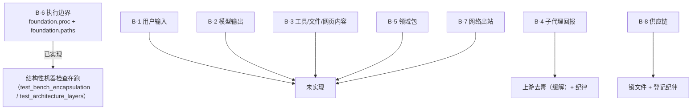
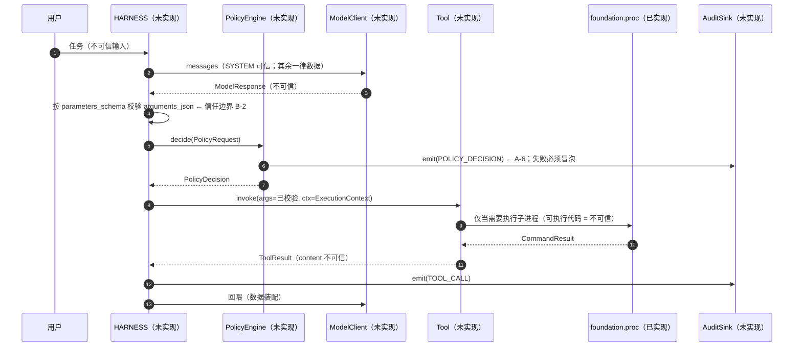

# 资产与信任边界

> 本文件是 [`README.md`](README.md) 的配套件：**先有资产与边界，才有威胁**。
> 每个威胁条目必须能回答"**保护什么**（资产）"与"**攻击者从哪进来**（边界）"。
>
> 口径同 README：行号是 2026-09-18 快照，**身份以符号为准**。

---

## 1. 资产清单

「不可逆性」一列是本项目的重点判据——`SECURITY.md` §2 的最小权限与
`ADR-0006` 的"高代价 / 难以撤销"分类都依赖它。**可逆的损失是事故，不可逆的损失是事故 + 不可收拾。**

| 编号 | 资产 | 为什么需要保护 | 不可逆性 | 当前所在 |
| --- | --- | --- | --- | --- |
| **A-1** | 用户工作目录内的文件（含仓库源码） | 工具（文件读写 / 命令执行）的真实作用对象 | **高**（误删 / 覆盖无法恢复；无版本控制的目录尤其如此） | 目标设备文件系统 |
| **A-2** | 宿主文件系统白名单之外的部分 | 越界访问 = 沙箱逃逸 | **中~高**（`/etc`、`~/.ssh` 被写为高） | 宿主文件系统 |
| **A-3** | **执行环境与宿主**（进程、资源、内核） | 不可信代码（模型产物 / 工具参数）在我们进程旁边执行 | **高**（资源耗尽会拖垮宿主；崩溃不可逆） | `foundation/proc.py` 的隔离执行 |
| **A-4** | 代码与数据的**完整性**（仓库、`bench/data` 分支、基准时间序列） | 被篡改的数据比没有数据更危险（`ADR-0014` 的可比性纪律） | **高**（时间序列一旦污染，历史结论全部可疑） | git 仓库 + `bench/data` 分支 |
| **A-5** | **凭据**（CI 运行期 `CNB_TOKEN`） | 可对本仓库做读写；`ADR-0014 §2.8` 已登记其残余风险 | **中**（短时、限本仓库、构建结束销毁；但泄露后写入痕迹不可逆） | CI 环境变量（`bench/rounds.py` 构造） |
| **A-6** | **审计记录**（`AuditEvent` 流） | `REQ-SEC-06` 的"可回放"是安全需求的验收对象 | **高**（事件丢失 = 验收失败；且事后无法补录） | 未实现（`observability/`） |
| **A-7** | **安全断言本身**（"隔离已生效""凭据未传递"这些**结论**） | 结论为假时，整套安全设计建立在幻觉上 | **低（单次）/ 极高（传播）**——幻觉会被写进文档与后续设计 | 见 `T-13` |
| **A-8** | 模型的**输出质量与用户的信任** | 越权 / 失控的执行会摧毁"可控"这一前提 | 中 | —— |
| **A-9** | 外部依赖与预置资产的**来源可信性**（依赖包、GGUF 权重、`llama-server` 二进制） | 供应链投毒 = 在执行路径上直接植入代码 | **高**（一旦被投毒，所有本地结论都不可信） | `uv.lock`、`/opt/models`、`/opt/benchmarks` |
| **A-10** | 多会话 / 长任务的**上下文与检查点**（harness 会话状态） | 被污染后跨会话持续影响（记忆投毒） | **中**（可丢弃会话，但污染若已落盘则难察） | 未实现（`harness/checkpoint.py`） |

**不在清单内的（明确声明）**：真实个人数据、生产业务数据、账号体系、支付信息
——SRS 已列 `Won't`；`SECURITY.md` §7 禁止在开发与测试中使用真实个人数据。

---

## 2. 信任边界

**边界 = 数据从"不可信侧"进入"可信侧"的位置。** 每条边界必须有一个**集中、可测试**的校验点
（`SECURITY.md` §2 第 3 条）。

| 编号 | 边界 | 方向 | 不可信来源 | 设计上的校验点 | 实现状态 |
| --- | --- | --- | --- | --- | --- |
| **B-1** | 用户输入 → HARNESS | 入 | 命令行参数、交互输入 | HARNESS 参数校验（`REQ-UX-01`）+ `paths.resolve_within` | 校验**未实现**；`paths` **已实现** |
| **B-2** | 模型输出 → HARNESS | 入 | `content`、`tool_calls[].arguments_json` | 按 `ToolSpec.parameters_schema` 严格校验（`D2`：pydantic 限定用途） | **未实现** |
| **B-3** | 工具返回 / 文件内容 / 网页内容 → 上下文 | 入 | `ToolResult.content`、被读入的仓库文件、抓取的网页 | 装配层按 `role` 判定信任、**只作数据**（`interfaces/model.md` §2.1） | **未实现** |
| **B-4** | 子代理（成员）回报 → 团队领导 | 入 | 成员产出的文本（**可被注入**） | 上游 harness 的**非破坏性去毒**（缓解，非保证）；项目纪律：只作证据线索 | 去毒为上游行为；纪律已写入 `CODEBUDDY.md` §10.4 / `agent-teams.md` §4 |
| **B-5** | 领域包（Domain Pack）声明 → 加载器 | 入 | pack 目录内的 TOML / JSON（**以及可能存在的 `.py`**） | 只加载声明式配置；**禁止**动态导入（`ADR-0015` §5.1.1 规则 `R5`） | **未实现**（`harness/domain_pack.py` 不存在） |
| **B-6** | 交付产物 → 子进程执行 | 出（执行不可信代码） | 模型产物、工具请求的命令 | `foundation.proc.run`（非特权 uid + rlimit + 最小环境）+ `paths` 白名单 | **已实现**（唯一实现的边界承载） |
| **B-7** | 本进程 → 网络 | 出 | 云端模型端点、任意 URL | 出站默认拒绝 + 白名单放行 + 超时 + 响应体上限（`REQ-SEC-07`） | **未实现** |
| **B-8** | 外部依赖 / 权重 / 二进制 → 构建与运行 | 入 | PyPI 包、GGUF、`llama-server` | 锁版本 + 来源与摘要记录（`SECURITY.md` §3 `S-3`/`S-4`） | **部分实现**（`uv.lock` 有；资产摘要校验脚本在构建侧） |

### 2.1 边界 × 承载机制 的实现状态一览

> **这张图就是本威胁模型的核心事实**：8 条边界里，**只有 1 条（B-6）有已实现的承载机制**，
> 2 条靠流程纪律或上游行为，**5 条完全未实现**。13 条威胁的分布与此一致。

---

## 3. 主要数据流

**三个必须注意的"信任翻转点"**：① 第 4 步模型输出落地为参数；
② 第 8 步把参数变成真实动作；③ 第 11 步工具输出回到上下文。**T-03/T-04/T-11 都发生在这三点。**

---

## 4. 资产 × 威胁 对照

| 资产 \ 威胁 | T-01 | T-02 | T-03 | T-04 | T-05 | T-06 | T-07 | T-08 | T-09 | T-10 | T-11 | T-12 | T-13 |
| --- | --- | --- | --- | --- | --- | --- | --- | --- | --- | --- | --- | --- | --- |
| A-1 工作目录文件 | ● | ● | | | | | | | | | ● | | |
| A-2 白名单外文件系统 | ● | ● | | | | | | | | | | | |
| A-3 执行环境与宿主 | ● | | | | | | | ● | | | | | ● |
| A-4 代码与数据完整性 | | | | | ● | ● | ● | ● | ● | | | | |
| A-5 凭据 | | | | | | | | ● | | | | | |
| A-6 审计记录 | | | | | | ● | | | | | ● | | ● |
| A-7 安全断言本身 | ● | | | | | ● | | | | | | | ● |
| A-8 用户信任 | ● | | ● | ● | ● | | | | ● | | ● | ● | ● |
| A-9 供应链可信性 | | | | | | | | | ● | | | ● | |
| A-10 上下文与检查点 | | | ● | ● | ● | | | | | | | | |

> 读出两个结构性事实：**`A-7`（安全断言本身）与 `A-4`（完整性）是被最多威胁指向的资产**——
> 这与本项目的性质一致：**这里的"安全"首先是"结论可信"**。

---

## 5. 与 STRIDE 的对照

| STRIDE | 本文对应条目 | 备注 |
| --- | --- | --- |
| **S**poofing（欺骗） | T-05（成员回报冒充指令）、T-09（工具描述冒充） | 本项目无账号体系，"欺骗"主要体现在**内容冒充** |
| **T**ampering（篡改） | T-03、T-04、T-09 | 上下文与供应链两条路径 |
| **R**epudiation（抵赖） | T-11（审计缺失则无法回放） | 审计未实现 ⇒ 该类别当前**整体无缓解** |
| **I**nformation disclosure（信息泄漏） | T-08、T-10 | 凭据与出站 |
| **D**enial of service（拒绝服务） | T-01（资源耗尽）、T-13（误判为可用） | 本项目关注**自身资源**而非对外可用性 |
| **E**levation of privilege（提权） | T-01、T-02、T-11、T-12 | 智能体的"提权"= 获得未授权能力 |

**智能体特有类别**（`docs/design/README.md` 要求单列）：

| 类别 | 对应条目 |
| --- | --- |
| 提示注入（直接 / 间接）、指令与数据混淆 | T-04、T-03 |
| 工具滥用与越权调用 | T-11 |
| 上下文污染与记忆投毒 | T-04（§"间接注入"子场景） |
| 供应链投毒（工具描述、插件、权重、依赖） | T-09、T-12 |
| 沙箱逃逸与资源耗尽 | T-01、T-13 |
