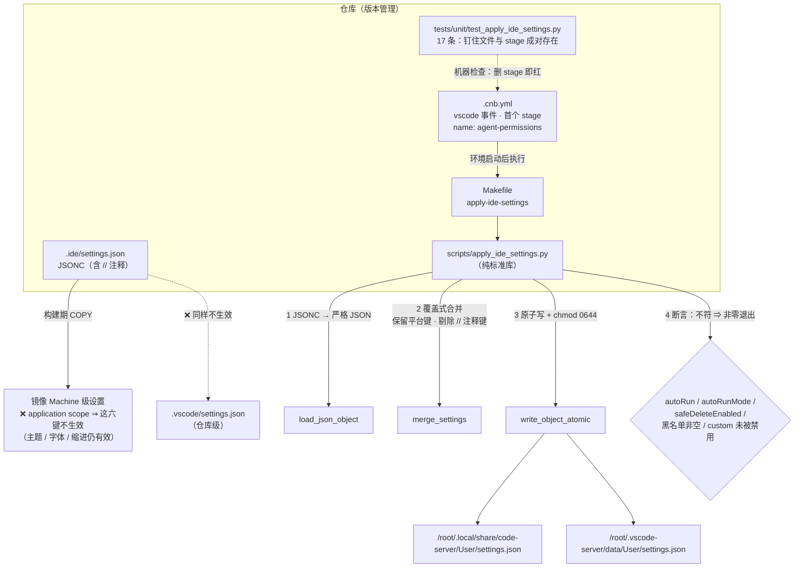

# Agent 命令闸门：生效机制、复跑与故障排查

> 本文是**工程机制**的权威落点（怎么生效、怎么复跑、坏了怎么判）。
> **决策与论证**在 [ADR-0032](../adr/0032-agent-command-gate-and-ide-settings.md)；
> **威胁侧**（可被绕过、关掉 `injection` 的代价）在
> [`threat-model/untrusted-input-and-agentic.md`](../design/threat-model/untrusted-input-and-agentic.md) 的 **`T-15`**；
> **红线判据**（哪些操作不可回退）在 [`git-workflow.md`](git-workflow.md) §4 的 **A~F 分级**。
>
> 分工：**本文不复述决策理由、不复述威胁分析、不复述 A~F 分级**——出现"必须 / 禁止 + 具体条款"时
> 一律指向上面三处（同 [ADR-0017](../adr/0017-project-level-agent-skills.md) §5.1 的 `W1` 写作要求）。

- **状态**：已落地（`ec8791d`，2026-09-25）
- **绑定版本**：扩展 `tencent-cloud.coding-copilot-4.12.38765564`（⚠️ **升级后须复跑本文 §4 的 `C1`/`C2`**）

---

## 0. 一句话

**`.ide/settings.json` 不会自动生效。** 让它生效的是 `.cnb.yml` 的 `vscode` 事件首个 stage
`agent-permissions`，它在**环境启动后**把设置**合并**进**运行中的** User 设置并**断言**。
⇒ **两个文件是一对**：删掉任何一个，闸门都会**静默退回**扩展默认档（表现是"配置看着是对的、运行时照样弹确认"）。

---

## 1. 生效路径（一句话版本 + 图）



**四条读法（每条都对应一个真实的坑）**：

| # | 读法 | 为什么 |
| --- | --- | --- |
| 1 | **只有"环境启动后"这一步有效** | 构建期 COPY 与仓库级设置都因 `scope = application` 而无效；且平台**启动时会覆盖** User 设置 ⇒ 构建期写进去的会被抹掉 |
| 2 | **两个 User 目标都要写** | WebIDE（code-server）与 VS Code Desktop（Remote-SSH）是两个**独立客户端**、两份 User 设置。只写一个 ⇒ 另一个静默不生效（`D5`） |
| 3 | **合并是覆盖式、且只覆盖源里出现的键** | 平台自己写的键（`yaml.schemas` / `cnb-welcome.locale` 等）必须保留；`yaml.schemas` 是**反例**——它会**被本文件覆盖**，所以平台自带的 schema 条目必须**在本文件里补齐**（见 `.ide/settings.json` 的注释） |
| 4 | **断言是"缺一即不算落地"，不是"越多越好"** | 尤其 `custom` 类别不得被禁用——否则 33 条黑名单**静默失效**（后果最隐蔽的一种改坏） |

---

## 2. 成对存在约束（删一个就静默失效）

| 载体 | 缺了它会发生什么 | 谁钉住它 |
| --- | --- | --- |
| `.ide/settings.json` 的 `codingcopilot.*` 段 | 无设置可合并 ⇒ 断言失败（**红**，属 fail-secure） | `test_repo_settings_file_satisfies_every_guard` |
| `.cnb.yml` 的 `agent-permissions` stage | 设置**不写入运行中的 User 设置** ⇒ 退回扩展默认档，**日志全绿、行为不变**（静默！） | `test_vscode_event_applies_settings_at_environment_start` |
| `Makefile` 的 `apply-ide-settings` 目标 | stage 调不到脚本 ⇒ 启动期报错（**红**） | `test_makefile_exposes_the_apply_target` |

> **不变式（硬性）**：
>
> > **只要仓库里存在 Agent 权限配置（`.ide/settings.json` 的 `codingcopilot.*`），
> > 就必须存在"环境启动后把它写进运行中的 User 设置并断言"的机制。
> > 二者成对存在，缺一即静默失效。**
>
> 与 [`security-scan-gate-config.md`](security-scan-gate-config.md) §5.1 的 bandit 不变式同族
> （"配置不得存在，除非被两处同时引用"）：**唯一根因都不是"配错了某一条"，
> 而是"声明与生效分叉"。** 上式把"口径必须一致"变成可判定的条件。

---

## 3. 日常操作

### 3.1 复跑（手工）

```bash
# 环境内自检 / 排查"配置看起来对但没生效"
make apply-ide-settings
```

**成功判据**（逐行）：

```text
[ok] 已合并 <N> 项设置 → /root/.local/share/code-server/User/settings.json（原有 <M> 项保留）
[ok] 已合并 <N> 项设置 → /root/.vscode-server/data/User/settings.json（原有 <M> 项保留）
[ok] Agent 权限已落地（autoRun / autoRunMode / safeDeleteEnabled / 黑名单 / 类别 均核对通过）
```

- 退出码 **0** = 全部断言通过；
- 出现 `[fatal] …` ⇒ 退出码**非零**，且**逐项**打印哪个键不符（这是刻意的：**不降级为警告**）。

### 3.2 改设置文件时

1. 改 `.ide/settings.json`（JSONC，可写注释；**注释键**指以 `//` 开头的键，**不会**写进目标）；
2. 若改的是**断言覆盖的五项**（`autoRun` / `autoRunMode` / `safeDeleteEnabled` /
   黑名单 / `disabledSecurityCategories`），确认脚本的 `GUARD_*` 常量与设置**仍一致**；
3. 跑 `uv run pytest tests/unit/test_apply_ide_settings.py -q`；
4. ⚠️ **若同时改的是黑名单**：确认红线判据仍然来自 `git-workflow.md` §4（**不得**在此发明新的红线）。

### 3.3 定位目标文件（`D5` 用得到）

| 客户端 | User 设置路径 |
| --- | --- |
| WebIDE（code-server） | `/root/.local/share/code-server/User/settings.json` |
| VS Code Desktop（Remote-SSH） | `/root/.vscode-server/data/User/settings.json` |

---

## 4. 复跑与验证命令（对照表）

| # | 验什么 | 命令 / 读取路径 | 通过判据 |
| --- | --- | --- | --- |
| **C1** | 六键的 `scope = application`（**根因自证**） | 读 `~/.local/share/code-server/extensions/tencent-cloud.coding-copilot-*/package.json` 的 `contributes.configuration.properties` | `autoRun`/`safeDeleteEnabled`/`safeDeleteBulkThreshold`/`customBlacklistCommands`/`disabledSecurityCategories`/`autoAcceptWebSearch` 均 `"scope": "application"`；`autoRunMode` **未声明** |
| **C2** | **判定顺序**：黑名单命中不被 autoRun 吃掉 | 读同扩展 `out/extension/index.js` 的 `resolvePermissionDecision` | `checkSafetyRules(…)` 在 permission 规则求值**之前**；命中 ⇒ `needUserConfirm=True`（`source="safety_rule_ask"`），即**弹确认**（非直接拒绝） |
| **C3** | 单测全绿（**17 条**） | `uv run pytest tests/unit/test_apply_ide_settings.py -q` | `17 passed`；⚠️ 它**不覆盖**"环境里真的生效"（那是 `C4`/`C5`） |
| **C4** | 环境里真的写进去了 | 环境内 `make apply-ide-settings` | 退出码 0 + 三行 `[ok]`（§3.1） |
| **C5** | 黑名单**行为**正确（**人工，不可 CI**） | 会话内触发一次命中命令（如 `git push --force`） | **弹确认**，既不静默执行、也不直接拒绝 |
| **C6** | 双容器风险的结构前提 | 核对 `.ide/Dockerfile` 是否**自装 code-server**（单容器） | 自带 ⇒ `D4` 前提成立；镜像形态变化时须重核 |

> **`C1` / `C2` 绑定扩展版本**：结论只在 `4.12.38765564` 上成立。
> **扩展升级后必须复跑**——否则本文与 ADR-0032 §7 的 `V1`/`V2` 即为过期声明。

---

## 5. 常见故障：判据与处置

判断"到底是没生效还是别的问题"，按下表**从上往下**逐条排除。**每条都写明判据**——
只说"某种情况可能有问题"等于没写。

### `D1` 配置看着对、运行时照样弹确认（**最常见**）

| 排除项 | 判据 | 处置 |
| --- | --- | --- |
| 环境启动期的 stage 没跑（或失败被忽略） | 流水线里有没有 `agent-permissions` 这个 stage？它**是绿的吗**？ | 看 stage 日志；跑 `C4` 复跑 |
| 目标是**只读**了设置、**没写** | `C4` 的输出里有没有两行 `[ok] 已合并 …`？ | 跑 `C4` |
| 平台覆盖**晚于** stage | 环境刚启动时读 `User/settings.json`，再跑 `C4`，对比 `codingcopilot.autoRun` 是否存在 | 见 ADR-0032 §10 的 `U4`（**未验证**；若成立需另定时机） |
| 你**改的是错的键** | `C1` 里该键是否声明？`autoRunMode` 就属**未声明**（`D6`） | 以 `C1` 的输出为准 |

### `D2` 单测红，说"设置文件与 stage 不成对"

| 现象 | 含义 | 处置 |
| --- | --- | --- |
| `test_vscode_event_applies_settings_at_environment_start` 红 | `.cnb.yml` 的 `vscode` 事件块里**找不到** `make apply-ide-settings` 或 `- name: agent-permissions` | **这不是测试坏了，是闸门真的会静默失效。** 要么恢复该 stage，要么**连同** `.ide/settings.json` 的 `codingcopilot.*` 段一起删掉（见 ADR-0032 §9 回退） |
| `test_makefile_exposes_the_apply_target` 红 | `Makefile` 里 `apply-ide-settings:` 或 `scripts/apply_ide_settings.py` 缺失 | 恢复它们（stage 依赖这条链） |

### `D3` `[fatal]` 报某个键不符

| 报错 | 含义 |
| --- | --- |
| `codingcopilot.autoRun = False（期望 True）` | 有人把全自动关掉了（**或**源码里没写、被平台值顶上来） |
| `codingcopilot.customBlacklistCommands 不是非空列表` | 黑名单被写空 ⇒ **没有任何闸门**（12 类内置类别已关） |
| `禁用了 custom 类别 ⇒ 自定义黑名单会静默失效` | **最隐蔽的一种改坏**：黑名单还在，但**永远不会被匹配到** |

⇒ 一律**先看脚本打印的 `[fatal]` 行**（它逐项列出不符的键与期望值），不要只看退出码。

### `D4` 永远绿、永远不生效（**双容器模式**）

| 项 | 说明 |
| --- | --- |
| 现象 | 脚本退出码 0、日志全绿，但 Agent 行为**没有一点变化** |
| 原因 | `stages` 在**另一个容器**里跑，写的是**那个容器**的 `User/settings.json`；code-server 在**本容器**里读自己的 |
| 为什么检测不到 | **从容器内部无法判断**——本镜像**自带** code-server，所以"目标目录存在"这个判据失效 |
| 结构性解法 | **单容器镜像**（本仓库 `.ide/Dockerfile` 自装 code-server，**已满足**）⇒ 这是**前提**，不是可以靠检查兜住的东西 |
| 排查判据 | 若怀疑走到这条：核对镜像形态（本仓库是单容器）+ 看 `C4` 写的是不是**当前容器**里的路径 |

### `D5` WebIDE 生效、Remote-SSH 不生效（或反之）

| 项 | 说明 |
| --- | --- |
| 现象 | 一个客户端不再弹确认，另一个照旧 |
| 原因 | 两个客户端有**两份独立的 User 设置**（§3.3 的两个路径） |
| 判据 | 分别读两个路径里的 `codingcopilot.autoRun` |
| 处置 | 跑 `C4`（脚本**默认写两个目标**；缺目录时会自动建）；若某个客户端**从未连过**，其目录可能不存在——此时脚本会 `[warn] 目标不存在，跳过` |

### `D6` 改完设置后**当前面板**仍按旧档行为

| 项 | 说明 |
| --- | --- |
| 原因 | 一部分面板侧设置属**会话态**，需**面板 / 页面重载**才重新初始化 |
| 判据 | **重载面板**后再试一次同一条命令 |
| 结论 | ⚠️ **不要据此判"没生效"**——先重载，再走 `D1` |

### `D7` 黑名单命中了，但**没有弹确认**

| 排查项 | 判据 |
| --- | --- |
| 是不是**直接拒绝**了？ | `V2`/`C2` 的结论是"命中 ⇒ **弹确认**（`ask`）"。若表现是拒绝，说明有**别的**机制在拦（例如 hook 的 `deny`），**不是**本机制 |
| 命中的是哪一段命令？ | 黑名单按 `\|`、`\|\|`、`&&`、`&`、`;`、换行**切分后逐条匹配**——只匹配**切分后的单条命令**，不是整行 |
| 大小写 | 黑名单**大小写敏感**（无 `i` 标志）⇒ `RM -RF /` 与 `rm -rf /` 走的是**不同**判定 |
| 正则是否退化 | 跑 `C3` 的 `test_repo_blacklist_patterns_are_valid_regex` 确认没有写坏 |

### `D8` 想改一条黑名单

| 步骤 | 判据 |
| --- | --- |
| 1. 这条对应哪条红线？ | 必须能在 `git-workflow.md` §4 / `SECURITY.md` 里找到出处；**找不到出处就不要加**（否则黑名单会成为第二个真源） |
| 2. 是不是**误报源**？ | 参考实现实测 `curl … \| sh` 是最大误报源，**故意不拦**——新增前先想"它会不会在正常安装时触发" |
| 3. 正则是否合法？ | 跑 `C3` 的 `test_repo_blacklist_patterns_are_valid_regex` |
| 4. 日常命令是否被误伤？ | 在会话里跑几条常用命令（`make check`、`git status`、`uv run pytest`），确认**零触发** |
| 5. 修改了红线判据本身？ | 那是 **`F` 类**（改规则）⇒ **须事先确认**，且应新增 ADR（ADR 只增不改） |

---

## 6. 已知边界（**不得表述为机制**）

| # | 边界 | 说明 |
| --- | --- | --- |
| 1 | **这是提醒层，不是安全边界** | 黑名单是**文本匹配**，可被改写绕过（`r''m`、变量展开、`python -c "shutil.rmtree('/')"`）。**真正的判据**是 `git-workflow.md` §4 的纪律与 `SECURITY.md` |
| 2 | **关掉 `injection` 后 `curl \| sh` 不再被拦** | **已知且刻意**（它是最主要的误报源）。恢复方式：从 `disabledSecurityCategories` 删掉 `"injection"`（一行） |
| 3 | **`C5` 与 `D6` 不可由 CI 断言** | 它们发生在**功能面板 / 会话**里，仓库内看不到（同 `git-workflow.md` §4 的"CI 看不到是否事先批准"）。⇒ 按威胁模型口径记为**部分缓解** |
| 4 | **`D4`（双容器）无法自检** | 靠"单容器镜像"这一**结构前提**规避，不靠检测 |
| 5 | **`C1` / `C2` 绑定扩展版本** | 扩展升级后这两条结论**即过期**；须复跑（§4 末注） |
| 6 | **`agent-permissions` 是 `vscode` 事件的 stage** | 它只在**开发环境**（`services: [vscode]`）里跑 ⇒ 构建型流水线（`push` / `pr` 门禁）**不会**、**也不需要**执行它 |

---

## 7. 关联

| 主题 | 落点 |
| --- | --- |
| 决策与论证（被否决的方案、根因、后果） | [ADR-0032](../adr/0032-agent-command-gate-and-ide-settings.md) |
| 威胁与残余风险（可绕过、关类别的代价） | [`T-15`](../design/threat-model/untrusted-input-and-agentic.md) |
| 红线判据（哪些操作不可回退、A~F 分级） | [`git-workflow.md`](git-workflow.md) §4 |
| 远端写入授权（A~F 的决策原文） | [ADR-0016](../adr/0016-cnb-platform-integration-and-remote-write-authorization.md) |
| 成员自动执行（`enabledAutoRun`，**与本机制不同靶**） | [ADR-0018](../adr/0018-agent-team-collaboration-mechanism.md)、[`agent-teams.md`](agent-teams.md) §1 |
| 同类问题家族（"配置写了但没生效"） | [`security-scan-gate-config.md`](security-scan-gate-config.md) |
| CNB 平台行为事实（`services: [vscode]` 的分桶判据等） | [`../research/2026-09-25-cnb-platform-behavior-facts.md`](../research/2026-09-25-cnb-platform-behavior-facts.md) |
| 机器检查 | `tests/unit/test_apply_ide_settings.py`（**17 条** = 14 个用例函数） |

---

## 8. 变更记录

- **2026-09-25**：建立本文。与 [ADR-0032](../adr/0032-agent-command-gate-and-ide-settings.md) **同批产出**。
  内容：生效路径图、成对存在不变式、复跑命令、六条验证命令（`C1`~`C6`）与八类故障判据（`D1`~`D8`）、
  已知边界。**本文不含决策论证**（在 ADR-0032）、**不含威胁分析**（在 `T-15`）、
  **不复述 A~F 分级**（在 `git-workflow.md` §4）。
