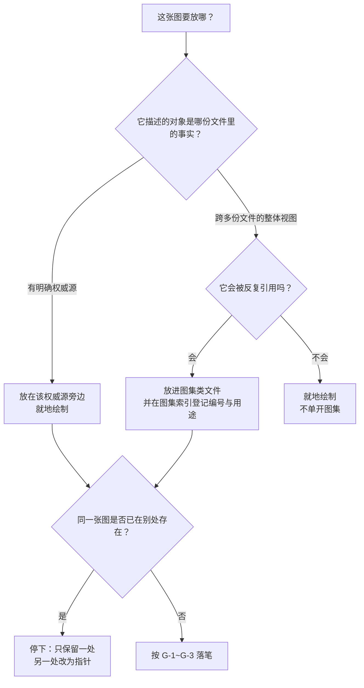

# 图表规范（Mermaid）

> **本文是"项目文档里怎么画图"的权威源。**
> 流程型 Skill [`.codebuddy/skills/diagram-authoring/`](../../.codebuddy/skills/diagram-authoring/SKILL.md)
> 只写"按什么顺序做"，不复述本文内容；若两者冲突，**以本文为准**。

| 项 | 内容 |
| --- | --- |
| 状态 | 生效（2026-09-21） |
| 适用范围 | 仓库内**所有** markdown 文档（`docs/`、`README.md`、`CODEBUDDY.md`、交付包等） |
| 工具 | [`.codebuddy/skills/diagram-authoring/scripts/mermaid_check.py`](../../.codebuddy/skills/diagram-authoring/scripts/mermaid_check.py) |
| 决策记录 | 无独立 ADR（**不新增目录、不新增依赖、不改门禁强度**）；本文属文档约定，随仓库演进 |

---

## 1. 为什么用 Mermaid

| 理由 | 说明 |
| --- | --- |
| 与既有做法一致 | 仓库文档此前已在用 Mermaid（架构、威胁模型、接口契约、选型提案等处均有图） |
| **纯文本、可 diff、可评审** | 图随代码进版本库，改动可 review、可回滚，不是一张截图 |
| **零新增依赖** | 不需要制图软件或渲染服务；图渲染不出来只影响阅读，不影响产品运行 |
| 与证据链同构 | 图与正文在同一处维护，避免"图在 PPT、规范在仓库"两处漂移 |

**明确不引入**：Mermaid CLI / Node 渲染链路 / 任何制图服务。
理由：它们进的是**构建与依赖面**，而收益只是"本地预览"。若确需预览，
见 §6 的替代路径（不改变本文结论）。

---

## 2. 三条硬性写作要求

| # | 要求 | 为什么 |
| --- | --- | --- |
| **G-1** | **一张图只回答一个问题** | 图一旦承载两个问题，改其一必错其二 |
| **G-2** | **每张图必须写"用途 / 读者 / 维护时点"** | 没有读者与时点的图**不会有人更新**，最终变成误导 |
| **G-3** | **图不得成为第二份真源** | 图是同一事实的**视图**：数值、条款、状态以权威源为准；图只画结构与关系 |

> **G-3 的操作含义**：图上不要复制会漂移的具体数字（如测试通过数、威胁计数）。
> 确需出现时，写成"见权威源"或标注"截至某日期的快照"，并接受它会过期。

---

## 3. 编号与放置

### 3.1 编号（用于图集类文档）

```text
A-*  业务与产品层（上下文、定位、画布、角色、旅程）
B-*  需求层（追溯、结构、优先级、依赖、故事地图）
C-*  行为层（时序图、状态机、业务流程）
D-*  数据层（数据流图、数据模型）
E-*  结构与部署层（分层、组件、部署）
F-*  计划与风险层（排期、风险矩阵、覆盖分布）
```

编号**只增不复用**（与 ADR 同源）；图废弃时标"已废弃（不再适用）"并写明依据。

### 3.2 图放在哪（一条口径，避免每次重新讨论）



---

## 4. 自检

```bash
# 检查某个目录（含子目录）下所有 markdown 里的 mermaid 块
python3 .codebuddy/skills/diagram-authoring/scripts/mermaid_check.py docs/

# 只列图清单（编号 / 类型 / 行号）
python3 .codebuddy/skills/diagram-authoring/scripts/mermaid_check.py --list docs/

# 把警告也算失败（提交前严格模式）
python3 .codebuddy/skills/diagram-authoring/scripts/mermaid_check.py --strict docs/
```

**退出码**：`0` 通过；`1` 有错误（`--strict` 下有警告也算）；`2` 路径不存在。

**检查边界（必须知道）**：只做**结构自检**（图类型、括号与引号配对、`subgraph`/`end` 与分组关键字配平、
占位符残留、制表符、象限图坐标范围等），**不做渲染、不验语义**。
⇒ **自检通过 ≠ 图是对的**；图与事实是否一致只能由评审者核对。

**误报处理**：**改工具，不要改图**。若确属规则过严，在工具文档字符串或本文件登记后放宽。

---

## 5. 与"证据"相关的两条纪律

| # | 纪律 | 理由 |
| --- | --- | --- |
| D-1 | 涉及**安全断言**的图，必须能对上威胁模型或接口契约的原文；改图即等于改断言 | 本项目已发生过"陈述落后于仓库"导致的误判 |
| D-2 | 图中**不得**出现未实现机制被画成已生效 | 需求侧已有"范围外 ≠ 未实现"的区分；图必须遵守同一口径 |

---

## 6. 预览与实际查看

图在**渲染器**里才能看见。项目**不为此引入依赖**，因此约定：

| 方式 | 说明 |
| --- | --- |
| 编辑器内置预览 + Mermaid 支持扩展 | 开发环境镜像已装 `bierner.markdown-mermaid`；**能否渲染取决于客户端**（见 §7） |
| 任意支持 Mermaid 的查看器 | 例如代码托管平台的 markdown 渲染、本地编辑器、在线编辑器 |
| 本地生成单体 HTML | 可用仓库外的临时手段（不验收、不入库）；**不得**作为仓库的一部分提交 |

> ⚠️ **预览是客户端能力，不是镜像能力**：镜像只负责"把扩展装上"。
> 若预览不渲染，排查方向在**客户端与浏览器侧**，不在 Docker 镜像（此判断有实测依据，见 §7）。

---

## 7. 已知环境问题：WebIDE 预览不渲染 Mermaid（2026-09-21 实测）

**现象**：在 CNB 云原生开发环境的浏览器 WebIDE 中打开 markdown 预览，Mermaid 图不显示；
同一仓库在本机 VS Code 中可正常显示。

**已排除的原因（实测，2026-09-21）**：

| 假设 | 实测结论 |
| --- | --- |
| 镜像里没装 Mermaid 预览扩展 | **已排除**：`bierner.markdown-mermaid-1.32.1-universal` 已在位 |
| 扩展因版本不兼容被静默禁用 | **已排除**：内置 VS Code `1.137.0`，扩展要求 `engines.vscode ^1.100.0`；且扩展主机日志有**成功激活**记录 |
| 扩展需要联网从 CDN 取 mermaid 库 | **已排除**：扩展把 mermaid 打进 `dist-preview/index.bundle.js`（本地包，非 CDN） |
| 内置预览不支持扩展注入脚本 | **已排除**：内置 markdown 扩展（`10.0.0`）支持 `markdown.previewScripts` 贡献点 |

⇒ 失效发生在**客户端渲染那一步**（预览 webview 的脚本加载/执行），**只能在浏览器侧定位**。
**本文不把推测写成结论**：可能的成因（CSP 拦截、资源路径被代理改写、资源 404）
**均未被验证**，处置方式见下。

**排查动作（30 秒，由浏览器侧做）**：

1. 打开预览 → `F12` → **Console**：看是否有 `Refused to load the script` / `violates … Content Security Policy`；
2. 切 **Network**，过滤 `bundle`：看 `dist-preview/index.bundle.js` 的请求是否 404 / 被改写 / 被拦截；
3. 把看到的**原始报错**贴回，再据其定位（**不要**先按猜测改配置）。

**可用替代路径（按推荐度）**：

| # | 路径 | 说明 |
| --- | --- | --- |
| 1 | **本机 VS Code + Remote-SSH 进同一容器** | 预览由本机客户端渲染；⚠️ 扩展需装在**远端**（`code-server --install-extension` 装的是 code-server 的目录，Remote-SSH 用的是另一套目录） |
| 2 | 在**本机/本地环境**查看同一份仓库 | 已验证可行（用户实测本机可显示） |
| 3 | 用**支持 Mermaid 的托管平台**渲染 | 图是纯文本，不依赖本仓库环境 |
| 4 | 临时生成单体 HTML 查看 | 仓库外的一次性手段，不入库 |

> **本节的用途**：把"环境到底差什么"这件事**收敛成可核对的事实**，
> 避免下次有人再从"重装扩展 / 重建镜像"开始试（那两条已被实测排除）。
