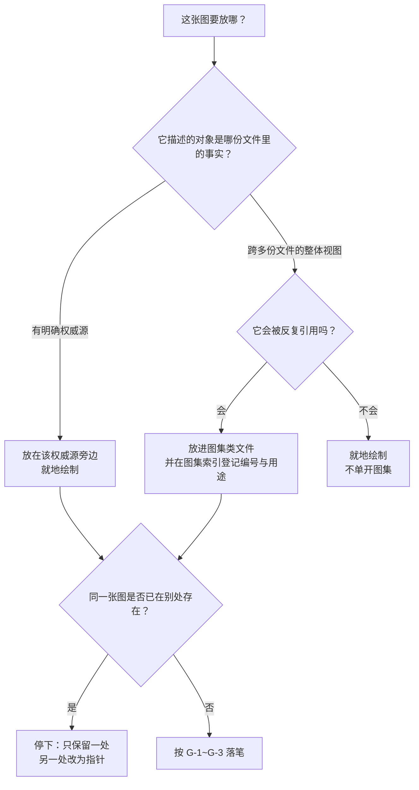
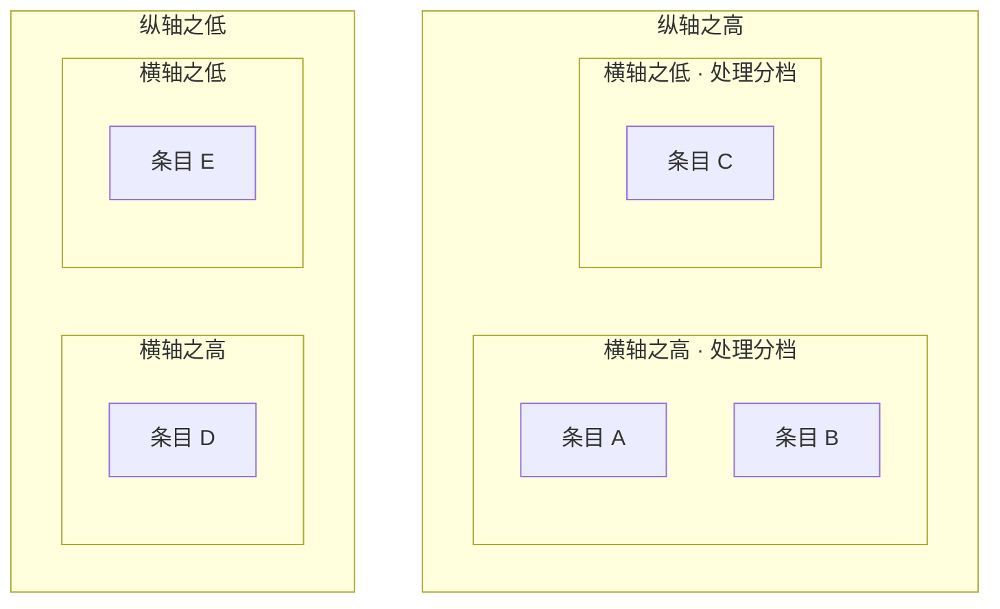

# 图表规范（Mermaid）

> **本文是"项目文档里怎么画图"的权威源。**
> 流程型 Skill [`.codebuddy/skills/diagram-authoring/`](../../.codebuddy/skills/diagram-authoring/SKILL.md)
> 只写"按什么顺序做"，不复述本文内容；若两者冲突，**以本文为准**。

| 项 | 内容 |
| --- | --- |
| 状态 | 生效（2026-09-21） |
| 适用范围 | 仓库内**所有** markdown 文档（`docs/`、`README.md`、`CODEBUDDY.md`、交付包等） |
| 工具 | [`.codebuddy/skills/diagram-authoring/scripts/mermaid_check.py`](../../.codebuddy/skills/diagram-authoring/scripts/mermaid_check.py) |
| 决策记录 | 无独立 ADR（**不新增目录、不新增依赖、不改门禁强度**）；本文属文档约定，随仓库演进 |

---

## 1. 为什么用 Mermaid

| 理由 | 说明 |
| --- | --- |
| 与既有做法一致 | 仓库文档此前已在用 Mermaid（架构、威胁模型、接口契约、选型提案等处均有图） |
| **纯文本、可 diff、可评审** | 图随代码进版本库，改动可 review、可回滚，不是一张截图 |
| **零新增依赖** | 不需要制图软件或渲染服务；图渲染不出来只影响阅读，不影响产品运行 |
| 与证据链同构 | 图与正文在同一处维护，避免"图在 PPT、规范在仓库"两处漂移 |

**明确不引入**：Mermaid CLI / Node 渲染链路 / 任何制图服务。
理由：它们进的是**构建与依赖面**，而收益只是"本地预览"。若确需预览，
见 §6 的替代路径（不改变本文结论）。

---

## 2. 三条硬性写作要求

| # | 要求 | 为什么 |
| --- | --- | --- |
| **G-1** | **一张图只回答一个问题** | 图一旦承载两个问题，改其一必错其二 |
| **G-2** | **每张图必须写"用途 / 读者 / 维护时点"** | 没有读者与时点的图**不会有人更新**，最终变成误导 |
| **G-3** | **图不得成为第二份真源** | 图是同一事实的**视图**：数值、条款、状态以权威源为准；图只画结构与关系 |

> **G-3 的操作含义**：图上不要复制会漂移的具体数字（如测试通过数、威胁计数）。
> 确需出现时，写成"见权威源"或标注"截至某日期的快照"，并接受它会过期。

---

## 3. 编号与放置

### 3.1 编号（用于图集类文档）

```text
A-*  业务与产品层（上下文、定位、画布、角色、旅程）
B-*  需求层（追溯、结构、优先级、依赖、故事地图）
C-*  行为层（时序图、状态机、业务流程）
D-*  数据层（数据流图、数据模型）
E-*  结构与部署层（分层、组件、部署）
F-*  计划与风险层（排期、风险矩阵、覆盖分布）
```

编号**只增不复用**（与 ADR 同源）；图废弃时标"已废弃（不再适用）"并写明依据。

### 3.2 图放在哪（一条口径，避免每次重新讨论）



---

## 4. 自检

```bash
# 检查某个目录（含子目录）下所有 markdown 里的 mermaid 块
python3 .codebuddy/skills/diagram-authoring/scripts/mermaid_check.py docs/

# 只列图清单（编号 / 类型 / 行号）
python3 .codebuddy/skills/diagram-authoring/scripts/mermaid_check.py --list docs/

# 把警告也算失败（提交前严格模式）
python3 .codebuddy/skills/diagram-authoring/scripts/mermaid_check.py --strict docs/
```

**退出码**：`0` 通过；`1` 有错误（`--strict` 下有警告也算）；`2` 路径不存在。

**检查边界（必须知道）**：只做**结构自检**（图类型、括号与引号配对、`subgraph`/`end` 与分组关键字配平、
占位符残留、制表符、象限图坐标范围等），**不做渲染、不验语义**。
⇒ **自检通过 ≠ 图是对的**；图与事实是否一致只能由评审者核对。

**误报处理**：**改工具，不要改图**。若确属规则过严，在工具文档字符串或本文件登记后放宽。

---

## 5. 与"证据"相关的两条纪律

| # | 纪律 | 理由 |
| --- | --- | --- |
| D-1 | 涉及**安全断言**的图，必须能对上威胁模型或接口契约的原文；改图即等于改断言 | 本项目已发生过"陈述落后于仓库"导致的误判 |
| D-2 | 图中**不得**出现未实现机制被画成已生效 | 需求侧已有"范围外 ≠ 未实现"的区分；图必须遵守同一口径 |

---

## 6. 预览与实际查看

图在**渲染器**里才能看见。项目**不为此引入依赖**，因此约定：

| 方式 | 说明 |
| --- | --- |
| 编辑器内置预览（**只用内建渲染器**） | code-server 的 VS Code **自带** `mermaid-markdown-features`（`engines ^1.104.0`）⇒ **不得再安装第三方 mermaid 预览扩展**（原因见 §7 结案框的原因 B）。⚠️ **不写死 code-server 版本号**：它由官方 `install.sh` 取最新版、必然漂移（2026-09-21 原写 1.137.0，同日重建后实测 1.138.0）；核验用 `code-server --version` + `ls /usr/lib/code-server/lib/vscode/extensions/ \| grep -i mermaid` |
| 任意支持 Mermaid 的查看器 | 例如代码托管平台的 markdown 渲染、本地编辑器、在线编辑器 |
| 本地生成单体 HTML | 可用仓库外的临时手段（不验收、不入库）；**不得**作为仓库的一部分提交 |

> ⚠️ **"预览不出来"可能出在两侧，别预设在哪一侧**：渲染确实发生在客户端，
> 但**镜像决定了客户端装了什么**——本次两条原因，一条在**图本身**（A）、一条在**镜像的扩展清单**（B）。
> ⇒ 排查顺序固定为：**先取失败侧的原始报错**，再判断是图、是扩展、还是客户端（依据见 §7 结案框）。

---

## 7. 已知环境问题：预览渲染不稳（2026-09-21 **已结案**）

> ### ✅ 结案结论：两条**互相独立**的原因，均已修复
>
> | # | 原因 | 归属 | 修复动作 | 验证方式与结果 |
> | --- | --- | --- | --- | --- |
> | **A** | `quadrantChart` 的**坐标轴标签用了中文** ⇒ 词法器报 `Lexical error`，**整张图渲染失败** | **本项目自己的图**写错 | 该图型改用嵌套子图的 2×2 矩阵（见 §9） | 交付包内已无 `quadrantChart`（`grep` 可复跑） |
> | **B** | 环境里存在**两个** markdown-mermaid 渲染器：内建 `mermaid-markdown-features` 与第三方 `bierner.markdown-mermaid`，两者声明**完全相同的 8 个配置键**、并同时注入 `markdown.previewScripts` | **镜像的扩展清单**（基于"VS Code 不自带 mermaid"的过时前提） | 从 `.ide/Dockerfile` **移除** `bierner.markdown-mermaid` | 所有者 reload 后实测：**全部图正常显示**；客户端 8 条 `already registered` 消失 |
>
> **原因 B 的可复跑取证（不需要浏览器）**：
>
> ```bash
> ls /usr/lib/code-server/lib/vscode/extensions/ | grep -i mermaid        # ① 内建渲染器是否存在
> grep -l 'markdown-mermaid.lightModeTheme' ~/.local/share/code-server/extensions/*/package.json  # ② 第三方是否也声明同一批键
> grep -l 'markdown.previewScripts' ~/.local/share/code-server/extensions/*/package.json         # ③ 是否都注入预览
> ```
>
> **两条被推翻的初判（留痕，不抹掉）**：
> 1. 我最初把方向收敛为"客户端加载脚本的问题"——**错**，真正的原因之一是**图写错了**（A）；
> 2. 我随后把"`bierner.markdown-mermaid` 已装、已激活"当作"渲染链路没问题"的证据——**这个证据一直在空转**：
>    真正渲染文件预览的是**内建**那个渲染器。**"装了某扩展且它已激活" ≠ "图就是它渲染的"**。
>
> 下面的内容是**当日的排查与更正过程**（原始记录，保留以便追溯）。

**当日的初版记录如下**（现象与已排除项；结论以上方结案框为准）：

**现象**：在 CNB 云原生开发环境的浏览器 WebIDE 中打开 markdown 预览，Mermaid 图不显示；
同一仓库在本机 VS Code 中可正常显示。

**已排除的原因（实测，2026-09-21）**：

| 假设 | 实测结论 |
| --- | --- |
| 镜像里没装 Mermaid 预览扩展 | **已排除**：`bierner.markdown-mermaid-1.32.1-universal` 已在位 |
| 扩展因版本不兼容被静默禁用 | **已排除**：内置 VS Code `1.137.0`，扩展要求 `engines.vscode ^1.100.0`；且扩展主机日志有**成功激活**记录 |
| 扩展需要联网从 CDN 取 mermaid 库 | **已排除**：扩展把 mermaid 打进 `dist-preview/index.bundle.js`（本地包，非 CDN） |
| 内置预览不支持扩展注入脚本 | **已排除**：内置 markdown 扩展（`10.0.0`）支持 `markdown.previewScripts` 贡献点 |

⇒（**此处的初版结论已被当日更正，见下框**）

> ### 🔴 【2026-09-21 同日更正 · 据浏览器控制台的真实报错】
>
> **上表四条排除仍然成立**——它们排掉的是"镜像 / 扩展缺失"这一整类猜测；
> 但**上面那句推断是错的**：问题**不在**客户端加载脚本，而是**图本身写错了**。
> 报错原文（由所有者在浏览器控制台取得）：
>
> ```text
> Uncaught (in promise) Error: Lexical error on line 3. Unrecognized text.
> ...的价值与成本分布    x-axis 实现成本低 --> 实现成本高
> ----------------------^
> ```
>
> **根因**：`quadrantChart` 的**坐标轴标签不接受非 ASCII 字符**——词法器在 `x-axis ` 之后的
> **第一个汉字处**即失败（光标位置与推断一致），并导致**整张图渲染失败**。
> ⇒ 该图型在本项目（中文文档）中**不可用**；已改用**嵌套子图的 2×2 矩阵**表达同一含义（见 §8）。
>
> **一处必须记下的方法教训**：把"我查了什么、排除了什么"写成结论前，
> **必须先拿到失败侧的原始报错**。本次的失误不是"排错了四条"，而是
> **在拿到报错之前就把方向收敛成了"客户端加载问题"**，从而**漏掉了"图写错了"这个更近的可能**。
> 教训写成条款：**任何"环境缺了什么"的结论，必须与失败侧的原始报错同时出现**；
> 只有排查记录、没有原始报错的，只能写成"待证实"。

**排查动作（30 秒，由浏览器侧做）**：

1. 打开预览 → `F12` → **Console**：看是否有 `Refused to load the script` / `violates … Content Security Policy`；
2. 切 **Network**，过滤 `bundle`：看 `dist-preview/index.bundle.js` 的请求是否 404 / 被改写 / 被拦截；
3. 把看到的**原始报错**贴回，再据其定位（**不要**先按猜测改配置）。

**可用替代路径（按推荐度）**：

| # | 路径 | 说明 |
| --- | --- | --- |
| 1 | **本机 VS Code + Remote-SSH 进同一容器** | 预览由本机客户端渲染；⚠️ 扩展需装在**远端**（`code-server --install-extension` 装的是 code-server 的目录，Remote-SSH 用的是另一套目录） |
| 2 | 在**本机/本地环境**查看同一份仓库 | 已验证可行（用户实测本机可显示） |
| 3 | 用**支持 Mermaid 的托管平台**渲染 | 图是纯文本，不依赖本仓库环境 |
| 4 | 临时生成单体 HTML 查看 | 仓库外的一次性手段，不入库 |

> **本节的用途**：把"环境到底差什么"这件事**收敛成可核对的事实**，
> 避免下次有人再从"重装扩展 / 重建镜像"开始试（那两条已被实测排除）。

---

## 8. 图型对中文的兼容性（实测口径）

> **为什么单列一节**：本项目的文档以中文为主，而 Mermaid 各图型的词法器对非 ASCII 的支持**并不一致**。
> 下表把"已实测"与"仅无逆向证据"分开写——**没有证据的一律不写成结论**。

| 图型 | 中文标签 | 证据等级 | 说明 |
| --- | --- | --- | --- |
| `flowchart` / `graph` | ✅ 可用 | **已实测**（现有文档大量使用，预览渲染正常） | 标签建议统一用引号包起来 |
| `stateDiagram-v2` | ✅ 可用 | **已实测**（现有文档渲染正常） | 状态名直接用中文即可 |
| `sequenceDiagram` | ✅ 可用 | **已实测** | 参与者别名与消息文本均可用中文 |
| `erDiagram` | ✅ 可用（限定位置） | **已实测** | **实体名 / 属性名保持 ASCII**；中文只放在**引号内的注释**里 |
| `journey` / `gantt` / `pie` | ✅ 可用 | **已实测** | 标题、分段名、任务名均可用中文 |
| **`quadrantChart`** | ❌ **坐标轴标签不可用** | **已实测（有失败复现）** | `x-axis` / `y-axis` 的标签含汉字 ⇒ **整张图渲染失败**；象限名与数据点**未证实** ⇒ 该图型**整体按不可用对待**，改用 §9 的替代画法 |

**两条纪律**

1. **"没报错"只是弱证据**，不等于"已验证支持"。**首次使用某图型时，必须在预览里确认一次**，
   并把结论回填到本表（分"已实测可用"与"未证实"两栏，不得混写）。
2. **工具会拦能拦的部分**：`mermaid_check.py` 对 `quadrantChart` 的中文坐标轴标签报 `ERROR`，
   对其余非 ASCII 报 `WARN`（口径见该脚本文档字符串）。
   但工具**不渲染** ⇒ **它拦不住的，仍需人在预览里看一眼**。

---

## 9. 替代画法：2×2 矩阵（不使用 `quadrantChart`）

需要"优先级矩阵 / 风险矩阵 / 取舍四象限"时，用**嵌套子图的流程图**表达，语义等价且对中文安全：



**使用要求**（与 `quadrantChart` 的差别，必须写出来）：

| # | 要求 |
| --- | --- |
| M-1 | **两个维度必须在格名里写清**（如"价值 高 / 成本 低"）；散点图靠坐标隐含的量，这里必须显式写 |
| M-2 | **边界项要如实标注**（评分为中等的条目被归入某一格时，注明"边界项"）——否则会读成"它明确属于这格" |
| M-3 | 格内条目**按应对方式分组**（先做 / 必须排期 / 不做 / 接受），不要只罗列名称 |

> 首次落地示例见需求分析交付包的 `04-产品与需求图表.md`（优先级矩阵与风险矩阵各一处）。
