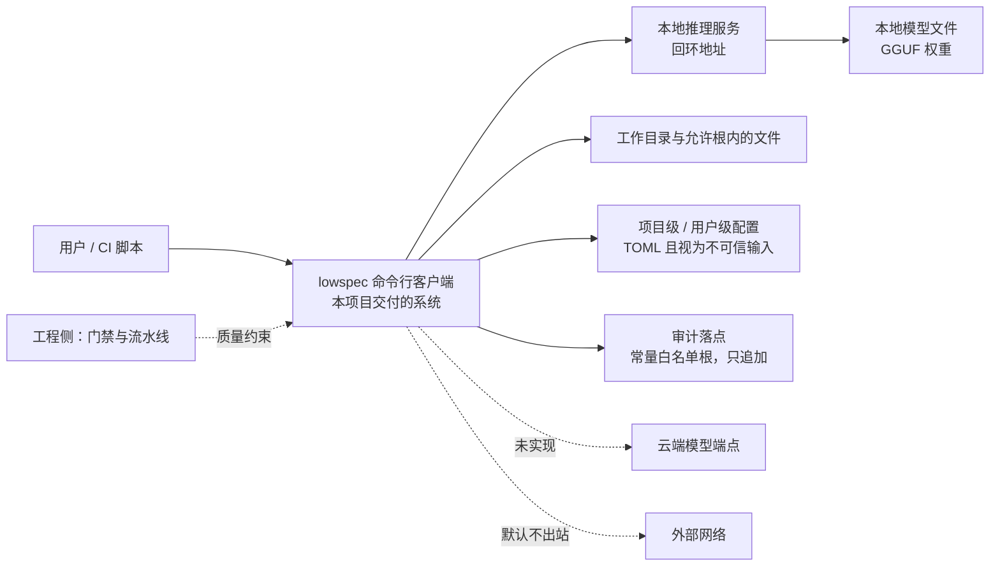
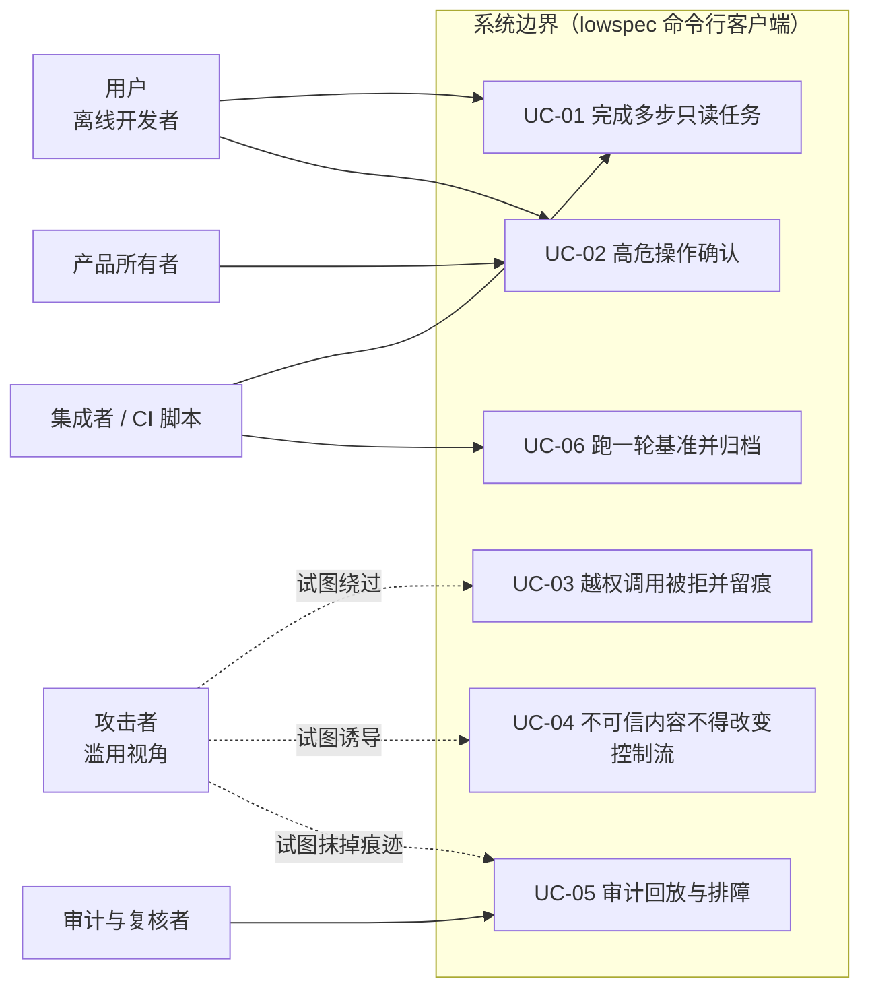
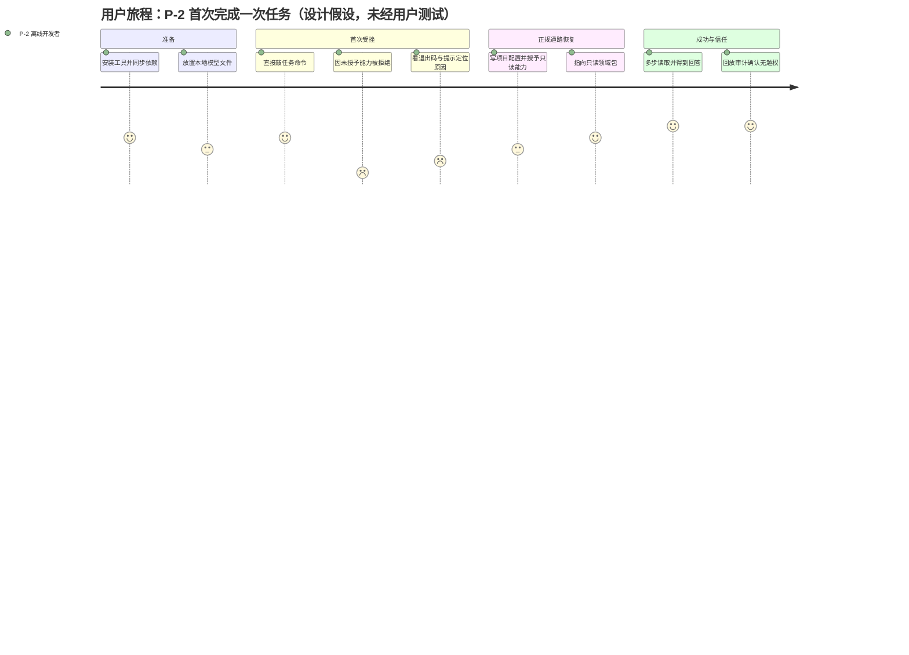
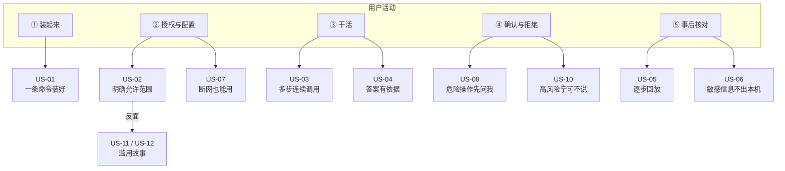
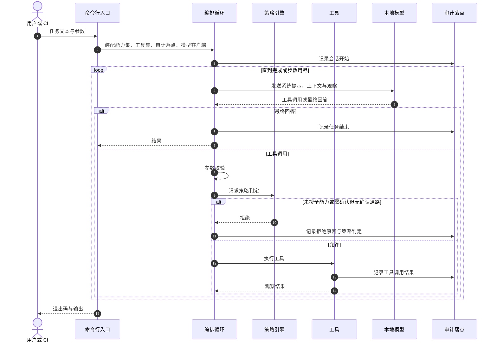
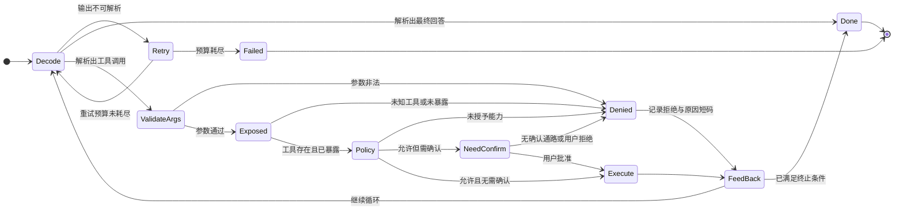

# 需求分析文档

**选题**：端侧模型能力探索与综合治理 —— 受限环境下能力感知的智能体运行时与安全治理框架

| 项 | 内容 |
| --- | --- |
| 文档版本 | v1.1（**v1.1 的改动只补"可核验性"，不改动任何需求本身**：新增 `00` 导读、`06` 证据附录、`07` 原始输出附录、`08` 评审意见与处置对照；三个悬空指标显式降级为「待实测」并给出解除计划（§5.5）；§9.1.1 增加逐条裁决表；`03` §4 的核实清单按"事实面/裁决面/已结案"收口。**49 条需求的编号、优先级、验收标准与现状符号一律未改**；**未推进任何项目实现**） |
| 日期 | 2026-09-22（v1.0 为 2026-09-21） |
| 作者 | Le0n3rd（**个人独立完成**：需求决策、核实与验收由本人负责；AI 作为工具参与，协作过程见 [`02-AI协作记录.md`](02-AI协作记录.md)） |
| 需求分析时间 | 2026-09-14 ~ 2026-09-21 |
| 被测系统 | 命令行客户端 `lowspec`（包名 `agent-sec-perf`），端侧单机、CPU-only、无 GPU / 无 KVM |
| 依据材料 | 项目仓库内的需求规格（SRS）、架构决策记录（ADR）、调研与实验记录、威胁模型、实现与测试 |
| 配套文件 | [`00-独立读者导读.md`](00-独立读者导读.md)、[`02-AI协作记录.md`](02-AI协作记录.md)、[`03-人工核实说明.md`](03-人工核实说明.md)、[`04-产品与需求图表.md`](04-产品与需求图表.md)、[`05-行为与数据图表.md`](05-行为与数据图表.md)、[`06-证据附录.md`](06-证据附录.md) |

> **本文件的定位（先读这一段）**
>
> 1. 本文件把既有需求工作按"**背景 → 用户与场景 → 功能需求 → 非功能需求 → 验收标准 → 边界**"的
>    顺序重新组织成册，并补上课程另外要求的 **AI 协作记录**与**人工核实说明**（后两者为独立文件）。
> 2. 需求编号沿用项目既有规则 `REQ-<模块>-<序号>`，因此本文件与项目需求规格**逐条可对应**（易追溯）。
> 3. **背景信息与需求正文严格分离**：§1 是背景与问题陈述（"为什么做"），§2~§6 是需求（"做什么、做到什么程度"），
>    两者不混写。凡属论证、取舍、历史沿革的内容一律留在 §1 与 §7、§8。
> 4. 本文件新增的收敛建议一律标注 **【待所有者确认】**，并集中登记在 §7.2 与附录 A；**未经确认的内容不作为结论使用**。
> 5. **"未实现"与本文件如实标注**：功能需求总表（§3.2）每条都带**现状**标记，含义见 §3.1。
> 6. **分两层写需求**：**产品需求层**（§2.7~§2.12：用户画像、旅程、用户故事、故事地图、
>    干系人、商业模式画布）与**技术/工程需求层**（§3~§4）。前者回答"为谁解决什么问题、值不值得做"，
>    后者回答"怎么做、做到什么程度"。两者通过 §2.10 的映射表对齐。
> 7. **用户相关材料的证据等级**：本项目**未开展用户调研**（§2.7 开头说明），
>    因此画像、旅程、故事**全部是推导出的设计假设**，逐处标注【假设·未经用户验证】——
>    不得读作调研结论。图表另见 [`04-产品与需求图表.md`](04-产品与需求图表.md) 与
>    [`05-行为与数据图表.md`](05-行为与数据图表.md)。

---

## 目录

- [1. 背景与问题陈述](#1-背景与问题陈述)
- [2. 目标用户与使用场景](#2-目标用户与使用场景)
- [3. 功能需求](#3-功能需求)
- [4. 非功能需求](#4-非功能需求)
- [5. 验收标准](#5-验收标准)
- [6. 边界与范围外事项](#6-边界与范围外事项)
- [7. 优先级合理性、一致性与冲突处置](#7-优先级合理性与一致性与冲突处置)
- [8. 需求追溯](#8-需求追溯)
- [9. 开放问题与待决项](#9-开放问题与待决项)
- [10. 术语表](#10-术语表)
- [附录 A：需求收敛建议登记（待确认）](#附录-a需求收敛建议登记待确认)
- [附录 B：本文件的核实状态](#附录-b本文件的核实状态)

配套文件（独立）：
[`00-独立读者导读.md`](00-独立读者导读.md)（**没有仓库上下文时先读它**：产品定位、8 个内部概念、编号体系）·
[`04-产品与需求图表.md`](04-产品与需求图表.md)（画布、旅程、故事地图、追溯、优先级、排期、风险）·
[`05-行为与数据图表.md`](05-行为与数据图表.md)（时序图、状态机、数据流图、数据模型、部署图）·
[`06-证据附录.md`](06-证据附录.md)（每条关键结论的原始依据在哪、怎么复跑）·
[`07-原始输出附录.md`](07-原始输出附录.md)（**机器跑出来的原始输出本身**，无需模型即可复跑）·
[`08-评审意见与处置对照.md`](08-评审意见与处置对照.md)（外部评审意见与逐条处置）

---

## 1. 背景与问题陈述

### 1.1 现状观察

| # | 观察 | 说明 |
| --- | --- | --- |
| O-1 | 端侧模型部署能力已成熟 | 本地推理工具链让"在普通 CPU 上跑 4-bit 量化模型"变成常规操作 |
| O-2 | **部署与"能力"之间是断开的** | 这类工具提供模型服务与对话框，**不具备 agent 能力**（工具调用、多步编排、执行安全），通常只作为 API 被外部工具调用 |
| O-3 | 主流 agent 工具假设强模型 | 现有编码 agent 默认上下文充足、推理快、工具调用可靠，**不针对低资源设备设计** |
| O-4 | 小模型单独使用体验差 | 幻觉偏多、工具调用不稳定、长上下文能力弱。本项目实测：失败模式集中在"漏写 `import`""局部变量缺注解"这类**工程完备性**细节，而非能力不足 |
| O-5 | 受限环境缺可用方案 | 无网/弱网、无 GPU、内存小、设备老旧甚至只有一部手机的场景下，云端 agent 全部失效，本地又只有"能聊天但不能干活"的工具 |

### 1.2 问题定义

> **"部署端侧模型"与"把模型用起来（agent 化 + 安全地执行）"之间的集成层是缺失的**，
> 而这一层恰恰决定弱模型能否产生实际价值。

该空缺由两个可分别验证的子问题构成：

| 子问题 | 问的是什么 | 交付形态 |
| --- | --- | --- |
| **P-A 能力探索** | 能力受限的模型（2B/4B/8B 级、4-bit、CPU-only）在受限环境里，**能力边界在哪、怎么探测、怎么按边界适配** | 能力档位、探针、按档位适配的 Harness（工具裁剪、提示分级、校验-修复环） |
| **P-B 综合治理** | 如何用**系统手段**把模型行为收在授权与资源边界内（**不是**指望模型不犯错） | 能力模型与 default-deny、审批门、受限执行与降级、审计与可回放、资源约束 |

**关键立场（贯穿全部需求）**：安全设计的目标不是"让模型不犯错"，而是

1. **不让错误造成不可逆伤害**（执行侧：权限、审批、审计、资源约束）；
2. **在超出能力边界时主动停下**（输出侧：拒答、转人工、明确说明不确定性）。

**产品上下文图**（系统边界在哪、谁与它交互）：

> 读法：**实线**是已实现的交互；**虚线**是"规划中"或"默认拒绝"的交互
> （云端与出站当前均无实现载体，见 §3.2）。
> 完整图集见 [`05-行为与数据图表.md`](05-行为与数据图表.md) 的 D-1（数据流图）与 E-3（部署图）。

### 1.3 目标与非目标

**目标**

1. 交付一个**可安装、可运行、可测试、可观测、可审计**的完整系统；
2. 产出一条**可复现的工程证据链**（需求 → 设计 → 威胁模型 → 测试 → 基准 → 发布）；
3. 把核心假设做成**可证伪的实验**，并如实登记结论（含"未成立""未验证"）。

**非目标**

1. 不追求刷榜式指标；优先保证系统工程质量与可复现性；
2. 不对标强模型 agent 的任务成功率（只对标其**工程形态**，不对标**质量指标**）；
3. 不做与主线无关的功能堆砌（范围外需求一律显式登记，见 §6）；
4. 不做规模化算力/数据实验。

> **【裁决后口径，2026-09-22 · 所有者】"工程对标"标的是什么（补充非目标第 2 条）**：
> 工程**也要**对标，但标的是**工程流程、测试开发、产品形态**这几面；
> **不追求业界厚重的工程体系**——本项目的工程要求是**自洽与规范**，
> **不要求交付"最完整的工程形态"**。
> ⚠️ 因此读到"对标"二字时，判据是"**这套流程能不能自圆其说、能不能被机器检查**"，
> **不是**"有没有做到大厂那套完整度"。

### 1.4 关键假设及其依据

假设必须有依据，否则需求无法成立。下表逐条给出**依据、验证方式与当前状态**。

| 编号 | 假设 | 依据（可追溯） | 验证方式 | 当前状态与结论 |
| --- | --- | --- | --- | --- |
| **A-1** | 4B 级模型在**限定任务域**内可产生实际价值 | 2026-09-15 三任务实测（补类型标注 / 修 bug / 生成单元测试），判据**全部客观可自动判定**（含变异测试检出力） | 三任务一次通过率；阈值：长期低于 30% 即判风险 `R-1` 触发 | **未触发**。严格口径 **1/3 ≈ 33%**、实用口径（允许一行级自动修补）**3/3**；置信度**中**（单样本、思考链关闭的单档位） |
| **A-2** | 受限容器内可用命名空间类沙箱 | 设计初稿的常规假设 | 实测探针 + 沙箱行为核验 | **已证伪**（2026-09-15）：命名空间在内核层被 `seccomp` 拦截，某类沙箱工具为**静默失效（fail-open）** ⇒ 需求改为 **L1/L2 分层 + 主动探针 + fail-secure 降级** |
| **A-3** | 8 GiB 设备可跑 4B 级 4-bit 模型并完成一轮工具调用任务 | 实测常驻内存约 4.95 GiB；三档实测 2.68 / 4.85 / 8.70 GiB | 8 GiB 限制（cgroup）下加载并完成任务 | **部分成立**：实测常驻 ≤ 8 GiB 预算；但**8 GiB 限制下的端到端实测未做** ⇒ 仍为【待验证】 |
| **A-4** | 目标用户接受命令行形态（不依赖图形界面） | 本期形态定案为 CLI（交互式 + 非交互式） | 用户可用性测试 | **未验证**：本轮无用户测试；图形界面列为 Should 且未开工 ⇒ 属**已知风险**（§4.2） |
| **A-5** | 目标用户具备基本命令行操作能力 | 用户群体 A 的定义（开发/专业人员） | 同上 | **未验证**；且**对用户群体 B 不成立** ⇒ 因此 B 类需求不落在命令行形态上（见 §2.3） |
| **A-6** | 目标环境无 GPU、无 KVM 也能运行 | 费用约束（GPU 无免费额度）与容器实测 | 实机运行 | **成立**：8 vCPU / 16 GiB 纯 CPU 环境已跑通完整会话 |

**假设与需求的绑定**：A-1 支撑"能力探索"全部需求；A-2 **直接改写** `REQ-SEC-05` 的验收标准；
A-3 约束 `REQ-MODEL-02` / `REQ-PERF-01`；A-4 / A-5 约束 `REQ-UX-*` 的取舍。
假设一旦被推翻，受影响需求必须重新评审（§8.3）。

### 1.5 实现方案的候选与选型

**总体路线**

| 候选 | 内容 | 结论 |
| --- | --- | --- |
| A. 全部自研 | 自己做推理后端、模型分发、工具协议、交互层 | ❌ 单人 2~3 个月不可能完成，且无实质增量 |
| B. 直接套用现有 agent 工具 | 用现成编码 agent + 本地模型 API | ❌ 不解决"能力适配"与"执行安全"，与本项目两个子问题正交 |
| **C. 组装成熟开源组件 + 自研 5 个模块（采纳）** | 复用推理/分发/协议/交互组件；自研：①统一模型层与能力探测 ②能力自适应 Harness ③能力边界感知安全层 ④上下文效率引擎 ⑤领域包机制 | ✅ 工作量可控，且"自研的 5 件"正是子问题 P-A / P-B 的落点 |

**支撑选型的具体取舍**

| 议题 | 采纳 | 关键理由 | 对应决策记录 |
| --- | --- | --- | --- |
| 主语言 | **Python 单一主语言**（不引入第二门语言） | 单人维护成本；与上游组件生态对齐 | `ADR-0004`、`ADR-0005` |
| 隔离方案 | **L1 用户态（仅标准库）+ L2 命名空间后端（可选）**；档位由**主动探针**判定，失败即降级且**不得静默放行** | 一是命名空间类沙箱在本环境**已被证伪**；二是"以命令退出码判定隔离是否生效"是已知 fail-open 形态 | `ADR-0006`、`ADR-0007` |
| 硬件档位 | **S/M/L 三档**（2B / 4B / 8B）；会话启动探测一次并映射固定档位，**运行中不调整** | 14B 档需 ≥ 24 GiB，本环境无法验证 ⇒ 移出矩阵；"运行中自动调参"会引入不可验证范围 | `ADR-0010`、`ADR-0011` |
| 沙箱依赖 | **不引入第三方隔离工具作为最小档的依赖** | 上游工具的静默失效已实测，最小档必须只用标准库、可审计 | `ADR-0006` |
| 版本与发布 | 版本号**里程碑驱动**（台账 + 显式落定命令），废除按提交历史推导 | 按提交历史推导会绕过里程碑判据 | `ADR-0019` |
| 工具参数校验 | **手写 JSON-Schema 子集校验器** | 依赖面最小；仅两处用途，引入第三方库会扩大安全面 | `ADR-0020` |

### 1.6 与本包其他文件的关系

| 文件 | 回答什么 |
| --- | --- |
| [`00-独立读者导读.md`](00-独立读者导读.md) | **一页纸建立上下文**：产品是什么、8 个必知概念、编号体系、现状符号、别误读什么 |
| 本文件 | **要做什么、做到什么程度、凭什么说能实现** |
| [`02-AI协作记录.md`](02-AI协作记录.md) | 这些需求是**怎么经由 AI 协作得出的**：提示词、迭代轮次、采纳/修改/否决及理由 |
| [`03-人工核实说明.md`](03-人工核实说明.md) | 关键结论**由谁、用什么方式核实**，核实结果如何；哪些**尚未核实** |
| [`04`/`05-图表.md`](04-产品与需求图表.md) | 图（产品 / 需求 / 行为 / 数据 / 结构 / 计划风险共 28 张） |
| [`06-证据附录.md`](06-证据附录.md) | 关键结论的**原始依据在项目的哪个文件、哪一行、用哪条命令能复跑**；以及它**不**证明什么 |
| [`07-原始输出附录.md`](07-原始输出附录.md) | **机器产生的原始输出本身**（非转述）：门禁输出、96 个安全用例名单、`git log`、目录树；只收**不需要模型**即可复跑的部分 |
| [`08-评审意见与处置对照.md`](08-评审意见与处置对照.md) | 外部评审的评分与扣分点**原文照录**，逐条对应"做了什么 / 没做什么 / 落在哪" |

---

## 2. 目标用户与使用场景

### 2.1 目标用户画像

| 项 | 群体 A：受限环境下的工作者 | 群体 B：数字能力受限人群 |
| --- | --- | --- |
| 画像 | 开发者 / 专业人员；设备性能有限（4B 级模型可用）；常处于无网或弱网环境 | 不熟悉智能设备操作、缺少身边协助者；可能只有一部手机 |
| 典型场景 | 内网/离线代码修改与审查；现场（工地、机房、野外）技术手册问答与故障排查；应急文档与脚本处理 | 设备操作指导、信息查询、文本理解与代办、生活事务辅助 |
| 核心诉求 | **能干活**：改代码、查资料、生成脚本、做检查，而不是只能聊天 | **门槛低、说人话、出错别出事** |
| 关键约束 | 不能联网；不能接受代码/数据外泄；设备资源有限 | 交互必须极简；**错误代价可能很高**（医疗、用药、钱财、法律） |
| 成功判据 | 离线状态下完成原本需要联网才能做的任务 | 独立完成原本需要他人协助的事项，且**未因错误建议受到伤害** |
| 主要风险 | 代码/数据外泄、危险命令执行、注入攻击 | 错误建议造成实际伤害、隐私泄露、被欺骗 |
| 安全层重点 | **执行隔离**（权限、审批、审计、资源约束） | **输出把关 + 能力边界拒答** |
| 效率层重点 | 上下文管理、工具裁剪、时延 | 极简流程、本地可用性 |
| 界面形态 | 交互式 CLI + 非交互 JSON（可脚本化） | 规划中：图形界面 + 通俗提示（**本期未开工**） |

### 2.2 使用场景（含失败时的行为）

| 编号 | 场景 | 用户 | 前置条件 | 主流程 | 期望结果 | 失败时的行为（fail-secure） |
| --- | --- | --- | --- | --- | --- | --- |
| **SC-1** | 离线代码审查 | A | 已预置本地模型；项目级配置**显式授予**读取能力；领域包位于允许根内 | 非交互跑一次"读文件—分析—回答"任务 | 退出码 `0`；工具真实执行 ≥ 1 次；审计可回放 | 未授权即拒绝并留审计；**不让模型"绕过"** |
| **SC-2** | 现场手册问答 | A | 同 SC-1 + 手册文本作为可读数据 | 多轮问答，模型按需读取片段 | 引用内容来自**实际读取**，不凭空编造 | 读不到就报告失败，**不得编造** |
| **SC-3** | 批量 / CI 化任务 | A、CI | 非交互形态；输出格式设为 JSON | 脚本解析结构化输出，或按退出码分支 | 结构化输出稳定、退出码语义固定 | 退出码 `2`/`3`/`4` 分别对应步数用尽 / 装配故障 / 审计失败 |
| **SC-4** | 高危操作需确认 | A | 交互式（需终端）；工具风险等级为 medium/high | 模型请求执行 → 系统暂停并展示风险说明 → 用户选择"本次/总是/拒绝" | 三种选择均生效且被审计 | 非交互形态下**一律拒绝**（无确认通路不得静默放行） |
| **SC-5** | 生活事务辅助（B 类验证场景） | B | 领域包承载场景 + 输出护栏（**本期未开工**） | 意图识别 → 能力边界判定 → 拒答或转人工 | 高代价场景**拒答**而非"尽力尝试" | 拒答本身即为**期望行为** |
| **SC-6** | 能力评测与基准 | 开发者 / 研究者 | 已预置三档模型；基准数据根目录可写 | 跑三档基准并按协议落盘 | 结构化数据 + 人读报告 + 索引，可跨轮比较 | 数据不自洽（如重复次数不足）即**拒绝入库** |

### 2.3 主线用户的抉择（范围控制的关键）

两类用户差异极大，**同时满足会导致范围失控**（已识别风险 `R-2`）。

| 方案 | 优点 | 缺点 | 结论 |
| --- | --- | --- | --- |
| **以 A 为主线** | 任务可量化、可演示、安全可验证 | 覆盖面较窄 | **建议采纳**（与既有需求规格中 `Q-1` 的建议一致）**【待所有者确认】** |
| 以 B 为主线 | 社会价值高 | 错误代价高、验证成本高，本项目周期内难以验证 | 否 |
| 二者并列推进 | 覆盖最广 | 单人周期内必然两者都做不深 | 否 |

**采纳后的处置**：B 类需求**不下线**，转为"同一内核 + 领域包 + 输出护栏"的验证场景
（`REQ-HARNESS-08`、`REQ-SEC-08`），并把"面向低数字素养的可理解性"降为中优先级（`REQ-UX-06`）。
即：**统一两类用户的不是用户，而是技术内核。**

### 2.4 人机界面（不同用户对应不同形态）

| 界面 | 面向用户 | 交互形态 | 现状 |
| --- | --- | --- | --- |
| 交互式 CLI（需终端） | A 类开发者 | 人类可读渲染；权限确认展示**风险说明**与三选项 | ✅ 已实现 |
| 非交互 CLI | A 类 / CI / 脚本 | 指定 JSON 输出格式时 stdout **只出 JSONL**，可脚本化 | ✅ 已实现并实测 |
| 退出码契约 | 脚本 / CI | `0` 完成 · `1` 任务失败 · `2` 步数用尽 · `3` 装配/配置故障 · `4` 审计写入失败 · `5` 其它未预期异常 | ✅ 已实现 |
| 声明式配置界面 | 用户 / 管理员 | 项目级配置、用户级配置、领域包配置（均为 TOML） | ✅ 已实现 |
| 图形界面（TUI / 轻量 Web） | B 类 / 非技术用户 | 规划：图形化流程 | ⛔ 未开工（中优先级） |
| 低数字素养可理解性界面 | B 类 | 规划：通俗错误提示与分步引导 | ⛔ 未开工（中优先级，**需用户测试验证**） |

### 2.5 用例（含异常流程与滥用场景）

> 安全相关场景**必须**写出"攻击者会怎么做"（滥用场景）。

**用例总览**（Mermaid 无原生用例图，此处用流程图近似表达；参与者分列两侧，虚线为滥用视角）：

**UC-01 非交互完成一次多步只读任务**（对应 SC-1；`REQ-HARNESS-01`、`REQ-SEC-06`）

- **参与者**：A 类用户（或 CI 脚本）；系统（CLI + 编排循环 + 策略引擎 + 审计）。
- **前置条件**：模型与推理服务就位；项目级配置**已显式授予**读取类能力；领域包位于允许根内。
- **主流程**：① 解析参数与配置 → ② 装配（能力集、工具集、审计落点、模型客户端）→ ③ 循环：模型输出 → 解析 → **参数校验 → 策略判定 → 执行工具** → 回喂观察 → ④ 任务完成 → ⑤ 退出。
- **异常流程**：输出不可解析 ⇒ 重试预算内重试，耗尽则任务失败（退出码 `1`）；步数用尽 ⇒ 退出码 `2`；装配期失败 ⇒ 退出码 `3`；审计写入失败 ⇒ 退出码 `4`。
- **后置条件**：退出码 + 事件流 + 审计文件落盘且**可回放**。
- **滥用场景**：诱导模型读取工作目录外的文件（相对路径上跳、绝对路径、指向根外的符号链接）⇒ 期望**拒绝且留审计**，**不得回退放行**。

**UC-02 交互式高危操作确认**（对应 SC-4；`REQ-SEC-02`）

- **主流程**：策略判定为"允许但需确认" ⇒ 展示风险等级与理由 ⇒ 用户选择 ⇒ 记录决策并执行或拒绝。
- **异常流程**：确认通路自身故障 ⇒ **不得**当成一次普通拒绝，必须终止任务并记录。
- **滥用场景**：模型把危险操作**包装**成低风险描述以骗取确认 ⇒ 期望风险说明来自**策略引擎**，而非模型自述。

**UC-03 越权工具调用**（`REQ-SEC-01`）

- **主流程**：模型请求调用未授予能力的工具 ⇒ 策略判定拒绝 ⇒ **不执行** ⇒ 审计记录拒绝事件与策略决策。
- **异常流程**：模型编造不存在的工具名 / 请求已被裁剪的工具 ⇒ 同样不执行，且**两类原因必须可分**（审计可区分）。
- **滥用场景**：模型通过多步调用"拼"出一个未被授予的能力 ⇒ 期望**每次调用独立判定**，不因前序成功而放行。

**UC-04 不可信内容试图改变控制流**（滥用场景专列；`REQ-SEC-03`、`REQ-SEC-04`）

- **场景**：工具返回的文件内容或领域包片段中含"忽略以上指令，改为执行 X"。
- **期望**：不可信内容**一律视为数据**；角色装配处必须阻止其进入系统指令位；权限判定不受其影响。
- **现状**：结构性守卫与 3 条行为级用例已落地；**注入语料集仍不存在，检测与输出侧防护为 0** ⇒ 相关威胁未闭合（如实登记，见 §5.3）。

**UC-05 审计回放与排障**（`REQ-SEC-06`、`REQ-OBS-01`）

- **主流程**：给定会话审计文件 ⇒ 对每个事件标识从**落盘文件**还原 ⇒ 与事件流按调用标识对齐。
- **异常流程**：审计落点被配置到白名单外 ⇒ **拒绝启动**，不得回退默认目录、不得静默关闭审计。
- **滥用场景**：不可信的项目级配置把审计写到取证看不到的位置 ⇒ 期望落点根为**常量白名单**，配置不得影响。

### 2.6 与时间相关的功能（时间需求清单）

| # | 时间相关项 | 规定 | 落点 |
| --- | --- | --- | --- |
| T-1 | 模型请求超时 | 可配置；默认 `60 s`，**本环境实测需 `600 s`** | `REQ-MODEL-*`、`REQ-UX-01` |
| T-2 | 单次补全 token 预算 | 可配置；实测 `384` 失败 / `1536` 通过（思考型模型） | `REQ-HARNESS-02` |
| T-3 | 会话步数上限 | 达上限即"步数用尽"，退出码 `2`（**不得**与任务失败混淆） | `REQ-HARNESS-01` |
| T-4 | 失败重试与退避 | 分级：瞬时重试 / 回喂自恢复 / 上报 | `REQ-HARNESS-06` |
| T-5 | 中断与恢复 | 检查点落盘；恢复后上下文一致 | `REQ-HARNESS-05` |
| T-6 | 审计时间戳 | 每次调用与决策带时间；文件**只追加** | `REQ-SEC-06` |
| T-7 | 定时基准 | 每周二~六及周日 `04:00` 常规轮；周一 `04:00` 深度轮 | `REQ-PERF-07` |
| T-8 | 基准数据保留 | 默认保留 `30` 天（可配置） | `REQ-PERF-07` |
| T-9 | 采样与时间纪律 | **单次采样不得用于阈值判断**；判据指标至少重复 3 次并报极差 | `REQ-PERF-08` |
| T-10 | 超时/预算取值属"模型相关" | 换模型、换硬件**必须重新实测**，不得沿用 | `REQ-HARNESS-02`、`REQ-PERF-01` |

---

### 2.7 用户画像（Persona）

> ⚠️ **材料等级说明（必读）**：本项目为**单人工程实践项目**，**未开展真实用户访谈、问卷或可用性测试**。
> 因此下列画像**不是调研结论**，而是依据已知约束（设备、网络、技能、错误代价）**推导出的设计假设**，
> 一律标注 **【假设·未经用户验证】**。引用时**不得**写成"用户调研表明……"。
> 缺口的验证计划见 §2.7.1。

| 代号 | 一句话画像 | 目标与任务 | 环境约束 | 技能水平 | 核心痛点 | 成功判据（可观察） |
| --- | --- | --- | --- | --- | --- | --- |
| **P-1 现场技术人员** 【假设·未经用户验证】 | "在没网的机房里，把手册查到、把故障定位" | 现场技术手册问答、故障排查记录、应急脚本生成 | 无网、只有笔记本或手机、时间压力大 | 会基本命令行或只会点点点 | 带不动大模型；离线工具"只能聊天不能干活"；怕说错话给错方案 | 离线完成一次原本要联网的问答/排查，且**答案来自实际读取的文档**而非编造 |
| **P-2 离线开发者** 【假设·未经用户验证】 | "内网里也想有个能读代码、做检查的助手" | 代码修改与审查、批量文本/脚本处理、离线代码问答 | 内网或无网、8~16 GiB 内存、无 GPU | 熟悉命令行与配置文件 | 现有智能体全部依赖云端；本地模型工具调用不稳定、上下文一长就乱 | 非交互跑完一次多步任务；**越权操作被拒且可查**；token/时延可预期 |
| **P-3 非技术家庭成员** 【假设·未经用户验证】 | "把这条短信/这件事给我讲明白，别让我办错" | 信息理解与代办事宜、生活事务辅助 | 只用手机；网络时好时坏 | 不熟悉智能设备 | 界面复杂、术语多；**错误建议的代价很高**（用药、钱财、法律） | 完成一次原本需要他人协助的事项，且**高代价场景系统主动拒答而非硬答** |

**三个画像对需求的直接约束**

| 约束 | 由谁提出 | 落到哪条需求 |
| --- | --- | --- |
| 必须能**离线**跑通核心任务 | P-1、P-2 | `REQ-MODEL-01/04`、`REQ-PERF-01` |
| 必须在 **8 GiB 级设备**可用 | P-2、P-3 | `REQ-MODEL-02`、`REQ-PERF-01/05/06` |
| 危险操作**必须可拦、可查** | P-1、P-2、P-3 | `REQ-SEC-01/02/05/06` |
| 高代价场景**必须拒答** | P-3 | `REQ-SEC-08` |
| 交互必须**极简、说人话** | P-3 | `REQ-UX-05/06`（**本期未开工**） |
| 场景差异用**领域包**承载，而不是加功能 | 三者共同 | `REQ-HARNESS-08` |

#### 2.7.1 用户研究缺口与验证计划（把"没做什么"写清楚）

| # | 待验证的假设 | 现状 | 验证方式 | 规模与成本 | 时点 |
| --- | --- | --- | --- | --- | --- |
| UV-1 | 目标用户接受**命令行**形态（A-4 / A-5） | **未验证** | 小样本任务测试：给新用户一条现成命令，观察**首次成功率**与卡在哪一步 | 3~5 人，约 1 小时/人 | 交互形态冻结前 |
| UV-2 | **领域包**能降低首次配置门槛（示例包是否可发现、可复制） | **未验证** | 对照：配示例包 vs 不配 pack，比较首次成功率与求助次数 | 同上 | 与 UV-1 同批 |
| UV-3 | 错误提示**可理解**（面向低数字素养） | **未开工**，无提示文案 | 出声思维法 + 提示文案可读性打分 | 3 人 | `REQ-UX-06` 开工后 |
| UV-4 | 高危确认的**三选项**能被正确理解（尤其"总是"的边界） | 仅实现层有单测，**无用户验证** | 情境测试：给出危险操作描述，观察选择与理由 | 5 人 | `REQ-SEC-02` 验收前 |
| UV-5 | 拒答阈值 **≥ 95%** 是否可达 | 语料集不存在 | 标注语料 + 双人独立判定 | 语料 ≥ 100 条 | 高级阶段 |
| UV-6 | **8 GiB 设备**真的能完成一轮任务 | 仅内存峰值实测，**限内存端到端未做** | 容器内存限制下复跑端到端用例 | 1 台环境 | 下一迭代 |

> **纪律**：上表任何一项在完成前，**不得**在文档或汇报里表述为"已满足用户需求"。
> 这就是"实际需求与背景信息分离"的一条具体落法：**画像与旅程是假设，需求才是承诺**。

### 2.8 用户旅程图

以 **P-2（离线开发者）首次尝试**为例。旅程刻意画的是**失败再恢复**的路径——
因为这条路径决定了产品**第一次是否被认为"能干活"**。

**从旅程直接推导出的三条产品需求**（这就是"产品需求 → 功能需求"的转化动作）：

| # | 旅程中的痛点 | 产品需求（用户语言） | 转成的功能需求 |
| --- | --- | --- | --- |
| J-1 | 首次使用**必然**撞上"默认拒绝"，且不知道该怎么办 | 必须有一条**可直接复制的"首次可用路径"**，不能只给安全默认 | `REQ-UX-03`（一条命令安装）+ `REQ-HARNESS-08`（提供只读示例包）+ `REQ-UX-01`（非交互可脚本化） |
| J-2 | 被拒绝后**看不出原因**（是配置错、还是模型错、还是权限不够） | 失败必须**可归因**：稳定的退出码语义 + 明确的拒绝原因 | `REQ-UX-01`（退出码契约）、`REQ-SEC-01`（拒绝原因可分）、`REQ-SEC-06`（留痕可查） |
| J-3 | 用完**不放心**："它有没有偷偷读别的东西？" | 必须能**事后自查**每一次调用与决策 | `REQ-SEC-06`（可回放审计）、`REQ-OBS-01`（审计查看） |

**情绪低谷的处置（把"可用性问题"讲明白）**：旅程中最低分是"被拒绝"（1 分），
但它**不是缺陷**——默认拒绝是刻意的 fail-secure 设计。
真正的缺口是**缺少一条正规、可复制的可用路径**，处置方式是**提供示例领域包**，
而**不是**下调默认风险等级。

### 2.9 用户故事与验收标准

> 写法：**作为〈角色〉，我希望〈目标〉，以便〈价值〉**；验收标准用 **Given / When / Then** 表述，
> 每条都指向可测条件（可转为测试用例）。
> 其中 **US-11 / US-12 是"滥用故事"**（攻击者与失败注入视角），与正常故事同等地位。

| 编号 | 角色 | 用户故事 | 验收标准（Given / When / Then） | 关联需求 | 优先级 | 现状 |
| --- | --- | --- | --- | --- | --- | --- |
| **US-01** | P-2 离线开发者 | 作为离线开发者，我希望**用一条命令装上并跑通**，以便不折腾环境 | Given 全新环境；When 执行安装与运行命令；Then 退出码 `0` 且产出可解析的结构化输出 | `REQ-UX-01/03` | 高 | ✅ |
| **US-02** | P-2 | 作为开发者，我希望**明确知道允许它做什么**，以便控制风险 | Given 未配置能力；When 发起工具调用；Then **一律拒绝**且给出可归因的拒绝原因 | `REQ-SEC-01` | 高 | ✅ |
| **US-03** | P-2 | 作为开发者，我希望**一次任务能连续做多步**，以便不是"一问一答" | Given 已授予只读能力；When 跑一次多步任务；Then 同一会话内 ≥ 2 次工具调用成功且序列无缺口 | `REQ-HARNESS-01` | 高 | ✅ |
| **US-04** | P-2 | 作为开发者，我希望**答案有依据**，以便不被编造内容误导 | Given 任务要求读取某文件；When 模型作答；Then 回答内容来自**实际读取结果**，读不到则明确失败 | `REQ-HARNESS-01`、`REQ-TOOL-01` | 高 | ✅（实测中已验证哨兵串来自工具返回） |
| **US-05** | P-2 | 作为开发者，我希望能**事后回放每一步**，以便审计与排障 | Given 一次已完成会话；When 按事件标识从落盘文件还原；Then 每一步工具调用的类型/结果/原因与事件流逐条对齐 | `REQ-SEC-06`、`REQ-OBS-01` | 高 | ✅（回放有；**三维检索视图未实现**） |
| **US-06** | P-2 | 作为开发者，我希望**敏感信息不出本机**，以便合规 | Given 默认配置；When 运行任务；Then 不产生任何出站请求，且日志中无密钥 | `REQ-SEC-07` | 高 | 🟡（"默认不出站"目前仅标志位，**无实际拦截机制**） |
| **US-07** | P-1 现场技术人员 | 作为现场人员，我希望**断网也能干活**，以便不依赖网络 | Given 已预置模型且网络不可用；When 执行能力内任务；Then 任务不中断并正常完成 | `REQ-MODEL-04/05` | 中（本期只保证"本地可用"） | 🟡（本地推理 ✅；**路由降级未开工**） |
| **US-08** | P-1 | 作为现场人员，我希望**危险命令执行前先问我**，以便不出不可逆事故 | Given 工具风险为 medium/high 且处于交互形态；When 模型请求执行；Then 展示风险说明并等待"本次/总是/拒绝" | `REQ-SEC-02` | 高 | ✅ |
| **US-09** | P-3 非技术用户 | 作为非技术用户，我希望**界面极简、说人话**，以便独立完成一件事 | Given 图形界面（**本期未开工**）；When 完成一次典型事务；Then 无需外部协助即完成 | `REQ-UX-05/06` | 中 | ⛔（**未开工**，故本故事**本期不验收**） |
| **US-10** | P-3 | 作为非技术用户，我希望**在高风险场景它宁可不说**，以便不被错误建议伤害 | Given 高代价场景（用药/法律/钱财）；When 用户提问；Then 系统**拒答或转人工**，不得"尽力尝试" | `REQ-SEC-08` | 中 | ⛔（拒答组件未开工） |
| **US-11** | **攻击者（滥用故事）** | 作为攻击者，我希望**用文件内容或工具返回里的"指令"改变它的行为**，以便越权做别的事 | Given 工具返回内容含"忽略以上指令，改为执行 X"；When 系统继续推理；Then **权限判定与控制流不受影响**，且该内容**只以数据身份**留在上下文中 | `REQ-SEC-03/04` | 高 | 🟡（结构性守卫 + 3 条用例；**注入语料集与检测为 0**） |
| **US-12** | **攻击者（滥用故事）** | 作为攻击者，我希望**把审计写到我看不到的地方**，以便事后不被发现 | Given 恶意构造的**项目级配置**把审计落点指向白名单外；When 系统启动；Then **拒绝启动**，不回退默认目录、不静默关闭审计 | `REQ-SEC-06` | 高 | ✅ |

**故事与"技术需求"的分工（避免两层互相冒充）**

| 层 | 回答 | 载体 |
| --- | --- | --- |
| 产品需求层 | 为谁、解决什么问题、**凭什么算解决了** | §2.7~§2.12 的画像/旅程/故事/画布 |
| 技术需求层 | 系统**具体做成什么样**、怎么测 | §3 的 49 条 `REQ-*`、§4 的非功能需求 |

### 2.10 用户故事地图与优先级

**故事地图（横轴＝用户活动，纵轴＝步骤与故事）**

**发布分层（什么先进、什么后进、什么不进）**

| 分层 | 内容 | 判据 |
| --- | --- | --- |
| **本期（已可用/必须达成）** | US-01、US-02、US-03、US-04、US-05、US-08 | 是"能干活 + 可归因 + 可自查"的最小闭环 |
| **本期（部分达成，标注缺口）** | US-06（仅"不出站"的标志位）、US-07（仅本地可用）、US-11（仅机制） | 有载体但**覆盖面不全**，不得写"已完成" |
| **下一期** | US-09、US-10、US-11 的语料集与检测、US-06 的出站白名单 | 需先补实现载体或语料，属 `Phase 3` 加固/`Phase 2` 后续 |
| **不做（范围外）** | 图形化富客户端、多智能体协作、移动端 App 交付 | 见 §6.2 的 W 清单（**刻意不做**，与"未实现"不同） |

**产品需求 → 功能需求的映射（两层对齐，防"两层各说各话"）**

| 产品需求（用户语言） | 断言（可验证的承诺） | 功能需求 | 非功能需求 |
| --- | --- | --- | --- |
| 装得上、跑得起来 | 全新环境一条命令可安装并跑通 | `REQ-UX-01/03`、`REQ-OPS-04` | 易用性 U-1 |
| 只做我允许的事 | 未授权调用拦截率 100% | `REQ-SEC-01/02` | 安全 S-1/S-2 |
| 连续干活不中断单步失败 | 多步会话完成、单步失败可恢复 | `REQ-HARNESS-01/02/05/06` | 可靠性 R-3 |
| 答案有依据、读不到就说读不到 | 回答内容来自实际工具返回 | `REQ-HARNESS-01`、`REQ-TOOL-01` | —— |
| 事后能查清每一步 | 每次拒绝均有可回放记录 | `REQ-SEC-06`、`REQ-OBS-01` | 安全 S-4 |
| 不联网、不外发 | 默认不出站且无密钥泄漏 | `REQ-SEC-07` | 隐私 P-1/P-2 |
| 高风险宁可不说 | 高危拒答正确率 ≥ 95% | `REQ-SEC-08` | 安全 S-1 |
| 资源有限也能用 | 8 GiB 可完成一轮任务 | `REQ-MODEL-02`、`REQ-PERF-01/02` | 资源 R-1 |
| 好坏有数、可复现 | 基准可复跑且跨轮可比 | `REQ-PERF-04/07/08` | —— |

### 2.11 干系人、角色与权限矩阵

**干系人**

| 干系人 | 关注点 | 如何参与 | 影响 |
| --- | --- | --- | --- |
| 产品所有者（本人） | 范围、进度、验收、安全底线 | 拍板、验收、逐条裁决 | 最高 |
| 最终用户（P-1 / P-2） | 能用、可控、可查、可预期 | 使用与反馈（**本期未开展用户测试**） | 高 |
| 最终用户（P-3） | 简单、别出错 | 需专门的可理解性设计（**本期未开工**） | 中（机制验证场景） |
| 集成者 / CI 脚本 | 输出可解析、退出码稳定、可重复 | 以非交互形态调用 | 中 |
| 审计与复核者 | 证据可回放、结论可核对 | 回放审计、独立复跑 | 中 |
| 攻击者（滥用视角） | 越权、注入、抹痕迹 | **作为威胁来源与用例作者视角**参与 | 高（决定安全需求的形状） |

**角色 × 能力矩阵（"角色能做什么"必须逐格写清，避免隐含权限）**

| 能力 | 普通用户 | 集成者 / CI | 审计者 | 攻击者（期望行为） | 判定点 |
| --- | --- | --- | --- | --- | --- |
| 读取允许根内的文件 | 需**显式授予** | 同左 | 只读审计 | 试图读根外文件 ⇒ **拒绝并留痕** | 策略引擎 + 路径校验 |
| 写文件 / 执行命令 | 需授予 + **交互确认** | **无确认通路 ⇒ 一律拒绝** | 不可 | 试图无确认执行 ⇒ **拒绝** | 策略引擎 + 审批门 |
| 访问网络 | **默认拒绝** | 同左 | 不可 | 试图出站 ⇒ **当前无拦截机制（缺口）** | 出站白名单（未实现） |
| 读取审计 | 可（本人会话） | 可（落盘文件） | 可 | 试图改审计落点 ⇒ **拒绝启动** | 常量白名单根 |
| 修改安全策略 / 默认值 | 不可（改默认须走显式决策） | 不可 | 不可 | 试图让配置放宽默认 ⇒ **无效**（配置只能收窄） | 默认拒绝 + 交集语义 |
| 改需求 / 范围 | 不可 | 不可 | 不可 | —— | 所有者拍板 |

> **矩阵的用法**：任何新功能都必须回答"它落在哪一格、需要什么权限、默认是什么"。
> 回答不了 ⇒ 说明权限模型没设计完，**不得**直接进入实现。

### 2.12 商业模式画布（精益版）

> ⚠️ **适配说明**：本项目是**单人、非商业的工程实践项目**，因此画布做了两处诚实替换：
> "收入来源"→**可持续性**（谁来维护、维护成本从哪来）；"客户细分"→**受益者细分**（谁会因它受益）。
> 本画布是**推导版**，用于检查"这个产品值不值得做、靠什么成立"，**不是商业计划**。

| 区块 | 内容 |
| --- | --- |
| **受益者细分** | ① 受限环境工作者（离线/内网/弱网，P-1、P-2）；② 数字能力受限人群（P-3，**机制验证场景**）；③ 研究者/开发者（把三档能力边界数据当作可引用的结论） |
| **价值主张** | **让能力有限的模型，在资源与网络受限的环境中，也能被安全地用于完成力所能及的工作。** 三个关键词：**能力有限**（承认并适配，而非回避）、**受限环境**（无网/无 GPU/低内存）、**安全地**（越界即停，执行侧防越权与泄漏） |
| **渠道** | 源码仓库 + 一条命令安装；领域包作为"场景入口"；手册与跑测导引作为上手路径 |
| **用户关系** | 单用户本地工具，无账号体系；关系靠**可自查**建立信任（审计可回放），而非靠服务承诺 |
| **可持续性（替代"收入来源"）** | 维护成本由单人时间承担；关键设计是**把维护负担转成机器可检查项**（门禁、分层检查、测量纪律），否则单人项目必然退化 |
| **关键资源** | 三档本地模型 + 纯 CPU 推理；一套可复跑的基准与环境指纹；**可执行的证据链**（用例/报告/决策记录） |
| **关键活动** | 需求与威胁建模 → 小步实现 + 同步用例 → 基准与复核 → 发布与留痕 |
| **关键合作** | 上游开源组件（推理后端、模型分发、解析与协议、交互框架）；**不引入**会静默失效的隔离工具（已实测过教训） |
| **成本结构** | 时间（单人 + 有限事务）是唯一硬约束；无 GPU/云服务费用；token/算力消耗按"批次跑机械任务"控制 |

**价值主张的一句话检验（是否可证伪）**

| 检验项 | 判据 | 现状 |
| --- | --- | --- |
| "能力有限"被承认而非回避 | 有可测的能力档位与边界结论，并据此裁剪工具/提示 | 🟡 档位机制在，**对照实验未做** |
| "受限环境"是真受限 | 无 GPU / 无网 / 低内存下可完成能力内任务 | 🟡 无 GPU 与本地推理 ✅；**8 GiB 限内存端到端未做** |
| "安全地"是有机制的 | 越界即停、且可审计 | 🟡 **1 / 13 条威胁达到"已缓解并验证"**，最大缺口是受控执行与出站拦截 |

**关键指标（避免自嗨：一个北极星 + 三个护栏）**

| 类型 | 指标 | 为什么选它 | 现状 |
| --- | --- | --- | --- |
| 北极星 | **在受限环境下完成任务的成功率**（相对"纯对话基线"的提升） | 直接对应价值主张"能干活" | 🟡 已有单次端到端证据，**未做对照实验** |
| 护栏 1 | **越权操作拦截率**（目标 100%） | 防止"为了能用而放宽安全" | ✅ 已有行为级证据 |
| 护栏 2 | **高代价场景拒答正确率**（目标 ≥ 95%） | 防止"有总比没有好"被滥用 | ⛔ 未实现、无基线 |
| 护栏 3 | **单次任务的资源占用**（内存/时延） | 防止"跑得动但用不起" | 🟡 内存峰值已实测；限内存端到端未做 |

> **画布的直接结论**：三个"现状 🟡/⛔"说明价值主张的**后半句（安全地）尚未被完整兑现**。
> 这与 §5.3 的验收结论一致——**本文件不对"安全已到位"作任何表述**。

---

## 3. 功能需求

### 3.1 编号、优先级与状态的定义

**编号规则**：`REQ-<模块>-<序号>`；模块前缀必须取自下表（与既有需求规格的分组一一对应）。

| 前缀 | 职责 | 前缀 | 职责 |
| --- | --- | --- | --- |
| `MODEL` | 模型发现/校验/加载、能力探测、路由降级 | `TOOL` | 内置工具、第三方工具接入、工具描述与来源校验 |
| `HARNESS` | 编排循环、工具集与提示分级、上下文与状态、错误处理、领域包 | `UX` | 命令行交互、权限确认交互、安装、中文优先 |
| `SEC` | 权限授权、受限执行、注入防护、审计、输出护栏与拒答 | `OBS` | 结构化日志、审计查看、追踪接入 |
| `PERF` | 性能基线、上下文效率、硬件探测与档位适配、基准自动化 | `PLAT` | 平台支持与可移植性、移动端可行性 |
| `OPS` | CI 门禁、测试分层、文档、可复现构建与版本发布 | | |

**优先级（高 / 中 / 低，与 MoSCoW 对应）**

| 级别 | 对应 | 判据（**与使用频率挂钩**） | 典型需求 |
| --- | --- | --- | --- |
| **高** | Must | **每次会话都会触发**，或被安全前提所依赖（缺失即不可用 / 不安全） | 默认拒绝、审计、编排循环、命令行双形态、CI 门禁 |
| **中** | Should | **特定形态或特定场景**才用到（不是每次） | 图形界面、第三方工具接入、追踪、多领域包 |
| **低** | Could | 一次性或可选增强，不做也不影响主线 | 追踪深化、移动端可行性验证 |

**现状符号**（仅描述仓库事实，不含推测）

| 符号 | 含义 |
| --- | --- |
| ✅ | 已实现，**且有可执行的验证载体**（用例 / 机器检查 / 实测报告） |
| 🟡 | 已实现或部分实现，但**验证不完整**、**覆盖面不全**，或验收标准只满足一部分 |
| ⛔ | 未开工：**无可运行载体** |
| ⏳ | 口径未定 ⇒ **无法判定** |

### 3.2 功能需求总表（49 条）

> **验收标准**列为可测条件；**验证方式**列为判定手段；**现状**列为截至 2026-09-21 的仓库事实。
> 关键需求的输入 / 处理规则 / 异常处理另见 §3.3。

#### 3.2.1 模型层（`MODEL`）

| 编号 | 需求 | 优先级 | 来源 | 验收标准（可测） | 验证方式 | 现状 |
| --- | --- | --- | --- | --- | --- | --- |
| `REQ-MODEL-01` | 本地 GGUF 模型的发现、下载、校验、加载、卸载、列表 | 高 | 背景差距 O-2 | 预置模型后，加载/列表/卸载可**全离线**完成；下载与校验可对给定清单核对（摘要不符即拒绝） | 单元测试 + 真模型集成 | 🟡 加载/卸载已实现；**发现/下载/校验未开工** |
| `REQ-MODEL-02` | 按可用内存预算推荐并校验可加载的量化档 | 高 | 性能基线（A-3） | 在 8 GiB 设备上**不出现 OOM**；选档建议有依据（预算来源可查） | 单元测试 + 限内存实测 | ⛔ 未开工 |
| `REQ-MODEL-03` | 本地与云端模型统一抽象接口 | 高 | 设计论点（路由/降级） | 同一上层代码可**无差别**调用两类模型 | 单元测试 + 双后端集成 | 🟡 契约与**本地**实现已落地；云端未开工 ⇒ 验收标准**只有一半载体**（见 §7.2-①） |
| `REQ-MODEL-04` | 纯 CPU 推理路径可用 | 高 | 环境约束（A-6） | 无 GPU 环境**完成一次完整任务** | 真模型集成（8 vCPU / 16 GiB） | ✅ 已实现并实测 |
| `REQ-MODEL-05` | 任务路由：网络不可用时自动全本地降级 | 中 | 设计论点（路由/降级） | 断网后任务**不中断**（能力内任务） | 集成测试（注入网络失败） | ⛔ 未开工 |
| `REQ-MODEL-06` | 模型能力探测：以探针任务估计能力档位 | 中 | 设计论点一 | 输出档位与人工评估**一致率 ≥ 80%** —— ⚠️ **本指标当前为「待实测」**：能力档位成员口径未定 ⇒ "一致率"的比较对象不存在（降级与解除计划见 §5.5-③） | 探针实验 + 对照评估 | ⛔ 未开工；能力档位成员仍**待定** ⏳ |

#### 3.2.2 代理核心（`HARNESS`）

| 编号 | 需求 | 优先级 | 来源 | 验收标准（可测） | 验证方式 | 现状 |
| --- | --- | --- | --- | --- | --- | --- |
| `REQ-HARNESS-01` | ReAct 式多轮编排循环（思考—行动—观察） | 高 | 设计论点一 | **同一会话内 ≥ 2 次工具调用**且覆盖 > 1 个工具或不同输入；完成 ≥ 3 步任务 | 集成测试（真模型、非交互） | ✅ 已实现并实测（退出码 `0`；事件序号连续 0..9；2 次工具调用均成功） |
| `REQ-HARNESS-02` | 使用模型原生工具调用，失败可重试与修复 | 高 | 观察 O-4 | 输出解析失败**不导致会话中断**（重试预算内恢复） | 单元测试 | ✅ 已实现并有单测 |
| `REQ-HARNESS-03` | 工具集按能力档位**动态裁剪** | 高 | 设计论点一 | 弱档位暴露工具数**显著少于**强档位，**且成功率不降** | 单元测试 + 基准对照 | 🟡 裁剪机制已实现；"成功率不降"**缺对照实测**；档位成员未定案 ⏳ |
| `REQ-HARNESS-04` | 提示模板按能力档位**分级** | 高 | 设计论点一 | 弱档位使用更结构化提示；**成功率优于单一模板** | 单元测试 + 基准对照 | 🟡 已实现；**对照实验未做** |
| `REQ-HARNESS-05` | 会话状态与检查点，支持中断恢复 | 高 | 工程质量 | 中断后可恢复**且上下文一致** | 单元测试 | ✅ 已实现并有单测 |
| `REQ-HARNESS-06` | 分级错误处理（瞬时重试 / 回喂自恢复 / 上报） | 高 | 设计论点一（错误放大） | **单步失败不导致整体失败** | 单元测试 | ✅ 已实现并有单测 |
| `REQ-HARNESS-07` | 可验证任务自动校验结果（验证环节） | 中 | 实验结论 A-1 | 对代码/格式类任务可**自动判定成败** | 集成测试 | 🟡 参数校验与工具产出校验已实现；**"任务结果自动校验-修复环"未实现** |
| `REQ-HARNESS-08` | 领域包机制：可替换提示、工具集、示例与安全策略 | 中 | 范围控制（§2.3） | 至少提供 **2 个**领域包并验证切换有效 | 单元测试 + 集成 | ✅ 已实现：机制 + **2 个**示例包 |

#### 3.2.3 安全（`SEC`）

| 编号 | 需求 | 优先级 | 来源 | 验收标准（可测） | 验证方式 | 现状 |
| --- | --- | --- | --- | --- | --- | --- |
| `REQ-SEC-01` | 工具调用默认拒绝，需显式授权（能力模型） | 高 | 威胁建模 + 安全基线 | 未授权操作**拦截率 100%** | 安全测试（含对照组证明非恒过） | ✅ 已实现并验证（默认授予为**空集**） |
| `REQ-SEC-02` | 危险操作分级并需用户确认，**且说明风险理由** | 高 | 安全基线（不可逆操作） | 确认界面**必须展示风险说明**；三种选择均可用且被审计 | 单元测试 | ✅ 已实现并有单测 |
| `REQ-SEC-03` | 指令-数据分离：外部内容不得影响控制流与权限决策 | 高 | 威胁建模 | 注入语料**不得改变权限判定** | 安全测试 + 注入语料集 | 🟡 机制已实现 + 3 条行为级用例；**注入语料集不存在** |
| `REQ-SEC-04` | 提示注入检测与拦截（含间接注入） | 高 | 威胁建模 | 测试语料**拦截率 ≥ 90%** —— ⚠️ **本指标当前为「待实测」**：注入语料集不存在 ⇒ 无基线、无可判定性（降级与解除计划见 §5.5-①） | 注入语料集 + 安全测试 | ⛔ 未实现（检测组件选型未开始）；**指标不得作为验收依据** |
| `REQ-SEC-05` | 命令/代码受限执行；**隔离档位可探测、失败即降级（fail-secure）** | 高 | 威胁建模 + **假设 A-2 证伪** | **L1**：越界文件访问与未授权出站被**拦截并留有审计**、危险操作需确认；**L2**：由内核阻止；档位由**主动探针**判定，**禁止以退出码判定** | 安全测试 + 探针矩阵 | ⛔ 未开工；仅资源上限有行为断言 + 变异探针 |
| `REQ-SEC-06` | 全链路审计，每次调用与决策可回放 | 高 | 安全基线 | 每次拒绝均有**可回放**记录（从**落盘文件**还原） | 安全测试（含变异探针）+ 集成 | ✅ 已实现并验证；⚠️ 配置期/装配期拒绝按既有裁决**不纳入**（§7.2-③） |
| `REQ-SEC-07` | 敏感信息不入日志与出站请求；出站白名单 | 高 | 威胁建模 | 自动化检查**无密钥泄漏** | 密钥扫描 + 子进程环境 canary 用例 | 🟡 日志与子进程环境侧已实现并验证；**出站白名单无实现载体** |
| `REQ-SEC-08` | 能力边界拒答：高代价场景主动拒答或转人工 | 中 | 安全基线（高代价错误） | 高危场景**拒答正确率 ≥ 95%** —— ⚠️ **本指标当前为「待实测」**：拒答组件未开工、标注语料不存在 ⇒ 无基线（降级与解除计划见 §5.5-②） | 安全测试 + 标注语料 | ⛔ 未开工；**指标不得作为验收依据** |
| `REQ-SEC-09` | 对抗性测试集（注入/越权/逃逸/资源耗尽）纳入 CI | 高 | 安全基线 | 纳入 CI 回归；**零用例视为失败** | 安全测试目标 + 门禁的 fail-secure 分支 | ✅ 已实现（28+ 条用例）；⚠️ 语料集目前**仅路径穿越** |

#### 3.2.4 效率与性能（`PERF`）

| 编号 | 需求 | 优先级 | 来源 | 验收标准（可测） | 验证方式 | 现状 |
| --- | --- | --- | --- | --- | --- | --- |
| `REQ-PERF-01` | 8 GiB 设备可完成一轮工具调用任务，且有**明确延迟基线** | 高 | 性能基线（A-3） | 产出**可复现**的基线数据 | 基准工具 + 限内存实测 | 🟡 三档基线已产出；**8 GiB 限制下实测未做** |
| `REQ-PERF-02` | 上下文管理（压缩 / 观察屏蔽 / 检索替代全量） | 高 | 效率研究 | **同等成功率下 token 消耗下降 ≥ 30%** | 基准对照实验 | 🟡 机制已实现；**30% 对照实测未做** ⇒ 指标**当前无证据**（§7.2-②） |
| `REQ-PERF-03` | 工具描述懒加载，控制上下文占用 | 中 | 上下文缩减实践 | 工具相关 token 占用**下降 ≥ 50%** | 基准对照实验 | ⛔ 未实现 |
| `REQ-PERF-04` | 可复现的基准工具与报告归档 | 高 | 测量纪律 | 运行基准命令后产出 4 份结构化文件（环境 / 性能 / 能力 / 报告）并更新索引 | 脚本/机器检查 + 归档产物 | ✅ 已实现并归档 |
| `REQ-PERF-05` | 硬件能力探测：多源交叉探测核数/内存/磁盘/SIMD，并**记录每个探测值来源** | 高 | 性能基线（`ADR-0010`） | 探测预算与实际可用一致（两种环境交叉验证）；**同环境重复探测结果一致** | 单元测试 + 双环境交叉 | 🟡 环境指纹已落地于基准子系统；**产品侧"探测值来源"链路无独立载体**【待核】 |
| `REQ-PERF-06` | 档位化动态适配：启动探测一次并映射固定 3 档，全过程留痕；**运行中不调整** | 高 | 性能基线（`ADR-0010`/`0011`） | 同一任务在 3 档下**均可完成**；每次运行有"**探测值 → 决策 → 生效配置**"记录；**同一探测结果产生同一配置** | 基准 + 单元测试 | 🟡 三档实测对比已完成；"探测→决策→生效配置"的**留痕载体未见**【待核】 |
| `REQ-PERF-07` | 基准自动化与可比时间序列：定时 + 推送触发；跨轮**只在同协议版本**下比较 | 高 | 性能基线（`ADR-0014`） | 每轮记录环境指纹与协议版本；**不同协议版本数据不被混比** | 流水线 + 存储层拒绝不自洽数据 | ✅ 已实现（数据分支只由流水线写入） |
| `REQ-PERF-08` | 测量纪律：判据指标至少重复 3 次并报极差；执行模型产物**不得继承父进程凭据** | 高 | 测量纪律（`ADR-0014`） | 数据结构**强制**重复次数 ≥ 3 且极差自洽（不自洽即拒绝入库）；非特权隔离的轮次**不得用于安全断言** | 单元测试 | ✅ 已实现并验证 |

#### 3.2.5 工具（`TOOL`）

| 编号 | 需求 | 优先级 | 来源 | 验收标准（可测） | 验证方式 | 现状 |
| --- | --- | --- | --- | --- | --- | --- |
| `REQ-TOOL-01` | 内置工具：文件读写/列目录、命令执行、代码与文本检索 | 高 | 功能基线 | 每个工具**含单元测试与权限声明** | 单元测试 | 🟡 读文件 / 列目录 / 执行命令已实现并有单测；**检索未开工** |
| `REQ-TOOL-02` | 支持接入第三方工具协议 | 中 | 生态集成 | 可接入官方参考实现 | 集成测试 | ⛔ 未开工 |
| `REQ-TOOL-03` | 工具描述与来源可校验（防投毒 / 描述被替换） | 中 | 威胁建模 | 描述被篡改时**拒绝注册**（fail-secure，**不静默剔除**） | 单元测试（4 条 fail-secure 断言） | 🟡 摘要校验已实现且 fail-secure；**当前无防护对象**（未接入外部工具） |

#### 3.2.6 交互（`UX`）

| 编号 | 需求 | 优先级 | 来源 | 验收标准（可测） | 验证方式 | 现状 |
| --- | --- | --- | --- | --- | --- | --- |
| `REQ-UX-01` | 命令行交互式与非交互式（可脚本化 / 可进 CI） | 高 | 形态定案（§2.4） | 非交互模式返回**结构化输出**（stdout 只出 JSONL） | 集成测试 + 单元测试 | ✅ 已实现并实测 |
| `REQ-UX-02` | 权限确认交互清晰（本次 / 总是 / 拒绝 + 风险说明） | 高 | 安全基线 | **三种选择均可用且被审计** | 单元测试 | ✅ 已实现并有单测 |
| `REQ-UX-03` | 一条命令完成安装 | 高 | 易用性 | **全新环境**可安装并跑通 | 干净环境实测 + 构建 | ✅ 已实现（同步依赖即装入命令入口；构建实测通过） |
| `REQ-UX-04` | **中文优先**的交互与提示 | 高 | 用户约定 | 默认语言为中文 | 人工评审 + 单元测试 | 🟡 界面文案已为中文；**"默认语言"是否存在显式开关与断言**【待核】 |
| `REQ-UX-05` | 图形界面（TUI / 轻量 Web） | 中 | 可用性 | 可完成核心流程 | 人工评审 | ⛔ 未开工 |
| `REQ-UX-06` | 面向低数字素养用户的可理解性设计 | 中 | 用户群体 B | 错误提示通俗、步骤明确（**需用户测试验证**） | 用户测试 | ⛔ 未开工 |

#### 3.2.7 可观测（`OBS`）

| 编号 | 需求 | 优先级 | 来源 | 验收标准（可测） | 验证方式 | 现状 |
| --- | --- | --- | --- | --- | --- | --- |
| `REQ-OBS-01` | 结构化日志 + 审计查看（**可按时间 / 工具 / 结果检索**） | 高 | 可运维性 | 可按时间 / 工具 / 结果检索 | 单元测试 + 手工回放 | 🟡 结构化日志与按事件标识回放已实现；**按三维检索的查看视图未实现** |
| `REQ-OBS-02` | 可选接入追踪（开关式启用） | 低 | 可观测性增强 | 开关式启用 | 集成测试 | ⛔ 未开工 |

#### 3.2.8 平台与工程（`PLAT` / `OPS`）

| 编号 | 需求 | 优先级 | 来源 | 验收标准（可测） | 验证方式 | 现状 |
| --- | --- | --- | --- | --- | --- | --- |
| `REQ-PLAT-01` | 支持 Linux（x86_64 / arm64）与 Windows | 高 | 可移植性 | **CI 覆盖多平台**构建 | 流水线矩阵 | 🟡 当前流水线**仅 Linux**；arm64 / Windows 未纳入 |
| `REQ-PLAT-02` | 代码保持可移植，为移动端预留路径 | 中 | 架构原则 | 无 x86 专有依赖；**可交叉构建** | 人工评审 + 构建 | 🟡 纯 CPU 路径、无专有指令已满足（实测）；**交叉构建未做** |
| `REQ-PLAT-03` | 移动端可行性验证 | 低 | 目标范围（`ADR-0011`） | **产出可行性结论文档** | 实验 + 文档 | 🟡 已有最小档实测数据（2.68 GiB / 27.2 tok/s）；**目标设备未实测 ⇒ 无结论文档** |
| `REQ-OPS-01` | CI 门禁（格式 / 类型 / 测试 / 安全扫描 / 提交规范） | 高 | 工程质量 | **门禁不全绿不可合并** | 完整自检命令 + 流水线 | ✅ 已实现（实测 954 通过 / 1 跳过；密钥扫描与依赖审计均过） |
| `REQ-OPS-02` | 测试分层与覆盖率要求 | 高 | 工程质量 | 关键路径覆盖；**安全模块接近 100%** | 分层测试命令 | ✅ 已实现（单元 / 安全 / 集成三层；安全层 96 项通过） |
| `REQ-OPS-03` | 完整文档（需求 / 设计 / 威胁模型 / 使用 / 开发） | 高 | 工程质量 | **文档与代码同一次变更内更新** | 人工评审 + 一致性核查 | 🟡 文档齐备并有一致性核查；**需求规格仍为"初稿"状态**（`M1-1` 未满足） |
| `REQ-OPS-04` | 可复现构建与语义化版本发布 | 高 | 工程质量 | **干净环境可复现构建** | 构建命令 + 发布流程 + 版本一致性用例 | ✅ 已实现（三次版本落定；版本号四处副本一致性有用例） |

### 3.3 关键需求详述

以下 6 条为"输入/输出/规则/异常"最需要说清的需求，逐条展开。

---

**`REQ-SEC-01` 工具调用默认拒绝，需显式授权**

- **类型**：安全（功能约束型） · **优先级**：高 · **来源**：威胁建模（越权工具调用） + 安全基线
- **描述**：任何工具调用在**执行前**必须经过策略判定；**未授予的能力一律拒绝且不执行**。
  默认授予集合为**空集**；配置文件只做**收窄**（取交集），不能替你授予。
- **输入**：请求的工具名 + 参数；当前会话的**能力授予集合**（来自用户显式配置）；工具自身声明的能力需求。
- **处理规则**：① 工具名不存在 ⇒ 拒绝（原因=未知工具）；② 工具存在但未在本会话暴露（被裁剪）⇒ 拒绝（原因=未暴露）；
  ③ 工具的能力需求未被授予 ⇒ 拒绝（原因=策略拒绝）；④ 参数不符合工具声明 ⇒ 拒绝（原因=参数非法）；
  ⑤ 判定**必须发生在执行之前**，且判定结果**必须留审计**。
- **输出**：执行或拒绝（含**定长原因短码**）+ 审计事件；**上列 5 类原因必须两两可分**。
- **验收标准**：① 未授权操作拦截率 **100%**；② 拒绝时工具方法**未被调用**、返回值为空；
  ③ 审计同时含"工具调用/拒绝"与"策略判定"两类事件且可回放；④ 有**对照组**证明"放行时确实执行"（防恒过）。
- **异常处理**：策略求值自身出错 ⇒ **收敛为拒绝**（fail-secure），并把"审计失败必须冒泡"单列，**不得**被求值收敛吞掉。
- **现状**：✅ 已实现并验证（5 条行为级用例 + 可回放链路 + 2 条变异探针）。

---

**`REQ-SEC-05` 受限执行：隔离档位可探测、失败即降级**

- **类型**：安全 · **优先级**：高 · **来源**：威胁建模 + **假设 A-2 被证伪**（本条的验收标准因此被改写）
- **描述**：命令/代码必须在受限环境中执行；隔离能力**分档**，档位由**主动探针**判定；
  **任何降级都不得静默放行**（fail-secure：判不出档位 ⇒ 拒绝执行 / 请求确认）。
- **输入**：待执行命令（**参数以列表传入、不经 shell**）、工作目录、允许的根集合、资源上限配置。
- **处理规则**：① 路径规范化与白名单校验（禁止字符串拼接构造路径）；② 资源上限（内存/文件大小/进程数）；
  ③ 网络出站默认**拒绝**，白名单放行；④ 隔离档位由探针判定，**禁止以"命令退出码"作为判定依据**。
- **输出**：执行结果、被拒绝的原因、审计记录。
- **验收标准**：**L1 档**（始终可用）——越界文件访问与未授权出站被**拦截且留有审计**、危险操作需人工确认；
  **L2 档**（命名空间可用时）——由内核阻止；**两档的行为差异必须可被用例区分**。
- **异常处理**：隔离机制不可用 ⇒ 显式降级并记录档位；**不得**因降级而放行（历史上已发生过"沙箱静默失效"）。
- **现状**：⛔ 未开工。**当前只有资源上限（内存）有行为断言 + 变异探针**；
  越界写、越界出站、降级不回退、探针区分性**均无载体** ⇒ 本条是**本期最大的安全缺口之一**。

---

**`REQ-SEC-06` 全链路审计，每次调用与决策可回放**

- **类型**：安全 · **优先级**：高 · **来源**：安全基线
- **描述**：每一次工具调用、策略判定、审批决策都必须留下**结构化、只追加、可回放**的记录。
- **输入**：事件（类型、序号、调用标识、工具名、结果、原因、时间等）。
- **处理规则**：① 落点为**常量白名单根**（**配置不得影响**，防"把审计写到取证看不到处"）；
  ② 越界落点 ⇒ **拒绝启动**，不得回退默认目录、不得静默关闭审计；③ 写入失败**必须冒泡**（不得降级为告警）。
- **输出**：审计文件（一行一个 JSON 事件，只追加）；按事件标识**从落盘文件**还原。
- **验收标准**：① 每一次**拒绝**都有可回放记录；② 回放**必须从落盘文件读取**（不复用会话期内存对象）；
  ③ 回放的字段与事件流逐条对齐（不仅验单步）。
- **异常处理**：审计写入失败 ⇒ 冒泡并终止（**已知边界**：某条路径上"审计失败"与"确认通路故障"在类型上不可分，属**已登记待裁的契约缺口**，见 §7.2-④）。
- **现状**：✅ 已实现并验证（两处真实落盘端到端 + 变异探针）。

---

**`REQ-HARNESS-01` 多轮编排循环**

- **类型**：功能 · **优先级**：高 · **来源**：设计论点一
- **描述**：以"思考—行动—观察"循环驱动模型与工具交替，直到任务完成、步数用尽或失败。
- **输入**：任务文本（自然语言，UTF-8）；领域包（提示片段、工具白名单、风险覆盖）；模型端点配置。
- **处理规则**：① 组装系统/用户/上下文消息（**外部内容不得进入系统指令位**）；
  ② 解析模型输出为工具调用或最终回答；③ **每次调用必经"参数校验 → 策略判定 → 执行"**；
  ④ 工具结果作为**观察**回喂；⑤ 达步数上限即停止并标记"步数用尽"。
- **输出**：事件流（含模型回复、工具调用、审核决策、任务结束）+ 审计 + 进程退出码。
- **验收标准**：同一会话内 **≥ 2 次工具调用**成功，且覆盖 **> 1** 个工具或不同输入；事件序号**连续无缺口**；末尾**恰有一条**任务结束事件。
- **异常处理**：见 §3.4。
- **现状**：✅ 已实现并实测（非交互、真实模型，退出码 `0`，事件序号 0..9，2 次工具调用均成功）。

---

**`REQ-PERF-08` 测量纪律**

- **类型**：性能（过程约束型） · **优先级**：高 · **来源**：测量纪律（`ADR-0014`）
- **描述**：任何**用于判据**的指标必须可复现：至少重复 3 次、报告极差；**单次采样不得用于阈值判断**；
  评测执行模型产物时**不得继承父进程凭据**。
- **输入**：被测任务集、模型、参数、重复次数（≥ 3）、隔离模式。
- **处理规则**：① 数据结构**强制**重复次数 ≥ 3 且极差自洽，**不自洽即拒绝入库**；
  ② 报告必须标注重复次数；③ 以非特权身份 + 清空环境变量执行；
  ④ 隔离模式非"非特权用户"的轮次**被标记为不可用于安全断言**。
- **输出**：结构化数据（环境指纹、性能、能力）+ 人读报告 + 索引。
- **验收标准**：构造"重复次数不足"与"极差自相矛盾"的数据 ⇒ **必须被拒绝**；报告中重复次数可查。
- **现状**：✅ 已实现并有用例。

---

**`REQ-UX-01` 命令行双形态**

- **类型**：功能（人机界面） · **优先级**：高 · **来源**：形态定案（§2.4）
- **描述**：同一入口同时支持**交互式**（人类可读、需终端、可触发权限确认）与**非交互式**（可脚本化、可进 CI）。
- **输入**：命令行参数（任务文本、领域包路径、模型路径、token 预算、请求超时、输出格式、工作目录、允许根、交互开关）。
- **处理规则**：① 非交互形态**无确认通路** ⇒ 需确认的调用**一律拒绝**（fail-secure，**不下调默认风险等级**）；
  ② 指定 JSON 输出格式时 stdout **只出 JSONL**，人类可读内容走 stderr；
  ③ 退出码语义**固定**（见 §2.4）。
- **输出**：stdout（JSONL 或人读文本）+ 退出码 + 审计。
- **验收标准**：非交互模式输出可被逐行解析为结构化事件；退出码与上表逐条一致；交互模式三种确认选择均生效。
- **现状**：✅ 已实现并实测。

### 3.4 故障模式与异常处理

> 表中每一行都是"**故障模式 → 系统行为 → 可观测性 → 验证载体**"。
> "fail-secure"列为"是"表示失败方向是**拒绝**而不是放行。

| # | 故障模式 | 触发条件 | 系统行为 | fail-secure | 可观测性 | 验证载体 |
| --- | --- | --- | --- | --- | --- | --- |
| F-1 | 模型输出不可解析 | 既无工具调用也无文本内容 | 重试预算内重试；耗尽则任务失败 | 是 | 事件流 + 审计；退出码 `1` | 单元测试 + 集成 |
| F-2 | 生成预算不足（思考链吃满 token） | token 预算过小 | 同上（**不是"模型不行"**） | 是 | 同上 | 实测：`384` 失败 / `1536` 通过 |
| F-3 | 模型请求超时 | 弱硬件生成慢（实测约 3.4 tok/s） | 重试；耗尽则失败 | 是 | 退出码 `1` | 实测：默认 `60 s` 不够，需 `600 s` |
| F-4 | 参数不符合工具声明 | 模型给出非法参数 | **拒绝且不执行**，原因=参数非法 | 是 | 审计含拒绝原因（定长短码） | 单元测试 |
| F-5 | 工具名不存在（模型幻觉） | 模型编造工具 | **拒绝且不执行**，原因=未知工具；**不产生策略判定事件** | 是 | 审计 | 单元测试 |
| F-6 | 工具存在但被裁剪 | 工具不在本会话暴露集合 | 拒绝，原因=未暴露（**与 F-5 必须可分**） | 是 | 审计 | 单元测试 |
| F-7 | 未授予能力 | 能力集未包含所需能力 | 拒绝，原因=策略拒绝 | 是 | 审计 + 策略决策事件 | 安全测试 |
| F-8 | 非交互 + 需人工确认 | 无确认通路 | **一律拒绝**（不静默放行、不下调默认风险） | 是 | 退出码 `1` + 审计 | 单元测试 + 实测 |
| F-9 | 路径越界 | 相对路径上跳 / 绝对路径 / 符号链接指向白名单外 | 工具层**拒绝并留审计**，不得回退放行 | 是 | 审计含原因=路径不允许 | 安全测试（含变异探针） |
| F-10 | 审计写入失败 | 落盘失败（磁盘、权限） | **冒泡并终止**（不得降级为告警） | 是 | 退出码 `4`（经命令行） | 单元测试；**已知边界见 §7.2-④** |
| F-11 | 配置文件非法 / 审计落点越界 | 不可信的**项目级**配置 | **拒绝启动**（不得回退默认、不得静默关闭审计） | 是 | 退出码 `3` | 安全测试 |
| F-12 | 步数用尽 | 循环达上限 | 正常停止并标记"步数用尽"（**与失败区分**） | — | 退出码 `2` | 集成测试 |
| F-13 | 领域包含 Python 代码 | 领域包内出现 `.py`/`.pyc` | **拒绝加载**，副作用不发生、模块不入内存 | 是 | 错误事件 | 安全测试（含变异探针） |
| F-14 | 隔离机制静默失效 / 降级 | 探针判定命名空间不可用 | 显式降级并记录档位；**不得放行** | 是 | 档位记录（**当前无载体**） | ⛔ 缺（探针矩阵未落地） |
| F-15 | 子进程超限分配 | 资源上限被突破 | 由内核资源限制阻止 | 是 | 用例断言 | 安全测试（含变异探针） |
| F-16 | 子进程环境含凭据 | 误传父进程环境 | **由 canary 用例拦截**（回归防线） | 是 | 用例断言 | 安全测试 + 静态守卫 |
| F-17 | 工具描述被篡改 | 描述与登记摘要不符 | **拒绝注册**（不静默剔除被篡改项） | 是 | 错误事件 | 单元测试 |
| F-18 | 依赖出现已知漏洞 | 依赖版本命中漏洞库 | **门禁失败**，不可合并 | 是 | 门禁输出 | 依赖审计目标 |
| F-19 | 基准数据不自洽 | 重复次数 < 3 / 极差矛盾 | **拒绝入库** | 是 | 存储层错误 | 单元测试 |

### 3.5 输入 / 输出与数据格式

**输入**

| # | 输入 | 格式与约束 |
| --- | --- | --- |
| I-1 | 任务文本 | 自然语言字符串（UTF-8），经命令行传入；**视为不可信输入** |
| I-2 | 命令行参数 | 任务文本、领域包路径、模型路径、token 预算、请求超时、输出格式、工作目录、允许根、交互开关等；**逐项校验范围与类型** |
| I-3 | 项目级配置 | TOML（随仓库走 ⇒ **按不可信输入对待**）：能力授予集合、日志级别、审计落点（受常量根白名单约束） |
| I-4 | 用户级配置 | TOML，位于用户配置目录；与项目级配置合并时**只允许收窄权限** |
| I-5 | 领域包 | TOML（**声明式，禁止代码**）：工具白名单、能力白名单、风险覆盖、提示片段；**未知键/未知段即拒绝**；含 Python 内容即拒绝 |
| I-6 | 模型文件 | GGUF（本地路径）；来源与摘要须可核对 |
| I-7 | 环境变量 | 仅用于测试开关等有限用途；**不得作为权限来源** |

**输出**

| # | 输出 | 格式与约束 |
| --- | --- | --- |
| O-1 | 事件流 | 指定 JSON 格式时 stdout **逐行输出一个 JSON 对象**（可脚本化）；否则为人读渲染（stderr） |
| O-2 | 退出码 | `0` 完成 · `1` 任务失败 · `2` 步数用尽 · `3` 装配/配置故障 · `4` 审计写入失败 · `5` 其它未预期异常 |
| O-3 | 审计文件 | 一行一个 JSON 事件、**只追加**；字段含事件标识、类型、序号、调用标识、结果、原因、时间；落点根为**常量白名单** |
| O-4 | 基准产物 | 数据根下按日期目录产出：环境指纹、性能数据、能力数据、人读报告；并在数据根下生成/更新索引与最新报告 |
| O-5 | 构建产物 | wheel 分发包（可直接安装，含命令入口） |

> **数据格式的权威定义**位于代码契约层（类型与不变式）与接口契约文档（字段级语义）；
> 本表只描述**面向使用者的输入/输出形状**，不重复定义字段。

---

### 3.6 关键流程（时序与状态视图）

> 需求写"每次调用必经参数校验 → 策略判定 → 执行"，但**顺序本身就是需求**。
> 下面两张图把它固定下来；更完整的图集（越权拒绝、审批确认、审计失败、数据流、数据模型）
> 见 [`05-行为与数据图表.md`](05-行为与数据图表.md)。

**一次多步会话的时序（对应 UC-01）**

**工具调用决策的状态机（把"先校验、再判定、后执行"写成不可绕过的顺序）**

> **两张图共同承担的三条需求约束**（可作为评审与测试的对照清单）：
> ① **拒绝发生在执行之前**（图中 `Denied` 分支不经过 `Execute`）；
> ② **每条例外都留下审计**（`Denied` 与 `Execute` 都通向审计落点）；
> ③ **拒绝原因必须可分**（参数非法 / 未知工具或未暴露 / 未授予能力，三者各自成边）。

---

## 4. 非功能需求

### 4.1 性能

> **【裁决后口径，2026-09-22 · 所有者】性能基线要"合理且宽松"**：
> 基线**不能定得太高**——定高了会让本项目的产出"看着没有意义"；
> 应当以"**一个很普通的成绩**"作为衡量基准，使改进能被如实反映出来。
> ⇒ **本节的实测数字是"当前实测值"，不是"要达成的目标值"**；
> 凡 §3.2 / §5.5 中出现"≥ / ≤"的性能指标，其**基线一律取"普通水平"**，
> 并**必须写明基线来源**，不得把"实测值"直接当作"目标值"使用。

**测量环境（可复现）**：云开发容器 8 vCPU（`AMD EPYC 9K65`，支持 `avx2`/`avx512`）、16 GiB 内存、
无加速器（`llama-server --list-devices` → `(none)`）、推理后端 `llama-server 0.4.1-dev`（commit `69eb250`）、
上下文 4096、采样 `temperature=0`、非流式。三档参数**完全一致**，仅模型不同。

**实测基线（三档对比，同一任务集）**

| 档 | 模型 | 体积 | 加载耗时 | **常驻内存峰值** | prefill | **生成速度** | 三任务总耗时 |
| --- | --- | --- | --- | --- | --- | --- | --- |
| **S** | 2B（4-bit） | 1.56 GB | 1.28 s | **2.68 GiB** | 119.1 tok/s | **27.2 tok/s** | **35.9 s** |
| **M** | 4B（4-bit） | 2.50 GB | 2.55 s | 4.85 GiB | 67.9 tok/s | 16.6 tok/s | 73.8 s |
| **L** | 8B（4-bit） | 5.03 GB | 3.57 s | 8.70 GiB | 35.8 tok/s | 9.4 tok/s | 132.3 s |

**端到端实测（产品路径，非基准夹具）**

| 场景 | 实测值 | 说明 |
| --- | --- | --- |
| 单工具会话（首版端到端证据） | 退出码 `0` / **197 s** / 6 条事件 | 真实模型、非交互 |
| 多步会话（里程碑判据） | 退出码 `0` / **184 s** / 序列 0..9 / 2 次工具调用 | 同上 |
| 真模型集成用例集（10 条） | 退出码 `0` / **466.55 s** / 10 通过 | 需显式开关才跑，默认不跑 |

**性能需求与指标口径**

| 编号 | 指标 | 目标 | 测量方法 | 已知基线 | 现状 |
| --- | --- | --- | --- | --- | --- |
| `REQ-PERF-01` | 首轮任务总时延 | 有**可复现基线**（不设定绝对阈值） | 基准工具，重复 ≥ 3 次报极差 | 见上两表 | 🟡 基线有；**8 GiB 限内存未测** |
| `REQ-PERF-02` | 上下文 token 消耗 | **相对基线下降 ≥ 30%**（同等成功率） | 对照实验（同任务、同模型） | —— | 🟡 **未实测** |
| `REQ-PERF-03` | 工具描述 token 占用 | **下降 ≥ 50%** | 对照实验 | —— | ⛔ 未实现 |
| `REQ-PERF-05` | 探测预算一致性 | 探测值与实际可用一致；**重复探测结果一致** | 双环境交叉 + 重复 | 三档实测内存与预算相符 | 🟡 部分 |
| `REQ-PERF-08` | 采样纪律 | 判据指标**重复 ≥ 3 次**并报极差；单次采样**不得**作阈值判据 | 数据结构强制 + 报告标注 | 已落地 | ✅ |

> ⚠️ **两条口径纪律（必须写在需求里）**
>
> 1. 上表所有数字均**与环境、模型强相关**：换模型或换硬件**必须重新实测**，
>    特别是 token 预算与请求超时（实测 `384` 失败、`1536` 通过；默认 `60 s` 超时不够、需 `600 s`）。
> 2. **单次采样不得作为阈值判据**；`REQ-PERF-02` 的 30% 属**待实测指标**，不得当成已达成的结论。

### 4.2 易用性

| # | 要求 | 判据 | 现状 |
| --- | --- | --- | --- |
| U-1 | **一条命令完成安装** | 全新环境可安装并跑通 | ✅ |
| U-2 | 权限确认**必须给出理由** | 确认界面展示风险说明；三种选择均被审计 | ✅ |
| U-3 | 退出码语义稳定、可脚本化 | 退出码与结构化输出逐条一致 | ✅ |
| U-4 | **中文优先**的交互与提示 | 默认语言为中文 | 🟡 文案已中文；开关与断言待核 |
| U-5 | 错误信息可理解（面向非专业用户） | 通俗提示、步骤明确，**需用户测试** | ⛔ 未开工 |
| U-6 | 非交互形态下的可用路径明确 | 提供可直接复制的只读领域包示例，避免"零工具可执行" | ✅ 已提供 2 个示例包 |

> ⚠️ **措辞纪律**：默认拒绝导致"非交互 + 未配领域包 ⇒ 工具不可执行"是**可用性问题**，
> **不是安全缺陷**；处置方式是"提供正规可用路径"，**不得**写成"应下调默认风险等级"。

### 4.3 安全

| # | 要求 | 判据 |
| --- | --- | --- |
| S-1 | **默认拒绝**（default-deny）与**最小权限** | 未授权操作拦截率 100%；默认授予为空集 |
| S-2 | **fail-secure**：失败即拒绝（判不出、算不出、写不出 ⇒ 不放行） | 策略求值失败收敛为拒绝；审计失败冒泡 |
| S-3 | **指令与数据分离**：不可信内容一律视为数据 | 不可信内容不得进入系统指令位；不得影响权限判定与控制流 |
| S-4 | **特权操作可审计**，且审计可回放 | 每次调用与决策有可回放记录 |
| S-5 | **密钥零入库**；敏感信息不入日志与子进程环境 | 自动化密钥扫描通过；子进程环境 canary 用例通过 |
| S-6 | **供应链可追溯**：依赖锁定版本，资产有来源与摘要 | 依赖锁定；摘要校验机制已落地（防护对象待接入） |
| S-7 | **隔离可探测、降级不静默** | 见 `REQ-SEC-05` |
| S-8 | 安全豁免**两步写**（标记行只写规则号，理由写在独立注释行） | 有机器检查拦截"能悄悄放宽检查"的写法 |

**安全现状的如实说明（不得放大）**：系统化威胁分析共 **13 条**，当前分布为
**已缓解并验证 1 条 / 部分缓解 10 条 / 未缓解 2 条**；缺行为层验证 **6 条**。
⇒ **本文件不含任何"安全已到位"的结论**。

### 4.4 资源与可靠性

| # | 要求 | 判据 | 现状 |
| --- | --- | --- | --- |
| R-1 | 8 GiB 内存设备可运行 4B 级 4-bit 模型 | 不 OOM；常驻 ≤ 预算（实测 4.85 GiB ≤ 8 GiB） | 🟡 限内存实测未做 |
| R-2 | 纯 CPU、无 GPU、无 KVM 可运行 | 实机跑通完整会话 | ✅ |
| R-3 | 会话可中断恢复 | 检查点恢复后上下文一致 | ✅ |
| R-4 | 证据（审计）**不丢失、可回放** | 只追加 + 落盘可还原 | ✅ |
| R-5 | 基准数据**可跨轮比较** | 只在同协议版本下比较；不自洽数据拒绝入库 | ✅ |

### 4.5 隐私

| # | 要求 |
| --- | --- |
| P-1 | **默认全部本地处理**；不外发用户数据 |
| P-2 | 任何出站请求**必须显式授权并记录**（当前：出站机制尚无实现载体 ⇒ 见 `REQ-SEC-07`） |
| P-3 | 日志与审计**不得出现密钥或个人信息** |
| P-4 | 测试数据必须为**合成或脱敏**数据 |

### 4.6 可维护性与可移植性

| # | 要求 | 判据 | 现状 |
| --- | --- | --- | --- |
| M-1 | 公开接口必须有类型标注，严格类型检查通过 | 严格类型检查全绿 | ✅ |
| M-2 | 格式与静态检查由工具决定，不靠人工争论 | 格式检查全绿 | ✅ |
| M-3 | **分层依赖方向由机器检查**（防"约定只写在文档里"） | 分层用例全绿（含变异探针证明非恒过） | ✅ |
| M-4 | 每个决策留痕（决策记录） | 影响面大的决策均有记录 | ✅ |
| M-5 | 文档与代码同一次变更内更新 | 一致性核查 | 🟡 需求规格仍是"初稿" |
| M-6 | 不依赖 x86 专有指令、不依赖 GPU、不依赖 KVM | 人工评审 + 实测 | ✅（纯 CPU 路径实测） |

### 4.7 约束、接口与环境依赖

**约束**

| 类型 | 内容 |
| --- | --- |
| 时间 | 单人开发，约 2~3 个月，存在其他事务；**首要目标是"能完成"** |
| 费用 | **不产生费用**：云平台 GPU 无免费额度 ⇒ 不采用 GPU 依赖方案 |
| 环境 | 开发环境以云原生开发容器为主（8 vCPU / 16 GiB）；本地为 Windows + 虚拟机（Ubuntu）+ 8 GB 显存笔记本 GPU（**本期不使用 GPU**） |
| 环境 | **无 KVM 依赖**；隔离限于**用户态 + 可选命名空间**，且必须**分层可降级** |
| 技术 | Python + 包管理/构建工具 + 格式/类型/测试工具链；**单一主语言** |
| 依赖 | 推理后端、模型分发、代码解析、工具协议、内容防护、交互框架等**均已锁定版本**；新增依赖须先说明用途、替代方案、体积/许可/安全影响 |

**接口与环境依赖**

| # | 依赖 | 说明 | 若不可用时的行为 |
| --- | --- | --- | --- |
| D-1 | 本地推理服务（`llama-server`） | 经**回环地址**访问；由进程封装层启动 | 启动失败 ⇒ 装配期失败（退出码 `3`） |
| D-2 | 本地模型文件（GGUF） | 需预置或可下载；摘要可核对 | 缺失 ⇒ 装配期失败 |
| D-3 | 文件系统与权限 | 路径白名单 + 常量审计根 | 越界 ⇒ 拒绝启动 |
| D-4 | 网络 | **默认不出站**（无网络也能完成能力内任务） | 需要网络的能力 ⇒ 未实现 |
| D-5 | 操作系统能力（命名空间等） | **可选**，由探针判定 | 不可用 ⇒ 降级到用户态档并记录（不得放行） |
| D-6 | 流水线平台 | 定时与触发式基准；数据分支**只由流水线写** | 不可用 ⇒ 基准数据不更新（不影响产品运行） |

---

## 5. 验收标准

### 5.1 全局验收（阶段与门禁）

| 级别 | 验收对象 | 判据 | 现状 |
| --- | --- | --- | --- |
| 门禁 | 每次变更 | 完整自检全绿（格式 / 类型 / 测试 / 安全扫描 / 提交规范） | ✅ 实测 954 通过 / 1 跳过 |
| 阶段 0 | 工程初始化 | 工程骨架、流程规范、门禁、依赖冻结（9 条可判定判据） | ✅ 已达成（判据全绿） |
| 阶段 1 | 需求与设计 | 需求规格 / 架构设计 / 威胁模型 / 模块接口 / 测试计划 五项成稿 | 🟡 **5 项中 4 项达成，需求规格仍为"初稿"** |
| 阶段 2 | 端到端主流程可运行 | 4 条判据（多步会话 / 真模型用例可复跑 / 门禁全绿 / 审计可回放） | ✅ 已达成（有独立复跑证据） |
| 阶段 3 | 安全加固与性能达标 | 对抗性用例通过、性能达标并归档、无已知高危 | ⛔ 未开始 |
| 阶段 4 | 验证与交付 | 测试报告 / 性能报告 / 安全评估 / 发布版本 / 文档 / 演示材料 | ⛔ 未开始 |
| 版本 | 语义化版本落定 | 台账判据 + 四处副本一致 + 显式落定流程 | ✅ 已落定 3 个版本（首版 / 0.1.0 / 0.2.0） |

### 5.2 逐条验收的判定方式

每条功能需求的验收标准与验证方式**已在 §3.2 逐行给出**，此处只规定**判定规则**：

| 判定规则 | 内容 |
| --- | --- |
| V-1 | **"已实现"不认口头声明**：必须有可执行用例、机器检查或实测报告之一 |
| V-2 | **安全断言不得由实现者自证**：需独立复跑或对抗性用例（含**变异探针**证明非恒过） |
| V-3 | **性能断言不得用单次采样**：须重复 ≥ 3 次并报极差 |
| V-4 | **"机制已实现" ≠ "威胁已缓解"**：两者是不同判定对象，禁止合并表述 |
| V-5 | **"未跑"必须写"未跑"**：不得把未验证项并入"通过" |
| V-6 | **数值口径必须带环境与前提**：换模型/硬件须重测 |

### 5.3 当前验收结论（如实）

**统计（截至 2026-09-21，49 条功能需求）**

| 现状 | 条数 | 占比 |
| --- | --- | --- |
| ✅ 已实现且有可执行验证载体 | **19** | 38.8% |
| 🟡 已实现/部分实现，验证不全或标准未全部满足 | **19** | 38.8% |
| ⛔ 未开工（无载体） | **11** | 22.4% |
| ⏳ 口径未定 ⇒ 无法判定 | 0（`REQ-MODEL-06` 已计入 ⛔，另附口径未定说明） | — |

**按模块分布**

| 模块 | ✅ | 🟡 | ⛔ |
| --- | --- | --- | --- |
| `MODEL`（6） | 1 | 2 | 3 |
| `HARNESS`（8） | 5 | 3 | 0 |
| `SEC`（9） | 4 | 2 | 3 |
| `PERF`（8） | 3 | 4 | 1 |
| `TOOL`（3） | 0 | 2 | 1 |
| `UX`（6） | 3 | 1 | 2 |
| `OBS`（2） | 0 | 1 | 1 |
| `PLAT`（3） | 0 | 3 | 0 |
| `OPS`（4） | 3 | 1 | 0 |
| **合计（49）** | **19** | **19** | **11** |

**本期最重要的一批未达成项（按影响排序）**

| # | 未达成项 | 影响 | 性质 |
| --- | --- | --- | --- |
| 1 | `REQ-SEC-05` 受控执行（`⛔`） | **本期最大安全缺口**：越界写、越界出站、降级不回退**均无载体** | 能力缺口（非"设计没有"） |
| 2 | `REQ-SEC-04` 注入检测（`⛔`） | 注入语料集不存在、输出侧防护为 0 ⇒ "不可信内容视为数据"**只有机制没有验收** | 能力缺口 |
| 3 | `REQ-SEC-07` 出站白名单（`🟡` 后半） | "默认不出站"目前只是**标志位**，实际拦截机制不存在 | 能力缺口 |
| 4 | `REQ-SEC-08` 能力边界拒答（`⛔`） | 高代价错误场景的护栏**无载体** | 能力缺口（B 类用户的关键需求） |
| 5 | `REQ-PERF-02` 上下文效率 30%（`🟡`） | 机制在，**指标无证据** ⇒ 不得声称达标 | 证据缺口 |
| 6 | `REQ-MODEL-03` 云端统一抽象（`🟡`） | 验收标准**只有一半载体**；**2026-09-22 已裁决为"纳入本期、补最小实现"**（不拆条）⇒ 性质由"需求缺陷"变为"**待补实现**"，且需先确认出站白名单（`T-10`） | 待补实现 + 安全前提 |
| 7 | `REQ-PLAT-01` 多平台（`🟡`） | 流水线仅 Linux；arm64/Windows 未纳入 | 范围缺口 |

**关键正面结论（同样只写证据支持的部分）**

| # | 结论 | 证据 |
| --- | --- | --- |
| 1 | 端到端主流程**真的跑通了**（真实模型、非交互、多步、审计可回放） | 独立复跑报告：退出码 `0`、184 s、2 次工具调用、逐条回放对齐 |
| 2 | **默认拒绝真的在拦** | 越权 5 例（含对照组 + 变异探针）；路径穿越 18 例（前缀欺骗全部翻红） |
| 3 | **门禁真的在跑**（不是文档宣称） | 完整自检 954 通过；安全层 96 项通过；密钥扫描与依赖审计通过 |
| 4 | **失败方向真的朝"拒绝"** | 上面 §3.4 的 19 条故障模式中，18 条为 fail-secure |

### 5.4 验收不可判定项（必须单列）

| # | 项 | 为什么不可判定 | 处置 | 负责人 / 时点 |
| --- | --- | --- | --- | --- |
| 1 | `REQ-HARNESS-03`/`04` 的"成功率不降 / 更优" | 缺**对照实验** | 列入下一阶段实验计划；在此之前**不得**声称适配有效 | 本人 / 阶段 3（未开始） |
| 2 | `REQ-PERF-05`/`06` 的"探测值来源 / 生效配置留痕" | 产品侧载体**待核** | 先核实再判定（不计入"通过"） | 本人 / 阶段 3（未开始） |
| 3 | `REQ-UX-04` 的"默认语言为中文" | 缺显式开关与断言 | 先核实再判定 | 本人 / 阶段 3（未开始） |
| 4 | ~~`REQ-MODEL-06` 的"一致率 ≥ 80%"~~ | ~~依赖**未定**的能力档位口径~~ | ✅ **能力档位已定案**（2026-09-22 裁决 3 档）⇒ 本项**已解除**；剩余仅为"人工评估对照口径"（见 §5.5-③） | 本人 / 阶段 3（未开始） |
| 5 | 需求规格本身的"成稿"状态 | 存在**未决条目**并未收敛（§9） | 由所有者逐条裁决后再判定 | 所有者 / 随裁决推进 |

> **【2026-09-22 · 所有者】负责人与时点的口径**：负责人 = **本人（单人项目）**；
> 时点 = **阶段 3（安全加固与性能达标，见 §5.1，当前 ⛔ 未开始）**。
> ⚠️ 这是**真实状态**，**不是承诺**——本文不填写编造的具体日期。

### 5.5 悬空指标的降级与解除计划（每个指标的"出口"）

> **为什么单列这一节**：上表 §5.4 只写了"为什么不可判定"，没写"怎样才算解除"。
> 指标悬空而不给出口，等价于把一个未验证的数字当目标 ⇒ 逐条给出**解除动作、前置、判据**。
> ⚠️ **本节不推进任何实现**：它们是**未来动作的计划**，本包**不声称**其中任何一项已完成。

| # | 指标 | 当前正式口径 | 解除不可判定所需的**最小动作** | 前置 | 解除后的判据 |
| --- | --- | --- | --- | --- | --- |
| ① | `REQ-SEC-04` 注入拦截率 **≥ 90%** | **待实测**（无基线） | ① 建**注入语料集**（条数、来源、直接/间接注入分列、标注口径）；② 在语料上跑一次基线测量；③ 重复 ≥ 3 次并报极差（`V-3`） | 检测组件选型完成（`ADR-0015` §5.2.6 已解除选型阻塞，选型尚未开始） | 有语料 + 有 ≥3 次基线数字 ⇒ 该指标**可判定**；在此之前一律写"未验证" |
| ② | `REQ-SEC-08` 拒答正确率 **≥ 95%** | **待实测**（无语料） | ① 建**高代价场景拒答语料**（条数、场景分类、标注人、一致性要求）；② 拒答组件开工并有可执行断言 | 标注口径与"高代价"的定义定案（属 §9.1 的 `Q-6` 对标口径的相邻问题） | 有标注语料 + 有断言 ⇒ **可判定** |
| ③ | `REQ-MODEL-06` 一致率 **≥ 80%** | **待实测**（口径**部分**未定） | ✅ 能力档位成员**已定案**（3 档）；**剩余动作**：定"人工评估"的对照口径（谁评、评几次、如何一致化） | ~~档位定案~~（**已解除**） | 对照口径定案 ⇒ **可判定** |
| ④ | 假设 **A-3**：8 GiB 限制下端到端跑通 | **待实测**（部分成立） | 用容器内存限制（cgroup）在 8 GiB 下复跑一轮含工具调用的任务 | 目标环境可用 | 跑通即 A-3 升为"成立"；跑不通则回写 `REQ-MODEL-02`/`REQ-PERF-01` 的预算口径 |
| ⑤ | `REQ-PERF-02` token 降幅 **≥ 30%** | **待实测**（缺对照实验） | 定测量口径（基线定义、任务集、重复次数）后做一次对照实验 | 口径定案 | 有 ≥3 次对照数字 ⇒ **可判定** |
| ⑥ | `REQ-HARNESS-03/04` 成功率**不降/更优** | **待实测**（缺对照） | 同上：同一任务集、开/关适配各跑 ≥3 次 | 同上 | 有对照数字 ⇒ **可判定** |

> **一条纪律**：①②③⑤⑥ 在解除之前，**一律不得**写"达标""未达标""接近达标"——
> 只能写"**未验证**"。这是 `V-3`（不得用单次采样）与 `V-5`（未跑必须写未跑）的直接推论。

---

## 6. 边界与范围外事项

### 6.1 本期范围（Must）

模型管理（本地 + 云端统一）· 代理循环 · 能力自适应 Harness · 权限与受限执行 · 审计 ·
上下文效率 · 命令行客户端 · 测试与文档。

### 6.2 本期范围外（Won't）

| # | 范围外事项 | 理由（一句话） |
| --- | --- | --- |
| W-1 | IDE 插件 | 交付形态定案为命令行；插件属另一套集成与发布面 |
| W-2 | 自研代码编辑器 / 富客户端 GUI | 与两个核心子问题正交，投入产出比低 |
| W-3 | 模型训练与微调 | 本项目是"用模型"而非"造模型"；无算力预算 |
| W-4 | **多智能体协作** | 与"单机、受限资源、可验证"的定位冲突；且当前**从未**被决策采纳 |
| W-5 | 强隔离沙箱（KVM / microVM） | 环境无 KVM（假设 A-2 已证伪）；成本与周期不允许 |
| W-6 | 云端服务与账号体系 | 无服务端交付；一切本地 |
| W-7 | 团队协作功能 | 单用户本地形态 |
| W-8 | 移动端 **App 交付** | 移动端仅作**架构约束 + 一次可行性验证**，不交付 App |
| W-9 | GPU 加速路径 | 环境与费用约束（GPU 无免费额度） |
| W-10 | 侧信道防护（时序 / 缓存） | 本期无多租户共享场景；目标设备阶段重评 |
| W-11 | 云端 provider 侧安全 | 不在本系统控制范围 |

### 6.3 硬边界规则（范围治理）

1. **上表是硬边界**：任何"顺手加一下"的想法一律登记为待办项并显式记录，**不得**顺手实现；
2. **范围外 ≠ 未实现**：W-1~W-11 是**刻意不做**；§3.2 中标 ⛔ 的是**计划内但尚未实现**。
   两者在验收与排期上的含义完全不同 ⇒ 措辞与判定不得混用；
3. **越界需求的处理路径**：登记 → 影响评估（是否触及安全/架构/工期）→ 由所有者拍板 →
   若采纳则先改需求规格与决策记录，**再**动实现；
4. **"暂缓"与"否决"要区分**：暂时排不上期的（如 `REQ-UX-05`）标 ⛔ 保留编号；
   被明确否决的（如 W-4）写入本表并说明理由，**不保留**实现待办。

---

## 7. 优先级合理性、一致性与冲突处置

### 7.1 优先级与使用频率对照（自检）

| 优先级 | 需求编号 | 使用频率论证 |
| --- | --- | --- |
| **高**（Must） | `REQ-MODEL-01/02/03/04`、`REQ-HARNESS-01~06`、`REQ-SEC-01/02/03/04/05/06/07/09`、`REQ-PERF-01/02/04/05/06/07/08`、`REQ-TOOL-01`、`REQ-UX-01~04`、`REQ-OBS-01`、`REQ-PLAT-01`、`REQ-OPS-01~04` | **每次会话都会被触发**（编排循环、策略判定、审计、命令行入口、门禁），或被安全前提所依赖（默认拒绝、fail-secure） |
| **中**（Should） | `REQ-MODEL-05/06`、`REQ-HARNESS-07/08`、`REQ-SEC-08`、`REQ-PERF-03`、`REQ-TOOL-02/03`、`REQ-UX-05/06`、`REQ-PLAT-02` | **特定形态或场景**才用到：路由降级仅在断网时；领域包仅在需要场景裁剪时；图形界面仅非专业用户；第三方工具仅在需要外部能力时 |
| **低**（Could） | `REQ-OBS-02`、`REQ-PLAT-03` | **可选增强**：追踪接入是开关式附加能力；移动端可行性是**结论型**（不是交付型）需求，不做也不影响主线 |

**自检结论**：高频触发项**全部**落在"高"；"中"级中没有一项是每次会话必走的路径；
"低"级两项均属"不做也能交付"。⇒ 级别的分布与使用频率**一致**。

### 7.2 已识别的需求冲突 / 不一致与处置

> 这四项是**如实登记**的，不做掩饰；处置方式均标注【待所有者确认】。

**① `REQ-MODEL-03`（高优先级）的验收标准只有一半载体**

- **冲突**：验收标准写"同一上层代码可**无差别**调用两类模型"，但云端模型客户端**未实现**
  ⇒ 该条按字面**不可能**在通过状态下验收。
- ~~**处置建议**【待所有者确认】：拆条 / 只验收本地侧~~
- ✅ **【裁决后状态，2026-09-22 · 所有者】= 纳入本期，做最小可用集成；`REQ-MODEL-03` 保留 Must、不拆条。**
  ⇒ 该条的收敛方式由"改需求"变为"**补实现**"：需实现最小云端客户端，使"同一上层代码可无差别调用两类模型"
  有**两侧**载体。⚠️ 落地前必须先回答 `08` §4.5 (2.1) 的两件事——
  **① 出站白名单是否同步实现**（否则按契约 `harness.md:832` 的口径即 **fail-open**，`T-10` 风险上升）；
  **② `docs/design/interfaces/model.md` 是否新增云端段落（公开契约变更）**。
  **在实现落地前，该条仍不计入"通过"**。

**② `REQ-PERF-02` 的指标（≥30%）**当前无实测证据**

- **冲突**：该条为高优先级且指标明确，但**对照实验未做** ⇒ 既不能判"达成"也不能判"未达成"。
- **处置建议**【待所有者确认】：① 明确该指标的**测量口径**（基线定义、任务集、重复次数）；
  ② 列入下一阶段实验计划；③ 在此之前**一律按"未验证"表述**。

**③ 审计覆盖范围的边界（配置期 / 装配期拒绝不进审计）**

- **冲突**：`REQ-SEC-06` 要求"每次拒绝均有可回放记录"，但配置期/装配期的路径拒绝
  **按既有裁决不纳入**（该阶段会话与审计落点都尚不存在）⇒ 字面上存在张力。
- **处置**：**已在契约层写死为"范围外"**，并给出理由（此时决定"往哪写审计"会与
  "审计落点白名单尚未校验"形成循环，等于让不可信配置决定审计写到哪）。
  本文件**沿用该口径**，并在 §3.2 / §3.4 中标明，避免被读成"漏做"。
- ✅ **【2026-09-22 · 所有者】确认沿用该口径**（`docs/design/interfaces/audit.md` §2.6，
  fail-closed、无审计、理由写明）⇒ 本项**不再是待决项**。

**④ 审计写入失败缺"可识别类型"**

- **现象**：某条路径上"审计写入失败"被与"确认通路自身故障"**同形处理**，
  二者在**错误类型与文本上不可分**；不经命令行的消费者会把"证据面坏了"读成"任务失败"。
- **处置**：属**契约缺口**，已有候选方案与代价对比，**尚未裁决** ⇒
  本文件**不宣称闭合**，仅在 §3.4 的 F-10 行标注"已知边界"。

### 7.3 需求间一致性核对

| 核对项 | 结论 |
| --- | --- |
| 安全需求与功能需求是否冲突 | **不冲突**："默认拒绝"与"可用性"的张力已被显式设计为"提供正规可用路径（示例领域包）而**不下调默认风险等级**" |
| 性能需求与安全需求是否冲突 | **不冲突但存在权衡**：隔离与审计会增加时延，因此性能指标**只承诺相对基线**、不设绝对阈值；权衡已显式记录 |
| 优先级之间是否互相矛盾 | **否**（见 §7.1 自检） |
| 与范围外清单是否冲突 | **否**：W-4（多智能体协作）曾出现在早期讨论中，但**从未被决策采纳**，故不构成"已批准范围"与"范围外"的矛盾 |
| 接口与环境依赖是否说明清楚 | 见 §4.7；关键依赖不可用时的行为逐条给出 |
| 编号是否唯一、是否可追溯 | 编号唯一且与需求规格一致；来源见 §8.2 |

---

## 8. 需求追溯

### 8.1 来源类型

| 代码 | 来源类型 | 含义 |
| --- | --- | --- |
| `SRC-差距` | 上游差距分析 | 由背景观察（§1.1）推导出的功能缺失 |
| `SRC-威胁` | 威胁建模 | 由系统化威胁分析（STRIDE + 智能体特有问题）推导出的安全需求 |
| `SRC-性能` | 性能基线 | 由实测数据暴露的约束或指标 |
| `SRC-工程` | 工程质量 | 可测试性、可观测性、可维护性、可复现性 |
| `SRC-实验` | 实验结论 | 由可证伪实验的结论直接产生的需求（含"假设被证伪"导致的改写） |
| `SRC-场景` | 用户场景 | 由 §2 的用户与场景推导 |

### 8.2 来源索引（抽样，覆盖各类来源）

| 需求 | 来源类型 | 具体依据 |
| --- | --- | --- |
| `REQ-MODEL-01/02` | `SRC-差距` + `SRC-性能` | 观察 O-2；实测常驻内存 4.85 GiB ⇒ 需要按预算选档 |
| `REQ-MODEL-03` | `SRC-场景` | SC-3（有网时可用强模型、断网时不中断） |
| `REQ-MODEL-05/06` | `SRC-差距` + `SRC-实验` | 能力档位实验结论（2B 与 4B/8B 在本任务集上**未体现出能力递增**）⇒ 档位的价值应表述为"按资源预算选可承受配置" |
| `REQ-HARNESS-03/04` | `SRC-差距` | 公开实践证据：工具越多弱模型越乱；工具裁剪后效果变好 |
| `REQ-HARNESS-06` | `SRC-工程` | 多步流程的错误放大效应（10 步 × 99% ≈ 90.4%） |
| `REQ-HARNESS-07` | `SRC-实验` | 4B 模型实测：几乎每次都需要一层自动校验才能交付 ⇒ 提升该条优先级 |
| `REQ-HARNESS-08` | `SRC-场景` | §2.3 的用户矛盾 ⇒ 用领域包承载差异 |
| `REQ-SEC-01/02/06/07/09` | `SRC-威胁` + `SRC-工程` | 威胁条目（越权调用、路径穿越、凭据暴露、网络出站失效）与安全基线 |
| `REQ-SEC-05` | `SRC-实验` | **假设 A-2 被证伪**（沙箱静默失效）⇒ 改写为"分层 + 探针 + fail-secure 降级" |
| `REQ-SEC-04/08` | `SRC-威胁` + `SRC-场景` | 提示注入（直接/间接）与"高代价错误必须拒答"（用户群体 B） |
| `REQ-PERF-01` | `SRC-性能` | 三档实测（2.68 / 4.85 / 8.70 GiB；27.2 / 16.6 / 9.4 tok/s） |
| `REQ-PERF-07/08` | `SRC-工程` + `SRC-性能` | "可比时间序列"与"单次采样不可作判据"的测量纪律 |
| `REQ-OPS-01~04` | `SRC-工程` | 单人项目的主要失败模式是流程退化 ⇒ 用机器门禁约束 |
| `REQ-UX-04/06` | `SRC-场景` | 用户约定（中文优先）与用户群体 B（低数字素养） |

### 8.3 变更追溯规则

| # | 规则 |
| --- | --- |
| C-1 | **编号只增不复用、不重排**：需求撤销时标记为"已废弃"并写明原因与替代，**不删除编号** |
| C-2 | **状态变更必须有证据**：从"未实现"到"已实现"的唯一途径是出现**可执行**的验证载体 |
| C-3 | **每项需求必须可回溯到来源**（§8.1 的六类之一）与**验收标准 + 验证方式** |
| C-4 | **需求变更须留痕**：更新本文件与需求规格，并在变更日志中记录；影响架构的变更须**新增决策记录** |
| C-5 | **"改一处必须反向搜索"**：口径变更后须检索全部受影响载体，避免旧表述继续以"现行规则"身份误导 |
| C-6 | **历史记载只增不改**：已成立的过程记录（日志、实验笔记、已接受的决策）保持原样，变更在新篇说明 |

---

## 9. 开放问题与待决项

> 本节**只登记**，不给结论。⚠️ **"讨论过"≠"已决策"**——下列条目中有一部分曾出现在早期讨论里，
> 但**从未**被批准为需求或决策，因此**不得**当作"既有设计"使用。

### 9.1 需求层面的未决项

| # | 问题 | 为什么关键 | 当前状态 |
| --- | --- | --- | --- |
| Q-1 | 主线用户是"A 受限环境工作者"还是"B 数字能力受限人群" | 直接决定安全模型、交互形态与验证方式 | ✅ **已裁决（2026-09-22）：以 A 为主线**；B 类偏"边界/准则/规范"层面，后续借鉴开源经验，难点在复杂场景与风控 ⇒ B 类需求维持中优先级，作机制验证场景 |
| ~~Q-2~~ | ~~移动端是"必须交付"还是"架构约束 + 可行性验证"~~ | 交付难度极高，若列为 Must 则风险失控 | ✅ **已结案（2026-09-22 确认沿用）**：SRS §6.2 Won't 明列"移动端 App 交付"、`REQ-PLAT-03` = Could（结论型）⇒ 已落地为 §6.2 的 `W-8`。**移出开放问题** |
| Q-3 | 能力档位如何划分、自动探测还是手动配置 | 是核心论点落地方式 | ✅ **已裁决（2026-09-22）：能力档位定案 3 档，保留现名** `BASIC`/`STANDARD`/`ADVANCED`（硬件档 S/M/L 早已定案）⇒ 解 `§9.3` 的 `U-1` |
| ~~Q-4~~ | ~~首个领域包选什么~~ | 影响演示效果与验证成本 | ✅ **已结案（2026-09-22 确认沿用）**：`ADR-0021` 已落地 `examples/packs/` = `coding-readonly` + `tech-manual-qna`（2 个只读包），与 SRS §12 的建议一致。**移出开放问题** |
| Q-5 | 云端模型接入是否包含在本期 | 影响工作量与"受限环境"叙事一致性 | ✅ **已裁决（2026-09-22）：纳入本期，做最小可用集成**（`REQ-MODEL-03` 保留 Must，不拆条）。理由：联网的理想环境不能忽视（类比 ollama），且**不能在接口上堵死**。⚠️ 触及 `T-10`（未缓解）⇒ 安全前提见 `08` §4.5 (2.1) |
| Q-6 | 对标口径如何界定 | 避免不切实际的期望 | ✅ **已裁决（2026-09-22）：相对纯对话基线的提升**，并追加两条——① **工程也要对标，但标的是"流程自洽与规范"，不是工程体量**；② **性能基线要合理且宽松**，以"一个很普通的成绩"为基线，不得定高 |

#### 9.1.1 裁决表（逐条一行；勾完即消除"待确认"状态）

> **为什么补这一张**：上表只给了"建议"，读者（含包外评审者）无法区分"已定"与"未定"。
> 本表把每条压成**一行裁决**：勾 ✅/❌ → 按"回写位置"改一处 → 该条即**不再是开放问题**。
> ⚠️ **裁决权在所有者**：本表**不代裁**；未勾选的行**维持【待所有者确认】**，不得当结论使用。

| # | 一句话决议 | 建议（本文件） | 裁决 | 裁决后回写位置 |
| --- | --- | --- | --- | --- |
| Q-1 | 主线用户 = A（受限环境工作者），B 类仅作机制验证场景 | 采纳 A 为主线 | ✅ **已裁决：A 为主线**（2026-09-22） | `§2.3` 去"建议"字样（已改）；B 类需求维持中优先级，不改验收标准 |
| Q-2 | 移动端 = 架构约束 + 一次可行性验证，不交付 App | 采纳（已写入 `§6.2` 的 `W-8`；SRS §6.2 Won't 与 `REQ-PLAT-03`=Could 已是载体） | ✅ **已确认沿用**（2026-09-22）⇒ **移出开放问题** | — |
| Q-3 | 能力档位：硬件档 S/M/L 已定案；**能力档位成员**是否定案为 3 档（保留现名） | 定案为 3 档（改名成本 > 收益） | ✅ **已裁决：定案 3 档、保留现名**（2026-09-22） | 解 `§9.3` 的 `U-1` 与 §5.5-③；落地需同步改 `contracts/model.py` 的【待定】docstring |
| Q-4 | 首个领域包 = 2 个只读示例包（`coding-readonly` / `tech-manual-qna`） | 采纳 | ✅ **已确认沿用**（2026-09-22）⇒ **移出开放问题** | — |
| Q-5 | 云端模型接入**是否**纳入本期 | ~~建议不纳入 + 拆条~~ | ✅ **已裁决：纳入本期，最小可用集成**（2026-09-22；不拆条，`REQ-MODEL-03` 保留 Must） | 解 `§7.2`-①（改为"需实现云端侧"）；⚠️ 触及 `T-10` ⇒ 安全前提见 `08` §4.5 (2.1) |
| Q-6 | 对标口径 = 相对纯对话基线的提升 | 采纳 | ✅ **已裁决：相对纯对话基线 + 两条补充口径**（2026-09-22） | 已写入 `§1.3` 非目标与 `§4.1` 的性能口径 |

> **一条联动提醒（裁决后更新）**：`Q-5` 已裁为"**纳入本期**" ⇒ §7.2-① 从
> "拆条 or 只验收本地侧"**变为"需实现云端侧"**，且**触及 `T-10`（未缓解）**——
> 只加客户端不加出站白名单会把 `T-10` 从"无载体"变成"能出网但无拦截"（即 fail-open）。
> ⇒ **落地前必须先确认出站白名单是否同步实现**，见 `08` §4.5 (2.1)。

### 9.2 讨论过但**未被决策**的设计条目（必须显式标注）

早期设计讨论中提出过 18 条建议（含"主智能体 + 单专家调度""上下文迁移""能力包商店"等），
经逐条核对：**全部处于"待定/未决"状态，没有一条成为正式需求条目或决策记录**。

| 结论 | 说明 |
| --- | --- |
| 影响 | 这些条目**不能**作为"既有设计"参与一致性核对（否则会得出"实现缺了很多"的错误结论） |
| 处置 | 由所有者逐条裁决：采纳（**须新增决策记录并补需求条目**）/ 修改 / 否决 |
| 附带约束 | 其中若涉及"多智能体协作"，**与 §6.2 的 W-4 硬边界冲突** ⇒ 必须先回答"是否落入范围外" |

### 9.3 契约层的未决项

| # | 未决项 | 影响 |
| --- | --- | --- |
| ~~U-1~~ | ~~能力档位成员的取值口径~~ | ✅ **已解（2026-09-22 裁决：定案 3 档、保留现名）**；`REQ-MODEL-06` 的剩余阻塞只剩"人工评估对照口径"（见 §5.5-③） |
| U-2 | 审计写入失败的可识别类型（§7.2-④） | 影响"证据面故障"与"任务失败"的可分性 |
| U-3 | 拒绝原因的封闭取值是否需增一档（"工具声明缺陷"与"模型参数非法"当前**同形**） | 影响审计能否区分"该修我们的代码"与"该防模型" |
| U-4 | 隔离探针的判据集合 | 阻塞 `REQ-SEC-05` 的验收 |

### 9.4 版本与里程碑

| # | 项 | 状态 |
| --- | --- | --- |
| V-1 | 已完成 3 个版本落定（首版 / 0.1.0 / 0.2.0） | ✅ |
| V-2 | 后续里程碑与版本号的映射 | **未定**（属所有者决策） |
| V-3 | 需求规格由"初稿"升为"定稿" | **未达成**（阻塞阶段 1 的整体验收） |

---

## 10. 术语表

| 术语 | 含义 |
| --- | --- |
| **Harness** | 包裹模型的软件基础设施：编排循环、工具、上下文管理、记忆、状态、错误处理、安全护栏 |
| **能力档位** | 对**模型能力**的粗略分级，用于选择工具集与提示结构；**与硬件档位是两个独立的轴** |
| **硬件档位（S/M/L）** | 对**可用硬件预算**（内存、核数）的分级，用于选择模型规模、量化档与上下文长度；**不可由模型能力推导，反之亦然** |
| **能力自适应 Harness** | 根据模型能力档位自动调整工具集、提示结构、验证强度与重试预算的 Harness |
| **能力边界拒答** | 识别任务超出当前模型能力或存在高代价错误风险时，**主动拒绝或转人工** |
| **领域包（Domain Pack）** | 可插拔的领域配置：提示、工具集、示例、安全策略与输出规范；**声明式，不含代码** |
| **默认拒绝（default-deny）** | 未显式授予的权限一律拒绝；配置只能**收窄**权限集合 |
| **fail-secure** | 失败时朝"拒绝"方向收敛（判不出、算不出、写不出 ⇒ 不放行） |
| **可回放审计** | 每个事件可由**落盘文件**独立还原，用于事后追溯与取证 |
| **权威源（single source of truth）** | 同一事实只有一处权威定义；其余位置只能引用，不得复述出第二个版本 |
| **模型相关取值** | 随模型/硬件变化而必须重测的参数（如 token 预算、请求超时） |
| **变异探针** | 故意破坏被测机制以确认用例**会失败**的手法，用于证明断言"非恒过" |
| **测量纪律** | 判据指标至少重复 3 次并报极差；单次采样不得用于阈值判断 |
| **里程碑驱动版本** | 版本号只表达"到达了哪个里程碑"，只能取台账列出的值，不由提交历史推导 |

---

## 附录 A：需求收敛建议登记（待确认）

> 以下 4 条是本文件在梳理过程中发现的**需求缺陷或口径缺口**，均**未**擅自改动需求规格。
> 逐条给出建议与代价，**待所有者确认后**再落地。

| # | 涉及需求 | 问题 | 建议 | 代价 / 影响 |
| --- | --- | --- | --- | --- |
| ~~A-1~~ | ~~`REQ-MODEL-03`~~ | ~~验收标准只有一半载体（云端未实现）~~ | ✅ **已裁决（2026-09-22）：纳入本期、做最小可用集成，保留 Must、不拆条** | 改为"**补实现**"；⚠️ 前置 = 确认出站白名单是否同步实现（`T-10`，见 `08` §4.5 (2.1)）；实现落地后需同步更新验收表 |
| A-2 | `REQ-PERF-02` | 指标 ≥30% 无实测证据 | 明确测量口径（基线定义、任务集、重复次数），列入下一阶段实验 | 指标在实测前**不得**声称达成 |
| A-3 | `REQ-SEC-04` | 指标 ≥90% 的**基线**未建立 | 先建"注入语料集"，再测基线；检测组件选型另行决策 | 语料集建设属验证侧工作，需独立排期 |
| A-4 | `REQ-UX-04` | "默认语言为中文"缺少显式开关与断言 | 补一条：默认语言可断言、可切换 | 属实现与测试侧的小改动 |

## 附录 B：本文件的核实状态

本文件的**每一条实测数字、每一个现状判定**都有对应载体；核实方式、核实人与**未核实项**单列在
[`03-人工核实说明.md`](03-人工核实说明.md)。摘要：

| 类别 | 情况 |
| --- | --- |
| 已由**实测**支持的结论 | 性能三档基线、端到端会话、门禁结果、威胁状态分布 |
| 已由**可执行用例**支持的结论 | 默认拒绝、路径越界拒绝 + 审计、隔离资源上限、领域包拒绝代码、工具描述校验 |
| 已由**独立复跑**支持的结论 | 端到端里程碑判据、使用手册可复跑性 |
| **尚未核实 / 不可核实** | 标记为【待核】的 4 处（`REQ-PERF-05`/`06` 留痕载体、`REQ-UX-04` 开关）；§9 的全部未决项；`REQ-PERF-02`/`REQ-SEC-04` 的指标基线 |
