# 产品与需求图表

> 配套：[`01-需求分析文档.md`](01-需求分析文档.md) · [`05-行为与数据图表.md`](05-行为与数据图表.md)
> 本文件收录**面向产品与需求评审**的图表；面向设计与实现评审的图表在 `05`。

---

## 0. 图表约定（先读，否则图会退化成装饰）

### 0.1 为什么用 Mermaid

| 理由 | 说明 |
| --- | --- |
| 与仓库既有约定一致 | 项目文档已使用 Mermaid（架构、威胁模型、接口契约等处均有图），**不引入第二套制图语言** |
| **纯文本、可 diff、可评审** | 图随代码一起进版本库；改动能被 review、能回滚，而不是一张截图 |
| **零新增依赖** | 不需要安装制图软件或渲染服务；失效只是"渲染不出来"，不会影响产品运行 |
| 与"证据链"同构 | 图与文字在同一处维护，避免"图在 PPT 里、规范在仓库里"两处漂移 |

### 0.2 三条硬性写作要求

| # | 要求 | 为什么 |
| --- | --- | --- |
| G-1 | **一张图只回答一个问题** | 图一旦承载两个问题，改其一必错其二 |
| G-2 | **每张图必须写"用途 / 读者 / 维护时点"** | 没有读者与时点的图**不会有人更新**，最终变成误导 |
| G-3 | **图不得成为第二份真源** | 图是同一事实的**视图**：数值、条款、状态一律以权威源为准；图上只画结构与关系 |

### 0.3 编号与命名

```text
A-*  业务与产品层（上下文、定位、画布、角色）
B-*  需求层（追溯、结构、优先级、依赖）
C-*  行为层（时序、状态机、业务流程）   → 见 05
D-*  数据层（数据流图、数据模型）       → 见 05
E-*  结构与部署层（分层、部署）         → 见 05
F-*  计划与风险层（排期、风险、覆盖分布）
```

**图放在哪**：**权威源旁边**。本包中的图位于交付文件内；若某张图要进项目文档，
则**在那份文档里就地绘制**，本文件只保留索引与说明（避免同一张图两处维护）。

### 0.4 自检工具

```bash
python3 _tools/mermaid_check.py .          # 校验本目录所有 mermaid 代码块
python3 _tools/mermaid_check.py --list .   # 只列出图清单（编号、类型、行号）
```

工具做的是**结构自检**（图类型合法、括号与引号平衡、`subgraph` 与 `end` 配对、
无占位符残留、无保留字冲突），**不做渲染**——渲染需要 Mermaid CLI，
本项目不为此新增依赖（原因见 §0.1）。用法见 [`_tools/README.md`](_tools/README.md)。

### 0.5 全项目复用（"图表即代码"）

这些图**不是一次性交付物**。项目持续推进时，需求/设计/威胁模型都会新增图，
因此约定：

| 场景 | 做法 |
| --- | --- |
| 任何 `docs/` 文档要加图 | 直接用 Mermaid 画在文档内；**遵循 G-1~G-3**；本文件的方法同样适用 |
| 图需要多人/多轮维护 | 先在本类"图集"文件里定编号与用途，再落到权威源 |
| 想一次校验全仓库的图 | 把 `_tools/mermaid_check.py` 指向仓库根即可（它会跳过 `.git`/依赖目录） |
| 想让代理**自动**按规范画图 | 见 §0.6（可选，需项目侧确认） |

### 0.6 可选：提升为项目级 Skill（**需项目侧确认，本包未擅自安装**）

本包提供了一份**可直接落地的草稿**：[`_tools/SKILL-DRAFT-diagram-authoring.md`](_tools/SKILL-DRAFT-diagram-authoring.md)。
它是**流程型 Skill**（只写"画图前按什么顺序做什么、什么情况下不画"），**不复述规范内容**。

> ⚠️ **未自动安装的原因**：项目对"新增 Skill"有既定约束（`.codebuddy/skills/` 只放流程型 Skill、
> 一律指向权威源、且属项目产出域），**装它是一次项目侧变更** ⇒ 需你确认后执行。
> 安装只需一条命令（见草稿头部）。

---

## 1. 图集索引

| 编号 | 图 | 类型 | 回答什么问题 | 位置 | 维护时点 |
| --- | --- | --- | --- | --- | --- |
| **A-1** | 产品上下文图 | flowchart | 系统边界在哪、谁与它交互 | `01` §1.2 | 新增外部交互时 |
| **A-2** | 方案定位图 | flowchart | 与四类现有方案各自的分工 | 本文件 §2.1 | 竞品/上游变化时 |
| **A-3** | 商业模式画布 | flowchart | 靠什么成立、代价在哪 | 本文件 §2.2 | 定位变化时 |
| **A-4** | 用户旅程图 | journey | 首次使用在哪受挫、怎么恢复 | `01` §2.8 | 首次可用路径变化时 |
| **A-5** | 干系人与角色关系图 | flowchart | 谁能碰什么、谁定什么 | 本文件 §2.3 | 权限模型变化时 |
| **A-6** | 用例总览 | flowchart | 有哪些用例、谁在用、谁在攻击 | `01` §2.5 | 用例增删时 |
| **B-1** | 需求追溯链 | flowchart | 来源 → 需求 → 验证 → 现状 | 本文件 §3.1 | 需求增删时 |
| **B-2** | 需求结构树 | flowchart | 49 条怎么分组、各组现状如何 | 本文件 §3.2 | 需求增删时 |
| **B-3** | 优先级矩阵 | quadrantChart | 价值与成本的分布是否合理 | 本文件 §3.3 | 优先级调整时 |
| **B-4** | 需求依赖与冲突图 | flowchart | 哪些需求卡着别的、哪些互相拉扯 | 本文件 §3.4 | 冲突处置时 |
| **B-5** | 用户故事地图 | flowchart | 用户活动到故事的覆盖 | `01` §2.10 | 故事增删时 |
| **F-1** | 里程碑与版本甘特图 | gantt | 现在到哪、下一步是什么 | 本文件 §4.1 | 计划调整时 |
| **F-2** | 风险矩阵 | quadrantChart | 风险排布与应对优先级 | 本文件 §4.2 | 每阶段评审时 |
| **F-3** | 威胁状态分布 | pie | 安全进度到哪 | 本文件 §4.3 | 状态变更时 |
| **F-4** | 需求现状分布 | pie | 实现/验证的真实进度 | 本文件 §4.3 | 每次验收时 |

---

## 2. 业务与产品层

### 2.1 A-2 方案定位图

- **用途**：说明"为什么不是另一个方案"，以及本项目与四类现有方案**各自覆盖什么、缺什么**。
- **读者**：评审者、未来的自己（防止重复讨论路线）。
- **维护时点**：上游方案或本项目范围变化时。

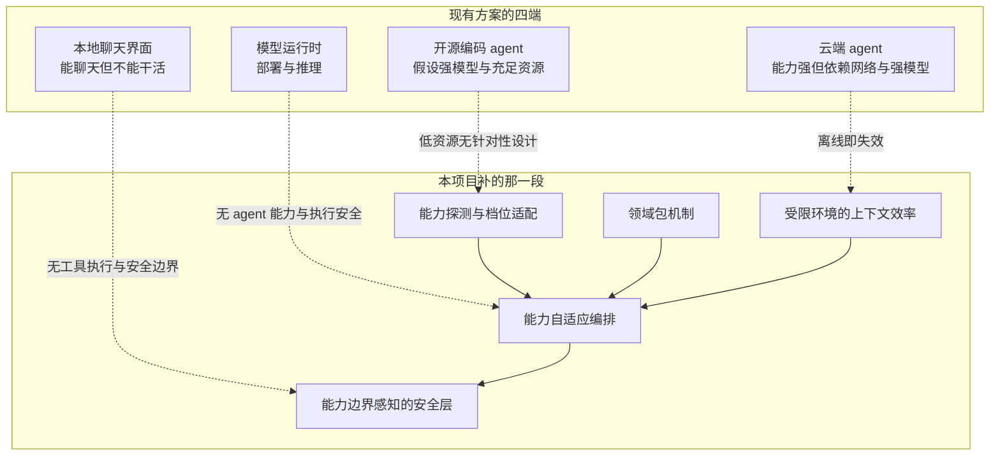

> **读法**：左列是"已经很好、不必重做"的部分（复用）；中间是**本项目的五个自研增量**；
> 虚线是各自缺的那一段。**不做上游 PR 优先**，以集成为主。

### 2.2 A-3 商业模式画布

- **用途**：一眼看清产品"靠什么成立、代价在哪、风险在哪"。
- **读者**：评审者、本人（做取舍时）。
- **维护时点**：定位或范围变化时。

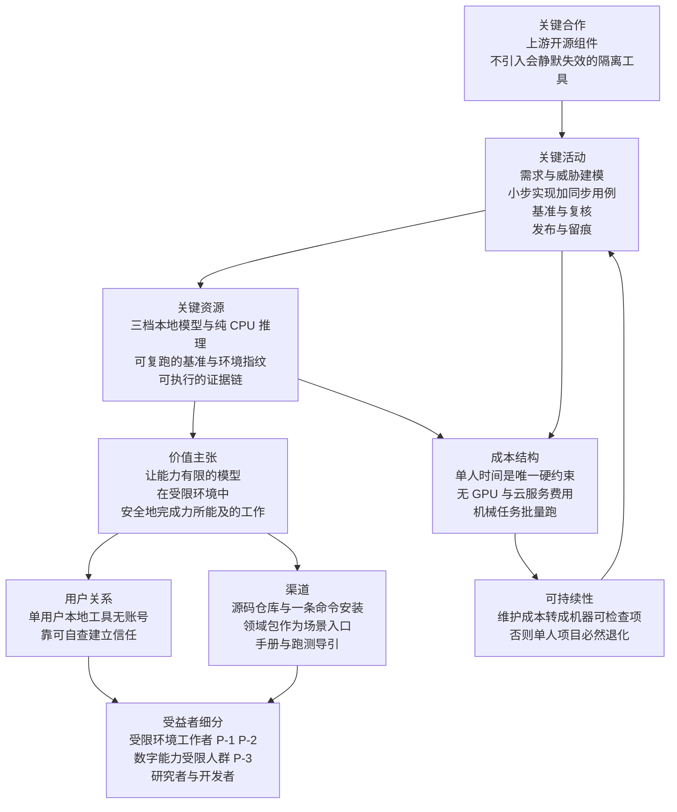

> ⚠️ **两处刻意替换**（非商业项目适配）："收入来源"→**可持续性**；"客户细分"→**受益者细分**。
> 详细九宫格文字见 `01` §2.12。

### 2.3 A-5 干系人与角色关系图

- **用途**：把"谁能碰什么、谁定什么"画出来，避免隐含权限。
- **读者**：实现者（写权限判定时）、评审者。
- **维护时点**：权限模型或角色变化时。

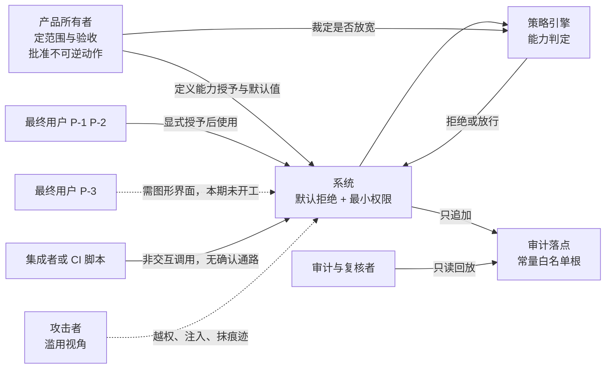

---

## 3. 需求层

### 3.1 B-1 需求追溯链

- **用途**：证明"每条需求都能找到来源，且都有验证方式"（可追溯性的图形化表达）。
- **读者**：评审者。
- **维护时点**：需求增删或来源变化时。

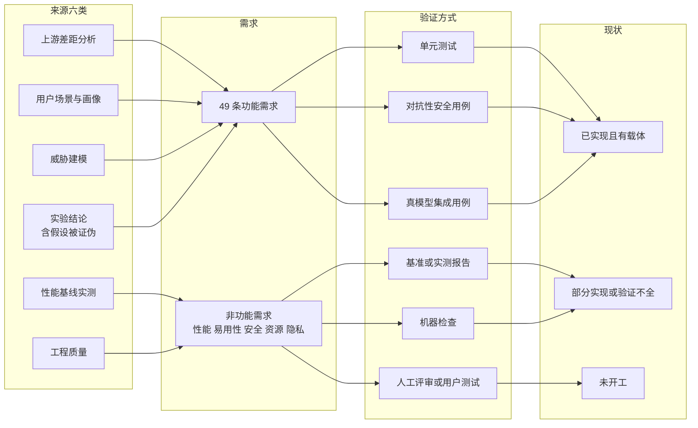

### 3.2 B-2 需求结构树

- **用途**：49 条需求的模块分布与各组现状（**数字对应 `01` §5.3 的统计**）。
- **读者**：评审者、本人（看缺口分布）。
- **维护时点**：需求增删或状态变化时。

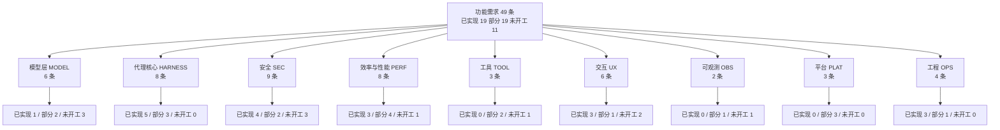

> **读法**：`HARNESS` 与 `OPS` 最完整（内核已跑通、门禁在跑）；
> `SEC` 是**最需要接着做**的一组（3 条未开工且都是安全护栏）；
> `TOOL`/`OBS`/`PLAT` 的未开工项都不是阻塞主线的关键路径。

### 3.3 B-3 优先级矩阵（价值 × 成本）

- **用途**：检查"高价值低成本的先做、低价值高成本的不做"是否成立。
- **读者**：评审者、本人（排期）。
- **维护时点**：优先级调整时。

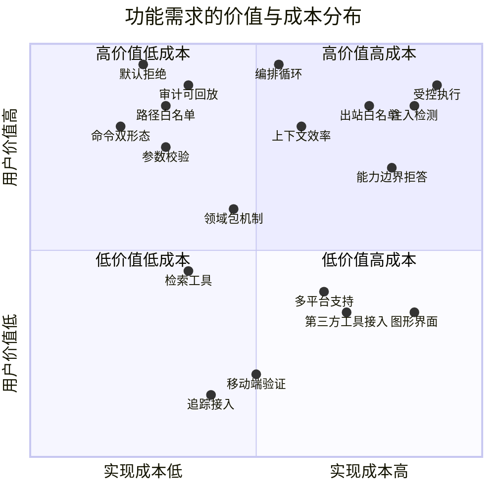

> **读法与结论**：右上角（高价值高成本）集中了**安全护栏**（受控执行、出站白名单、注入检测）——
> 它们同时也是 §5.3 里**未达成的那几项**，说明"高成本项被排在了后面"，
> 这是**刻意的取舍**（先跑通主流程，再补安全），但**必须如实登记为缺口**，
> 不得因为"还没做"而在对外表述中省略。

### 3.4 B-4 需求依赖与冲突图

- **用途**：把"哪条需求卡着别的、哪两条互相拉扯"画出来。
- **读者**：评审者、本人（排期与冲突处置）。
- **维护时点**：冲突处置或依赖变化时。

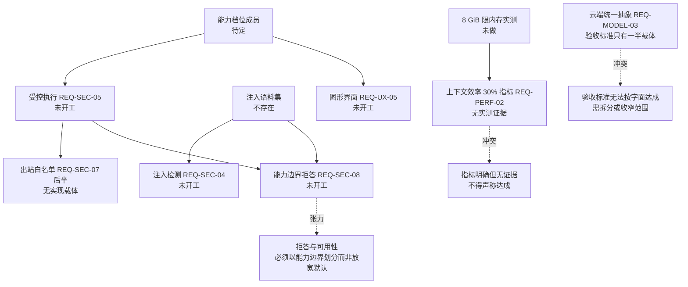

---

## 4. 计划与风险层

### 4.1 F-1 里程碑与版本甘特图

- **用途**：说明"现在到哪、下一步是什么"（**计划值**，非承诺）。
- **读者**：评审者、本人。
- **维护时点**：计划调整时（调整须说明原因）。

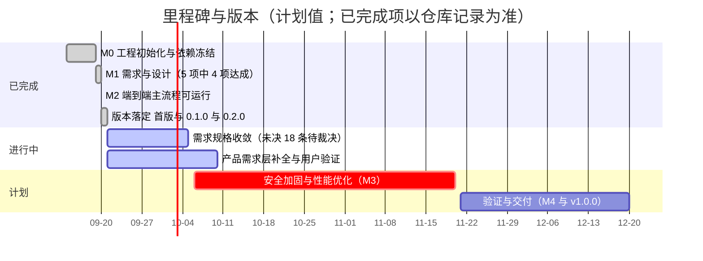

### 4.2 F-2 风险矩阵（概率 × 影响）

- **用途**：风险排布与应对优先级。
- **读者**：评审者、本人。
- **维护时点**：每阶段评审时。

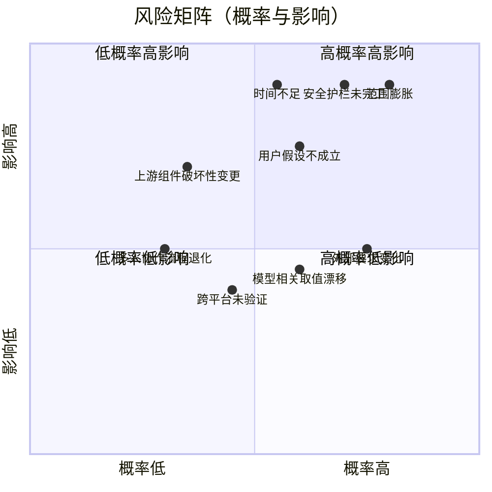

> **右上角四件事**（范围膨胀、时间不足、用户假设不成立、安全护栏未完工）
> 就是本项目的**主要失败模式**；应对分别是：硬边界清单、Must 优先 + 时间盒、
> §2.7.1 的验证计划、以及**把安全缺口如实登记而非掩盖**。

### 4.3 F-3 / F-4 两张分布图

**F-3 威胁状态分布**（安全进度到哪）

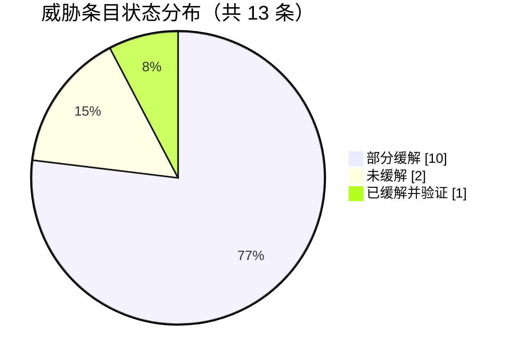

**F-4 需求现状分布**（实现与验证的真实进度）

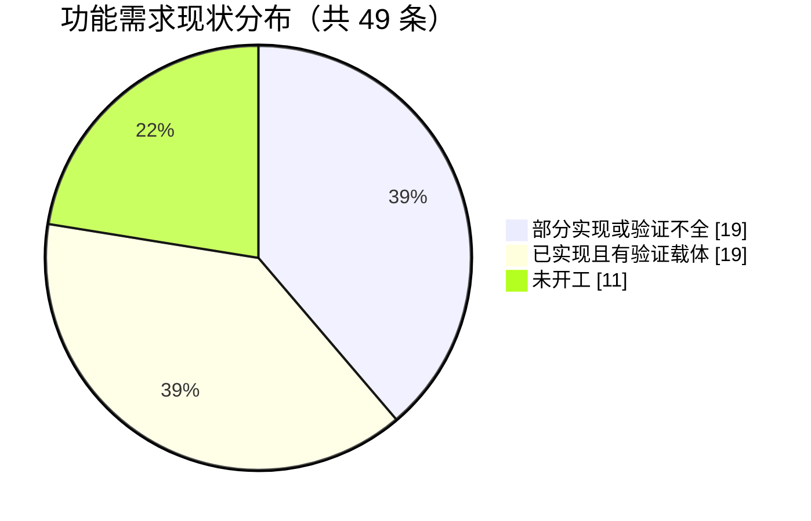

> ⚠️ **这两张图是"防自嗨"的关键图**：`已缓解并验证 = 1 / 13`、`未开工 = 11 / 49`。
> 任何对外汇报都必须能对上这两张图；**数字变化时以权威源为准并同步本图**。
