# 行为与数据图表

> 配套：[`01-需求分析文档.md`](01-需求分析文档.md) · [`04-产品与需求图表.md`](04-产品与需求图表.md)
> 本文件收录**面向设计与实现评审**的图表：时序图、状态机、业务流程图、数据流图、数据模型、结构与部署。
> 图表约定（为什么用 Mermaid、G-1~G-3、自检工具、全项目复用）见 `04` §0。

---

## 1. 图集索引

| 编号 | 图 | 类型 | 回答什么问题 | 位置 | 维护时点 |
| --- | --- | --- | --- | --- | --- |
| **C-1** | 一次多步会话的时序 | sequenceDiagram | 主流程怎么走 | `01` §3.6 | 循环结构变化时 |
| **C-2** | 工具调用决策状态机 | stateDiagram | 判定顺序是否不可绕过 | `01` §3.6 | 判定点变化时 |
| **C-3** | 越权调用被拒的时序 | sequenceDiagram | 拒绝发生在执行之前吗 | 本文件 §2.1 | 拒绝路径变化时 |
| **C-4** | 高危操作审批的时序 | sequenceDiagram | 三选项与"无通路即拒绝" | 本文件 §2.2 | 审批逻辑变化时 |
| **C-5** | 审计写入失败的路径 | sequenceDiagram | 证据面故障会不会被伪装 | 本文件 §2.3 | 审计语义变化时 |
| **C-6** | 会话生命周期状态机 | stateDiagram | 退出码与状态的对应 | 本文件 §2.4 | 退出码变化时 |
| **C-7** | 端到端业务流程图（泳道） | flowchart | 用户到审计的完整链路 | 本文件 §2.5 | 主流程变化时 |
| **D-1** | 数据流图 Level 0 | flowchart | 数据从哪进、往哪出 | 本文件 §3.1 | 新增外部数据源时 |
| **D-2** | 数据流图 Level 1 | flowchart | 配置与授权的分解 | 本文件 §3.2 | 新增配置项时 |
| **D-3** | 事件与审计数据模型 | erDiagram | 事件、审计、会话的关系 | 本文件 §3.3 | 事件字段变化时 |
| **D-4** | 配置与领域包数据模型 | erDiagram | 谁能收窄什么 | 本文件 §3.4 | 配置项变化时 |
| **E-1** | 分层与依赖方向 | flowchart | 谁许依赖谁 | 本文件 §4.1 | 分层变化时 |
| **E-3** | 部署图 | flowchart | 进程与文件的落点 | 本文件 §4.2 | 部署形态变化时 |

### 1.1 时序图的三条共同约定

| # | 约定 | 为什么 |
| --- | --- | --- |
| S-1 | **审计落点总是最后一个参与者** | 让"每一步都要留痕"在图上一眼可见（哪条边没连到审计就是缺口） |
| S-2 | **拒绝分支不经过执行** | 图的形状即断言：`Denied` 不连 `Execute` |
| S-3 | **替身与真实件要标注** | 用例里"注入替身"与"真实落盘"是两回事，图上必须写清，否则会读成"端到端已验证" |

---

## 2. 行为层

### 2.1 C-3 越权调用被拒的时序

- **用途**：说明"**拒绝发生在执行之前**"，且三类拒绝原因**可分**。
- **读者**：实现者、验证者（写对抗性用例时按此图逐分支覆盖）。
- **维护时点**：判定点或原因短码变化时。

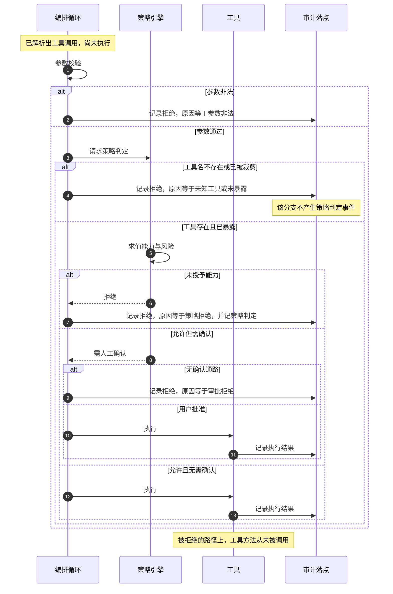

### 2.2 C-4 高危操作审批的时序

- **用途**：固定"三种选择 + 风险说明来自策略引擎（不是模型自述）"以及"无通路即拒绝"。
- **读者**：实现者、UI/提示文案作者。
- **维护时点**：审批交互或确认通路变化时。

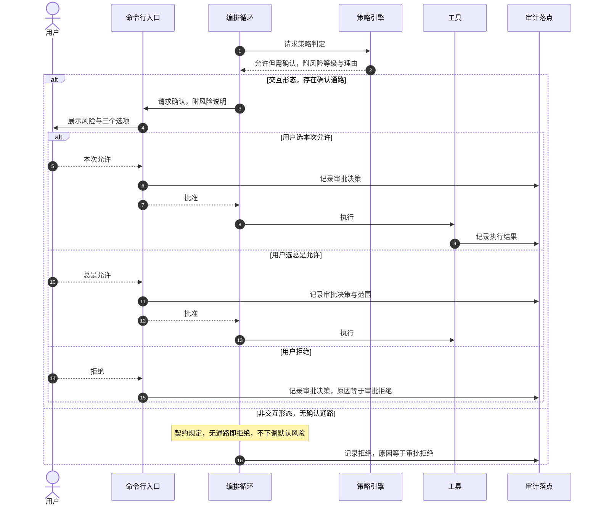

### 2.3 C-5 审计写入失败的路径（含**已登记的缺口**）

- **用途**：把"证据面故障"的处置画清楚，并**显式标出当前未闭合的那一处**。
- **读者**：实现者、评审者（这条是已登记待裁的契约缺口）。
- **维护时点**：该缺口的处置落定后**必须回头看这张图**。

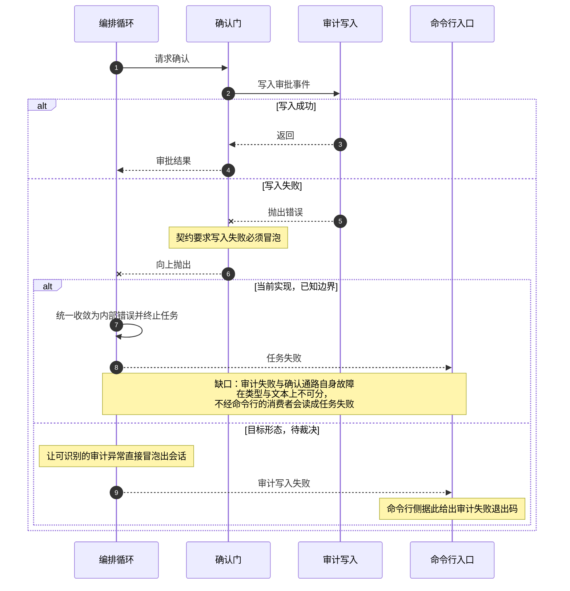

> ⚠️ **本图刻意画出"当前实现"与"目标形态"两条**。在裁决落定前，
> **不得**按目标形态表述，也不得声称该缺口已闭合（出处见 `01` §3.4 的 F-10 与 §7.2-④）。

### 2.4 C-6 会话生命周期状态机

- **用途**：把**退出码**与**状态**一一对应，防止"失败"与"步数用尽"被混为一谈。
- **读者**：集成者、脚本作者、实现者。
- **维护时点**：退出码或终止语义变化时。

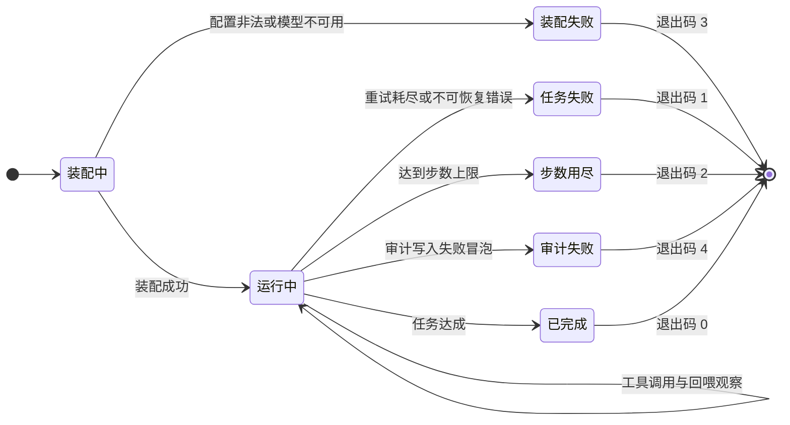

> **读法**：**步数用尽（2）不是失败**——它是"按预算正常停下"；
> 把它与"任务失败（1）"合并会让自动化脚本无法区分"该加预算"与"该排查"。

### 2.5 C-7 端到端业务流程图（泳道近似）

- **用途**：一眼看清"用户 → 系统 → 策略 → 工具 → 审计"的完整链路与责任边界。
- **读者**：评审者、新接入的人。
- **维护时点**：主流程变化时。

> Mermaid 无原生泳道图，此处用**子图分道**近似表达。

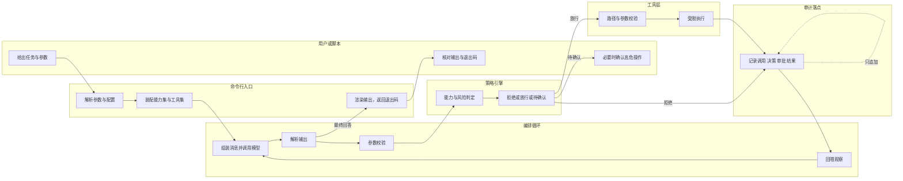

---

## 3. 数据层

### 3.1 D-1 数据流图 Level 0（上下文）

- **用途**：界定系统的数据边界：**什么数据进来、什么数据出去、存了什么**。
- **读者**：评审者（看信任边界）、实现者。
- **维护时点**：新增外部数据源或输出通道时。

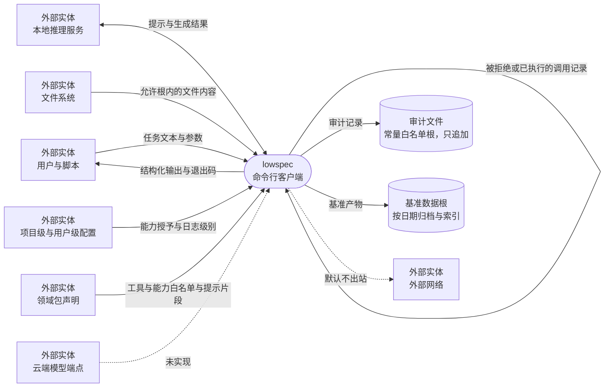

**DFD 约定对照**（便于评审者按标准读图）

| 形状 | 含义 | 本项目实例 |
| --- | --- | --- |
| 圆角矩形 | 处理（process） | `lowspec 命令行客户端` |
| 直角矩形 | 外部实体（external entity） | 用户、推理服务、文件系统、配置、领域包 |
| 圆柱 | 数据存储（data store） | 审计文件、基准数据根 |
| 带标签箭头 | 数据流（data flow） | `任务文本与参数`、`审计记录` |
| 虚线箭头 | 规划中 / 默认拒绝 | 云端端点、外部网络 |

### 3.2 D-2 数据流图 Level 1（配置与授权的分解）

- **用途**：把最关键的一组数据流——**"谁能收窄什么"**——拆开画清楚。
- **读者**：实现者（写配置与权限代码时）、验证者。
- **维护时点**：新增配置项或权限来源时。

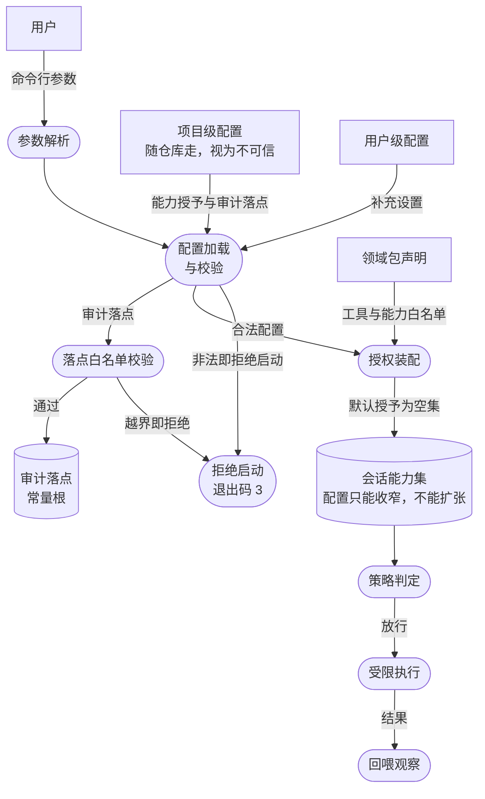

> **读法（本图最关键的一条）**：`配置只能收窄，不能扩张` ——
> 项目级配置**随仓库走**，属不可信输入；因此它**只能从"已授予集合"里减**，
> 不能凭空增加权限。这条决定了"伪造一份配置文件"不构成提权路径。

### 3.3 D-3 事件与审计数据模型

- **用途**：说明会话、事件、审计记录三者的关系与关键字段。
- **读者**：实现者、审计消费者。
- **维护时点**：事件字段或审计契约变化时。

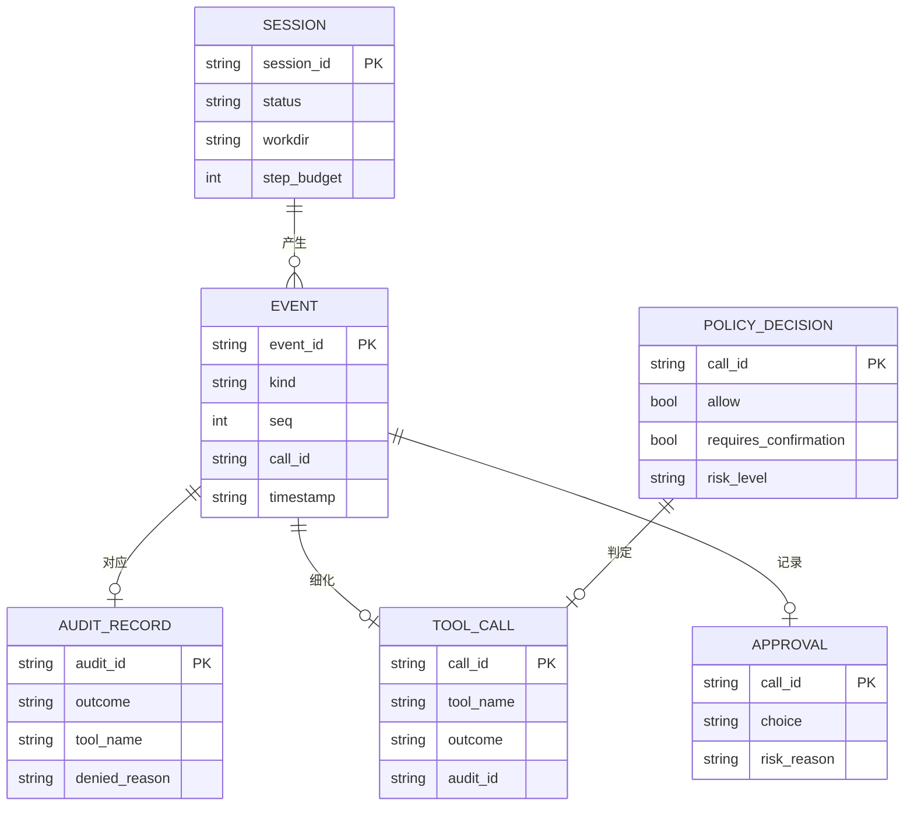

> **两条契约级约束（图中看不见但必须写清）**：
> ① **`denied_reason` 是定长闭集短码**（不含不可信内容）——它保证审计可被机器分类；
> ② **`outcome` 区分"未执行"与"执行失败"**——否则"拒绝了"和"跑了但报错"在审计里同形。

### 3.4 D-4 配置与领域包数据模型

- **用途**：说明配置的三层来源及其**权限方向**（只能收窄）。
- **读者**：实现者、用户（写配置时）。
- **维护时点**：配置 schema 变化时。

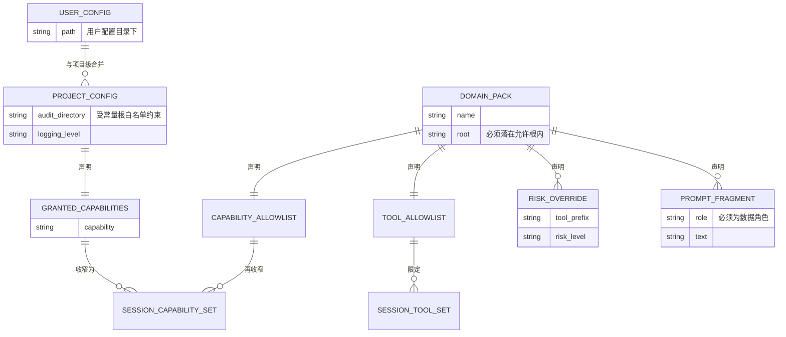

> ⚠️ **领域包按不可信输入对待**：`root` 必须经路径白名单校验；
> **未知键/未知段一律拒绝**；包内出现 Python 内容即拒绝加载（此约束在 `01` §3.2 的 `REQ-HARNESS-08` 与相关安全需求中）。

---

## 4. 结构与部署层

### 4.1 E-1 分层与依赖方向

- **用途**：说明"谁许依赖谁"，以及哪些依赖**会被机器检查判红**。
- **读者**：实现者（写代码前必读）。
- **维护时点**：分层变化时（**属架构变更，须先有决策记录**）。

> ⚠️ **本图是简化视图**：层名与依赖白名单的**权威源在项目架构文档与分层机器检查**，
> 本图只用于本交付包的阅读，**不得**据本图改代码或判违规。

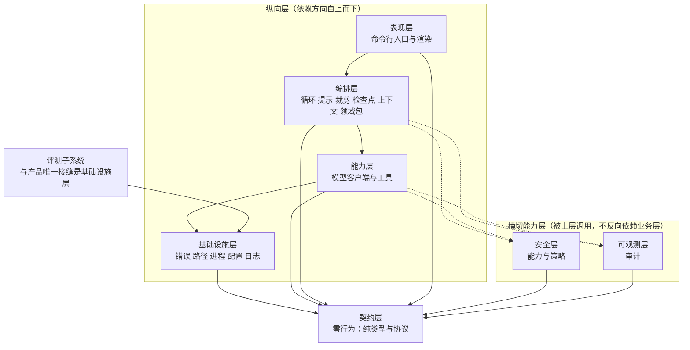

> **一条硬约束（图上画不出，但必须记住）**：**基础设施层不得反向依赖可观测层**。
> 这条不是风格偏好，而是**会被机器检查判红**的规则——它曾拦下过一个"让最底层直接写审计"的设计。

### 4.2 E-3 部署图

- **用途**：说明"跑起来之后，进程与文件分别落在哪里"，用于排障与安全评估。
- **读者**：运维/使用者、评审者。
- **维护时点**：部署形态变化时。

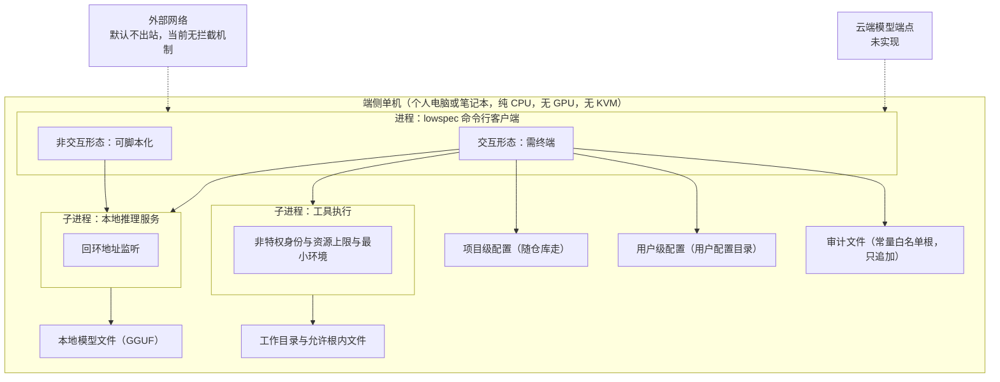

> **部署层的三条安全含义**：
> ① 推理服务**只监听回环**，不对外暴露端口；
> ② 工具执行是**独立子进程**且带非特权身份与资源上限；
> ③ 审计文件落在**常量白名单根**内 —— 即使项目级配置被伪造，也改不了它的位置。
